# Clawser Architecture

## System Overview

Clawser is a browser-native AI agent platform built as pure ES modules with no bundler or build step. The browser serves as the operating system: OPFS for persistence, Fetch for network, DOM for UI, and Web APIs for everything else.

```
┌─────────────────────────────────────────────────────────────────┐
│                        index.html (SPA)                          │
│  ┌──────────┐ ┌──────────┐ ┌──────────┐ ┌────────────────────┐ │
│  │ Chat UI  │ │ Panel UI │ │  Router  │ │   Shell / CLI      │ │
│  └────┬─────┘ └────┬─────┘ └────┬─────┘ └────────┬───────────┘ │
│       │             │            │                 │             │
│  ┌────┴─────────────┴────────────┴─────────────────┴───────────┐│
│  │              clawser-app.js (orchestrator)                   ││
│  │  Workspace lifecycle · Tool registration · Event bus         ││
│  └──────────┬───────────────────────────────────────────────────┘│
│             │                                                    │
│  ┌──────────┴──────────────────────────────────────────────────┐│
│  │                    ClawserAgent                              ││
│  │  ┌──────────┐ ┌───────────┐ ┌──────────┐ ┌──────────────┐  ││
│  │  │ EventLog │ │ Hook      │ │ Autonomy │ │ Memory/Goals │  ││
│  │  │ (JSONL)  │ │ Pipeline  │ │ Control  │ │ /Scheduler   │  ││
│  │  └──────────┘ └───────────┘ └──────────┘ └──────────────┘  ││
│  └──────┬────────────────┬──────────────────────┬──────────────┘│
│         │                │                      │               │
│  ┌──────┴──────┐  ┌──────┴──────┐  ┌───────────┴────────────┐  │
│  │  Providers  │  │   Tools     │  │       Skills            │  │
│  │  (38+ LLMs) │  │  (70+ tools)│  │  (agentskills.io)      │  │
│  └──────┬──────┘  └──────┬──────┘  └───────────┬────────────┘  │
│         │                │                      │               │
│  ┌──────┴──────┐  ┌──────┴──────┐  ┌───────────┴────────────┐  │
│  │  SSE/REST   │  │ Browser API │  │   OPFS + CDN (vimble)  │  │
│  │  (LLM APIs) │  │ (OPFS/DOM)  │  │                        │  │
│  └─────────────┘  └─────────────┘  └────────────────────────┘  │
└─────────────────────────────────────────────────────────────────┘
```

## Core Agent

**File**: `clawser-agent.js` (2,447 LOC)

The agent core contains four classes:

### EventLog

Append-only event store for conversation persistence. Events are immutable records with type, data, source, and timestamp.

```
user_message → agent_message → tool_call → tool_result → ...
```

Key operations:
- `append(type, data, source)` — Record event
- `deriveSessionHistory(systemPrompt)` — Reconstruct LLM message history
- `deriveToolCallLog()` — Build tool audit trail
- `toJSONL()` / `fromJSONL()` — Serialize to/from JSONL format

Event types: `user_message`, `agent_message`, `tool_call`, `tool_result`, `goal_added`, `goal_updated`, `memory_stored`, `memory_forgotten`, `scheduler_added`, `scheduler_fired`, `context_compacted`, `error`, `autonomy_blocked`, `cache_hit`

### HookPipeline

Extensible lifecycle interception at 6 points:
1. `beforeInbound` — Validate user messages
2. `beforeToolCall` — Block/modify tool calls
3. `beforeOutbound` — Validate responses
4. `transformResponse` — Reshape LLM output
5. `onSessionStart` — Initialization
6. `onSessionEnd` — Cleanup

### AutonomyController

Capability boundaries and rate limits:
- **Levels**: `readonly` (read tools only), `supervised` (non-read needs approval), `full` (unrestricted)
- **Rate limiting**: Per-hour action count, per-day cost in cents
- **Integration**: Checked before every tool execution

### ClawserAgent

Main orchestrator managing:
- **Run loop** (`run()` / `runStream()`) — Up to 20 iterations of LLM call → tool execution
- **Dual execution paths** — Native tool calls (OpenAI/Anthropic) or Codex code blocks (Chrome AI, etc.)
- **Context compaction** — Auto-triggers at ~12K tokens, LLM-based summarization with truncation fallback
- **Persistence** — v2 event-sourced (OPFS directory with meta.json + events.jsonl), v1 checkpoint fallback
- **Memory** — Store/recall/forget with sync TF-IDF and async BM25+vector search
- **Goals** — Add/update/complete with event log tracking
- **Scheduler** — Once/interval/cron with full 5-field cron parser

## Provider System

**File**: `clawser-providers.js` (1,474 LOC)

### Three Tiers

```
Tier 1 (Built-in)          Tier 2 (OpenAI-Compatible)       Tier 3 (ai.matey)
┌─────────────────┐        ┌─────────────────────────┐      ┌──────────────┐
│ EchoProvider     │        │ OpenAICompatibleProvider │      │ MateyProvider│
│ ChromeAIProvider │        │   baseUrl configurable   │      │  CDN lazy    │
│ OpenAIProvider   │        │   Groq, OpenRouter,      │      │  load 24+    │
│ AnthropicProvider│        │   Together, Fireworks,    │      │  backends    │
└─────────────────┘        │   Mistral, DeepSeek,     │      └──────────────┘
                            │   xAI, Perplexity,       │
                            │   Ollama, LM Studio      │
                            └─────────────────────────┘
```

### Key Features
- **SSE streaming** — `readSSE()` (OpenAI format), `readAnthropicSSE()` (Anthropic format)
- **Response cache** — LRU (500 entries) + TTL (30 min), FNV-1a hash keys, skips tool_call responses
- **Cost tracking** — Per-token pricing table with `estimateCost(model, usage)`
- **Error classification** — rate_limit > server > auth > network > client > unknown, with retryability flags
- **Response normalization** — Validates shape, remaps OpenAI token fields to internal format

## Tool System

**File**: `clawser-tools.js` (1,373 LOC)

### Permission Engine

```
Tool defines permission level → Registry checks override → Enforces policy
     'internal'                    getPermission(name)        'auto' → execute
     'read'                        (localStorage override)    'approve' → ask user
     'network'                                                'denied' → reject
     'write'
     'browser'
```

Default mapping:
- `internal`, `read` → `auto` (always allowed)
- `network`, `write`, `browser` → `approve` (requires user confirmation)

### Tool Categories (29 tools)

| Category | Tools |
|----------|-------|
| Network | FetchTool (domain allowlist), WebSearchTool (DuckDuckGo) |
| DOM | DomQueryTool (CSS selectors), DomModifyTool (XSS prevention) |
| OPFS | FsReadTool (50MB max), FsWriteTool (10MB max), FsListTool, FsDeleteTool |
| Storage | StorageGetTool, StorageSetTool, StorageListTool (blocks clawser_* keys) |
| Clipboard | ClipboardReadTool, ClipboardWriteTool |
| Navigation | NavigateTool (http/https only), NotifyTool |
| Code | EvalJsTool (global scope) |
| Media | ScreenshotTool (html2canvas CDN), ScreenInfoTool |
| Agent | Memory (3), Goal (2), Scheduler (3), User Question (1), Agent Management (2) |

Plus 36 tools from feature modules (tool builder, channels, delegate, git, browser automation, sandbox, hardware, remote, mount) and dynamic MCP/skill tools.

## Codex (Code Execution)

**File**: `clawser-codex.js` (292 LOC)

For providers that don't support native tool calling (Chrome AI, Perplexity), the Codex executes JavaScript code blocks from LLM responses in a sandboxed environment.

```
LLM Response → Extract code blocks → Adapt Pythonisms → Auto-await
     → Execute in sandbox → Capture results → Follow-up LLM call
```

The Codex uses **andbox** (`web/packages/andbox/`) — a Worker-based sandbox with RPC capabilities, import maps, timeouts, and capability gating. Browser tools are exposed as host capabilities callable via `host.call()`, with `print()` and `fetch()` injected as local functions.

## Skills System

**File**: `clawser-skills.js` (1,526 LOC)

Implements the [Agent Skills open standard](https://agentskills.io).

### Skill Structure
```
skill-name/
  SKILL.md          # YAML frontmatter + markdown body
  scripts/          # Executable JS (run in vimble sandbox)
  references/       # Supporting docs
  assets/           # Static files
```

### Lifecycle
```
Discover (OPFS scan) → Enable/Disable (localStorage)
     → Activate (load body + scripts + references)
     → Register script tools → Inject into system prompt
     → Deactivate (unregister tools, clean up)
```

### Storage Scoping
- **Global**: `clawser_skills/{name}/`
- **Workspace**: `clawser_workspaces/{wsId}/.skills/{name}/` (overrides global)

### Remote Registry
`SkillRegistryClient` fetches from GitHub-hosted index, supports search, install, and update checking with semver comparison.

## MCP Integration

**File**: `clawser-mcp.js` (303 LOC)

Model Context Protocol client using Streamable HTTP transport:

```
McpManager → McpClient(s) → JSON-RPC over HTTP
     ↓              ↓
  Route tool    Connect / Discover / Call
  calls to       tools via RPC
  correct
  server
```

Tools are prefixed `mcp_*` and have `network` permission level.

## State Management

**File**: `clawser-state.js` (171 LOC)

Global singleton with ~55 fields covering agent, conversations, tools, skills, UI state, and 25+ feature module references. Cross-module communication via a simple event bus (`on`/`off`/`emit`).

All persistent state uses workspace-scoped localStorage keys built by `lsKey` helpers (e.g., `clawser_memories_{wsId}`).

## Routing

**File**: `clawser-router.js` (91 LOC)

Hash-based SPA routing:
```
#home                              → Home view (workspace list)
#workspace/{wsId}                  → Workspace view (default: chat panel)
#workspace/{wsId}/{panel}          → Specific panel
#workspace/{wsId}/conversation/{id}→ Specific conversation
```

12 panels: chat, tools, files, memory, goals, events, skills, terminal, dashboard, toolMgmt, agents, config

## Shell

**File**: `clawser-shell.js` (1,124 LOC) + `clawser-shell-builtins.js` (~1,500 LOC)

AST-based virtual shell:
```
Input → Tokenizer → Parser (recursive descent) → Executor
```

Supports: pipes (`|`), redirects (`>`, `>>`), logical operators (`&&`, `||`, `;`), quoting, escape sequences, 59 built-in commands, and OPFS file operations.

## Persistence Strategy

```
┌─────────────────────────────────────┐
│          OPFS (Primary)              │
│  /clawser_workspaces/{wsId}/         │
│    .conversations/{convId}/          │
│      meta.json                       │
│      events.jsonl                    │
│    .checkpoints/latest.bin           │
│    .skills/{name}/SKILL.md           │
│  /clawser_skills/{name}/SKILL.md     │
├─────────────────────────────────────┤
│        localStorage (Config)         │
│  clawser_memories_{wsId}             │
│  clawser_config_{wsId}               │
│  clawser_tool_perms_{wsId}           │
│  clawser_skills_enabled_{wsId}       │
│  clawser_workspaces (workspace list) │
│  clawser_active_workspace            │
│  + 8 more per-workspace keys         │
├─────────────────────────────────────┤
│     Migration / Fallback Chain       │
│  v2 (OPFS dir) → v1 (OPFS file)     │
│    → v0 (binary checkpoint)          │
│  Auto-migrates on first restore      │
└─────────────────────────────────────┘
```

## Data Flow

### Message Processing
```
User Input
  → sendMessage() [ui-chat]
  → Skill detection (/skill-name prefix)
  → Intent classification (non-critical)
  → Safety checks (input sanitization)
  → Context compaction (if >12K tokens)
  → agent.runStream() [agent core]
      → AutonomyController.checkLimits()
      → HookPipeline.run('beforeInbound')
      → Provider.chatStream() [providers]
      → If tool_calls:
          → HookPipeline.run('beforeToolCall')
          → BrowserToolRegistry.execute() [tools]
          → Record to EventLog
          → Loop (max 20 iterations)
      → HookPipeline.run('beforeOutbound')
      → Yield stream chunks to UI
  → Persist conversation [OPFS]
  → Update cost meter [ui]
```

### Workspace Initialization
```
handleRoute()
  → initWorkspace(wsId)
      → Create ClawserAgent with dependencies
      → agent.init()
      → Register ~70 tools (browser + feature + skill + gap-fill)
      → Create shell session + terminal session manager
      → Restore config, memories, conversations (event log → checkpoint fallback)
      → Build provider chain, start daemon/routines
      → Discover skills, render UI
      → Set status "ready"
```

## Module Dependencies

```
index.html
  └─ clawser-app.js
       ├─ clawser-state.js (global state, event bus)
       ├─ clawser-router.js (SPA routing)
       ├─ clawser-agent.js (agent core)
       │    ├─ clawser-codex.js (code execution)
       │    ├─ clawser-safety.js (input/output scanning)
       │    ├─ clawser-memory.js (semantic recall)
       │    ├─ clawser-self-repair.js (stuck detection)
       │    └─ clawser-undo.js (turn checkpoint)
       ├─ clawser-providers.js (LLM providers)
       ├─ clawser-tools.js (browser tools)
       ├─ clawser-mcp.js (MCP client)
       ├─ clawser-skills.js (skills system)
       ├─ clawser-shell.js + clawser-shell-builtins.js
       ├─ clawser-cli.js (CLI subcommands)
       ├─ clawser-ui-chat.js (chat rendering)
       ├─ clawser-ui-panels.js (panel rendering)
       ├─ clawser-item-bar.js (list component)
       ├─ clawser-terminal-sessions.js (session management)
       ├─ clawser-agent-ref.js (@agent dispatch)
       ├─ clawser-agent-storage.js (agent definitions)
       └─ 30+ feature modules (goals, delegate, git, etc.)
```

## External Dependencies

Clawser has no npm dependencies. All external code is loaded via CDN at runtime:

| Dependency | Source | Purpose |
|------------|--------|---------|
| andbox | `web/packages/andbox/` | Worker-based sandboxed JS execution (local package) |
| wsh | `web/packages/wsh/` | Web Shell — remote command execution over WebTransport/WebSocket (local package) |
| vimble | esm.sh | Legacy sandboxed JS code execution |
| ai.matey | esm.sh | Universal LLM adapter (Tier 3 providers) |
| html2canvas | CDN | Screenshot tool |
| fflate | esm.sh | ZIP import/export for skills |

## Security Model

- **Tool permissions**: 3 levels (auto/approve/denied) per tool, persisted per workspace
- **Autonomy levels**: readonly/supervised/full with rate and cost limiting
- **Domain allowlist**: Restrict FetchTool to approved domains
- **File size limits**: OPFS write capped at 10MB (configurable)
- **Storage key protection**: `clawser_*` prefix blocked from agent read/write
- **XSS prevention**: Sanitizer API + fallback stripping for DOM modifications
- **URL scheme validation**: NavigateTool only allows http/https
- **Hook pipeline**: beforeToolCall hook can block any tool execution
- **Workspace isolation**: Separate state, memory, and permissions per workspace

## Module Dependency Graph

```mermaid
graph TD
    HTML["index.html"] --> APP["clawser-app.js"]

    APP --> STATE["clawser-state.js"]
    APP --> ROUTER["clawser-router.js"]
    APP --> AGENT["clawser-agent.js"]
    APP --> PROVIDERS["clawser-providers.js"]
    APP --> TOOLS["clawser-tools.js"]
    APP --> MCP["clawser-mcp.js"]
    APP --> SKILLS["clawser-skills.js"]
    APP --> SHELL["clawser-shell.js"]
    APP --> CLI["clawser-cli.js"]
    APP --> UI_CHAT["clawser-ui-chat.js"]
    APP --> UI_PANELS["clawser-ui-panels.js"]
    APP --> ITEM_BAR["clawser-item-bar.js"]
    APP --> TERM["clawser-terminal-sessions.js"]
    APP --> AGENT_REF["clawser-agent-ref.js"]
    APP --> AGENT_STORE["clawser-agent-storage.js"]
    APP --> FEATURES["30+ feature modules"]

    AGENT --> CODEX["clawser-codex.js"]
    AGENT --> SAFETY["clawser-safety.js"]
    AGENT --> MEMORY["clawser-memory.js"]
    AGENT --> SELF_REPAIR["clawser-self-repair.js"]
    AGENT --> UNDO["clawser-undo.js"]
    AGENT --> STATE

    CODEX --> TOOLS
    SHELL --> BUILTINS["clawser-shell-builtins.js"]
    SHELL --> TOOLS
    SKILLS --> TOOLS
    SKILLS --> STATE
    CLI --> STATE

    UI_CHAT --> STATE
    UI_PANELS --> STATE
    ROUTER --> STATE

    style HTML fill:#e1f5fe
    style APP fill:#fff3e0
    style AGENT fill:#e8f5e9
    style PROVIDERS fill:#fce4ec
    style TOOLS fill:#f3e5f5
    style SKILLS fill:#fff8e1
    style SHELL fill:#e0f2f1
```


