# Clawser

Browser-native AI agent workspace with tools, memory, and goals.

**Live demo:** https://johnhenry.github.io/clawser/

Clawser is a pure JavaScript agent platform that runs entirely in the browser. It provides a complete agent runtime with persistent memory, goal tracking, scheduled tasks, ~100 tools, and support for 38+ LLM backends — all without a server.

## Screenshots

<table>
<tr>
<td width="50%">

**Home Screen** — Workspace cards and account management
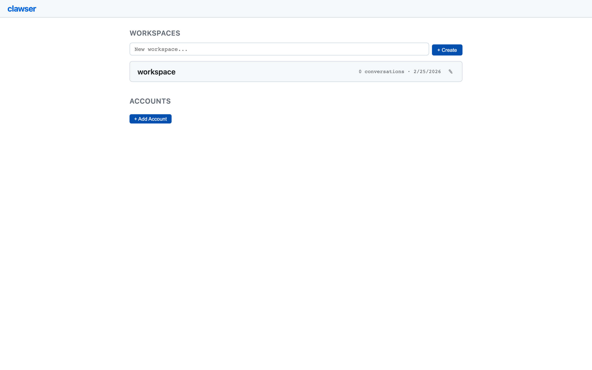

</td>
<td width="50%">

**Chat Interface** — Conversation with sidebar navigation and status badges
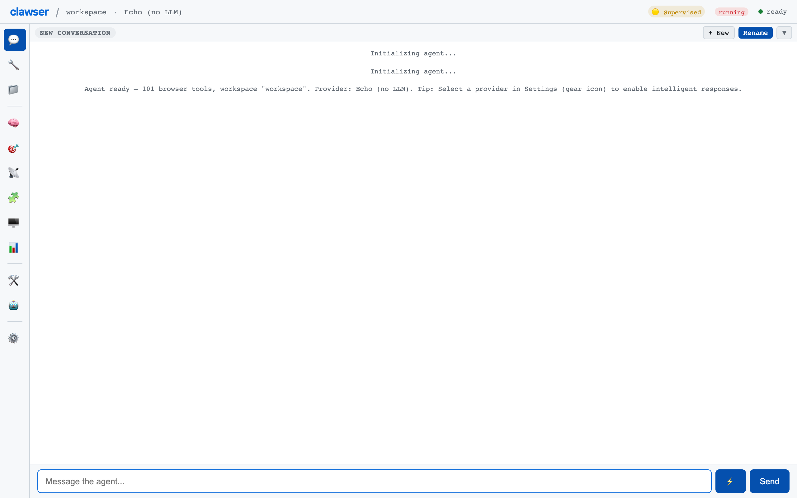

</td>
</tr>
</table>

## Features

### Core Agent

- **Multi-Provider LLM Support** — 3-tier provider system: built-in (OpenAI, Anthropic, Chrome AI, Echo), OpenAI-compatible (Groq, OpenRouter, Together, Fireworks, Mistral, DeepSeek, xAI, Perplexity, Ollama, LM Studio), and ai.matey (24+ backends via CDN)
- **Dual Tool Calling** — Native structured tool_calls for OpenAI/Anthropic/Groq, code-based execution via Codex for Chrome AI and non-native providers
- **Streaming** — Progressive token rendering with async generator-based streaming and blinking cursor animation. Falls back to non-streaming for unsupported providers
- **Context Compaction** — Automatic context window management via LLM-based summarization with truncation fallback. Auto-triggers at ~12K tokens
- **Event-Sourced Persistence** — Full conversation history stored as append-only JSONL in OPFS. Fork, replay, export, and reconstruct any conversation
- **Checkpoint / Restore** — Agent state checkpointed to OPFS with 3-level fallback hierarchy (v2 OPFS dir, v1 OPFS file, v0 binary)
- **Response Caching** — LRU cache (500 entries, 30-minute TTL) to avoid redundant API calls
- **Cost Tracking** — Per-model pricing table with `estimateCost()`, session cost meter, and per-conversation cost display
- **Error Classification** — 9 error categories with retryability flags for intelligent error handling

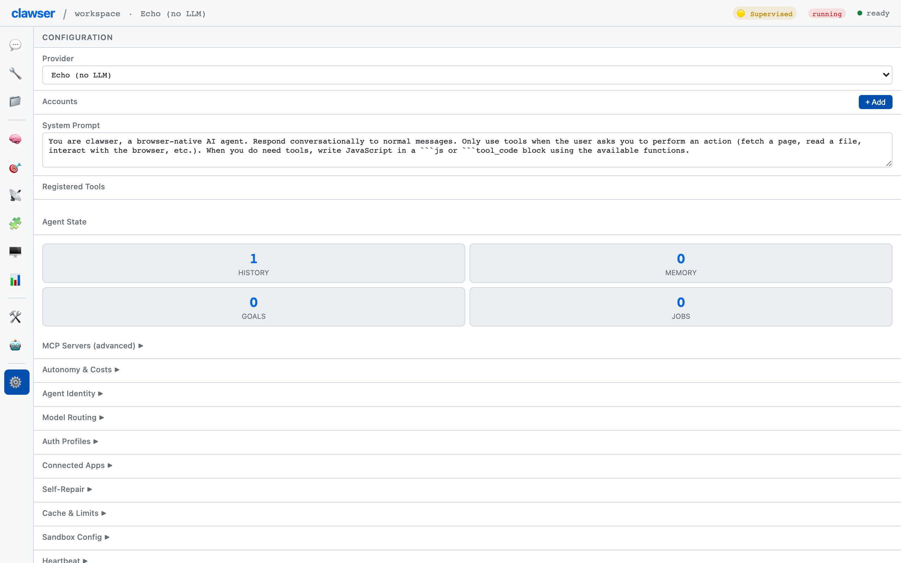

### Agent Intelligence

- **Memory System** — Persistent semantic memory with sync TF-IDF and async BM25+vector recall, automatic deduplication, hygiene, and configurable categories (core, learned, user, context)
- **Goal Tracking** — Hierarchical goals with status tracking, progress bars, artifact links, and sub-goal support
- **Intent Routing** — Message classification system that routes user input to appropriate handlers
- **Self-Repair** — Stuck detection and automatic recovery when the agent enters error loops
- **Heartbeat** — Periodic health checks to monitor agent liveness

<table>
<tr>
<td width="50%">

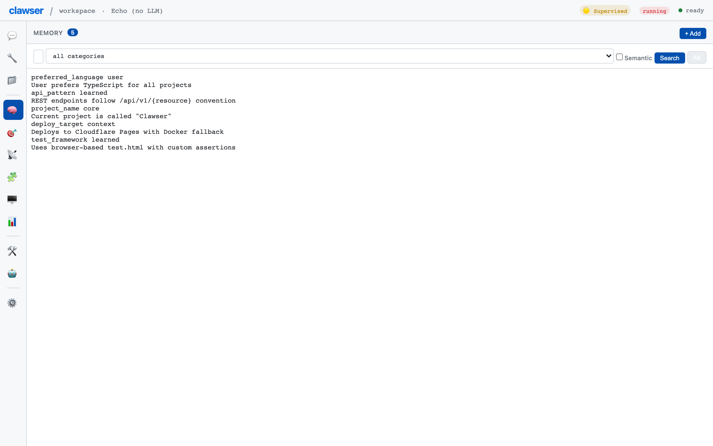

</td>
<td width="50%">

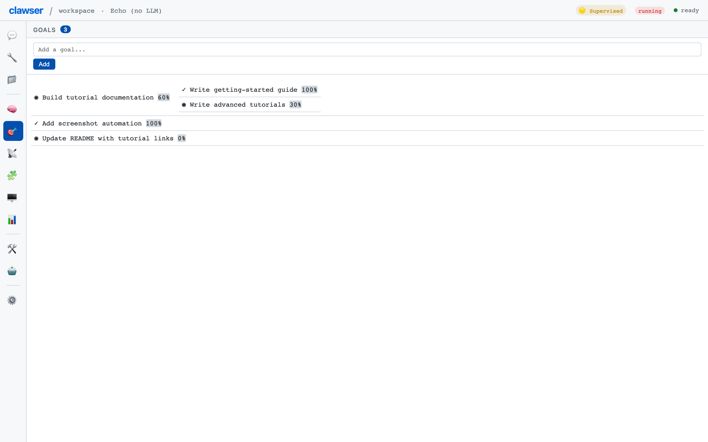

</td>
</tr>
</table>

### Autonomy & Safety

- **Autonomy Controls** — Three levels (readonly, supervised, full) with configurable per-hour rate limits and per-day cost limits
- **Hook Pipeline** — 6 lifecycle interception points (pre-send, post-send, pre-tool, post-tool, pre-response, post-response)
- **Safety / Sanitization** — Input sanitization and output scanning to detect and prevent unsafe content
- **Permission System** — Per-tool permissions (auto, approve, denied) persisted per-workspace in localStorage

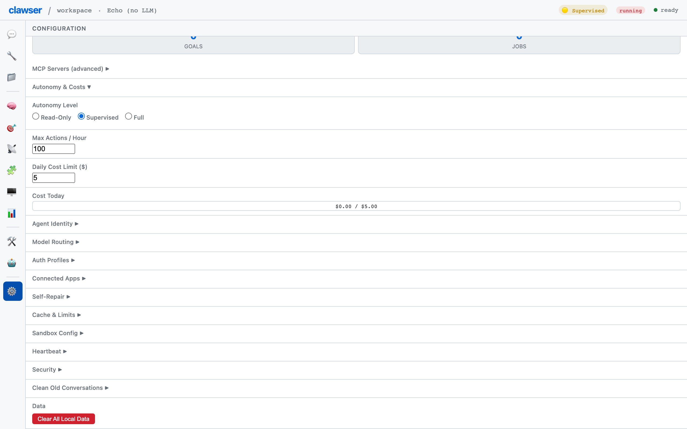

### Tools (~100)

- **Network** — `fetch` (with domain allowlist), `web_search` (DuckDuckGo)
- **DOM** — `dom_query`, `dom_modify` (with XSS sanitization fallback)
- **File System** — `fs_read`, `fs_write`, `fs_list`, `fs_delete` (OPFS with file size limits)
- **Storage** — `storage_get`, `storage_set`, `storage_list` (localStorage)
- **Clipboard** — `clipboard_read`, `clipboard_write`
- **Navigation** — `navigate`, `notify` (browser notifications)
- **Code Execution** — `eval_js` (requires approval), Codex sandbox (vimble, 30s timeout)
- **Media** — `screenshot` (html2canvas), `screen_info`
- **Memory** — `memory_store`, `memory_recall`, `memory_forget`
- **Goals** — `goal_add`, `goal_update`
- **Scheduler** — `schedule_add`, `schedule_list`, `schedule_remove`
- **Skills** — `activate_skill`, `deactivate_skill`, `skill_search`, `skill_install`, `skill_update`, `skill_remove`, `skill_list`
- **Agents** — `switch_agent`, `consult_agent`, `ask_user_question`
- **Shell** — `shell_exec`
- **MCP** — Dynamic tools from connected MCP servers (prefixed `mcp_*`)
- **Delegation** — Sub-agent delegation for complex multi-step tasks
- **Tool Builder** — Dynamic tool creation at runtime via agent
- **wsh** — `wsh_connect`, `wsh_exec`, `wsh_fetch`, `wsh_upload`, `wsh_download`, `wsh_pty_open`, `wsh_pty_write`, `wsh_disconnect`, `wsh_sessions`, `wsh_mcp_call` (remote shell, file transfer, CORS proxy)
- **Daemon** — `daemon_status`, `daemon_checkpoint`
- **Auth** — `auth_list_profiles`, `auth_switch_profile`
- **Undo** — Turn-based undo checkpoints for file and memory operations
- **Routines** — Event-driven automation with cron, event, and webhook triggers
- **Browser Automation** — Page observation, element resolution, automated interaction

<table>
<tr>
<td width="50%">

**Browser Tools** — 101 tools with permission badges and category grouping
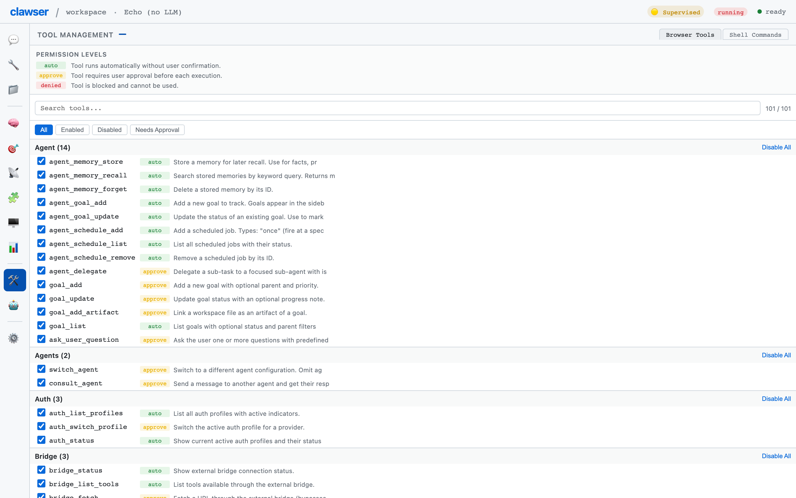

</td>
<td width="50%">

**Shell Commands** — Browsable interface for all CLI commands and builtins


</td>
</tr>
</table>

### Agent System

- **Configurable Agents** — Multiple named agent definitions with custom system prompts, provider overrides, and tool restrictions. 5 built-in starter agents
- **@agent References** — Inline sub-conversations via `@agent-name` syntax with circular reference detection (max depth 3) and visited-set tracking
- **Agent Picker** — Header dropdown to switch between agent definitions
- **Agent Import/Export** — Share agent configurations across workspaces
- **Identity System** — Agent identity compilation combining base prompt, memories, goals, skill metadata, and active skill bodies


### Skills

- **Agent Skills Standard** — Implements the [Agent Skills open standard](https://agentskills.io). Skills are portable packages with YAML metadata, markdown instructions, and executable scripts
- **Skill Storage** — Global (OPFS `clawser_skills/`) and per-workspace (`clawser_workspaces/{wsId}/.skills/`) with workspace override precedence
- **Remote Registry** — Search, browse, and install skills from remote registries
- **Skill Validation** — Scans scripts for dangerous patterns (eval, Function, import, document.cookie, etc.) before activation with user warnings
- **Slash Command Invocation** — `/skill-name args` or `activate_skill` tool for model auto-activation

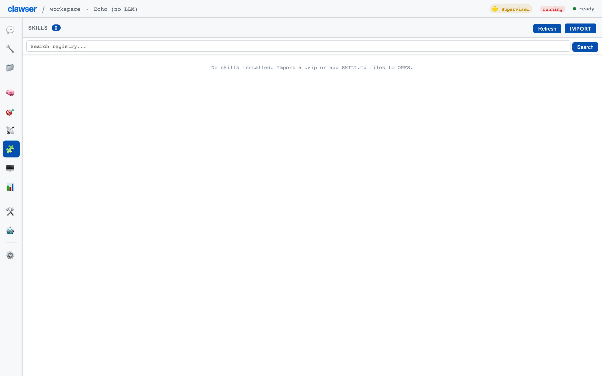

### Workspaces

- **Workspace Isolation** — Multiple independent workspaces with separate history, memory, goals, scheduler jobs, and configuration
- **Per-Workspace Persistence** — Each workspace stores data in namespaced localStorage keys and OPFS directories
- **Memory Hygiene** — Automatic deduplication and cleanup on workspace initialization

### Conversations

- **Conversation Management** — Create, switch, delete, rename, fork, replay, and export conversations
- **Event-Sourced History** — Full auditability with event log reconstruction
- **Auto-Migration** — Transparent migration from v1 to v2 conversation format
- **Conversation Locking** — Prevents switching conversations while a message is being processed

<table>
<tr>
<td width="50%">

**Conversation Dropdown** — Switch, rename, fork, and export conversations
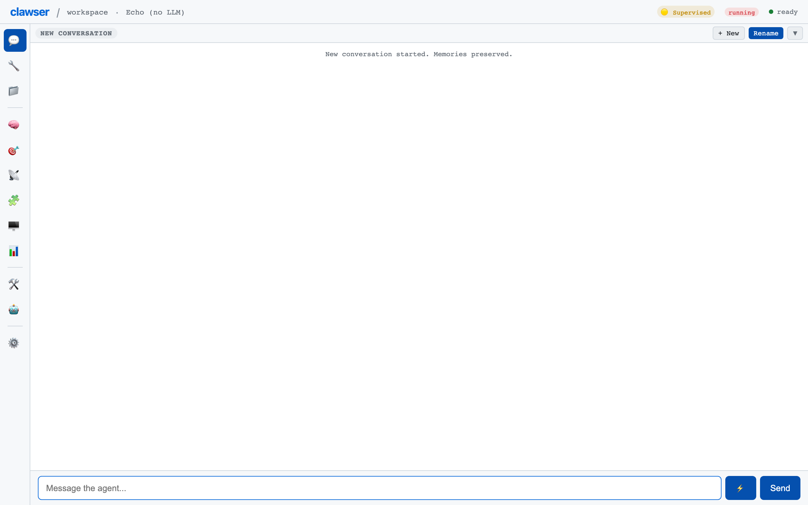

</td>
<td width="50%">

**Events Panel** — Chronological log of tool calls, memory ops, and goal updates
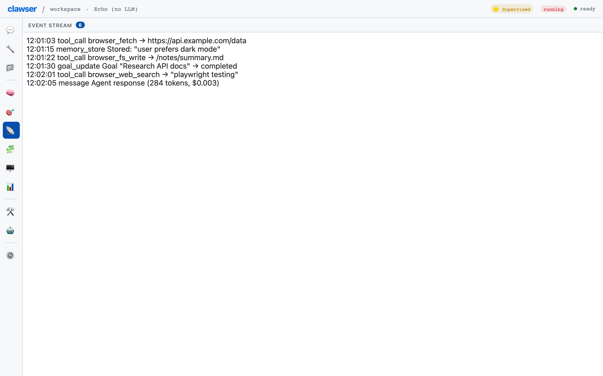

</td>
</tr>
</table>

### Virtual Shell

- **AST-Based Parser** — Full tokenizer and parser supporting pipes (`|`), logical operators (`&&`, `||`), redirects (`>`, `>>`, `2>`, `2>&1`), and quoting
- **59 Built-in Commands** — Core: `cd`, `ls`, `cat`, `mkdir`, `rm`, `cp`, `mv`, `touch`, `pwd`, `echo`, `env`, `export`. Extended: `find`, `grep`, `sed`, `tr`, `sort`, `uniq`, `wc`, `head`, `tail`, `tee`, `cut`, `paste`, `diff`, `xxd`, `base64`, `md5sum`, `sha256sum`, `xargs`, `test`/`[`, `read`, `alias`/`unalias`, `time`, and more
- **Variable Substitution** — `$VAR`, `${VAR}`, `$?` (last exit code)
- **Glob Expansion** — `*`, `?`, `[abc]` with POSIX fallback behavior
- **OPFS File Operations** — Full POSIX-like file system backed by browser OPFS
- **Shell Sessions** — Per-conversation shell state with persistent environment

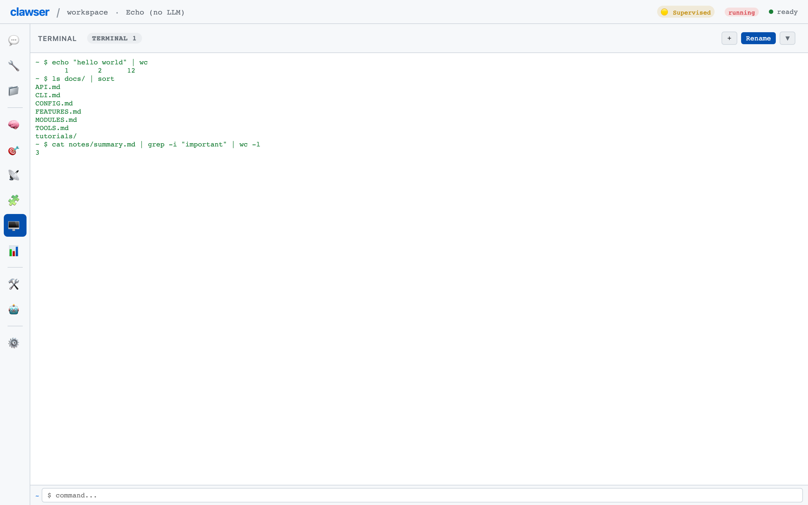

### Terminal Sessions

- **Event-Sourced Sessions** — Terminal sessions as first-class managed objects with event recording
- **Session Management** — Create, fork, switch, export (script/markdown/JSON)
- **State Snapshots** — Capture and restore terminal state
- **Session Bar UI** — Dropdown for session history and management

### CLI

- **AI-Integrated CLI** — 18 subcommands for non-interactive agent interaction
- **One-Shot Mode** — Send a single prompt and get a response
- **Session Management** — Persistent CLI sessions with history

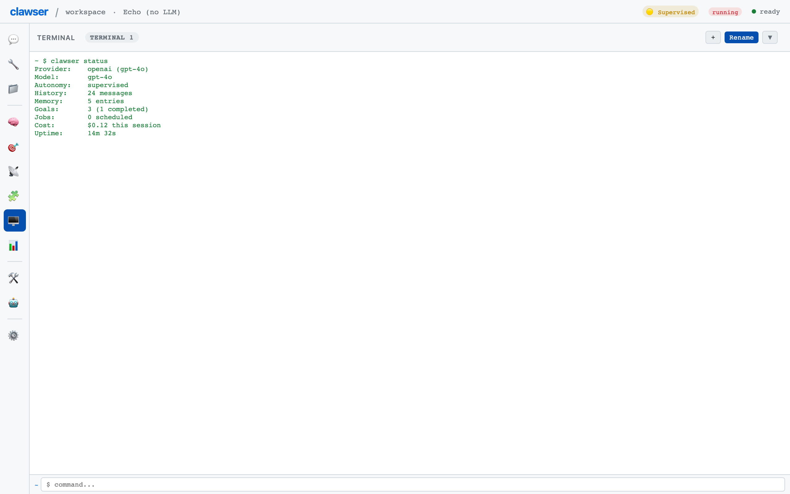

### Daemon Mode & Multi-Tab

- **Shared Worker Coordination** — Single agent brain across multiple browser tabs via BroadcastChannel
- **Tab Leadership Election** — First-joined tab becomes leader; automatic failover
- **Heartbeat Mechanism** — Configurable heartbeat interval with stale tab pruning
- **Checkpoint Manager** — Automatic checkpointing with configurable retention

### External Tool Integration

- **wsh Protocol** — Remote shell exec, file transfer, MCP bridging, and CORS proxy via WebSocket shell connections
- **MCP Client** — Connect to external Model Context Protocol servers via Streamable HTTP transport with JSON-RPC, tool discovery, and 30-second configurable timeout
- **Local Filesystem Mounting** — Mount local folders via File System Access API at `/mnt/` prefix with read-only mode support

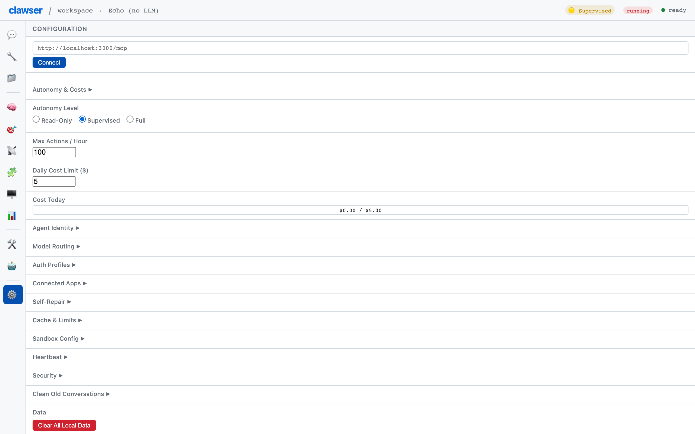

### Provider Features

- **Provider Fallback** — Automatic failover between providers with circuit breaker and health tracking
- **Chrome AI Session Pooling** — LRU session pool (max 3, 5-minute timeout) for on-device Gemini Nano inference
- **Auth Profiles** — Multi-account authentication management with encrypted credential storage via Vault
- **OAuth Support** — OAuth authentication flow integration
- **Accounts System** — Provider account management with multiple API keys per provider

### UI & Accessibility

- **12 Panels** — Chat, Tools, Files, Memory, Goals, Events, Skills, Terminal, Config, Agents, Routines, and more
- **Command Palette** — `Cmd/Ctrl+K` quick command access
- **Keyboard Shortcuts** — `Cmd+Enter` (send), `Cmd+K` (palette), `Cmd+N` (new conversation), `Cmd+1-9` (switch panels), `Escape` (close)
- **ARIA Labels** — 24+ ARIA attributes on landmarks, buttons, inputs, live regions
- **Light Mode** — Automatic via `prefers-color-scheme` media query, or manual `.theme-light` toggle
- **Responsive Design** — Media queries at 768px (tablet) and 480px (mobile) breakpoints
- **Reduced Motion** — Respects `prefers-reduced-motion` preference
- **Print Styles** — Clean chat printing with hidden chrome
- **Type Scale** — CSS variable-based typography (xs through xl)

<table>
<tr>
<td width="50%">

**Command Palette** — Quick access to any tool via `Cmd/Ctrl+K`
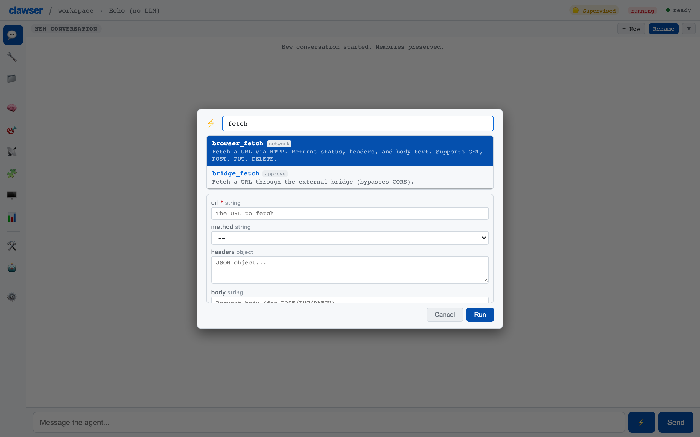

</td>
<td width="50%">

**Files (OPFS)** — Persistent file system in the browser
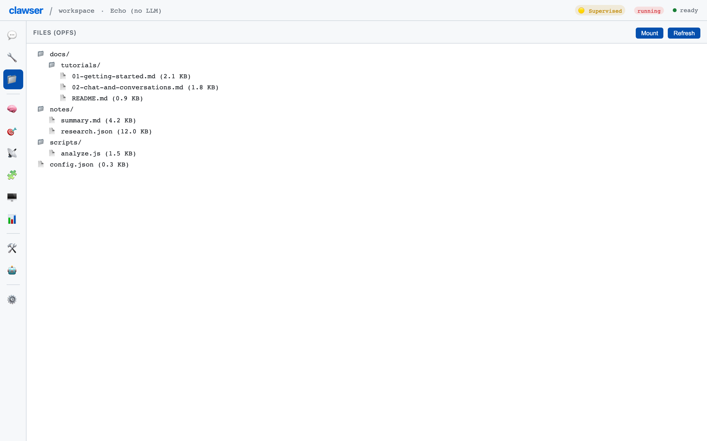

</td>
</tr>
</table>

### Metrics & Observability

- **Performance Metrics** — Percentile calculations, ring buffers for time-series tracking
- **Hardware Detection** — Browser capability and hardware feature detection
- **Remote Pairing** — Remote collaboration sessions for paired agent interaction

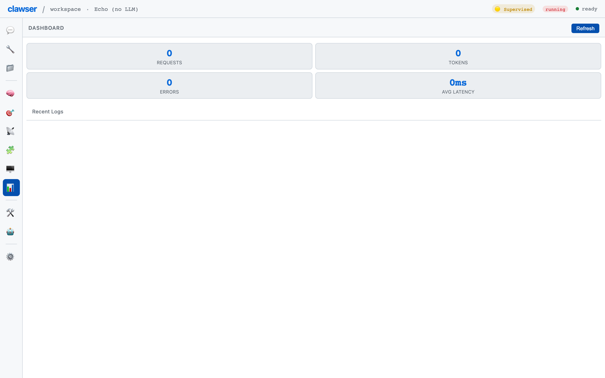

### Build & Deploy

- **Zero Build Step** — Pure ES modules, no bundler, no npm dependencies at runtime
- **Progressive Web App** — Installable via manifest.json with Service Worker caching
- **Docker Support** — Nginx-based Dockerfile with SPA routing
- **CI/CD** — GitHub Actions workflow with Playwright tests and syntax checking

## Quick Start

1. Clone the repository:
   ```bash
   git clone https://github.com/your-org/clawser.git
   cd clawser
   ```

2. Serve the `web/` directory with any static file server:
   ```bash
   # Using Python
   python3 -m http.server 8080 --directory web

   # Using Node
   npx serve web

   # Using Docker
   docker build -t clawser . && docker run -p 8080:80 clawser
   ```

3. Open `http://localhost:8080` in Chrome (131+ for Chrome AI, any modern browser otherwise).

4. Add an LLM provider account (OpenAI, Anthropic, etc.) in the Config panel.

5. Start chatting with your agent.

## Architecture

Clawser is built as a set of ES modules with no bundler, no build step, and no npm dependencies at runtime. All code runs directly in the browser.

```
┌─────────────────────────────────────────────────────┐
│                   index.html (SPA)                   │
├──────────┬──────────┬───────────┬───────────────────┤
│  UI Chat │ UI Panels│  Router   │    Shell / CLI     │
├──────────┴──────────┴───────────┴───────────────────┤
│              clawser-app.js (orchestrator)            │
├──────────┬──────────┬───────────┬───────────────────┤
│  Agent   │Providers │  Tools    │     Skills         │
│  Core    │ (38+)    │  (~100)   │  (agentskills.io)  │
├──────────┼──────────┼───────────┼───────────────────┤
│ EventLog │ SSE/REST │ Browser   │    OPFS + CDN      │
│  (JSONL) │          │ APIs      │                    │
├──────────┴──────────┴───────────┴───────────────────┤
│            Browser APIs (OPFS, Fetch, DOM)            │
└─────────────────────────────────────────────────────┘
```

See [ARCHITECTURE.md](ARCHITECTURE.md) for a detailed breakdown.

## Module Map (57 modules, ~31K LOC)

### Core Agent
| Module | LOC | Purpose |
|--------|-----|---------|
| `clawser-agent.js` | 2,447 | Agent core: EventLog, HookPipeline, AutonomyController, run/stream loop |
| `clawser-providers.js` | 1,474 | LLM providers, SSE readers, cost tracking, response cache |
| `clawser-codex.js` | 292 | Code execution sandbox via andbox/vimble (30s timeout) |
| `clawser-agent-ref.js` | 216 | @agent sub-conversation dispatch with recursion guard |
| `clawser-agent-storage.js` | 395 | Agent definition CRUD, 5 built-in agents, OPFS persistence |

### Tool System
| Module | LOC | Purpose |
|--------|-----|---------|
| `clawser-tools.js` | 1,373 | 29 browser tools with permission engine and BrowserToolRegistry |
| `clawser-mcp.js` | 303 | MCP client (JSON-RPC, Streamable HTTP), tool discovery, timeout |
| `clawser-skills.js` | 1,526 | Skills: parser, OPFS storage, registry, activation, remote install |

### UI Layer
| Module | LOC | Purpose |
|--------|-----|---------|
| `clawser-ui-chat.js` | 1,042 | Chat messaging, streaming, conversations, replay |
| `clawser-ui-panels.js` | 1,455 | Panel hub: re-exports files, memory, goals, config sub-modules |
| `clawser-ui-files.js` | — | File browser panel |
| `clawser-ui-memory.js` | — | Memory search and display panel |
| `clawser-ui-goals.js` | — | Goals tracking panel |
| `clawser-ui-config.js` | — | Configuration, autonomy, identity panels |
| `clawser-item-bar.js` | 210 | Reusable list component (conversations, sessions) |
| `clawser-cmd-palette.js` | — | Command palette (Cmd+K) |
| `clawser-modal.js` | — | Modal dialog system |
| `clawser-keys.js` | 100+ | Keyboard shortcut handler |

### Shell & CLI
| Module | LOC | Purpose |
|--------|-----|---------|
| `clawser-shell.js` | 1,124 | Tokenizer, parser, executor, 22 builtins, variable/glob expansion |
| `clawser-shell-builtins.js` | ~1,500 | 37 extended commands (find, sed, tr, xargs, diff, etc.) |
| `clawser-cli.js` | 714 | AI-integrated CLI: 18 subcommands, one-shot, sessions |
| `clawser-terminal-sessions.js` | 800 | Session CRUD, event recording, state snapshots, export |

### State & Routing
| Module | LOC | Purpose |
|--------|-----|---------|
| `clawser-state.js` | 336 | Namespaced state (ui, services, features, session), ConfigCache, event bus |
| `clawser-router.js` | 143 | Hash-based SPA router, single PANELS source of truth |
| `clawser-app.js` | 192 | Thin orchestrator, module wiring |

### Feature Modules
| Module | Purpose |
|--------|---------|
| `clawser-memory.js` | Semantic memory (BM25 + vector embeddings) |
| `clawser-goals.js` | Goal manager with artifacts |
| `clawser-delegate.js` | Sub-agent delegation |
| `clawser-fallback.js` | Provider failover chains with circuit breaker |
| `clawser-self-repair.js` | Stuck detection and recovery |
| `clawser-undo.js` | Turn-based undo checkpoints |
| `clawser-routines.js` | Event-driven automation (cron, events, webhooks) |
| `clawser-heartbeat.js` | Periodic health checks |
| `clawser-metrics.js` | Percentile calculations, ring buffers |
| `clawser-intent.js` | Message classification and routing |
| `clawser-identity.js` | Agent identity and system prompt compilation |
| `clawser-safety.js` | Input sanitization, output scanning |
| `clawser-sandbox.js` | Sandboxed execution environment (uses andbox) |
| `clawser-tool-builder.js` | Dynamic tool creation |
| `clawser-conversations.js` | Conversation lifecycle management |
| `clawser-daemon.js` | Daemon mode: SharedWorker, BroadcastChannel, tab coordination |
| `clawser-wsh-tools.js` | Remote wsh tools (shell exec, file transfer, PTY, CORS proxy) |
| `clawser-mount.js` | FileSystemAccess API local folder mounting |
| `clawser-browser-auto.js` | Browser automation (page observation, element interaction) |
| `clawser-auth-profiles.js` | Multi-account authentication management |
| `clawser-vault.js` | Encrypted credential storage |
| `clawser-oauth.js` | OAuth authentication flows |
| `clawser-accounts.js` | Provider account management |
| `clawser-channels.js` | Communication channels |
| `clawser-git.js` | Git behavior integration |
| `clawser-hardware.js` | Hardware capability detection |
| `clawser-remote.js` | Remote pairing sessions |

### Internal Packages (`web/packages/`)
| Package | Purpose |
|---------|---------|
| [`andbox`](web/packages/andbox/) | Worker-based sandboxed JS runtime — RPC capabilities, import maps, capability gating, timeouts |
| [`wsh`](web/packages/wsh/) | Web Shell — browser-native remote command execution over WebTransport/WebSocket with Ed25519 auth, CBOR protocol, 33 message types |
| [`ai-matey-middleware-andbox`](web/packages/ai-matey-middleware-andbox/) | ai.matey middleware for LLM code extraction → andbox execution |

## Tool Categories

| Category | Tools | Permission |
|----------|-------|------------|
| **Network** | browser_fetch, browser_web_search | network |
| **DOM** | browser_dom_query, browser_dom_modify | browser |
| **File System** | browser_fs_read, browser_fs_write, browser_fs_list, browser_fs_delete | read / write |
| **Storage** | browser_storage_get, browser_storage_set, browser_storage_list | read / write |
| **Clipboard** | browser_clipboard_read, browser_clipboard_write | browser |
| **Navigation** | browser_navigate, browser_notify | browser |
| **Code** | browser_eval_js | approve |
| **Media** | browser_screenshot, browser_screen_info | browser / read |
| **Memory** | agent_memory_store, agent_memory_recall, agent_memory_forget | internal |
| **Goals** | goal_add, goal_update, goal_add_artifact, goal_list | auto / read |
| **Scheduler** | agent_schedule_add, agent_schedule_list, agent_schedule_remove | internal |
| **Skills** | activate_skill, deactivate_skill, skill_search, skill_install, skill_update, skill_remove, skill_list | internal / network |
| **Agents** | switch_agent, consult_agent, ask_user_question | auto / approve |
| **Shell** | shell (59 built-in commands) | internal |
| **Browser Automation** | browser_open, browser_read_page, browser_click, browser_fill, browser_wait, browser_evaluate, browser_list_tabs, browser_close_tab | approve |
| **Git** | git_status, git_diff, git_log, git_commit, git_branch, git_recall | approve |
| **Channels** | channel_list, channel_send, channel_history | read / approve |
| **Hardware** | hw_list, hw_connect, hw_send, hw_read, hw_disconnect, hw_info | approve |
| **Tool Builder** | tool_build, tool_test, tool_list_custom, tool_edit, tool_remove | approve / read |
| **Delegation** | agent_delegate | approve |
| **Routines** | routine_create, routine_list, routine_delete, routine_run | approve / read |
| **Undo** | undo, undo_status | approve / read |
| **Self-Repair** | self_repair_status, self_repair_configure | read / approve |
| **Heartbeat** | heartbeat_status, heartbeat_run | read / approve |
| **wsh** | wsh_connect, wsh_exec, wsh_fetch, wsh_upload, wsh_download, wsh_pty_open, wsh_pty_write, wsh_disconnect, wsh_sessions, wsh_mcp_call | approve / read |
| **Daemon** | daemon_status, daemon_checkpoint | read / approve |
| **Mount** | mount_list, mount_resolve | read |
| **Intent** | intent_classify, intent_add_override | read / approve |
| **Remote** | remote_status, remote_pair, remote_revoke | read / approve |
| **OAuth** | oauth_list, oauth_connect, oauth_disconnect, oauth_api | read / approve |
| **Auth Profiles** | auth_list_profiles, auth_switch_profile, auth_status | read / approve |
| **Sandbox** | sandbox_run, sandbox_status | approve / read |
| **MCP** | mcp_* (dynamic from connected servers) | network |

See [docs/TOOLS.md](docs/TOOLS.md) for complete parameter specifications.

## Provider Support

### Tier 1: Built-in
- **Echo** — Test/fallback (echoes input)
- **Chrome AI** — Local on-device inference (Chrome 131+, Gemini Nano) with session pooling
- **OpenAI** — GPT-4o, GPT-4o-mini, o1, o3 with native tool_calls
- **Anthropic** — Claude Sonnet, Haiku, Opus with native tool_use

### Tier 2: OpenAI-Compatible
Groq, OpenRouter, Together, Fireworks, Mistral, DeepSeek, xAI, Perplexity, Ollama, LM Studio — configurable base URL, all support native tool_calls

### Tier 3: ai.matey
24+ backends via CDN lazy-load (universal adapter pattern via user's `ai.matey` npm package)

## Skills

Clawser implements the [Agent Skills open standard](https://agentskills.io). Skills are portable packages containing:

- `SKILL.md` — YAML frontmatter (metadata) + markdown body (instructions)
- `scripts/` — Executable JS scripts (run in vimble sandbox)
- `references/` — Supporting documentation
- `assets/` — Static files

Skills can be installed globally or per-workspace, activated via slash commands (`/skill-name`) or the `activate_skill` tool, and browsed from a remote registry. Scripts are validated for dangerous patterns before activation.

## Scheduler

Schedule tasks with three types:
- **Once** — Single execution at a specified time
- **Interval** — Recurring execution at fixed intervals
- **Cron** — Full 5-field cron expression support with static parser

## Project Status

Clawser is in **beta**. The core agent, tool system, provider layer, and persistence are production-complete. See [ROADMAP.md](ROADMAP.md) for planned work and [GAPS.md](GAPS.md) for known issues.

## Development

No build step required. Edit JS files in `web/` and reload the browser.

**Running tests:**
Open `web/test.html` in Chrome to run the regression test suite (57 modules, 11K LOC browser-based).

**Running benchmarks:**
Open `web/bench.html` for micro-benchmarks (Codex extraction, EventLog, provider lookups, memory compaction).

**Rust reference crates:**
The `crates/` directory contains the original Rust/WASM core, kept as architectural reference. It is not used at runtime.

## Tutorials

Step-by-step guides to get productive with Clawser — see the [full tutorial index](docs/tutorials/README.md).

| Tutorial | Time | Description |
|----------|------|-------------|
| [Getting Started](docs/tutorials/01-getting-started.md) | 10 min | First run, workspace setup, provider accounts |
| [Chat & Conversations](docs/tutorials/02-chat-and-conversations.md) | 8 min | Messaging, tool calls, forking, exporting |
| [Memory & Goals](docs/tutorials/03-memory-and-goals.md) | 8 min | Teaching the agent, tracking goals |
| [Files & Web](docs/tutorials/04-files-and-web.md) | 8 min | OPFS files, web fetch, screenshots, DOM tools |
| [Terminal & CLI](docs/tutorials/05-terminal-and-cli.md) | 10 min | Virtual shell, pipes, clawser CLI, sessions |
| [Skills](docs/tutorials/06-skills.md) | 8 min | Installing, using, and creating skills |
| [Tool Management](docs/tutorials/07-tool-management.md) | 8 min | Permissions, autonomy, command palette |
| [Agents & Delegation](docs/tutorials/08-agents-and-delegation.md) | 10 min | Agent definitions, @agent refs, sub-agents |
| [MCP & Extensions](docs/tutorials/09-mcp-and-extensions.md) | 8 min | MCP servers, wsh, local folder mounting |
| [Routines & Automation](docs/tutorials/10-routines-and-automation.md) | 10 min | Cron, event, webhook triggers and guardrails |

## Documentation

| Document | Description |
|----------|-------------|
| [ARCHITECTURE.md](ARCHITECTURE.md) | System design, data flow, security model |
| [ROADMAP.md](ROADMAP.md) | 5-phase development roadmap |
| [CHANGELOG.md](CHANGELOG.md) | Version history |
| [CONTRIBUTING.md](CONTRIBUTING.md) | Development setup, code style, adding tools/providers |
| [SECURITY.md](SECURITY.md) | Permission model, autonomy levels, XSS prevention, storage |
| [GAPS.md](GAPS.md) | Known gaps with action plans |
| [docs/API.md](docs/API.md) | Public API reference for core modules |
| [docs/CLI.md](docs/CLI.md) | CLI subcommands and shell builtins |
| [docs/MODULES.md](docs/MODULES.md) | Feature module manifest |
| [docs/EVENT-LOG.md](docs/EVENT-LOG.md) | Event log specification and JSONL format |
| [docs/TOOLS.md](docs/TOOLS.md) | Complete tool reference (~100 tools with parameters and permissions) |
| [docs/CONFIG.md](docs/CONFIG.md) | Configuration panel options and storage keys |
| [docs/FEATURES.md](docs/FEATURES.md) | Advanced features guide (routines, delegation, vault, etc.) |
| [docs/DEPLOYMENT.md](docs/DEPLOYMENT.md) | Static server, Docker, and production setup |
| [docs/tutorials/](docs/tutorials/README.md) | 10 step-by-step tutorials with screenshots |

## `.reference/` Directory

The `.reference/` directory (gitignored) contains historical reference implementations from earlier stages of the project:

- **ironclaw** — Original Rust/WASM agent core
- **nullclaw** — Stripped-down null implementation used for testing the host interface
- **zeroclaw** — Zero-dependency JavaScript prototype that preceded the current architecture

These are kept locally for architectural reference and are not part of the runtime or distribution.

## License

MIT
