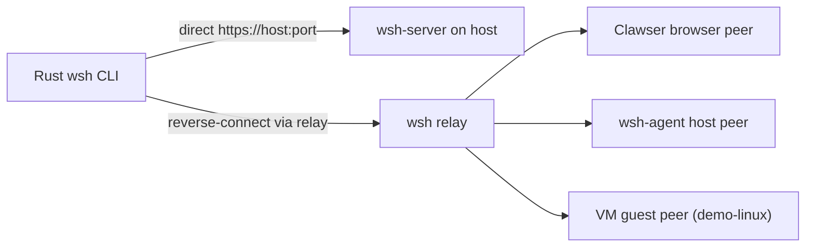

# WSH Into a Clawser Instance

This document covers the closest thing Clawser currently has to "SSH into a running instance."

The first thing to know is that Clawser itself is a browser app. There is no always-on shell daemon inside the tab. Because of that, there are two different `wsh` workflows:

1. `wsh` into a `wsh-server` running on a host. This is the fully implemented path today.
2. `wsh` into a live Clawser browser tab through a relay. This is the closest match to "wsh into Clawser", and it now works for normal interactive shell workloads through a browser-backed virtual terminal.

If your goal is specifically to reach a live Clawser tab, use the reverse-connect flow below. If your goal is a real host PTY with full Unix terminal semantics, use the direct `wsh-server` path in the last section. If you want the browser-hosted guest-console path, expose a VM peer with `--type vm-guest --backend vm-console --vm-runtime demo-linux`.

> **Provenance note**: the Rust `wsh-server`/`wsh-cli` this guide describes (`crates/wsh-server`, `crates/wsh-cli`, plus their `wsh-core`/`wsh-client` dependencies) was removed from this repo on 2026-03-14 as a side effect of migrating Clawser's own agent core to pure JS, then restored on 2026-07-05 once that removal turned out to have quietly dropped the *only* implementation of two real capabilities: native WebTransport/QUIC (via `wtransport`/`quinn`) and real PTYs (via `portable-pty`). Both are back and verified against the current `wsh-upon-star` npm client (the pure-JS library Clawser's own browser `wsh` shell command is built on). If you don't want to install a Rust toolchain, a lighter-weight Node-only alternative — `tools/wsh-server.mjs` + `tools/wsh-operator-cli.mjs` — also exists; see [§13](#13-lightweight-alternative-a-node-only-server--cli) for what it can and can't do compared to the Rust tools this guide otherwise assumes.

## Topology At A Glance

| Mode | Source | Target | Transport Path | Terminal Type | Status |
|------|--------|--------|----------------|---------------|--------|
| Direct host | Rust `wsh` CLI or browser `wsh` client | `wsh-server` on a host | Direct `https://host:port` | Real PTY | Complete |
| Reverse browser peer | Rust `wsh` CLI | Live Clawser tab | Relay-mediated reverse connect | Virtual terminal | Complete for interactive shell workloads |
| Reverse host peer | Rust `wsh` CLI | Relay-registered host agent | Relay-mediated reverse connect | Real PTY | Complete |
| VM guest peer | Rust `wsh` CLI | Browser-hosted VM console | Relay-mediated reverse connect | VM console | Complete for the `demo-linux` MVP runtime |



Use this rule of thumb:

- choose **direct host** when you need full Unix PTY behavior
- choose **reverse browser peer** when you need to reach a live tab/workspace
- choose **reverse host peer** when the machine can dial out but should not expose an inbound listener
- choose **VM guest peer** only when you specifically want a browser-hosted guest runtime rather than the normal browser shell

## Support Matrix

| Capability | Direct host | Reverse browser peer | Reverse host peer | VM guest peer |
|------------|-------------|----------------------|-------------------|---------------|
| Interactive shell | Yes | Yes | Yes | Yes |
| Real PTY semantics | Yes | No | Yes | No |
| File transfer | Yes | Yes | Yes | Partial |
| Tool / MCP access | Yes | Yes | Yes | Partial |
| Attach / replay | Yes | Yes | Yes | Partial |
| Echo / term sync hints | Host-driven | Yes | Partial | No |

## Remote Filesystem Modes

Phase 7A now supports three distinct remote file access modes:

- `transfer`: explicit upload/download or structured file read/write over `wsh`
- `live browse`: remote listing/stat/read/write flows used by the shared remote runtime UI and broker-backed orchestration paths
- `mount`: remote peers exposed through the remote mount manager so shell/filesystem surfaces can consume them as mounted runtimes

Use `transfer` for bulk movement, `live browse` for remote inspection/edit flows, and `mount` when you want the remote runtime to behave like an attached filesystem surface in Clawser.

Terminology used in this guide:

- **Direct host session**: a normal `wsh connect` session into `wsh-server`
- **Reverse peer**: a runtime that registered outward to a relay and can be reached with `wsh reverse-connect`
- **Virtual terminal**: a browser-backed, PTY-like terminal stream implemented in app/runtime code rather than by the host kernel
- **Real PTY**: a host/kernel terminal device backing an interactive shell
- **Peer capability**: the advertised surfaces a reverse peer exposes, such as `shell`, `fs`, `tools`, or `gateway`

## Before You Start

This guide uses four different command surfaces:

- `Repo shell`: your normal macOS/Linux terminal in the repo root
- `Relay shell`: the shell on the machine running `wsh-server`
- `Clawser terminal`: the terminal panel inside the target Clawser browser tab
- `Operator shell`: your normal macOS/Linux terminal where the Rust `wsh` CLI runs

Sometimes `Relay shell`, `Repo shell`, and `Operator shell` are all the same machine. That is fine.

Two important address rules:

- In the `Clawser terminal`, `wsh reverse` accepts `relay-host[:port]`
- In the Rust CLI, `wsh peers` and `wsh reverse-connect` accept `relay-host` only; the port comes from `-p/--port` and defaults to `4422`

So for a local relay:

- `Clawser terminal`: `wsh -i clawser-tab reverse localhost:4422`
- `Operator shell`: `wsh -i operator peers localhost`

Do not write `localhost:4422` in the Rust CLI relay commands, because the Rust CLI appends the port itself.

Use the relay hostname as seen from the place where the command runs:

- if the relay is on the same machine as the browser tab, `localhost` works in the `Clawser terminal`
- if the relay is on another machine, use a hostname the browser can reach
- if the relay is on the same machine as the Rust CLI, `localhost` works in the `Operator shell`
- if the relay is on another machine, use a hostname the CLI machine can reach

## What You Need

- A machine that can run `wsh-server`
- A machine that can run the Rust `wsh` CLI
- A running Clawser tab for the target instance
- TLS for the relay/server
- Public keys added to the relay/server's `authorized_keys`

For local browser testing, the repo's default static server now runs over HTTPS:

```bash
npm start
```

That serves Clawser at `https://localhost:8080`, which is the simplest local origin for reverse-browser `wsh` work.

In the `Operator shell`, if you do not already have the Rust `wsh` binary installed, replace local CLI commands of the form:

```bash
wsh ...
```

with:

```bash
cargo run -p wsh-cli -- ...
```

This replacement is only for the Rust CLI in your normal shell. It is not needed inside the `Clawser terminal`, where `wsh` is already a built-in shell command.

## 1. Start Clawser

Run this in the `Repo shell`:

```bash
npm start
```

Then open:

```text
https://localhost:8080
```

Open the target workspace and keep its terminal available for later steps.

## 2. Build the Server and CLI

Run this in the `Repo shell`:

```bash
cargo build -p wsh-server -p wsh-cli
```

## 3. Start a Relay Server

Run this in the `Relay shell`.

If you only need local development on `localhost`, use the built-in certificate generator:

```bash
cargo run -p wsh-server -- --generate-cert --enable-relay --port 4422
```

Important:

- `--generate-cert` only creates a cert for `localhost`, `127.0.0.1`, and `::1`
- That is fine for local testing
- It is not sufficient for a real remote hostname that a browser tab will connect to
- For browser-driven reverse `wsh`, the relay certificate must still be trusted by the browser
- `--generate-cert` creates key material, but it does not automatically make that certificate trusted in Chrome/Safari/Firefox

For a real hostname, run `wsh-server` with a certificate that matches the relay hostname:

```bash
cargo run -p wsh-server -- \
  --enable-relay \
  --port 4422 \
  --cert /path/to/fullchain.pem \
  --key /path/to/privkey.pem
```

The default `wsh-server` auth model reads public keys from:

- `~/.wsh/authorized_keys`
- `~/.ssh/authorized_keys`

For this guide, use `~/.wsh/authorized_keys` so the setup is explicit.

When the Rust CLI connects to a relay or host for the first time, it stores that server fingerprint in `~/.wsh/known_hosts` using TOFU (`host:port` pinning). Check that file if you need to inspect or reset a stored fingerprint.

If you are doing everything locally on one machine, the relay address for the rest of this guide is:

- `Clawser terminal`: `localhost:4422`

## 3A. Relay Self-Check

Before you start registering peers, verify the local bootstrap path end to end.

`Repo shell`

```bash
npm start
```

Expected:

- Clawser serves from `https://localhost:8080`

`Relay shell`

```bash
cargo run -p wsh-server -- --enable-relay --port 4422 --cert ~/.wsh/localhost.pem --key ~/.wsh/localhost-key.pem
```

Expected:

- `wsh-server ready`
- relay enabled on `:4422`

`Operator shell`

```bash
curl -I https://localhost:4422/
```

Expected:

- a TLS response, not `connection refused`
- if the cert is not trusted, fix that before continuing

`Operator shell`

```bash
wsh keys
wsh peers localhost
```

Expected:

- your operator identity exists
- the relay command returns immediately, even if no peers are online yet

If you want a reverse host peer to survive login/session churn, install `wsh-agent` as a user startup unit:

```bash
wsh -i operator agent install localhost --capability shell --capability fs
```

That writes a user-level startup unit and prints the exact `launchctl` or `systemctl --user` command needed to enable it on the local machine.
- `Operator shell`: `localhost` with the default port `4422`

## 4. Generate a Key for the Target Clawser Tab

Run this in the `Clawser terminal` inside the target browser tab:

```bash
wsh keygen clawser-tab
```

Copy the full `ssh-ed25519 ...` public key printed by that command somewhere safe. You will paste it into the relay's `authorized_keys` file in step 6.

Note:

- The browser `wsh keys` command shows only a shortened public key preview
- If you need the full browser public key later, the simplest path is to generate a fresh named key and copy the printed output immediately

## 5. Generate a Key for the CLI Operator

Run this in the `Operator shell`.

If `wsh` is installed on your local `PATH`:

```bash
wsh keygen operator
cat ~/.wsh/keys/operator.pub
```

If `wsh` is not installed on your local `PATH`:

```bash
cargo run -p wsh-cli -- keygen operator
cat ~/.wsh/keys/operator.pub
```

Copy that full public key as well. You will also paste this into the relay's `authorized_keys` file in step 6.

## 6. Authorize Both Keys on the Relay

Run this in the `Relay shell`:

```bash
mkdir -p ~/.wsh
chmod 700 ~/.wsh
touch ~/.wsh/authorized_keys
chmod 600 ~/.wsh/authorized_keys
```

Then append both public keys, one line each, to `~/.wsh/authorized_keys`:

- the browser key from step 4
- the CLI key from step 5

One simple way is:

```bash
cat >> ~/.wsh/authorized_keys
```

Then paste:

1. the full `ssh-ed25519 ...` line from the `Clawser terminal`
2. the full `ssh-ed25519 ...` line from `~/.wsh/keys/operator.pub`

Then press `Ctrl+D`.

After this step, both the Clawser tab and the CLI can authenticate to the relay.

## 7. Register the Target Clawser Tab as a Reverse Peer

Run this in the `Clawser terminal`.

For local development, where the relay is running on the same machine as the browser:

```bash
wsh -i clawser-tab reverse localhost:4422
```

For a remote relay:

```bash
wsh -i clawser-tab reverse relay.example.com:4422
```

If you want to expose only specific capabilities instead of the default "all", use the same relay address with flags:

```bash
wsh -i clawser-tab reverse localhost:4422 --expose-shell
```

Or:

```bash
wsh -i clawser-tab reverse localhost:4422 --expose-shell --expose-tools --expose-fs
```

You can also use named presets and require local approval for each incoming reverse session:

```bash
wsh -i clawser-tab reverse localhost:4422 --preset shell-only --require-approval
```

For a VM-backed peer:

```bash
wsh -i clawser-tab reverse localhost:4422 --preset vm-console
```

What to expect:

- Clawser first tries browser WebTransport to `https://relay-host:port`
- if WebTransport is unavailable or the handshake fails, it automatically falls back to `wss://relay-host:port`
- the terminal prints a short peer fingerprint
- the browser remote panel shows what this tab is exposing, whether approvals are automatic or per-session, and how many incoming reverse sessions are active
- the tab must stay open, because the reverse registration is tied to that live browser session
- after registration, the relay knows this browser tab as a reverse-connectable peer

If both transport attempts fail in the browser, check the relay certificate first. The browser must accept that certificate for either WebTransport or `wss://` to work.

## 8. Discover the Clawser Peer from the CLI

Run this in the `Operator shell`.

For local development, where the relay is on the same machine as the CLI:

```bash
wsh -i operator peers localhost
```

If `wsh` is not installed locally:

```bash
cargo run -p wsh-cli -- -i operator peers localhost
```

For a remote relay on the default port:

```bash
wsh -i operator peers relay.example.com
```

For a non-default port:

```bash
wsh -p 5544 -i operator peers relay.example.com
```

Do not write `relay.example.com:4422` here. In the Rust CLI, `peers` takes the host separately from the port.

You should see a peer list with:

- a short fingerprint
- a username
- exposed capabilities

Take note of either:

- the fingerprint, or
- the peer name shown in the `USERNAME` column

The Rust CLI accepts both when reverse-connecting through a relay.

## 9. Send the Reverse-Connect Request

Run this in the `Operator shell`.

For local development by peer name:

```bash
wsh -i operator reverse-connect @browser localhost
```

If `wsh` is not installed locally:

```bash
cargo run -p wsh-cli -- -i operator reverse-connect @browser localhost
```

For a remote relay on the default port by fingerprint:

```bash
wsh -i operator reverse-connect <fingerprint> relay.example.com
```

For a qualified selector with the relay embedded in the target:

```bash
wsh -i operator reverse-connect @browser@relay.example.com
```

For a non-default port:

```bash
wsh -p 5544 -i operator reverse-connect @browser relay.example.com
```

At this point:

- the relay forwards `ReverseConnect` to the Clawser tab
- the browser accepts or rejects the request
- on accept, the Rust CLI opens a browser-backed virtual terminal channel
- the CLI enters the interactive terminal loop

For a successful connection, you should see an interactive shell prompt instead of stopping at the handshake.

If this fails, run a relay self-check in the `Operator shell`:

```bash
wsh -i operator check relay localhost
```

That command reports:

- whether the local identity key exists
- whether the relay host is already present in `~/.wsh/known_hosts`
- whether the relay is reachable
- whether your key is authorized
- a likely fix for stale known-host entries, missing `authorized_keys`, certificate trust problems, or a relay that is not listening

## 10. Current Limits of the Browser Path

The reverse browser terminal is interactive now, but it is still not the same thing as a real host PTY.

What works well:

- `wsh-server` relay support
- browser reverse-peer registration
- peer discovery
- reverse-connect accept/reject handshake
- interactive CLI terminal loop over the reverse connection
- browser-side line editing, prompt redraw, history, resize, Ctrl-C, and Ctrl-D
- replay/reattach of browser-owned terminal state across reconnects

What this path is not:

- a kernel-backed PTY
- a shell attached to a real Unix TTY device
- a replacement for direct host `wsh-server` sessions when you need full terminal compatibility

Practical consequences:

- good fit: Clawser shell commands, normal command output, interactive shell use from the Rust CLI
- not a good fit: `vim`, `tmux`, `top`, `less`, curses apps, job control, or programs that require real `/dev/tty` semantics

So the reverse browser path is now usable, but it should be understood as an emulated PTY-like terminal backed by the browser shell runtime.

## 11. Fully Working Alternative Today

If you need a real interactive host shell with native PTY behavior, run `wsh-server` on the target host and connect directly to that host instead of reverse-connecting into the browser tab.

### On the target host

1. Add the CLI public key to `~/.wsh/authorized_keys`
2. Start `wsh-server`

Local dev example:

```bash
cargo run -p wsh-server -- --generate-cert --port 4422
```

Real host example:

```bash
cargo run -p wsh-server -- \
  --port 4422 \
  --cert /path/to/fullchain.pem \
  --key /path/to/privkey.pem
```

### From the CLI

```bash
wsh -i operator alice@target.example.com
```

Or run a one-off command:

```bash
wsh -i operator alice@target.example.com uname -a
```

This direct-host path is the one that currently provides a real PTY and command execution end to end.

If the remote host has password auth enabled on `wsh-server`, you can also bootstrap your CLI key with:

```bash
wsh -i operator copy-id alice@target.example.com
```

`copy-id` prompts for the remote password unless `WSH_PASSWORD` is already set.

## 12. If You Want Clawser to Reach the Host Instead

If what you actually meant was "from Clawser, connect to a remote machine with `wsh`", use the Clawser terminal or the `wsh_*` tools instead of the reverse-connect flow:

```bash
wsh alice@target.example.com
```

Or through the browser tool layer:

- `wsh_connect`
- `wsh_exec`
- `wsh_pty_open`
- `wsh_pty_write`
- `wsh_upload`
- `wsh_download`

That path is also implemented today, provided the remote host is running `wsh-server` and has authorized the browser key.

## 13. Lightweight Alternative: A Node-Only Server + CLI

Everything above assumes a Rust toolchain (`cargo build -p wsh-server -p wsh-cli`). If you don't want to install one — e.g. a quick local test, a CI job, or a host where installing Rust isn't practical — [`tools/wsh-server.mjs`](../tools/wsh-server.mjs) and [`tools/wsh-operator-cli.mjs`](../tools/wsh-operator-cli.mjs) are a from-scratch Node.js reimplementation of the same wsh-v1 protocol, built directly on the same [`wsh-upon-star`](https://github.com/johnhenry/wsh-upon-star) client library Clawser's own browser `wsh` shell command uses. No `cargo build` step — just `node tools/wsh-server.mjs ...`.

It covers the same two topologies (direct host, and relay for reverse-connecting into a live Clawser tab), including native WebTransport (QUIC/HTTP3, via the `@fails-components/webtransport` npm package) alongside WebSocket — but it is not a full replacement for the Rust tools, and the gap is deliberate rather than accidental:

| | Rust (`wsh-server`/`wsh-cli`) | Node (`tools/wsh-server.mjs` + `wsh-operator-cli.mjs`) |
|---|---|---|
| Build step | `cargo build` (Rust toolchain) | none — plain `node`, deps are ordinary npm packages |
| Real PTY sessions | Yes (`portable-pty`) | No — `kind: 'pty'` is explicitly rejected; exec-only |
| WebSocket | Yes | Yes |
| WebTransport (QUIC/HTTP3) | Yes (`wtransport`/`quinn`) | Yes (`@fails-components/webtransport`) |
| Relay (reverse-connect) | Yes | Yes |
| `reverse-connect` UX | Interactive terminal loop | Runs one command and exits |
| `check relay` diagnostics | Yes | No |
| `agent install` (dial-out startup unit) | Yes | No — no host-side dial-out agent at all |
| `copy-id` (password-bootstrapped key install) | Yes | No |
| `~/.wsh/known_hosts` TOFU pinning | Yes | No |
| `authorized_keys` fallback paths | `~/.wsh/authorized_keys`, `~/.ssh/authorized_keys` | `~/.wsh/authorized_keys` only (override with `--authorized-keys`) |

Quick start (direct host, local dev, plain WebSocket):

```bash
# Host
node tools/wsh-server.mjs --port 4422

# Operator
node tools/wsh-operator-cli.mjs keygen operator
# add the printed ssh-ed25519 line to ~/.wsh/authorized_keys on the host
node tools/wsh-operator-cli.mjs exec <host> "uname -a"
```

For relay/reverse-connect into a Clawser tab, or for WebTransport/TLS via `--cert`/`--key`, the flow mirrors steps 3-9 above with `wsh-operator-cli.mjs peers`/`reverse-connect` in place of the Rust CLI's `peers`/`reverse-connect` — see the file's own `--help` output for the exact flag set, since it's deliberately smaller than the Rust CLI's.

### Cross-implementation WebTransport interop

Both servers' WebTransport listeners are verified end to end against a real WebTransport client (`@fails-components/webtransport`'s Node client, driven through wsh-upon-star's own unmodified `WebTransportTransport` — a genuine QUIC session, not a mock) — including cross-implementation: that Node client against *this Rust server's* `wtransport`/`quinn` listener, all the way through authentication and a real exec session (`tools/test/wsh-rust-server.test.mjs`).

Getting there took two real, non-obvious fixes, found via a careful, from-scratch investigation that initially (and wrongly) concluded this gap was unfixable:

1. **Certificate validity must be ≤14 days.** The WebTransport spec's certificate-hash-pinning algorithm (`serverCertificateHashes`) requires it — confirmed independently via the W3C spec and Firefox's own bugzilla history for this exact feature. rcgen's default validity window (1975–4096, a deliberately "forever" range) fails this outright; a "just make it not absurd" 365-day window was tried and *also* failed, which is what led to briefly (and incorrectly) concluding the whole thing was some unfixable native-binding quirk. `generate_self_signed_cert()` in `crates/wsh-server/src/main.rs` now uses a 13-day window.
2. **A SERVER_HELLO/CHALLENGE race on the QUIC control stream.** `handle_webtransport()` was sending both messages back-to-back on one stream; unlike discrete WebSocket frames, a QUIC stream has no message-boundary framing at that layer, so both can arrive in a single client-side read — and wsh-upon-star's client dispatches both synchronously from that read, but only registers its *next* waiter (for CHALLENGE) in a microtask after the first message's `await` resolves. The synchronously-dispatched CHALLENGE had no waiter yet and was silently dropped, hanging until timeout — the exact same race already found and fixed on the Node server's WebSocket path in `tools/wsh-server.mjs`. Fixed the same way: skip SERVER_HELLO, send only CHALLENGE, use the client's documented `"pending"` literal session-id fallback for transcript verification.

Both are genuinely fixed and verified, not worked around — `tools/test/wsh-rust-server.test.mjs`'s WebTransport suite includes a full client session (auth + exec + real output) over the Rust server's actual QUIC listener, run repeatedly to confirm it isn't flaky.
