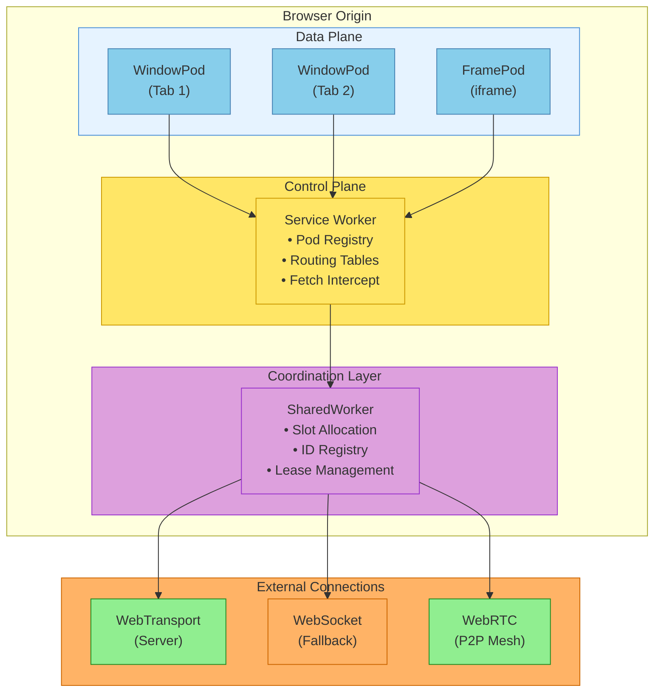

# BrowserMesh

**A browser-native distributed runtime with capability-secure networking**

## Overview

BrowserMesh is a framework for building distributed applications that run entirely within browser execution contexts. It provides Kubernetes-inspired semantics adapted to browser primitives, enabling:

- **Microservice architectures** within a single browser
- **Edge compute** using browsers as compute substrate
- **Collaborative applications** with peer-to-peer sync
- **Multi-device clustering** via WebRTC mesh

## Core Principles

1. **Pods are browser contexts** — Windows, Workers, Iframes, not containers
2. **Topology is discovered, not declared** — Pods negotiate relationships at runtime
3. **Capabilities are explicit** — Every channel is negotiated, never assumed
4. **Identity is cryptographic** — Self-certifying Ed25519 keys, no central authority
5. **Security by design** — Capability-based delegation, not ambient authority

## Document Structure

The narrative guides provide conceptual overviews. The [formal specs](./specs/) are the authoritative source for protocol details, wire formats, and implementation requirements.

### Guides

| Document | Description |
|----------|-------------|
| [Core Concepts](./core/README.md) | Pod types, lifecycle, capability model |
| [Identity & Crypto](./identity/README.md) | Ed25519 keys, HD derivation, handshakes |
| [Mesh Routing](./routing/README.md) | Discovery, routing tables, channel upgrades |
| [Server Bridge](./bridge/README.md) | WebTransport/WebSocket ingress, RPC protocol |
| [Federation](./federation/README.md) | Cross-origin trust, WebRTC multi-device |
| [Reference Implementation](./reference/README.md) | Library architecture, module breakdown |
| [Examples](./examples/README.md) | Real-world application architectures |

### Technical Specifications

There are 57 specs across 6 categories. See the [spec index](./specs/spec-index.md) for the complete list with dependency graph and recommended reading order, or the [specs README](./specs/README.md) for a categorized overview.

**Start here:**

| Spec | Description |
|------|-------------|
| [pod-types](./specs/core/pod-types.md) | Pod kinds, capability matrix |
| [identity-keys](./specs/crypto/identity-keys.md) | Ed25519 identity, HD derivation |
| [boot-sequence](./specs/core/boot-sequence.md) | 6-phase topology discovery |
| [wire-format](./specs/core/wire-format.md) | CBOR message encoding |
| [session-keys](./specs/crypto/session-keys.md) | X25519 handshake, session encryption |
| [link-negotiation](./specs/networking/link-negotiation.md) | Channel negotiation state machine |
| [message-envelope](./specs/networking/message-envelope.md) | Request/response envelope format |
| [service-model](./specs/coordination/service-model.md) | Service naming, routing |

**By category:**

| Category | Specs | Covers |
|----------|-------|--------|
| [core/](./specs/core/) | 6 specs | Pod types, boot, wire format, errors, security, versioning |
| [crypto/](./specs/crypto/) | 6 specs | Identity, sessions, capabilities, WebAuthn, groups, persistence |
| [networking/](./specs/networking/) | 16 specs | Channels, sockets, streams, encryption, signaling, DHT, pairing |
| [coordination/](./specs/coordination/) | 12 specs | Services, presence, pub/sub, state sync, leader election, migration |
| [extensions/](./specs/extensions/) | 6 specs | Server pods, storage, compute offload, audit logs, artifacts |
| [operations/](./specs/operations/) | 4 specs | Observability, key rotation, chaos testing, test transport |
| [reference/](./specs/reference/) | 7 specs | API surface, CLI, manifests, design rationale, libp2p comparison |

## Quick Start

```typescript
import { installPodRuntime } from '@browsermesh/runtime';

// Install the runtime in any execution context
const pod = await installPodRuntime(globalThis);

// Pod is now discoverable and routable
console.log(`Pod ID: ${pod.id}`);
console.log(`Pod Kind: ${pod.kind}`);

// Connect to peers
pod.on('peer:discovered', (peer) => {
  console.log(`Discovered: ${peer.id}`);
});

// Handle incoming requests
pod.handle('compute/transform', async (req) => {
  return { result: transform(req.payload) };
});
```

## Architecture Overview



## Status

This specification is under active development.

## License

[TBD]
