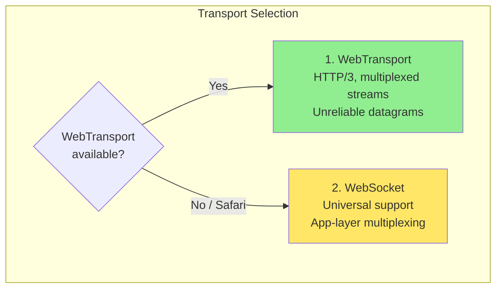
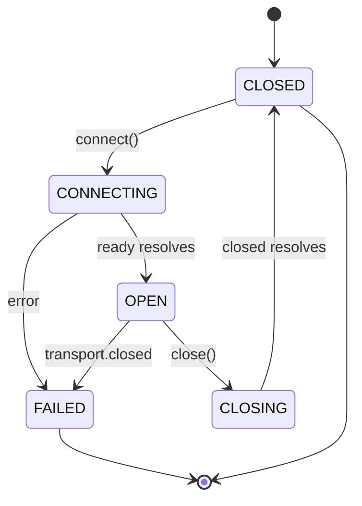

# BrowserMesh Server Bridge

## 1. Overview

The Server Bridge enables browser pods to communicate with external servers, providing:
- Ingress for server-to-browser communication
- Egress for browser-to-server requests
- Multiplexed streams over a single connection
- RPC semantics over transport protocols

### 1.1 Transport Priority



### 1.2 Browser Support (2025)

| Transport | Chrome | Firefox | Safari | Edge | Mobile |
|-----------|--------|---------|--------|------|--------|
| WebTransport | ✅ 97+ | ✅ 115+ | ❌ | ✅ 98+ | ✅ Android |
| WebSocket | ✅ | ✅ | ✅ | ✅ | ✅ |

> **Critical**: Safari requires WebSocket fallback. Always implement dual-transport support.
> See: [Can I Use: WebTransport](https://caniuse.com/webtransport)

---

## 2. WebTransport Connection

### 2.1 Connection Lifecycle



### 2.2 WebTransport Client

```typescript
interface BridgeConfig {
  url: string;                    // wss:// or https:// URL
  serverCertificateHashes?: ArrayBuffer[];  // For self-signed certs
  reconnectBackoff: BackoffConfig;
  heartbeatInterval: number;
}

class WebTransportBridge {
  private transport?: WebTransport;
  private state: BridgeState = 'closed';
  private streams: Map<number, StreamContext> = new Map();

  async connect(config: BridgeConfig): Promise<void> {
    if (!('WebTransport' in globalThis)) {
      throw new Error('WebTransport not supported, use WebSocket fallback');
    }

    this.state = 'connecting';

    this.transport = new WebTransport(config.url, {
      serverCertificateHashes: config.serverCertificateHashes,
    });

    try {
      await this.transport.ready;
      this.state = 'open';

      // Set up incoming stream handler
      this.handleIncomingStreams();

      // Monitor connection health
      this.transport.closed.then((info) => {
        this.handleClose(info);
      });

    } catch (error) {
      this.state = 'failed';
      throw error;
    }
  }

  private async handleIncomingStreams(): Promise<void> {
    const reader = this.transport!.incomingBidirectionalStreams.getReader();

    while (true) {
      const { value: stream, done } = await reader.read();
      if (done) break;
      this.handleStream(stream);
    }
  }

  private async handleStream(stream: WebTransportBidirectionalStream): Promise<void> {
    const reader = stream.readable.getReader();
    const writer = stream.writable.getWriter();

    // Read stream header (first message contains stream ID and type)
    const { value: header } = await reader.read();
    const { streamId, type } = cbor.decode(header);

    const context: StreamContext = {
      id: streamId,
      type,
      reader,
      writer,
      created: Date.now(),
    };

    this.streams.set(streamId, context);
    this.emit('stream:open', context);
  }

  async openStream(type: StreamType): Promise<StreamContext> {
    const stream = await this.transport!.createBidirectionalStream();
    const streamId = this.nextStreamId++;

    const writer = stream.writable.getWriter();
    const reader = stream.readable.getReader();

    // Send stream header
    await writer.write(cbor.encode({ streamId, type }));

    const context: StreamContext = {
      id: streamId,
      type,
      reader,
      writer,
      created: Date.now(),
    };

    this.streams.set(streamId, context);
    return context;
  }

  // Datagrams for unreliable messaging
  async sendDatagram(data: Uint8Array): Promise<void> {
    const writer = this.transport!.datagrams.writable.getWriter();
    await writer.write(data);
    writer.releaseLock();
  }
}
```

### 2.3 Stream Types

```typescript
type StreamType =
  | 'control'     // Mesh control messages
  | 'rpc'         // Request/response
  | 'stream'      // Streaming data
  | 'bulk';       // Large transfers

interface StreamContext {
  id: number;
  type: StreamType;
  reader: ReadableStreamDefaultReader<Uint8Array>;
  writer: WritableStreamDefaultWriter<Uint8Array>;
  created: number;
}
```

---

## 3. WebSocket Fallback

### 3.1 Multiplexing Layer

Since WebSocket provides a single bidirectional stream, we implement multiplexing at the application layer:

```typescript
interface MultiplexedFrame {
  streamId: number;
  flags: FrameFlags;
  payload: Uint8Array;
}

enum FrameFlags {
  DATA = 0x00,
  STREAM_OPEN = 0x01,
  STREAM_CLOSE = 0x02,
  PING = 0x10,
  PONG = 0x11,
}

class WebSocketBridge {
  private ws?: WebSocket;
  private state: BridgeState = 'closed';
  private streams: Map<number, VirtualStream> = new Map();
  private nextStreamId = 1;

  async connect(url: string): Promise<void> {
    this.state = 'connecting';

    return new Promise((resolve, reject) => {
      this.ws = new WebSocket(url);
      this.ws.binaryType = 'arraybuffer';

      this.ws.onopen = () => {
        this.state = 'open';
        resolve();
      };

      this.ws.onerror = (error) => {
        this.state = 'failed';
        reject(error);
      };

      this.ws.onmessage = (event) => {
        this.handleFrame(new Uint8Array(event.data));
      };

      this.ws.onclose = () => {
        this.handleClose();
      };
    });
  }

  private handleFrame(data: Uint8Array): void {
    const frame = this.decodeFrame(data);

    switch (frame.flags) {
      case FrameFlags.STREAM_OPEN:
        this.createVirtualStream(frame.streamId);
        break;

      case FrameFlags.DATA:
        const stream = this.streams.get(frame.streamId);
        if (stream) {
          stream.push(frame.payload);
        }
        break;

      case FrameFlags.STREAM_CLOSE:
        this.closeVirtualStream(frame.streamId);
        break;

      case FrameFlags.PING:
        this.sendPong(frame.payload);
        break;
    }
  }

  openStream(type: StreamType): VirtualStream {
    const streamId = this.nextStreamId++;

    // Send stream open frame
    this.sendFrame({
      streamId,
      flags: FrameFlags.STREAM_OPEN,
      payload: cbor.encode({ type }),
    });

    const stream = new VirtualStream(streamId, this);
    this.streams.set(streamId, stream);
    return stream;
  }

  sendFrame(frame: MultiplexedFrame): void {
    const encoded = this.encodeFrame(frame);
    this.ws?.send(encoded);
  }

  private encodeFrame(frame: MultiplexedFrame): Uint8Array {
    // Frame format: [streamId (4 bytes)][flags (1 byte)][payload length (4 bytes)][payload]
    const header = new Uint8Array(9);
    const view = new DataView(header.buffer);
    view.setUint32(0, frame.streamId, false);
    view.setUint8(4, frame.flags);
    view.setUint32(5, frame.payload.length, false);

    const result = new Uint8Array(9 + frame.payload.length);
    result.set(header);
    result.set(frame.payload, 9);
    return result;
  }
}
```

### 3.2 Virtual Stream

```typescript
class VirtualStream {
  private buffer: Uint8Array[] = [];
  private pendingReads: Array<{
    resolve: (data: Uint8Array) => void;
    reject: (error: Error) => void;
  }> = [];
  private closed = false;

  constructor(
    public readonly id: number,
    private bridge: WebSocketBridge
  ) {}

  push(data: Uint8Array): void {
    if (this.pendingReads.length > 0) {
      const { resolve } = this.pendingReads.shift()!;
      resolve(data);
    } else {
      this.buffer.push(data);
    }
  }

  async read(): Promise<Uint8Array> {
    if (this.buffer.length > 0) {
      return this.buffer.shift()!;
    }

    if (this.closed) {
      throw new Error('Stream closed');
    }

    return new Promise((resolve, reject) => {
      this.pendingReads.push({ resolve, reject });
    });
  }

  async write(data: Uint8Array): Promise<void> {
    this.bridge.sendFrame({
      streamId: this.id,
      flags: FrameFlags.DATA,
      payload: data,
    });
  }

  close(): void {
    this.closed = true;
    this.bridge.sendFrame({
      streamId: this.id,
      flags: FrameFlags.STREAM_CLOSE,
      payload: new Uint8Array(0),
    });
  }
}
```

---

## 4. RPC Protocol

### 4.1 RPC Message Format

```typescript
interface RpcRequest {
  id: string;              // Request ID (UUID)
  method: string;          // Method name
  path?: string;           // Optional path for HTTP-like routing
  headers?: Record<string, string>;
  payload: Uint8Array;     // CBOR-encoded arguments
  timeout?: number;        // Request timeout in ms
}

interface RpcResponse {
  id: string;              // Matching request ID
  status: number;          // HTTP-like status code
  headers?: Record<string, string>;
  payload: Uint8Array;     // CBOR-encoded result or error
  error?: RpcError;
}

interface RpcError {
  code: number;
  message: string;
  details?: unknown;
}
```

### 4.2 RPC Client

```typescript
class RpcClient {
  private pending: Map<string, PendingRequest> = new Map();
  private stream?: StreamContext | VirtualStream;

  constructor(private bridge: WebTransportBridge | WebSocketBridge) {}

  async call<T>(
    method: string,
    args: unknown,
    options: RpcOptions = {}
  ): Promise<T> {
    // Ensure stream exists
    if (!this.stream) {
      this.stream = await this.bridge.openStream('rpc');
      this.startResponseHandler();
    }

    const request: RpcRequest = {
      id: crypto.randomUUID(),
      method,
      path: options.path,
      headers: options.headers,
      payload: cbor.encode(args),
      timeout: options.timeout ?? 30000,
    };

    return new Promise((resolve, reject) => {
      // Set timeout
      const timeoutId = setTimeout(() => {
        this.pending.delete(request.id);
        reject(new Error(`RPC timeout: ${method}`));
      }, request.timeout);

      this.pending.set(request.id, {
        resolve,
        reject,
        timeoutId,
        sentAt: Date.now(),
      });

      // Send request
      this.stream!.write(cbor.encode(request));
    });
  }

  private async startResponseHandler(): Promise<void> {
    while (true) {
      try {
        const data = await this.stream!.read();
        const response: RpcResponse = cbor.decode(data);

        const pending = this.pending.get(response.id);
        if (pending) {
          clearTimeout(pending.timeoutId);
          this.pending.delete(response.id);

          if (response.error) {
            pending.reject(new RpcError(response.error));
          } else {
            pending.resolve(cbor.decode(response.payload));
          }
        }
      } catch (error) {
        // Stream closed
        break;
      }
    }
  }
}
```

### 4.3 RPC Server (Browser-side)

```typescript
class RpcServer {
  private handlers: Map<string, RpcHandler> = new Map();

  register(method: string, handler: RpcHandler): void {
    this.handlers.set(method, handler);
  }

  async handleRequest(
    request: RpcRequest,
    context: StreamContext
  ): Promise<void> {
    const handler = this.handlers.get(request.method);

    let response: RpcResponse;

    if (!handler) {
      response = {
        id: request.id,
        status: 404,
        payload: new Uint8Array(0),
        error: {
          code: 404,
          message: `Method not found: ${request.method}`,
        },
      };
    } else {
      try {
        const args = cbor.decode(request.payload);
        const result = await handler(args, {
          method: request.method,
          path: request.path,
          headers: request.headers,
        });

        response = {
          id: request.id,
          status: 200,
          payload: cbor.encode(result),
        };
      } catch (error) {
        response = {
          id: request.id,
          status: 500,
          payload: new Uint8Array(0),
          error: {
            code: 500,
            message: error instanceof Error ? error.message : 'Internal error',
          },
        };
      }
    }

    await context.writer.write(cbor.encode(response));
  }
}

type RpcHandler = (
  args: unknown,
  context: RpcContext
) => Promise<unknown>;

interface RpcContext {
  method: string;
  path?: string;
  headers?: Record<string, string>;
}
```

---

## 5. Reconnection Strategy

### 5.1 Exponential Backoff

```typescript
interface BackoffConfig {
  initialDelay: number;    // Default: 1000ms
  maxDelay: number;        // Default: 30000ms
  multiplier: number;      // Default: 2
  jitter: number;          // Default: 0.2
}

class ReconnectionManager {
  private attempt = 0;
  private config: BackoffConfig;

  constructor(config: Partial<BackoffConfig> = {}) {
    this.config = {
      initialDelay: 1000,
      maxDelay: 30000,
      multiplier: 2,
      jitter: 0.2,
      ...config,
    };
  }

  getDelay(): number {
    const base = this.config.initialDelay * Math.pow(this.config.multiplier, this.attempt);
    const capped = Math.min(base, this.config.maxDelay);

    // Add jitter
    const jitter = capped * this.config.jitter * (Math.random() - 0.5);
    return capped + jitter;
  }

  async waitAndRetry(): Promise<void> {
    const delay = this.getDelay();
    this.attempt++;
    await new Promise(resolve => setTimeout(resolve, delay));
  }

  reset(): void {
    this.attempt = 0;
  }
}
```

### 5.2 Connection Recovery

```typescript
class ResilientBridge {
  private bridge?: WebTransportBridge | WebSocketBridge;
  private reconnectManager = new ReconnectionManager();
  private shouldReconnect = true;

  async connect(config: BridgeConfig): Promise<void> {
    while (this.shouldReconnect) {
      try {
        // Try WebTransport first
        if ('WebTransport' in globalThis) {
          this.bridge = new WebTransportBridge();
          await this.bridge.connect(config);
        } else {
          // Fall back to WebSocket
          this.bridge = new WebSocketBridge();
          await this.bridge.connect(config.url.replace('https://', 'wss://'));
        }

        this.reconnectManager.reset();
        this.emit('connected');

        // Wait for disconnection
        await this.bridge.closed;
        this.emit('disconnected');

      } catch (error) {
        this.emit('error', error);
      }

      if (this.shouldReconnect) {
        this.emit('reconnecting', this.reconnectManager.attempt);
        await this.reconnectManager.waitAndRetry();
      }
    }
  }

  disconnect(): void {
    this.shouldReconnect = false;
    this.bridge?.close();
  }
}
```

---

## 6. Server Implementation Notes

### 6.1 WebTransport Server Requirements

- HTTP/3 server (e.g., Caddy, h2o, custom with quiche)
- TLS 1.3 required
- Ed25519 certificates supported (and recommended)
- QUIC on port 443 (standard) or custom port

### 6.2 Recommended Server Stack

```
┌─────────────────────────────────────────────────────────────┐
│                        Go/Rust Server                        │
├─────────────────────────────────────────────────────────────┤
│  ┌─────────────────┐  ┌─────────────────┐                   │
│  │ WebTransport    │  │ WebSocket       │                   │
│  │ (quic-go)       │  │ (gorilla/ws)    │                   │
│  └────────┬────────┘  └────────┬────────┘                   │
│           │                     │                            │
│           └──────────┬──────────┘                            │
│                      ▼                                       │
│           ┌─────────────────────┐                            │
│           │ Unified Handler     │                            │
│           │ (CBOR decode)       │                            │
│           └────────┬────────────┘                            │
│                    ▼                                         │
│           ┌─────────────────────┐                            │
│           │ RPC Router          │                            │
│           └─────────────────────┘                            │
└─────────────────────────────────────────────────────────────┘
```

---

## 7. External Ecosystem Bridges

Server pods can act as bridges to external systems, translating between mesh protocol and external protocols.

### 7.1 Bridge Architecture

```
┌─────────────────────────────────────────────────────────────────┐
│                        Bridge Adapters                           │
├─────────────────────────────────────────────────────────────────┤
│                                                                  │
│  Browser Pod ◄──────► Server Pod ◄──────► External System       │
│                       (Bridge)                                   │
│                                                                  │
│  ┌─────────────────────────────────────────────────────────────┐│
│  │ Adapters:                                                   ││
│  │ • OCI Registry (pull WASM/JS bundles)                       ││
│  │ • S3 / R2 / GCS (blob storage)                              ││
│  │ • Git (code + manifests)                                    ││
│  │ • NATS / Kafka (pub/sub)                                    ││
│  │ • Matrix / Slack (human-in-the-loop)                        ││
│  │ • PostgreSQL / Redis (state)                                ││
│  └─────────────────────────────────────────────────────────────┘│
│                                                                  │
└─────────────────────────────────────────────────────────────────┘
```

### 7.2 OCI Registry Adapter

Pull WASM/JS bundles from container registries (Docker Hub, GHCR, etc.):

```typescript
interface OCIBridgeConfig {
  registries: {
    url: string;
    auth?: {
      type: 'basic' | 'token';
      credentials: string;
    };
  }[];
  cacheDir: string;
}

class OCIBridge implements BridgeAdapter {
  name = 'oci';

  async handleRequest(request: BridgeRequest): Promise<BridgeResponse> {
    switch (request.method) {
      case 'oci.pull':
        return this.pullManifest(request.params);
      case 'oci.push':
        return this.pushManifest(request.params);
      case 'oci.list':
        return this.listTags(request.params);
    }
  }

  private async pullManifest(params: {
    image: string;        // e.g., 'ghcr.io/example/resizer:v1.0.0'
  }): Promise<{ manifestCid: string; artifacts: Record<string, string> }> {
    // Parse image reference
    const { registry, repo, tag } = parseImageRef(params.image);

    // Pull OCI manifest
    const manifest = await this.registry.getManifest(registry, repo, tag);

    // Convert layers to CIDs and store in mesh storage
    const artifacts: Record<string, string> = {};
    for (const layer of manifest.layers) {
      const blob = await this.registry.getBlob(registry, repo, layer.digest);
      const cid = await meshStorage.put(blob);
      artifacts[layer.mediaType] = cid;
    }

    // Create mesh manifest from OCI manifest
    const meshManifest = this.convertToMeshManifest(manifest, artifacts);
    const manifestCid = await meshStorage.put(cbor.encode(meshManifest));

    return { manifestCid, artifacts };
  }
}

// Usage from browser pod
const result = await mesh.rpc('bridge://oci', 'oci.pull', {
  image: 'ghcr.io/browsermesh/image-resizer:v1.2.0'
});
const manifest = await mesh.storage.get(result.manifestCid);
```

### 7.3 S3 / Object Storage Adapter

Interface with S3-compatible storage (AWS S3, Cloudflare R2, MinIO, etc.):

```typescript
interface S3BridgeConfig {
  endpoint: string;
  region: string;
  bucket: string;
  credentials: {
    accessKeyId: string;
    secretAccessKey: string;
  };
  prefix?: string;
}

class S3Bridge implements BridgeAdapter {
  name = 's3';

  async handleRequest(request: BridgeRequest): Promise<BridgeResponse> {
    switch (request.method) {
      case 's3.get':
        return this.getObject(request.params);
      case 's3.put':
        return this.putObject(request.params);
      case 's3.list':
        return this.listObjects(request.params);
      case 's3.presign':
        return this.presignUrl(request.params);
    }
  }

  private async getObject(params: {
    key: string;
    range?: { start: number; end: number };
  }): Promise<{ cid: string; metadata: Record<string, string> }> {
    const object = await this.s3.getObject({
      Bucket: this.config.bucket,
      Key: `${this.config.prefix}${params.key}`,
      Range: params.range ? `bytes=${params.range.start}-${params.range.end}` : undefined,
    });

    // Store in mesh and return CID
    const cid = await meshStorage.put(object.Body);

    return {
      cid,
      metadata: object.Metadata || {},
    };
  }

  private async presignUrl(params: {
    key: string;
    operation: 'get' | 'put';
    expiresIn: number;
  }): Promise<{ url: string }> {
    // Generate presigned URL for direct browser access
    const command = params.operation === 'get'
      ? new GetObjectCommand({ Bucket: this.config.bucket, Key: params.key })
      : new PutObjectCommand({ Bucket: this.config.bucket, Key: params.key });

    const url = await getSignedUrl(this.s3, command, {
      expiresIn: params.expiresIn,
    });

    return { url };
  }
}
```

### 7.4 Git Adapter

Fetch code and manifests from Git repositories:

```typescript
interface GitBridgeConfig {
  allowedHosts: string[];
  cacheDir: string;
  auth?: Record<string, { token: string }>;
}

class GitBridge implements BridgeAdapter {
  name = 'git';

  async handleRequest(request: BridgeRequest): Promise<BridgeResponse> {
    switch (request.method) {
      case 'git.clone':
        return this.cloneRepo(request.params);
      case 'git.fetch':
        return this.fetchFile(request.params);
      case 'git.tree':
        return this.getTree(request.params);
    }
  }

  private async fetchFile(params: {
    repo: string;          // e.g., 'github.com/example/project'
    ref: string;           // branch, tag, or commit
    path: string;          // file path
  }): Promise<{ cid: string; size: number }> {
    const content = await this.git.fetchRawFile(
      params.repo,
      params.ref,
      params.path
    );

    const cid = await meshStorage.put(content);

    return { cid, size: content.length };
  }

  private async getTree(params: {
    repo: string;
    ref: string;
    path?: string;
  }): Promise<{ entries: TreeEntry[] }> {
    const tree = await this.git.getTree(params.repo, params.ref, params.path);

    return {
      entries: tree.map(entry => ({
        name: entry.name,
        type: entry.type,
        size: entry.size,
        sha: entry.sha,
      })),
    };
  }
}
```

### 7.5 NATS / Kafka Adapter

Pub/sub bridge for event streaming:

```typescript
interface NATSBridgeConfig {
  servers: string[];
  credentials?: {
    user: string;
    password: string;
  };
  jetstream?: boolean;
}

class NATSBridge implements BridgeAdapter {
  name = 'nats';
  private subscriptions: Map<string, Subscription> = new Map();

  async handleRequest(request: BridgeRequest): Promise<BridgeResponse> {
    switch (request.method) {
      case 'nats.publish':
        return this.publish(request.params);
      case 'nats.subscribe':
        return this.subscribe(request.params, request.streamId);
      case 'nats.unsubscribe':
        return this.unsubscribe(request.params);
      case 'nats.request':
        return this.request(request.params);
    }
  }

  private async publish(params: {
    subject: string;
    data: Uint8Array;
    headers?: Record<string, string>;
  }): Promise<{ seq?: number }> {
    if (this.config.jetstream) {
      const pa = await this.js.publish(params.subject, params.data, {
        headers: params.headers,
      });
      return { seq: pa.seq };
    } else {
      this.nc.publish(params.subject, params.data);
      return {};
    }
  }

  private async subscribe(params: {
    subject: string;
    queue?: string;
    options?: {
      fromSeq?: number;
      fromTime?: number;
    };
  }, streamId: string): Promise<{ subscriptionId: string }> {
    const subscriptionId = crypto.randomUUID();

    const sub = this.nc.subscribe(params.subject, {
      queue: params.queue,
      callback: (err, msg) => {
        if (err) {
          this.sendStreamError(streamId, err);
        } else {
          this.sendStreamEvent(streamId, {
            subject: msg.subject,
            data: msg.data,
            headers: msg.headers,
            seq: msg.seq,
          });
        }
      },
    });

    this.subscriptions.set(subscriptionId, sub);

    return { subscriptionId };
  }
}

// Kafka adapter follows similar pattern
class KafkaBridge implements BridgeAdapter {
  name = 'kafka';

  async handleRequest(request: BridgeRequest): Promise<BridgeResponse> {
    switch (request.method) {
      case 'kafka.produce':
        return this.produce(request.params);
      case 'kafka.consume':
        return this.consume(request.params, request.streamId);
      case 'kafka.seek':
        return this.seek(request.params);
    }
  }
}
```

### 7.6 Matrix / Slack Adapter

Human-in-the-loop integration for approvals, notifications, and commands:

```typescript
interface MatrixBridgeConfig {
  homeserver: string;
  accessToken: string;
  userId: string;
  rooms: string[];
}

class MatrixBridge implements BridgeAdapter {
  name = 'matrix';

  async handleRequest(request: BridgeRequest): Promise<BridgeResponse> {
    switch (request.method) {
      case 'matrix.send':
        return this.sendMessage(request.params);
      case 'matrix.requestApproval':
        return this.requestApproval(request.params);
      case 'matrix.listen':
        return this.listen(request.params, request.streamId);
    }
  }

  private async requestApproval(params: {
    roomId: string;
    message: string;
    approvers: string[];
    timeout: number;
  }): Promise<{ approved: boolean; approver?: string }> {
    // Send approval request message
    const eventId = await this.matrix.sendMessage(params.roomId, {
      msgtype: 'm.text',
      body: `🔐 Approval Request\n\n${params.message}\n\nReact with 👍 to approve or 👎 to deny.`,
    });

    // Wait for reaction from an approver
    return new Promise((resolve) => {
      const timeout = setTimeout(() => {
        resolve({ approved: false });
      }, params.timeout);

      this.matrix.on('reaction', (event) => {
        if (event.relatesTo === eventId &&
            params.approvers.includes(event.sender)) {
          clearTimeout(timeout);
          resolve({
            approved: event.key === '👍',
            approver: event.sender,
          });
        }
      });
    });
  }
}

// Slack adapter
class SlackBridge implements BridgeAdapter {
  name = 'slack';

  async handleRequest(request: BridgeRequest): Promise<BridgeResponse> {
    switch (request.method) {
      case 'slack.post':
        return this.postMessage(request.params);
      case 'slack.interactive':
        return this.handleInteractive(request.params);
      case 'slack.slash':
        return this.registerSlashCommand(request.params);
    }
  }

  private async postMessage(params: {
    channel: string;
    blocks?: Block[];
    text?: string;
    threadTs?: string;
  }): Promise<{ ts: string }> {
    const result = await this.slack.chat.postMessage({
      channel: params.channel,
      blocks: params.blocks,
      text: params.text,
      thread_ts: params.threadTs,
    });

    return { ts: result.ts! };
  }
}
```

### 7.7 Database Adapters

State persistence for mesh applications:

```typescript
// PostgreSQL adapter for structured data
class PostgresBridge implements BridgeAdapter {
  name = 'postgres';

  async handleRequest(request: BridgeRequest): Promise<BridgeResponse> {
    switch (request.method) {
      case 'pg.query':
        // Parameterized queries only
        return this.query(request.params);
      case 'pg.transaction':
        return this.transaction(request.params);
    }
  }

  private async query(params: {
    sql: string;           // Must be parameterized
    values: unknown[];
    timeout?: number;
  }): Promise<{ rows: unknown[]; rowCount: number }> {
    // Security: only allow parameterized queries
    if (!this.isParameterized(params.sql)) {
      throw new Error('Only parameterized queries allowed');
    }

    const result = await this.pool.query({
      text: params.sql,
      values: params.values,
      timeout: params.timeout,
    });

    return {
      rows: result.rows,
      rowCount: result.rowCount,
    };
  }
}

// Redis adapter for caching and pub/sub
class RedisBridge implements BridgeAdapter {
  name = 'redis';

  async handleRequest(request: BridgeRequest): Promise<BridgeResponse> {
    switch (request.method) {
      case 'redis.get':
        return this.get(request.params);
      case 'redis.set':
        return this.set(request.params);
      case 'redis.publish':
        return this.publish(request.params);
      case 'redis.subscribe':
        return this.subscribe(request.params, request.streamId);
    }
  }
}
```

### 7.8 Bridge Registry

```typescript
interface BridgeRegistry {
  // Register a bridge adapter
  register(adapter: BridgeAdapter): void;

  // Discover available bridges
  list(): BridgeInfo[];

  // Route request to appropriate bridge
  route(request: BridgeRequest): Promise<BridgeResponse>;
}

// Built-in bridges
const builtinBridges: BridgeAdapter[] = [
  new OCIBridge(ociConfig),
  new S3Bridge(s3Config),
  new GitBridge(gitConfig),
  new NATSBridge(natsConfig),
  new MatrixBridge(matrixConfig),
  new PostgresBridge(pgConfig),
  new RedisBridge(redisConfig),
];

// Register all
for (const bridge of builtinBridges) {
  registry.register(bridge);
}
```

## 8. Operational Failure Modes

Known gaps in the bridge layer with recommended mitigations.

### 8.1 Server Discovery Failure

**Gap**: No dynamic discovery mechanism. Bridge clients must know server URLs at configuration time.

**Mitigation**:
- **URL fallback list** — Configure multiple server URLs in priority order. Try each in sequence on connection failure.
- **DNS SRV records** — Publish server pod endpoints as SRV records (e.g., `_mesh._tcp.example.com`). Bridge clients resolve SRV on startup and on reconnection.
- **Cache last-known-good** — Persist the last successfully connected URL. On restart, try the cached URL first before the fallback list.

```typescript
interface DiscoveryConfig {
  urls: string[];             // Priority-ordered fallback list
  srvDomain?: string;         // DNS SRV lookup domain
  cacheFile?: string;         // Path to persist last-known-good URL
}

async function discoverServer(config: DiscoveryConfig): Promise<string> {
  // 1. Try cached URL first
  const cached = config.cacheFile && await readCachedUrl(config.cacheFile);
  if (cached && await probe(cached)) return cached;

  // 2. Try DNS SRV
  if (config.srvDomain) {
    const srvUrl = await resolveSrv(config.srvDomain);
    if (srvUrl && await probe(srvUrl)) return srvUrl;
  }

  // 3. Walk fallback list
  for (const url of config.urls) {
    if (await probe(url)) return url;
  }

  throw new Error('All server discovery methods exhausted');
}
```

### 8.2 Backpressure Handling

**Gap**: No write queue limit. A slow bridge consumer can cause unbounded memory growth in the write buffer.

**Mitigation**: Implement a bounded write queue with a configurable policy for overflow:

| Policy | Behavior | Use Case |
|---|---|---|
| `drop-oldest` | Discard oldest queued message | Real-time data where freshness matters |
| `reject-new` | Reject incoming writes, return backpressure error | Reliable delivery where no message loss is acceptable |
| `pause-source` | Signal the source to stop sending (flow control) | Streaming workloads with cooperative producers |

```typescript
interface BackpressureConfig {
  maxQueueDepth: number;      // Default: 1000 messages
  policy: 'drop-oldest' | 'reject-new' | 'pause-source';
}

class BoundedWriteQueue {
  private queue: BridgeMessage[] = [];
  private readonly config: BackpressureConfig;

  enqueue(msg: BridgeMessage): boolean {
    if (this.queue.length >= this.config.maxQueueDepth) {
      switch (this.config.policy) {
        case 'drop-oldest':
          this.queue.shift();
          break;
        case 'reject-new':
          return false; // Caller handles backpressure
        case 'pause-source':
          this.signalPause();
          return false;
      }
    }
    this.queue.push(msg);
    return true;
  }
}
```

### 8.3 Request Retry Policy

**Gap**: No built-in retry logic. Transient failures (network blips, 503 responses) cause immediate bridge errors.

**Mitigation**: Classify errors and apply exponential backoff with jitter:

- **Retryable**: Network timeouts, HTTP 429/502/503/504, WebSocket close codes 1006/1013.
- **Non-retryable**: HTTP 400/401/403/404, CBOR decode errors, signature verification failures.
- **Maximum retries**: 3 attempts with exponential backoff (1s → 2s → 4s) plus ±500ms jitter.

```typescript
const RETRYABLE_STATUS = new Set([429, 502, 503, 504]);
const RETRYABLE_WS_CODES = new Set([1006, 1013]);
const MAX_RETRIES = 3;

async function withRetry<T>(
  fn: () => Promise<T>,
  isRetryable: (err: unknown) => boolean,
): Promise<T> {
  let attempt = 0;

  while (true) {
    try {
      return await fn();
    } catch (err) {
      attempt++;
      if (attempt >= MAX_RETRIES || !isRetryable(err)) throw err;

      const baseDelay = 1000 * Math.pow(2, attempt - 1);
      const jitter = Math.random() * 1000 - 500;
      await new Promise(r => setTimeout(r, baseDelay + jitter));
    }
  }
}
```

### 8.4 Cross-Origin Health Checks

**Gap**: Presence tracking works only within the same origin. No way to health-check server pods from a different origin without a WebSocket connection.

**Mitigation**: Use the HTTP `/healthz` endpoint defined in [http-interop.md §6](../specs/networking/http-interop.md). This provides a CORS-compatible health probe that works cross-origin without requiring a persistent connection.

```typescript
async function crossOriginHealthCheck(serverUrl: string): Promise<boolean> {
  try {
    const res = await fetch(`${serverUrl}/healthz`, {
      mode: 'cors',
      signal: AbortSignal.timeout(5_000),
    });
    return res.ok;
  } catch {
    return false;
  }
}
```

### 8.5 Transport Fallback Timing

**Gap**: WebTransport probe can block bridge initialization for 10+ seconds when QUIC is firewalled.

**Mitigation**: Set a 3-second hard timeout on transport probes. If WebTransport is not ready within 3 seconds, fall back to WebSocket immediately. Cache the probe result per-origin for 5 minutes to avoid repeated probe delays on reconnection.

```typescript
const PROBE_TIMEOUT_MS = 3_000;
const PROBE_CACHE_TTL_MS = 5 * 60 * 1_000;

const probeCache = new Map<string, { result: string; expires: number }>();

async function selectTransport(origin: string): Promise<'webtransport' | 'websocket'> {
  const cached = probeCache.get(origin);
  if (cached && cached.expires > Date.now()) {
    return cached.result as 'webtransport' | 'websocket';
  }

  const result = await Promise.race([
    probeWebTransport(origin).then(() => 'webtransport' as const),
    new Promise<'websocket'>(resolve =>
      setTimeout(() => resolve('websocket'), PROBE_TIMEOUT_MS)
    ),
  ]);

  probeCache.set(origin, { result, expires: Date.now() + PROBE_CACHE_TTL_MS });
  return result;
}
```

---

## Next Steps

- [Federation](../federation/README.md) — Cross-origin trust, WebRTC mesh
- [Reference Implementation](../reference/README.md) — Library architecture
