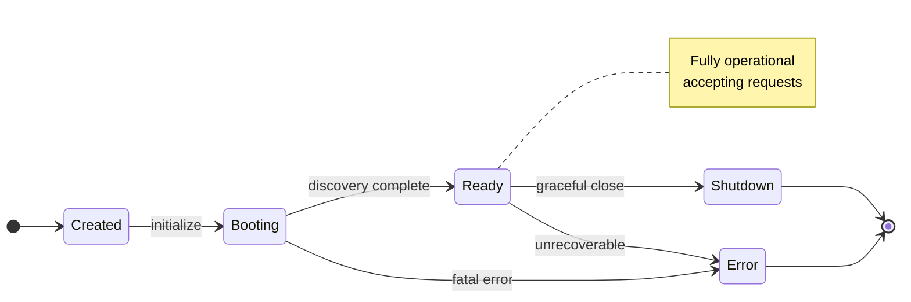
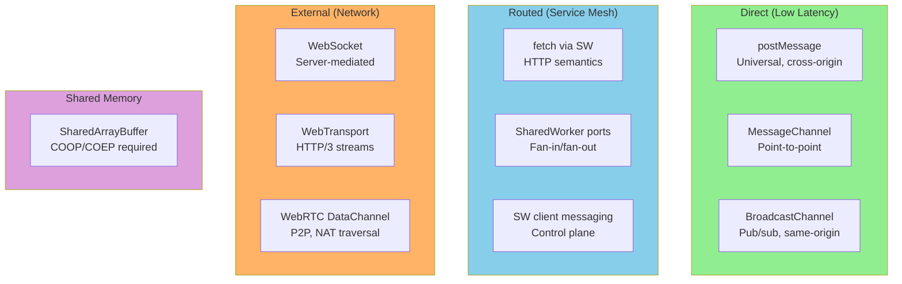
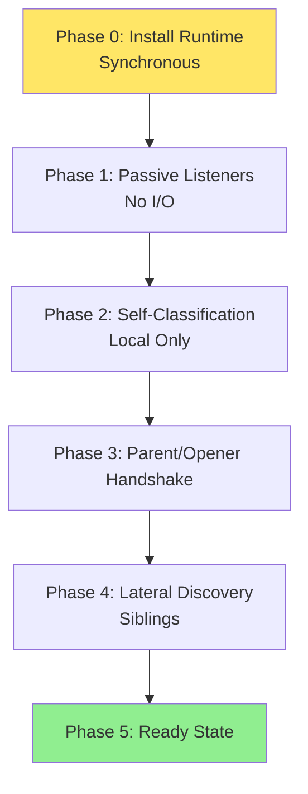
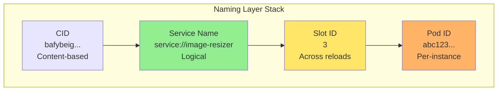
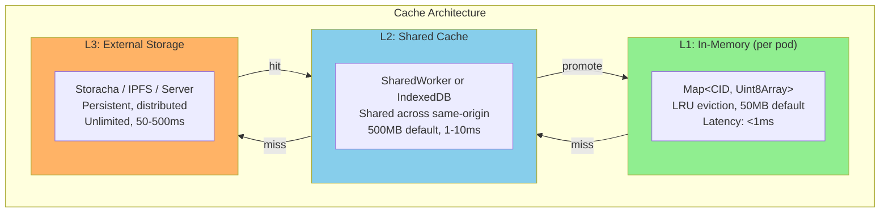
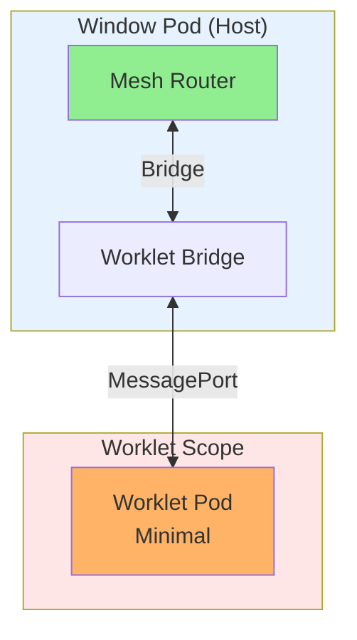

# BrowserMesh Core Concepts

## 1. Pod Model

A **Pod** is any browser execution context that has installed the BrowserMesh runtime. Pods are the fundamental unit of compute, identity, and communication.

### 1.1 Standard Pod Types

#### Browser Pods

| Type | Context | Lifecycle | Authority | Use Case |
|------|---------|-----------|-----------|----------|
| `WindowPod` | Top-level tab/window | User-controlled | Full | Primary UI, autonomous compute |
| `SpawnedPod` | `window.open()` result | Peer relationship | Full | Background tasks, multi-window |
| `FramePod` | iframe | Parent-controlled | Sandboxable | Plugins, isolated components |
| `WorkerPod` | Dedicated Worker | Creator-controlled | Compute only | CPU-intensive tasks |
| `SharedWorkerPod` | SharedWorker | Singleton per origin | Coordination | Registry, state management |
| `ServiceWorkerPod` | Service Worker | Event-driven | Routing/intercept | Control plane, mesh router |
| `WorkletPod` | AudioWorklet, etc. | Restricted | Minimal | Specialized compute |

#### Server Pods

| Type | Context | Lifecycle | Authority | Use Case |
|------|---------|-----------|-----------|----------|
| `ServerPod` | Node/Deno/Bun/Rust/Go | Long-lived | Full | Heavy compute, storage, ingress |

**Why Server Pods exist:** The browser is not special. The server is not special. The pod is the unit. Server pods speak the same protocol, have the same identity model, and participate in the same mesh. This removes asymmetry between browser↔server communication.

#### SpawnedPod vs FramePod (Important Distinction)

| Aspect | SpawnedPod (`window.open`) | FramePod (iframe) |
|--------|---------------------------|-------------------|
| Relationship | Has **opener** (peer) | Has **parent** (child) |
| Authority | Autonomous | Subordinate |
| Lifecycle | Can outlive opener | Dies with parent |
| Layout | Independent | Embedded in parent DOM |
| Visibility | Independent scheduling | Throttled with parent |
| Topology | Graph (peer-to-peer) | Tree (hierarchical) |

**Design principle:** Partition execution contexts by default authority and lifecycle, not by API surface.

#### Coordinator Pod (SharedWorker as Authority)

The SharedWorker is not just another pod—it acts as an **Authority Pod** with special responsibilities:

- **Slot Allocation**: Assigns stable slot IDs to window pods
- **Lease Management**: Tracks pod lifetimes, handles conflicts
- **ID Registry**: Maps slot IDs ↔ pod instance IDs
- **Coordination Hub**: Fan-in/fan-out messaging

This is the browser equivalent of etcd + lease manager—lightweight coordination within an origin.

### 1.2 Pod Lifecycle States



**State Definitions:**

| State | Description |
|-------|-------------|
| `created` | Runtime installed, no discovery yet |
| `booting` | Discovering topology, negotiating peers |
| `ready` | Fully operational, accepting requests |
| `shutdown` | Graceful termination in progress |
| `error` | Unrecoverable error state |

### 1.3 Pod Identity

Every pod has two forms of identity:

#### Instance Identity (Ephemeral)
- **Pod ID**: `base64url(SHA-256(Ed25519PublicKey))`
- Changes on every instantiation
- Used for: routing, tracing, messaging

#### Slot Identity (Stable)
- **Slot ID**: Integer assigned by SharedWorker coordinator
- Persists across reloads (via `window.name`)
- Used for: storage partitioning, lease management

```typescript
interface PodIdentity {
  // Cryptographic identity
  id: string;                    // base64url(SHA-256(pubkey))
  publicKey: Uint8Array;         // Ed25519 public key (32 bytes)

  // Slot identity (optional)
  slotId?: number;               // Assigned by coordinator
  slotName?: string;             // window.name or equivalent

  // Metadata
  kind: PodKind;
  origin: string;
  createdAt: number;             // performance.timeOrigin
}

type PodKind =
  | 'window'
  | 'spawned'
  | 'frame'
  | 'worker'
  | 'shared-worker'
  | 'service-worker'
  | 'worklet'
  | 'server';        // Server-side pods (Node, Deno, Bun, etc.)
```

---

## 2. Capability Model

BrowserMesh uses explicit capability negotiation. Pods MUST NOT assume channel availability.

### 2.1 Capability Categories

```typescript
interface PodCapabilities {
  // Messaging
  postMessage: boolean;
  messagePort: boolean;
  broadcastChannel: boolean | 'same-origin';
  sharedWorkerPorts: boolean;
  serviceWorkerMessaging: boolean;

  // Network
  fetch: boolean;
  fetchViaServiceWorker: boolean;
  webSocket: boolean;
  webTransport: boolean;
  webRTC: {
    dataChannel: boolean;
    requiresSignaling: boolean;
  };

  // Shared Memory
  sharedArrayBuffer: {
    enabled: boolean;
    requires?: ('COOP' | 'COEP')[];
  };

  // Storage
  storage: {
    indexedDB: boolean;
    cacheAPI: boolean;
    opfs: boolean;
    localStorage: boolean;  // Window-only
  };

  // Crypto
  crypto: {
    ed25519: boolean;
    x25519: boolean;
    webCrypto: boolean;
  };
}
```

### 2.2 Capability Detection

Capabilities MUST be detected at runtime, not assumed:

```typescript
function detectCapabilities(): PodCapabilities {
  return {
    postMessage: true,  // Always available
    messagePort: typeof MessageChannel !== 'undefined',
    broadcastChannel: typeof BroadcastChannel !== 'undefined',
    sharedWorkerPorts: typeof SharedWorker !== 'undefined',
    serviceWorkerMessaging: !!navigator?.serviceWorker?.controller,

    fetch: typeof fetch === 'function',
    fetchViaServiceWorker: !!navigator?.serviceWorker?.controller,
    webSocket: typeof WebSocket !== 'undefined',
    webTransport: typeof WebTransport !== 'undefined',
    webRTC: {
      dataChannel: typeof RTCPeerConnection !== 'undefined',
      requiresSignaling: true,
    },

    sharedArrayBuffer: {
      enabled: typeof SharedArrayBuffer !== 'undefined',
      requires: crossOriginIsolated ? [] : ['COOP', 'COEP'],
    },

    storage: {
      indexedDB: typeof indexedDB !== 'undefined',
      cacheAPI: typeof caches !== 'undefined',
      opfs: !!navigator?.storage?.getDirectory,
      localStorage: typeof localStorage !== 'undefined',
    },

    crypto: {
      ed25519: true,  // Now widely supported
      x25519: true,
      webCrypto: !!crypto?.subtle,
    },
  };
}
```

### 2.3 Capability Matrix by Pod Type

| Capability | Window | Frame | Worker | SharedWorker | ServiceWorker | Worklet |
|------------|--------|-------|--------|--------------|---------------|---------|
| postMessage | ✅ | ✅ | ✅ | ✅ | ✅ | ⚠️ |
| MessagePort | ✅ | ✅ | ✅ | ✅ | ✅ | ✅ |
| BroadcastChannel | ✅ | ✅ | ✅ | ✅ | ✅ | ⚠️ |
| SharedWorker | ✅ | ✅ | ✅ | ✅ | ❌ | ❌ |
| fetch | ✅ | ✅ | ✅ | ✅ | ✅ | ❌ |
| WebSocket | ✅ | ✅ | ✅ | ✅ | ✅ | ❌ |
| WebTransport | ✅ | ✅ | ⚠️ | ⚠️ | ⚠️ | ❌ |
| WebRTC | ✅ | ✅ | ⚠️ | ⚠️ | ❌ | ❌ |
| SharedArrayBuffer | ⚠️ | ⚠️ | ⚠️ | ⚠️ | ⚠️ | ⚠️ |
| IndexedDB | ✅ | ✅ | ✅ | ✅ | ✅ | ❌ |
| localStorage | ✅ | ✅ | ❌ | ❌ | ❌ | ❌ |

Legend: ✅ = native, ⚠️ = conditional, ❌ = unavailable

---

## 3. Communication Channels

### 3.1 Channel Taxonomy



### 3.2 Channel Selection Algorithm

```typescript
function selectChannel(
  source: PodCapabilities,
  target: PodCapabilities,
  requirements: ChannelRequirements
): ChannelType {
  // Prefer direct channels for low latency
  if (requirements.latency === 'low') {
    if (source.messagePort && target.messagePort) {
      return 'message-port';
    }
    if (source.sharedArrayBuffer.enabled && target.sharedArrayBuffer.enabled) {
      return 'shared-array-buffer';
    }
  }

  // Use routed channels for service mesh semantics
  if (requirements.semantics === 'http') {
    if (source.fetchViaServiceWorker && target.fetchViaServiceWorker) {
      return 'fetch-via-sw';
    }
  }

  // Fall back to universal channel
  return 'post-message';
}
```

---

## 4. Boot Protocol

Every pod follows a standardized boot sequence.

### 4.1 Boot Phases



### 4.2 Phase Details

#### Phase 0: Install Runtime
```typescript
// Synchronous, no async operations
const POD = Symbol.for('browsermesh.pod');
globalThis[POD] = createPodRuntime();
```

#### Phase 1: Passive Listeners
```typescript
// Install all potential parent/peer listeners BEFORE any announcements
window.addEventListener('message', handleIncomingMessage);
new BroadcastChannel('mesh:discovery').onmessage = handleDiscovery;
navigator.serviceWorker?.addEventListener('message', handleSWMessage);
```

#### Phase 2: Self-Classification
```typescript
const context = {
  hasParent: window.parent && window.parent !== window,
  hasOpener: !!window.opener,
  isTopLevel: window.top === window,
  isControlledBySW: !!navigator?.serviceWorker?.controller,
  visibility: document.visibilityState,
};
```

#### Phase 3: Parent Handshake
```typescript
// Attempt safe, non-assumptive contact with potential parents
if (context.hasParent) {
  window.parent.postMessage({
    type: 'MESH_HELLO',
    from: podIdentity,
    capabilities: podCapabilities,
  }, '*');
}

if (context.hasOpener) {
  window.opener.postMessage({
    type: 'MESH_HELLO',
    from: podIdentity,
    capabilities: podCapabilities,
  }, '*');
}
```

#### Phase 4: Lateral Discovery
```typescript
const bc = new BroadcastChannel('mesh:discovery');
bc.postMessage({
  type: 'MESH_HELLO',
  from: podIdentity,
  capabilities: podCapabilities,
});
```

#### Phase 5: Ready State
```typescript
pod.state = 'ready';
pod.emit('ready');
```

---

## 5. Message Envelope

All BrowserMesh messages use a standard envelope format.

### 5.1 Envelope Schema (CBOR)

```typescript
interface MeshEnvelope {
  // Header (always present)
  v: 1;                          // Protocol version
  id: string;                    // Message ID (UUID)
  type: MessageType;             // Message type
  from: string;                  // Sender pod ID
  to?: string;                   // Recipient pod ID (optional for broadcast)
  ts: number;                    // Timestamp (Date.now())

  // Routing (optional)
  route?: {
    hops: string[];              // Pod IDs traversed
    ttl: number;                 // Remaining hops
  };

  // Security (optional)
  sig?: Uint8Array;              // Ed25519 signature over payload
  enc?: {
    alg: 'x25519-xsalsa20-poly1305';
    nonce: Uint8Array;
    ephemeralKey?: Uint8Array;   // For initial handshake
  };

  // Payload
  payload: Uint8Array;           // CBOR-encoded payload
}

type MessageType =
  | 'hello'           // Discovery
  | 'ack'             // Acknowledgment
  | 'upgrade'         // Channel upgrade
  | 'request'         // RPC request
  | 'response'        // RPC response
  | 'stream-start'    // Stream initiation
  | 'stream-data'     // Stream chunk
  | 'stream-end'      // Stream termination
  | 'error';          // Error
```

### 5.2 Wire Format

```
┌─────────────────────────────────────────────────────────────┐
│  CBOR Map                                                    │
├─────────────────────────────────────────────────────────────┤
│  Key    │ Type      │ Required │ Description                │
├─────────────────────────────────────────────────────────────┤
│  "v"    │ uint      │ Yes      │ Protocol version (1)       │
│  "id"   │ text      │ Yes      │ Message UUID               │
│  "type" │ text      │ Yes      │ Message type               │
│  "from" │ text      │ Yes      │ Sender pod ID              │
│  "to"   │ text      │ No       │ Recipient pod ID           │
│  "ts"   │ uint      │ Yes      │ Timestamp (ms since epoch) │
│  "route"│ map       │ No       │ Routing metadata           │
│  "sig"  │ bytes     │ No       │ Ed25519 signature          │
│  "enc"  │ map       │ No       │ Encryption metadata        │
│  "p"    │ bytes     │ Yes      │ Payload (CBOR)             │
└─────────────────────────────────────────────────────────────┘
```

---

## 6. Cross-Origin Boundaries

Understanding what works across origins is critical for mesh design.

### 6.1 Cross-Origin Capable Channels

| Channel | Cross-Origin | Notes |
|---------|--------------|-------|
| `postMessage` | ✅ | Universal adapter, must specify `targetOrigin` |
| `fetch` | ⚠️ CORS | Requires server opt-in |
| `WebSocket` | ✅ | Server-mediated |
| `WebTransport` | ✅ | Server-mediated |
| `WebRTC` | ✅ | P2P, requires signaling |

### 6.2 Same-Origin Only

| Channel | Cross-Origin | Notes |
|---------|--------------|-------|
| `BroadcastChannel` | ❌ | Same-origin only |
| `SharedWorker` | ❌ | Origin-bound singleton |
| `IndexedDB` | ❌ | Same-origin |
| `localStorage` | ❌ | Same-origin |
| `ServiceWorker` intercept | ❌ | Same-origin scope |

**Design consequence:** Any cross-origin pod mesh must use `postMessage` + optional upgrade channels. Everything else becomes a capability layered on top.

---

## 7. Service Naming & Indirection

Beyond pod IDs, pods need stable service names.

### 7.1 Naming Layers



### 7.2 Service Resolution

```typescript
interface ServiceEntry {
  name: string;                    // service://image-resizer
  version?: string;                // semver
  endpoints: ServiceEndpoint[];
  loadBalancing: 'round-robin' | 'random' | 'sticky' | 'consistent-hash';
}

interface ServiceEndpoint {
  podId: string;
  weight: number;
  health: 'healthy' | 'degraded' | 'unhealthy';
  capabilities: string[];
}
```

---

## 8. Desired State & Reconciliation

Kubernetes' real invention wasn't containers—it was reconciliation.

### 8.1 Desired State Model

```typescript
interface DesiredState {
  services: {
    [name: string]: {
      replicas: number;
      capability: string;
      constraints?: {
        prefer?: 'server' | 'browser' | 'any';
        visibility?: 'foreground' | 'background' | 'any';
      };
    };
  };
}

// Example
const desired: DesiredState = {
  services: {
    'image-processor': {
      replicas: 2,
      capability: 'compute/wasm',
      constraints: { prefer: 'server' }
    }
  }
};
```

### 8.2 Reconciliation Loop

```typescript
async function reconcile(desired: DesiredState, actual: ActualState): Promise<void> {
  for (const [name, spec] of Object.entries(desired.services)) {
    const current = actual.services[name] || { replicas: 0 };

    if (current.replicas < spec.replicas) {
      // Scale up
      await spawnReplicas(name, spec.replicas - current.replicas, spec);
    } else if (current.replicas > spec.replicas) {
      // Scale down
      await terminateReplicas(name, current.replicas - spec.replicas);
    }

    // Health-based replacement
    for (const unhealthy of current.unhealthyPods) {
      await replacePod(unhealthy);
    }
  }
}
```

---

## 9. Compute Offload

Move CPU/memory intensive work to optimal execution environments.

### 9.1 Compute Request

```typescript
interface ComputeRequest {
  jobId: string;
  module: {
    cid: string;           // WASM/JS bundle (content-addressed)
    entry: string;         // Function name
  };
  input: Uint8Array;       // CBOR-encoded arguments
  constraints: {
    prefer?: 'server' | 'browser' | 'any';
    timeoutMs?: number;
    memoryMb?: number;
  };
}

interface ComputeResult {
  jobId: string;
  status: 'success' | 'error' | 'timeout' | 'cancelled';
  output?: Uint8Array;     // CBOR-encoded result
  outputCid?: string;      // For large results
  metrics?: {
    durationMs: number;
    podId: string;
  };
}
```

### 9.2 Compute Routing

```typescript
function selectComputePod(
  request: ComputeRequest,
  available: RoutingEntry[]
): RoutingEntry | null {
  const candidates = available.filter(pod =>
    pod.capabilities.includes('compute/wasm')
  );

  // Prefer based on constraints
  if (request.constraints.prefer === 'server') {
    const servers = candidates.filter(p => p.kind === 'server');
    if (servers.length > 0) return selectHealthiest(servers);
  }

  // Fall back to any capable pod
  return selectHealthiest(candidates);
}
```

---

## 10. Distributed Tracing

Every message should be traceable through the mesh.

### 10.1 Trace Context

```typescript
interface TraceContext {
  traceId: string;         // Spans entire request tree
  spanId: string;          // This specific operation
  parentSpanId?: string;   // Parent operation
}

// Attach to every envelope
interface MeshEnvelope {
  // ... existing fields ...
  trace?: TraceContext;
}
```

### 10.2 Observability Envelope

```typescript
interface ObservabilityEvent {
  timestamp: number;
  traceId: string;
  spanId: string;
  podId: string;
  kind: 'log' | 'metric' | 'span';
  data: unknown;
}
```

---

## 11. Bootstrap & Discovery

How does a fresh pod find the mesh?

### 11.1 Bootstrap Anchors

Every decentralized system needs initial contact points:

| Anchor | Use Case |
|--------|----------|
| Well-known server pod | `wss://mesh.example.com` |
| Service Worker | Same-origin discovery |
| SharedWorker | Same-origin coordination |
| QR code / invite link | Device pairing |
| BroadcastChannel | Same-origin gossip |

### 11.2 Bootstrap Sequence

```typescript
async function bootstrap(config: BootstrapConfig): Promise<PeerInfo[]> {
  const discovered: PeerInfo[] = [];

  // 1. Check for Service Worker controller
  if (navigator.serviceWorker?.controller) {
    const peers = await queryServiceWorker();
    discovered.push(...peers);
  }

  // 2. Connect to SharedWorker coordinator
  if (typeof SharedWorker !== 'undefined') {
    const peers = await queryCoordinator();
    discovered.push(...peers);
  }

  // 3. BroadcastChannel gossip
  const bc = new BroadcastChannel('mesh:discovery');
  bc.postMessage({ type: 'MESH_HELLO', from: localPodId });

  // 4. Connect to bootstrap servers (if configured)
  for (const url of config.bootstrapServers) {
    try {
      const bridge = await connectBridge(url);
      discovered.push(...await bridge.getPeers());
    } catch (e) {
      // Continue with other anchors
    }
  }

  return discovered;
}
```

---

## 12. Cache Layer (L1/L2/L3)

Hierarchical caching for content-addressed data and computed results.

### 12.1 Cache Hierarchy



### 12.2 Cache Implementation

```typescript
interface CacheConfig {
  l1: {
    maxSize: number;          // bytes
    maxEntries: number;
    ttl: number;              // ms, 0 = infinite
  };
  l2: {
    maxSize: number;
    backend: 'shared-worker' | 'indexeddb' | 'opfs';
    ttl: number;
  };
  l3: {
    providers: ('storacha' | 'ipfs' | 'server')[];
    pinOnFetch: boolean;
  };
}

class HierarchicalCache {
  private l1: LRUCache<string, Uint8Array>;
  private l2: L2Cache;
  private l3: L3Provider[];

  async get(cid: string): Promise<Uint8Array | null> {
    // Try L1
    const l1Result = this.l1.get(cid);
    if (l1Result) {
      this.stats.l1Hits++;
      return l1Result;
    }

    // Try L2
    const l2Result = await this.l2.get(cid);
    if (l2Result) {
      this.stats.l2Hits++;
      // Promote to L1
      this.l1.set(cid, l2Result);
      return l2Result;
    }

    // Try L3
    for (const provider of this.l3) {
      try {
        const l3Result = await provider.get(cid);
        if (l3Result) {
          this.stats.l3Hits++;
          // Promote to L2 and L1
          await this.l2.set(cid, l3Result);
          this.l1.set(cid, l3Result);
          return l3Result;
        }
      } catch (e) {
        // Try next provider
      }
    }

    this.stats.misses++;
    return null;
  }

  async put(cid: string, data: Uint8Array, options?: PutOptions): Promise<void> {
    // Always write to L1
    this.l1.set(cid, data);

    // Optionally write through to L2
    if (options?.writeThrough !== false) {
      await this.l2.set(cid, data);
    }

    // Pin to L3 if requested
    if (options?.pin) {
      for (const provider of this.l3) {
        await provider.put(cid, data);
      }
    }
  }
}
```

### 12.3 Cache Invalidation

```typescript
interface CacheInvalidation {
  // Time-based
  ttl: number;                // Auto-expire after ms

  // Version-based (for mutable references)
  version?: string;           // Invalidate older versions

  // Event-based
  invalidateOn?: string[];    // Event types that trigger invalidation
}

// Invalidation message
interface InvalidateMessage {
  type: 'MESH_CACHE_INVALIDATE';
  cids: string[];
  reason: 'ttl' | 'version' | 'explicit';
  timestamp: number;
}

// Broadcast invalidation across pods
function invalidate(cids: string[]): void {
  broadcast({
    type: 'MESH_CACHE_INVALIDATE',
    cids,
    reason: 'explicit',
    timestamp: Date.now(),
  });
}
```

---

## 13. Job Model (Batch + Streams)

Beyond RPC: durable jobs with progress, cancellation, and checkpoints.

### 13.1 Job Types

| Type | Description | Example |
|------|-------------|---------|
| RPC | Request-response, no state | `resize(image) → result` |
| Job | Durable, progress tracking | `transcode(video) → jobId` |
| Stream | Continuous data flow | `subscribe(topic) → events` |
| Workflow | Multi-step orchestration | `pipeline(steps) → results` |

### 13.2 Job Protocol

```typescript
// Job submission
interface JobRequest {
  type: 'JOB_SUBMIT';
  jobId: string;
  manifest: ModuleManifest;
  input: {
    cid?: string;           // Content-addressed input
    inline?: unknown;       // Small inline data
  };
  options: {
    priority: 'low' | 'normal' | 'high';
    timeout: number;
    retries: number;
    checkpoint: boolean;    // Enable durable checkpoints
  };
}

// Job status
interface JobStatus {
  type: 'JOB_STATUS';
  jobId: string;
  state: 'queued' | 'running' | 'paused' | 'completed' | 'failed' | 'cancelled';
  progress?: {
    percent: number;
    stage: string;
    message?: string;
  };
  result?: {
    cid?: string;
    inline?: unknown;
  };
  error?: {
    code: string;
    message: string;
    retryable: boolean;
  };
  checkpoint?: {
    cid: string;            // CID of checkpoint state
    resumable: boolean;
  };
}

// Job control
interface JobControl {
  type: 'JOB_CANCEL' | 'JOB_PAUSE' | 'JOB_RESUME';
  jobId: string;
}
```

### 13.3 Job Executor

```typescript
class JobExecutor {
  private jobs: Map<string, RunningJob> = new Map();

  async submit(request: JobRequest): Promise<string> {
    const job: RunningJob = {
      id: request.jobId,
      state: 'queued',
      request,
      startedAt: null,
      checkpoints: [],
    };

    this.jobs.set(request.jobId, job);
    this.emit('queued', job);

    // Start execution
    this.execute(job);

    return request.jobId;
  }

  private async execute(job: RunningJob): Promise<void> {
    job.state = 'running';
    job.startedAt = Date.now();
    this.emit('started', job);

    try {
      // Load module
      const module = await this.loadModule(job.request.manifest);

      // Create execution context with progress reporting
      const context: ExecutionContext = {
        jobId: job.id,
        reportProgress: (pct, stage, msg) => {
          this.emit('progress', { jobId: job.id, percent: pct, stage, message: msg });
        },
        checkpoint: async (state) => {
          if (job.request.options.checkpoint) {
            const cid = await this.saveCheckpoint(job.id, state);
            job.checkpoints.push(cid);
          }
        },
        isCancelled: () => job.state === 'cancelled',
      };

      // Execute
      const result = await module.run(job.request.input, context);

      job.state = 'completed';
      job.result = result;
      this.emit('completed', job);

    } catch (error) {
      job.state = 'failed';
      job.error = this.classifyError(error);

      if (job.error.retryable && job.retries < job.request.options.retries) {
        job.retries++;
        this.scheduleRetry(job);
      } else {
        this.emit('failed', job);
      }
    }
  }

  // Resume from checkpoint
  async resume(jobId: string, checkpointCid: string): Promise<void> {
    const checkpointState = await this.loadCheckpoint(checkpointCid);
    const job = this.jobs.get(jobId);

    if (job) {
      job.state = 'running';
      // Continue execution from checkpoint state
      await this.executeFromCheckpoint(job, checkpointState);
    }
  }
}
```

### 13.4 Streaming Jobs

```typescript
interface StreamJob {
  type: 'STREAM_SUBSCRIBE';
  streamId: string;
  topic: string;
  options: {
    fromOffset?: number | 'earliest' | 'latest';
    batchSize?: number;
    backpressure?: boolean;
  };
}

interface StreamEvent {
  type: 'STREAM_EVENT';
  streamId: string;
  offset: number;
  data: unknown;
  timestamp: number;
}

class StreamProcessor {
  private streams: Map<string, StreamContext> = new Map();

  async subscribe(request: StreamJob): Promise<AsyncIterable<StreamEvent>> {
    const stream = await this.createStream(request);
    this.streams.set(request.streamId, stream);

    return {
      async *[Symbol.asyncIterator]() {
        while (!stream.cancelled) {
          const events = await stream.nextBatch();
          for (const event of events) {
            yield event;

            // Handle backpressure
            if (request.options.backpressure) {
              await stream.waitForCredit();
            }
          }
        }
      }
    };
  }

  async unsubscribe(streamId: string): Promise<void> {
    const stream = this.streams.get(streamId);
    if (stream) {
      stream.cancelled = true;
      this.streams.delete(streamId);
    }
  }
}
```

---

## 14. Sandboxing & Least Privilege

Explicit capability restrictions for pods.

### 14.1 Sandbox Policies

```typescript
interface SandboxPolicy {
  // Browser APIs
  gestures: boolean;            // Can request user gestures
  opfs: boolean;                // Can access OPFS
  windows: boolean;             // Can open new windows
  notifications: boolean;       // Can show notifications
  clipboard: boolean;           // Can access clipboard

  // Mesh APIs
  serverAccess: boolean;        // Can talk to server pods
  crossOrigin: boolean;         // Can talk to other origins
  serviceRegistration: boolean; // Can register services
  broadcastDiscovery: boolean;  // Can discover other pods

  // Resource limits
  maxMemory: number;            // bytes
  maxCpu: number;               // percentage
  maxConnections: number;       // concurrent connections
}

// Default policies by pod type
const DEFAULT_POLICIES: Record<PodKind, SandboxPolicy> = {
  'window': {
    gestures: true,
    opfs: true,
    windows: true,
    notifications: true,
    clipboard: true,
    serverAccess: true,
    crossOrigin: true,
    serviceRegistration: true,
    broadcastDiscovery: true,
    maxMemory: Infinity,
    maxCpu: 100,
    maxConnections: 100,
  },
  'frame': {
    gestures: false,            // Parent must grant
    opfs: false,                // Isolated by default
    windows: false,
    notifications: false,
    clipboard: false,
    serverAccess: true,
    crossOrigin: false,         // Same-origin only
    serviceRegistration: false,
    broadcastDiscovery: true,
    maxMemory: 100_000_000,     // 100MB
    maxCpu: 50,
    maxConnections: 10,
  },
  'worker': {
    gestures: false,
    opfs: true,
    windows: false,
    notifications: false,
    clipboard: false,
    serverAccess: true,
    crossOrigin: true,
    serviceRegistration: true,
    broadcastDiscovery: true,
    maxMemory: 500_000_000,     // 500MB for compute
    maxCpu: 100,
    maxConnections: 20,
  },
  // ... other pod types
};
```

### 14.2 Policy Enforcement

```typescript
class PolicyEnforcer {
  constructor(private policy: SandboxPolicy) {}

  check(capability: keyof SandboxPolicy): boolean {
    return !!this.policy[capability];
  }

  checkOrThrow(capability: keyof SandboxPolicy): void {
    if (!this.check(capability)) {
      throw new PermissionDeniedError(
        `Capability '${capability}' not allowed by sandbox policy`
      );
    }
  }

  // Wrap APIs to enforce policy
  wrapFetch(originalFetch: typeof fetch): typeof fetch {
    return async (input, init) => {
      const url = new URL(input.toString());

      // Check cross-origin
      if (url.origin !== location.origin) {
        this.checkOrThrow('crossOrigin');
      }

      // Check server access
      if (url.protocol === 'mesh:') {
        this.checkOrThrow('serverAccess');
      }

      return originalFetch(input, init);
    };
  }
}
```

---

## 15. Visibility & Tab Lifecycle

Browser-specific scheduling and lifecycle considerations.

### 15.1 Visibility States

```typescript
type VisibilityState = 'visible' | 'hidden' | 'prerender';

interface PodVisibility {
  state: VisibilityState;
  lastTransition: number;
  hiddenDuration: number;

  // Capabilities affected by visibility
  throttled: boolean;         // Background tab throttling
  timerResolution: number;    // setTimeout minimum (1ms vs 1000ms)
  networkPriority: 'high' | 'low';
}

// Monitor visibility changes
document.addEventListener('visibilitychange', () => {
  pod.visibility.state = document.visibilityState;
  pod.visibility.lastTransition = Date.now();

  if (document.visibilityState === 'hidden') {
    pod.visibility.throttled = true;
    pod.visibility.timerResolution = 1000;
    pod.emit('visibility:hidden');
  } else {
    pod.visibility.throttled = false;
    pod.visibility.timerResolution = 1;
    pod.emit('visibility:visible');
  }
});
```

### 15.2 BFCache (Back-Forward Cache)

Pods must handle freeze/resume correctly:

```typescript
// Pod frozen - stop network, save state
document.addEventListener('freeze', () => {
  pod.state = 'frozen';

  // Close connections gracefully
  pod.connections.forEach(conn => conn.pause());

  // Persist critical state
  sessionStorage.setItem('pod:state', JSON.stringify({
    id: pod.id,
    peers: pod.routingTable.snapshot(),
    pendingMessages: pod.outbox.drain(),
  }));

  pod.emit('freeze');
});

// Pod resumed from BFCache
document.addEventListener('resume', () => {
  pod.state = 'resuming';

  // Restore state
  const saved = JSON.parse(sessionStorage.getItem('pod:state') || '{}');

  // Validate identity hasn't changed
  if (saved.id !== pod.id) {
    pod.regenerateIdentity();
  }

  // Reconnect
  pod.connections.forEach(conn => conn.resume());

  // Re-announce presence
  pod.announce();

  pod.state = 'ready';
  pod.emit('resume');
});

// Handle page show (includes BFCache restore)
window.addEventListener('pageshow', (event) => {
  if (event.persisted) {
    // Page was restored from BFCache
    pod.emit('bfcache:restore');

    // Re-validate all peer connections
    pod.routingTable.revalidateAll();
  }
});
```

### 15.3 Background Tab Throttling

```typescript
interface ThrottlingConfig {
  // Minimum work intervals when hidden
  minInterval: number;           // 1000ms for hidden tabs

  // Budget-based execution
  backgroundBudget: number;      // ms of CPU per period
  budgetPeriod: number;          // 10000ms (10 seconds)

  // Network throttling
  maxBackgroundFetches: number;  // Concurrent fetches allowed
}

class ThrottleManager {
  private budget = 0;
  private lastReset = Date.now();

  canExecute(estimatedMs: number): boolean {
    if (!pod.visibility.throttled) return true;

    this.maybeResetBudget();
    return this.budget >= estimatedMs;
  }

  consume(ms: number): void {
    this.budget = Math.max(0, this.budget - ms);
  }

  private maybeResetBudget(): void {
    const now = Date.now();
    if (now - this.lastReset > this.config.budgetPeriod) {
      this.budget = this.config.backgroundBudget;
      this.lastReset = now;
    }
  }
}
```

### 15.4 Visibility-Aware Scheduling

```typescript
interface SchedulingHints {
  visibility: 'any' | 'visible-only' | 'background-ok';
  priority: 'immediate' | 'high' | 'normal' | 'idle';
  deadline?: number;
}

async function scheduleWork(
  work: () => Promise<void>,
  hints: SchedulingHints
): Promise<void> {
  // Check visibility requirement
  if (hints.visibility === 'visible-only' && pod.visibility.throttled) {
    // Wait for visibility or deadline
    await Promise.race([
      waitForVisibility(),
      hints.deadline ? delay(hints.deadline - Date.now()) : never(),
    ]);
  }

  // Use appropriate scheduler
  switch (hints.priority) {
    case 'immediate':
      return work();
    case 'high':
      return queueMicrotask(() => work());
    case 'normal':
      return new Promise(resolve => setTimeout(() => resolve(work()), 0));
    case 'idle':
      return new Promise(resolve =>
        requestIdleCallback(() => resolve(work()))
      );
  }
}
```

---

## 16. Worklet Constraints

Special considerations for AudioWorklet, PaintWorklet, and other worklet contexts.

### 16.1 Worklet Capabilities

| Capability | AudioWorklet | PaintWorklet | AnimationWorklet | LayoutWorklet |
|------------|--------------|--------------|------------------|---------------|
| postMessage | ❌ | ❌ | ❌ | ❌ |
| MessagePort | ✅ | ❌ | ❌ | ❌ |
| SharedArrayBuffer | ⚠️ | ❌ | ❌ | ❌ |
| fetch | ❌ | ❌ | ❌ | ❌ |
| IndexedDB | ❌ | ❌ | ❌ | ❌ |
| Crypto.subtle | ❌ | ❌ | ❌ | ❌ |
| BroadcastChannel | ❌ | ❌ | ❌ | ❌ |

### 16.2 AudioWorklet Pod Pattern

AudioWorklet requires special handling due to its restricted environment:

```typescript
// Main thread: create AudioWorklet pod
class AudioWorkletPodHost {
  private worklet: AudioWorkletNode;
  private port: MessagePort;

  async create(context: AudioContext): Promise<void> {
    await context.audioWorklet.addModule('pod-processor.js');

    this.worklet = new AudioWorkletNode(context, 'pod-processor');
    this.port = this.worklet.port;

    // Bridge messages to mesh
    this.port.onmessage = (event) => {
      this.bridgeToMesh(event.data);
    };
  }

  // Forward mesh messages to worklet
  send(message: MeshEnvelope): void {
    this.port.postMessage(message);
  }
}

// Worklet thread: minimal pod implementation
class PodProcessor extends AudioWorkletProcessor {
  constructor() {
    super();

    // Minimal identity (no crypto.subtle access)
    this.id = this.generateSimpleId();

    this.port.onmessage = (event) => {
      this.handleMeshMessage(event.data);
    };
  }

  // Use port for all mesh communication
  sendToMesh(message: MeshEnvelope): void {
    this.port.postMessage(message);
  }

  process(inputs, outputs, parameters) {
    // Audio processing logic
    return true;
  }
}

registerProcessor('pod-processor', PodProcessor);
```

### 16.3 Worklet Bridge Pattern

Since worklets can't access most APIs, the parent pod acts as a bridge:



---

## 17. libp2p Design Alignment

BrowserMesh borrows key concepts from libp2p while adapting for browser constraints.

### 17.1 Concepts Borrowed

| libp2p Concept | BrowserMesh Equivalent | Notes |
|----------------|------------------------|-------|
| Peer ID (hash of pubkey) | Pod ID | Same approach |
| Multiaddr | Channel info array | Similar intent, browser-native |
| Protocol negotiation | Capability exchange | Mesh-specific protocols |
| Connection upgrade | Channel upgrade | plaintext → encrypted |
| Stream multiplexing | MessagePort/Channel ID | Native browser multiplexing |
| Peer memory | Routing table | Trust-on-first-use |
| DHT | Coordinator + gossip | Lighter weight |
| PubSub | BroadcastChannel + relay | Same-origin optimized |

### 17.2 Concepts NOT Borrowed

| libp2p Concept | Why Not | BrowserMesh Alternative |
|----------------|---------|-------------------------|
| TCP/QUIC transports | Not available in browser | WebSocket/WebTransport/WebRTC |
| NAT hole punching | Handled by browser | WebRTC ICE, server relay |
| Full DHT | Overkill for browser | Coordinator-assisted gossip |
| Noise/TLS handshakes | Already in transport | ECDH over secure channel |
| mplex/yamux | Not needed | Native browser multiplexing |
| mDNS discovery | Not available | BroadcastChannel + bootstrap |

### 17.3 Transport Stack Comparison

```mermaid
graph TD
    subgraph libp2p["libp2p (Node/Go)"]
        L1[Application]
        L2[Protocols<br/>DHT, PubSub]
        L3[Stream Multiplexing<br/>mplex/yamux]
        L4[Secure Channel<br/>Noise/TLS]
        L5[Transport<br/>TCP/QUIC/WS]

        L1 --> L2 --> L3 --> L4 --> L5
    end

    subgraph BrowserMesh["BrowserMesh"]
        B1[Application]
        B2[Services<br/>RPC, Jobs, Streams]
        B3[Mesh Routing<br/>envelope-based]
        B4[Channel Abstraction<br/>MessagePort/etc.]
        B5[Browser Transport<br/>postMessage/WS/WebRTC/WT]

        B1 --> B2 --> B3 --> B4 --> B5
    end

    style L1 fill:#FFB366
    style B1 fill:#90EE90
    style L5 fill:#E6E6E6
    style B5 fill:#87CEEB
```



### 17.4 Recommended libp2p Libraries

For server pods that want interop:

```typescript
// Server pod can use js-libp2p for external connectivity
import { createLibp2p } from 'libp2p';
import { webSockets } from '@libp2p/websockets';
import { noise } from '@chainsafe/libp2p-noise';

const libp2p = await createLibp2p({
  transports: [webSockets()],
  connectionEncryption: [noise()],
  // ... other config
});

// Bridge libp2p peers to mesh
libp2p.addEventListener('peer:connect', (event) => {
  const peerId = event.detail.id;
  mesh.registerExternalPeer({
    id: peerId.toString(),
    transport: 'libp2p',
    handle: event.detail,
  });
});
```

---

## Next Steps

- [Identity & Crypto](../identity/README.md) — Key generation, derivation, handshakes
- [Mesh Routing](../routing/README.md) — Discovery, routing tables, channel upgrades
