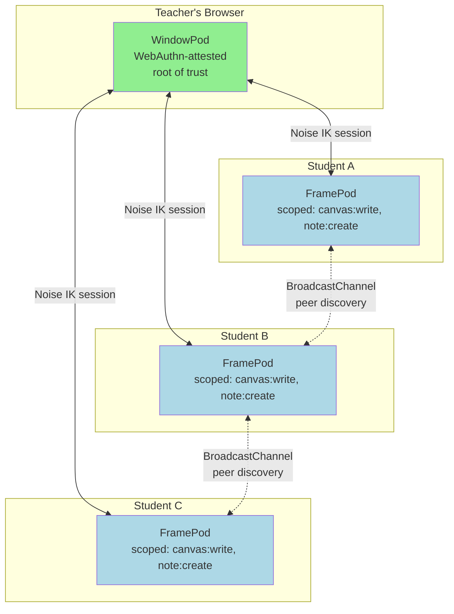
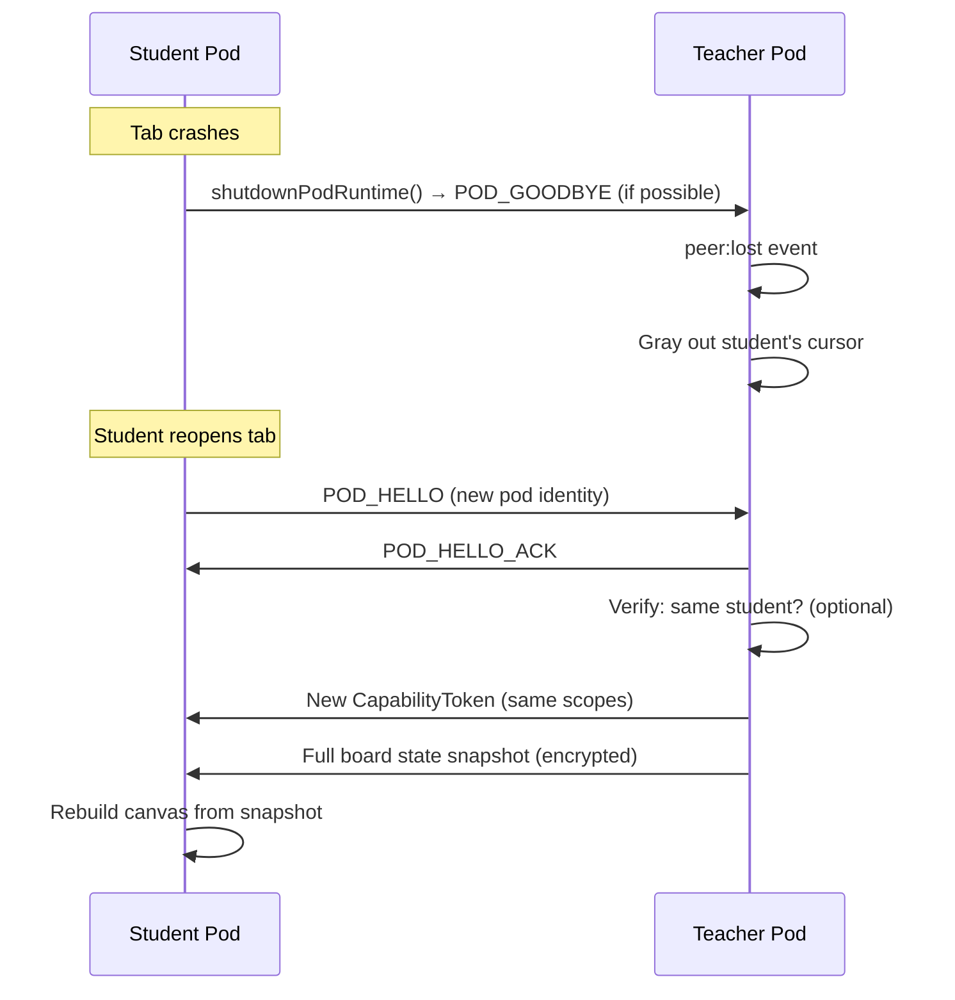

# Classroom Collab Board

A real-time shared whiteboard that runs entirely in participants' browsers — no server, no sign-up.

## Overview

A teacher opens a tab, authenticates with a fingerprint, and shares a URL. Students click the link and join the board instantly. Drawing, sticky notes, and cursor positions sync across all participants in real time. When class ends, the capability tokens expire and the board freezes.

## Architecture



## Boot Sequence

### Teacher (Host)

```typescript
import { installPodRuntime } from '@browsermesh/runtime';

// Teacher opens the app — user gesture available
const pod = await installPodRuntime(globalThis, {
  webauthn: {
    rp: { id: location.hostname, name: 'Collab Board' },
    required: false,  // Degrade gracefully if no authenticator
  },
});

pod.on('ready', ({ role }) => {
  console.log(`Teacher pod ready — role: ${role}, attested: ${pod.info.attested}`);
  initBoard(pod);
  displayJoinCode(pod.info.id);
});
```

### Student (Joiner)

```typescript
// Student clicks a link that opens an iframe pointed at the board
// The FramePod boots without WebAuthn (no user gesture, derives from parent)
const pod = await installPodRuntime(globalThis);

pod.on('parent:connected', async (parent) => {
  console.log(`Connected to teacher: ${parent.info.id}`);

  // Request drawing capability
  const assertion = await pod.credentials.createHandshakeAssertion({
    challenge: parent.challenge,
    capabilities: { requestedScopes: ['canvas:write', 'note:create'] },
  });

  sendToParent(assertion);
});
```

## Capability Model

The teacher's pod is the sole authority for granting capabilities:

```typescript
// Teacher-side: grant scoped, time-limited capabilities
async function onStudentJoin(studentAssertion: PodHandshakeAssertion) {
  // Verify the student's identity
  const valid = await PodSigner.verify(
    studentAssertion.pod.publicKey,
    studentAssertion.assertion.challenge,
    studentAssertion.assertion.signature
  );

  if (!valid) return;

  // Grant capabilities that expire when class ends
  const classEndTime = getClassEndTime(); // e.g. 50 minutes from now

  const token = await capabilityManager.grant(
    `board/${boardId}/canvas`,
    studentAssertion.pod.publicKey,
    {
      scope: ['canvas:write', 'note:create'],
      expires: classEndTime,
    }
  );

  // Send token to student over encrypted session
  const session = await sessionManager.getOrCreateSession(
    studentAssertion.pod.id,
    studentAssertion.pod.publicKey,
    channel
  );

  const encrypted = await session.encrypt(cbor.encode(token));
  sendToStudent(studentAssertion.pod.id, encrypted);
}
```

### Scope Definitions

| Scope | Allows | Denied |
|-------|--------|--------|
| `canvas:write` | Draw strokes, place shapes | Erase others' work, resize canvas |
| `canvas:read` | View all content | (implicit — all participants) |
| `note:create` | Add sticky notes | Delete others' notes |
| `board:admin` | Full control (teacher only) | — |

## Real-Time Sync

Drawing operations are broadcast over encrypted BroadcastChannel messages:

```typescript
interface DrawOperation {
  type: 'stroke' | 'shape' | 'note' | 'cursor';
  podId: string;         // Author
  timestamp: number;
  data: StrokeData | ShapeData | NoteData | CursorData;
  signature: Uint8Array; // Signed by author's identity key
}

// Student draws a stroke
async function broadcastStroke(points: Point[]) {
  const op: DrawOperation = {
    type: 'stroke',
    podId: pod.info.id,
    timestamp: Date.now(),
    data: { points, color: myColor, width: 2 },
    signature: await pod.identity.sign(cbor.encode({ points, timestamp })),
  };

  // Encrypt and broadcast
  const encrypted = await session.encrypt(cbor.encode(op));
  broadcastChannel.postMessage(encrypted);
}

// All pods: receive and verify
broadcastChannel.onmessage = async (e) => {
  const decrypted = await session.decrypt(e.data);
  const op: DrawOperation = cbor.decode(decrypted);

  // Verify the author signed this operation
  const authorKey = peers.get(op.podId)?.publicKey;
  if (!authorKey) return;

  const valid = await PodSigner.verify(authorKey, op.data, op.signature);
  if (!valid) return;

  // Verify author has capability for this operation
  const token = peerCapabilities.get(op.podId);
  if (!token || !(await capabilityManager.verifyWithRevocation(token))) return;

  applyOperation(op);
};
```

## Failure Recovery



- The teacher's pod holds canonical board state
- Student pods are stateless renderers — they rebuild from teacher's snapshot on rejoin
- No stale sessions: crashed student gets a fresh identity, fresh capability, fresh session keys

## Why BrowserMesh

| Traditional Approach | BrowserMesh Approach |
|---------------------|---------------------|
| WebSocket server relaying all messages | Direct pod-to-pod via BroadcastChannel + postMessage |
| Database storing board state | Teacher's pod is the source of truth |
| OAuth/session cookies for auth | WebAuthn attestation (teacher) + capability tokens (students) |
| Server-side access control | Capability tokens with scoped permissions and expiry |
| Provisioned accounts | Zero accounts — join by link |
