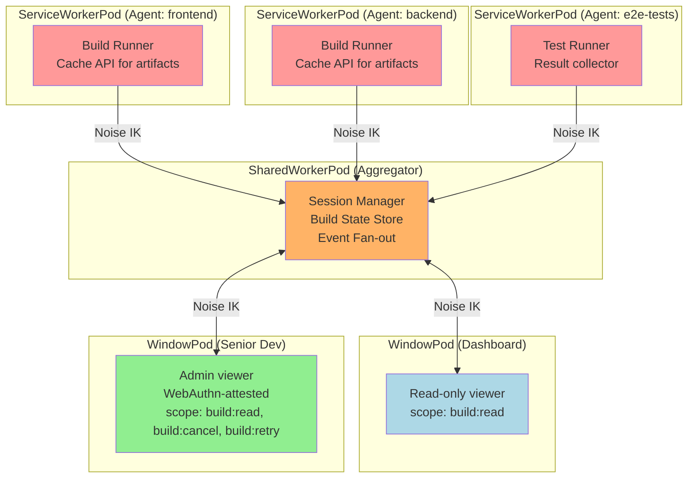

# Distributed Build Monitor

A CI/CD dashboard where build agents, an aggregator, and viewer tabs all run as BrowserMesh pods within a single developer's browser.

## Overview

Each build agent runs as a ServiceWorkerPod registered on a project subdomain. A SharedWorkerPod acts as a persistent aggregator that survives tab closes. Any browser tab the developer opens becomes a read-only viewer. A senior developer who authenticates with WebAuthn can take control actions — cancel, retry, promote.

## Architecture



## Pod Roles and Capabilities

```typescript
// Capability detection drives what each pod can do
const caps = detectCapabilities();

// ServiceWorkerPod: no DOM, no WebRTC, but has Cache API
// Perfect for build artifact storage
assert(caps.dom === false);
assert(caps.cacheAPI === true);
assert(caps.webRTC === false);

// SharedWorkerPod: no DOM, no localStorage, but persists across tabs
// Perfect for aggregation
assert(caps.dom === false);
assert(caps.localStorage === false);
assert(caps.indexedDB === true);

// WindowPod: full capabilities, but transient
assert(caps.dom === true);
assert(caps.webCrypto === true);
```

### Capability Escalation

```typescript
// Any tab gets read-only access
const readOnlyToken = await aggregator.capabilityManager.grant(
  'builds/*',
  viewerPod.publicKey,
  { scope: ['build:read', 'build:logs'] }
);

// WebAuthn-attested tab gets admin access
if (viewerPod.attestationProof) {
  const adminToken = await aggregator.capabilityManager.grant(
    'builds/*',
    viewerPod.publicKey,
    { scope: ['build:read', 'build:logs', 'build:cancel', 'build:retry', 'build:promote'] }
  );
}
```

## Build Agent (ServiceWorkerPod)

```typescript
// service-worker.ts — registered per project
const pod = await installPodRuntime(self);

// Connect to aggregator SharedWorker
const aggregatorPort = await connectToSharedWorker('build-aggregator');
const session = await pod.sessionManager.getOrCreateSession(
  aggregatorId,
  aggregatorPublicKey,
  aggregatorPort
);

// Report build status
async function reportStatus(build: BuildInfo) {
  const status: BuildStatusMessage = {
    type: 'BUILD_STATUS',
    agentId: pod.info.id,
    project: self.registration.scope,
    build: {
      id: build.id,
      status: build.status,  // 'queued' | 'running' | 'passed' | 'failed'
      step: build.currentStep,
      logs: build.recentLogs,
      artifacts: build.artifactKeys,  // Cache API keys
      duration: Date.now() - build.startedAt,
    },
    timestamp: Date.now(),
    signature: await pod.identity.sign(cbor.encode(build)),
  };

  const encrypted = await session.encrypt(cbor.encode(status));
  aggregatorPort.postMessage(encrypted);
}

// Handle admin commands (cancel, retry)
session.onMessage(async (encrypted) => {
  const msg = cbor.decode(await session.decrypt(encrypted));

  if (msg.type === 'BUILD_CANCEL') {
    // Verify the sender has cancel capability
    const token = msg.capabilityToken;
    if (await capabilityManager.verifyWithRevocation(token)) {
      if (token.scope.includes('build:cancel')) {
        await cancelBuild(msg.buildId);
        reportStatus({ ...currentBuild, status: 'cancelled' });
      }
    }
  }
});

// ServiceWorker persists — survives tab closes
// Continues reporting even when no dashboard tabs are open
self.addEventListener('fetch', (event) => {
  // Can also intercept build webhook callbacks
  if (event.request.url.includes('/webhook/build')) {
    event.respondWith(handleBuildWebhook(event.request));
  }
});
```

## Aggregator (SharedWorkerPod)

```typescript
// shared-worker.ts
const pod = await installPodRuntime(self);

interface AggregatedState {
  builds: Map<string, BuildInfo>;
  agents: Map<string, AgentInfo>;
  viewers: Map<string, ViewerInfo>;
}

const state: AggregatedState = {
  builds: new Map(),
  agents: new Map(),
  viewers: new Map(),
};

// Handle connections from new tabs and agents
self.onconnect = async (e) => {
  const port = e.ports[0];

  port.onmessage = async (msg) => {
    const data = msg.data;

    if (data.type === 'POD_HELLO') {
      const peerInfo = await handlePeerHello(pod, data);

      // Classify: agent or viewer?
      if (peerInfo.kind === 'service-worker') {
        state.agents.set(peerInfo.id, {
          info: peerInfo,
          port,
          lastSeen: Date.now(),
        });
      } else {
        // WindowPod — grant appropriate capabilities
        const isAttested = !!data.attestationProof;
        const token = await grantViewerCapabilities(peerInfo, isAttested);

        state.viewers.set(peerInfo.id, {
          info: peerInfo,
          port,
          token,
          isAdmin: isAttested,
        });

        // Send current state snapshot
        const session = sessionManager.getSession(peerInfo.id);
        const snapshot = await session.encrypt(cbor.encode({
          type: 'STATE_SNAPSHOT',
          builds: Object.fromEntries(state.builds),
          agents: Array.from(state.agents.keys()),
        }));
        port.postMessage(snapshot);
      }
    }

    if (data.type === 'BUILD_STATUS') {
      // Decrypt, verify, update state, fan out to viewers
      await handleBuildStatus(data, port);
    }
  };
};

// Fan out updates to all connected viewers
async function fanOutToViewers(update: BuildStatusMessage) {
  for (const [viewerId, viewer] of state.viewers) {
    const session = sessionManager.getSession(viewerId);
    if (session?.isOpen()) {
      const encrypted = await session.encrypt(cbor.encode(update));
      viewer.port.postMessage(encrypted);
    } else {
      // Session closed or expired — remove viewer
      state.viewers.delete(viewerId);
    }
  }
}
```

## Session Rotation Under Load

Build agents can produce thousands of status messages per hour. The `SessionManager` handles re-keying transparently:

```typescript
// In the aggregator, session rotation happens automatically
const session = await sessionManager.getOrCreateSession(
  agentId,
  agentPublicKey,
  agentPort
);

// After 1M messages, shouldRekey() returns true
// getOrCreateSession() detects this and performs a fresh handshake
// The old session is closed (keys zeroed), new session takes over
// No message loss — the re-key happens between messages
```

## Lifecycle: What Survives What

```
Tab closed:           WindowPod shuts down → peer:lost on aggregator
                      SharedWorkerPod SURVIVES (still has other tab connections)
                      ServiceWorkerPods SURVIVE (independent lifecycle)

All tabs closed:      SharedWorkerPod shuts down (no connections left)
                      ServiceWorkerPods SURVIVE (browser keeps them for fetch events)

Browser restart:      ServiceWorkerPods revive on first fetch to their scope
                      SharedWorkerPod recreated when first tab opens
                      New Noise IK handshakes establish fresh sessions
                      Stored identities restored via pod.credentials.get()
```

## Why BrowserMesh

- **Zero server**: No CI dashboard server to maintain or secure
- **Persistent agents**: ServiceWorkers run builds even when the developer isn't watching
- **Encrypted by default**: Build logs (which may contain secrets in output) are encrypted in transit between pods
- **Hardware-gated admin**: Only a fingerprint-verified developer can cancel or retry builds
- **Automatic cleanup**: Session rotation and pod shutdown prevent resource leaks
