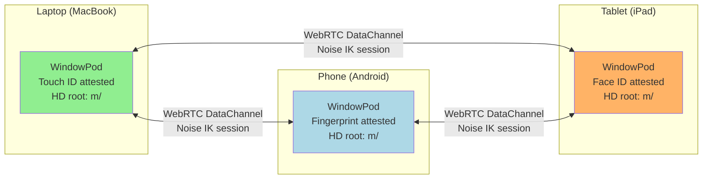
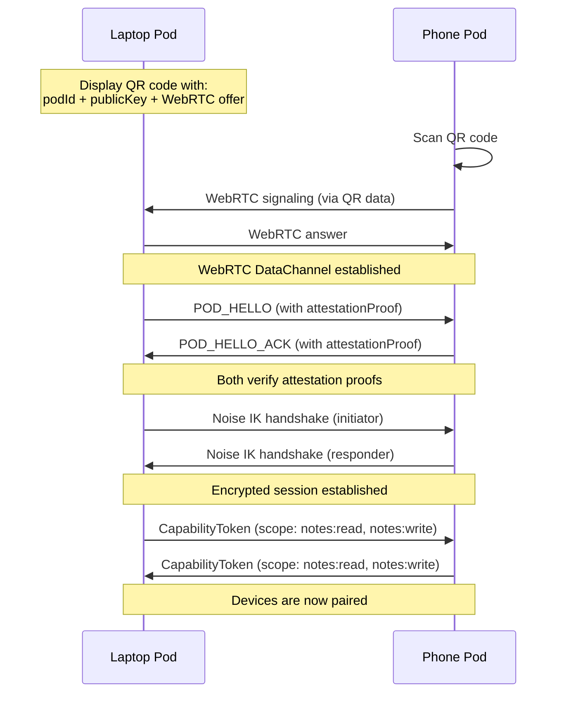

# Peer-to-Peer Encrypted Notes

A note-taking app where notes sync across your own devices without any cloud storage. Every note is encrypted end-to-end using session keys derived from hardware-attested identity.

## Overview

Your phone, laptop, and tablet each run a BrowserMesh pod. On first use, each device creates a WebAuthn credential bound to its platform authenticator (Touch ID, Windows Hello, Android biometric). Devices are paired by scanning a QR code containing the other device's public key. After pairing, notes sync over WebRTC DataChannels, encrypted with per-note keys derived via HD key derivation.

## Architecture



## Device Setup

### First Use: Create Identity

```typescript
const pod = await installPodRuntime(globalThis, {
  webauthn: {
    rp: { id: 'notes.local', name: 'Encrypted Notes' },
    usePrf: true,  // Use PRF extension for key encryption
  },
});

// The pod now has:
// - A WebAuthn credential (hardware-bound)
// - An Ed25519 identity keypair
// - An X25519 static DH keypair
// - An HD root secret for deriving per-note keys

console.log(`Device identity: ${pod.info.id}`);
console.log(`Attested: ${pod.info.attested}`);
```

### Return Visit: Restore Identity

```typescript
const storedCredentialId = localStorage.getItem('credentialId');

const pod = await installPodRuntime(globalThis, {
  webauthn: {
    credentialId: new Uint8Array(base64urlDecode(storedCredentialId)),
    usePrf: true,
  },
});

// Same identity restored — same pod ID, same keys
```

## Device Pairing



### QR Code Generation

```typescript
function generatePairingQR(pod: PodRuntime): string {
  const pairingData = {
    podId: pod.info.id,
    publicKey: base64urlEncode(pod.identity.publicKeyRaw),
    attested: pod.info.attested,
    // WebRTC offer for direct connection
    offer: await createWebRTCOffer(),
    // Timestamp to prevent replay
    timestamp: Date.now(),
  };

  // Sign the pairing data
  const signature = await pod.identity.sign(cbor.encode(pairingData));

  return JSON.stringify({ ...pairingData, signature: base64urlEncode(signature) });
}
```

## Per-Note Encryption

Each note gets its own encryption key derived via HD key derivation:

```typescript
// Derive a unique key for each note
async function noteKey(rootSecret: Uint8Array, noteId: string): Promise<DerivedKey> {
  // Path: m/notes/{noteId}
  return deriveKey(rootSecret, `m/notes/${noteId}`, 'X25519');
}

// Encrypt a note for sync
async function encryptNote(
  note: Note,
  session: SessionCrypto,
  rootSecret: Uint8Array
): Promise<Uint8Array> {
  // Derive note-specific key
  const nk = await noteKey(rootSecret, note.id);

  // Encrypt note content with note key
  const noteData = cbor.encode({
    id: note.id,
    title: note.title,
    body: note.body,
    tags: note.tags,
    updatedAt: note.updatedAt,
    version: note.version,
  });

  // Double encryption:
  // 1. Note key encrypts the content (so it can be stored encrypted at rest)
  // 2. Session key encrypts for transit (forward secrecy)
  const atRestEncrypted = await encryptWithDerivedKey(nk, noteData);
  return session.encrypt(atRestEncrypted);
}
```

### Key Hierarchy

```
HD Root Secret (from WebAuthn PRF or random)
├── m/notes/{noteId}          — Per-note encryption key
├── m/devices/{deviceId}      — Per-device pairing key
├── m/sync/changelog          — Sync metadata encryption
└── m/backup/export           — Export encryption key
```

## Sync Protocol

```typescript
interface SyncMessage {
  type: 'SYNC_REQUEST' | 'SYNC_RESPONSE' | 'SYNC_PUSH' | 'SYNC_ACK';
  deviceId: string;
  // Vector clock for conflict resolution
  vectorClock: Record<string, number>;
  // Encrypted note payloads
  notes?: Uint8Array[];
  timestamp: number;
  signature: Uint8Array;
}

// Sync on reconnection
async function syncWithPeer(peerId: string) {
  const session = sessionManager.getSession(peerId);
  if (!session?.isOpen()) return;

  // Send our vector clock
  const request: SyncMessage = {
    type: 'SYNC_REQUEST',
    deviceId: pod.info.id,
    vectorClock: getLocalVectorClock(),
    timestamp: Date.now(),
    signature: await pod.identity.sign(cbor.encode(getLocalVectorClock())),
  };

  const encrypted = await session.encrypt(cbor.encode(request));
  sendToPeer(peerId, encrypted);
}

// Handle incoming sync
async function handleSyncRequest(peerId: string, request: SyncMessage) {
  // Find notes that the peer is missing
  const missingNotes = findMissingNotes(request.vectorClock);

  // Encrypt each note with per-note keys, then with session key
  const encryptedNotes = await Promise.all(
    missingNotes.map(note => encryptNote(note, sessionManager.getSession(peerId)!, rootSecret))
  );

  const response: SyncMessage = {
    type: 'SYNC_RESPONSE',
    deviceId: pod.info.id,
    vectorClock: getLocalVectorClock(),
    notes: encryptedNotes,
    timestamp: Date.now(),
    signature: await pod.identity.sign(cbor.encode(getLocalVectorClock())),
  };

  const encrypted = await sessionManager.getSession(peerId)!.encrypt(cbor.encode(response));
  sendToPeer(peerId, encrypted);
}
```

## Device Revocation

When a device is lost or stolen:

```typescript
// From any remaining paired device
async function revokeDevice(lostDeviceId: string) {
  // Revoke all capability tokens granted to the lost device
  await capabilityManager.revokePath(`notes:*`);

  // Remove from paired devices
  pairedDevices.delete(lostDeviceId);

  // Close any existing session
  sessionManager.closeSession(lostDeviceId);

  // Notify other paired devices to also revoke
  for (const [peerId, peer] of pairedDevices) {
    const session = sessionManager.getSession(peerId);
    if (session?.isOpen()) {
      const revocationNotice = await session.encrypt(cbor.encode({
        type: 'DEVICE_REVOKED',
        revokedDeviceId: lostDeviceId,
        revokedBy: pod.info.id,
        timestamp: Date.now(),
        signature: await pod.identity.sign(
          cbor.encode({ action: 'revoke', target: lostDeviceId })
        ),
      }));
      sendToPeer(peerId, revocationNotice);
    }
  }

  // Re-key all notes (derive new keys so revoked device can't decrypt future versions)
  await rekeyAllNotes();
}

async function rekeyAllNotes() {
  // Generate new HD root
  const newRootSecret = crypto.getRandomValues(new Uint8Array(32));

  // Re-encrypt all notes with new keys
  for (const note of getAllNotes()) {
    const oldKey = await noteKey(rootSecret, note.id);
    const newKey = await noteKey(newRootSecret, note.id);

    const decrypted = await decryptWithDerivedKey(oldKey, note.encrypted);
    note.encrypted = await encryptWithDerivedKey(newKey, decrypted);
    note.version++;
  }

  // Store new root (protected by WebAuthn PRF)
  rootSecret = newRootSecret;
  await storeEncryptedRoot(newRootSecret);

  // Sync re-keyed notes to remaining devices
  for (const peerId of pairedDevices.keys()) {
    await syncWithPeer(peerId);
  }
}
```

## Credential Lifecycle

```typescript
// Delete credential when user wants to wipe a device
await pod.credentials.delete({
  id: pod.info.id,
  signalWebAuthn: true,  // Tell the authenticator to forget this credential
  rpId: 'notes.local',
});

// After deletion, this device can no longer:
// - Restore its identity
// - Decrypt any notes
// - Pair with other devices
// The WebAuthn credential is signaled as unknown to the authenticator
```

## Why BrowserMesh

| Risk | Mitigation |
|------|------------|
| Lost device | Capability revocation + note re-keying |
| Man-in-the-middle | Noise IK with known static keys (exchanged via QR) |
| Compromised browser | WebAuthn attestation verifies hardware |
| Stale sessions | `shouldRekey()` forces rotation after 1M messages |
| Key exposure | HD derivation means one note's key doesn't reveal others |
| Cloud dependency | Zero — all data stays on user's devices |
