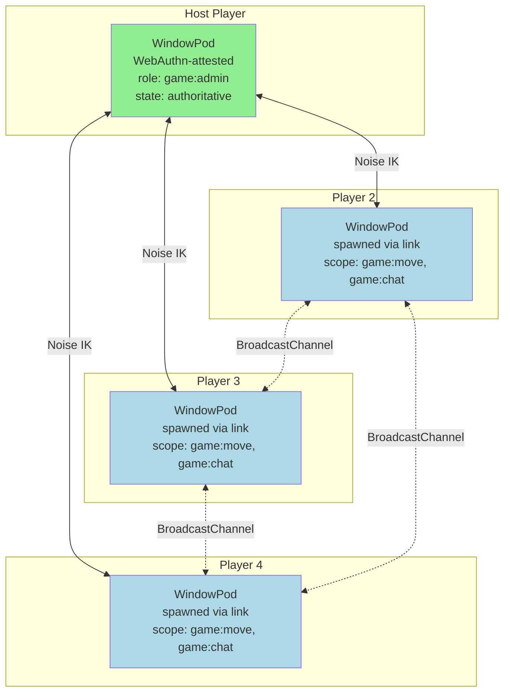
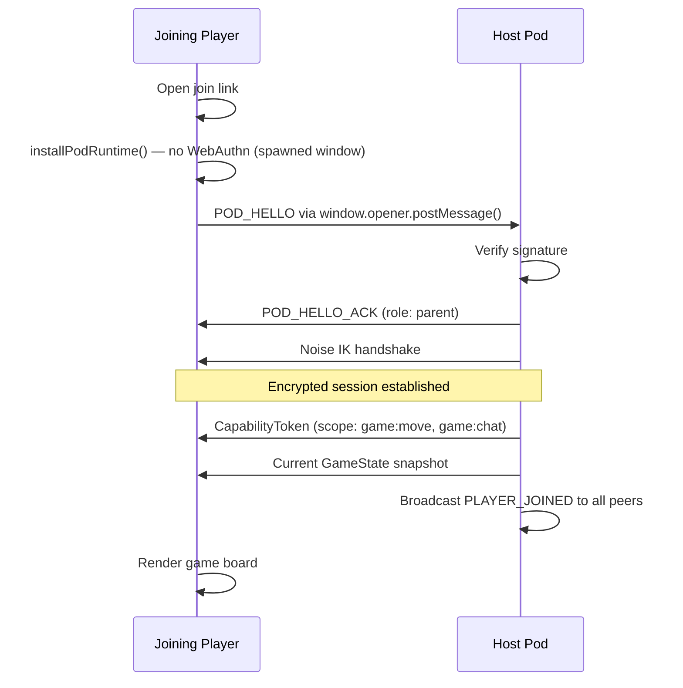
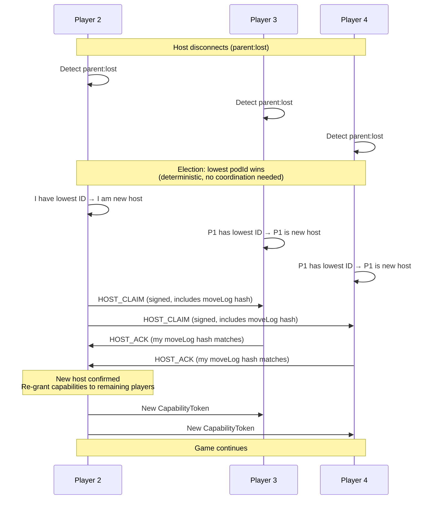

# Multiplayer Browser Game Lobby

A turn-based strategy game where the lobby, matchmaking, and gameplay all happen across browser tabs with no game server.

## Overview

One player creates a game room by opening a tab (becoming the host). Other players join by navigating to a shared link. Game state is replicated across all pods using signed, encrypted messages. Every move is cryptographically signed, creating a verifiable game log that resolves disputes. If the host disconnects, the remaining players elect a new host automatically.

## Architecture



## Game Room Creation

```typescript
// Host creates the game room
const pod = await installPodRuntime(globalThis, {
  webauthn: { required: false },
});

interface GameRoom {
  id: string;
  hostPodId: string;
  players: Map<string, PlayerInfo>;
  state: GameState;
  moveLog: SignedMove[];
  turn: number;
  settings: GameSettings;
}

pod.on('ready', () => {
  const room: GameRoom = {
    id: crypto.randomUUID(),
    hostPodId: pod.info.id,
    players: new Map(),
    state: initializeGameState(),
    moveLog: [],
    turn: 0,
    settings: { maxPlayers: 4, turnTimeout: 30_000 },
  };

  // Register host as first player
  room.players.set(pod.info.id, {
    podId: pod.info.id,
    name: 'Host',
    color: '#FF0000',
    joinedAt: Date.now(),
    isHost: true,
  });

  // Share join link
  const joinUrl = `${location.origin}/join?room=${room.id}&host=${pod.info.id}&key=${base64urlEncode(pod.identity.publicKeyRaw)}`;
  displayJoinLink(joinUrl);
});
```

## Player Join Flow



```typescript
// Joiner pod
const pod = await installPodRuntime(globalThis);

pod.on('parent:connected', async (parent) => {
  // We connected to the host via window.opener
  const session = await sessionManager.getOrCreateSession(
    parent.info.id,
    parent.publicKey,
    channel
  );

  // Request to join the game
  const joinRequest = await session.encrypt(cbor.encode({
    type: 'JOIN_REQUEST',
    name: playerName,
    timestamp: Date.now(),
  }));

  sendToHost(joinRequest);
});

// Host handles join
async function handleJoinRequest(playerId: string, request: JoinRequest) {
  if (room.players.size >= room.settings.maxPlayers) {
    sendReject(playerId, 'Room is full');
    return;
  }

  if (room.state.phase !== 'lobby') {
    sendReject(playerId, 'Game already in progress');
    return;
  }

  // Grant game capability
  const token = await capabilityManager.grant(
    `game/${room.id}`,
    getPeerPublicKey(playerId),
    { scope: ['game:move', 'game:chat'] }
  );

  room.players.set(playerId, {
    podId: playerId,
    name: request.name,
    color: assignColor(),
    joinedAt: Date.now(),
    isHost: false,
  });

  // Send state snapshot + token
  const session = sessionManager.getSession(playerId)!;
  await sendEncrypted(session, {
    type: 'JOIN_ACCEPTED',
    token,
    gameState: room.state,
    players: Array.from(room.players.values()),
    moveLog: room.moveLog,
  });

  // Notify all other players
  await broadcastToPlayers({
    type: 'PLAYER_JOINED',
    player: room.players.get(playerId),
  });
}
```

## Signed Move Log

Every move is signed by the player's identity key, creating an immutable, verifiable history:

```typescript
interface SignedMove {
  turn: number;
  playerId: string;
  action: GameAction;
  previousHash: Uint8Array;  // Hash of previous move (chain)
  timestamp: number;
  signature: Uint8Array;     // Ed25519 signature over all above fields
}

async function submitMove(action: GameAction): Promise<void> {
  const previousHash = room.moveLog.length > 0
    ? await sha256(cbor.encode(room.moveLog[room.moveLog.length - 1]))
    : new Uint8Array(32);

  const move: SignedMove = {
    turn: room.turn,
    playerId: pod.info.id,
    action,
    previousHash,
    timestamp: Date.now(),
    signature: new Uint8Array(0),  // Placeholder
  };

  // Sign the move (excluding signature field)
  const payload = cbor.encode({
    turn: move.turn,
    playerId: move.playerId,
    action: move.action,
    previousHash: move.previousHash,
    timestamp: move.timestamp,
  });
  move.signature = await pod.identity.sign(payload);

  // Send to host for validation and broadcast
  const session = sessionManager.getSession(room.hostPodId)!;
  await sendEncrypted(session, {
    type: 'MOVE_SUBMIT',
    move,
  });
}
```

### Move Validation (Host)

```typescript
async function validateAndApplyMove(playerId: string, move: SignedMove): Promise<boolean> {
  // 1. Verify it's this player's turn
  if (move.playerId !== getCurrentTurnPlayer()) {
    return false;
  }

  // 2. Verify signature
  const playerKey = room.players.get(playerId)?.publicKey;
  if (!playerKey) return false;

  const payload = cbor.encode({
    turn: move.turn,
    playerId: move.playerId,
    action: move.action,
    previousHash: move.previousHash,
    timestamp: move.timestamp,
  });
  if (!await PodSigner.verify(playerKey, payload, move.signature)) {
    return false;
  }

  // 3. Verify chain integrity
  const expectedHash = room.moveLog.length > 0
    ? await sha256(cbor.encode(room.moveLog[room.moveLog.length - 1]))
    : new Uint8Array(32);
  if (!timingSafeEqual(move.previousHash, expectedHash)) {
    return false;
  }

  // 4. Verify capability
  const token = playerCapabilities.get(playerId);
  if (!token || !(await capabilityManager.verifyWithRevocation(token))) {
    return false;
  }

  // 5. Validate game rules
  if (!isLegalMove(room.state, move.action)) {
    return false;
  }

  // Apply and broadcast
  room.state = applyMove(room.state, move.action);
  room.moveLog.push(move);
  room.turn++;

  await broadcastToPlayers({
    type: 'MOVE_APPLIED',
    move,
    newState: room.state,
  });

  return true;
}
```

## Host Migration

If the host disconnects, the remaining players elect a new host:



```typescript
pod.on('parent:lost', async () => {
  // Host disconnected — start election
  const remainingPlayers = Array.from(room.players.keys())
    .filter(id => id !== room.hostPodId)
    .sort(); // Lexicographic sort — deterministic

  const newHostId = remainingPlayers[0];

  if (newHostId === pod.info.id) {
    // I'm the new host
    await claimHost();
  } else {
    // Wait for host claim from the elected pod
    await waitForHostClaim(newHostId);
  }
});

async function claimHost() {
  const moveLogHash = await sha256(cbor.encode(room.moveLog));

  const claim = {
    type: 'HOST_CLAIM',
    newHostId: pod.info.id,
    moveLogHash,
    timestamp: Date.now(),
    signature: await pod.identity.sign(cbor.encode({ moveLogHash })),
  };

  // Broadcast to all remaining players
  room.hostPodId = pod.info.id;

  for (const [playerId] of room.players) {
    if (playerId === pod.info.id || playerId === previousHostId) continue;

    const session = sessionManager.getSession(playerId);
    if (session?.isOpen()) {
      await sendEncrypted(session, claim);
    }
  }

  // Re-grant capabilities (old host's grants are no longer valid)
  for (const [playerId] of room.players) {
    if (playerId === pod.info.id) continue;
    const token = await capabilityManager.grant(
      `game/${room.id}`,
      getPeerPublicKey(playerId),
      { scope: ['game:move', 'game:chat'] }
    );
    const session = sessionManager.getSession(playerId);
    if (session?.isOpen()) {
      await sendEncrypted(session, { type: 'NEW_TOKEN', token });
    }
  }
}
```

## Player Departure

```typescript
// Graceful leave
async function leaveGame() {
  await shutdownPodRuntime(pod, {
    reason: 'user',
    notifyPeers: true,  // Send POD_GOODBYE
  });
}

// Host handles player departure
pod.on('peer:lost', (peer) => {
  const player = room.players.get(peer.info.id);
  if (!player) return;

  room.players.delete(peer.info.id);
  sessionManager.closeSession(peer.info.id);

  // If it was their turn, skip to next player
  if (getCurrentTurnPlayer() === peer.info.id) {
    room.turn++;
    broadcastToPlayers({ type: 'TURN_SKIPPED', playerId: peer.info.id });
  }

  broadcastToPlayers({ type: 'PLAYER_LEFT', player });
});

// installUnloadHandler ensures POD_GOODBYE on accidental tab close
installUnloadHandler(pod);
```

## Why BrowserMesh

- **Cryptographic fairness**: Signed move chains prevent move tampering and enable dispute resolution
- **No game server**: Host migration means the game survives any single player disconnecting
- **Instant lobbies**: No accounts, no matchmaking server — share a link and play
- **Cheat resistance**: All moves validated by host against game rules + capability tokens
- **Verifiable history**: The signed move log can be exported and independently verified by any party
