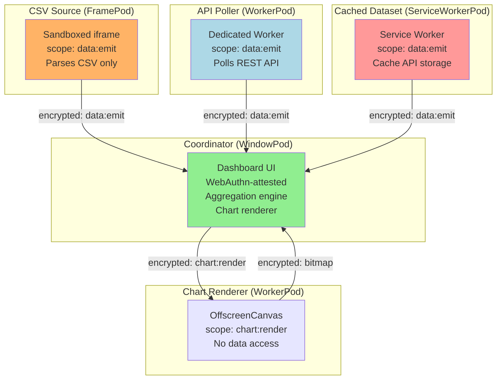
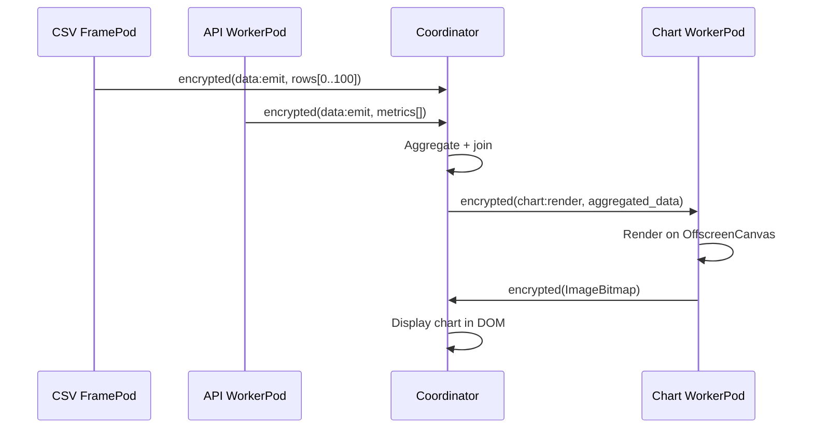

# Privacy-First Analytics Dashboard

An analytics tool where data never leaves the user's browser. Each data source runs as an isolated pod. A coordinator aggregates and visualizes — all without any data touching a server.

## Overview

A user opens the dashboard (a WebAuthn-attested WindowPod). They connect data sources: a CSV file loads in a sandboxed FramePod, an API poller runs in a WorkerPod, a cached dataset lives in a ServiceWorkerPod. Each source pod gets a narrow capability — it can push data to the coordinator but can't read other sources. The coordinator combines streams and renders charts. A compromised source cannot access data from any other source.

## Architecture



## Data Source Isolation

Each source runs in a separate pod with minimal capabilities:

```typescript
// Coordinator creates source pods with scoped capabilities
async function addDataSource(source: DataSourceConfig): Promise<string> {
  let podId: string;

  switch (source.type) {
    case 'csv': {
      // CSV files run in sandboxed iframes (FramePod)
      const iframe = createSandboxedIframe({
        sandbox: 'allow-scripts',  // No allow-same-origin
        src: '/source-runners/csv.html',
      });
      document.body.appendChild(iframe);
      podId = await waitForPodHello(iframe.contentWindow);
      break;
    }

    case 'api': {
      // API pollers run in dedicated workers (WorkerPod)
      const worker = new Worker('/source-runners/api-poller.js');
      podId = await waitForPodHello(worker);
      break;
    }

    case 'cached': {
      // Cached datasets use ServiceWorker (ServiceWorkerPod)
      await navigator.serviceWorker.register('/source-runners/cache-sw.js');
      podId = await waitForPodHello(navigator.serviceWorker.controller);
      break;
    }
  }

  // Grant narrow capability
  const token = await capabilityManager.grant(
    `data/${source.id}`,
    getPeerPublicKey(podId),
    {
      scope: ['data:emit'],  // Can push data — cannot read other sources
      expires: Date.now() + 24 * 60 * 60 * 1000,
    }
  );

  const session = await sessionManager.getOrCreateSession(podId, getPeerPublicKey(podId), channel);
  await sendEncrypted(session, { type: 'SOURCE_CONFIG', config: source, token });

  return podId;
}
```

### Capability Scope Matrix

| Pod | data:emit | data:read | chart:render | dashboard:admin |
|-----|-----------|-----------|--------------|-----------------|
| CSV FramePod | yes | no | no | no |
| API WorkerPod | yes | no | no | no |
| Cache ServiceWorkerPod | yes | no | no | no |
| Chart WorkerPod | no | no | yes | no |
| Coordinator WindowPod | no | yes (all) | no | yes |

A compromised CSV iframe cannot read API data or cached datasets. It has no session keys for those pods, no capability tokens, and no communication channel.

## Data Flow



### Source Pod: CSV Parser

```typescript
// csv-source.html runs in sandboxed iframe
const pod = await installPodRuntime(globalThis);

pod.on('parent:connected', async (parent) => {
  const session = await sessionManager.getOrCreateSession(
    parent.info.id, parent.publicKey, channel
  );

  // Wait for configuration
  session.onMessage(async (encrypted) => {
    const msg = cbor.decode(await session.decrypt(encrypted));

    if (msg.type === 'SOURCE_CONFIG') {
      const { config, token } = msg;
      capabilityToken = token;

      // Parse CSV and emit rows
      const rows = parseCSV(config.data);

      // Emit in batches
      for (let i = 0; i < rows.length; i += 100) {
        const batch = rows.slice(i, i + 100);
        const payload = cbor.encode({
          type: 'DATA_EMIT',
          sourceId: config.id,
          batch,
          batchIndex: i / 100,
          total: Math.ceil(rows.length / 100),
        });

        // Sign the data for provenance
        const signed = {
          data: payload,
          signature: await pod.identity.sign(payload),
          capabilityToken: token,
        };

        await sendEncrypted(session, signed);
      }
    }
  });
});
```

### Source Pod: API Poller

```typescript
// api-poller.js runs as DedicatedWorker
const pod = await installPodRuntime(self);

let polling = false;

async function startPolling(config: APISourceConfig, session: SessionCrypto) {
  polling = true;

  while (polling) {
    try {
      const response = await fetch(config.endpoint, {
        headers: config.headers,
      });
      const data = await response.json();

      const payload = cbor.encode({
        type: 'DATA_EMIT',
        sourceId: config.id,
        data,
        fetchedAt: Date.now(),
      });

      const signed = {
        data: payload,
        signature: await pod.identity.sign(payload),
      };

      await sendEncrypted(session, signed);
    } catch (err) {
      await sendEncrypted(session, {
        type: 'SOURCE_ERROR',
        sourceId: config.id,
        error: err.message,
      });
    }

    await sleep(config.pollInterval ?? 30_000);
  }
}

// Clean shutdown stops polling
pod.on('shutdown', () => { polling = false; });
```

## Chart Rendering (Isolated)

The chart renderer runs in a separate WorkerPod with OffscreenCanvas — it receives aggregated data but never has access to raw source data:

```typescript
// chart-worker.js
const pod = await installPodRuntime(self);

// This pod has offscreenCanvas but no DOM, no fetch, no source data access
const caps = detectCapabilities();
assert(caps.offscreenCanvas === true);
assert(caps.dom === false);

pod.on('parent:connected', async (parent) => {
  const session = await sessionManager.getOrCreateSession(
    parent.info.id, parent.publicKey, channel
  );

  session.onMessage(async (encrypted) => {
    const msg = cbor.decode(await session.decrypt(encrypted));

    if (msg.type === 'RENDER_CHART') {
      const canvas = new OffscreenCanvas(msg.width, msg.height);
      const ctx = canvas.getContext('2d');

      renderChart(ctx, msg.chartType, msg.data, msg.options);

      const bitmap = canvas.transferToImageBitmap();

      // Send bitmap back (transferred, not copied)
      await sendEncrypted(session, {
        type: 'CHART_RENDERED',
        chartId: msg.chartId,
        bitmap,
      });
    }
  });
});
```

## Provenance Verification

Every data point carries a signature chain from its source pod:

```typescript
// Coordinator verifies every incoming data batch
async function verifyDataProvenance(
  sourcePodId: string,
  signed: { data: Uint8Array; signature: Uint8Array; capabilityToken: CapabilityToken }
): Promise<boolean> {
  // 1. Verify the signature matches the source pod's identity
  const sourceKey = peers.get(sourcePodId)?.publicKey;
  if (!sourceKey) return false;
  if (!await PodSigner.verify(sourceKey, signed.data, signed.signature)) return false;

  // 2. Verify the capability token is valid and not revoked
  if (!await capabilityManager.verifyWithRevocation(signed.capabilityToken)) return false;

  // 3. Verify the scope allows data:emit
  if (!signed.capabilityToken.scope.includes('data:emit')) return false;

  return true;
}
```

## Source Removal

```typescript
async function removeDataSource(sourceId: string) {
  const sourcePodId = sourcePods.get(sourceId);
  if (!sourcePodId) return;

  // Revoke capability
  const token = sourceCapabilities.get(sourceId);
  if (token) {
    await capabilityManager.revoke(token);
  }

  // Close session
  sessionManager.closeSession(sourcePodId);

  // Delete credential
  await pod.credentials.delete({ id: sourcePodId });

  // Remove DOM element (iframe) or terminate worker
  const element = sourceElements.get(sourceId);
  if (element instanceof HTMLIFrameElement) {
    element.remove();
  } else if (element instanceof Worker) {
    element.terminate();
  }

  sourcePods.delete(sourceId);
  sourceCapabilities.delete(sourceId);
  sourceElements.delete(sourceId);
}
```

## Degradation

```typescript
// When a source pod dies, the dashboard degrades gracefully
pod.on('peer:lost', (peer) => {
  const sourceId = findSourceByPodId(peer.info.id);
  if (!sourceId) return;

  // Gray out this source's charts
  markSourceUnavailable(sourceId);

  // Other sources continue rendering normally
  console.log(`Source ${sourceId} lost — dashboard degraded`);
});
```

## Why BrowserMesh

| Concern | How It's Addressed |
|---------|-------------------|
| Data never leaves browser | All processing in local pods — no server calls for analytics |
| Malicious CSV | Sandboxed FramePod with no access to other sources or the network |
| API credentials | Isolated in WorkerPod — CSV source can't sniff API headers |
| Data provenance | Every data point is signed by its source pod's identity key |
| Source removal | Capability revocation + session close + credential delete |
| Rendering performance | OffscreenCanvas in WorkerPod — doesn't block the UI thread |
