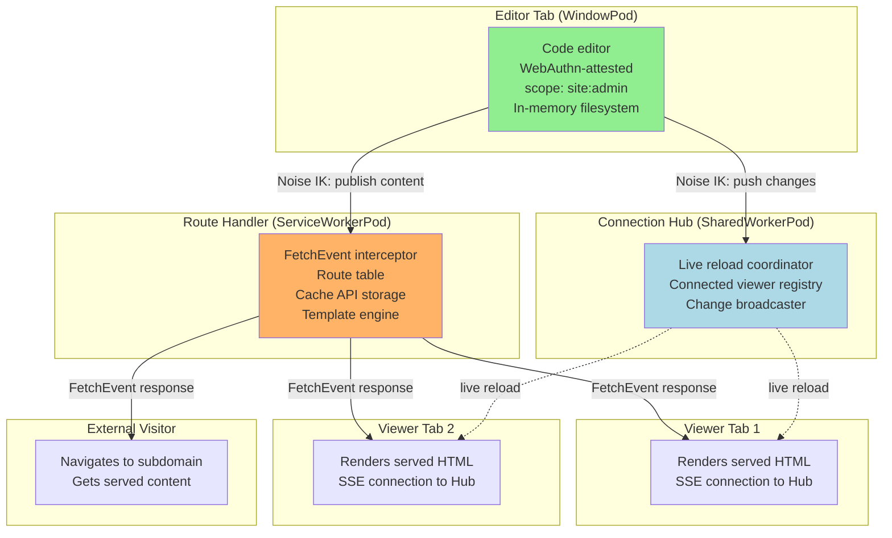
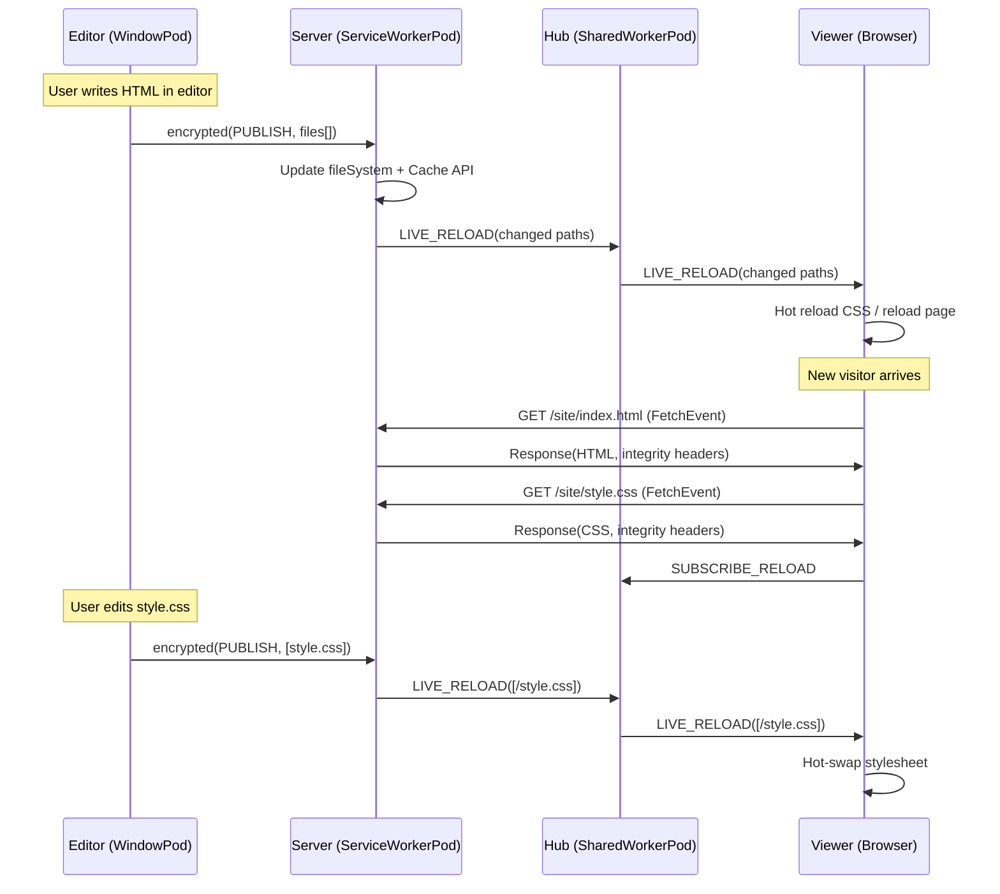

# Pod-Hosted Web Server

Serve web pages directly from a browser tab. A ServiceWorkerPod intercepts fetch requests and routes them to content pods — turning any browser into a web host.

## Overview

A user opens an "editor" tab (WindowPod) where they write HTML, CSS, and JavaScript. A ServiceWorkerPod registers on a subdomain and intercepts all fetch requests to it. When another browser (or tab) navigates to that subdomain, the ServiceWorker serves the content from the editor pod's in-memory file system. Live edits in the editor tab are pushed to the ServiceWorker, which in turn pushes updates to all connected viewer tabs via a SharedWorkerPod that manages SSE-like push.

The result: a complete web development environment where the "server" is a Service Worker, the "CMS" is a browser tab, and the "CDN" is the Cache API.

## Architecture



## How It Works

### 1. Register the Serving ServiceWorker

```typescript
// Editor pod registers the ServiceWorker that will serve content
async function setupServer(pod: PodRuntime): Promise<ServiceWorkerRegistration> {
  const reg = await navigator.serviceWorker.register('/pod-server-sw.js', {
    scope: '/site/',  // All requests under /site/ go through this SW
  });

  // Wait for the SW pod to boot and establish session
  const swPodId = await waitForPodHello(reg.active ?? reg.installing);

  // Grant it site:serve capability
  const token = await capabilityManager.grant(
    'site/*',
    getPeerPublicKey(swPodId),
    { scope: ['site:serve', 'site:cache'] }
  );

  // Establish encrypted session
  const session = await sessionManager.getOrCreateSession(
    swPodId,
    getPeerPublicKey(swPodId),
    new MessageChannel().port1
  );

  // Push initial site content
  await publishContent(session, initialFiles);

  return reg;
}
```

### 2. ServiceWorker Intercepts Requests

```typescript
// pod-server-sw.js — the actual "web server"
const pod = await installPodRuntime(self);

// In-memory file system (populated by editor pod)
const fileSystem: Map<string, SiteFile> = new Map();

// Route table
interface SiteFile {
  path: string;
  content: Uint8Array;
  contentType: string;
  headers: Record<string, string>;
  etag: string;
  lastModified: number;
}

// Intercept all fetch requests under /site/
self.addEventListener('fetch', (event: FetchEvent) => {
  const url = new URL(event.request.url);

  // Only handle requests in our scope
  if (!url.pathname.startsWith('/site/')) return;

  event.respondWith(handleRequest(event.request));
});

async function handleRequest(request: Request): Promise<Response> {
  const url = new URL(request.url);
  let path = url.pathname.replace('/site/', '/');

  // Default to index.html
  if (path === '/' || path === '') {
    path = '/index.html';
  }

  // Check in-memory filesystem first
  const file = fileSystem.get(path);
  if (file) {
    // ETag support
    const ifNoneMatch = request.headers.get('If-None-Match');
    if (ifNoneMatch === file.etag) {
      return new Response(null, { status: 304 });
    }

    return new Response(file.content, {
      status: 200,
      headers: {
        'Content-Type': file.contentType,
        'ETag': file.etag,
        'Last-Modified': new Date(file.lastModified).toUTCString(),
        'X-Served-By': 'BrowserMesh-Pod',
        'X-Pod-Id': pod.info.id,
        ...file.headers,
      },
    });
  }

  // Check Cache API as fallback
  const cached = await caches.match(request);
  if (cached) return cached;

  // 404
  return new Response(render404(path), {
    status: 404,
    headers: { 'Content-Type': 'text/html' },
  });
}

function render404(path: string): string {
  return `<!DOCTYPE html>
<html><body>
  <h1>404 — Not Found</h1>
  <p><code>${escapeHtml(path)}</code> does not exist on this pod.</p>
  <p><small>Served by BrowserMesh Pod ${pod.info.id.slice(0, 8)}</small></p>
</body></html>`;
}
```

### 3. Editor Publishes Content

```typescript
// Editor pod: publish files to the ServiceWorker
interface PublishMessage {
  type: 'PUBLISH';
  files: Array<{
    path: string;
    content: Uint8Array;
    contentType: string;
  }>;
  timestamp: number;
  signature: Uint8Array;
}

async function publishContent(session: SessionCrypto, files: FileEntry[]) {
  const payload: PublishMessage = {
    type: 'PUBLISH',
    files: files.map(f => ({
      path: f.path,
      content: new TextEncoder().encode(f.content),
      contentType: inferContentType(f.path),
    })),
    timestamp: Date.now(),
    signature: new Uint8Array(0),  // Will be filled
  };

  payload.signature = await pod.identity.sign(cbor.encode({
    files: payload.files.map(f => ({ path: f.path, hash: sha256(f.content) })),
    timestamp: payload.timestamp,
  }));

  const encrypted = await session.encrypt(cbor.encode(payload));
  sendToServiceWorker(encrypted);
}

function inferContentType(path: string): string {
  const ext = path.split('.').pop()?.toLowerCase();
  const types: Record<string, string> = {
    'html': 'text/html; charset=utf-8',
    'css': 'text/css; charset=utf-8',
    'js': 'application/javascript; charset=utf-8',
    'json': 'application/json',
    'png': 'image/png',
    'jpg': 'image/jpeg',
    'svg': 'image/svg+xml',
    'woff2': 'font/woff2',
    'ico': 'image/x-icon',
  };
  return types[ext ?? ''] ?? 'application/octet-stream';
}
```

### 4. ServiceWorker Receives Content Updates

```typescript
// In the ServiceWorker pod
pod.on('parent:connected', async (parent) => {
  const session = await sessionManager.getOrCreateSession(
    parent.info.id, parent.publicKey, channel
  );

  session.onMessage(async (encrypted) => {
    const msg: PublishMessage = cbor.decode(await session.decrypt(encrypted));

    if (msg.type === 'PUBLISH') {
      // Verify signature from editor pod
      const editorKey = peers.get(parent.info.id)?.publicKey;
      if (!editorKey) return;
      // ... verify signature ...

      // Update in-memory filesystem
      for (const file of msg.files) {
        fileSystem.set(file.path, {
          path: file.path,
          content: file.content,
          contentType: file.contentType,
          headers: {},
          etag: `"${base64urlEncode(await sha256(file.content))}"`,
          lastModified: msg.timestamp,
        });
      }

      // Also store in Cache API for persistence across SW restarts
      const cache = await caches.open('pod-site-v1');
      for (const file of msg.files) {
        await cache.put(
          new Request(`/site${file.path}`),
          new Response(file.content, {
            headers: { 'Content-Type': file.contentType },
          })
        );
      }

      // Notify SharedWorker hub for live reload
      notifyLiveReload(msg.files.map(f => f.path));
    }
  });
});
```

### 5. Live Reload via SharedWorkerPod

```typescript
// shared-worker-hub.js — coordinates live reload across viewer tabs
const pod = await installPodRuntime(self);

const connectedViewers: Map<string, MessagePort> = new Map();

self.onconnect = (e) => {
  const port = e.ports[0];
  const viewerId = crypto.randomUUID();

  connectedViewers.set(viewerId, port);

  port.onmessage = async (msg) => {
    if (msg.data.type === 'SUBSCRIBE_RELOAD') {
      // Viewer is listening for changes
      connectedViewers.set(viewerId, port);
    }
  };

  // Cleanup on disconnect
  port.onclose = () => {
    connectedViewers.delete(viewerId);
  };
};

// Editor pod pushes changes → we broadcast to viewers
function handleLiveReloadNotification(changedPaths: string[]) {
  const notification = {
    type: 'LIVE_RELOAD',
    paths: changedPaths,
    timestamp: Date.now(),
  };

  for (const [id, port] of connectedViewers) {
    try {
      port.postMessage(notification);
    } catch {
      connectedViewers.delete(id);
    }
  }
}
```

### 6. Viewer Receives Live Reload

```html
<!-- Injected into every served page by the ServiceWorker -->
<script>
  // Connect to SharedWorker hub for live reload
  const hub = new SharedWorker('/pod-hub-sw.js');
  hub.port.postMessage({ type: 'SUBSCRIBE_RELOAD' });

  hub.port.onmessage = (e) => {
    if (e.data.type === 'LIVE_RELOAD') {
      const changedPaths = e.data.paths;

      // Smart reload: only refresh changed resources
      for (const path of changedPaths) {
        if (path.endsWith('.css')) {
          // Hot-swap CSS without full page reload
          reloadStylesheet(path);
        } else if (path.endsWith('.js')) {
          // Reload scripts
          location.reload();
        } else if (path.endsWith('.html')) {
          // Full page reload for HTML changes
          location.reload();
        }
      }
    }
  };

  function reloadStylesheet(path) {
    const links = document.querySelectorAll(`link[href*="${path}"]`);
    links.forEach(link => {
      const newHref = link.href.split('?')[0] + '?v=' + Date.now();
      link.href = newHref;
    });
  }
</script>
```

## Advanced: Dynamic Routes

The ServiceWorker can handle dynamic routes, not just static files:

```typescript
// Route table with pattern matching
interface Route {
  pattern: URLPattern;
  handler: (request: Request, params: Record<string, string>) => Promise<Response>;
}

const routes: Route[] = [
  {
    pattern: new URLPattern({ pathname: '/site/api/pages/:slug' }),
    handler: async (req, params) => {
      const page = fileSystem.get(`/pages/${params.slug}.md`);
      if (!page) return new Response('Not found', { status: 404 });

      // Render markdown to HTML
      const html = renderMarkdown(new TextDecoder().decode(page.content));
      return new Response(wrapInLayout(html), {
        headers: { 'Content-Type': 'text/html; charset=utf-8' },
      });
    },
  },
  {
    pattern: new URLPattern({ pathname: '/site/api/search' }),
    handler: async (req) => {
      const url = new URL(req.url);
      const query = url.searchParams.get('q') ?? '';

      // Search across all files in memory
      const results = Array.from(fileSystem.values())
        .filter(f => f.contentType.startsWith('text/'))
        .filter(f => {
          const text = new TextDecoder().decode(f.content);
          return text.toLowerCase().includes(query.toLowerCase());
        })
        .map(f => ({ path: f.path, snippet: extractSnippet(f, query) }));

      return new Response(JSON.stringify(results), {
        headers: { 'Content-Type': 'application/json' },
      });
    },
  },
];

async function handleRequest(request: Request): Promise<Response> {
  // Check dynamic routes first
  for (const route of routes) {
    const match = route.pattern.exec(request.url);
    if (match) {
      return route.handler(request, match.pathname.groups);
    }
  }

  // Fall back to static file serving
  return serveStatic(request);
}
```

## Security: Content Signing

Every file served includes a signature header so viewers can verify content integrity:

```typescript
// ServiceWorker adds integrity headers
async function addIntegrityHeaders(response: Response, file: SiteFile): Response {
  const headers = new Headers(response.headers);

  // Content hash
  const hash = await sha256(file.content);
  headers.set('X-Content-Hash', base64urlEncode(hash));

  // Editor pod's signature over the content
  // (stored when the editor published this file)
  if (file.editorSignature) {
    headers.set('X-Editor-Signature', base64urlEncode(file.editorSignature));
    headers.set('X-Editor-Pod-Id', file.editorPodId);
  }

  // ServiceWorker pod's signature (chain of custody)
  const swSignature = await pod.identity.sign(hash);
  headers.set('X-Server-Signature', base64urlEncode(swSignature));
  headers.set('X-Server-Pod-Id', pod.info.id);

  return new Response(response.body, {
    status: response.status,
    headers,
  });
}
```

## Complete Flow



## Why BrowserMesh

| Traditional Dev Server | Pod-Hosted Server |
|----------------------|-------------------|
| `node server.js` on localhost | ServiceWorkerPod serves from browser |
| File watcher (chokidar, nodemon) | Editor pod pushes changes directly |
| WebSocket-based hot reload | SharedWorkerPod broadcasts to viewers |
| Server process can access all files | Each pod has isolated, capability-scoped access |
| Server dies when terminal closes | ServiceWorker persists across tab closes |
| No content signing | Every response carries editor + server signatures |
| Requires Node.js installed | Requires only a browser |
