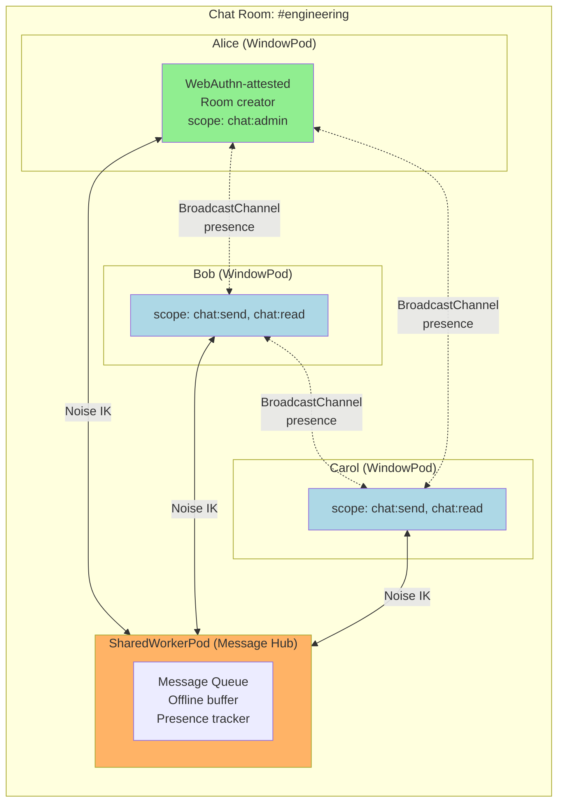
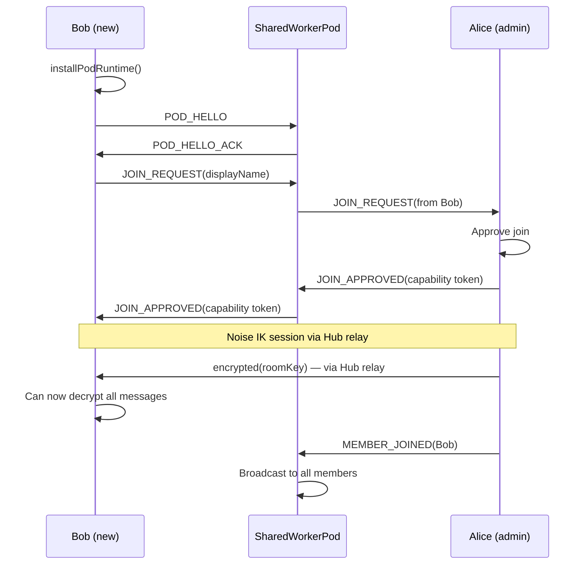

# Decentralized Chat

End-to-end encrypted group chat that runs entirely in the browser. No chat server, no message database, no accounts. Open a tab and talk.

## Overview

Each participant runs a WindowPod. One user creates a room and shares a link. Joining users connect via BroadcastChannel (same-origin) or WebRTC (cross-origin). Messages are encrypted with per-room session keys. A SharedWorkerPod provides offline message queuing — if a participant's tab is closed when a message arrives, they receive it when they reopen. Presence (online/typing/idle) is tracked via visibility events.

## Architecture



## Room Creation

```typescript
const pod = await installPodRuntime(globalThis, {
  webauthn: { required: false },
});

interface ChatRoom {
  id: string;
  name: string;
  createdBy: string;
  members: Map<string, MemberInfo>;
  // Symmetric group key for message encryption
  roomKey: CryptoKey;
  // Message log (in memory, not persisted to any server)
  messages: ChatMessage[];
}

async function createRoom(name: string): Promise<ChatRoom> {
  // Generate a symmetric key for the room
  const roomKey = await crypto.subtle.generateKey(
    { name: 'AES-GCM', length: 256 },
    true,
    ['encrypt', 'decrypt']
  );

  const room: ChatRoom = {
    id: crypto.randomUUID(),
    name,
    createdBy: pod.info.id,
    members: new Map(),
    roomKey,
    messages: [],
  };

  // Register self as admin
  room.members.set(pod.info.id, {
    podId: pod.info.id,
    displayName: 'Alice',
    role: 'admin',
    joinedAt: Date.now(),
    status: 'online',
  });

  // Start SharedWorker hub for offline queuing
  await startMessageHub(room);

  // Generate join link
  const joinLink = generateJoinLink(room);
  return room;
}

function generateJoinLink(room: ChatRoom): string {
  // The link contains the room ID and the creator's public key
  // The room key is NOT in the link — it's shared via encrypted session after joining
  return `${location.origin}/chat/join?room=${room.id}&host=${pod.info.id}&key=${base64urlEncode(pod.identity.publicKeyRaw)}`;
}
```

## Joining a Room



```typescript
// Bob joins
const pod = await installPodRuntime(globalThis);

pod.on('ready', async () => {
  const params = new URLSearchParams(location.search);
  const roomId = params.get('room');
  const hostPodId = params.get('host');
  const hostKey = base64urlDecode(params.get('key'));

  // Connect to hub SharedWorker
  const hub = new SharedWorker('/chat-hub.js');

  const session = await sessionManager.getOrCreateSession(
    hostPodId,
    hostKey,
    hub.port
  );

  // Request to join
  await sendEncrypted(session, {
    type: 'JOIN_REQUEST',
    roomId,
    displayName: promptForName(),
  });
});

// Alice approves (admin side)
async function approveJoin(request: JoinRequest, requesterPodId: string) {
  // Grant capability
  const token = await capabilityManager.grant(
    `chat/${room.id}`,
    getPeerPublicKey(requesterPodId),
    { scope: ['chat:send', 'chat:read'] }
  );

  // Share the room symmetric key over encrypted session
  const session = sessionManager.getSession(requesterPodId)!;
  const exportedRoomKey = await crypto.subtle.exportKey('raw', room.roomKey);

  await sendEncrypted(session, {
    type: 'JOIN_APPROVED',
    token,
    roomKey: new Uint8Array(exportedRoomKey),
    recentMessages: room.messages.slice(-50),  // Last 50 messages
  });
}
```

## Message Flow

```typescript
interface ChatMessage {
  id: string;
  roomId: string;
  senderId: string;
  senderName: string;
  // Content encrypted with room key (not session key)
  // This allows offline delivery — hub can store it without decrypting
  encryptedContent: Uint8Array;
  nonce: Uint8Array;
  timestamp: number;
  // Sender's signature over plaintext content
  signature: Uint8Array;
}

async function sendMessage(room: ChatRoom, text: string) {
  const nonce = crypto.getRandomValues(new Uint8Array(12));

  // Encrypt content with room key
  const plaintext = new TextEncoder().encode(text);
  const encrypted = new Uint8Array(await crypto.subtle.encrypt(
    { name: 'AES-GCM', iv: nonce },
    room.roomKey,
    plaintext
  ));

  // Sign the plaintext (so recipients can verify authorship)
  const signature = await pod.identity.sign(plaintext);

  const message: ChatMessage = {
    id: crypto.randomUUID(),
    roomId: room.id,
    senderId: pod.info.id,
    senderName: myDisplayName,
    encryptedContent: encrypted,
    nonce,
    timestamp: Date.now(),
    signature,
  };

  // Send to hub for distribution
  // Note: hub sees the encrypted blob but cannot decrypt it (no room key)
  const session = sessionManager.getSession(hubPodId)!;
  await sendEncrypted(session, {
    type: 'CHAT_MESSAGE',
    message,
  });
}

// Receiving a message
async function handleIncomingMessage(msg: ChatMessage) {
  // Decrypt with room key
  const plaintext = new Uint8Array(await crypto.subtle.decrypt(
    { name: 'AES-GCM', iv: msg.nonce },
    room.roomKey,
    msg.encryptedContent
  ));

  // Verify sender signature
  const senderKey = room.members.get(msg.senderId)?.publicKey;
  if (!senderKey) return;
  if (!await PodSigner.verify(senderKey, plaintext, msg.signature)) {
    console.warn(`Message ${msg.id} failed signature verification`);
    return;
  }

  const text = new TextDecoder().decode(plaintext);
  displayMessage(msg.senderName, text, msg.timestamp);
}
```

## Offline Message Queue (SharedWorkerPod)

The hub stores messages for offline members:

```typescript
// chat-hub.js (SharedWorkerPod)
const pod = await installPodRuntime(self);

interface MemberConnection {
  port: MessagePort;
  online: boolean;
  lastSeen: number;
}

const members: Map<string, MemberConnection> = new Map();
const offlineQueue: Map<string, ChatMessage[]> = new Map();  // podId → queued messages

// Distribute messages
async function distributeMessage(message: ChatMessage, senderPodId: string) {
  for (const [memberId, conn] of members) {
    if (memberId === senderPodId) continue;  // Don't echo back

    if (conn.online) {
      // Deliver immediately
      try {
        conn.port.postMessage({ type: 'CHAT_MESSAGE', message });
      } catch {
        // Port closed — member went offline
        conn.online = false;
        queueForOffline(memberId, message);
      }
    } else {
      // Queue for later delivery
      queueForOffline(memberId, message);
    }
  }
}

function queueForOffline(memberId: string, message: ChatMessage) {
  const queue = offlineQueue.get(memberId) ?? [];
  queue.push(message);
  // Cap queue at 500 messages per member
  if (queue.length > 500) queue.shift();
  offlineQueue.set(memberId, queue);
}

// Member comes back online
function handleMemberReconnect(memberId: string, port: MessagePort) {
  const queued = offlineQueue.get(memberId) ?? [];

  if (queued.length > 0) {
    port.postMessage({
      type: 'OFFLINE_MESSAGES',
      messages: queued,
      count: queued.length,
    });
    offlineQueue.delete(memberId);
  }

  members.set(memberId, { port, online: true, lastSeen: Date.now() });
}
```

## Presence

```typescript
// Each member broadcasts presence via BroadcastChannel
const presenceChannel = new BroadcastChannel(`chat:presence:${room.id}`);

type PresenceStatus = 'online' | 'typing' | 'idle' | 'offline';

// Visibility change → presence update
document.addEventListener('visibilitychange', () => {
  if (document.visibilityState === 'hidden') {
    broadcastPresence('idle');
  } else {
    broadcastPresence('online');
    // Also flush offline queue
  }
});

// Typing indicator
let typingTimeout: number;
editor.addEventListener('input', () => {
  broadcastPresence('typing');
  clearTimeout(typingTimeout);
  typingTimeout = setTimeout(() => broadcastPresence('online'), 2000);
});

function broadcastPresence(status: PresenceStatus) {
  presenceChannel.postMessage({
    type: 'PRESENCE',
    podId: pod.info.id,
    status,
    timestamp: Date.now(),
  });
}

presenceChannel.onmessage = (e) => {
  if (e.data.type === 'PRESENCE') {
    updatePresenceUI(e.data.podId, e.data.status);
  }
};
```

## Member Removal / Ban

```typescript
// Admin can remove a member
async function removeMember(targetPodId: string) {
  // Revoke capability
  const token = memberCapabilities.get(targetPodId);
  if (token) await capabilityManager.revoke(token);

  // Close session
  sessionManager.closeSession(targetPodId);

  // Remove from room
  room.members.delete(targetPodId);

  // Notify hub to disconnect them
  await sendEncrypted(hubSession, {
    type: 'MEMBER_REMOVED',
    targetPodId,
    reason: 'Removed by admin',
  });

  // Rotate room key (removed member had the old one)
  await rotateRoomKey();
}

async function rotateRoomKey() {
  // Generate new room key
  const newKey = await crypto.subtle.generateKey(
    { name: 'AES-GCM', length: 256 },
    true,
    ['encrypt', 'decrypt']
  );

  const exportedKey = new Uint8Array(
    await crypto.subtle.exportKey('raw', newKey)
  );

  // Distribute to remaining members via their individual sessions
  for (const [memberId] of room.members) {
    if (memberId === pod.info.id) continue;
    const session = sessionManager.getSession(memberId);
    if (session?.isOpen()) {
      await sendEncrypted(session, {
        type: 'ROOM_KEY_ROTATED',
        newRoomKey: exportedKey,
      });
    }
  }

  room.roomKey = newKey;
}
```

## Why BrowserMesh

| Concern | Solution |
|---------|----------|
| No chat server needed | SharedWorkerPod relays messages between tabs |
| End-to-end encryption | Room symmetric key — hub can't read messages |
| Message authenticity | Each message signed by sender's Ed25519 identity |
| Offline delivery | Hub queues encrypted messages for disconnected members |
| Typing indicators | BroadcastChannel presence — low latency, no encryption overhead |
| Member removal | Capability revocation + room key rotation |
| Persistence | Messages exist in memory only — close all tabs and they're gone (by design) |
| Admin verification | WebAuthn attestation proves admin identity is hardware-backed |
