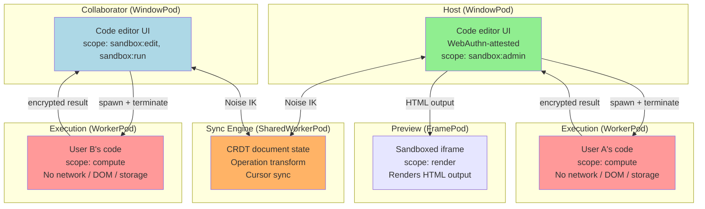

# Collaborative Code Sandbox

A multi-user code editor with sandboxed execution. Users write code together in real time; each user's code runs in an isolated WorkerPod with strict capability limits. A malicious snippet cannot access other users' data, the DOM, or the network.

## Overview

A host opens the sandbox (WebAuthn-attested WindowPod). Collaborators join via link. A SharedWorkerPod synchronizes the shared document state using CRDTs. When a user runs their code, it executes inside a dedicated WorkerPod with only the capabilities they've been granted — compute, but no network, no storage, no DOM. Results flow back to the coordinator for display. Users can grant each other elevated capabilities (e.g., `fetch` access) through the host.

## Architecture



## Sandboxed Execution

Each code run spawns a fresh WorkerPod with minimal capabilities:

```typescript
interface ExecutionRequest {
  id: string;
  code: string;
  language: 'javascript' | 'typescript';
  timeout: number;       // Max execution time (ms)
  memoryLimit: number;   // Approximate memory limit
  capabilities: ExecutionCapabilities;
}

interface ExecutionCapabilities {
  compute: true;          // Always allowed — it's the point
  console: true;          // Capture console output
  fetch: boolean;         // Network access (default: false)
  storage: boolean;       // IndexedDB access (default: false)
  wasm: boolean;          // WebAssembly (default: true)
  sharedArrayBuffer: boolean;  // Shared memory (default: false)
}

interface ExecutionResult {
  id: string;
  status: 'success' | 'error' | 'timeout' | 'killed';
  output: string[];       // Console output lines
  returnValue?: unknown;  // Last expression value
  error?: { name: string; message: string; stack: string };
  duration: number;
  memoryUsed: number;
}
```

### Spawning an Execution Pod

```typescript
async function executeCode(request: ExecutionRequest): Promise<ExecutionResult> {
  // Create a new Worker for each execution (isolation)
  const workerCode = buildWorkerCode(request);
  const blob = new Blob([workerCode], { type: 'application/javascript' });
  const worker = new Worker(URL.createObjectURL(blob));

  // The Worker boots as a pod
  const execPodId = await waitForPodHello(worker);

  // Grant execution capability
  const token = await capabilityManager.grant(
    `exec/${request.id}`,
    getPeerPublicKey(execPodId),
    {
      scope: buildScopeList(request.capabilities),
      expires: Date.now() + request.timeout + 5000,  // Auto-expire
    }
  );

  // Establish session
  const session = await sessionManager.getOrCreateSession(
    execPodId, getPeerPublicKey(execPodId), worker
  );

  // Send code to execute
  await sendEncrypted(session, {
    type: 'EXECUTE',
    code: request.code,
    token,
  });

  // Wait for result with timeout
  return new Promise((resolve) => {
    const timer = setTimeout(() => {
      worker.terminate();
      resolve({
        id: request.id,
        status: 'timeout',
        output: [`Execution timed out after ${request.timeout}ms`],
        duration: request.timeout,
        memoryUsed: 0,
      });
    }, request.timeout);

    session.onMessage(async (encrypted) => {
      clearTimeout(timer);
      const result: ExecutionResult = cbor.decode(await session.decrypt(encrypted));
      worker.terminate();
      sessionManager.closeSession(execPodId);
      resolve(result);
    });
  });
}
```

### Execution Worker

```typescript
function buildWorkerCode(request: ExecutionRequest): string {
  return `
    // Boot as a BrowserMesh pod
    importScripts('/browsermesh-runtime.js');

    (async () => {
      const pod = await installPodRuntime(self);

      pod.on('parent:connected', async (parent) => {
        const session = await sessionManager.getOrCreateSession(
          parent.info.id, parent.publicKey, self
        );

        session.onMessage(async (encrypted) => {
          const msg = cbor.decode(await session.decrypt(encrypted));

          if (msg.type === 'EXECUTE') {
            const result = await safeExecute(msg.code);
            const encrypted = await session.encrypt(cbor.encode(result));
            self.postMessage(encrypted);
          }
        });
      });

      async function safeExecute(code) {
        const output = [];
        const startTime = performance.now();

        // Override console to capture output
        const originalConsole = { ...console };
        console.log = (...args) => output.push(args.map(String).join(' '));
        console.error = (...args) => output.push('[error] ' + args.map(String).join(' '));
        console.warn = (...args) => output.push('[warn] ' + args.map(String).join(' '));

        ${!request.capabilities.fetch ? `
        // Block network access
        self.fetch = () => { throw new Error('Network access denied'); };
        self.XMLHttpRequest = undefined;
        self.WebSocket = undefined;
        ` : ''}

        ${!request.capabilities.storage ? `
        // Block storage
        self.indexedDB = undefined;
        self.caches = undefined;
        ` : ''}

        try {
          // Execute in strict mode
          const fn = new Function('"use strict";\\n' + code);
          const returnValue = await fn();

          return {
            id: '${request.id}',
            status: 'success',
            output,
            returnValue: typeof returnValue === 'undefined' ? undefined : String(returnValue),
            duration: performance.now() - startTime,
            memoryUsed: performance.memory?.usedJSHeapSize ?? 0,
          };
        } catch (err) {
          return {
            id: '${request.id}',
            status: 'error',
            output,
            error: {
              name: err.name,
              message: err.message,
              stack: err.stack,
            },
            duration: performance.now() - startTime,
            memoryUsed: performance.memory?.usedJSHeapSize ?? 0,
          };
        }
      }
    })();
  `;
}
```

## Real-Time Collaboration (CRDT Sync)

The SharedWorkerPod maintains a shared document state:

```typescript
// shared-worker-sync.js
const pod = await installPodRuntime(self);

interface DocumentState {
  content: string;
  cursors: Map<string, CursorPosition>;
  selections: Map<string, SelectionRange>;
  version: number;
  operations: Operation[];
}

const documents: Map<string, DocumentState> = new Map();

// Operational Transform: merge concurrent edits
interface Operation {
  type: 'insert' | 'delete';
  position: number;
  content?: string;  // For insert
  length?: number;   // For delete
  authorPodId: string;
  timestamp: number;
  signature: Uint8Array;
}

// Handle incoming edit from a collaborator
async function handleEdit(
  docId: string,
  operation: Operation,
  senderPodId: string
) {
  const doc = documents.get(docId);
  if (!doc) return;

  // Verify operation signature
  const senderKey = peers.get(senderPodId)?.publicKey;
  if (!senderKey) return;

  const payload = cbor.encode({
    type: operation.type,
    position: operation.position,
    content: operation.content,
    length: operation.length,
    timestamp: operation.timestamp,
  });
  if (!await PodSigner.verify(senderKey, payload, operation.signature)) return;

  // Transform against concurrent operations
  const transformed = transformOperation(operation, doc.operations.slice(-10));

  // Apply to document
  applyOperation(doc, transformed);
  doc.operations.push(transformed);
  doc.version++;

  // Broadcast to all other connected editors
  for (const [peerId, conn] of connectedEditors) {
    if (peerId === senderPodId) continue;
    const session = sessionManager.getSession(peerId);
    if (session?.isOpen()) {
      await sendEncrypted(session, {
        type: 'OPERATION',
        docId,
        operation: transformed,
        version: doc.version,
      });
    }
  }
}
```

## Capability Escalation

The host can grant elevated permissions to collaborators:

```typescript
// Collaborator requests fetch access for their execution
async function requestCapabilityEscalation(
  requestedScope: string
): Promise<boolean> {
  const session = sessionManager.getSession(hostPodId)!;

  await sendEncrypted(session, {
    type: 'CAPABILITY_REQUEST',
    requestedScope,
    reason: 'Need to fetch data from API for demo',
  });

  // Wait for host's decision
  const response = await waitForResponse('CAPABILITY_RESPONSE');
  return response.granted;
}

// Host side: review and grant
async function handleCapabilityRequest(
  requesterId: string,
  request: { requestedScope: string; reason: string }
) {
  // Show UI to host: "Bob is requesting fetch access. Reason: ..."
  const approved = await showApprovalDialog(requesterId, request);

  if (approved) {
    // Revoke old token, grant new one with expanded scope
    const oldToken = memberCapabilities.get(requesterId);
    if (oldToken) await capabilityManager.revoke(oldToken);

    const newToken = await capabilityManager.grant(
      `sandbox/${room.id}`,
      getPeerPublicKey(requesterId),
      {
        scope: ['sandbox:edit', 'sandbox:run', request.requestedScope],
        expires: Date.now() + 30 * 60 * 1000,  // 30 minute escalation
      }
    );

    memberCapabilities.set(requesterId, newToken);

    const session = sessionManager.getSession(requesterId)!;
    await sendEncrypted(session, {
      type: 'CAPABILITY_RESPONSE',
      granted: true,
      token: newToken,
      expiresIn: '30 minutes',
    });
  }
}
```

## Preview Rendering

HTML/CSS output renders in a sandboxed FramePod:

```typescript
// Create preview iframe with strict sandboxing
function createPreviewPod(): HTMLIFrameElement {
  const iframe = document.createElement('iframe');
  iframe.sandbox.add('allow-scripts');
  // Deliberately NO:
  // - allow-same-origin (prevents access to parent's storage/cookies)
  // - allow-forms (prevents form submission)
  // - allow-popups (prevents window.open)
  // - allow-top-navigation (prevents leaving the sandbox)

  iframe.src = '/preview-runner.html';
  document.getElementById('preview-panel')!.appendChild(iframe);
  return iframe;
}

// Send rendered HTML to preview
async function updatePreview(html: string) {
  const previewPodId = previewPods.get('main');
  const session = sessionManager.getSession(previewPodId)!;

  await sendEncrypted(session, {
    type: 'RENDER',
    html,
    // Include a content security policy the preview should enforce
    csp: "default-src 'none'; style-src 'unsafe-inline'; script-src 'none'",
  });
}
```

## Lifecycle: Execution Pod Cleanup

```typescript
// Each execution pod is ephemeral — created, used, destroyed
async function cleanupExecution(execPodId: string, worker: Worker) {
  // Close session (zero keys)
  sessionManager.closeSession(execPodId);

  // Revoke capability (prevent reuse even if worker somehow survives)
  const token = execCapabilities.get(execPodId);
  if (token) await capabilityManager.revoke(token);

  // Terminate the worker
  worker.terminate();

  // Revoke the blob URL
  URL.revokeObjectURL(worker.blobUrl);

  execCapabilities.delete(execPodId);
}

// Cleanup all on shutdown
pod.on('shutdown', async () => {
  for (const [execId, worker] of activeExecutions) {
    await cleanupExecution(execId, worker);
  }
});
```

## Security Boundaries

```
┌─────────────────────────────────────────────────────┐
│ Host WindowPod (WebAuthn-attested)                  │
│ ┌─────────────────────────────────────────────────┐ │
│ │ SharedWorkerPod (CRDT sync)                     │ │
│ │   Cannot: execute user code, access DOM         │ │
│ │   Can: relay operations, track cursors          │ │
│ └─────────────────────────────────────────────────┘ │
│ ┌──────────────────┐  ┌──────────────────────────┐  │
│ │ WorkerPod (exec) │  │ FramePod (preview)       │  │
│ │   Cannot: fetch  │  │   Cannot: same-origin    │  │
│ │   Cannot: store  │  │   Cannot: navigate       │  │
│ │   Cannot: DOM    │  │   Cannot: open windows    │  │
│ │   Can: compute   │  │   Can: render HTML       │  │
│ │   Can: console   │  │   Can: inline styles     │  │
│ │   Can: WASM      │  │                          │  │
│ │   Lifetime: <30s │  │   Lifetime: until closed │  │
│ └──────────────────┘  └──────────────────────────┘  │
└─────────────────────────────────────────────────────┘

Key: Each box is a separate pod with its own identity,
     session keys, and capability tokens. Communication
     between boxes requires Noise IK handshake.
```

## Why BrowserMesh

| Concern | Solution |
|---------|----------|
| Malicious code execution | Each run in isolated WorkerPod — no DOM, no network, no storage |
| Code injection between users | Separate execution pods per user with independent session keys |
| Real-time collaboration | CRDT sync via SharedWorkerPod — survives tab refreshes |
| Capability escalation | Host grants time-limited expanded scopes, then they auto-expire |
| Resource exhaustion | Worker timeout + terminate — execution pod can't persist |
| Preview XSS | FramePod sandbox prevents same-origin access, navigation, popups |
| Audit trail | Every edit operation is signed — attributable to a specific user |
