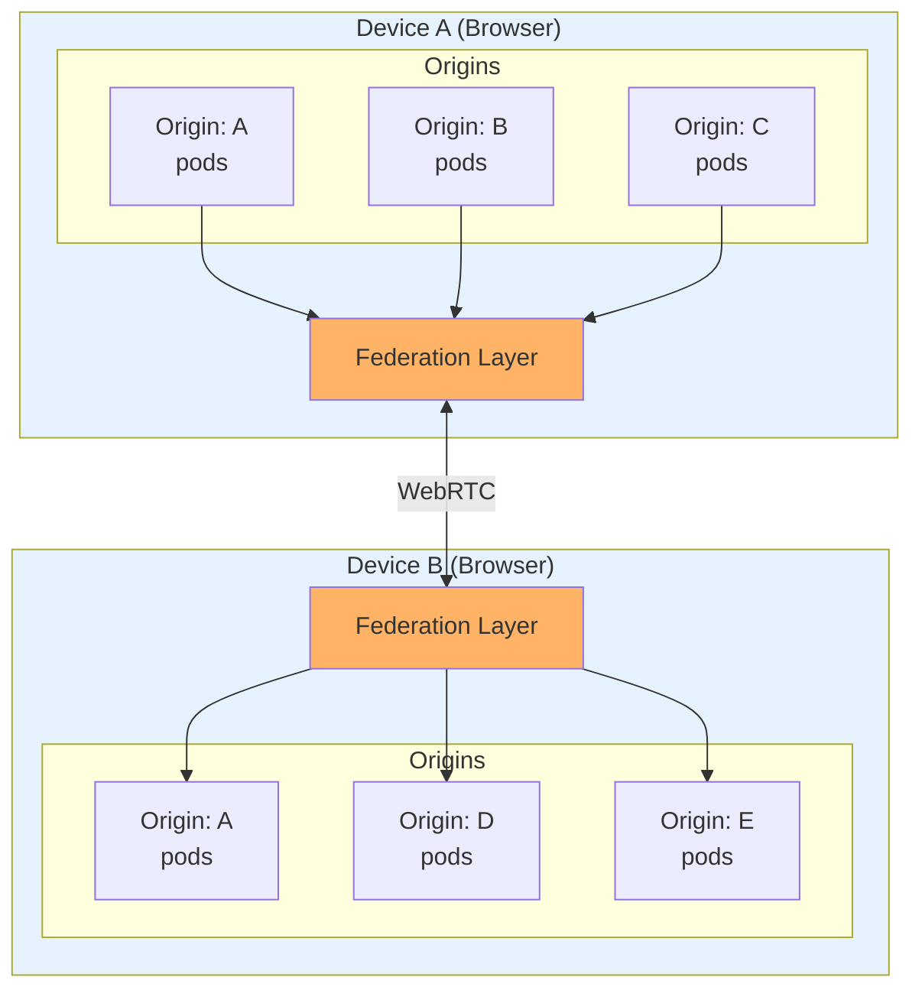
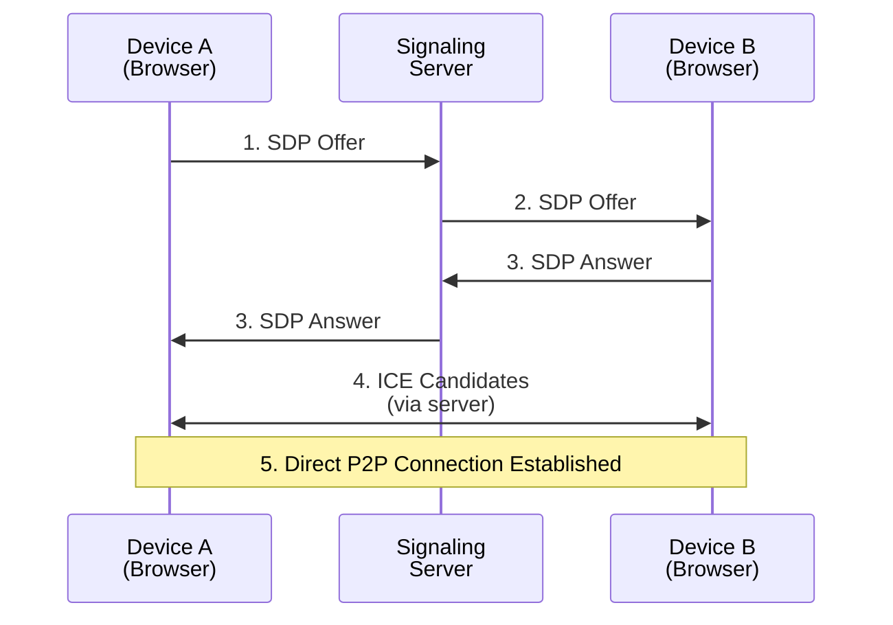

# BrowserMesh Federation

## 1. Overview

Federation enables BrowserMesh pods to communicate across:
- **Cross-origin**: Different domains within the same browser
- **Cross-device**: Multiple devices via WebRTC mesh
- **Cross-network**: Pods behind different NATs

### 1.1 Federation Architecture



---

## 2. Cross-Origin Trust Model

### 2.1 Trust Levels

```typescript
type FederationTrust =
  | 'isolated'     // No cross-origin communication
  | 'announced'    // Visible but not trusted
  | 'verified'     // Cryptographic handshake complete
  | 'delegated'    // Trusted via parent's delegation
  | 'pinned';      // Explicitly configured trust

interface OriginTrustConfig {
  origin: string;
  trust: FederationTrust;
  allowedMethods?: string[];      // RPC methods allowed
  maxBandwidth?: number;          // Rate limiting
  expires?: number;               // Trust expiration
}
```

### 2.2 Trust Establishment

Cross-origin trust requires explicit configuration:

```typescript
// In app initialization
const mesh = await BrowserMesh.init({
  federation: {
    // Explicitly trust specific origins
    trustedOrigins: [
      {
        origin: 'https://partner-app.example.com',
        trust: 'verified',
        allowedMethods: ['compute/*', 'data/read'],
      },
      {
        origin: 'https://plugin.example.com',
        trust: 'delegated',
        maxBandwidth: 1_000_000,  // 1MB/s
      },
    ],

    // Allow discovery from any origin (but not trust)
    announceToAll: true,

    // Require verification for all cross-origin calls
    requireVerification: true,
  },
});
```

### 2.3 Cross-Origin Communication

Cross-origin pods communicate via `postMessage` with strict origin validation:

```typescript
class CrossOriginBridge {
  private trustedOrigins: Map<string, OriginTrustConfig> = new Map();
  private pendingHandshakes: Map<string, HandshakeSession> = new Map();

  constructor(config: FederationConfig) {
    // Register trusted origins
    for (const origin of config.trustedOrigins) {
      this.trustedOrigins.set(origin.origin, origin);
    }

    // Listen for cross-origin messages
    window.addEventListener('message', this.handleMessage.bind(this));
  }

  private handleMessage(event: MessageEvent): void {
    // Validate origin
    const trust = this.trustedOrigins.get(event.origin);

    if (!trust && !this.config.announceToAll) {
      return; // Ignore untrusted origins
    }

    const message = event.data;
    if (!this.isMeshMessage(message)) {
      return; // Not a mesh message
    }

    switch (message.type) {
      case 'MESH_FEDERATE_HELLO':
        this.handleFederateHello(event.origin, event.source, message);
        break;

      case 'MESH_FEDERATE_ACK':
        this.handleFederateAck(event.origin, message);
        break;

      case 'MESH_FEDERATE_REQUEST':
        this.handleFederateRequest(event.origin, event.source, message);
        break;
    }
  }

  private async handleFederateHello(
    origin: string,
    source: MessageEventSource,
    message: FederateHelloMessage
  ): Promise<void> {
    const trust = this.trustedOrigins.get(origin);

    if (trust?.trust === 'isolated') {
      return; // Don't respond to isolated origins
    }

    // Start handshake
    const session = new HandshakeSession();
    const ack = await session.respond(message);

    // Send acknowledgment
    (source as Window).postMessage({
      type: 'MESH_FEDERATE_ACK',
      ...ack,
    }, origin);

    this.pendingHandshakes.set(message.from, session);
  }

  async sendToOrigin(
    targetOrigin: string,
    targetPodId: string,
    request: FederateRequest
  ): Promise<FederateResponse> {
    const trust = this.trustedOrigins.get(targetOrigin);

    if (!trust || trust.trust === 'isolated') {
      throw new Error(`Origin not trusted: ${targetOrigin}`);
    }

    // Validate method against allowed list
    if (trust.allowedMethods) {
      const allowed = trust.allowedMethods.some(pattern =>
        matchMethod(request.method, pattern)
      );
      if (!allowed) {
        throw new Error(`Method not allowed for origin: ${request.method}`);
      }
    }

    // Send via broadcast (recipient filters by podId)
    return new Promise((resolve, reject) => {
      const requestId = crypto.randomUUID();

      // Listen for response
      const handler = (event: MessageEvent) => {
        if (event.origin !== targetOrigin) return;
        if (event.data.type !== 'MESH_FEDERATE_RESPONSE') return;
        if (event.data.requestId !== requestId) return;

        window.removeEventListener('message', handler);
        resolve(event.data);
      };

      window.addEventListener('message', handler);

      // Broadcast request
      window.postMessage({
        type: 'MESH_FEDERATE_REQUEST',
        requestId,
        to: targetPodId,
        ...request,
      }, '*');
    });
  }
}
```

---

## 3. WebRTC Multi-Device Mesh

### 3.1 Signaling Architecture

WebRTC requires signaling for connection establishment. BrowserMesh uses the Server Bridge as the signaling relay:



### 3.2 WebRTC Peer Connection

```typescript
interface PeerConfig {
  deviceId: string;           // Remote device identifier
  iceServers: RTCIceServer[];
  dataChannelOptions?: RTCDataChannelInit;
}

class WebRTCPeer extends EventEmitter {
  private pc: RTCPeerConnection;
  private dataChannel?: RTCDataChannel;
  private state: 'new' | 'connecting' | 'connected' | 'disconnected' = 'new';

  constructor(
    private config: PeerConfig,
    private signaling: SignalingChannel
  ) {
    super();

    this.pc = new RTCPeerConnection({
      iceServers: config.iceServers,
    });

    this.pc.onicecandidate = (event) => {
      if (event.candidate) {
        this.signaling.send({
          type: 'ICE_CANDIDATE',
          to: config.deviceId,
          candidate: event.candidate,
        });
      }
    };

    this.pc.onconnectionstatechange = () => {
      this.handleConnectionStateChange();
    };

    this.pc.ondatachannel = (event) => {
      this.setupDataChannel(event.channel);
    };
  }

  async initiateConnection(): Promise<void> {
    this.state = 'connecting';

    // Create data channel (initiator creates it)
    const channel = this.pc.createDataChannel('mesh', {
      ordered: true,
      ...this.config.dataChannelOptions,
    });
    this.setupDataChannel(channel);

    // Create and send offer
    const offer = await this.pc.createOffer();
    await this.pc.setLocalDescription(offer);

    this.signaling.send({
      type: 'SDP_OFFER',
      to: this.config.deviceId,
      sdp: offer,
    });
  }

  async handleOffer(sdp: RTCSessionDescriptionInit): Promise<void> {
    this.state = 'connecting';

    await this.pc.setRemoteDescription(sdp);

    const answer = await this.pc.createAnswer();
    await this.pc.setLocalDescription(answer);

    this.signaling.send({
      type: 'SDP_ANSWER',
      to: this.config.deviceId,
      sdp: answer,
    });
  }

  async handleAnswer(sdp: RTCSessionDescriptionInit): Promise<void> {
    await this.pc.setRemoteDescription(sdp);
  }

  async handleIceCandidate(candidate: RTCIceCandidateInit): Promise<void> {
    await this.pc.addIceCandidate(candidate);
  }

  private setupDataChannel(channel: RTCDataChannel): void {
    this.dataChannel = channel;
    channel.binaryType = 'arraybuffer';

    channel.onopen = () => {
      this.state = 'connected';
      this.emit('connected');
    };

    channel.onmessage = (event) => {
      const data = new Uint8Array(event.data);
      this.emit('message', data);
    };

    channel.onclose = () => {
      this.state = 'disconnected';
      this.emit('disconnected');
    };
  }

  send(data: Uint8Array): void {
    if (this.dataChannel?.readyState === 'open') {
      this.dataChannel.send(data);
    }
  }

  close(): void {
    this.dataChannel?.close();
    this.pc.close();
    this.state = 'disconnected';
  }
}
```

### 3.3 Mesh Topology

BrowserMesh maintains a full mesh between devices for resilience:

```typescript
class DeviceMesh extends EventEmitter {
  private peers: Map<string, WebRTCPeer> = new Map();
  private localDeviceId: string;

  constructor(
    private signaling: SignalingChannel,
    private iceServers: RTCIceServer[]
  ) {
    super();

    this.localDeviceId = this.generateDeviceId();

    // Handle signaling messages
    signaling.on('message', this.handleSignalingMessage.bind(this));

    // Announce presence
    this.announce();
  }

  private generateDeviceId(): string {
    // Persistent device ID stored in localStorage
    let id = localStorage.getItem('mesh:device-id');
    if (!id) {
      id = crypto.randomUUID();
      localStorage.setItem('mesh:device-id', id);
    }
    return id;
  }

  private announce(): void {
    this.signaling.send({
      type: 'DEVICE_ANNOUNCE',
      deviceId: this.localDeviceId,
      pods: this.getLocalPodIds(),
    });
  }

  private async handleSignalingMessage(message: SignalingMessage): void {
    switch (message.type) {
      case 'DEVICE_ANNOUNCE':
        if (message.deviceId !== this.localDeviceId) {
          await this.connectToDevice(message.deviceId);
        }
        break;

      case 'SDP_OFFER':
        await this.handleIncomingConnection(message);
        break;

      case 'SDP_ANSWER':
        const peer = this.peers.get(message.from);
        if (peer) {
          await peer.handleAnswer(message.sdp);
        }
        break;

      case 'ICE_CANDIDATE':
        const targetPeer = this.peers.get(message.from);
        if (targetPeer) {
          await targetPeer.handleIceCandidate(message.candidate);
        }
        break;
    }
  }

  private async connectToDevice(deviceId: string): Promise<void> {
    if (this.peers.has(deviceId)) return;

    // Deterministic initiator selection (lower ID initiates)
    if (this.localDeviceId < deviceId) {
      const peer = new WebRTCPeer(
        { deviceId, iceServers: this.iceServers },
        this.signaling
      );

      this.peers.set(deviceId, peer);
      this.setupPeerHandlers(peer, deviceId);

      await peer.initiateConnection();
    }
    // Otherwise, wait for the other device to initiate
  }

  private async handleIncomingConnection(message: {
    from: string;
    sdp: RTCSessionDescriptionInit;
  }): Promise<void> {
    let peer = this.peers.get(message.from);

    if (!peer) {
      peer = new WebRTCPeer(
        { deviceId: message.from, iceServers: this.iceServers },
        this.signaling
      );
      this.peers.set(message.from, peer);
      this.setupPeerHandlers(peer, message.from);
    }

    await peer.handleOffer(message.sdp);
  }

  private setupPeerHandlers(peer: WebRTCPeer, deviceId: string): void {
    peer.on('connected', () => {
      this.emit('device:connected', deviceId);
    });

    peer.on('disconnected', () => {
      this.peers.delete(deviceId);
      this.emit('device:disconnected', deviceId);
    });

    peer.on('message', (data: Uint8Array) => {
      const envelope = cbor.decode(data) as MeshEnvelope;
      this.emit('message', { from: deviceId, envelope });
    });
  }

  broadcast(envelope: MeshEnvelope): void {
    const data = cbor.encode(envelope);
    for (const peer of this.peers.values()) {
      peer.send(data);
    }
  }

  sendTo(deviceId: string, envelope: MeshEnvelope): boolean {
    const peer = this.peers.get(deviceId);
    if (peer) {
      peer.send(cbor.encode(envelope));
      return true;
    }
    return false;
  }

  getConnectedDevices(): string[] {
    return [...this.peers.keys()];
  }
}
```

---

## 4. NAT Traversal

### 4.1 ICE Server Configuration

```typescript
const DEFAULT_ICE_SERVERS: RTCIceServer[] = [
  // Public STUN servers
  { urls: 'stun:stun.l.google.com:19302' },
  { urls: 'stun:stun1.l.google.com:19302' },

  // TURN servers (required for symmetric NAT)
  {
    urls: 'turn:turn.example.com:3478',
    username: 'mesh',
    credential: 'secret',
  },
  {
    urls: 'turns:turn.example.com:5349',
    username: 'mesh',
    credential: 'secret',
  },
];
```

### 4.2 Connection Quality Monitoring

```typescript
interface ConnectionStats {
  bytesReceived: number;
  bytesSent: number;
  packetsLost: number;
  roundTripTime: number;
  candidatePairType: 'host' | 'srflx' | 'prflx' | 'relay';
}

async function getConnectionStats(pc: RTCPeerConnection): Promise<ConnectionStats> {
  const stats = await pc.getStats();
  let result: Partial<ConnectionStats> = {};

  stats.forEach((report) => {
    if (report.type === 'candidate-pair' && report.state === 'succeeded') {
      result.roundTripTime = report.currentRoundTripTime * 1000;
      result.bytesReceived = report.bytesReceived;
      result.bytesSent = report.bytesSent;

      // Get candidate type
      const localCandidate = stats.get(report.localCandidateId);
      result.candidatePairType = localCandidate?.candidateType || 'unknown';
    }

    if (report.type === 'inbound-rtp') {
      result.packetsLost = report.packetsLost;
    }
  });

  return result as ConnectionStats;
}
```

---

## 5. Federated Discovery

### 5.1 Cross-Device Pod Discovery

```typescript
interface FederatedPod {
  podId: string;
  deviceId: string;
  kind: PodKind;
  origin: string;
  capabilities: PodCapabilities;
}

class FederatedRegistry {
  private pods: Map<string, FederatedPod> = new Map();
  private byDevice: Map<string, Set<string>> = new Map();

  register(pod: FederatedPod): void {
    this.pods.set(pod.podId, pod);

    let devicePods = this.byDevice.get(pod.deviceId);
    if (!devicePods) {
      devicePods = new Set();
      this.byDevice.set(pod.deviceId, devicePods);
    }
    devicePods.add(pod.podId);
  }

  unregister(podId: string): void {
    const pod = this.pods.get(podId);
    if (pod) {
      this.pods.delete(podId);
      this.byDevice.get(pod.deviceId)?.delete(podId);
    }
  }

  findPod(podId: string): FederatedPod | undefined {
    return this.pods.get(podId);
  }

  findByDevice(deviceId: string): FederatedPod[] {
    const ids = this.byDevice.get(deviceId) || new Set();
    return [...ids].map(id => this.pods.get(id)!).filter(Boolean);
  }

  findByCapability(capability: keyof PodCapabilities): FederatedPod[] {
    return [...this.pods.values()].filter(
      pod => pod.capabilities[capability]
    );
  }
}
```

### 5.2 Cross-Device Routing

```typescript
async function routeFederated(
  envelope: MeshEnvelope,
  localTable: RoutingTable,
  federatedRegistry: FederatedRegistry,
  deviceMesh: DeviceMesh
): Promise<void> {
  const { to } = envelope;

  // Try local first
  const localRoute = localTable.resolve(to!);
  if (localRoute) {
    await routeLocal(envelope, localRoute);
    return;
  }

  // Check federated registry
  const remotePod = federatedRegistry.findPod(to!);
  if (remotePod) {
    const sent = deviceMesh.sendTo(remotePod.deviceId, envelope);
    if (sent) return;
  }

  // Broadcast to all devices (fallback)
  deviceMesh.broadcast(envelope);
}
```

---

## 6. Security Considerations

### 6.1 Cross-Origin Security

```typescript
// Never trust cross-origin data without verification
function validateCrossOriginMessage(
  event: MessageEvent,
  trustedOrigins: Set<string>
): boolean {
  // Check origin is trusted
  if (!trustedOrigins.has(event.origin)) {
    console.warn(`Rejected message from untrusted origin: ${event.origin}`);
    return false;
  }

  // Validate message structure
  if (!isMeshMessage(event.data)) {
    return false;
  }

  // Verify signature if present
  if (event.data.sig) {
    return verifyCrossOriginSignature(event.data);
  }

  return true;
}
```

### 6.2 Device Authentication

```typescript
// Devices authenticate via signed announcements
interface SignedDeviceAnnounce {
  type: 'DEVICE_ANNOUNCE';
  deviceId: string;
  publicKey: Uint8Array;
  pods: PodInfo[];
  timestamp: number;
  signature: Uint8Array;  // Signs all above fields
}

async function verifyDeviceAnnounce(
  announce: SignedDeviceAnnounce
): Promise<boolean> {
  // Verify device ID matches public key
  const expectedId = await derivePodId(announce.publicKey);
  if (announce.deviceId !== expectedId) {
    return false;
  }

  // Verify signature
  return verifySignature(
    announce.signature,
    announce.publicKey,
    cbor.encode({
      deviceId: announce.deviceId,
      pods: announce.pods,
      timestamp: announce.timestamp,
    })
  );
}
```

---

## Next Steps

- [Reference Implementation](../reference/README.md) — Library architecture, module breakdown
