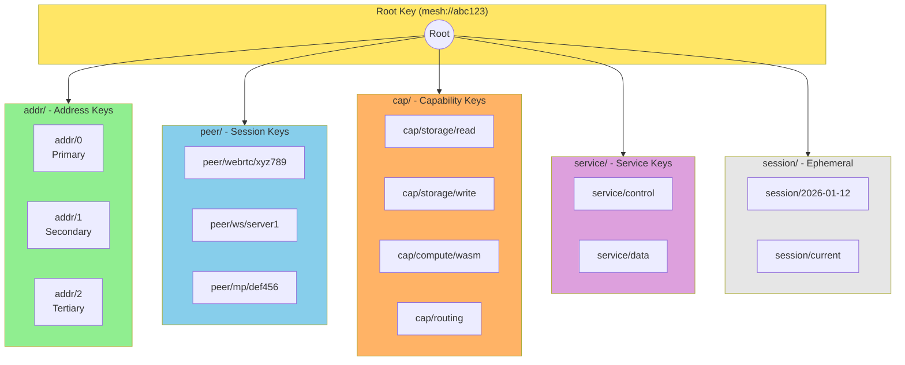
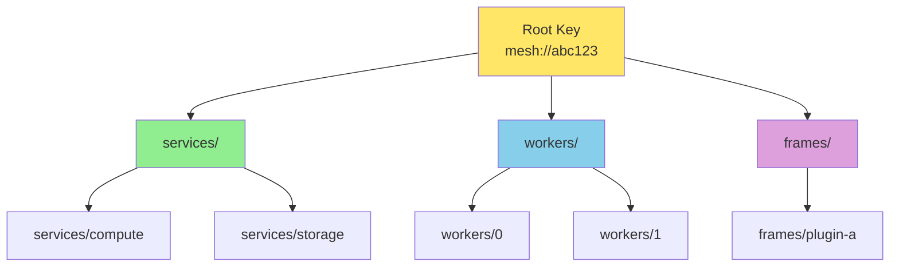
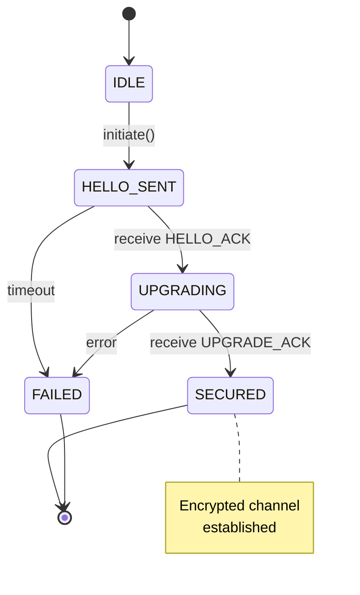

# BrowserMesh Identity & Cryptography

## 1. Key Generation

BrowserMesh uses Ed25519 for all cryptographic operations.

### 1.0 Browser Support Status (2025)

As of Chrome 137 (May 2025), Ed25519 and X25519 are natively supported in all major browsers:

| Browser | Ed25519 | X25519 | Notes |
|---------|---------|--------|-------|
| Chrome 137+ | ✅ | ✅ | Shipped May 2025 |
| Firefox 115+ | ✅ | ✅ | Shipped earlier |
| Safari 17+ | ✅ | ✅ | Shipped earlier |
| Edge 137+ | ✅ | ✅ | Follows Chromium |

**Why native crypto matters:**
- Non-extractable keys prevent attacks from malicious scripts
- No supply chain vulnerabilities from JS/WASM libraries
- Ed25519 is required for WebTransport (RSA banned)

> See: [Igalia: Ed25519 Support Lands in Chrome](https://blogs.igalia.com/jfernandez/2025/08/25/ed25519-support-lands-in-chrome-what-it-means-for-developers-and-the-web/)

### 1.1 Primary Key Generation

```typescript
async function generatePodKeyPair(): Promise<CryptoKeyPair> {
  return crypto.subtle.generateKey(
    { name: 'Ed25519' },
    true,  // extractable for export
    ['sign', 'verify']
  );
}

async function exportPublicKey(keyPair: CryptoKeyPair): Promise<Uint8Array> {
  const raw = await crypto.subtle.exportKey('raw', keyPair.publicKey);
  return new Uint8Array(raw);  // 32 bytes
}

async function exportPrivateKey(keyPair: CryptoKeyPair): Promise<Uint8Array> {
  const pkcs8 = await crypto.subtle.exportKey('pkcs8', keyPair.privateKey);
  // PKCS#8 wrapper is 48 bytes, seed is last 32
  return new Uint8Array(pkcs8).slice(-32);
}
```

### 1.2 Pod ID Derivation

The Pod ID is a URL-safe Base64 encoding of the SHA-256 hash of the public key:

```typescript
async function derivePodId(publicKey: Uint8Array): Promise<string> {
  const hash = await crypto.subtle.digest('SHA-256', publicKey);
  return base64url(new Uint8Array(hash));
}

function base64url(bytes: Uint8Array): string {
  const base64 = btoa(String.fromCharCode(...bytes));
  return base64
    .replace(/\+/g, '-')
    .replace(/\//g, '_')
    .replace(/=+$/, '');
}
```

**Example Pod ID:** `dGhpcyBpcyBhIHRlc3Qga2V5IGhhc2ggdmFsdWU`

---

## 2. Hierarchical Derivation

BrowserMesh supports HD-style key derivation using URI paths, enabling deterministic child key generation for sub-pods and services.

### 2.1 Derivation Path Format

```
mesh://{pod-id}/{path-segments}

Examples:
  mesh://abc123/services/compute
  mesh://abc123/workers/0
  mesh://abc123/frames/plugin-a
```

### 2.2 Standard Path Categories

The derivation tree follows a logical structure:



### 2.3 Capability Delegation via Derived Keys

HD derivation enables secure capability delegation without sharing the root key:

```typescript
// Root pod derives a limited-capability key
const storageReadKey = await deriveChildKey(rootSeed, 'cap/storage/read');

// Delegate to worker pod - it can only read storage
workerPod.postMessage({
  type: 'DELEGATE_CAPABILITY',
  derivedPublicKey: storageReadKey.publicKey,
  path: 'cap/storage/read',
  constraints: {
    expires: Date.now() + 3600_000,  // 1 hour
    maxOps: 100,
  },
  signature: await sign(rootKeyPair, delegationPayload),
});
```

**Security properties:**
- Worker cannot impersonate root
- Worker cannot derive sibling keys
- Delegation can be time-limited and rate-limited
- Revocation by path invalidation

### 2.4 Derivation Algorithm

Uses HKDF (HMAC-based Key Derivation Function) with the parent seed and path as inputs:

```typescript
interface DerivedKey {
  path: string;
  keyPair: CryptoKeyPair;
  id: string;
  parentId: string;
}

async function deriveChildKey(
  parentSeed: Uint8Array,
  path: string
): Promise<DerivedKey> {
  // Import parent seed as HKDF base key
  const baseKey = await crypto.subtle.importKey(
    'raw',
    parentSeed,
    'HKDF',
    false,
    ['deriveBits']
  );

  // Derive 32 bytes using path as info
  const encoder = new TextEncoder();
  const derivedBits = await crypto.subtle.deriveBits(
    {
      name: 'HKDF',
      hash: 'SHA-256',
      salt: encoder.encode('browsermesh-v1'),
      info: encoder.encode(path),
    },
    baseKey,
    256  // 32 bytes
  );

  // Use derived bits as Ed25519 seed
  const childSeed = new Uint8Array(derivedBits);
  const keyPair = await importEd25519Seed(childSeed);
  const publicKey = await exportPublicKey(keyPair);
  const id = await derivePodId(publicKey);

  return { path, keyPair, id, parentId: await derivePodId(parentSeed) };
}

async function importEd25519Seed(seed: Uint8Array): Promise<CryptoKeyPair> {
  // Build PKCS#8 wrapper for Ed25519 seed
  const pkcs8Prefix = new Uint8Array([
    0x30, 0x2e, 0x02, 0x01, 0x00, 0x30, 0x05, 0x06,
    0x03, 0x2b, 0x65, 0x70, 0x04, 0x22, 0x04, 0x20
  ]);
  const pkcs8 = new Uint8Array(48);
  pkcs8.set(pkcs8Prefix);
  pkcs8.set(seed, 16);

  const privateKey = await crypto.subtle.importKey(
    'pkcs8',
    pkcs8,
    { name: 'Ed25519' },
    true,
    ['sign']
  );

  // Derive public key (implementation detail)
  return derivePublicFromPrivate(privateKey);
}
```

### 2.5 Derivation Tree



---

## 3. Key Exchange (X25519)

For establishing encrypted channels, BrowserMesh uses X25519 (Curve25519 Diffie-Hellman).

### 3.1 X25519 Key Derivation from Ed25519

Ed25519 keys can be converted to X25519 for key exchange:

```typescript
async function ed25519ToX25519(ed25519Seed: Uint8Array): Promise<CryptoKeyPair> {
  // X25519 uses the same curve, different encoding
  // The seed can be used directly
  return crypto.subtle.generateKey(
    { name: 'X25519' },
    true,
    ['deriveBits']
  );
}

async function deriveSharedSecret(
  privateKey: CryptoKey,
  peerPublicKey: CryptoKey
): Promise<Uint8Array> {
  const bits = await crypto.subtle.deriveBits(
    { name: 'X25519', public: peerPublicKey },
    privateKey,
    256
  );
  return new Uint8Array(bits);
}
```

### 3.2 Encryption with XSalsa20-Poly1305

After key exchange, messages are encrypted using XSalsa20-Poly1305 (NaCl secretbox):

```typescript
interface EncryptedMessage {
  nonce: Uint8Array;      // 24 bytes
  ciphertext: Uint8Array; // variable length
}

async function encrypt(
  plaintext: Uint8Array,
  sharedSecret: Uint8Array
): Promise<EncryptedMessage> {
  const nonce = crypto.getRandomValues(new Uint8Array(24));

  // Derive encryption key from shared secret
  const key = await crypto.subtle.importKey(
    'raw',
    sharedSecret,
    { name: 'AES-GCM' },
    false,
    ['encrypt']
  );

  const ciphertext = await crypto.subtle.encrypt(
    { name: 'AES-GCM', iv: nonce.slice(0, 12) },
    key,
    plaintext
  );

  return { nonce, ciphertext: new Uint8Array(ciphertext) };
}
```

---

## 4. Cryptographic Handshake

The handshake protocol establishes authenticated, encrypted channels between pods.

### 4.1 Handshake State Machine



### 4.2 Handshake Protocol

```typescript
interface HandshakeHello {
  type: 'MESH_HELLO';
  from: string;                    // Pod ID
  publicKey: Uint8Array;           // Ed25519 public key
  ephemeralKey: Uint8Array;        // X25519 ephemeral public key
  capabilities: PodCapabilities;
  timestamp: number;
  nonce: Uint8Array;               // 16 random bytes
}

interface HandshakeAck {
  type: 'MESH_HELLO_ACK';
  from: string;
  to: string;
  publicKey: Uint8Array;
  ephemeralKey: Uint8Array;
  capabilities: PodCapabilities;
  timestamp: number;
  signature: Uint8Array;           // Ed25519 signature over request
}

interface UpgradeRequest {
  type: 'MESH_UPGRADE';
  from: string;
  to: string;
  channelType: 'message-port' | 'broadcast' | 'webrtc';
  proof: Uint8Array;               // Signed shared secret hash
}
```

### 4.3 Handshake Implementation

```typescript
class HandshakeSession {
  state: 'idle' | 'hello_sent' | 'upgrading' | 'secured' | 'failed' = 'idle';

  private localKeyPair: CryptoKeyPair;
  private ephemeralKeyPair: CryptoKeyPair;
  private peerPublicKey?: Uint8Array;
  private sharedSecret?: Uint8Array;

  async initiate(targetOrigin: string): Promise<HandshakeHello> {
    this.ephemeralKeyPair = await crypto.subtle.generateKey(
      { name: 'X25519' },
      true,
      ['deriveBits']
    );

    const hello: HandshakeHello = {
      type: 'MESH_HELLO',
      from: this.localPodId,
      publicKey: await exportPublicKey(this.localKeyPair),
      ephemeralKey: await exportPublicKey(this.ephemeralKeyPair),
      capabilities: detectCapabilities(),
      timestamp: Date.now(),
      nonce: crypto.getRandomValues(new Uint8Array(16)),
    };

    this.state = 'hello_sent';
    return hello;
  }

  async handleHelloAck(ack: HandshakeAck): Promise<UpgradeRequest> {
    // Verify signature
    const isValid = await this.verifySignature(ack);
    if (!isValid) {
      this.state = 'failed';
      throw new Error('Invalid handshake signature');
    }

    // Derive shared secret
    const peerEphemeralKey = await importX25519Public(ack.ephemeralKey);
    this.sharedSecret = await deriveSharedSecret(
      this.ephemeralKeyPair.privateKey,
      peerEphemeralKey
    );

    // Create upgrade request with proof
    const proof = await this.signSharedSecret();

    this.state = 'upgrading';
    return {
      type: 'MESH_UPGRADE',
      from: this.localPodId,
      to: ack.from,
      channelType: this.selectChannelType(ack.capabilities),
      proof,
    };
  }

  async finalize(): Promise<SecureChannel> {
    this.state = 'secured';
    return new SecureChannel(this.sharedSecret!, this.peerPublicKey!);
  }
}
```

---

## 5. Message Signing

All routed messages can be signed for authenticity verification.

### 5.1 Signature Format

```typescript
interface SignedEnvelope {
  envelope: MeshEnvelope;
  signature: Uint8Array;  // Ed25519 signature (64 bytes)
}

async function signEnvelope(
  envelope: MeshEnvelope,
  privateKey: CryptoKey
): Promise<Uint8Array> {
  // Sign the CBOR-encoded envelope (excluding signature field)
  const data = cbor.encode({
    v: envelope.v,
    id: envelope.id,
    type: envelope.type,
    from: envelope.from,
    to: envelope.to,
    ts: envelope.ts,
    payload: envelope.payload,
  });

  const signature = await crypto.subtle.sign(
    { name: 'Ed25519' },
    privateKey,
    data
  );

  return new Uint8Array(signature);
}

async function verifyEnvelope(
  envelope: MeshEnvelope,
  signature: Uint8Array,
  publicKey: Uint8Array
): Promise<boolean> {
  const key = await crypto.subtle.importKey(
    'raw',
    publicKey,
    { name: 'Ed25519' },
    false,
    ['verify']
  );

  const data = cbor.encode({
    v: envelope.v,
    id: envelope.id,
    type: envelope.type,
    from: envelope.from,
    to: envelope.to,
    ts: envelope.ts,
    payload: envelope.payload,
  });

  return crypto.subtle.verify({ name: 'Ed25519' }, key, signature, data);
}
```

---

## 6. Key Storage

### 6.1 Storage Strategies

| Context | Storage | Security |
|---------|---------|----------|
| WindowPod | IndexedDB + `crypto.subtle` | Non-extractable preferred |
| WorkerPod | IndexedDB | Extractable for transfer |
| ServiceWorker | IndexedDB | Long-lived, non-extractable |
| SharedWorker | Memory only | Ephemeral coordinator keys |

### 6.2 Key Wrapping for Storage

```typescript
async function wrapKeyForStorage(
  keyPair: CryptoKeyPair,
  passphrase?: string
): Promise<Uint8Array> {
  if (passphrase) {
    // Derive wrapping key from passphrase
    const salt = crypto.getRandomValues(new Uint8Array(16));
    const wrappingKey = await deriveWrappingKey(passphrase, salt);

    const wrapped = await crypto.subtle.wrapKey(
      'pkcs8',
      keyPair.privateKey,
      wrappingKey,
      { name: 'AES-GCM', iv: salt }
    );

    return cbor.encode({ salt, wrapped: new Uint8Array(wrapped) });
  }

  // Store raw (rely on IndexedDB isolation)
  return await exportPrivateKey(keyPair);
}
```

---

## 7. Trust Model

### 7.1 Trust Levels

```typescript
type TrustLevel =
  | 'none'       // Unknown pod, no trust
  | 'discovered' // Seen in mesh, unverified
  | 'verified'   // Completed handshake
  | 'delegated'  // Trusted via parent delegation
  | 'pinned';    // Explicitly trusted by user

interface TrustRecord {
  podId: string;
  publicKey: Uint8Array;
  level: TrustLevel;
  verifiedAt?: number;
  delegatedBy?: string;
  expires?: number;
}
```

### 7.2 Trust Delegation

Parents can delegate trust to child pods:

```typescript
interface TrustDelegation {
  type: 'MESH_DELEGATE';
  from: string;           // Parent pod ID
  to: string;             // Child pod ID
  childPublicKey: Uint8Array;
  scope: string[];        // Allowed operations
  expires: number;
  signature: Uint8Array;  // Parent's signature
}
```

---

## 8. Capability Tokens (Macaroons)

Beyond identity keys, BrowserMesh uses attenuated capability tokens for fine-grained access control.

### 8.1 Token Structure

Inspired by macaroons, capability tokens can be delegated and attenuated:

```typescript
interface CapabilityToken {
  // Token identity
  id: string;                    // Unique token ID
  location: string;              // Service name or pod ID

  // Authorization
  caveats: Caveat[];             // Restrictions
  signature: Uint8Array;         // HMAC chain

  // Metadata
  issuedAt: number;
  issuer: string;                // Pod ID of issuer
}

type Caveat =
  | { type: 'expires'; at: number }
  | { type: 'rate-limit'; max: number; per: 'second' | 'minute' | 'hour' }
  | { type: 'method'; allowed: string[] }
  | { type: 'peer'; only: string[] }
  | { type: 'parameter'; name: string; value: unknown }
  | { type: 'third-party'; location: string; verifier: Uint8Array };
```

### 8.2 Token Creation and Attenuation

```typescript
class CapabilityTokenManager {
  private rootKey: Uint8Array;

  // Create root token (service owner only)
  createRootToken(location: string): CapabilityToken {
    const id = crypto.randomUUID();
    const signature = this.hmac(this.rootKey, id);

    return {
      id,
      location,
      caveats: [],
      signature,
      issuedAt: Date.now(),
      issuer: localPodId,
    };
  }

  // Attenuate token (anyone holding token can do this)
  attenuate(token: CapabilityToken, caveat: Caveat): CapabilityToken {
    // Chain the signature: new_sig = HMAC(old_sig, caveat)
    const caveatBytes = cbor.encode(caveat);
    const newSignature = this.hmac(token.signature, caveatBytes);

    return {
      ...token,
      caveats: [...token.caveats, caveat],
      signature: newSignature,
    };
  }

  // Verify token chain
  verify(token: CapabilityToken): boolean {
    // Recompute signature chain
    let sig = this.hmac(this.rootKey, token.id);

    for (const caveat of token.caveats) {
      sig = this.hmac(sig, cbor.encode(caveat));
    }

    // Compare
    return crypto.timingSafeEqual(sig, token.signature);
  }
}
```

### 8.3 Delegation Chain Example

```typescript
// Service creates root token
const rootToken = tokenManager.createRootToken('service://image-resizer');

// Service attenuates for specific pod
const podToken = tokenManager.attenuate(rootToken, {
  type: 'peer',
  only: ['pod-abc123'],
});

// Pod further attenuates for limited use
const limitedToken = tokenManager.attenuate(podToken, {
  type: 'rate-limit',
  max: 100,
  per: 'minute',
});

// Even further: add expiry
const tempToken = tokenManager.attenuate(limitedToken, {
  type: 'expires',
  at: Date.now() + 3600_000,  // 1 hour
});

// Token can be passed to another pod
// They cannot remove caveats, only add more
```

---

## 9. Quotas & Rate Limiting

Abuse control without a token economy.

### 9.1 Quota Configuration

```typescript
interface QuotaConfig {
  // Per-peer limits
  perPeer: {
    requestsPerSecond: number;
    requestsPerMinute: number;
    concurrentRequests: number;
    bytesPerMinute: number;
  };

  // Per-service limits
  perService: {
    totalRequestsPerMinute: number;
    totalConcurrent: number;
    queueDepth: number;
  };

  // Global limits
  global: {
    memoryBudget: number;       // bytes
    cpuBudget: number;          // percentage
  };
}
```

### 9.2 Token Bucket Rate Limiter

```typescript
class TokenBucketLimiter {
  private buckets: Map<string, {
    tokens: number;
    lastRefill: number;
  }> = new Map();

  constructor(
    private rate: number,        // tokens per second
    private capacity: number     // max tokens
  ) {}

  tryConsume(key: string, cost: number = 1): boolean {
    const now = Date.now();
    let bucket = this.buckets.get(key);

    if (!bucket) {
      bucket = { tokens: this.capacity, lastRefill: now };
      this.buckets.set(key, bucket);
    }

    // Refill tokens based on time elapsed
    const elapsed = (now - bucket.lastRefill) / 1000;
    bucket.tokens = Math.min(
      this.capacity,
      bucket.tokens + elapsed * this.rate
    );
    bucket.lastRefill = now;

    // Try to consume
    if (bucket.tokens >= cost) {
      bucket.tokens -= cost;
      return true;
    }

    return false;
  }

  // Get wait time until tokens available
  getWaitTime(key: string, cost: number = 1): number {
    const bucket = this.buckets.get(key);
    if (!bucket || bucket.tokens >= cost) return 0;

    const needed = cost - bucket.tokens;
    return Math.ceil((needed / this.rate) * 1000);
  }
}
```

### 9.3 Cost Hints

Requests can include cost hints for expensive operations:

```typescript
interface CostHint {
  cpu: number;        // 1-100 relative cost
  memory: number;     // bytes expected
  io: number;         // 1-100 relative cost
  duration: number;   // expected ms
}

// Example: image resize is expensive
const resizeRequest: MeshEnvelope = {
  // ... standard fields
  hints: {
    cost: {
      cpu: 80,
      memory: 50_000_000,  // 50MB
      io: 10,
      duration: 2000,
    }
  }
};
```

---

## 10. Key Rotation & Recovery

Production-grade key lifecycle management.

### 10.1 Rotation Types

| Type | Difficulty | Frequency | Mechanism |
|------|------------|-----------|-----------|
| Session keys | Easy | Per-connection | New key exchange |
| Derived keys | Easy | As needed | Re-derive from HD path |
| Instance keys | Medium | On restart | New keypair, re-announce |
| Identity keys | Hard | Rare | Migration protocol |

### 10.2 Session Key Rotation

```typescript
class SessionKeyManager {
  private sessions: Map<string, {
    key: CryptoKey;
    createdAt: number;
    messageCount: number;
  }> = new Map();

  private readonly MAX_AGE = 3600_000;        // 1 hour
  private readonly MAX_MESSAGES = 1_000_000;  // 1M messages

  shouldRotate(peerId: string): boolean {
    const session = this.sessions.get(peerId);
    if (!session) return false;

    const age = Date.now() - session.createdAt;
    return age > this.MAX_AGE ||
           session.messageCount > this.MAX_MESSAGES;
  }

  async rotate(peerId: string): Promise<void> {
    // Perform new key exchange
    const newKey = await this.keyExchange(peerId);

    // Keep old key briefly for in-flight messages
    const oldSession = this.sessions.get(peerId);
    if (oldSession) {
      this.pendingRetire.set(peerId, oldSession);
      setTimeout(() => this.pendingRetire.delete(peerId), 5000);
    }

    this.sessions.set(peerId, {
      key: newKey,
      createdAt: Date.now(),
      messageCount: 0,
    });
  }
}
```

### 10.3 Identity Key Migration

When a pod needs to change its identity key (compromised, upgrade, etc.):

```typescript
interface KeyMigrationAnnouncement {
  type: 'MESH_KEY_MIGRATION';
  oldPodId: string;
  newPodId: string;
  oldPublicKey: Uint8Array;
  newPublicKey: Uint8Array;

  // Proof of ownership of old key
  proofSignature: Uint8Array;   // Sign(oldKey, newPublicKey)

  // Optional: timestamp for ordering
  timestamp: number;

  // Optional: reason
  reason?: 'rotation' | 'compromise' | 'upgrade';
}

async function announceKeyMigration(
  oldKeyPair: CryptoKeyPair,
  newKeyPair: CryptoKeyPair
): Promise<void> {
  const newPublicKey = await exportPublicKey(newKeyPair);

  // Sign new key with old key to prove ownership
  const proof = await sign(oldKeyPair.privateKey, newPublicKey);

  const announcement: KeyMigrationAnnouncement = {
    type: 'MESH_KEY_MIGRATION',
    oldPodId: await computePodId(oldKeyPair.publicKey),
    newPodId: await computePodId(newKeyPair.publicKey),
    oldPublicKey: await exportPublicKey(oldKeyPair),
    newPublicKey,
    proofSignature: proof,
    timestamp: Date.now(),
    reason: 'rotation',
  };

  // Broadcast to all known peers
  await broadcastToAll(announcement);

  // Update local identity
  await updateLocalIdentity(newKeyPair);
}
```

### 10.4 Recovery Procedures

```typescript
interface RecoveryConfig {
  // Backup mechanisms
  backup: {
    encrypted: boolean;
    locations: ('indexeddb' | 'opfs' | 'external')[];
  };

  // Recovery options
  recovery: {
    // Social recovery: N-of-M shares
    socialRecovery?: {
      threshold: number;
      shares: number;
      trustees: string[];  // Pod IDs or external identities
    };

    // Hierarchical recovery: derive from parent
    hdRecovery?: {
      parentPath: string;
    };

    // External recovery: link to external identity
    externalLink?: {
      provider: 'passkey' | 'oauth' | 'hardware';
      identifier: string;
    };
  };
}

// Example: Shamir secret sharing for social recovery
async function createRecoveryShares(
  privateKey: Uint8Array,
  threshold: number,
  shares: number
): Promise<Uint8Array[]> {
  // Use Shamir's Secret Sharing
  return shamirSplit(privateKey, threshold, shares);
}

async function recoverFromShares(
  shares: Uint8Array[]
): Promise<Uint8Array> {
  return shamirCombine(shares);
}
```

### 10.5 TOFU + Pinning

Trust On First Use with optional pinning:

```typescript
interface PinningConfig {
  mode: 'tofu' | 'strict' | 'pinned';
  allowMigration: boolean;
  migrationWindow: number;    // ms to accept old key after migration
}

class TrustPinning {
  private pins: Map<string, {
    publicKey: Uint8Array;
    firstSeen: number;
    pinned: boolean;
    migratingTo?: Uint8Array;
    migrationDeadline?: number;
  }> = new Map();

  verify(podId: string, publicKey: Uint8Array): boolean {
    const existing = this.pins.get(podId);

    if (!existing) {
      // TOFU: trust first seen key
      this.pins.set(podId, {
        publicKey,
        firstSeen: Date.now(),
        pinned: false,
      });
      return true;
    }

    // Check if key matches
    if (equalBytes(existing.publicKey, publicKey)) {
      return true;
    }

    // Check if in migration window
    if (existing.migratingTo &&
        equalBytes(existing.migratingTo, publicKey) &&
        Date.now() < existing.migrationDeadline!) {
      // Accept new key, complete migration
      existing.publicKey = publicKey;
      existing.migratingTo = undefined;
      existing.migrationDeadline = undefined;
      return true;
    }

    // Key mismatch!
    return false;
  }
}
```

---

## 11. IPv6-Derived Virtual Addresses

Derive multiple virtual IPv6-style addresses from a single public key for multi-address identity.

### 11.1 Sliding Window Derivation

Given a 32-byte value (SHA-256 of public key), derive up to 17 unique 16-byte (128-bit) virtual addresses:

```typescript
function deriveVirtualAddresses(
  publicKey: Uint8Array,
  count: number = 17
): Uint8Array[] {
  // Hash public key to get 32 bytes
  const hash = sha256(publicKey);  // 32 bytes

  const addresses: Uint8Array[] = [];

  // Sliding window: offsets 0-16 give 17 unique 16-byte slices
  for (let offset = 0; offset < Math.min(count, 17); offset++) {
    const slice = hash.slice(offset, offset + 16);
    addresses.push(slice);
  }

  return addresses;
}

// Convert to IPv6 string format
function toIPv6String(addr: Uint8Array): string {
  const parts: string[] = [];
  for (let i = 0; i < 16; i += 2) {
    parts.push(((addr[i] << 8) | addr[i + 1]).toString(16));
  }
  return parts.join(':');
}
```

### 11.2 ULA (Unique Local Address) Formatting

Force addresses into the ULA range (`fd00::/8`) to avoid conflicts with real global addresses:

```typescript
function toULAAddress(slice: Uint8Array): Uint8Array {
  const ula = new Uint8Array(16);
  ula[0] = 0xfd;                    // ULA prefix
  ula.set(slice.slice(1, 16), 1);   // Use 15 bytes from slice
  return ula;
}

// Example output:
// Public key hash: a1b2c3d4e5f6...
// Virtual addresses:
//   fd:b2c3:d4e5:f6a7:...  (offset 0, byte 0 replaced with 0xfd)
//   fd:c3d4:e5f6:a7b8:...  (offset 1)
//   ...
```

### 11.3 Address Proof

Any virtual address can be proven to belong to a pod by:
1. Revealing the public key
2. Showing which offset was used
3. Verifying the hash matches

```typescript
interface AddressProof {
  publicKey: Uint8Array;
  offset: number;
  signature: Uint8Array;     // Sign the challenge with private key
}

function verifyAddressOwnership(
  claimedAddress: Uint8Array,
  proof: AddressProof,
  challenge: Uint8Array
): boolean {
  // 1. Verify signature
  if (!verify(proof.publicKey, challenge, proof.signature)) {
    return false;
  }

  // 2. Derive address from public key at claimed offset
  const hash = sha256(proof.publicKey);
  const derived = toULAAddress(hash.slice(proof.offset, proof.offset + 16));

  // 3. Compare
  return equalBytes(derived, claimedAddress);
}
```

### 11.4 Use Cases

| Use Case | Description |
|----------|-------------|
| Multi-homing | Pod reachable at multiple "addresses" |
| Service endpoints | Different addresses for different services |
| Load balancing | Consistent hashing on address space |
| Privacy | Rotate which address is advertised |
| Compatibility | Bridge to IPv6-based systems |

---

## Next Steps

- [Mesh Routing](../routing/README.md) — Discovery, routing tables, channel upgrades
- [Server Bridge](../bridge/README.md) — WebTransport/WebSocket ingress
