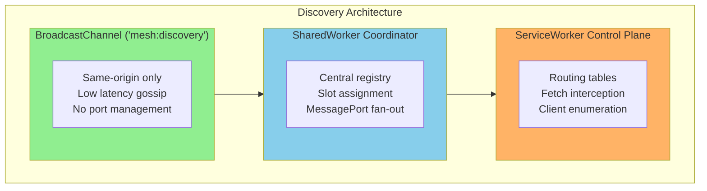
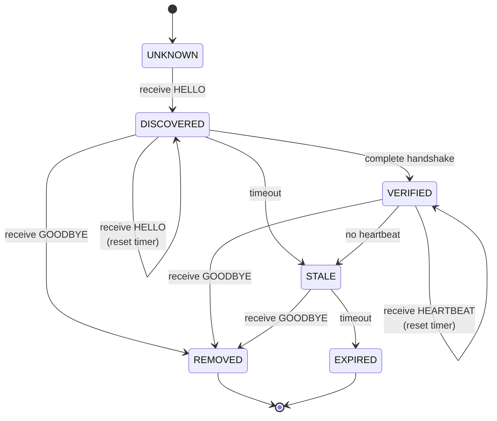
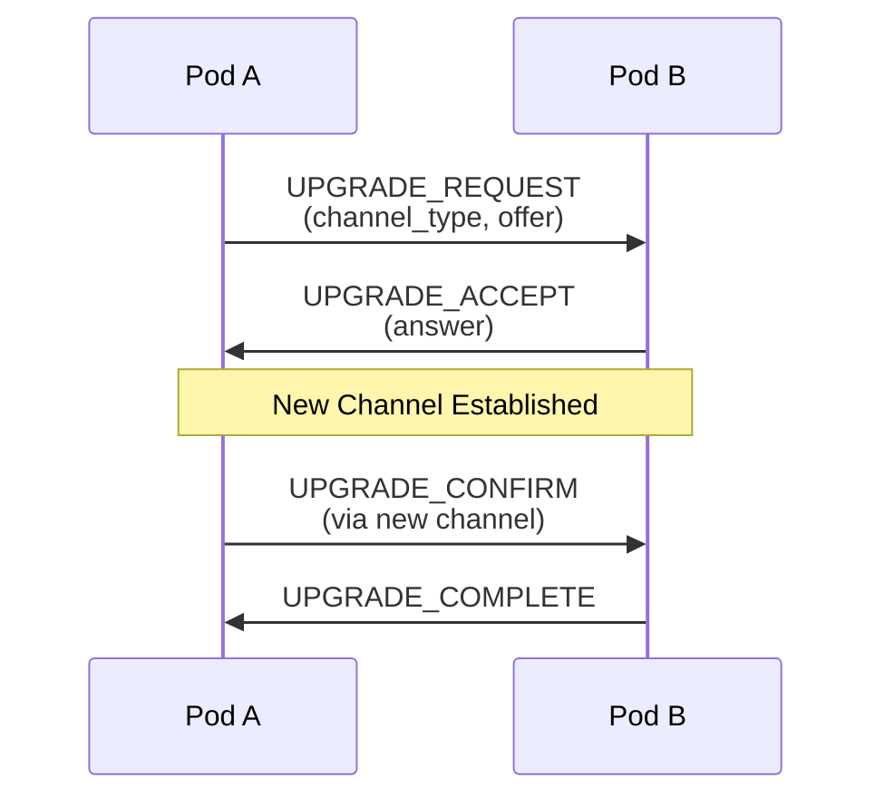

# BrowserMesh Mesh Routing

## 1. Discovery Protocol

Pods discover each other through multiple complementary mechanisms, operating in parallel.

### 1.1 Discovery Channels



### 1.2 Discovery Message Types

```typescript
// Initial announcement
interface HelloMessage {
  type: 'MESH_HELLO';
  from: string;           // Pod ID
  publicKey: Uint8Array;
  kind: PodKind;
  capabilities: PodCapabilities;
  origin: string;
  timestamp: number;
}

// Response to hello
interface HelloAckMessage {
  type: 'MESH_HELLO_ACK';
  from: string;
  to: string;
  publicKey: Uint8Array;
  kind: PodKind;
  capabilities: PodCapabilities;
  knownPeers: PeerInfo[];  // Share routing table subset
}

// Periodic heartbeat
interface HeartbeatMessage {
  type: 'MESH_HEARTBEAT';
  from: string;
  sequence: number;
  load: number;            // 0-1 utilization
  timestamp: number;
}

// Departure notification
interface GoodbyeMessage {
  type: 'MESH_GOODBYE';
  from: string;
  reason: 'shutdown' | 'error' | 'replaced';
}
```

### 1.3 Discovery State Machine



---

## 2. Routing Tables

Each pod maintains a local routing table for message forwarding.

### 2.1 Routing Entry

```typescript
interface RoutingEntry {
  podId: string;
  publicKey: Uint8Array;
  kind: PodKind;
  origin: string;

  // Reachability
  channels: ChannelInfo[];
  preferredChannel: ChannelType;
  latency: number;           // ms, measured via ping

  // State
  state: 'discovered' | 'verified' | 'stale' | 'expired';
  lastSeen: number;
  heartbeatSeq: number;

  // Metrics
  messagesRouted: number;
  bytesRouted: number;
  errorCount: number;
}

interface ChannelInfo {
  type: ChannelType;
  handle: MessagePort | BroadcastChannel | WebSocket | RTCDataChannel;
  established: number;
  lastUsed: number;
  state: 'connecting' | 'open' | 'closing' | 'closed';
}

type ChannelType =
  | 'post-message'
  | 'message-port'
  | 'broadcast-channel'
  | 'shared-worker-port'
  | 'service-worker'
  | 'websocket'
  | 'webtransport'
  | 'webrtc';
```

### 2.2 Routing Table Operations

```typescript
class RoutingTable {
  private entries: Map<string, RoutingEntry> = new Map();
  private byOrigin: Map<string, Set<string>> = new Map();

  // Add or update peer
  upsert(podId: string, info: Partial<RoutingEntry>): void {
    const existing = this.entries.get(podId);
    if (existing) {
      Object.assign(existing, info, { lastSeen: Date.now() });
    } else {
      this.entries.set(podId, {
        podId,
        state: 'discovered',
        lastSeen: Date.now(),
        channels: [],
        messagesRouted: 0,
        bytesRouted: 0,
        errorCount: 0,
        ...info,
      } as RoutingEntry);
    }
  }

  // Find best route to destination
  resolve(podId: string): RoutingEntry | null {
    const entry = this.entries.get(podId);
    if (!entry || entry.state === 'expired') return null;
    return entry;
  }

  // Get all pods at origin
  byOrigin(origin: string): RoutingEntry[] {
    const ids = this.byOrigin.get(origin) || new Set();
    return [...ids].map(id => this.entries.get(id)!).filter(Boolean);
  }

  // Expire stale entries
  gc(): string[] {
    const now = Date.now();
    const expired: string[] = [];

    for (const [id, entry] of this.entries) {
      const age = now - entry.lastSeen;
      if (entry.state === 'verified' && age > 30_000) {
        entry.state = 'stale';
      } else if (entry.state === 'stale' && age > 60_000) {
        entry.state = 'expired';
        expired.push(id);
      } else if (entry.state === 'expired' && age > 300_000) {
        this.entries.delete(id);
      }
    }

    return expired;
  }
}
```

---

## 3. Channel Upgrade Protocol

Pods can upgrade from basic postMessage to more efficient channels.

### 3.1 Upgrade Flow



### 3.2 Upgrade Message Types

```typescript
interface UpgradeRequest {
  type: 'MESH_UPGRADE_REQUEST';
  from: string;
  to: string;
  requestId: string;
  channelType: ChannelType;
  offer?: {
    // MessagePort: transfer port via postMessage
    // WebRTC: SDP offer
    // WebSocket: URL to connect
    data: unknown;
  };
}

interface UpgradeAccept {
  type: 'MESH_UPGRADE_ACCEPT';
  from: string;
  to: string;
  requestId: string;
  answer?: {
    data: unknown;
  };
}

interface UpgradeConfirm {
  type: 'MESH_UPGRADE_CONFIRM';
  requestId: string;
  channelId: string;
}

interface UpgradeComplete {
  type: 'MESH_UPGRADE_COMPLETE';
  requestId: string;
  channelId: string;
}
```

### 3.3 Channel Priority

When multiple channels exist, prefer in order:

| Priority | Channel | Rationale |
|----------|---------|-----------|
| 1 | SharedArrayBuffer | Zero-copy, lowest latency |
| 2 | MessagePort | Dedicated, bidirectional |
| 3 | WebRTC DataChannel | P2P, cross-device |
| 4 | BroadcastChannel | Low overhead, pub/sub |
| 5 | SharedWorker Port | Hub-and-spoke |
| 6 | WebTransport | External, multiplexed |
| 7 | WebSocket | External, fallback |
| 8 | postMessage | Universal, higher latency |

---

## 4. Message Routing

### 4.1 Routing Algorithm

```typescript
async function routeMessage(
  envelope: MeshEnvelope,
  routingTable: RoutingTable
): Promise<void> {
  const { to, route } = envelope;

  // Check TTL
  if (route?.ttl !== undefined && route.ttl <= 0) {
    throw new RoutingError('TTL_EXPIRED', envelope);
  }

  // Destination lookup
  const destination = to ? routingTable.resolve(to) : null;

  if (!destination) {
    // Broadcast if no specific destination
    await broadcastToAll(envelope, routingTable);
    return;
  }

  // Select best channel
  const channel = selectBestChannel(destination);

  if (!channel) {
    // Try to find alternative route via other pods
    const relay = findRelayPod(to, routingTable);
    if (relay) {
      await routeViaRelay(envelope, relay);
      return;
    }
    throw new RoutingError('NO_ROUTE', envelope);
  }

  // Decrement TTL and add hop
  const routedEnvelope = {
    ...envelope,
    route: {
      hops: [...(route?.hops || []), localPodId],
      ttl: (route?.ttl ?? 10) - 1,
    },
  };

  // Send via channel
  await sendViaChannel(routedEnvelope, channel);
}

function selectBestChannel(entry: RoutingEntry): ChannelInfo | null {
  // Filter to open channels
  const open = entry.channels.filter(c => c.state === 'open');
  if (open.length === 0) return null;

  // Sort by priority
  open.sort((a, b) => CHANNEL_PRIORITY[a.type] - CHANNEL_PRIORITY[b.type]);

  return open[0];
}
```

### 4.2 Broadcast Strategies

```typescript
type BroadcastStrategy =
  | 'flood'      // Send to all known peers
  | 'gossip'     // Send to random subset
  | 'origin'     // Send to same-origin only
  | 'kind';      // Send to specific pod kinds

interface BroadcastOptions {
  strategy: BroadcastStrategy;
  filter?: (entry: RoutingEntry) => boolean;
  fanout?: number;  // For gossip: number of peers
}

async function broadcast(
  envelope: MeshEnvelope,
  options: BroadcastOptions,
  routingTable: RoutingTable
): Promise<void> {
  let targets = [...routingTable.entries.values()];

  // Apply strategy filters
  switch (options.strategy) {
    case 'origin':
      targets = targets.filter(e => e.origin === localOrigin);
      break;
    case 'gossip':
      targets = shuffle(targets).slice(0, options.fanout ?? 3);
      break;
    case 'kind':
      if (options.filter) {
        targets = targets.filter(options.filter);
      }
      break;
  }

  // Send in parallel
  await Promise.allSettled(
    targets.map(target => routeMessage({ ...envelope, to: target.podId }, routingTable))
  );
}
```

---

## 5. SharedWorker Coordination

The SharedWorker acts as a central coordinator for same-origin pods.

### 5.1 Coordinator Responsibilities

```typescript
class MeshCoordinator {
  private pods: Map<string, ConnectedPod> = new Map();
  private slots: Map<number, string> = new Map();
  private nextSlot = 1;

  // Handle new connection
  onConnect(port: MessagePort): void {
    port.onmessage = (event) => this.handleMessage(port, event.data);
    port.start();
  }

  private handleMessage(port: MessagePort, message: CoordinatorMessage): void {
    switch (message.type) {
      case 'REGISTER':
        this.registerPod(port, message);
        break;
      case 'QUERY':
        this.handleQuery(port, message);
        break;
      case 'RELAY':
        this.relayMessage(message);
        break;
      case 'UNREGISTER':
        this.unregisterPod(message.podId);
        break;
    }
  }

  private registerPod(port: MessagePort, message: RegisterMessage): void {
    const slot = this.allocateSlot(message.slotName);

    const pod: ConnectedPod = {
      id: message.podId,
      port,
      slot,
      kind: message.kind,
      capabilities: message.capabilities,
      registeredAt: Date.now(),
    };

    this.pods.set(message.podId, pod);
    this.slots.set(slot, message.podId);

    // Notify pod of assignment
    port.postMessage({
      type: 'REGISTERED',
      slot,
      peers: this.getPeerList(message.podId),
    });

    // Notify existing pods
    this.broadcastPeerUpdate(pod);
  }

  private allocateSlot(slotName?: string): number {
    if (slotName) {
      // Try to reclaim previous slot
      for (const [slot, podId] of this.slots) {
        if (!this.pods.has(podId)) {
          // Slot is stale, reuse it
          return slot;
        }
      }
    }
    return this.nextSlot++;
  }

  private relayMessage(message: RelayMessage): void {
    const target = this.pods.get(message.to);
    if (target) {
      target.port.postMessage({
        type: 'RELAYED',
        from: message.from,
        payload: message.payload,
      });
    }
  }
}
```

### 5.2 Slot Persistence

Slots persist across page reloads using `window.name`:

```typescript
class SlotManager {
  private slotId?: number;
  private slotName: string;

  constructor() {
    // Try to recover slot from window.name
    this.slotName = window.name || `mesh-${crypto.randomUUID()}`;
    window.name = this.slotName;
  }

  async register(coordinator: MessagePort): Promise<number> {
    return new Promise((resolve) => {
      coordinator.onmessage = (event) => {
        if (event.data.type === 'REGISTERED') {
          this.slotId = event.data.slot;
          resolve(this.slotId);
        }
      };

      coordinator.postMessage({
        type: 'REGISTER',
        slotName: this.slotName,
        podId: localPodId,
        kind: localPodKind,
        capabilities: localCapabilities,
      });
    });
  }
}
```

---

## 6. ServiceWorker Routing

The ServiceWorker provides HTTP-style routing for the mesh.

### 6.1 Fetch Interception

```typescript
// In ServiceWorker
self.addEventListener('fetch', (event: FetchEvent) => {
  const url = new URL(event.request.url);

  // Check for mesh protocol
  if (url.protocol === 'mesh:' || url.hostname.endsWith('.mesh.local')) {
    event.respondWith(handleMeshRequest(event.request));
    return;
  }

  // Check for mesh routing header
  if (event.request.headers.has('X-Mesh-Route')) {
    event.respondWith(handleMeshRequest(event.request));
    return;
  }
});

async function handleMeshRequest(request: Request): Promise<Response> {
  const url = new URL(request.url);
  const podId = url.hostname.replace('.mesh.local', '');

  // Find target pod
  const target = routingTable.resolve(podId);
  if (!target) {
    return new Response('Pod not found', { status: 404 });
  }

  // Forward request via messaging
  const response = await sendRpcRequest(target, {
    method: request.method,
    path: url.pathname + url.search,
    headers: Object.fromEntries(request.headers),
    body: await request.arrayBuffer(),
  });

  return new Response(response.body, {
    status: response.status,
    headers: response.headers,
  });
}
```

### 6.2 Client Enumeration

```typescript
// Get all mesh clients
async function getMeshClients(): Promise<Client[]> {
  const clients = await self.clients.matchAll({
    type: 'window',
    includeUncontrolled: false,
  });

  return clients.filter(client => {
    // Filter to mesh-enabled clients
    return client.url.includes('mesh-enabled');
  });
}

// Broadcast to all clients
async function broadcastToClients(message: unknown): Promise<void> {
  const clients = await getMeshClients();
  clients.forEach(client => client.postMessage(message));
}
```

---

## 7. Heartbeat Protocol

Pods maintain presence through periodic heartbeats.

### 7.1 Heartbeat Configuration

```typescript
interface HeartbeatConfig {
  interval: number;      // Default: 10000ms
  timeout: number;       // Default: 30000ms
  jitter: number;        // Default: 0.2 (20% randomization)
}

class HeartbeatManager {
  private sequence = 0;
  private intervalId?: number;

  start(config: HeartbeatConfig): void {
    const jitteredInterval = () =>
      config.interval * (1 + (Math.random() - 0.5) * config.jitter);

    const sendHeartbeat = () => {
      broadcast({
        type: 'MESH_HEARTBEAT',
        from: localPodId,
        sequence: this.sequence++,
        load: getLoadMetric(),
        timestamp: Date.now(),
      });

      // Schedule next with jitter
      this.intervalId = setTimeout(sendHeartbeat, jitteredInterval());
    };

    sendHeartbeat();
  }

  stop(): void {
    if (this.intervalId) {
      clearTimeout(this.intervalId);
    }
  }
}
```

### 7.2 Load Metrics

```typescript
function getLoadMetric(): number {
  // Combine multiple factors
  const memoryUsage = performance.memory?.usedJSHeapSize /
                      performance.memory?.jsHeapSizeLimit || 0;
  const taskQueueDepth = pendingTasks.length / MAX_PENDING_TASKS;

  return Math.min(1, (memoryUsage + taskQueueDepth) / 2);
}
```

---

## 8. Advanced Routing Strategies

Beyond basic routing, the mesh supports sophisticated routing policies borrowed from service mesh and DHT designs.

### 8.1 Consistent Hashing Ring

Even without a full DHT, consistent hashing enables:
- Cache affinity (same key → same pod)
- Work queue partitioning
- Minimal reshuffling when pods join/leave

```typescript
interface ConsistentHashRing {
  // Ring configuration
  virtualNodes: number;  // Default: 150 per pod
  hashFunction: 'sha256' | 'xxhash';

  // Add/remove pods
  addPod(podId: string): void;
  removePod(podId: string): void;

  // Key routing
  getPod(key: string): string;
  getPods(key: string, count: number): string[];  // For replication
}

class VirtualNodeRing implements ConsistentHashRing {
  private ring: Map<number, string> = new Map();  // hash → podId
  private sortedHashes: number[] = [];

  addPod(podId: string): void {
    for (let i = 0; i < this.virtualNodes; i++) {
      const hash = this.hash(`${podId}:${i}`);
      this.ring.set(hash, podId);
    }
    this.sortedHashes = [...this.ring.keys()].sort((a, b) => a - b);
  }

  getPod(key: string): string {
    const hash = this.hash(key);
    const idx = this.sortedHashes.findIndex(h => h >= hash) || 0;
    return this.ring.get(this.sortedHashes[idx])!;
  }
}
```

### 8.2 Sticky Sessions

Route requests from the same user/session to the same pod:

```typescript
interface StickySessionConfig {
  affinityKey: 'session' | 'user' | 'custom';
  ttl: number;           // Session expiry (ms)
  fallback: 'rebalance' | 'error';
}

class StickySessionRouter {
  private affinityMap: Map<string, {
    podId: string;
    lastUsed: number;
  }> = new Map();

  route(request: MeshRequest, config: StickySessionConfig): string {
    const key = this.extractAffinityKey(request, config);
    const existing = this.affinityMap.get(key);

    if (existing && Date.now() - existing.lastUsed < config.ttl) {
      // Check if pod is still alive
      if (routingTable.resolve(existing.podId)?.state === 'verified') {
        existing.lastUsed = Date.now();
        return existing.podId;
      }
    }

    // Select new pod
    const newPod = this.selectPod(request);
    this.affinityMap.set(key, { podId: newPod, lastUsed: Date.now() });
    return newPod;
  }
}
```

### 8.3 Circuit Breaker

Prevent cascade failures by tracking pod health:

```typescript
interface CircuitBreakerState {
  state: 'closed' | 'open' | 'half-open';
  failures: number;
  lastFailure: number;
  successesInHalfOpen: number;
}

interface CircuitBreakerConfig {
  failureThreshold: number;     // Open after N failures
  resetTimeout: number;         // Try half-open after N ms
  successThreshold: number;     // Close after N successes in half-open
}

class CircuitBreaker {
  private states: Map<string, CircuitBreakerState> = new Map();

  canRoute(podId: string): boolean {
    const state = this.states.get(podId);
    if (!state) return true;

    switch (state.state) {
      case 'closed':
        return true;
      case 'open':
        if (Date.now() - state.lastFailure > this.config.resetTimeout) {
          state.state = 'half-open';
          state.successesInHalfOpen = 0;
          return true;
        }
        return false;
      case 'half-open':
        return true;
    }
  }

  recordSuccess(podId: string): void {
    const state = this.states.get(podId);
    if (state?.state === 'half-open') {
      state.successesInHalfOpen++;
      if (state.successesInHalfOpen >= this.config.successThreshold) {
        state.state = 'closed';
        state.failures = 0;
      }
    }
  }

  recordFailure(podId: string): void {
    const state = this.states.get(podId) || {
      state: 'closed',
      failures: 0,
      lastFailure: 0,
      successesInHalfOpen: 0,
    };

    state.failures++;
    state.lastFailure = Date.now();

    if (state.failures >= this.config.failureThreshold) {
      state.state = 'open';
    }

    this.states.set(podId, state);
  }
}
```

### 8.4 Hedged Requests

Send request to multiple pods, take first response:

```typescript
interface HedgedRequestConfig {
  fanout: number;           // Number of parallel requests
  delay: number;            // Delay before additional requests (ms)
  strategy: 'parallel' | 'staggered';
}

async function hedgedRequest(
  envelope: MeshEnvelope,
  config: HedgedRequestConfig
): Promise<MeshResponse> {
  const candidates = selectCandidates(envelope, config.fanout);

  if (config.strategy === 'parallel') {
    // Send to all immediately
    return Promise.any(
      candidates.map(pod => routeToSingle(envelope, pod))
    );
  }

  // Staggered: send one, wait, send more if no response
  return new Promise((resolve, reject) => {
    let resolved = false;
    const pending: Promise<void>[] = [];

    for (let i = 0; i < candidates.length; i++) {
      setTimeout(() => {
        if (resolved) return;

        const p = routeToSingle(envelope, candidates[i])
          .then(response => {
            if (!resolved) {
              resolved = true;
              resolve(response);
            }
          });

        pending.push(p);
      }, i * config.delay);
    }

    // Fail if all fail
    Promise.allSettled(pending).then(() => {
      if (!resolved) reject(new Error('All hedged requests failed'));
    });
  });
}
```

### 8.5 Retry with Jitter

Exponential backoff with jitter to prevent thundering herd:

```typescript
interface RetryConfig {
  maxRetries: number;
  baseDelay: number;         // ms
  maxDelay: number;          // ms
  jitterFactor: number;      // 0-1
}

async function retryWithJitter<T>(
  fn: () => Promise<T>,
  config: RetryConfig
): Promise<T> {
  let lastError: Error;

  for (let attempt = 0; attempt <= config.maxRetries; attempt++) {
    try {
      return await fn();
    } catch (err) {
      lastError = err as Error;

      if (attempt < config.maxRetries) {
        const delay = Math.min(
          config.baseDelay * Math.pow(2, attempt),
          config.maxDelay
        );
        const jitter = delay * config.jitterFactor * Math.random();
        await sleep(delay + jitter);
      }
    }
  }

  throw lastError!;
}
```

### 8.6 Traffic Splitting

Support canary and blue/green deployments:

```typescript
interface TrafficSplit {
  rules: TrafficRule[];
}

interface TrafficRule {
  match?: {
    headers?: Record<string, string>;
    percentage?: number;
  };
  route: {
    service: string;
    version?: string;
    weight?: number;
  }[];
}

// Example: 90% to v1, 10% to v2
const canaryConfig: TrafficSplit = {
  rules: [{
    route: [
      { service: 'image-resizer', version: 'v1', weight: 90 },
      { service: 'image-resizer', version: 'v2', weight: 10 },
    ]
  }]
};

// Example: header-based routing
const headerBasedConfig: TrafficSplit = {
  rules: [{
    match: { headers: { 'x-canary': 'true' } },
    route: [{ service: 'image-resizer', version: 'v2' }]
  }, {
    route: [{ service: 'image-resizer', version: 'v1' }]
  }]
};
```

---

## 9. Backpressure & Flow Control

Prevent one noisy pod from overwhelming the mesh.

### 9.1 Credit-Based Flow Control

```typescript
interface FlowControlConfig {
  initialCredits: number;     // Messages allowed before ack
  windowSize: number;         // Credits replenished per ack
  lowWatermark: number;       // Request more credits at this level
}

class FlowController {
  private credits: Map<string, number> = new Map();

  // Sender side
  canSend(to: string): boolean {
    const credits = this.credits.get(to) ?? this.config.initialCredits;
    return credits > 0;
  }

  onSend(to: string): void {
    const credits = this.credits.get(to) ?? this.config.initialCredits;
    this.credits.set(to, credits - 1);

    if (credits - 1 <= this.config.lowWatermark) {
      this.requestCredits(to);
    }
  }

  onCreditsReceived(from: string, amount: number): void {
    const current = this.credits.get(from) ?? 0;
    this.credits.set(from, current + amount);
  }

  // Receiver side
  grantCredits(to: string): void {
    this.send(to, {
      type: 'MESH_CREDITS',
      amount: this.config.windowSize,
    });
  }
}
```

### 9.2 Bounded Queue with Drop Policies

```typescript
type DropPolicy = 'drop-oldest' | 'drop-newest' | 'drop-random';

interface BoundedQueueConfig {
  maxSize: number;
  dropPolicy: DropPolicy;
  priorityLevels: number;  // Higher = more priority levels
}

class BoundedMessageQueue {
  private queues: Map<number, MeshEnvelope[]> = new Map();
  private totalSize = 0;

  enqueue(envelope: MeshEnvelope, priority: number = 0): boolean {
    if (this.totalSize >= this.config.maxSize) {
      return this.applyDropPolicy(envelope, priority);
    }

    const queue = this.queues.get(priority) || [];
    queue.push(envelope);
    this.queues.set(priority, queue);
    this.totalSize++;
    return true;
  }

  dequeue(): MeshEnvelope | null {
    // Dequeue from highest priority first
    for (let p = this.config.priorityLevels - 1; p >= 0; p--) {
      const queue = this.queues.get(p);
      if (queue?.length) {
        this.totalSize--;
        return queue.shift()!;
      }
    }
    return null;
  }

  private applyDropPolicy(
    envelope: MeshEnvelope,
    priority: number
  ): boolean {
    switch (this.config.dropPolicy) {
      case 'drop-newest':
        return false;  // Reject the new message

      case 'drop-oldest':
        // Drop oldest from lowest priority
        for (let p = 0; p <= priority; p++) {
          const queue = this.queues.get(p);
          if (queue?.length) {
            queue.shift();
            this.enqueue(envelope, priority);
            return true;
          }
        }
        return false;

      case 'drop-random':
        // Drop random message from same or lower priority
        // ... implementation
    }
  }
}
```

### 9.3 Memory Pressure Adaptation

```typescript
class AdaptiveFlowControl {
  private pressureLevel: 'normal' | 'warning' | 'critical' = 'normal';

  constructor() {
    this.monitorMemory();
  }

  private monitorMemory(): void {
    const checkPressure = () => {
      const usage = performance.memory?.usedJSHeapSize /
                    performance.memory?.jsHeapSizeLimit || 0;

      if (usage > 0.9) {
        this.pressureLevel = 'critical';
        this.applyBackpressure();
      } else if (usage > 0.7) {
        this.pressureLevel = 'warning';
        this.reduceCredits();
      } else {
        this.pressureLevel = 'normal';
      }

      requestIdleCallback(checkPressure);
    };

    checkPressure();
  }

  private applyBackpressure(): void {
    // Stop accepting new messages
    broadcastToAll({
      type: 'MESH_BACKPRESSURE',
      level: 'stop',
    });
  }

  private reduceCredits(): void {
    // Reduce window size for all peers
    this.config.windowSize = Math.max(1, this.config.windowSize / 2);
  }
}
```

---

## 10. Failure Detection & Membership

Self-healing routing through gossip-style failure detection.

### 10.1 Suspicion and Hard Fail

```typescript
interface FailureDetectorConfig {
  heartbeatInterval: number;    // Expected heartbeat interval
  suspicionTimeout: number;     // Mark suspicious after this
  failTimeout: number;          // Mark failed after this
  rejoinCooldown: number;       // Prevent flapping
}

type PodHealth = 'alive' | 'suspicious' | 'failed';

class FailureDetector {
  private health: Map<string, {
    state: PodHealth;
    lastHeartbeat: number;
    suspectedAt?: number;
    failedAt?: number;
  }> = new Map();

  onHeartbeat(podId: string): void {
    const now = Date.now();
    const existing = this.health.get(podId);

    if (existing?.state === 'failed') {
      // Rejoin after cooldown
      if (now - existing.failedAt! > this.config.rejoinCooldown) {
        this.health.set(podId, { state: 'alive', lastHeartbeat: now });
        this.emit('rejoin', podId);
      }
    } else {
      this.health.set(podId, { state: 'alive', lastHeartbeat: now });
    }
  }

  tick(): void {
    const now = Date.now();

    for (const [podId, info] of this.health) {
      const age = now - info.lastHeartbeat;

      if (info.state === 'alive' && age > this.config.suspicionTimeout) {
        info.state = 'suspicious';
        info.suspectedAt = now;
        this.emit('suspicious', podId);
      }

      if (info.state === 'suspicious' && age > this.config.failTimeout) {
        info.state = 'failed';
        info.failedAt = now;
        this.emit('failed', podId);
      }
    }
  }
}
```

---

## Next Steps

- [Server Bridge](../bridge/README.md) — WebTransport/WebSocket ingress
- [Federation](../federation/README.md) — Cross-origin trust, WebRTC mesh
