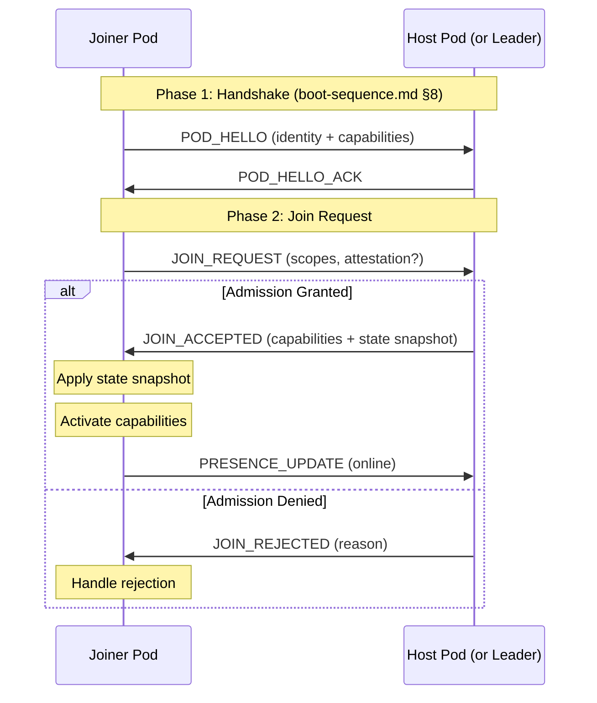

# Join Protocol

Standardized join ritual for pods entering a BrowserMesh session or group.

**Related specs**: [boot-sequence.md](../core/boot-sequence.md) | [identity-keys.md](../crypto/identity-keys.md) | [capability-scope-grammar.md](../crypto/capability-scope-grammar.md) | [presence-protocol.md](presence-protocol.md)

## 1. Overview

When a pod joins an existing group or session, a multi-step join ritual is required: handshake, capability grant, and state delivery. This protocol standardizes the flow that every BrowserMesh application follows.

## 2. Message Types

```typescript
interface JoinRequest {
  type: 'JOIN_REQUEST';
  podId: string;
  kind: PodKind;
  publicKey: Uint8Array;
  requestedScopes?: string[];   // Scopes the joiner wants (see capability-scope-grammar.md)
  attestationProof?: {          // Optional WebAuthn proof
    credentialId: Uint8Array;
    authenticatorData: Uint8Array;
    clientDataHash: Uint8Array;
  };
  timestamp: number;
  signature: Uint8Array;
}

interface JoinAccepted {
  type: 'JOIN_ACCEPTED';
  podId: string;                // Accepting pod's ID
  capabilities: CapabilityToken[];  // Granted capability tokens
  stateSnapshot?: unknown;      // Current state for the joiner
  peers: PeerInfo[];            // List of current peers
  timestamp: number;
  signature: Uint8Array;
}

interface JoinRejected {
  type: 'JOIN_REJECTED';
  podId: string;
  reason: JoinRejectReason;
  retryAfter?: number;          // Milliseconds until retry allowed
  timestamp: number;
  signature: Uint8Array;
}

type JoinRejectReason =
  | 'CAPACITY_FULL'
  | 'ATTESTATION_REQUIRED'
  | 'ATTESTATION_INVALID'
  | 'SCOPE_DENIED'
  | 'POLICY_DENIED'
  | 'BANNED';
```

## 3. Join Sequence



## 4. Admission Policies

The host pod applies an admission policy to each join request.

```typescript
type AdmissionPolicy =
  | 'open'                    // Anyone can join
  | 'approval'                // Host manually approves
  | 'invite'                  // Must present an invite token
  | 'attestation-required';   // Must present WebAuthn attestation

interface AdmissionConfig {
  policy: AdmissionPolicy;
  maxPeers?: number;          // Capacity limit
  requiredScopes?: string[];  // Minimum scopes host requires the joiner to request
  bannedPods?: Set<string>;   // Pod IDs that are banned
}

function evaluateAdmission(
  request: JoinRequest,
  config: AdmissionConfig
): { accepted: boolean; reason?: JoinRejectReason } {
  // Check bans
  if (config.bannedPods?.has(request.podId)) {
    return { accepted: false, reason: 'BANNED' };
  }

  // Check capacity
  if (config.maxPeers !== undefined && currentPeerCount >= config.maxPeers) {
    return { accepted: false, reason: 'CAPACITY_FULL' };
  }

  // Check attestation requirement
  if (config.policy === 'attestation-required' && !request.attestationProof) {
    return { accepted: false, reason: 'ATTESTATION_REQUIRED' };
  }

  // Validate attestation if provided
  if (request.attestationProof) {
    const valid = verifyAttestationProof(request.attestationProof, request.publicKey);
    if (!valid) {
      return { accepted: false, reason: 'ATTESTATION_INVALID' };
    }
  }

  // Policy-specific checks
  if (config.policy === 'invite') {
    // Invite token validation (application-specific)
    return { accepted: false, reason: 'POLICY_DENIED' };
  }

  return { accepted: true };
}
```

## 5. Capability Grant Flow

When a join is accepted, the host grants capability tokens scoped to the joiner's needs.

```typescript
async function grantJoinCapabilities(
  host: PodIdentity,
  capManager: CapabilityManager,
  request: JoinRequest,
  policy: AdmissionConfig
): Promise<CapabilityToken[]> {
  const tokens: CapabilityToken[] = [];

  // Grant requested scopes (filtered by policy)
  const allowedScopes = request.requestedScopes?.filter(
    s => !isReservedScope(s)
  ) ?? [];

  for (const scope of allowedScopes) {
    const token = await capManager.grant(
      `join/${request.podId}`,
      [scope],
      3600000  // 1 hour default TTL
    );
    tokens.push(token);
  }

  return tokens;
}
```

## 6. State Snapshot Delivery

After granting capabilities, the host sends the current state so the joiner can synchronize.

```typescript
interface StateSnapshot {
  /** Application-specific state */
  state: unknown;

  /** Sequence number for ordering */
  sequence: number;

  /** Hash of the state for verification */
  stateHash: Uint8Array;

  /** Timestamp when snapshot was taken */
  timestamp: number;
}

// Host side
async function createSnapshot(appState: unknown): Promise<StateSnapshot> {
  const encoded = cbor.encode(appState);
  return {
    state: appState,
    sequence: currentSequence,
    stateHash: await sha256(encoded),
    timestamp: Date.now(),
  };
}
```

## 7. Attestation-Based Capability Escalation

Pods that present valid WebAuthn attestation can be granted elevated capabilities:

```typescript
async function grantWithEscalation(
  request: JoinRequest,
  capManager: CapabilityManager
): Promise<CapabilityToken[]> {
  const baseScopes = ['data:read', 'data:emit'];
  const elevatedScopes = ['data:write', 'data:delete', 'game:admin'];

  const scopes = request.attestationProof
    ? [...baseScopes, ...elevatedScopes]
    : baseScopes;

  return Promise.all(
    scopes.map(scope =>
      capManager.grant(`join/${request.podId}`, [scope])
    )
  );
}
```

## 8. Re-Join After Disconnect

When a previously connected pod reconnects, the protocol supports expedited re-joining:

```typescript
interface ReJoinRequest extends JoinRequest {
  type: 'JOIN_REQUEST';
  previousSession?: {
    lastSequence: number;      // Last seen sequence number
    stateHash: Uint8Array;     // Hash of last known state
  };
}

// Host checks if re-join is eligible for delta sync
function handleReJoin(request: ReJoinRequest): JoinAccepted {
  if (request.previousSession) {
    const delta = computeStateDelta(
      request.previousSession.lastSequence,
      request.previousSession.stateHash
    );

    if (delta) {
      // Send only the changes since last disconnect
      return {
        type: 'JOIN_ACCEPTED',
        // ... standard fields
        stateSnapshot: delta,
      };
    }
  }

  // Fall back to full state snapshot
  return createFullJoinAccepted(request);
}
```

## 9. Integration

The join protocol is invoked after boot completes (see [boot-sequence.md](../core/boot-sequence.md)):

1. Pod boots and discovers peers (boot phases 0-5)
2. Pod identifies the host/leader (see [leader-election.md](leader-election.md))
3. Pod sends `JOIN_REQUEST` to the host
4. Host evaluates admission and responds
5. On acceptance, pod activates capabilities and joins the presence channel (see [presence-protocol.md](presence-protocol.md))
