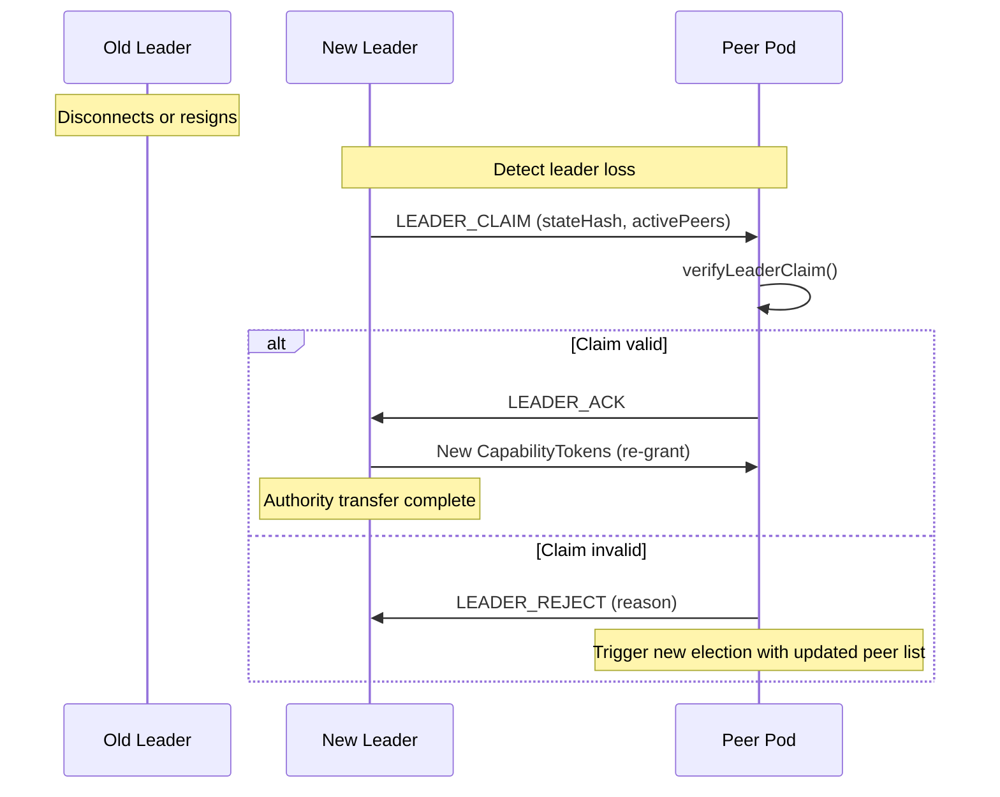

# Leader Election

Deterministic leader election and authority transfer for BrowserMesh pods.

**Related specs**: [boot-sequence.md](../core/boot-sequence.md) | [join-protocol.md](join-protocol.md) | [presence-protocol.md](presence-protocol.md) | [identity-keys.md](../crypto/identity-keys.md)

## 1. Overview

Some BrowserMesh applications need a single authoritative pod (the leader) to coordinate state, assign sequence numbers, or manage join admission. This spec defines a deterministic election algorithm, claim verification, and authority transfer protocol.

## 2. Election Trigger

Leader election is triggered when:

| Event | Description |
|-------|-------------|
| `parent:lost` | The current leader disconnects or shuts down |
| `boot:first` | First pod in the session (self-elects) |
| `leader:resign` | Current leader voluntarily transfers authority |

```typescript
type ElectionTrigger = 'parent:lost' | 'boot:first' | 'leader:resign';
```

## 3. Deterministic Algorithm

The election algorithm is deterministic: all pods produce the same result given the same inputs, with no communication round required.

**Algorithm**: Sort all active pod IDs lexicographically. The **lowest** pod ID wins.

```typescript
/**
 * Determine the leader from a set of active pod IDs.
 * All pods running this algorithm will produce the same result.
 */
function electLeader(activePodIds: string[]): string {
  if (activePodIds.length === 0) {
    throw new Error('Cannot elect leader from empty set');
  }

  // Sort lexicographically — deterministic, no communication needed
  const sorted = [...activePodIds].sort();
  return sorted[0];
}
```

**Why lowest ID?** Pod IDs are derived from Ed25519 public keys via SHA-256, which produces uniformly distributed hashes. Selecting the lowest ID is equivalent to random selection over the key space but is deterministic and requires no randomness or communication rounds.

## 4. LEADER_CLAIM Message

When a pod determines it should be the leader, it broadcasts a `LEADER_CLAIM`:

```typescript
interface LeaderClaim {
  type: 'LEADER_CLAIM';
  podId: string;
  publicKey: Uint8Array;

  /** Hash of the current state (for split-brain detection) */
  stateHash: Uint8Array;

  /** List of pod IDs the claimant sees as active */
  activePeers: string[];

  timestamp: number;
  signature: Uint8Array;  // Ed25519 identity signature
}
```

## 5. Claim Verification

Peers verify the claim before accepting the new leader:

```typescript
async function verifyLeaderClaim(
  claim: LeaderClaim,
  localActivePeers: string[],
  publicKeys: Map<string, CryptoKey>
): Promise<{ valid: boolean; reason?: string }> {
  // 1. Verify signature
  const publicKey = publicKeys.get(claim.podId);
  if (!publicKey) {
    return { valid: false, reason: 'Unknown pod' };
  }

  const payload = cbor.encode({
    type: claim.type,
    podId: claim.podId,
    stateHash: claim.stateHash,
    activePeers: claim.activePeers,
    timestamp: claim.timestamp,
  });

  const sigValid = await PodSigner.verify(publicKey, payload, claim.signature);
  if (!sigValid) {
    return { valid: false, reason: 'Invalid signature' };
  }

  // 2. Verify the claimant would win the election
  const expectedLeader = electLeader(claim.activePeers);
  if (claim.podId !== expectedLeader) {
    return { valid: false, reason: `Expected leader ${expectedLeader}, got ${claim.podId}` };
  }

  // 3. Check for split-brain: compare active peer lists
  const overlap = localActivePeers.filter(id => claim.activePeers.includes(id));
  if (overlap.length < Math.ceil(localActivePeers.length / 2)) {
    return { valid: false, reason: 'Possible split-brain: insufficient peer overlap' };
  }

  return { valid: true };
}
```

## 6. Authority Transfer

When a new leader is elected, it must re-establish authority by re-granting capabilities to existing peers.



```typescript
async function transferAuthority(
  newLeader: PodIdentity,
  capManager: CapabilityManager,
  peers: Map<string, PeerInfo>,
  previousScopes: Map<string, string[]>
): Promise<void> {
  // Re-grant capabilities to all active peers
  for (const [peerId, peerInfo] of peers) {
    const scopes = previousScopes.get(peerId) ?? ['data:read'];

    const tokens = await Promise.all(
      scopes.map(scope =>
        capManager.grant(`leader/${peerId}`, [scope])
      )
    );

    // Send new tokens to peer
    await sendToPeer(peerInfo, {
      type: 'CAPABILITY_GRANT',
      tokens,
      grantedBy: newLeader.podId,
    });
  }
}
```

## 7. Split-Brain Prevention

Split-brain occurs when a network partition causes two pods to both claim leadership. Prevention relies on state hash comparison:

```typescript
/**
 * Compare state hashes to detect divergence.
 * If two leader claims have different stateHashes, a partition has occurred.
 */
function detectSplitBrain(
  claim1: LeaderClaim,
  claim2: LeaderClaim
): boolean {
  return !timingSafeEqual(claim1.stateHash, claim2.stateHash);
}
```

**Resolution**: When a split-brain is detected:
1. The pod with the **lower pod ID** takes precedence (same as election)
2. The losing partition's leader steps down
3. Peers in the losing partition re-join the winning leader via the [join protocol](join-protocol.md)

## 8. Partition Handling

When connectivity between pods is degraded:

| Scenario | Behavior |
|----------|----------|
| Leader loses 1 peer | No election — leader remains |
| Leader loses majority | Leader steps down, remaining peers re-elect |
| Peer loses leader | Peer triggers election among remaining peers |
| Network split | Each partition elects independently; merge resolves via lowest ID |

## 9. Voluntary Transfer

A leader can voluntarily resign and nominate a successor:

```typescript
interface LeaderResign {
  type: 'LEADER_RESIGN';
  podId: string;           // Resigning leader's ID
  successor?: string;      // Nominated successor (optional)
  stateHash: Uint8Array;
  timestamp: number;
  signature: Uint8Array;
}
```

If no successor is nominated, peers run the standard election algorithm. If a successor is nominated, peers verify the nominee would win the election among remaining peers (excluding the resigner).

## 10. Join Protocol Integration

The leader is the default admission controller for the [join protocol](join-protocol.md):

1. New pod discovers peers via boot sequence
2. New pod identifies the leader (lowest active pod ID or from peer announcements)
3. New pod sends `JOIN_REQUEST` to the leader
4. Leader evaluates admission and responds with `JOIN_ACCEPTED` or `JOIN_REJECTED`

The leader role is advertised in presence metadata:

```typescript
// Leader includes role in presence updates
presence.setState('online', { role: 'leader' });
```

## Implementation Status

**Status**: Leader election is implemented inside SwarmCoordinator as part of swarm lifecycle. Uses highest-podId tie-breaking. Wired to app bootstrap.

**Source**: `web/clawser-mesh-swarm.js`
