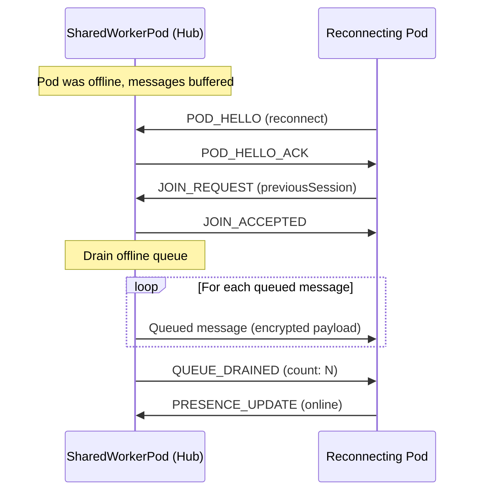

# Offline Queue

Message buffering for disconnected peers in BrowserMesh.

**Related specs**: [presence-protocol.md](presence-protocol.md) | [channel-abstraction.md](../networking/channel-abstraction.md) | [wire-format.md](../core/wire-format.md)

## 1. Overview

When a peer disconnects, messages destined for that peer must be buffered until reconnection. The `OfflineQueue` provides per-peer message queues with configurable limits, TTL, and batch delivery on reconnection. SharedWorkerPods are natural hosts for offline queues because they outlive individual tabs.

## 2. OfflineQueue Class

```typescript
interface QueuedMessage {
  id: string;                  // Message ID
  targetPodId: string;         // Intended recipient
  payload: Uint8Array;         // Opaque encrypted payload
  enqueuedAt: number;          // Timestamp when queued
  ttl: number;                 // Time-to-live (ms from enqueuedAt)
}

interface OfflineQueueConfig {
  maxMessagesPerPeer: number;  // Default: 500
  maxTotalMessages: number;    // Default: 5000
  defaultTTL: number;          // Default: 300000 (5 minutes)
  evictionPolicy: 'fifo';     // Evict oldest when full
}

const DEFAULT_CONFIG: OfflineQueueConfig = {
  maxMessagesPerPeer: 500,
  maxTotalMessages: 5000,
  defaultTTL: 300000,
  evictionPolicy: 'fifo',
};

class OfflineQueue {
  private queues: Map<string, QueuedMessage[]> = new Map();
  private totalCount = 0;
  private config: OfflineQueueConfig;

  constructor(config: Partial<OfflineQueueConfig> = {}) {
    this.config = { ...DEFAULT_CONFIG, ...config };
  }

  /**
   * Enqueue a message for a disconnected peer.
   * The payload should already be encrypted — the queue stores opaque blobs.
   */
  enqueue(targetPodId: string, payload: Uint8Array, ttl?: number): boolean {
    // Clean expired messages first
    this.pruneExpired();

    let queue = this.queues.get(targetPodId);
    if (!queue) {
      queue = [];
      this.queues.set(targetPodId, queue);
    }

    // Evict oldest if per-peer limit reached
    while (queue.length >= this.config.maxMessagesPerPeer) {
      queue.shift();
      this.totalCount--;
    }

    // Evict oldest across all peers if total limit reached
    while (this.totalCount >= this.config.maxTotalMessages) {
      this.evictOldest();
    }

    const message: QueuedMessage = {
      id: crypto.randomUUID(),
      targetPodId,
      payload,
      enqueuedAt: Date.now(),
      ttl: ttl ?? this.config.defaultTTL,
    };

    queue.push(message);
    this.totalCount++;
    return true;
  }

  /**
   * Drain all queued messages for a peer (on reconnection).
   * Returns messages in FIFO order and removes them from the queue.
   */
  drain(targetPodId: string): QueuedMessage[] {
    this.pruneExpired();

    const queue = this.queues.get(targetPodId);
    if (!queue || queue.length === 0) return [];

    const messages = [...queue];
    this.totalCount -= queue.length;
    this.queues.delete(targetPodId);
    return messages;
  }

  /**
   * Peek at queued message count for a peer without draining.
   */
  pendingCount(targetPodId: string): number {
    return this.queues.get(targetPodId)?.length ?? 0;
  }

  /**
   * Total messages across all peers.
   */
  get size(): number {
    return this.totalCount;
  }

  /** Remove expired messages across all queues */
  private pruneExpired(): void {
    const now = Date.now();
    for (const [peerId, queue] of this.queues) {
      const before = queue.length;
      const filtered = queue.filter(m => (m.enqueuedAt + m.ttl) > now);
      if (filtered.length !== before) {
        this.totalCount -= (before - filtered.length);
        if (filtered.length === 0) {
          this.queues.delete(peerId);
        } else {
          this.queues.set(peerId, filtered);
        }
      }
    }
  }

  /** Evict the single oldest message across all peers */
  private evictOldest(): void {
    let oldestTime = Infinity;
    let oldestPeerId: string | null = null;

    for (const [peerId, queue] of this.queues) {
      if (queue.length > 0 && queue[0].enqueuedAt < oldestTime) {
        oldestTime = queue[0].enqueuedAt;
        oldestPeerId = peerId;
      }
    }

    if (oldestPeerId) {
      const queue = this.queues.get(oldestPeerId)!;
      queue.shift();
      this.totalCount--;
      if (queue.length === 0) {
        this.queues.delete(oldestPeerId);
      }
    }
  }

  /** Clear all queues */
  clear(): void {
    this.queues.clear();
    this.totalCount = 0;
  }
}
```

## 3. Limits

| Parameter | Default | Description |
|-----------|---------|-------------|
| Max messages per peer | 500 | FIFO eviction when exceeded |
| Max total messages | 5,000 | Global cap across all peers |
| Default TTL | 5 minutes | Messages expire after this |
| Eviction policy | FIFO | Oldest messages evicted first |

## 4. Connection State Detection

The offline queue integrates with presence (see [presence-protocol.md](presence-protocol.md)) to detect when a peer goes offline and comes back.

```typescript
class OfflineQueueManager {
  private queue: OfflineQueue;
  private presence: PresenceManager;

  constructor(queue: OfflineQueue, presence: PresenceManager) {
    this.queue = queue;
    this.presence = presence;
  }

  /**
   * Send a message — buffer if peer is offline, deliver if online.
   */
  async sendOrQueue(
    targetPodId: string,
    payload: Uint8Array,
    channel?: PodChannel
  ): Promise<'sent' | 'queued'> {
    const peer = this.presence.getPeers().get(targetPodId);

    if (peer && peer.state !== 'offline' && channel?.state === 'open') {
      channel.send(payload);
      return 'sent';
    }

    this.queue.enqueue(targetPodId, payload);
    return 'queued';
  }

  /**
   * Called when a peer reconnects — deliver all buffered messages.
   */
  async deliverQueued(targetPodId: string, channel: PodChannel): Promise<number> {
    const messages = this.queue.drain(targetPodId);

    for (const msg of messages) {
      channel.send(msg.payload);
    }

    return messages.length;
  }
}
```

## 5. Reconnection Batch Delivery

When a peer reconnects, queued messages are delivered in batch:



## 6. Encryption Note

The offline queue stores **opaque encrypted blobs**. Messages are encrypted by the sender using the session key (see [session-keys.md](../crypto/session-keys.md)) before being queued. The hub (typically a SharedWorkerPod) cannot read the contents — it only stores and forwards.

If the session key has rotated during the offline period, the sender must re-encrypt queued messages with the new session key before delivery, or the receiver must retain the previous session key for the grace period (see [session-keys.md](../crypto/session-keys.md) §9.1).

## 7. Presence Integration

The offline queue listens for presence transitions to trigger drain:

```typescript
// When presence changes, check if we should drain
presence.on('peer:online', (peerId: string) => {
  const pending = queue.pendingCount(peerId);
  if (pending > 0) {
    const channel = sessionManager.getChannel(peerId);
    if (channel) {
      offlineManager.deliverQueued(peerId, channel);
    }
  }
});
```
