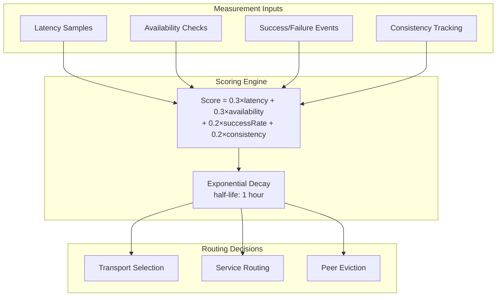

# Peer Reputation

Peer quality scoring for informed transport selection and routing decisions.

**Related specs**: [transport-probing.md](../networking/transport-probing.md) | [wire-format.md](../core/wire-format.md) | [identity-keys.md](../crypto/identity-keys.md) | [service-model.md](service-model.md) | [presence-protocol.md](presence-protocol.md)

## 1. Overview

Transport selection and routing in BrowserMesh are uninformed by peer quality. A peer with 50% packet loss is treated the same as a peer with perfect connectivity. This spec adds:

- Per-peer reputation scoring based on latency, availability, and success rate
- Exponential decay for time-weighted freshness
- Ed25519-signed reputation reports for verifiable peer feedback
- Integration with transport-probing for preference weighting
- Local-first storage with opt-in sharing



## 2. Wire Format Messages

Reputation messages use type codes 0x53-0x55 in the Presence block.

```typescript
enum ReputationMessageType {
  REPUTATION_REQUEST  = 0x53,
  REPUTATION_RESPONSE = 0x54,
  REPUTATION_REPORT   = 0x55,
}
```

### 2.1 REPUTATION_REQUEST (0x53)

Query a peer's reputation from another node.

```typescript
interface ReputationRequestMessage {
  t: 0x53;
  p: {
    targetPodId: string;   // Pod ID to query reputation for
  };
}
```

### 2.2 REPUTATION_RESPONSE (0x54)

Response with reputation data for a peer.

```typescript
interface ReputationResponseMessage {
  t: 0x54;
  p: {
    peerId: string;
    score: number;           // 0.0 - 1.0
    latencyAvg: number;      // Average RTT in ms
    availability: number;    // 0.0 - 1.0 (uptime ratio)
    successRate: number;     // 0.0 - 1.0 (successful requests ratio)
    sampleCount: number;     // Number of observations
    lastUpdated: number;     // Timestamp
  };
}
```

### 2.3 REPUTATION_REPORT (0x55)

Submit a signed reputation observation about a peer.

```typescript
interface ReputationReportMessage {
  t: 0x55;
  p: {
    peerId: string;          // Peer being reported on
    event: ReputationEvent;
    evidence?: Uint8Array;   // Optional proof (e.g., failed message hash)
    signature: Uint8Array;   // Ed25519 signature of the report
    reporterId: string;      // Pod ID of the reporter
    timestamp: number;
  };
}

type ReputationEvent =
  | 'request-success'
  | 'request-failure'
  | 'request-timeout'
  | 'connection-drop'
  | 'latency-spike'
  | 'data-corruption';
```

## 3. PeerReputation

```typescript
interface PeerReputation {
  /** Pod ID of the peer */
  peerId: string;

  /** Overall score (0.0 - 1.0, higher is better) */
  score: number;

  /** Average round-trip time (ms) */
  latencyAvg: number;

  /** Availability ratio (0.0 - 1.0) */
  availability: number;

  /** Request success ratio (0.0 - 1.0) */
  successRate: number;

  /** Response consistency (0.0 - 1.0) */
  consistency: number;

  /** Number of observations */
  sampleCount: number;

  /** Last update timestamp */
  lastUpdated: number;

  /** Raw latency samples (ring buffer) */
  latencySamples: number[];

  /** Success/failure counters */
  successes: number;
  failures: number;

  /** Availability check results */
  availabilityChecks: number;
  availabilityHits: number;
}
```

## 4. ReputationManager

```typescript
class ReputationManager {
  private reputations: Map<string, PeerReputation> = new Map();
  private readonly decayHalfLife: number;
  private readonly maxLatencySamples = 100;

  constructor(options: { decayHalfLife?: number } = {}) {
    this.decayHalfLife = options.decayHalfLife ?? 3_600_000; // 1 hour
  }

  /** Record a successful interaction */
  trackSuccess(peerId: string, latencyMs: number): void {
    const rep = this.getOrCreate(peerId);
    rep.successes++;
    rep.sampleCount++;
    rep.latencySamples.push(latencyMs);
    if (rep.latencySamples.length > this.maxLatencySamples) {
      rep.latencySamples.shift();
    }
    this.recalculate(rep);
  }

  /** Record a failed interaction */
  trackFailure(peerId: string): void {
    const rep = this.getOrCreate(peerId);
    rep.failures++;
    rep.sampleCount++;
    this.recalculate(rep);
  }

  /** Record an availability check */
  trackAvailability(peerId: string, available: boolean): void {
    const rep = this.getOrCreate(peerId);
    rep.availabilityChecks++;
    if (available) rep.availabilityHits++;
    this.recalculate(rep);
  }

  /** Query reputation for a peer */
  query(peerId: string): PeerReputation | null {
    const rep = this.reputations.get(peerId);
    if (!rep) return null;

    // Apply decay before returning
    this.applyDecay(rep);
    return { ...rep };
  }

  /** Apply exponential decay to all reputations */
  decayAll(): void {
    for (const rep of this.reputations.values()) {
      this.applyDecay(rep);
    }
  }

  /** Submit a signed report about a peer */
  async report(
    peerId: string,
    event: ReputationEvent,
    identity: PodIdentity
  ): Promise<ReputationReportMessage> {
    const reportData = {
      peerId,
      event,
      reporterId: identity.id,
      timestamp: Date.now(),
    };

    const signature = await sign(identity.privateKey, encode(reportData));

    return {
      t: ReputationMessageType.REPUTATION_REPORT,
      p: {
        ...reportData,
        signature,
      },
    };
  }

  private getOrCreate(peerId: string): PeerReputation {
    let rep = this.reputations.get(peerId);
    if (!rep) {
      rep = {
        peerId,
        score: 0.5, // Neutral starting score
        latencyAvg: 0,
        availability: 1.0,
        successRate: 1.0,
        consistency: 1.0,
        sampleCount: 0,
        lastUpdated: Date.now(),
        latencySamples: [],
        successes: 0,
        failures: 0,
        availabilityChecks: 0,
        availabilityHits: 0,
      };
      this.reputations.set(peerId, rep);
    }
    return rep;
  }

  private recalculate(rep: PeerReputation): void {
    // Latency score: normalized (lower is better)
    if (rep.latencySamples.length > 0) {
      rep.latencyAvg = rep.latencySamples.reduce((a, b) => a + b, 0)
        / rep.latencySamples.length;
    }
    const latencyScore = Math.max(0, 1 - (rep.latencyAvg / 5000));

    // Availability score
    rep.availability = rep.availabilityChecks > 0
      ? rep.availabilityHits / rep.availabilityChecks
      : 1.0;

    // Success rate
    const total = rep.successes + rep.failures;
    rep.successRate = total > 0 ? rep.successes / total : 1.0;

    // Consistency: standard deviation of latency samples
    if (rep.latencySamples.length > 1) {
      const mean = rep.latencyAvg;
      const variance = rep.latencySamples.reduce(
        (sum, s) => sum + (s - mean) ** 2, 0
      ) / rep.latencySamples.length;
      const stdDev = Math.sqrt(variance);
      rep.consistency = Math.max(0, 1 - (stdDev / mean));
    }

    // Weighted score
    rep.score =
      0.3 * latencyScore +
      0.3 * rep.availability +
      0.2 * rep.successRate +
      0.2 * rep.consistency;

    rep.lastUpdated = Date.now();
  }

  private applyDecay(rep: PeerReputation): void {
    const age = Date.now() - rep.lastUpdated;
    const decayFactor = Math.pow(0.5, age / this.decayHalfLife);

    // Decay score toward neutral (0.5)
    rep.score = 0.5 + (rep.score - 0.5) * decayFactor;
  }
}
```

## 5. Scoring Formula

```
score = 0.3 × latencyScore + 0.3 × availability + 0.2 × successRate + 0.2 × consistency
```

| Component | Weight | Range | Description |
|-----------|--------|-------|-------------|
| Latency | 0.3 | 0-1 | `max(0, 1 - avgLatency/5000)` |
| Availability | 0.3 | 0-1 | `availabilityHits / availabilityChecks` |
| Success Rate | 0.2 | 0-1 | `successes / (successes + failures)` |
| Consistency | 0.2 | 0-1 | `max(0, 1 - stdDev/mean)` of latency |

### Decay Function

Scores decay toward neutral (0.5) over time using exponential decay:

```
decayed_score = 0.5 + (score - 0.5) × 0.5^(age / halfLife)
```

Default half-life: 1 hour. After 1 hour with no observations, a score of 0.9 decays to 0.7; after 2 hours, to 0.6.

## 6. Integration with Transport Probing

[transport-probing.md](../networking/transport-probing.md) selects transports based on capability and availability. Reputation adds a quality preference:

```typescript
function selectTransportWithReputation(
  candidates: TransportCandidate[],
  reputationManager: ReputationManager
): TransportCandidate {
  return candidates
    .map(candidate => {
      const rep = reputationManager.query(candidate.peerId);
      const reputationBoost = rep ? rep.score : 0.5;
      return {
        ...candidate,
        adjustedPriority: candidate.basePriority * reputationBoost,
      };
    })
    .sort((a, b) => b.adjustedPriority - a.adjustedPriority)[0];
}
```

## 7. Anti-Gaming Protections

### 7.1 Signed Reports

All reputation reports are Ed25519-signed by the reporter, preventing forgery:

```typescript
async function verifyReport(
  report: ReputationReportMessage,
  publicKeyOf: (podId: string) => Promise<Uint8Array>
): Promise<boolean> {
  const publicKey = await publicKeyOf(report.p.reporterId);
  const data = encode({
    peerId: report.p.peerId,
    event: report.p.event,
    reporterId: report.p.reporterId,
    timestamp: report.p.timestamp,
  });
  return verify(publicKey, report.p.signature, data);
}
```

### 7.2 Rate Limiting

```typescript
const REPORT_LIMITS = {
  /** Max reports per peer per hour */
  maxReportsPerPeerPerHour: 10,

  /** Max total reports per hour */
  maxTotalReportsPerHour: 100,

  /** Min time between reports for same peer (ms) */
  minReportInterval: 60_000,
};
```

### 7.3 Sybil Resistance

- Reports from new peers (< 10 observations) are weighted at 50%
- A single reporter can shift a score by at most 0.1 per hour
- Reputation queries return sample count so consumers can assess confidence

## 8. Privacy

Reputation data is **local-only by default**. Each pod maintains its own scores based on its direct observations:

| Mode | Behavior |
|------|----------|
| Local (default) | Score based only on direct observations |
| Shared (opt-in) | Respond to REPUTATION_REQUEST from peers |
| Report (opt-in) | Send REPUTATION_REPORT to the network |

```typescript
interface ReputationConfig {
  /** Share reputation scores when queried */
  shareScores: boolean;

  /** Submit reputation reports to the network */
  submitReports: boolean;

  /** Accept and weight remote reputation data */
  acceptRemoteWeight: number;  // 0.0 - 1.0 (default: 0.0)
}

const DEFAULT_REPUTATION_CONFIG: ReputationConfig = {
  shareScores: false,
  submitReports: false,
  acceptRemoteWeight: 0.0,
};
```

## 9. Limits

| Resource | Limit |
|----------|-------|
| Max tracked peers | 1024 |
| Latency sample buffer | 100 per peer |
| Decay half-life (default) | 1 hour |
| Score range | 0.0 - 1.0 |
| Initial score (neutral) | 0.5 |
| Reports per peer per hour | 10 |
| Reports total per hour | 100 |
| Min report interval | 60 seconds |
| Max score shift per reporter per hour | 0.1 |
| New peer weight discount | 50% (< 10 observations) |
