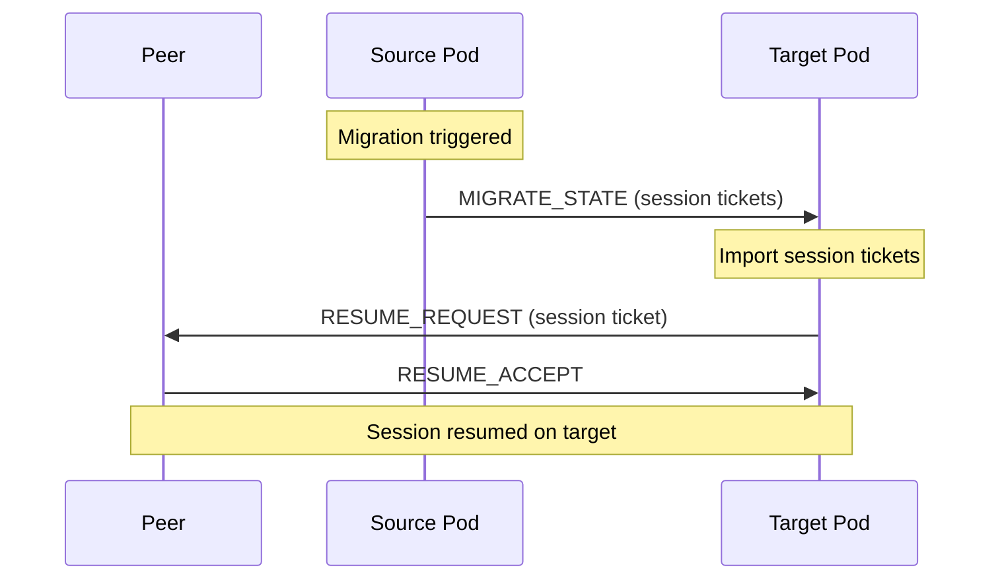

# Pod Migration

Moving pod state between execution contexts in BrowserMesh.

**Related specs**: [pod-types.md](../core/pod-types.md) | [boot-sequence.md](../core/boot-sequence.md) | [session-keys.md](../crypto/session-keys.md) | [streaming-protocol.md](../networking/streaming-protocol.md) | [leader-election.md](leader-election.md) | [wire-format.md](../core/wire-format.md)

## 1. Overview

Pods may need to move between execution contexts:

- Tab about to unload → migrate to SharedWorker
- Worker running out of memory → migrate to a new worker
- Rebalancing workload across pods
- Upgrading pod code without downtime

This spec defines the state transfer protocol, session handoff, and zero-downtime migration window.

## 2. Migration Triggers

| Trigger | Source | Target | Urgency |
|---------|--------|--------|---------|
| Tab unload (`beforeunload`) | WindowPod | SharedWorkerPod | High |
| Worker OOM | WorkerPod | New WorkerPod | High |
| Code upgrade | Any | Same kind (new version) | Low |
| Load rebalancing | Any | Any | Low |
| Manual (mesh-ctl) | Any | Any | Low |

## 3. Migration State Machine

```mermaid
stateDiagram-v2
    [*] --> IDLE
    IDLE --> PREPARING: MIGRATE_PREPARE sent
    PREPARING --> TRANSFERRING: Source ready, begin state transfer
    TRANSFERRING --> VERIFYING: State received, verifying integrity
    VERIFYING --> DUAL_ACTIVE: Verification passed
    DUAL_ACTIVE --> COMPLETE: Traffic drained from source
    VERIFYING --> ABORTING: Verification failed
    PREPARING --> ABORTING: Source not ready / timeout
    ABORTING --> IDLE: Rollback complete

    note right of DUAL_ACTIVE: Both pods active; new pod handles new requests
    note right of ABORTING: Source resumes full responsibility
```



```typescript
type MigrationState =
  | 'IDLE'
  | 'PREPARING'
  | 'TRANSFERRING'
  | 'VERIFYING'
  | 'DUAL_ACTIVE'
  | 'COMPLETE'
  | 'ABORTING';

interface MigrationContext {
  migrationId: string;
  state: MigrationState;
  sourcePodId: string;
  targetPodId: string;
  reason: string;
  startedAt: number;
  stateSize?: number;
  checksum?: Uint8Array;
}
```

## 4. Wire Format Messages

Migration messages use type codes 0xB0-0xB3 in the Migration (0xB*) block.

```typescript
enum MigrationMessageType {
  MIGRATE_PREPARE  = 0xB0,
  MIGRATE_STATE    = 0xB1,
  MIGRATE_COMPLETE = 0xB2,
  MIGRATE_ABORT    = 0xB3,
}
```

### 4.1 MIGRATE_PREPARE (0xB0)

Initiates migration. Sent by the source pod or by the leader on behalf of the source.

```typescript
interface MigratePrepareMessage extends MessageEnvelope {
  t: 0xB0;
  p: {
    migrationId: string;
    sourcePodId: Uint8Array;
    targetPodId: Uint8Array;
    reason: string;
    estimatedStateSize: number;   // Bytes
    capabilities: string[];       // Capabilities to transfer
    urgent: boolean;              // True for beforeunload migrations
  };
}
```

### 4.2 MIGRATE_STATE (0xB1)

Carries the serialized pod state. For large states, this is sent as a stream (see [streaming-protocol.md](../networking/streaming-protocol.md)).

```typescript
interface MigrateStateMessage extends MessageEnvelope {
  t: 0xB1;
  p: {
    migrationId: string;
    snapshot: Uint8Array;         // CBOR-encoded state snapshot
    checksum: Uint8Array;         // SHA-256 of snapshot
    sessionHandoffs: SessionHandoff[];
    subscriptions: string[];      // Active pub/sub subscriptions
    pendingRequests: PendingRequest[];
  };
}

interface SessionHandoff {
  peerId: Uint8Array;            // Remote peer pod ID
  sessionTicket: Uint8Array;     // Encrypted session resumption ticket
}

interface PendingRequest {
  requestId: Uint8Array;
  method: string;
  timeout: number;
  remainingMs: number;
}
```

### 4.3 MIGRATE_COMPLETE (0xB2)

```typescript
interface MigrateCompleteMessage extends MessageEnvelope {
  t: 0xB2;
  p: {
    migrationId: string;
    newPodId: Uint8Array;         // Target pod's ID (may differ from source)
    success: boolean;
  };
}
```

### 4.4 MIGRATE_ABORT (0xB3)

```typescript
interface MigrateAbortMessage extends MessageEnvelope {
  t: 0xB3;
  p: {
    migrationId: string;
    reason: string;
    sourceResuming: boolean;      // True if source pod resumes normal operation
  };
}
```

## 5. State Serialization

Pod state is serialized as a CBOR snapshot:

```typescript
interface PodStateSnapshot {
  // Identity
  podId: Uint8Array;
  kind: string;
  capabilities: string[];

  // Application state
  appState: Uint8Array;          // Opaque CBOR blob from application

  // Session state
  activeSessions: SerializedSession[];

  // Coordination state
  presence: {
    state: string;
    metadata: Record<string, unknown>;
  };
  subscriptions: SerializedSubscription[];

  // Metadata
  snapshotVersion: number;
  createdAt: number;
}

function serializePodState(pod: PodRuntime): Uint8Array {
  const snapshot: PodStateSnapshot = {
    podId: pod.id,
    kind: pod.kind,
    capabilities: [...pod.capabilities],
    appState: pod.getApplicationState(),
    activeSessions: pod.sessions.map(serializeSession),
    presence: pod.presence.getState(),
    subscriptions: pod.subscriptions.map(serializeSubscription),
    snapshotVersion: 1,
    createdAt: Date.now(),
  };

  return cbor.encode(snapshot);
}
```

## 6. Session Handoff

Active sessions are transferred using session tickets (see [session-resumption.md](../networking/session-resumption.md)):

1. Source pod creates session tickets for all active sessions
2. Tickets are included in MIGRATE_STATE
3. Target pod uses tickets to resume sessions with peers
4. Peers see a brief connection hiccup but no full re-handshake



## 7. Capability Re-Grant

After migration, the leader must re-grant capabilities to the target pod:

```typescript
async function regrateCapabilities(
  leader: LeaderContext,
  migrationCtx: MigrationContext,
  capabilities: string[]
): Promise<void> {
  // Revoke capabilities from source
  await leader.revokeCapabilities(migrationCtx.sourcePodId, capabilities);

  // Grant same capabilities to target
  await leader.grantCapabilities(migrationCtx.targetPodId, capabilities);
}
```

## 8. Zero-Downtime Dual-Active Window

During the DUAL_ACTIVE phase, both source and target pods are operational:

1. **New requests** are routed to the target pod
2. **In-flight requests** continue on the source pod
3. The source pod drains its request queue
4. Once the source has no pending requests, it shuts down

```typescript
const MIGRATION_DEFAULTS = {
  prepareTimeout: 5_000,        // 5 seconds to prepare
  transferTimeout: 30_000,      // 30 seconds for state transfer
  dualActiveWindow: 10_000,     // 10 seconds max dual-active
  urgentTimeout: 1_000,         // 1 second for beforeunload
};
```

### Urgent Migration (beforeunload)

When a tab is about to unload, the migration must complete within the browser's `beforeunload` budget (~1-2 seconds):

1. Skip PREPARING phase — immediately serialize and send
2. Use synchronous CBOR encoding if possible
3. State size limited to what can transfer in ~500ms
4. If state is too large, send critical state only and accept partial loss

## 9. Rollback on Failure

If migration fails at any point:

1. Target pod sends MIGRATE_ABORT
2. Source pod resumes full responsibility
3. Peers are notified to route back to source
4. Any partially transferred state on target is discarded

```typescript
async function rollbackMigration(ctx: MigrationContext): Promise<void> {
  ctx.state = 'ABORTING';

  // Notify all peers to route back to source
  // Clean up partial state on target
  // Resume source pod's normal operation

  ctx.state = 'IDLE';
}
```

## 10. Limits

| Resource | Limit |
|----------|-------|
| Max state snapshot size | 4 MB |
| Max session handoffs | 64 |
| Prepare timeout | 5 seconds |
| Transfer timeout | 30 seconds |
| Dual-active window | 10 seconds |
| Urgent migration budget | 1 second |
