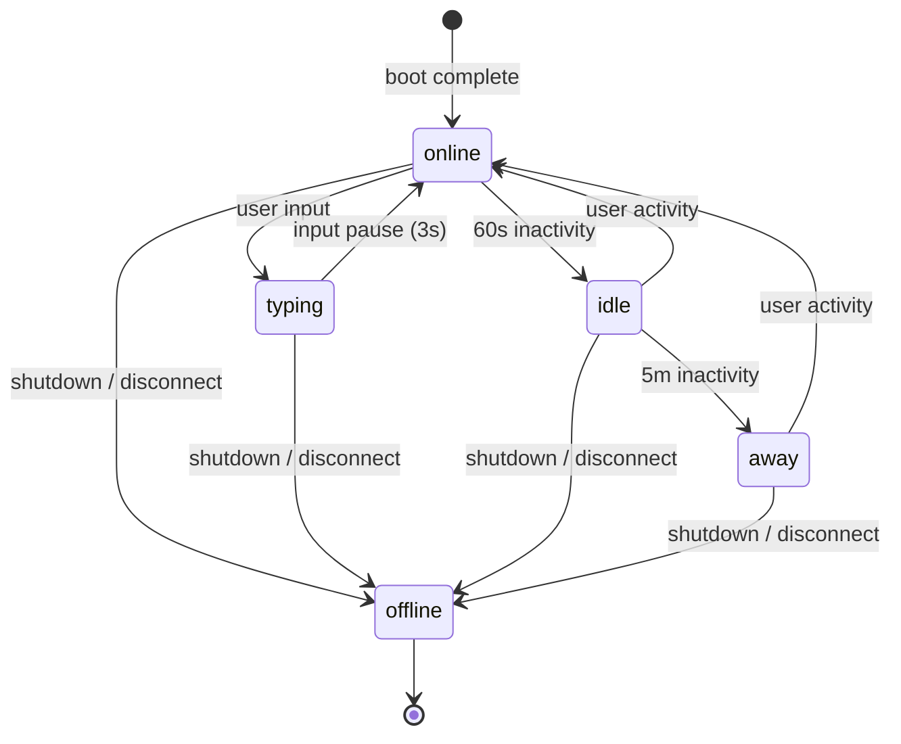

# Presence Protocol

Real-time presence state for BrowserMesh pods.

**Related specs**: [boot-sequence.md](../core/boot-sequence.md) | [wire-format.md](../core/wire-format.md) | [channel-abstraction.md](../networking/channel-abstraction.md)

## 1. Overview

The presence protocol tracks which pods are active and what they are doing. It uses BroadcastChannel for same-origin transport and the wire-format presence message types (0x50-0x52) for cross-origin communication.

## 2. Presence States



```typescript
type PresenceState = 'online' | 'typing' | 'idle' | 'away' | 'offline';

interface PresenceInfo {
  podId: string;
  state: PresenceState;
  lastSeen: number;         // Timestamp of last update
  metadata?: Record<string, unknown>;  // App-specific (cursor pos, activity, etc.)
}
```

### State Transition Timeouts

| From | To | Trigger |
|------|----|---------|
| `online` → `typing` | User keyboard/input event | Immediate |
| `typing` → `online` | No input for 3 seconds | Timer |
| `online` → `idle` | No activity for 60 seconds | Timer |
| `idle` → `away` | No activity for 5 minutes | Timer |
| `*` → `online` | User activity detected | Immediate |
| `*` → `offline` | Shutdown or missed heartbeats | Immediate / timeout |

## 3. BroadcastChannel Transport

For same-origin pods, presence is exchanged over a dedicated BroadcastChannel.

```typescript
const PRESENCE_CHANNEL_PREFIX = 'pod:presence:';

class PresenceManager {
  private channel: BroadcastChannel;
  private peers: Map<string, PresenceInfo> = new Map();
  private heartbeatInterval: number;
  private state: PresenceState = 'online';
  private activityTimer: number | null = null;

  constructor(
    private podId: string,
    private scope: string = 'default',
    private heartbeatMs: number = 30000
  ) {
    this.channel = new BroadcastChannel(`${PRESENCE_CHANNEL_PREFIX}${scope}`);
    this.channel.onmessage = (e) => this.handleMessage(e.data);

    // Start heartbeat
    this.heartbeatInterval = setInterval(() => this.sendHeartbeat(), this.heartbeatMs);

    // Announce initial presence
    this.broadcast('online');
  }

  /** Update local presence state */
  setState(state: PresenceState, metadata?: Record<string, unknown>): void {
    this.state = state;
    this.broadcast(state, metadata);
  }

  /** Get all known peers and their states */
  getPeers(): Map<string, PresenceInfo> {
    this.pruneStale();
    return new Map(this.peers);
  }

  private broadcast(state: PresenceState, metadata?: Record<string, unknown>): void {
    this.channel.postMessage({
      type: 'PRESENCE_UPDATE',
      podId: this.podId,
      state,
      timestamp: Date.now(),
      metadata,
    });
  }

  private sendHeartbeat(): void {
    this.broadcast(this.state);
  }

  private handleMessage(data: unknown): void {
    if (!isPresenceMessage(data)) return;
    const msg = data as { type: string; podId: string; state: PresenceState; timestamp: number; metadata?: Record<string, unknown> };

    if (msg.podId === this.podId) return; // Ignore self

    this.peers.set(msg.podId, {
      podId: msg.podId,
      state: msg.state,
      lastSeen: msg.timestamp,
      metadata: msg.metadata,
    });
  }

  /** Remove peers that haven't sent a heartbeat within 3× interval */
  private pruneStale(): void {
    const staleThreshold = Date.now() - (this.heartbeatMs * 3);
    for (const [id, info] of this.peers) {
      if (info.lastSeen < staleThreshold) {
        this.peers.delete(id);
      }
    }
  }

  /** Shutdown presence — notify peers and clean up */
  shutdown(): void {
    this.broadcast('offline');
    clearInterval(this.heartbeatInterval);
    this.channel.close();
  }
}

function isPresenceMessage(data: unknown): boolean {
  if (typeof data !== 'object' || data === null) return false;
  const msg = data as Record<string, unknown>;
  return msg.type === 'PRESENCE_UPDATE' &&
         typeof msg.podId === 'string' &&
         typeof msg.state === 'string' &&
         typeof msg.timestamp === 'number';
}
```

## 4. Heartbeat Protocol

Pods send periodic heartbeats to signal liveness:

| Parameter | Default | Description |
|-----------|---------|-------------|
| Heartbeat interval | 30 seconds | Time between heartbeats |
| Stale threshold | 90 seconds (3×) | Time before a peer is considered offline |
| Channel name | `pod:presence:{scope}` | BroadcastChannel name |

A peer is considered `offline` if no heartbeat has been received within the stale threshold. Implementations **should not** immediately remove stale peers — instead, mark them as `offline` and retain their info for potential reconnection.

## 5. Privacy Considerations

Presence metadata can leak sensitive information. Implementations **should**:

1. **Minimize metadata** — Only include what the application requires
2. **Scope channels narrowly** — Use application-specific scope strings (e.g., `pod:presence:chat-room-42`) rather than a single global channel
3. **No PII in metadata** — Never include personally identifiable information in presence updates
4. **Respect visibility** — Pods in hidden tabs should transition to `idle` or `away`, not broadcast `online`

## 6. Boot/Shutdown Integration

Presence integrates with the pod lifecycle (see [boot-sequence.md](../core/boot-sequence.md)):

```typescript
// During boot (Phase 5 — role finalization)
pod.on('ready', () => {
  presence = new PresenceManager(pod.info.id, appScope);
});

// During shutdown
pod.on('shutdown', () => {
  presence?.shutdown();
});

// Visibility changes
document.addEventListener('visibilitychange', () => {
  if (document.visibilityState === 'hidden') {
    presence?.setState('idle');
  } else {
    presence?.setState('online');
  }
});
```

## Implementation Status

**Status**: Presence behavior exists in PeerNode heartbeat mechanism and DiscoveryManager TTL-based pruning. No standalone presence service — presence is implicit in discovery records.

**Source**: `web/clawser-peer-node.js`, `web/clawser-mesh-discovery.js`
