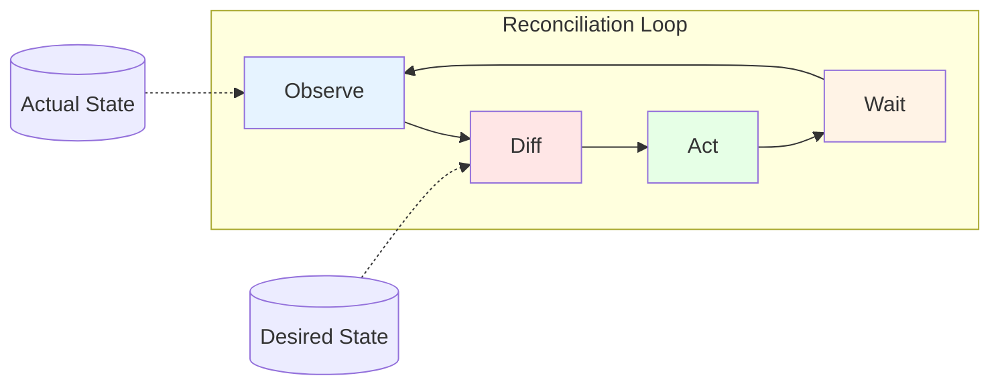
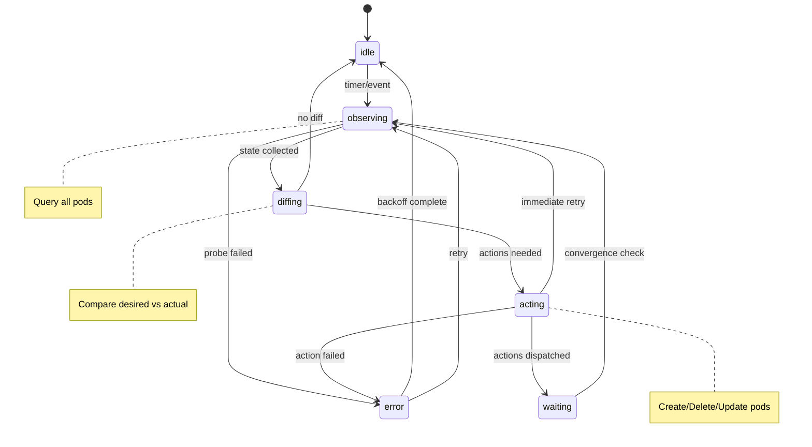

# Reconciliation Loop

The Service Worker reconciliation loop continuously drives actual state toward desired state.

**Related specs**: [manifest-format.md](../reference/manifest-format.md) | [pod-types.md](../core/pod-types.md) | [service-model.md](service-model.md)

## 1. Core Loop





## 2. State Machine

```typescript
type ReconcilerState =
  | 'idle'
  | 'observing'
  | 'diffing'
  | 'acting'
  | 'waiting'
  | 'error';

interface ReconcilerContext {
  state: ReconcilerState;
  desired: DesiredState;
  actual: ActualState;
  pendingActions: Action[];
  lastReconcile: number;
  errorCount: number;
}

// State transitions
const transitions: Record<ReconcilerState, ReconcilerState[]> = {
  idle: ['observing'],
  observing: ['diffing', 'error'],
  diffing: ['acting', 'idle'],  // idle if no diff
  acting: ['waiting', 'observing', 'error'],
  waiting: ['observing'],
  error: ['idle', 'observing'],
};
```

## 3. Reconciler Implementation

```typescript
class Reconciler {
  private state: ReconcilerState = 'idle';
  private desired: Map<string, Manifest> = new Map();
  private actual: Map<string, PodStatus> = new Map();
  private interval: number = 5000;  // 5 seconds

  async start(): Promise<void> {
    while (true) {
      try {
        await this.reconcile();
      } catch (error) {
        this.handleError(error);
      }
      await this.wait();
    }
  }

  private async reconcile(): Promise<void> {
    // Phase 1: Observe
    this.state = 'observing';
    const actualState = await this.observe();

    // Phase 2: Diff
    this.state = 'diffing';
    const actions = this.diff(this.desired, actualState);

    if (actions.length === 0) {
      this.state = 'idle';
      return;
    }

    // Phase 3: Act
    this.state = 'acting';
    await this.act(actions);

    // Phase 4: Wait for convergence
    this.state = 'waiting';
  }

  // Observe current state
  private async observe(): Promise<Map<string, PodStatus>> {
    const pods = new Map<string, PodStatus>();

    // Query all known pods
    for (const [id, status] of this.actual) {
      const alive = await this.probe(id);
      if (alive) {
        pods.set(id, await this.getStatus(id));
      }
    }

    // Discover new pods
    const discovered = await this.discover();
    for (const pod of discovered) {
      if (!pods.has(pod.id)) {
        pods.set(pod.id, pod);
      }
    }

    this.actual = pods;
    return pods;
  }

  // Compute diff between desired and actual
  private diff(
    desired: Map<string, Manifest>,
    actual: Map<string, PodStatus>
  ): Action[] {
    const actions: Action[] = [];

    // Check each deployment
    for (const [name, manifest] of desired) {
      if (manifest.kind !== 'Deployment') continue;

      const deployment = manifest as DeploymentManifest;
      const selector = deployment.spec.selector.matchLabels;

      // Find matching pods
      const matchingPods = [...actual.values()].filter(pod =>
        this.matchesLabels(pod.labels, selector)
      );

      const currentReplicas = matchingPods.length;
      const desiredReplicas = deployment.spec.replicas;

      // Scale up
      if (currentReplicas < desiredReplicas) {
        const toCreate = desiredReplicas - currentReplicas;
        for (let i = 0; i < toCreate; i++) {
          actions.push({
            type: 'create',
            manifest: deployment.spec.template,
          });
        }
      }

      // Scale down
      if (currentReplicas > desiredReplicas) {
        const toDelete = currentReplicas - desiredReplicas;
        // Prefer deleting non-ready, hidden, or oldest pods
        const sortedPods = this.sortByDeletionPriority(matchingPods);
        for (let i = 0; i < toDelete; i++) {
          actions.push({
            type: 'delete',
            podId: sortedPods[i].id,
          });
        }
      }

      // Check for updates (rolling update)
      for (const pod of matchingPods) {
        if (this.needsUpdate(pod, deployment.spec.template)) {
          actions.push({
            type: 'replace',
            podId: pod.id,
            manifest: deployment.spec.template,
          });
        }
      }
    }

    // Check for orphaned pods
    for (const [id, pod] of actual) {
      if (!this.hasMatchingDeployment(pod, desired)) {
        actions.push({
          type: 'delete',
          podId: id,
          reason: 'orphaned',
        });
      }
    }

    return actions;
  }

  // Execute actions
  private async act(actions: Action[]): Promise<void> {
    for (const action of actions) {
      switch (action.type) {
        case 'create':
          await this.createPod(action.manifest);
          break;
        case 'delete':
          await this.deletePod(action.podId);
          break;
        case 'replace':
          await this.replacePod(action.podId, action.manifest);
          break;
      }
    }
  }

  // Create a new pod
  private async createPod(template: PodTemplate): Promise<void> {
    const podId = crypto.randomUUID();

    switch (template.spec.kind) {
      case 'worker':
        const worker = new Worker(template.spec.module.url);
        worker.postMessage({
          type: 'MESH_INIT',
          podId,
          config: template.spec,
        });
        break;

      case 'window':
        const win = window.open(template.spec.module.url);
        // Wait for connection
        break;

      case 'frame':
        const iframe = document.createElement('iframe');
        iframe.src = template.spec.module.url;
        document.body.appendChild(iframe);
        break;
    }
  }

  // Delete a pod
  private async deletePod(podId: string): Promise<void> {
    // Send graceful shutdown signal
    await this.send(podId, {
      type: 'MESH_SHUTDOWN',
      gracePeriodMs: 30000,
    });

    // Wait for acknowledgment or timeout
    await this.waitForShutdown(podId, 30000);

    // Force terminate if still running
    const pod = this.actual.get(podId);
    if (pod) {
      await this.forceTerminate(podId);
    }
  }
}
```

## 4. Deployment Controller

```typescript
class DeploymentController {
  constructor(private reconciler: Reconciler) {}

  // Handle deployment creation
  async onCreate(deployment: DeploymentManifest): Promise<void> {
    // Validate
    this.validate(deployment);

    // Store desired state
    await this.reconciler.setDesired(deployment);

    // Trigger immediate reconcile
    await this.reconciler.reconcileNow();
  }

  // Handle deployment update
  async onUpdate(
    oldDeployment: DeploymentManifest,
    newDeployment: DeploymentManifest
  ): Promise<void> {
    // Check if template changed (requires rolling update)
    const templateChanged = !this.deepEqual(
      oldDeployment.spec.template,
      newDeployment.spec.template
    );

    if (templateChanged) {
      await this.startRollingUpdate(oldDeployment, newDeployment);
    } else {
      // Just scale change
      await this.reconciler.setDesired(newDeployment);
      await this.reconciler.reconcileNow();
    }
  }

  // Rolling update
  private async startRollingUpdate(
    old: DeploymentManifest,
    new_: DeploymentManifest
  ): Promise<void> {
    const strategy = new_.spec.strategy.rollingUpdate;
    const replicas = new_.spec.replicas;

    // Create rollout
    const rollout: Rollout = {
      id: crypto.randomUUID(),
      deployment: new_.metadata.name,
      startedAt: Date.now(),
      oldTemplate: old.spec.template,
      newTemplate: new_.spec.template,
      progress: {
        updated: 0,
        available: replicas,
        unavailable: 0,
      },
    };

    // Update pods in batches
    const maxUnavailable = strategy.maxUnavailable || 1;
    const maxSurge = strategy.maxSurge || 1;

    while (rollout.progress.updated < replicas) {
      // Create surge pods with new template
      const surgeCount = Math.min(
        maxSurge,
        replicas - rollout.progress.updated
      );
      await this.createSurgePods(new_.spec.template, surgeCount);

      // Wait for surge pods to be ready
      await this.waitForReady(surgeCount);

      // Delete old pods
      const deleteCount = Math.min(maxUnavailable, surgeCount);
      await this.deleteOldPods(old.spec.template, deleteCount);

      rollout.progress.updated += deleteCount;
    }
  }
}
```

## 5. Health Checking

```typescript
class HealthChecker {
  private healthStatus: Map<string, HealthStatus> = new Map();

  async checkLiveness(podId: string, probe: LivenessProbe): Promise<boolean> {
    const start = Date.now();

    try {
      const response = await this.sendProbe(podId, probe.message, probe.timeoutMs);
      const latency = Date.now() - start;

      this.updateHealth(podId, {
        liveness: true,
        lastCheck: Date.now(),
        latency,
        consecutiveFailures: 0,
      });

      return true;
    } catch (error) {
      const current = this.healthStatus.get(podId);
      const failures = (current?.consecutiveFailures || 0) + 1;

      this.updateHealth(podId, {
        liveness: failures < probe.failureThreshold,
        lastCheck: Date.now(),
        consecutiveFailures: failures,
        lastError: error.message,
      });

      return failures < probe.failureThreshold;
    }
  }

  async checkReadiness(podId: string, probe: ReadinessProbe): Promise<boolean> {
    try {
      const response = await this.sendProbe(podId, probe.message, probe.timeoutMs);

      this.updateHealth(podId, {
        readiness: true,
        readySince: Date.now(),
      });

      return true;
    } catch (error) {
      this.updateHealth(podId, {
        readiness: false,
      });

      return false;
    }
  }

  // Get pods eligible for traffic
  getReadyPods(selector: LabelSelector): string[] {
    return [...this.healthStatus.entries()]
      .filter(([id, status]) => status.liveness && status.readiness)
      .map(([id]) => id);
  }
}
```

## 6. Event-Driven Reconciliation

```typescript
class EventDrivenReconciler extends Reconciler {
  constructor() {
    super();
    this.setupEventListeners();
  }

  private setupEventListeners(): void {
    // Pod events
    this.on('pod:created', () => this.scheduleReconcile());
    this.on('pod:deleted', () => this.scheduleReconcile());
    this.on('pod:unhealthy', () => this.scheduleReconcile());

    // Manifest events
    this.on('manifest:applied', () => this.scheduleReconcile());
    this.on('manifest:deleted', () => this.scheduleReconcile());

    // Visibility events (browser-specific)
    document.addEventListener('visibilitychange', () => {
      if (document.visibilityState === 'visible') {
        // Immediate reconcile when tab becomes visible
        this.reconcileNow();
      }
    });

    // Focus events
    window.addEventListener('focus', () => {
      this.reconcileNow();
    });
  }

  private scheduleReconcile(): void {
    // Debounce rapid events
    clearTimeout(this.debounceTimer);
    this.debounceTimer = setTimeout(() => {
      this.reconcileNow();
    }, 100);
  }
}
```

## 7. Reconciliation Metrics

```typescript
interface ReconcileMetrics {
  // Timing
  lastReconcileMs: number;
  avgReconcileMs: number;
  maxReconcileMs: number;

  // Counts
  totalReconciles: number;
  actionsPerformed: number;
  errorsEncountered: number;

  // Current state
  desiredPods: number;
  actualPods: number;
  readyPods: number;
  pendingActions: number;
}

class MetricsCollector {
  private metrics: ReconcileMetrics = {
    lastReconcileMs: 0,
    avgReconcileMs: 0,
    maxReconcileMs: 0,
    totalReconciles: 0,
    actionsPerformed: 0,
    errorsEncountered: 0,
    desiredPods: 0,
    actualPods: 0,
    readyPods: 0,
    pendingActions: 0,
  };

  recordReconcile(durationMs: number, actions: number): void {
    this.metrics.lastReconcileMs = durationMs;
    this.metrics.totalReconciles++;
    this.metrics.actionsPerformed += actions;

    // Rolling average
    this.metrics.avgReconcileMs =
      (this.metrics.avgReconcileMs * (this.metrics.totalReconciles - 1) + durationMs) /
      this.metrics.totalReconciles;

    this.metrics.maxReconcileMs = Math.max(
      this.metrics.maxReconcileMs,
      durationMs
    );
  }

  getMetrics(): ReconcileMetrics {
    return { ...this.metrics };
  }
}
```
