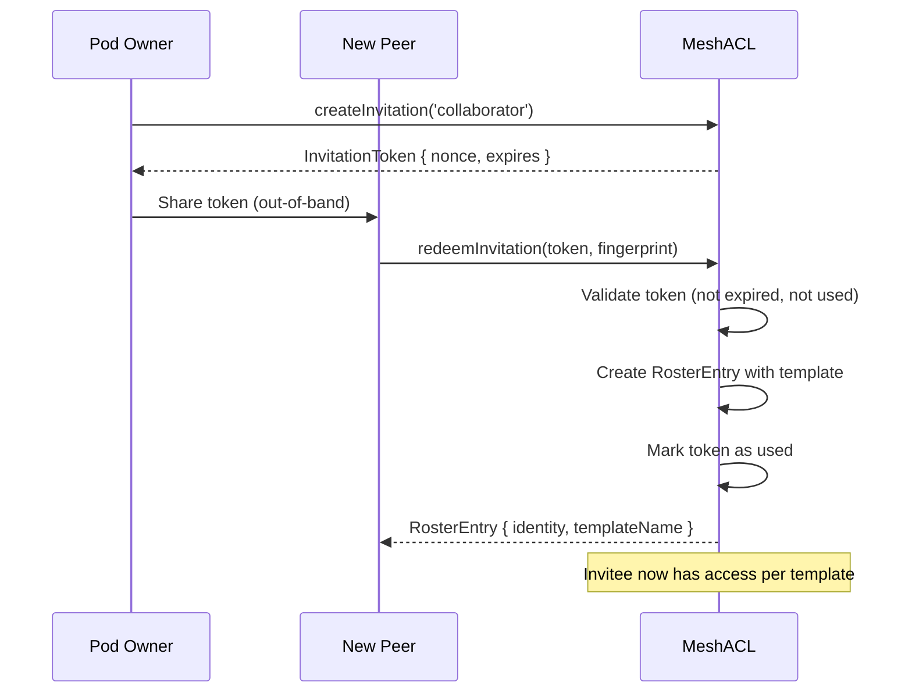

# Remote Access Control

Scope-based access control for BrowserMesh pods with roster management, invitation tokens, and template-driven authorization.

**Related specs**: [wire-format.md](../core/wire-format.md) | [presence-protocol.md](presence-protocol.md) | [pod-addr.md](../networking/pod-addr.md)

## 1. Overview

The Remote Access Control system manages which identities may access a pod's resources and what actions they can perform. It uses scope templates (named bundles of capabilities) mapped to a roster of identities, with invitation tokens for onboarding new peers.

Wire types: `ACL_GRANT` (0xAC), `ACL_REVOKE` (0xAD), `ACL_INVITE` (0xAE)

## 2. Scope Model

### Scope Grammar

Scopes follow a `<resource>:<action>` grammar with wildcard support:

```
scope     = resource ":" action
resource  = identifier / "*"
action    = identifier / "*"
identifier = ALPHA *(ALPHA / DIGIT / "_" / "-")
```

Examples: `chat:read`, `files:write`, `compute:submit`, `*:*`

### Wildcard Matching

- `*:*` matches all scopes
- `chat:*` matches any action on the `chat` resource
- `*:read` matches read on any resource

## 3. TypeScript Interfaces

```typescript
interface ScopeTemplate {
  name: string;
  scopes: string[];
  description?: string;
}

interface RosterEntry {
  identity: string;      // Fingerprint of the identity
  templateName: string;  // Assigned scope template
  scopes?: string[];     // Additional scope overrides
  quotas?: {
    maxCalls?: number;
    maxBytes?: number;
    maxTokens?: number;
    maxConcurrent?: number;
  };
  label?: string;        // Human-friendly label
  expires?: number;      // Expiration timestamp (ms)
  created: number;
}

interface InvitationToken {
  owner: string;         // Inviter's fingerprint
  templateName: string;  // Template granted on redemption
  expires: number;       // Expiration timestamp (ms)
  nonce: string;         // Single-use unique identifier
  used: boolean;
}

interface ACLCheckResult {
  allowed: boolean;
  reason?: string;
}
```

## 4. Default Templates

| Template | Scopes | Description |
|----------|--------|-------------|
| `guest` | `chat:read`, `files:read` | Read-only access |
| `collaborator` | `chat:*`, `files:read`, `files:write`, `compute:submit` | Full collaboration |
| `admin` | `*:*` | Unrestricted access |

## 5. Wire Message Formats

### ACL_GRANT (0xAC)

```typescript
interface ACLGrantMessage {
  type: 0xAC;
  from: string;           // Grantor fingerprint
  to: string;             // Grantee fingerprint
  payload: {
    templateName: string;
    scopes?: string[];
    quotas?: object;
    expires?: number;
    label?: string;
  };
}
```

### ACL_REVOKE (0xAD)

```typescript
interface ACLRevokeMessage {
  type: 0xAD;
  from: string;
  to: string;
  payload: {
    identity: string;     // Identity to revoke
    reason?: string;
  };
}
```

### ACL_INVITE (0xAE)

```typescript
interface ACLInviteMessage {
  type: 0xAE;
  from: string;
  payload: {
    nonce: string;
    templateName: string;
    expires: number;
  };
}
```

## 6. Invitation Flow



## 7. Access Check Flow

1. If identity equals the pod owner, allow immediately
2. Look up identity in the roster
3. If no roster entry, deny with `not_in_roster`
4. If roster entry is expired, deny with `entry_expired`
5. Resolve the scope template
6. Check if the template covers the requested `resource:action`
7. Return allowed/denied result

## 8. Quota Enforcement Hooks

Quotas are advisory limits tracked per roster entry:

- `maxCalls`: Total API calls allowed per time window
- `maxBytes`: Total bytes transferred
- `maxTokens`: Total LLM tokens consumed
- `maxConcurrent`: Concurrent active operations

Enforcement is handled by the consuming module (e.g., tools, providers).

## 9. Security Considerations

- **Token replay**: Each invitation token has a unique nonce and is marked used on first redemption. Tokens cannot be reused.
- **Token expiry**: Default 15-minute TTL prevents stale tokens from being redeemed.
- **Revocation propagation**: `revokeAll()` immediately invalidates all grants for an identity. Revocations are local; cross-pod revocation uses `ACL_REVOKE` wire messages.
- **Owner bypass**: The pod owner always has full access and cannot be removed from the roster.
- **Template immutability**: Default templates are frozen. Custom templates can be added/removed by the owner only.
