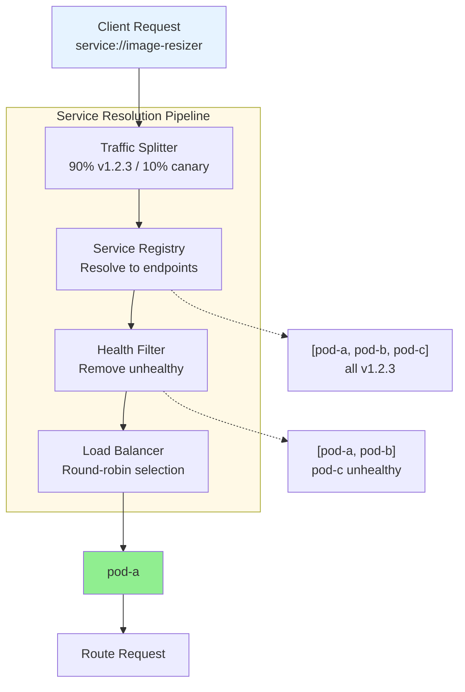
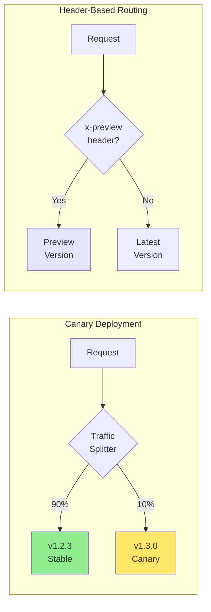
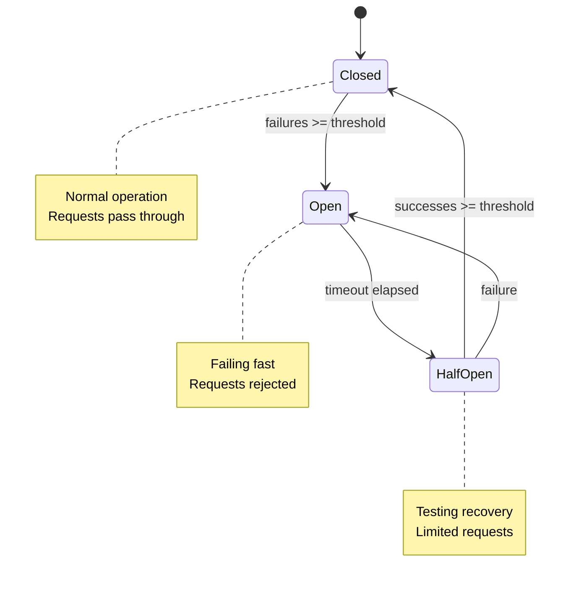

# Service Model & Traffic Management

Service naming, versioning, and traffic management for BrowserMesh.

**Related specs**: [message-envelope.md](../networking/message-envelope.md) | [pod-types.md](../core/pod-types.md) | [manifest-format.md](../reference/manifest-format.md)

## 1. Overview

The service model provides:
- Named service endpoints
- Version management
- Traffic splitting (canary, blue/green)
- Health-based routing
- Load balancing

## 2. Service Naming

```typescript
// Service address format
// service://<name>[:<version>]

interface ServiceAddress {
  scheme: 'service';
  name: string;           // e.g., 'image-resizer'
  version?: string;       // e.g., '1.2.3', 'latest', 'canary'
}

// Examples:
// service://image-resizer          -> latest stable
// service://image-resizer:1.2.3    -> specific version
// service://image-resizer:canary   -> canary release
// service://image-resizer:v2       -> major version

function parseServiceAddress(addr: string): ServiceAddress {
  const match = addr.match(/^service:\/\/([^:]+)(?::(.+))?$/);
  if (!match) throw new Error('Invalid service address');

  return {
    scheme: 'service',
    name: match[1],
    version: match[2],
  };
}
```

## 3. Service Registry

```typescript
interface ServiceEntry {
  name: string;
  version: string;
  endpoints: ServiceEndpoint[];
  selector: Record<string, string>;  // Capability labels
  loadBalancer: LoadBalancerConfig;
  healthCheck?: HealthCheckConfig;
}

interface ServiceEndpoint {
  podId: string;
  capabilities: string[];
  weight: number;          // 0-100, for traffic splitting
  status: 'healthy' | 'unhealthy' | 'unknown';
  lastSeen: number;
}

class ServiceRegistry {
  private services: Map<string, ServiceEntry[]> = new Map();

  /**
   * Register a service endpoint
   */
  register(
    name: string,
    version: string,
    podId: string,
    capabilities: string[]
  ): void {
    const key = `${name}:${version}`;
    let entries = this.services.get(key) || [];

    entries = entries.filter(e =>
      !e.endpoints.some(ep => ep.podId === podId)
    );

    entries.push({
      name,
      version,
      endpoints: [{
        podId,
        capabilities,
        weight: 100,
        status: 'unknown',
        lastSeen: Date.now(),
      }],
      selector: {},
      loadBalancer: { strategy: 'round-robin' },
    });

    this.services.set(key, entries);
  }

  /**
   * Resolve service to endpoints
   */
  resolve(name: string, version?: string): ServiceEndpoint[] {
    // If no version, get latest
    if (!version) {
      version = this.getLatestVersion(name);
    }

    const entries = this.services.get(`${name}:${version}`) || [];

    // Flatten and filter healthy endpoints
    return entries
      .flatMap(e => e.endpoints)
      .filter(ep => ep.status !== 'unhealthy');
  }

  /**
   * Get latest version of a service
   */
  private getLatestVersion(name: string): string {
    const versions: string[] = [];

    for (const [key] of this.services) {
      if (key.startsWith(`${name}:`)) {
        versions.push(key.split(':')[1]);
      }
    }

    // Sort by semver, return latest
    return versions.sort(semverCompare).pop() || 'latest';
  }
}
```

## 4. Traffic Splitting

```typescript
interface TrafficRule {
  name: string;
  match?: {
    headers?: Record<string, string>;
    podId?: string;
    percentage?: number;
  };
  route: {
    version: string;
    weight: number;
  }[];
}

class TrafficSplitter {
  private rules: TrafficRule[] = [];

  /**
   * Configure traffic split
   */
  setRule(rule: TrafficRule): void {
    this.rules = this.rules.filter(r => r.name !== rule.name);
    this.rules.push(rule);
  }

  /**
   * Select version based on traffic rules
   */
  selectVersion(
    serviceName: string,
    context: RequestContext
  ): string {
    for (const rule of this.rules) {
      if (rule.name !== serviceName) continue;

      // Check header match
      if (rule.match?.headers) {
        const matches = Object.entries(rule.match.headers)
          .every(([k, v]) => context.headers?.[k] === v);
        if (!matches) continue;
      }

      // Weighted selection
      const total = rule.route.reduce((sum, r) => sum + r.weight, 0);
      let random = Math.random() * total;

      for (const route of rule.route) {
        random -= route.weight;
        if (random <= 0) {
          return route.version;
        }
      }
    }

    return 'latest';
  }
}

// Example: Canary deployment
splitter.setRule({
  name: 'image-resizer',
  route: [
    { version: '1.2.3', weight: 90 },  // 90% to stable
    { version: '1.3.0', weight: 10 },  // 10% to canary
  ],
});

// Example: Header-based routing
splitter.setRule({
  name: 'image-resizer',
  match: { headers: { 'x-preview': 'true' } },
  route: [
    { version: 'preview', weight: 100 },
  ],
});
```

## 5. Load Balancing

```typescript
type LoadBalanceStrategy =
  | 'round-robin'
  | 'random'
  | 'least-connections'
  | 'consistent-hash'
  | 'sticky';

interface LoadBalancerConfig {
  strategy: LoadBalanceStrategy;
  stickyKey?: string;        // For sticky sessions
  hashKey?: string;          // For consistent hashing
}

class LoadBalancer {
  private counters: Map<string, number> = new Map();
  private connections: Map<string, number> = new Map();
  private hashRing: ConsistentHashRing;

  /**
   * Select endpoint from list
   */
  select(
    endpoints: ServiceEndpoint[],
    config: LoadBalancerConfig,
    context?: RequestContext
  ): ServiceEndpoint {
    if (endpoints.length === 0) {
      throw new Error('No endpoints available');
    }

    // Filter by weight (respect traffic split weights)
    const weighted = endpoints.filter(e => e.weight > 0);
    if (weighted.length === 0) return endpoints[0];

    switch (config.strategy) {
      case 'round-robin':
        return this.roundRobin(weighted);

      case 'random':
        return this.random(weighted);

      case 'least-connections':
        return this.leastConnections(weighted);

      case 'consistent-hash':
        return this.consistentHash(weighted, context, config.hashKey);

      case 'sticky':
        return this.sticky(weighted, context, config.stickyKey);

      default:
        return weighted[0];
    }
  }

  private roundRobin(endpoints: ServiceEndpoint[]): ServiceEndpoint {
    const key = endpoints.map(e => e.podId).join(',');
    const counter = (this.counters.get(key) || 0) + 1;
    this.counters.set(key, counter);
    return endpoints[counter % endpoints.length];
  }

  private random(endpoints: ServiceEndpoint[]): ServiceEndpoint {
    // Weight-aware random selection
    const totalWeight = endpoints.reduce((sum, e) => sum + e.weight, 0);
    let random = Math.random() * totalWeight;

    for (const endpoint of endpoints) {
      random -= endpoint.weight;
      if (random <= 0) return endpoint;
    }

    return endpoints[0];
  }

  private leastConnections(endpoints: ServiceEndpoint[]): ServiceEndpoint {
    let min = Infinity;
    let selected = endpoints[0];

    for (const endpoint of endpoints) {
      const conns = this.connections.get(endpoint.podId) || 0;
      if (conns < min) {
        min = conns;
        selected = endpoint;
      }
    }

    return selected;
  }

  private consistentHash(
    endpoints: ServiceEndpoint[],
    context: RequestContext | undefined,
    hashKey?: string
  ): ServiceEndpoint {
    const key = hashKey
      ? context?.[hashKey as keyof RequestContext]
      : context?.requestId;

    if (!key) return this.random(endpoints);

    // Use consistent hash ring
    return this.hashRing.get(String(key), endpoints);
  }

  private sticky(
    endpoints: ServiceEndpoint[],
    context: RequestContext | undefined,
    stickyKey?: string
  ): ServiceEndpoint {
    const key = stickyKey
      ? context?.[stickyKey as keyof RequestContext]
      : context?.podId;

    if (!key) return this.random(endpoints);

    // Hash to consistent endpoint
    const hash = simpleHash(String(key));
    return endpoints[hash % endpoints.length];
  }
}
```

## 6. Health Checking

```typescript
interface HealthCheckConfig {
  type: 'liveness' | 'readiness';
  interval: number;        // ms between checks
  timeout: number;         // ms to wait for response
  threshold: number;       // failures before unhealthy
}

class HealthChecker {
  private status: Map<string, HealthStatus> = new Map();

  async check(
    podId: string,
    config: HealthCheckConfig
  ): Promise<boolean> {
    const status = this.status.get(podId) || {
      healthy: true,
      consecutiveFailures: 0,
      lastCheck: 0,
    };

    try {
      const startTime = Date.now();
      const response = await Promise.race([
        this.sendHealthCheck(podId, config.type),
        sleep(config.timeout).then(() => {
          throw new Error('Timeout');
        }),
      ]);

      // Success
      status.healthy = true;
      status.consecutiveFailures = 0;
      status.lastCheck = Date.now();
      status.latency = Date.now() - startTime;

    } catch (err) {
      // Failure
      status.consecutiveFailures++;

      if (status.consecutiveFailures >= config.threshold) {
        status.healthy = false;
      }

      status.lastCheck = Date.now();
      status.lastError = err.message;
    }

    this.status.set(podId, status);
    return status.healthy;
  }

  private async sendHealthCheck(
    podId: string,
    type: 'liveness' | 'readiness'
  ): Promise<boolean> {
    const response = await mesh.send(
      { podId },
      { op: `health/${type}` },
      { timeout: 5000 }
    );
    return response.status === 'ok';
  }
}

interface HealthStatus {
  healthy: boolean;
  consecutiveFailures: number;
  lastCheck: number;
  latency?: number;
  lastError?: string;
}
```

## 7. Circuit Breaker

```typescript
interface CircuitBreakerConfig {
  threshold: number;       // Failures to open
  timeout: number;         // Time before half-open (ms)
  successThreshold: number; // Successes to close
}

type CircuitState = 'closed' | 'open' | 'half-open';

class CircuitBreaker {
  private state: CircuitState = 'closed';
  private failures = 0;
  private successes = 0;
  private lastFailure = 0;

  constructor(private config: CircuitBreakerConfig) {}

  async execute<T>(fn: () => Promise<T>): Promise<T> {
    if (this.state === 'open') {
      // Check if timeout elapsed
      if (Date.now() - this.lastFailure > this.config.timeout) {
        this.state = 'half-open';
        this.successes = 0;
      } else {
        throw new Error('Circuit breaker open');
      }
    }

    try {
      const result = await fn();

      if (this.state === 'half-open') {
        this.successes++;
        if (this.successes >= this.config.successThreshold) {
          this.state = 'closed';
          this.failures = 0;
        }
      }

      return result;
    } catch (err) {
      this.failures++;
      this.lastFailure = Date.now();

      if (this.failures >= this.config.threshold) {
        this.state = 'open';
      }

      throw err;
    }
  }
}
```

## 8. Service Manifest

```yaml
apiVersion: browsermesh.dev/v1
kind: Service
metadata:
  name: image-resizer
  namespace: default
spec:
  selector:
    app: image-resizer
  ports:
    - name: main
      protocol: mesh
      capability: compute/wasm
  loadBalancer:
    strategy: round-robin
  healthCheck:
    type: readiness
    interval: 10000
    timeout: 5000
    threshold: 3
---
apiVersion: browsermesh.dev/v1
kind: TrafficSplit
metadata:
  name: image-resizer-canary
spec:
  service: image-resizer
  backends:
    - version: "1.2.3"
      weight: 90
    - version: "1.3.0-canary"
      weight: 10
```

## 9. Client Usage

```typescript
// Simple service call
const result = await mesh.send('service://image-resizer', {
  op: 'resize',
  args: { width: 200, height: 200 },
});

// With version
const result = await mesh.send('service://image-resizer:1.2.3', {
  op: 'resize',
  args: { width: 200, height: 200 },
});

// With headers (for routing rules)
const result = await mesh.send('service://image-resizer', {
  op: 'resize',
  args: { width: 200, height: 200 },
}, {
  headers: { 'x-preview': 'true' },
});
```

## 10. Service Discovery Flow



### Traffic Splitting



### Circuit Breaker States


