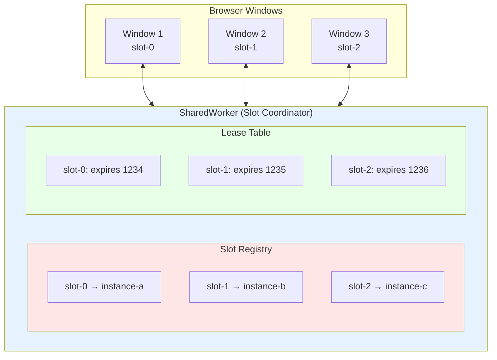
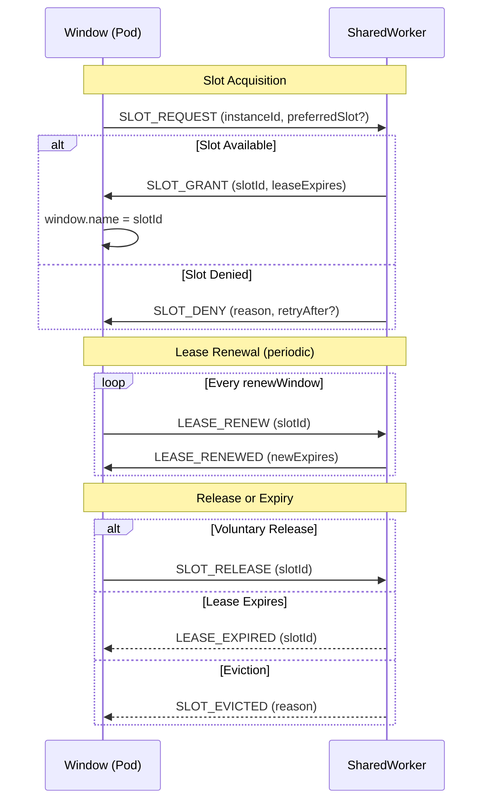
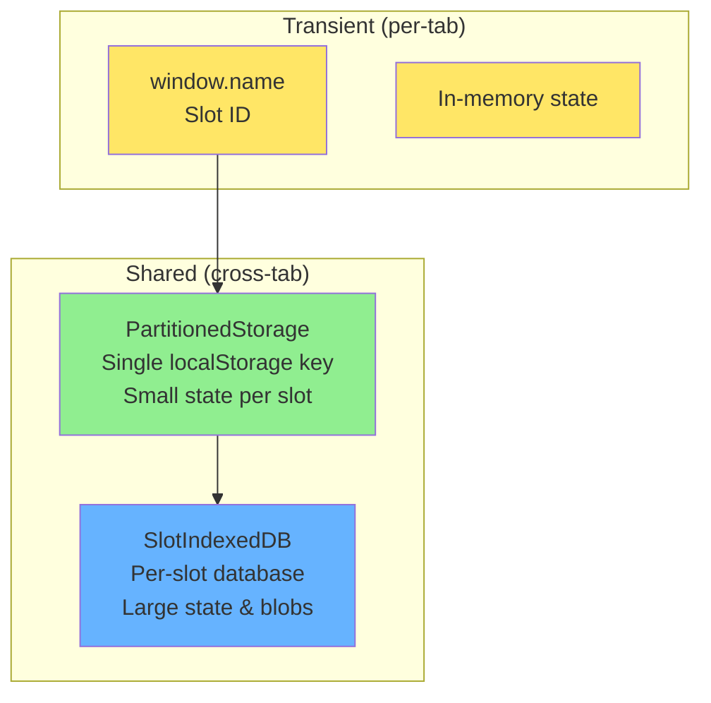

# Slot Lease Protocol

Protocol for managing stable pod slot IDs via SharedWorker coordination.

**Related specs**: [pod-types.md](../core/pod-types.md) | [boot-sequence.md](../core/boot-sequence.md) | [identity-keys.md](../crypto/identity-keys.md)

## 1. Overview

Pods have two identities:
- **Instance ID**: Ephemeral, crypto-based, changes on reload
- **Slot ID**: Stable, persists via `window.name`, survives reload

The SharedWorker acts as the slot allocator and lease manager.

## 2. Architecture



### Lease Lifecycle



## 3. Message Types

```typescript
// Request a slot
interface SlotRequestMessage {
  type: 'SLOT_REQUEST';
  instanceId: string;          // Crypto instance ID
  preferredSlot?: string;      // Preferred slot (from window.name)
  capabilities: string[];      // Pod capabilities
  timestamp: number;
}

// Slot granted
interface SlotGrantMessage {
  type: 'SLOT_GRANT';
  instanceId: string;
  slotId: string;
  leaseExpires: number;
  leaseRenewAt: number;
}

// Slot denied
interface SlotDenyMessage {
  type: 'SLOT_DENY';
  instanceId: string;
  reason: 'conflict' | 'quota' | 'invalid';
  conflictingInstance?: string;
  retryAfter?: number;
}

// Lease renewal request
interface LeaseRenewMessage {
  type: 'LEASE_RENEW';
  instanceId: string;
  slotId: string;
}

// Lease renewed
interface LeaseRenewedMessage {
  type: 'LEASE_RENEWED';
  slotId: string;
  leaseExpires: number;
  leaseRenewAt: number;
}

// Lease expired (broadcast)
interface LeaseExpiredMessage {
  type: 'LEASE_EXPIRED';
  slotId: string;
  instanceId: string;
}

// Slot release (voluntary)
interface SlotReleaseMessage {
  type: 'SLOT_RELEASE';
  instanceId: string;
  slotId: string;
}

// Conflict detected
interface SlotConflictMessage {
  type: 'SLOT_CONFLICT';
  slotId: string;
  claimants: string[];       // Instance IDs claiming same slot
  resolution: 'first-wins' | 'newest-wins' | 'vote';
}
```

## 4. Coordinator Implementation

```typescript
interface SlotLease {
  slotId: string;
  instanceId: string;
  grantedAt: number;
  expiresAt: number;
  renewCount: number;
  capabilities: string[];
}

interface SlotCoordinatorConfig {
  maxSlots: number;              // Maximum concurrent slots
  leaseTimeMs: number;           // Default: 30000 (30 seconds)
  renewWindowMs: number;         // Renew when this much time left: 10000
  conflictResolution: 'first-wins' | 'newest-wins';
  evictionPolicy: 'lru' | 'oldest-lease' | 'random';
}

class SlotCoordinator {
  private slots: Map<string, SlotLease> = new Map();
  private instanceToSlot: Map<string, string> = new Map();
  private config: SlotCoordinatorConfig;

  constructor(config: Partial<SlotCoordinatorConfig> = {}) {
    this.config = {
      maxSlots: 100,
      leaseTimeMs: 30000,
      renewWindowMs: 10000,
      conflictResolution: 'first-wins',
      evictionPolicy: 'lru',
      ...config,
    };

    // Start lease checker
    this.startLeaseChecker();
  }

  // Handle slot request
  handleRequest(message: SlotRequestMessage, port: MessagePort): void {
    const { instanceId, preferredSlot, capabilities } = message;

    // Check if instance already has a slot
    const existingSlot = this.instanceToSlot.get(instanceId);
    if (existingSlot) {
      // Renew existing lease
      this.renewLease(existingSlot, instanceId, port);
      return;
    }

    // Try preferred slot first
    if (preferredSlot) {
      const result = this.tryAcquireSlot(preferredSlot, instanceId, capabilities);
      if (result.success) {
        this.grantSlot(result.lease!, port);
        return;
      }
    }

    // Allocate new slot
    const newSlotId = this.allocateSlot(instanceId, capabilities);
    if (newSlotId) {
      const lease = this.slots.get(newSlotId)!;
      this.grantSlot(lease, port);
      return;
    }

    // No slots available - try eviction
    const evictedSlot = this.tryEvict();
    if (evictedSlot) {
      const lease = this.createLease(evictedSlot, instanceId, capabilities);
      this.grantSlot(lease, port);
      return;
    }

    // Deny request
    port.postMessage({
      type: 'SLOT_DENY',
      instanceId,
      reason: 'quota',
      retryAfter: 5000,
    } as SlotDenyMessage);
  }

  // Try to acquire a specific slot
  private tryAcquireSlot(
    slotId: string,
    instanceId: string,
    capabilities: string[]
  ): { success: boolean; lease?: SlotLease } {
    const existing = this.slots.get(slotId);

    if (!existing) {
      // Slot is free
      const lease = this.createLease(slotId, instanceId, capabilities);
      return { success: true, lease };
    }

    // Check if existing lease is expired
    if (existing.expiresAt < Date.now()) {
      // Expired - take over
      this.expireLease(slotId);
      const lease = this.createLease(slotId, instanceId, capabilities);
      return { success: true, lease };
    }

    // Slot is occupied
    if (this.config.conflictResolution === 'newest-wins') {
      // Evict current holder
      this.evictSlot(slotId, 'conflict');
      const lease = this.createLease(slotId, instanceId, capabilities);
      return { success: true, lease };
    }

    // first-wins: deny new request
    return { success: false };
  }

  // Allocate a new slot ID
  private allocateSlot(instanceId: string, capabilities: string[]): string | null {
    if (this.slots.size >= this.config.maxSlots) {
      return null;
    }

    // Find next available slot number
    let slotNum = 0;
    while (this.slots.has(`slot-${slotNum}`)) {
      slotNum++;
    }

    const slotId = `slot-${slotNum}`;
    this.createLease(slotId, instanceId, capabilities);
    return slotId;
  }

  // Create a new lease
  private createLease(
    slotId: string,
    instanceId: string,
    capabilities: string[]
  ): SlotLease {
    const now = Date.now();
    const lease: SlotLease = {
      slotId,
      instanceId,
      grantedAt: now,
      expiresAt: now + this.config.leaseTimeMs,
      renewCount: 0,
      capabilities,
    };

    this.slots.set(slotId, lease);
    this.instanceToSlot.set(instanceId, slotId);

    return lease;
  }

  // Grant slot to client
  private grantSlot(lease: SlotLease, port: MessagePort): void {
    port.postMessage({
      type: 'SLOT_GRANT',
      instanceId: lease.instanceId,
      slotId: lease.slotId,
      leaseExpires: lease.expiresAt,
      leaseRenewAt: lease.expiresAt - this.config.renewWindowMs,
    } as SlotGrantMessage);
  }

  // Renew a lease
  private renewLease(slotId: string, instanceId: string, port: MessagePort): void {
    const lease = this.slots.get(slotId);

    if (!lease || lease.instanceId !== instanceId) {
      port.postMessage({
        type: 'SLOT_DENY',
        instanceId,
        reason: 'invalid',
      } as SlotDenyMessage);
      return;
    }

    // Extend lease
    const now = Date.now();
    lease.expiresAt = now + this.config.leaseTimeMs;
    lease.renewCount++;

    port.postMessage({
      type: 'LEASE_RENEWED',
      slotId,
      leaseExpires: lease.expiresAt,
      leaseRenewAt: lease.expiresAt - this.config.renewWindowMs,
    } as LeaseRenewedMessage);
  }

  // Check for expired leases
  private startLeaseChecker(): void {
    setInterval(() => {
      const now = Date.now();

      for (const [slotId, lease] of this.slots) {
        if (lease.expiresAt < now) {
          this.expireLease(slotId);
        }
      }
    }, 5000);
  }

  // Expire a lease
  private expireLease(slotId: string): void {
    const lease = this.slots.get(slotId);
    if (!lease) return;

    this.slots.delete(slotId);
    this.instanceToSlot.delete(lease.instanceId);

    // Broadcast expiration
    this.broadcast({
      type: 'LEASE_EXPIRED',
      slotId,
      instanceId: lease.instanceId,
    });
  }

  // Try to evict a slot
  private tryEvict(): string | null {
    if (this.slots.size === 0) return null;

    switch (this.config.evictionPolicy) {
      case 'lru':
        // Evict least recently renewed
        let oldest: SlotLease | null = null;
        for (const lease of this.slots.values()) {
          if (!oldest || lease.grantedAt < oldest.grantedAt) {
            oldest = lease;
          }
        }
        if (oldest) {
          this.evictSlot(oldest.slotId, 'eviction');
          return oldest.slotId;
        }
        break;

      case 'oldest-lease':
        // Evict oldest by grant time
        // Similar to LRU but ignores renewals
        break;

      case 'random':
        const slots = [...this.slots.keys()];
        const idx = Math.floor(Math.random() * slots.length);
        this.evictSlot(slots[idx], 'eviction');
        return slots[idx];
    }

    return null;
  }

  // Evict a slot holder
  private evictSlot(slotId: string, reason: string): void {
    const lease = this.slots.get(slotId);
    if (!lease) return;

    // Notify the evicted instance
    this.sendToInstance(lease.instanceId, {
      type: 'SLOT_EVICTED',
      slotId,
      reason,
    });

    this.slots.delete(slotId);
    this.instanceToSlot.delete(lease.instanceId);
  }
}
```

## 5. Client Implementation

```typescript
class SlotClient {
  private slotId: string | null = null;
  private leaseExpires: number = 0;
  private leaseRenewAt: number = 0;
  private renewTimer: number | null = null;
  private coordinator: MessagePort;

  constructor(private instanceId: string) {
    this.coordinator = this.connectToCoordinator();
    this.setupMessageHandler();
  }

  // Request a slot
  async requestSlot(): Promise<string> {
    // Check window.name for preferred slot
    const preferredSlot = window.name.startsWith('slot-')
      ? window.name
      : undefined;

    this.coordinator.postMessage({
      type: 'SLOT_REQUEST',
      instanceId: this.instanceId,
      preferredSlot,
      capabilities: this.getCapabilities(),
      timestamp: Date.now(),
    });

    // Wait for grant or deny
    return new Promise((resolve, reject) => {
      const handler = (event: MessageEvent) => {
        if (event.data.type === 'SLOT_GRANT') {
          this.handleGrant(event.data);
          resolve(this.slotId!);
        } else if (event.data.type === 'SLOT_DENY') {
          reject(new Error(event.data.reason));
        }
      };

      this.coordinator.addEventListener('message', handler, { once: true });
    });
  }

  // Handle slot grant
  private handleGrant(message: SlotGrantMessage): void {
    this.slotId = message.slotId;
    this.leaseExpires = message.leaseExpires;
    this.leaseRenewAt = message.leaseRenewAt;

    // Persist to window.name
    window.name = this.slotId;

    // Schedule renewal
    this.scheduleRenewal();

    console.log(`Slot acquired: ${this.slotId}`);
  }

  // Schedule lease renewal
  private scheduleRenewal(): void {
    if (this.renewTimer) {
      clearTimeout(this.renewTimer);
    }

    const delay = this.leaseRenewAt - Date.now();
    if (delay > 0) {
      this.renewTimer = setTimeout(() => {
        this.renewLease();
      }, delay);
    }
  }

  // Renew the lease
  private async renewLease(): Promise<void> {
    if (!this.slotId) return;

    this.coordinator.postMessage({
      type: 'LEASE_RENEW',
      instanceId: this.instanceId,
      slotId: this.slotId,
    });
  }

  // Handle lease renewed
  private handleRenewed(message: LeaseRenewedMessage): void {
    this.leaseExpires = message.leaseExpires;
    this.leaseRenewAt = message.leaseRenewAt;
    this.scheduleRenewal();
  }

  // Release slot (on unload)
  release(): void {
    if (!this.slotId) return;

    this.coordinator.postMessage({
      type: 'SLOT_RELEASE',
      instanceId: this.instanceId,
      slotId: this.slotId,
    });

    // Don't clear window.name - allow reclaim on reload
  }

  // Handle eviction
  private handleEviction(message: any): void {
    console.warn(`Evicted from slot: ${message.slotId}`);
    this.slotId = null;
    window.name = '';

    // Try to get a new slot
    this.requestSlot().catch(console.error);
  }
}
```

## 6. Conflict Resolution

```typescript
class ConflictResolver {
  // Handle conflict between two instances claiming same slot
  async resolve(
    slotId: string,
    claimants: string[],
    strategy: 'first-wins' | 'newest-wins' | 'vote'
  ): Promise<string> {
    switch (strategy) {
      case 'first-wins':
        // Keep the current holder
        return claimants[0];

      case 'newest-wins':
        // Give to the newest claimant
        return claimants[claimants.length - 1];

      case 'vote':
        // Ask all connected pods to vote
        return this.conductVote(slotId, claimants);
    }
  }

  private async conductVote(slotId: string, claimants: string[]): Promise<string> {
    // Broadcast vote request
    const votes = new Map<string, number>();

    for (const claimant of claimants) {
      votes.set(claimant, 0);
    }

    // Collect votes (simplified)
    // In practice, this would be async with timeout

    // Winner is the one with most votes
    let winner = claimants[0];
    let maxVotes = 0;

    for (const [id, count] of votes) {
      if (count > maxVotes) {
        winner = id;
        maxVotes = count;
      }
    }

    return winner;
  }
}
```

## 7. Storage Namespacing

### 7.1 PartitionedStorage

Instead of prefix-based namespacing (which scatters slot data across many localStorage keys), PartitionedStorage stores all partitions under a **single localStorage key** as a JSON object. This reduces storage event noise and enables atomic cross-slot operations.

```typescript
interface PartitionedStorageOptions {
  /** localStorage key for all partitions */
  storageKey: string;
  /** Maximum partitions (matches maxSlots) */
  maxPartitions: number;
}

class PartitionedStorage {
  private storageKey: string;
  private maxPartitions: number;

  constructor(options: PartitionedStorageOptions) {
    this.storageKey = options.storageKey;
    this.maxPartitions = options.maxPartitions;
  }

  /** Read all partitions atomically */
  readAll(): Record<string, Record<string, unknown>> {
    const raw = localStorage.getItem(this.storageKey);
    return raw ? JSON.parse(raw) : {};
  }

  /** Write all partitions atomically */
  writeAll(partitions: Record<string, Record<string, unknown>>): void {
    localStorage.setItem(this.storageKey, JSON.stringify(partitions));
  }

  /** Get a single partition's data */
  getPartition(slotId: string): Record<string, unknown> | null {
    const all = this.readAll();
    return all[slotId] ?? null;
  }

  /** Set a single partition's data (merge with existing) */
  setPartition(slotId: string, data: Record<string, unknown>): void {
    const all = this.readAll();
    all[slotId] = { ...(all[slotId] ?? {}), ...data };
    this.writeAll(all);
  }

  /** Delete a partition */
  deletePartition(slotId: string): void {
    const all = this.readAll();
    delete all[slotId];
    this.writeAll(all);
  }

  /** Clear all partitions */
  clear(): void {
    localStorage.removeItem(this.storageKey);
  }
}
```

**Storage layout**:
```json
{
  "slot-0": { "cursor": 42, "lastSync": 1700000000 },
  "slot-1": { "cursor": 17, "lastSync": 1700000001 },
  "slot-3": { "cursor": 0, "lastSync": 1700000002 }
}
```

> **Migration**: Existing deployments using prefix-based `NamespacedStorage` should migrate to `PartitionedStorage` by reading all `${slotId}:*` keys, aggregating them into the single-key format, then removing the old keys.

### 7.2 Lowest-Available-Index Allocation

When a slot is released, its index becomes available for reuse. The allocator fills gaps rather than always incrementing:

```typescript
function allocateLowestAvailableSlot(
  activeSlots: Set<string>,
  maxSlots: number
): string | null {
  for (let i = 0; i < maxSlots; i++) {
    const slotId = `slot-${i}`;
    if (!activeSlots.has(slotId)) {
      return slotId;
    }
  }
  return null; // All slots occupied
}
```

**Example**:
```
Active: [slot-0, slot-1, slot-2]
Release slot-1
Active: [slot-0, slot-2]
Next allocation → slot-1 (fills gap)
```

This keeps slot indices compact, which benefits `PartitionedStorage` (smaller JSON object) and UI display (sequential tab numbering).

### 7.3 IndexedDB Partitioning

For data that exceeds localStorage limits (5-10 MB), each slot gets a dedicated IndexedDB object store:

```typescript
class SlotIndexedDB {
  private db: IDBDatabase | null = null;
  private dbName: string;

  constructor(private slotId: string) {
    this.dbName = `browsermesh:slot:${slotId}`;
  }

  async open(): Promise<void> {
    this.db = await new Promise((resolve, reject) => {
      const request = indexedDB.open(this.dbName, 1);
      request.onupgradeneeded = () => {
        const db = request.result;
        if (!db.objectStoreNames.contains('state')) {
          db.createObjectStore('state');
        }
        if (!db.objectStoreNames.contains('blobs')) {
          db.createObjectStore('blobs');
        }
      };
      request.onsuccess = () => resolve(request.result);
      request.onerror = () => reject(request.error);
    });
  }

  async get<T>(store: 'state' | 'blobs', key: string): Promise<T | undefined> {
    if (!this.db) await this.open();
    return new Promise((resolve, reject) => {
      const tx = this.db!.transaction(store, 'readonly');
      const req = tx.objectStore(store).get(key);
      req.onsuccess = () => resolve(req.result);
      req.onerror = () => reject(req.error);
    });
  }

  async put(store: 'state' | 'blobs', key: string, value: unknown): Promise<void> {
    if (!this.db) await this.open();
    return new Promise((resolve, reject) => {
      const tx = this.db!.transaction(store, 'readwrite');
      tx.objectStore(store).put(value, key);
      tx.oncomplete = () => resolve();
      tx.onerror = () => reject(tx.error);
    });
  }

  async delete(store: 'state' | 'blobs', key: string): Promise<void> {
    if (!this.db) await this.open();
    return new Promise((resolve, reject) => {
      const tx = this.db!.transaction(store, 'readwrite');
      tx.objectStore(store).delete(key);
      tx.oncomplete = () => resolve();
      tx.onerror = () => reject(tx.error);
    });
  }

  /** Delete the entire slot database */
  async destroy(): Promise<void> {
    if (this.db) this.db.close();
    return new Promise((resolve, reject) => {
      const request = indexedDB.deleteDatabase(this.dbName);
      request.onsuccess = () => resolve();
      request.onerror = () => reject(request.error);
    });
  }
}
```

### 7.4 Storage Hierarchy



## 8. Limits

| Resource | Limit |
|----------|-------|
| Max concurrent slots | 100 |
| Lease duration | 30 seconds |
| Renewal window | 10 seconds before expiry |
| Max slot index | 99 |
| PartitionedStorage max size | 5 MB (localStorage limit) |
| IndexedDB per-slot max | 50 MB |
| Slot ID reuse cooldown | 5 seconds |
