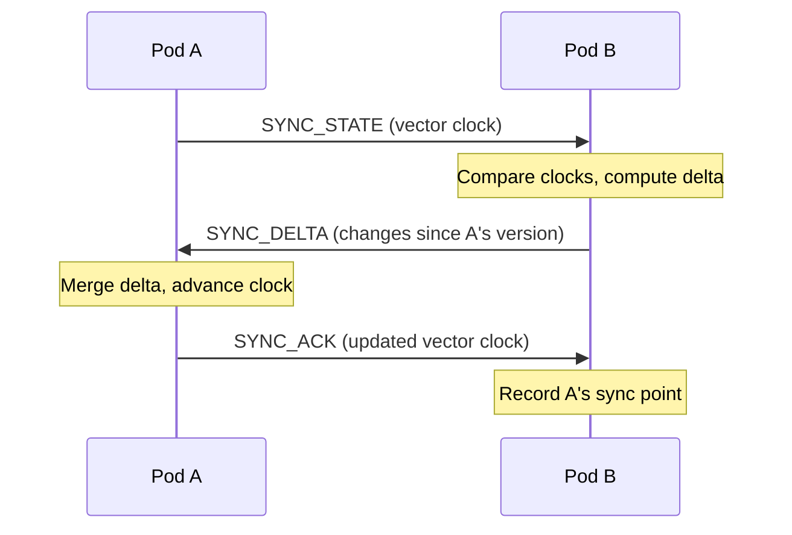
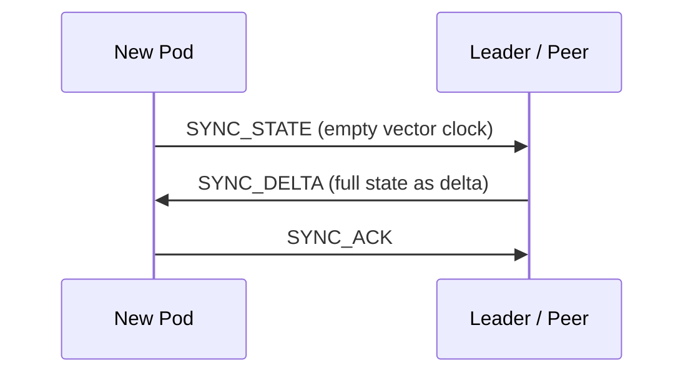

# State Sync

CRDT-based distributed state synchronization for BrowserMesh.

**Related specs**: [wire-format.md](../core/wire-format.md) | [presence-protocol.md](presence-protocol.md) | [session-keys.md](../crypto/session-keys.md) | [pubsub-topics.md](pubsub-topics.md)

## 1. Overview

BrowserMesh examples use ad-hoc state snapshots, and [storage-integration.md](../extensions/storage-integration.md) references CRDTs as a "Better Alternative" for mutable documents. This spec defines:

- CRDT primitives: GCounter, PNCounter, LWWRegister, ORSet, LWWMap
- A composable StateDocument container
- Delta-state synchronization protocol
- Causal ordering via vector clocks
- Snapshot and compaction for new joiners

## 2. CRDT Primitives

### 2.1 GCounter (Grow-Only Counter)

```typescript
interface GCounter {
  type: 'gcounter';
  counts: Map<string, number>;  // podId -> count
}

function gcounterIncrement(c: GCounter, podId: string, amount: number = 1): void {
  c.counts.set(podId, (c.counts.get(podId) ?? 0) + amount);
}

function gcounterValue(c: GCounter): number {
  let total = 0;
  for (const v of c.counts.values()) total += v;
  return total;
}

function gcounterMerge(a: GCounter, b: GCounter): GCounter {
  const merged: GCounter = { type: 'gcounter', counts: new Map(a.counts) };
  for (const [id, count] of b.counts) {
    merged.counts.set(id, Math.max(merged.counts.get(id) ?? 0, count));
  }
  return merged;
}
```

### 2.2 PNCounter (Positive-Negative Counter)

```typescript
interface PNCounter {
  type: 'pncounter';
  positive: GCounter;
  negative: GCounter;
}

function pncounterIncrement(c: PNCounter, podId: string, amount: number): void {
  if (amount >= 0) {
    gcounterIncrement(c.positive, podId, amount);
  } else {
    gcounterIncrement(c.negative, podId, -amount);
  }
}

function pncounterValue(c: PNCounter): number {
  return gcounterValue(c.positive) - gcounterValue(c.negative);
}
```

### 2.3 LWWRegister (Last-Writer-Wins Register)

```typescript
interface LWWRegister<T> {
  type: 'lww-register';
  value: T;
  timestamp: number;
  podId: string;          // Tiebreaker when timestamps equal
}

function lwwSet<T>(r: LWWRegister<T>, value: T, podId: string): void {
  const ts = Date.now();
  if (ts > r.timestamp || (ts === r.timestamp && podId > r.podId)) {
    r.value = value;
    r.timestamp = ts;
    r.podId = podId;
  }
}

function lwwMerge<T>(a: LWWRegister<T>, b: LWWRegister<T>): LWWRegister<T> {
  if (a.timestamp > b.timestamp) return a;
  if (b.timestamp > a.timestamp) return b;
  return a.podId > b.podId ? a : b;  // Deterministic tiebreak
}
```

### 2.4 ORSet (Observed-Remove Set)

```typescript
interface ORSet<T> {
  type: 'or-set';
  elements: Map<string, { value: T; addId: string; timestamp: number }>;
  tombstones: Set<string>;  // Removed addIds
}

function orsetAdd<T>(s: ORSet<T>, value: T, podId: string): void {
  const addId = `${podId}:${Date.now()}:${Math.random().toString(36).slice(2, 8)}`;
  s.elements.set(addId, { value, addId, timestamp: Date.now() });
}

function orsetRemove<T>(s: ORSet<T>, value: T): void {
  for (const [addId, entry] of s.elements) {
    if (entry.value === value) {
      s.elements.delete(addId);
      s.tombstones.add(addId);
    }
  }
}

function orsetValues<T>(s: ORSet<T>): T[] {
  return [...new Set([...s.elements.values()].map(e => e.value))];
}

function orsetMerge<T>(a: ORSet<T>, b: ORSet<T>): ORSet<T> {
  const merged: ORSet<T> = {
    type: 'or-set',
    elements: new Map(),
    tombstones: new Set([...a.tombstones, ...b.tombstones]),
  };

  for (const [addId, entry] of [...a.elements, ...b.elements]) {
    if (!merged.tombstones.has(addId)) {
      merged.elements.set(addId, entry);
    }
  }
  return merged;
}
```

### 2.5 LWWMap (Last-Writer-Wins Map)

```typescript
interface LWWMap<V> {
  type: 'lww-map';
  entries: Map<string, LWWRegister<V | null>>;
}

function lwwmapSet<V>(m: LWWMap<V>, key: string, value: V, podId: string): void {
  const existing = m.entries.get(key);
  if (!existing) {
    m.entries.set(key, {
      type: 'lww-register',
      value,
      timestamp: Date.now(),
      podId,
    });
  } else {
    lwwSet(existing, value, podId);
  }
}

function lwwmapDelete<V>(m: LWWMap<V>, key: string, podId: string): void {
  lwwmapSet(m, key, null as any, podId);
}

function lwwmapMerge<V>(a: LWWMap<V>, b: LWWMap<V>): LWWMap<V> {
  const merged: LWWMap<V> = { type: 'lww-map', entries: new Map(a.entries) };
  for (const [key, reg] of b.entries) {
    const existing = merged.entries.get(key);
    merged.entries.set(key, existing ? lwwMerge(existing, reg) : reg);
  }
  return merged;
}
```

## 3. StateDocument

A `StateDocument` is a composable container that holds multiple named CRDT fields. It is the unit of synchronization.

```typescript
type CRDTValue = GCounter | PNCounter | LWWRegister<unknown> | ORSet<unknown> | LWWMap<unknown>;

interface StateDocument {
  id: string;                              // Document identifier
  version: VectorClock;                    // Causal version
  fields: Map<string, CRDTValue>;          // Named CRDT fields
  lastModified: number;
}

/** Vector clock for causal ordering */
type VectorClock = Map<string, number>;    // podId -> logical timestamp

function vcIncrement(vc: VectorClock, podId: string): void {
  vc.set(podId, (vc.get(podId) ?? 0) + 1);
}

function vcMerge(a: VectorClock, b: VectorClock): VectorClock {
  const merged = new Map(a);
  for (const [id, ts] of b) {
    merged.set(id, Math.max(merged.get(id) ?? 0, ts));
  }
  return merged;
}

/** Returns true if a causally dominates b */
function vcDominates(a: VectorClock, b: VectorClock): boolean {
  let dominated = false;
  for (const [id, ts] of b) {
    if ((a.get(id) ?? 0) < ts) return false;
    if ((a.get(id) ?? 0) > ts) dominated = true;
  }
  for (const [id, ts] of a) {
    if (!b.has(id) && ts > 0) dominated = true;
  }
  return dominated;
}
```

## 4. Delta-State Synchronization

Instead of sending full state on every change, pods exchange **deltas** — the minimum mutations since the last sync point.



### Sync on Join

When a new pod joins, it receives a full snapshot:



## 5. Wire Format Messages

State sync messages use type codes 0xA0-0xA5 in the StateSync (0xA*) block.

```typescript
enum StateSyncMessageType {
  SYNC_STATE  = 0xA0,
  SYNC_DELTA  = 0xA1,
  SYNC_ACK    = 0xA2,
  SYNC_REJECT = 0xA3,
  SYNC_SUBSCRIBE   = 0xA4,
  SYNC_UNSUBSCRIBE = 0xA5,
}
```

### 5.1 SYNC_STATE (0xA0)

Initiates synchronization by advertising the sender's vector clock.

```typescript
interface SyncStateMessage extends MessageEnvelope {
  t: 0xA0;
  p: {
    documentId: string;
    vectorClock: Record<string, number>;  // Serialized VectorClock
    fields?: string[];                    // Optional: only sync specific fields
  };
}
```

### 5.2 SYNC_DELTA (0xA1)

Carries the delta (mutations since the receiver's last known version).

```typescript
interface SyncDeltaMessage extends MessageEnvelope {
  t: 0xA1;
  p: {
    documentId: string;
    vectorClock: Record<string, number>;  // Sender's clock after delta
    deltas: DeltaEntry[];
    isSnapshot: boolean;                  // True if this is a full snapshot
  };
}

interface DeltaEntry {
  field: string;             // Field name in StateDocument
  type: string;              // CRDT type identifier
  mutations: unknown;        // Type-specific mutations
}
```

### 5.3 SYNC_ACK (0xA2)

```typescript
interface SyncAckMessage extends MessageEnvelope {
  t: 0xA2;
  p: {
    documentId: string;
    vectorClock: Record<string, number>;
  };
}
```

### 5.4 SYNC_REJECT (0xA3)

```typescript
interface SyncRejectMessage extends MessageEnvelope {
  t: 0xA3;
  p: {
    documentId: string;
    reason: 'unauthorized' | 'unknown_document' | 'version_conflict';
    message?: string;
  };
}
```

### 5.5 SYNC_SUBSCRIBE / SYNC_UNSUBSCRIBE (0xA4, 0xA5)

Subscribe to receive deltas for a document as they occur.

```typescript
interface SyncSubscribeMessage extends MessageEnvelope {
  t: 0xA4;
  p: {
    documentId: string;
    vectorClock: Record<string, number>;  // Sender's current clock
  };
}

interface SyncUnsubscribeMessage extends MessageEnvelope {
  t: 0xA5;
  p: {
    documentId: string;
  };
}
```

## 6. Snapshot and Compaction

Over time, delta histories grow. Compaction produces a minimal full-state snapshot:

```typescript
interface StateSnapshot {
  documentId: string;
  vectorClock: Record<string, number>;
  fields: Record<string, unknown>;  // Serialized CRDT values
  compactedAt: number;
  byteSize: number;
}

const COMPACTION_DEFAULTS = {
  deltaThreshold: 100,        // Compact after 100 deltas
  sizeThreshold: 256 * 1024,  // Compact if deltas exceed 256 KB
  interval: 300_000,          // Check every 5 minutes
};
```

Snapshots serve two purposes:
1. **New joiner bootstrap**: Send snapshot instead of replaying all deltas
2. **Memory reclamation**: Discard delta history after snapshot

## 7. StateDocumentManager

```typescript
class StateDocumentManager {
  private documents: Map<string, StateDocument> = new Map();
  private subscribers: Map<string, Set<string>> = new Map();  // docId -> Set<podId>

  /** Create a new state document */
  create(id: string, schema: Record<string, string>): StateDocument {
    const doc: StateDocument = {
      id,
      version: new Map(),
      fields: new Map(),
      lastModified: Date.now(),
    };

    // Initialize fields based on schema
    for (const [name, type] of Object.entries(schema)) {
      doc.fields.set(name, this.createCRDT(type));
    }

    this.documents.set(id, doc);
    return doc;
  }

  /** Apply a remote delta to a local document */
  applyDelta(documentId: string, delta: SyncDeltaMessage): void {
    const doc = this.documents.get(documentId);
    if (!doc) return;

    for (const entry of delta.p.deltas) {
      const field = doc.fields.get(entry.field);
      if (field) {
        this.mergeCRDT(field, entry);
      }
    }

    doc.version = vcMerge(
      doc.version,
      new Map(Object.entries(delta.p.vectorClock))
    );
    doc.lastModified = Date.now();

    // Notify local subscribers
    this.notifySubscribers(documentId, delta);
  }

  private createCRDT(type: string): CRDTValue {
    switch (type) {
      case 'gcounter': return { type: 'gcounter', counts: new Map() };
      case 'pncounter': return {
        type: 'pncounter',
        positive: { type: 'gcounter', counts: new Map() },
        negative: { type: 'gcounter', counts: new Map() },
      };
      case 'lww-register': return {
        type: 'lww-register', value: null, timestamp: 0, podId: '',
      };
      case 'or-set': return {
        type: 'or-set', elements: new Map(), tombstones: new Set(),
      };
      case 'lww-map': return { type: 'lww-map', entries: new Map() };
      default: throw new Error(`Unknown CRDT type: ${type}`);
    }
  }

  private mergeCRDT(target: CRDTValue, delta: DeltaEntry): void {
    // Type-specific merge logic dispatched by target.type
  }

  private notifySubscribers(documentId: string, delta: SyncDeltaMessage): void {
    // Push delta to all subscribed pods
  }
}
```

## 8. Integration Example

```typescript
// Create a shared counter document
const doc = stateManager.create('room-stats', {
  messageCount: 'gcounter',
  activeUsers: 'or-set',
  roomTitle: 'lww-register',
});

// Local mutation
gcounterIncrement(doc.fields.get('messageCount') as GCounter, myPodId);
vcIncrement(doc.version, myPodId);

// Sync with peers
await syncManager.broadcastDelta('room-stats', [{
  field: 'messageCount',
  type: 'gcounter',
  mutations: { podId: myPodId, increment: 1 },
}]);
```

## 9. Limits

| Resource | Limit |
|----------|-------|
| Max document size | 1 MB |
| Max fields per document | 64 |
| Max ORSet elements | 10,000 |
| Max tombstones retained | 10,000 |
| Vector clock entries | 256 (max pods) |
| Compaction delta threshold | 100 deltas |
| Compaction size threshold | 256 KB |

## Implementation Status

**Status**: MeshSyncEngine exists with 6 CRDT types (LWW-Register, G-Counter, PN-Counter, OR-Set, RGA, LWW-Map). Wired to app bootstrap via ClawserPod.initMesh(). Auto-sync intervals supported.

**Source**: `web/clawser-mesh-sync.js`
