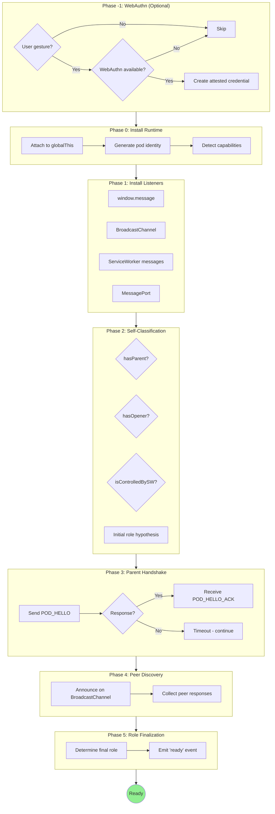
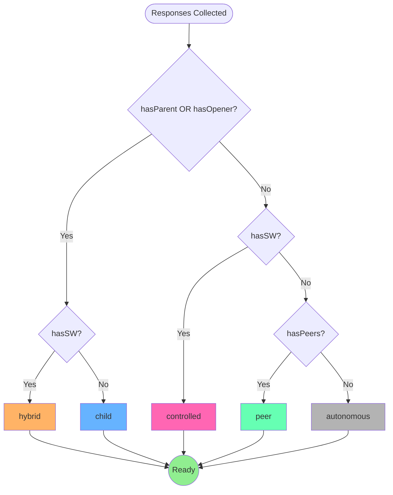

# Boot Sequence

Topology-agnostic boot protocol for BrowserMesh pods.

**Related specs**: [pod-types.md](pod-types.md) | [identity-keys.md](../crypto/identity-keys.md) | [webauthn-identity.md](../crypto/webauthn-identity.md) | [wire-format.md](wire-format.md)

## 1. Overview

The boot sequence enables pods to:
- Discover their topology at runtime
- Establish relationships with parents/peers
- Converge on optimal roles
- Remain functional in any configuration

## 2. Design Principles

1. **Listen first, then announce** — Install handlers before sending messages
2. **Never assume intent** — Treat all messages as proposals
3. **Topology-agnostic** — Work in any configuration
4. **Graceful degradation** — Function even if discovery fails

## 3. Boot Phases



## 4. Phase -1: WebAuthn (Optional)

An optional phase for user-initiated pod creation that provides hardware-backed identity attestation. See [webauthn-identity.md](../crypto/webauthn-identity.md) for full details.

```typescript
interface PodBootOptions {
  // Enable WebAuthn if available (default: false)
  webauthn?: boolean | {
    required?: boolean;                    // Fail if unavailable
    rp?: { id: string; name: string };     // Relying party
    credentialId?: Uint8Array;             // Restore existing
  };
}

// WebAuthn eligibility
function isWebAuthnEligible(): boolean {
  return (
    typeof window !== 'undefined' &&              // Window context
    typeof PublicKeyCredential !== 'undefined' && // WebAuthn API
    hasUserGesture()                              // User interaction
  );
}
```

| Pod Type | WebAuthn Eligible | Reason |
|----------|-------------------|--------|
| WindowPod (user-opened) | ✅ Yes | User gesture available |
| WindowPod (spawned) | ❌ No | No user gesture |
| FramePod | ❌ No | Derives from parent |
| WorkerPod | ❌ No | No WebAuthn access |
| SharedWorkerPod | ❌ No | No WebAuthn access |
| ServiceWorkerPod | ❌ No | No WebAuthn access |

If WebAuthn succeeds, the resulting attestation is attached to the pod identity created in Phase 0. If it fails or is skipped, boot continues with software-only keys.

```typescript
/**
 * Attempt WebAuthn-backed identity creation
 * Returns null if unavailable or user declines
 */
async function tryWebAuthnIdentity(
  options: boolean | PodBootOptions['webauthn']
): Promise<{ identity: PodIdentity; attestation: WebAuthnAttestation } | null> {
  // Normalize options
  const opts = typeof options === 'boolean'
    ? {}
    : options ?? {};

  // Check availability
  if (!isWebAuthnEligible()) {
    if (opts.required) {
      throw new BootError('WEBAUTHN_UNAVAILABLE', 'WebAuthn required but not available', -1);
    }
    return null;
  }

  try {
    // Restoring existing credential
    if (opts.credentialId) {
      const result = await restoreAttestedIdentity({
        challenge: crypto.getRandomValues(new Uint8Array(32)),
        rpId: opts.rp?.id ?? location.hostname,
        allowCredentials: [{
          type: 'public-key',
          id: opts.credentialId,
        }],
      }, await loadStoredIdentity());

      return {
        identity: result.identity,
        attestation: {
          authenticatorData: result.webauthnAssertion.authenticatorData,
          clientDataJSON: result.webauthnAssertion.clientDataJSON,
          attestationObject: new Uint8Array(0), // Not available for assertions
        },
      };
    }

    // Creating new attested identity
    const result = await createAttestedIdentity({
      challenge: crypto.getRandomValues(new Uint8Array(32)),
      rp: opts.rp ?? {
        id: location.hostname,
        name: document.title || 'BrowserMesh Pod',
      },
      user: opts.user,
      extensions: opts.usePrf ? { prf: { eval: { first: crypto.getRandomValues(new Uint8Array(32)) } } } : undefined,
    });

    return {
      identity: result.identity,
      attestation: result.attestation,
    };
  } catch (err) {
    if (opts.required) {
      throw new BootError('WEBAUTHN_FAILED', (err as Error).message, -1);
    }
    console.warn('WebAuthn failed, falling back to software keys:', err);
    return null;
  }
}

/**
 * Check if a user gesture is currently available
 * Required for WebAuthn operations
 */
function hasUserGesture(): boolean {
  // This is a heuristic - in practice, the browser will reject
  // WebAuthn operations without a gesture, which we handle via try/catch
  return document.hasFocus?.() ?? false;
}

/**
 * Load stored identity from IndexedDB/localStorage
 * Used when restoring an existing WebAuthn-backed identity
 */
async function loadStoredIdentity(): Promise<StoredPodIdentity | null> {
  const STORAGE_KEY = 'pod:identity';
  const stored = localStorage.getItem(STORAGE_KEY);
  if (!stored) return null;
  return JSON.parse(stored);
}
```

## 5. Phase 0: Install Runtime

```typescript
const POD = Symbol.for('pod.runtime');

interface PodInfo {
  id: string;                        // Self-certifying pod ID
  kind: PodKind;                     // See pod-types.md
  origin: string;                    // Window origin or 'opaque'
  createdAt: number;                 // performance.timeOrigin
  attested: boolean;                 // True if WebAuthn-attested identity
}

interface PodRuntime {
  info: PodInfo;
  identity: PodIdentity;             // See identity-keys.md
  credentials: PodCredentialsContainer;  // Credentials API (identity-keys.md)
  capabilities: PodCapabilities;     // See pod-types.md
  peers: Map<string, PeerInfo>;
  role: PodRole;
  state: 'booting' | 'discovering' | 'ready' | 'error' | 'shutdown';
  attestation?: WebAuthnAttestation; // If attested, see webauthn-identity.md
  sessionManager?: SessionManager;   // Session crypto manager (session-keys.md)
  discoveryChannel?: BroadcastChannel;  // Same-origin peer discovery

  // Event emitter methods
  on(event: string, handler: Function): void;
  off(event: string, handler: Function): void;
  emit(event: string, payload?: unknown): void;
}

/**
 * Full boot options including WebAuthn support
 * See webauthn-identity.md for WebAuthnCreationOptions details
 */
interface PodBootOptions {
  // Enable WebAuthn if available (default: false)
  webauthn?: boolean | {
    required?: boolean;                    // Fail if unavailable
    rp?: { id: string; name: string };     // Relying party
    user?: { id: Uint8Array; name: string; displayName: string };
    credentialId?: Uint8Array;             // Restore existing credential
    usePrf?: boolean;                      // Use PRF for key encryption
  };
}

async function installPodRuntime(
  global: typeof globalThis,
  options: PodBootOptions = {}
): Promise<PodRuntime> {
  // Check if already installed
  if (global[POD]) {
    return global[POD];
  }

  let identity: PodIdentity;
  let attestation: WebAuthnAttestation | undefined;

  // Phase -1: Optional WebAuthn (see webauthn-identity.md)
  if (options.webauthn && isWebAuthnEligible()) {
    const result = await tryWebAuthnIdentity(options.webauthn);
    if (result) {
      identity = result.identity;
      attestation = result.attestation;
    }
  }

  // Phase 0: Generate identity if not from WebAuthn
  if (!identity!) {
    identity = await PodIdentity.create();
  }

  // Detect environment
  const info: PodInfo = {
    id: identity.podId,
    kind: detectPodKind(global),
    origin: location?.origin ?? 'opaque',
    createdAt: performance.timeOrigin,
    attested: !!attestation,
  };

  // Detect capabilities
  const capabilities = detectCapabilities();

  // Create credentials container
  const credentials = createCredentialsContainer(identity, attestation);

  // Create runtime
  const runtime: PodRuntime = {
    info,
    identity,
    credentials,
    capabilities,
    peers: new Map(),
    role: 'autonomous',
    state: 'booting',
    attestation,
  };

  global[POD] = runtime;
  return runtime;
}

/**
 * Detect runtime capabilities based on environment
 */
function detectCapabilities(): PodCapabilities {
  const kind = detectPodKind(globalThis);

  // Base capabilities all pods have
  const caps: PodCapabilities = {
    // Communication
    postMessage: true,
    broadcastChannel: typeof BroadcastChannel !== 'undefined',
    serviceWorker: 'serviceWorker' in navigator,
    sharedWorker: typeof SharedWorker !== 'undefined',

    // Storage
    indexedDB: typeof indexedDB !== 'undefined',
    localStorage: typeof localStorage !== 'undefined',
    sessionStorage: typeof sessionStorage !== 'undefined',
    cacheAPI: typeof caches !== 'undefined',

    // Crypto
    webCrypto: typeof crypto?.subtle !== 'undefined',
    ed25519: true,  // As of 2025, always available
    x25519: true,

    // Network
    fetch: typeof fetch !== 'undefined',
    webSocket: typeof WebSocket !== 'undefined',
    webRTC: typeof RTCPeerConnection !== 'undefined',
    webTransport: typeof WebTransport !== 'undefined',

    // Execution context
    dom: typeof document !== 'undefined',
    canvas: typeof HTMLCanvasElement !== 'undefined',
    offscreenCanvas: typeof OffscreenCanvas !== 'undefined',
    wasm: typeof WebAssembly !== 'undefined',
  };

  // Context-specific restrictions
  if (kind === 'worker' || kind === 'shared-worker' || kind === 'service-worker') {
    caps.dom = false;
    caps.localStorage = false;
    caps.sessionStorage = false;
  }

  if (kind === 'service-worker') {
    caps.webRTC = false;  // Not available in SW
  }

  return caps;
}

/**
 * Detect the kind of pod based on global context
 */
function detectPodKind(global: typeof globalThis): PodKind {
  // Service Worker
  if (typeof ServiceWorkerGlobalScope !== 'undefined' &&
      global instanceof ServiceWorkerGlobalScope) {
    return 'service-worker';
  }

  // Shared Worker
  if (typeof SharedWorkerGlobalScope !== 'undefined' &&
      global instanceof SharedWorkerGlobalScope) {
    return 'shared-worker';
  }

  // Dedicated Worker
  if (typeof DedicatedWorkerGlobalScope !== 'undefined' &&
      global instanceof DedicatedWorkerGlobalScope) {
    return 'worker';
  }

  // Window contexts
  if (typeof Window !== 'undefined' && global instanceof Window) {
    // Check if iframe
    if (window.parent !== window && window.top !== window) {
      return 'iframe';
    }

    // Check if spawned (opened by another window)
    if (window.opener) {
      return 'spawned';
    }

    // Top-level window
    return 'window';
  }

  // Unknown context
  return 'unknown';
}
```

## 6. Phase 1: Install Listeners

```typescript
function installListeners(runtime: PodRuntime): void {
  const kind = runtime.info.kind;

  // A. Window message listener (windows, iframes)
  if (kind === 'window' || kind === 'iframe' || kind === 'spawned') {
    self.addEventListener('message', (e) => {
      handleMessage(runtime, e.data, e.source, e.origin);
    });
  }

  // B. BroadcastChannel (same-origin discovery)
  if (typeof BroadcastChannel !== 'undefined') {
    runtime.discoveryChannel = new BroadcastChannel('pod:discovery');
    runtime.discoveryChannel.onmessage = (e) => {
      handleBroadcast(runtime, e.data);
    };
  }

  // C. Service Worker messages
  if (navigator.serviceWorker?.controller) {
    navigator.serviceWorker.addEventListener('message', (e) => {
      handleMessage(runtime, e.data, null, location.origin);
    });
  }

  // D. Worker-specific: message from creator
  if (kind === 'worker' || kind === 'shared-worker') {
    self.onmessage = (e) => {
      handleMessage(runtime, e.data, e.source, null);
    };
  }

  // E. SharedWorker: connection handler
  if (kind === 'shared-worker') {
    self.onconnect = (e) => {
      const port = e.ports[0];
      handleConnection(runtime, port);
    };
  }
}
```

## 7. Phase 2: Self-Classification

```typescript
interface BootContext {
  hasParent: boolean;
  hasOpener: boolean;
  isTopLevel: boolean;
  isControlledBySW: boolean;
  isCrossOrigin: boolean;
}

function classifySelf(global: typeof globalThis): BootContext {
  const isWindow = typeof Window !== 'undefined' &&
                   global instanceof Window;

  let hasParent = false;
  let hasOpener = false;
  let isCrossOrigin = false;

  if (isWindow) {
    hasParent = window.parent !== window;
    hasOpener = !!window.opener;

    if (hasParent) {
      try {
        // Test same-origin access
        void window.parent.location.href;
      } catch {
        isCrossOrigin = true;
      }
    }
  }

  return {
    hasParent,
    hasOpener,
    isTopLevel: isWindow && window.top === window,
    isControlledBySW: !!navigator?.serviceWorker?.controller,
    isCrossOrigin,
  };
}
```

## 8. Phase 3: Parent Handshake

```typescript
interface PodHello {
  type: 'POD_HELLO';
  version: 1;
  podId: string;
  kind: PodKind;
  publicKey: Uint8Array;      // Ed25519 identity key (see identity-keys.md)
  capabilities: PodCapabilities;
  timestamp: number;
  signature: Uint8Array;
  attestationProof?: {        // Optional WebAuthn attestation (see webauthn-identity.md)
    credentialId: Uint8Array;
    authenticatorData: Uint8Array;
    clientDataHash: Uint8Array;
  };
}

interface PodHelloAck {
  type: 'POD_HELLO_ACK';
  version: 1;
  podId: string;
  kind: PodKind;
  publicKey: Uint8Array;
  capabilities: PodCapabilities;
  role: 'parent' | 'peer' | 'controller';
  accepted: boolean;
  timestamp: number;
  signature: Uint8Array;
}

async function parentHandshake(runtime: PodRuntime): Promise<void> {
  const ctx = classifySelf(globalThis);
  const hello = await createHello(runtime);

  runtime.pendingHandshakes = new Set();

  // A. Contact parent (iframe)
  if (ctx.hasParent) {
    window.parent.postMessage(hello, '*');
    runtime.pendingHandshakes.add('parent');
  }

  // B. Contact opener (spawned window)
  if (ctx.hasOpener) {
    window.opener.postMessage(hello, '*');
    runtime.pendingHandshakes.add('opener');
  }

  // C. Contact Service Worker
  if (ctx.isControlledBySW) {
    navigator.serviceWorker.controller!.postMessage(hello);
    runtime.pendingHandshakes.add('sw');
  }

  // Wait for responses (with timeout)
  await waitForResponses(runtime, HANDSHAKE_TIMEOUT);
}

async function createHello(runtime: PodRuntime): Promise<PodHello> {
  const publicKey = await runtime.identity.getPublicKey();
  const timestamp = Date.now();

  const payload = cbor.encode({
    type: 'POD_HELLO',
    version: 1,
    podId: runtime.info.id,
    kind: runtime.info.kind,
    publicKey,
    capabilities: runtime.capabilities,
    timestamp,
  });

  const signature = await runtime.identity.sign(payload);

  return {
    type: 'POD_HELLO',
    version: 1,
    podId: runtime.info.id,
    kind: runtime.info.kind,
    publicKey,
    capabilities: runtime.capabilities,
    timestamp,
    signature,
  };
}
```

## 9. Phase 4: Peer Discovery

```typescript
async function peerDiscovery(runtime: PodRuntime): Promise<void> {
  if (!runtime.discoveryChannel) return;

  const hello = await createHello(runtime);

  // Announce to all same-origin pods
  runtime.discoveryChannel.postMessage(hello);

  // Collect responses
  await waitForDiscovery(runtime, DISCOVERY_TIMEOUT);
}

function handleBroadcast(runtime: PodRuntime, data: unknown): void {
  if (!isPodMessage(data)) return;

  if (data.type === 'POD_HELLO') {
    handlePeerHello(runtime, data);
  } else if (data.type === 'POD_HELLO_ACK') {
    handlePeerAck(runtime, data);
  }
}

async function handlePeerHello(
  runtime: PodRuntime,
  hello: PodHello
): Promise<void> {
  // Verify signature
  if (!await verifyHello(hello)) {
    return;  // Invalid, ignore
  }

  // Verify Pod ID derivation: podId must equal base64url(SHA-256(publicKey))
  const expectedPodId = base64urlEncode(await sha256(hello.publicKey));
  if (hello.podId !== expectedPodId) {
    return;  // Pod ID does not match public key
  }

  // Don't respond to self
  if (hello.podId === runtime.info.id) return;

  // Register peer
  runtime.peers.set(hello.podId, {
    info: {
      id: hello.podId,
      kind: hello.kind,
      publicKey: hello.publicKey,
    },
    capabilities: hello.capabilities,
    relationship: 'peer',
    connectedAt: Date.now(),
  });

  // Send acknowledgment
  const ack = await createAck(runtime, hello.podId, 'peer');
  runtime.discoveryChannel?.postMessage(ack);

  runtime.emit('peer:discovered', runtime.peers.get(hello.podId));
}
```

## 10. Phase 5: Role Finalization

```typescript
type PodRole =
  | 'autonomous'   // No parent, operates independently
  | 'child'        // Has responding parent/opener
  | 'peer'         // Part of peer mesh
  | 'controlled'   // Managed by Service Worker
  | 'hybrid';      // Multiple relationships

function determineRole(runtime: PodRuntime): PodRole {
  const responses = runtime.handshakeResponses;

  const hasParent = responses.has('parent');
  const hasOpener = responses.has('opener');
  const hasSW = responses.has('sw');
  const hasPeers = runtime.peers.size > 0;

  // Multiple relationships
  if ((hasParent || hasOpener) && hasSW) {
    return 'hybrid';
  }

  // Child of parent/opener
  if (hasParent || hasOpener) {
    return 'child';
  }

  // Controlled by SW
  if (hasSW) {
    return 'controlled';
  }

  // Part of peer mesh
  if (hasPeers) {
    return 'peer';
  }

  // No relationships established
  return 'autonomous';
}

function finalizeRole(runtime: PodRuntime): void {
  runtime.role = determineRole(runtime);
  runtime.state = 'ready';

  runtime.emit('ready', {
    podId: runtime.info.id,
    kind: runtime.info.kind,
    role: runtime.role,
    peers: runtime.peers.size,
  });
}
```

### Role Determination Flow



## 11. Configuration

```typescript
const BOOT_CONFIG = {
  // Timeouts
  handshakeTimeout: 1000,    // 1s for parent/opener response
  discoveryTimeout: 2000,    // 2s for peer discovery
  totalTimeout: 5000,        // 5s max boot time

  // Retry
  maxRetries: 3,
  retryDelay: 500,

  // Channels
  discoveryChannelName: 'pod:discovery',

  // Version
  protocolVersion: 1,
};
```

## 12. Error Handling

```typescript
class BootError extends Error {
  constructor(
    readonly code: BootErrorCode,
    message: string,
    readonly phase: number
  ) {
    super(message);
    this.name = 'BootError';
  }
}

type BootErrorCode =
  | 'IDENTITY_FAILED'
  | 'LISTENER_FAILED'
  | 'HANDSHAKE_TIMEOUT'
  | 'DISCOVERY_TIMEOUT'
  | 'SIGNATURE_INVALID'
  | 'VERSION_MISMATCH'
  | 'WEBAUTHN_UNAVAILABLE'   // WebAuthn required but not available
  | 'WEBAUTHN_FAILED';       // WebAuthn operation failed

async function bootWithRetry(runtime: PodRuntime): Promise<void> {
  for (let attempt = 0; attempt < BOOT_CONFIG.maxRetries; attempt++) {
    try {
      await parentHandshake(runtime);
      await peerDiscovery(runtime);
      finalizeRole(runtime);
      return;
    } catch (err) {
      if (attempt === BOOT_CONFIG.maxRetries - 1) {
        // Final attempt failed, go autonomous
        runtime.role = 'autonomous';
        runtime.state = 'ready';
        runtime.emit('ready', {
          podId: runtime.info.id,
          role: 'autonomous',
          degraded: true,
          error: err,
        });
        return;
      }
      await sleep(BOOT_CONFIG.retryDelay);
    }
  }
}
```

## 13. Message Validation

```typescript
function isPodMessage(data: unknown): data is PodHello | PodHelloAck | PodGoodbye {
  if (typeof data !== 'object' || data === null) return false;

  const msg = data as Record<string, unknown>;

  return (
    (msg.type === 'POD_HELLO' || msg.type === 'POD_HELLO_ACK' || msg.type === 'POD_GOODBYE') &&
    msg.version === BOOT_CONFIG.protocolVersion &&
    typeof msg.podId === 'string' &&
    msg.publicKey instanceof Uint8Array &&
    msg.signature instanceof Uint8Array
  );
}

async function verifyHello(hello: PodHello): Promise<boolean> {
  // Reconstruct signed payload
  const payload = cbor.encode({
    type: hello.type,
    version: hello.version,
    podId: hello.podId,
    kind: hello.kind,
    publicKey: hello.publicKey,
    capabilities: hello.capabilities,
    timestamp: hello.timestamp,
  });

  // Verify signature
  const publicKey = await PodKeyStore.importEd25519PublicKey(hello.publicKey);
  return PodSigner.verify(publicKey, payload, hello.signature);
}
```

## 14. Full Example

```typescript
import { installPodRuntime } from '@browsermesh/runtime';

// Boot the pod
const pod = await installPodRuntime(globalThis);

// Wait for ready
pod.on('ready', ({ role, peers, degraded }) => {
  console.log(`Pod ${pod.info.id} ready`);
  console.log(`  Kind: ${pod.info.kind}`);
  console.log(`  Role: ${role}`);
  console.log(`  Peers: ${peers}`);

  if (degraded) {
    console.warn('Running in degraded mode');
  }
});

// Handle peer events
pod.on('peer:discovered', (peer) => {
  console.log(`Discovered peer: ${peer.info.id}`);
});

pod.on('peer:lost', (peer) => {
  console.log(`Lost peer: ${peer.info.id}`);
});

// Handle errors
pod.on('error', (err) => {
  console.error('Pod error:', err);
});
```

## 15. Lifecycle Events

| Event | Payload | When |
|-------|---------|------|
| `ready` | `{ role, peers, degraded? }` | Boot complete |
| `peer:discovered` | `PeerInfo` | New peer found |
| `peer:lost` | `PeerInfo` | Peer disconnected |
| `parent:connected` | `PeerInfo` | Parent acknowledged |
| `parent:lost` | `PeerInfo` | Parent gone |
| `shutdown` | `{ reason }` | Pod shutting down |
| `error` | `Error` | Boot or runtime error |

## 16. Shutdown

Clean shutdown for pod runtime. Releases resources and notifies peers.

```typescript
interface ShutdownOptions {
  // Reason for shutdown
  reason?: 'user' | 'navigation' | 'error' | 'idle';

  // Notify peers before shutdown
  notifyPeers?: boolean;

  // Timeout for peer notifications (ms)
  notifyTimeout?: number;

  // Clear stored credentials
  clearCredentials?: boolean;
}

/**
 * Gracefully shutdown the pod runtime
 */
async function shutdownPodRuntime(
  runtime: PodRuntime,
  options: ShutdownOptions = {}
): Promise<void> {
  const {
    reason = 'user',
    notifyPeers = true,
    notifyTimeout = 1000,
    clearCredentials = false,
  } = options;

  // Already shutdown
  if (runtime.state === 'shutdown') {
    return;
  }

  runtime.state = 'shutdown';

  // Notify peers of impending shutdown
  if (notifyPeers && runtime.peers.size > 0) {
    const goodbye = await createGoodbye(runtime, reason);

    const notifyPromises = Array.from(runtime.peers.values()).map(async (peer) => {
      try {
        await sendToPeer(peer, goodbye, notifyTimeout);
      } catch {
        // Ignore failures - we're shutting down anyway
      }
    });

    // Wait for notifications with timeout
    await Promise.race([
      Promise.allSettled(notifyPromises),
      sleep(notifyTimeout),
    ]);
  }

  // Close all sessions
  if (runtime.sessionManager) {
    runtime.sessionManager.closeAll();
  }

  // Close discovery channel
  if (runtime.discoveryChannel) {
    runtime.discoveryChannel.close();
    runtime.discoveryChannel = undefined;
  }

  // Clear peer list
  runtime.peers.clear();

  // Optionally clear stored credentials
  if (clearCredentials) {
    await runtime.credentials.delete({
      id: runtime.identity.podId,
    });
  }

  // Emit shutdown event
  runtime.emit('shutdown', { reason });

  // Remove from global
  delete globalThis[POD];
}

interface PodGoodbye {
  type: 'POD_GOODBYE';
  podId: string;
  reason: string;
  timestamp: number;
  signature: Uint8Array;
}

async function createGoodbye(
  runtime: PodRuntime,
  reason: string
): Promise<PodGoodbye> {
  const timestamp = Date.now();

  const payload = cbor.encode({
    type: 'POD_GOODBYE',
    podId: runtime.info.id,
    reason,
    timestamp,
  });

  const signature = await runtime.identity.sign(payload);

  return {
    type: 'POD_GOODBYE',
    podId: runtime.info.id,
    reason,
    timestamp,
    signature,
  };
}

// Usage
pod.on('beforeunload', () => {
  shutdownPodRuntime(pod, { reason: 'navigation' });
});

// Or explicit shutdown
await shutdownPodRuntime(pod, {
  reason: 'user',
  notifyPeers: true,
  clearCredentials: false,
});
```

## 17. Receiving POD_GOODBYE

When a peer sends `POD_GOODBYE`, the receiving pod must clean up the peer's state.

```typescript
async function handleGoodbye(
  runtime: PodRuntime,
  goodbye: PodGoodbye
): Promise<void> {
  // Verify signature
  const peer = runtime.peers.get(goodbye.podId);
  if (!peer) return;  // Unknown peer, ignore

  const payload = cbor.encode({
    type: goodbye.type,
    podId: goodbye.podId,
    reason: goodbye.reason,
    timestamp: goodbye.timestamp,
  });

  const publicKey = await PodKeyStore.importEd25519PublicKey(peer.info.publicKey);
  const valid = await PodSigner.verify(publicKey, payload, goodbye.signature);

  if (!valid) return;  // Invalid signature, ignore

  // Close session with departing peer
  if (runtime.sessionManager) {
    runtime.sessionManager.closeSession(goodbye.podId);
  }

  // Remove from peer list
  runtime.peers.delete(goodbye.podId);

  // Emit peer:lost event
  runtime.emit('peer:lost', peer);

  // Send acknowledgment (best-effort)
  try {
    const ack = {
      type: 'GOODBYE_ACK',
      podId: runtime.info.id,
      received: true,
      timestamp: Date.now(),
    };
    // Send via whatever channel we have to this peer
    await sendToPeer(peer, ack, 1000);
  } catch {
    // Peer may already be gone — ignore
  }
}
```

Wire the handler into the broadcast listener:

```typescript
function handleBroadcast(runtime: PodRuntime, data: unknown): void {
  if (!isPodMessage(data)) return;

  if (data.type === 'POD_HELLO') {
    handlePeerHello(runtime, data);
  } else if (data.type === 'POD_HELLO_ACK') {
    handlePeerAck(runtime, data);
  } else if (data.type === 'POD_GOODBYE') {
    handleGoodbye(runtime, data);
  }
}
```

**Cross-references**: After receiving a goodbye, the [presence protocol](../coordination/presence-protocol.md) should transition the peer to `offline`. If the pod is a session host, the [join protocol](../coordination/join-protocol.md) should handle re-join if the peer reconnects.

### Auto-Shutdown on Page Unload

```typescript
function installUnloadHandler(runtime: PodRuntime): void {
  if (typeof window !== 'undefined') {
    // Use pagehide for better mobile support
    window.addEventListener('pagehide', (event) => {
      // Don't clear credentials on normal navigation
      shutdownPodRuntime(runtime, {
        reason: 'navigation',
        notifyPeers: !event.persisted,  // Don't notify if page is cached
        clearCredentials: false,
      });
    });

    // Handle visibility changes (e.g., tab backgrounded)
    document.addEventListener('visibilitychange', () => {
      if (document.visibilityState === 'hidden') {
        runtime.emit('visibility:hidden');
      } else {
        runtime.emit('visibility:visible');
      }
    });
  }
}
```
