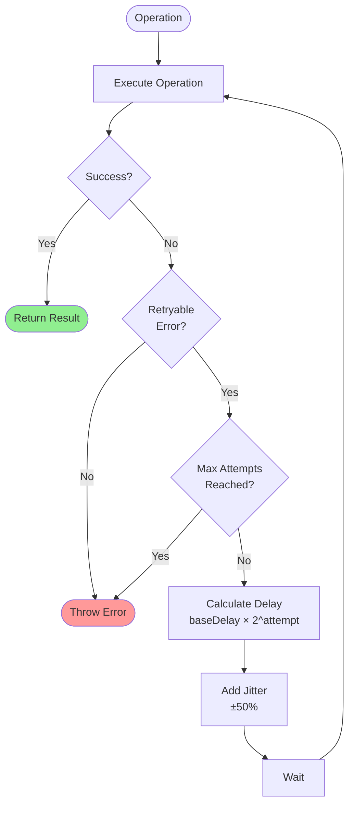
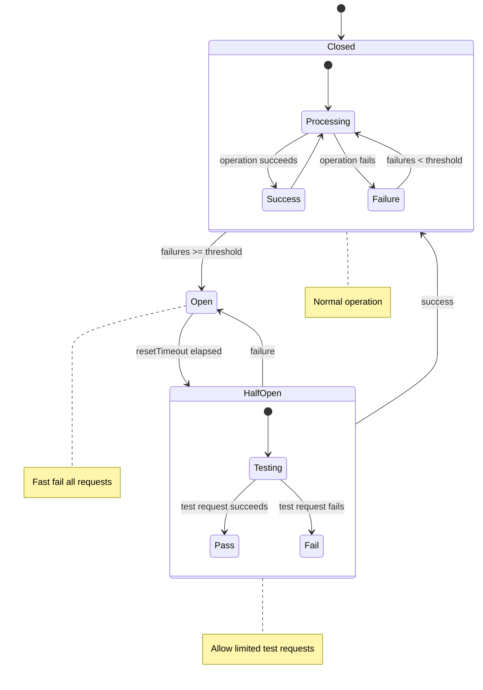

# Error Handling

Error codes, recovery procedures, and failure modes for BrowserMesh.

**Related specs**: [wire-format.md](wire-format.md) | [session-keys.md](../crypto/session-keys.md) | [message-envelope.md](../networking/message-envelope.md)

## 1. Error Categories

| Category | Code Range | Description |
|----------|-----------|-------------|
| Protocol | `E1xx` | [Wire format](wire-format.md), version mismatch |
| Handshake | `E2xx` | [Authentication](../crypto/session-keys.md), key exchange |
| Routing | `E3xx` | Message delivery failures |
| Session | `E4xx` | Encryption, replay detection |
| Timeout | `E5xx` | Operation timeouts |
| Resource | `E6xx` | Quotas, limits exceeded |
| Application | `E9xx` | User-defined errors |

## 2. Error Structure

```typescript
interface PodError {
  code: string;           // e.g., "E201"
  category: ErrorCategory;
  message: string;        // Human-readable
  details?: unknown;      // Additional context
  retryable: boolean;     // Can operation be retried?
  retryAfter?: number;    // Suggested retry delay (ms)
}

type ErrorCategory =
  | 'protocol'
  | 'handshake'
  | 'routing'
  | 'session'
  | 'timeout'
  | 'resource'
  | 'application';

class BrowserMeshError extends Error {
  constructor(
    readonly code: string,
    message: string,
    readonly details?: unknown
  ) {
    super(`[${code}] ${message}`);
    this.name = 'BrowserMeshError';
  }

  get category(): ErrorCategory {
    const prefix = this.code.charAt(1);
    const categories: Record<string, ErrorCategory> = {
      '1': 'protocol',
      '2': 'handshake',
      '3': 'routing',
      '4': 'session',
      '5': 'timeout',
      '6': 'resource',
      '9': 'application',
    };
    return categories[prefix] ?? 'application';
  }

  get retryable(): boolean {
    // Timeout and some routing errors are retryable
    return this.code.startsWith('E5') ||
           this.code === 'E301' ||
           this.code === 'E302';
  }

  toJSON(): PodError {
    return {
      code: this.code,
      category: this.category,
      message: this.message,
      details: this.details,
      retryable: this.retryable,
    };
  }
}
```

## 3. Error Codes

### Protocol Errors (E1xx)

| Code | Name | Description | Action |
|------|------|-------------|--------|
| E101 | VERSION_MISMATCH | Incompatible protocol version | Abort, notify user |
| E102 | INVALID_MESSAGE | Malformed message | Drop message |
| E103 | UNKNOWN_TYPE | Unknown message type | Drop message |
| E104 | DECODE_FAILED | CBOR decode error | Drop message |
| E105 | SIZE_EXCEEDED | Message too large | Reject, use streaming |

### Handshake Errors (E2xx)

| Code | Name | Description | Action |
|------|------|-------------|--------|
| E201 | SIGNATURE_INVALID | Bad signature | Abort handshake |
| E202 | TIMESTAMP_EXPIRED | Stale handshake message | Retry with fresh |
| E203 | KEY_REJECTED | Peer rejected our key | Check peer policy |
| E204 | CAPS_INCOMPATIBLE | No compatible channels | Try different peer |
| E205 | IDENTITY_MISMATCH | Pod ID doesn't match key | Security violation |
| E206 | HANDSHAKE_TIMEOUT | No response | Retry or abort |

### Routing Errors (E3xx)

| Code | Name | Description | Action |
|------|------|-------------|--------|
| E301 | PEER_UNREACHABLE | Cannot route to peer | Retry via different path |
| E302 | ROUTE_FAILED | Routing path broken | Retry |
| E303 | TTL_EXCEEDED | Too many hops | Use shorter path |
| E304 | NO_ROUTE | No path to destination | Wait for discovery |
| E305 | PEER_GONE | Peer disconnected | Remove from peers |

### Session Errors (E4xx)

| Code | Name | Description | Action |
|------|------|-------------|--------|
| E401 | DECRYPT_FAILED | Decryption error | Request re-key |
| E402 | REPLAY_DETECTED | Nonce reuse | Drop message |
| E403 | SESSION_EXPIRED | Key rotation needed | Re-handshake |
| E404 | NOT_AUTHENTICATED | No session established | Handshake first |

### Timeout Errors (E5xx)

| Code | Name | Description | Action |
|------|------|-------------|--------|
| E501 | REQUEST_TIMEOUT | Request not answered | Retry or abort |
| E502 | STREAM_TIMEOUT | Stream stalled | Cancel stream |
| E503 | HANDSHAKE_TIMEOUT | Handshake incomplete | Retry |
| E504 | DISCOVERY_TIMEOUT | No peers found | Continue as autonomous |

### Resource Errors (E6xx)

| Code | Name | Description | Action |
|------|------|-------------|--------|
| E601 | QUOTA_EXCEEDED | Resource limit hit | Backoff |
| E602 | RATE_LIMITED | Too many requests | Retry after delay |
| E603 | MEMORY_PRESSURE | Low memory | Reduce load |
| E604 | STORAGE_FULL | IndexedDB full | Clean up |

## 4. Error Responses

### Wire Format

```typescript
interface ErrorResponse {
  t: MessageType.ERROR;
  p: {
    reqId?: Uint8Array;    // Request that caused error
    code: string;
    message: string;
    details?: unknown;
    retryAfter?: number;
  };
}
```

### Sending Errors

```typescript
function sendError(
  ctx: MessageContext,
  code: string,
  message: string,
  details?: unknown
): void {
  const error: ErrorResponse = {
    v: 1,
    t: MessageType.ERROR,
    id: generateMessageId(),
    ts: Date.now(),
    src: ctx.localPodId,
    dst: ctx.remotePodId,
    p: {
      reqId: ctx.requestId,
      code,
      message,
      details,
    },
  };

  ctx.send(error);
}
```

## 5. Retry Strategy



```typescript
interface RetryConfig {
  maxAttempts: number;
  baseDelay: number;       // ms
  maxDelay: number;        // ms
  backoffFactor: number;
  jitter: boolean;
}

const DEFAULT_RETRY: RetryConfig = {
  maxAttempts: 3,
  baseDelay: 100,
  maxDelay: 5000,
  backoffFactor: 2,
  jitter: true,
};

async function withRetry<T>(
  operation: () => Promise<T>,
  config: RetryConfig = DEFAULT_RETRY
): Promise<T> {
  let lastError: Error | undefined;

  for (let attempt = 0; attempt < config.maxAttempts; attempt++) {
    try {
      return await operation();
    } catch (err) {
      lastError = err as Error;

      // Check if retryable
      if (err instanceof BrowserMeshError && !err.retryable) {
        throw err;
      }

      // Calculate delay
      let delay = config.baseDelay * Math.pow(config.backoffFactor, attempt);
      delay = Math.min(delay, config.maxDelay);

      if (config.jitter) {
        delay = delay * (0.5 + Math.random());
      }

      // Check for retryAfter hint
      if (err instanceof BrowserMeshError && err.details?.retryAfter) {
        delay = Math.max(delay, err.details.retryAfter);
      }

      await sleep(delay);
    }
  }

  throw lastError;
}
```

## 6. Circuit Breaker

Prevent cascading failures:



```typescript
interface CircuitBreakerConfig {
  failureThreshold: number;    // Failures before opening
  resetTimeout: number;        // Time before half-open (ms)
  halfOpenRequests: number;    // Test requests in half-open
}

class CircuitBreaker {
  private failures = 0;
  private lastFailure = 0;
  private state: 'closed' | 'open' | 'half-open' = 'closed';

  constructor(private config: CircuitBreakerConfig) {}

  async execute<T>(operation: () => Promise<T>): Promise<T> {
    if (this.state === 'open') {
      if (Date.now() - this.lastFailure > this.config.resetTimeout) {
        this.state = 'half-open';
      } else {
        throw new BrowserMeshError('E602', 'Circuit breaker open');
      }
    }

    try {
      const result = await operation();
      this.onSuccess();
      return result;
    } catch (err) {
      this.onFailure();
      throw err;
    }
  }

  private onSuccess(): void {
    this.failures = 0;
    this.state = 'closed';
  }

  private onFailure(): void {
    this.failures++;
    this.lastFailure = Date.now();

    if (this.failures >= this.config.failureThreshold) {
      this.state = 'open';
    }
  }
}
```

## 7. Graceful Degradation

```typescript
interface DegradedState {
  reason: string;
  capabilities: string[];      // Lost capabilities
  fallback: string;            // Alternative behavior
}

class PodRuntime {
  private degraded: DegradedState | null = null;

  enterDegradedMode(reason: string, lost: string[]): void {
    this.degraded = {
      reason,
      capabilities: lost,
      fallback: this.selectFallback(lost),
    };

    this.emit('degraded', this.degraded);
  }

  private selectFallback(lost: string[]): string {
    if (lost.includes('routing')) {
      return 'direct-only';       // Only direct peer connections
    }
    if (lost.includes('encryption')) {
      return 'plaintext';         // Fall back to plaintext
    }
    if (lost.includes('discovery')) {
      return 'static-peers';      // Use configured peers only
    }
    return 'autonomous';          // Operate independently
  }

  isCapabilityAvailable(cap: string): boolean {
    if (!this.degraded) return true;
    return !this.degraded.capabilities.includes(cap);
  }
}
```

## 8. Error Recovery

### Handshake Recovery

```typescript
async function recoverHandshake(
  peer: PeerInfo,
  error: BrowserMeshError
): Promise<void> {
  switch (error.code) {
    case 'E202':  // Timestamp expired
      // Retry with fresh timestamp
      await handshake(peer, { freshTimestamp: true });
      break;

    case 'E203':  // Key rejected
      // Generate new ephemeral key
      await handshake(peer, { newEphemeral: true });
      break;

    case 'E206':  // Timeout
      // Increase timeout and retry
      await handshake(peer, { timeout: DEFAULT_TIMEOUT * 2 });
      break;

    default:
      throw error;  // Unrecoverable
  }
}
```

### Session Recovery

```typescript
async function recoverSession(
  peer: PeerInfo,
  error: BrowserMeshError
): Promise<void> {
  switch (error.code) {
    case 'E401':  // Decrypt failed
    case 'E403':  // Session expired
      // Re-establish session
      await establishSession(peer);
      break;

    case 'E402':  // Replay detected
      // Log and continue (message was dropped)
      console.warn('Replay attack detected from', peer.id);
      break;

    default:
      throw error;
  }
}
```

## 9. Logging

```typescript
interface ErrorLog {
  timestamp: number;
  code: string;
  message: string;
  peerId?: string;
  requestId?: string;
  stack?: string;
}

class ErrorLogger {
  private logs: ErrorLog[] = [];
  private maxLogs = 1000;

  log(error: BrowserMeshError, context?: Partial<ErrorLog>): void {
    const log: ErrorLog = {
      timestamp: Date.now(),
      code: error.code,
      message: error.message,
      stack: error.stack,
      ...context,
    };

    this.logs.push(log);

    // Trim old logs
    if (this.logs.length > this.maxLogs) {
      this.logs = this.logs.slice(-this.maxLogs);
    }

    // Emit for monitoring
    this.emit('error', log);
  }

  getRecent(count: number = 10): ErrorLog[] {
    return this.logs.slice(-count);
  }

  getByCode(code: string): ErrorLog[] {
    return this.logs.filter(l => l.code === code);
  }
}
```

## 10. Error Handling Best Practices

### Do

1. **Always check error codes** before deciding on recovery
2. **Log all errors** with context for debugging
3. **Use circuit breakers** for external dependencies
4. **Implement graceful degradation** for non-critical features
5. **Set timeouts** on all async operations
6. **Provide retry hints** in error responses

### Don't

1. **Swallow errors silently** — always log or propagate
2. **Retry indefinitely** — use exponential backoff with limits
3. **Leak sensitive info** in error messages
4. **Block on recovery** — use async recovery paths
5. **Ignore rate limits** — respect retryAfter hints
