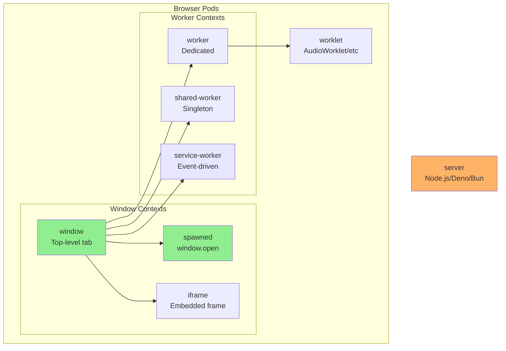
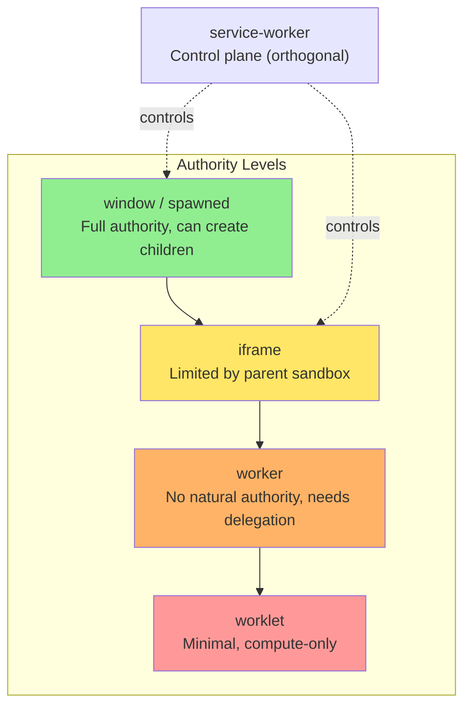

# Pod Types

Browser execution contexts that can run as BrowserMesh pods.

**Related specs**: [boot-sequence.md](boot-sequence.md) | [identity-keys.md](../crypto/identity-keys.md) | [manifest-format.md](../reference/manifest-format.md)

## 1. Overview

A **pod** is any browser execution context that can:
- Execute code
- Receive messages
- Be discovered/addressed

## 2. Pod Kinds



| Kind | Description | Autonomy | Lifecycle |
|------|-------------|----------|-----------|
| `window` | Top-level page (tab) | Full | User-controlled |
| `spawned` | `window.open()` result | Full | Independent |
| `iframe` | Embedded frame | Limited | Parent-controlled |
| `worker` | Dedicated Worker | None | Creator-controlled |
| `shared-worker` | SharedWorker | Singleton | Last-client-controlled |
| `service-worker` | Service Worker | Event-driven | Browser-controlled |
| `worklet` | AudioWorklet/etc | Minimal | Context-controlled |
| `server` | Server-side runtime | Full | Process-controlled |

## 3. Detection

```typescript
type PodKind =
  | 'window'
  | 'spawned'
  | 'iframe'
  | 'worker'
  | 'shared-worker'
  | 'service-worker'
  | 'worklet'
  | 'server';

function detectPodKind(global: typeof globalThis): PodKind {
  // Window contexts
  if (typeof Window !== 'undefined' && global instanceof Window) {
    if (global.parent !== global) return 'iframe';
    if (global.opener) return 'spawned';
    return 'window';
  }

  // Worker contexts
  if (typeof DedicatedWorkerGlobalScope !== 'undefined' &&
      global instanceof DedicatedWorkerGlobalScope) {
    return 'worker';
  }
  if (typeof SharedWorkerGlobalScope !== 'undefined' &&
      global instanceof SharedWorkerGlobalScope) {
    return 'shared-worker';
  }
  if (typeof ServiceWorkerGlobalScope !== 'undefined' &&
      global instanceof ServiceWorkerGlobalScope) {
    return 'service-worker';
  }

  // Worklet contexts
  if (typeof AudioWorkletGlobalScope !== 'undefined' &&
      global instanceof AudioWorkletGlobalScope) {
    return 'worklet';
  }

  // Server (Node.js/Deno/Bun)
  if (typeof process !== 'undefined' && process.versions?.node) {
    return 'server';
  }

  return 'window';  // Default fallback
}
```

## 4. Capability Matrix

### Legend

| Symbol | Meaning |
|--------|---------|
| ✅ | Native support |
| ⚠️ | Conditional (requires setup) |
| ❌ | Not available |
| 🧩 | Via bridge only |

### Messaging Channels

| Channel | window | spawned | iframe | worker | shared | sw | worklet |
|---------|--------|---------|--------|--------|--------|-----|---------|
| postMessage | ✅ | ✅ | ✅ | ✅ | ✅ | ✅ | ⚠️ |
| MessagePort | ✅ | ✅ | ✅ | ✅ | ✅ | ✅ | ✅ |
| BroadcastChannel | ✅ | ✅ | ✅ | ✅ | ✅ | ✅ | ❌ |
| SharedWorker | ✅ | ✅ | ✅ | ✅ | ✅ | ❌ | ❌ |
| SW messaging | ✅ | ✅ | ✅ | 🧩 | 🧩 | ✅ | ❌ |

### Network Channels

| Channel | window | spawned | iframe | worker | shared | sw | worklet |
|---------|--------|---------|--------|--------|--------|-----|---------|
| fetch | ✅ | ✅ | ✅ | ✅ | ✅ | ✅ | ❌ |
| WebSocket | ✅ | ✅ | ✅ | ✅ | ✅ | ✅ | ❌ |
| WebTransport | ✅ | ✅ | ✅ | ⚠️ | ⚠️ | ⚠️ | ❌ |
| WebRTC | ✅ | ✅ | ✅ | 🧩 | 🧩 | ❌ | ❌ |
| SSE | ✅ | ✅ | ✅ | 🧩 | 🧩 | ❌ | ❌ |

### Storage

| Channel | window | spawned | iframe | worker | shared | sw | worklet |
|---------|--------|---------|--------|--------|--------|-----|---------|
| IndexedDB | ✅ | ✅ | ✅ | ✅ | ✅ | ✅ | ❌ |
| Cache API | ✅ | ✅ | ✅ | ⚠️ | ⚠️ | ✅ | ❌ |
| OPFS | ⚠️ | ⚠️ | ⚠️ | ⚠️ | ⚠️ | ⚠️ | ❌ |
| localStorage | ✅ | ✅ | ✅ | ❌ | ❌ | ❌ | ❌ |

### Compute

| Channel | window | spawned | iframe | worker | shared | sw | worklet |
|---------|--------|---------|--------|--------|--------|-----|---------|
| WebAssembly | ✅ | ✅ | ✅ | ✅ | ✅ | ✅ | ✅ |
| SharedArrayBuffer | ⚠️ | ⚠️ | ⚠️ | ⚠️ | ⚠️ | ⚠️ | ⚠️ |
| OffscreenCanvas | ✅ | ✅ | ✅ | ✅ | ✅ | ❌ | ❌ |

## 5. Pod Type Details

### 5.1 WindowPod

Top-level browsing context (browser tab).

**Characteristics**:
- Full API access
- User-visible
- Can spawn other pods
- Receives focus events
- Subject to throttling when hidden

**Superpowers**:
- WebRTC (needs user interaction for some features)
- Fullscreen API
- Notifications
- All storage APIs

**Weaknesses**:
- User can close at any time
- Throttled in background

### 5.2 SpawnedPod

Window created via `window.open()`.

**Characteristics**:
- Independent lifecycle (can outlive opener)
- Has `opener` reference
- Can sever relationship (`opener = null`)
- Own permission surface

**Relationship to opener**:
```typescript
// Opener cannot forcibly close spawned window
// Spawned window can choose to respond or ignore opener
```

### 5.3 FramePod (iframe)

Embedded document inside another document.

**Characteristics**:
- Hierarchically subordinate to parent
- Can be sandboxed
- Lifecycle tied to parent DOM
- Cross-origin isolation possible

**Authority model**:
```typescript
// Parent can:
// - Remove iframe from DOM (kills pod)
// - Sandbox permissions
// - Control visibility

// iframe cannot:
// - Outlive parent
// - Escape sandbox
// - Override parent restrictions
```

### 5.4 WorkerPod

Dedicated Worker.

**Characteristics**:
- Single owner (creator)
- No natural addressability
- High compute priority
- No DOM access

**Key constraint**: Workers need a registry/relay to reach peers.

### 5.5 SharedWorkerPod

Shared singleton per origin.

**Characteristics**:
- One instance per origin + script URL
- Multiple clients connect
- Lives until last client disconnects
- Natural port hub

**Superpower**: Same-origin rendezvous and coordination.

```typescript
// SharedWorker maintains connections to all clients
self.onconnect = (e) => {
  const port = e.ports[0];
  // Now can broker between all connected clients
};
```

### 5.6 ServiceWorkerPod

Event-driven control plane.

**Characteristics**:
- Intercepts fetch requests
- Can wake on push/sync events
- Event-driven lifecycle (may sleep)
- Controls all same-origin pages

**Superpowers**:
- Request interception
- Client enumeration
- Background sync
- Push notifications

**Weaknesses**:
- Cannot maintain long-lived connections
- Browser may terminate at will

### 5.7 WorkletPod

Specialized compute context (AudioWorklet, etc).

**Characteristics**:
- Extremely restricted
- Real-time constraints (audio)
- Single communication channel (port)
- No async APIs

**Only reliable channel**: MessagePort passed at construction.

```typescript
// Main thread
const node = new AudioWorkletNode(ctx, 'processor');
node.port.postMessage({ type: 'INIT' });

// Worklet
class Processor extends AudioWorkletProcessor {
  constructor() {
    super();
    this.port.onmessage = (e) => { /* ... */ };
  }
}
```

## 6. Detailed Channel Notes

### Messaging Channels

| Channel | Notes |
|---------|-------|
| **postMessage** | Window/Frame: via parent/opener; Worker: via creator |
| **MessagePort** | Transfer ports anywhere you can message; ideal for established connections |
| **BroadcastChannel** | Same-origin only; cross-origin frames cannot join parent's channel |
| **SharedWorker** | Same-origin only; natural port hub for coordination |
| **SW messaging** | Same-origin scope + controlled clients; workers often need window relay |

### Network Channels

| Channel | Notes |
|---------|-------|
| **fetch** | Cross-origin via CORS; SW can intercept same-origin |
| **WebSocket** | Universal support; good for server relay |
| **WebTransport** | HTTP/3; support varies by browser and context |
| **WebRTC** | Needs signaling + permissions/ICE; tricky from workers |
| **SSE** | EventSource availability varies in workers; safest via window |

### Storage Channels

| Channel | Notes |
|---------|-------|
| **IndexedDB** | Same-origin; good API availability in workers |
| **Cache API** | Best in SW; worker support varies |
| **OPFS** | Support/quotas vary; permissions sometimes required |
| **localStorage** | Same-origin; only windows, not workers; legacy |

### Compute

| Channel | Notes |
|---------|-------|
| **SharedArrayBuffer** | Requires COOP/COEP cross-origin isolation headers |
| **OffscreenCanvas** | Available in windows and workers, not SW |

## 7. Cross-Origin Considerations

When pods are cross-origin, available channels collapse to:

| Channel | Cross-Origin |
|---------|--------------|
| postMessage | ✅ |
| fetch (CORS) | ✅ |
| WebSocket | ✅ (server-mediated) |
| WebTransport | ✅ (server-mediated) |
| WebRTC | ✅ (needs signaling) |
| Everything else | ❌ |

## 8. Capability Advertisement

See also: [pod-capability-schema.json](../reference/pod-capability-schema.json) for the JSON Schema.

```typescript
interface PodCapabilities {
  podId: string;
  kind: PodKind;
  origin: string;

  messaging: {
    postMessage: boolean;
    messagePort: boolean;
    broadcastChannel: boolean;
    sharedWorker: boolean;
    serviceWorker: boolean;
  };

  network: {
    fetch: boolean;
    webSocket: boolean;
    webTransport: boolean;
    webRTC: boolean;
  };

  storage: {
    indexedDB: boolean;
    cache: boolean;
    opfs: boolean;
  };

  compute: {
    wasm: boolean;
    sharedArrayBuffer: boolean;
    offscreenCanvas: boolean;
  };

  // Context-specific
  isSecureContext: boolean;
  crossOriginIsolated: boolean;
}

function detectCapabilities(): PodCapabilities {
  return {
    podId: getPodId(),
    kind: detectPodKind(globalThis),
    origin: location?.origin ?? 'opaque',

    messaging: {
      postMessage: typeof postMessage === 'function',
      messagePort: typeof MessageChannel !== 'undefined',
      broadcastChannel: typeof BroadcastChannel !== 'undefined',
      sharedWorker: typeof SharedWorker !== 'undefined',
      serviceWorker: 'serviceWorker' in navigator,
    },

    network: {
      fetch: typeof fetch === 'function',
      webSocket: typeof WebSocket !== 'undefined',
      webTransport: typeof WebTransport !== 'undefined',
      webRTC: typeof RTCPeerConnection !== 'undefined',
    },

    storage: {
      indexedDB: typeof indexedDB !== 'undefined',
      cache: typeof caches !== 'undefined',
      opfs: !!navigator?.storage?.getDirectory,
    },

    compute: {
      wasm: typeof WebAssembly !== 'undefined',
      sharedArrayBuffer: typeof SharedArrayBuffer !== 'undefined',
      offscreenCanvas: typeof OffscreenCanvas !== 'undefined',
    },

    isSecureContext: globalThis.isSecureContext ?? false,
    crossOriginIsolated: globalThis.crossOriginIsolated ?? false,
  };
}
```

## 9. Design Rules

### Minimum Viable Link

Every pod must support:
1. postMessage-compatible handshake, OR
2. MessagePort if passed at creation

### Channel Selection

```typescript
function selectChannel(local: PodCapabilities, remote: PodCapabilities): Channel {
  // Prefer MessagePort for established connections
  if (local.messaging.messagePort && remote.messaging.messagePort) {
    return 'messagePort';
  }

  // Use SharedArrayBuffer for high-throughput same-origin
  if (local.compute.sharedArrayBuffer && remote.compute.sharedArrayBuffer &&
      local.origin === remote.origin) {
    return 'sharedArrayBuffer';
  }

  // Use WebRTC for cross-device
  if (local.network.webRTC && remote.network.webRTC) {
    return 'webRTC';
  }

  // Fallback to postMessage
  return 'postMessage';
}
```

### Authority Hierarchy



Service Worker is orthogonal: control plane, not hierarchy.

## 10. Capability Scope Safety Matrix

This matrix maps scope namespaces (see [capability-scope-grammar.md](../crypto/capability-scope-grammar.md)) to pod kinds, indicating safety of granting each scope. Use this to validate capability grants at runtime.

| Scope Namespace | window | spawned | iframe | worker | shared-worker | service-worker | worklet | server |
|----------------|--------|---------|--------|--------|---------------|----------------|---------|--------|
| `data:*` | ✅ safe | ✅ safe | ✅ safe | ✅ safe | ✅ safe | ✅ safe | ⚠️ | ✅ safe |
| `canvas:*` | ✅ safe | ✅ safe | ✅ safe | ✅ safe | N/A | N/A | N/A | N/A |
| `compute:*` | ✅ safe | ✅ safe | ⚠️ | ✅ safe | ✅ safe | ⚠️ | N/A | ✅ safe |
| `compute:spawn` | ✅ safe | ✅ safe | ⚠️ | ✅ safe | ✅ safe | ❌ | N/A | ✅ safe |
| `storage:*` | ✅ safe | ✅ safe | ⚠️ | ✅ safe | ✅ safe | ✅ safe | N/A | ✅ safe |
| `game:*` | ✅ safe | ✅ safe | ✅ safe | ✅ safe | ✅ safe | ⚠️ | N/A | ✅ safe |
| `audio:*` | ✅ safe | ✅ safe | ⚠️ | ✅ safe | N/A | N/A | ✅ safe | N/A |
| `media:*` | ✅ safe | ✅ safe | ⚠️ | N/A | N/A | N/A | N/A | N/A |

**Legend**:
- ✅ **safe**: Scope is fully appropriate for this pod kind
- ⚠️ **caution**: Scope works but has caveats (sandbox restrictions, may sleep, limited APIs)
- ❌: Scope should not be granted (pod lacks required capabilities)
- **N/A**: Pod kind lacks the APIs needed for this scope namespace

Implementations **should** log a warning when granting scopes marked ⚠️ or N/A. See [capability-scope-grammar.md](../crypto/capability-scope-grammar.md) §9 for details.
