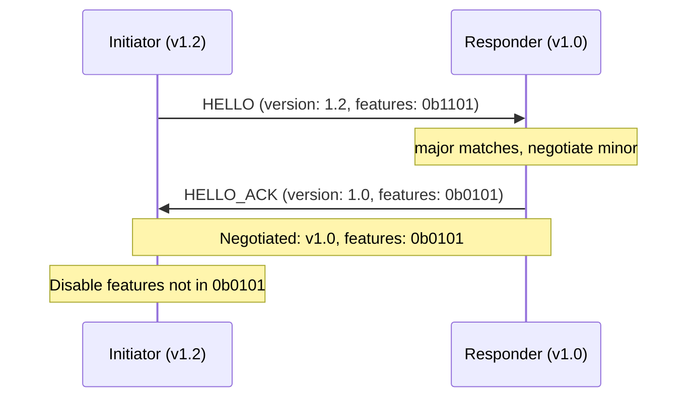
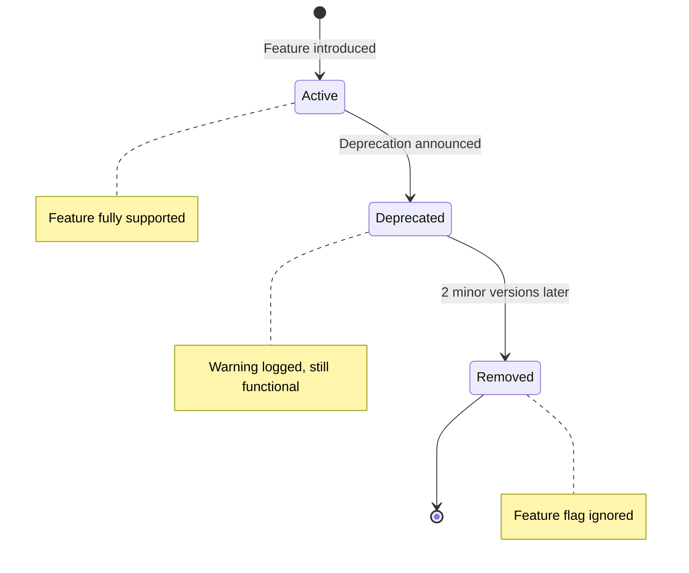

# Protocol Versioning

Version negotiation, feature flags, and migration paths for BrowserMesh.

**Related specs**: [wire-format.md](wire-format.md) | [boot-sequence.md](boot-sequence.md) | [session-keys.md](../crypto/session-keys.md)

## 1. Overview

The wire format's `MessageEnvelope` includes `v: 1` as a simple version marker, and `PodHello` uses a basic equality check. This spec extends versioning with:

- Major.minor version format
- Feature flag negotiation during handshake
- Deprecation lifecycle for protocol changes
- Migration helpers for version transitions

## 2. Version Format

```typescript
interface ProtocolVersion {
  major: number;   // Breaking changes
  minor: number;   // Backwards-compatible additions
}

/** Current protocol version */
const PROTOCOL_VERSION: ProtocolVersion = { major: 1, minor: 0 };

/** String representation: "1.0" */
function versionToString(v: ProtocolVersion): string {
  return `${v.major}.${v.minor}`;
}

function parseVersion(s: string): ProtocolVersion {
  const [major, minor] = s.split('.').map(Number);
  return { major, minor };
}
```

### Compatibility Rules

| Initiator | Responder | Compatible? | Negotiated |
|-----------|-----------|-------------|------------|
| 1.0 | 1.0 | Yes | 1.0 |
| 1.2 | 1.0 | Yes | 1.0 |
| 1.0 | 1.2 | Yes | 1.0 |
| 2.0 | 1.0 | No | Rejected |
| 1.0 | 2.0 | No | Rejected |

**Rule**: Same major version is required. Negotiated minor is `min(initiator.minor, responder.minor)`.

## 3. VERSION_NEGOTIATE Message

Version negotiation happens during the HELLO handshake. The version is carried in the HELLO payload alongside existing fields.

```typescript
interface HelloPayload {
  // Existing fields (see wire-format.md)
  kind: PodKind;
  pubKey: Uint8Array;
  dhKey: Uint8Array;
  caps: PodCapabilities;

  // Version negotiation (this spec)
  version: ProtocolVersion;
  features: number;              // Bit field of supported features
  minVersion?: ProtocolVersion;  // Minimum acceptable version (optional)
}
```

### Negotiation Algorithm

```typescript
function negotiateVersion(
  local: HelloPayload,
  remote: HelloPayload
): ProtocolVersion | null {
  // Major version must match
  if (local.version.major !== remote.version.major) {
    return null; // Incompatible
  }

  // Check minimum version constraints
  if (remote.minVersion && local.version.minor < remote.minVersion.minor) {
    return null;
  }
  if (local.minVersion && remote.version.minor < local.minVersion.minor) {
    return null;
  }

  // Negotiate to minimum common minor version
  return {
    major: local.version.major,
    minor: Math.min(local.version.minor, remote.version.minor),
  };
}
```



## 4. Feature Flag Registry

Feature flags are a 32-bit field in the HELLO message. Each bit represents an optional protocol extension. Both peers advertise their supported features; the intersection determines active features for the session.

```typescript
/** Feature flag bit positions */
enum FeatureFlag {
  STREAMING        = 1 << 0,  // Streaming protocol (streaming-protocol.md)
  GROUP_KEYS       = 1 << 1,  // Group encryption (group-keys.md)
  PUBSUB           = 1 << 2,  // Pub/sub topics (pubsub-topics.md)
  STATE_SYNC       = 1 << 3,  // CRDT state sync (state-sync.md)
  SESSION_RESUME   = 1 << 4,  // Session resumption (session-resumption.md)
  DEVICE_PAIRING   = 1 << 5,  // Device pairing (device-pairing.md)
  COMPRESSION      = 1 << 6,  // Payload compression (wire-format.md §10)
  POD_MIGRATION    = 1 << 7,  // Pod migration (pod-migration.md)
  // Bits 8-31 reserved for future use
}

/** All features supported by this implementation */
const SUPPORTED_FEATURES =
  FeatureFlag.STREAMING |
  FeatureFlag.COMPRESSION;

function negotiateFeatures(local: number, remote: number): number {
  return local & remote;  // Intersection
}

function hasFeature(flags: number, feature: FeatureFlag): boolean {
  return (flags & feature) !== 0;
}
```

### Feature Requirements

Features can declare dependencies on other features:

| Feature | Requires | Version |
|---------|----------|---------|
| STREAMING | — | 1.0 |
| GROUP_KEYS | — | 1.0 |
| PUBSUB | STREAMING | 1.1 |
| STATE_SYNC | — | 1.1 |
| SESSION_RESUME | — | 1.0 |
| DEVICE_PAIRING | — | 1.0 |
| COMPRESSION | — | 1.0 |
| POD_MIGRATION | STREAMING | 1.1 |

## 5. Session Feature Context

After negotiation, the active version and features are stored in the session context:

```typescript
interface SessionFeatureContext {
  negotiatedVersion: ProtocolVersion;
  activeFeatures: number;
  localFeatures: number;
  remoteFeatures: number;
}

function isFeatureActive(ctx: SessionFeatureContext, feature: FeatureFlag): boolean {
  return hasFeature(ctx.activeFeatures, feature);
}
```

Protocol handlers check feature availability before using optional extensions:

```typescript
// Example: only use streaming if negotiated
if (isFeatureActive(session.features, FeatureFlag.STREAMING)) {
  const stream = await socket.stream('storage/upload');
} else {
  // Fall back to chunked REQUEST/RESPONSE
  await socket.request('storage/upload', { data: fullPayload });
}
```

## 6. Deprecation Lifecycle

Protocol features follow a deprecation lifecycle across minor versions:



| Phase | Behavior |
|-------|----------|
| Active | Feature fully supported and advertised |
| Deprecated | Feature still works, but `console.warn` emitted on use. Removed from `SUPPORTED_FEATURES` default in next minor. |
| Removed | Feature flag bit is ignored. Messages using removed features receive ERROR response. |

### Deprecation Timeline

| Version | Action |
|---------|--------|
| 1.N | Feature X deprecated (announcement in release notes) |
| 1.N+1 | Feature X no longer in default `SUPPORTED_FEATURES` but still functional |
| 1.N+2 | Feature X removed; flag bit reassignable |

## 7. Migration Helpers

```typescript
/**
 * Migrate a message from one version to another.
 * Used by proxies and gateways that bridge version mismatches.
 */
function migrateMessage(
  msg: MessageEnvelope,
  fromVersion: ProtocolVersion,
  toVersion: ProtocolVersion
): MessageEnvelope {
  if (fromVersion.major !== toVersion.major) {
    throw new Error('Cannot migrate across major versions');
  }

  const migrated = { ...msg };

  // Apply version-specific transforms
  for (const migration of MIGRATIONS) {
    if (migration.fromMinor <= fromVersion.minor &&
        migration.toMinor <= toVersion.minor) {
      migration.transform(migrated);
    }
  }

  migrated.v = toVersion.major;
  return migrated;
}

interface Migration {
  fromMinor: number;
  toMinor: number;
  description: string;
  transform: (msg: MessageEnvelope) => void;
}

const MIGRATIONS: Migration[] = [
  // Example: v1.0 -> v1.1 added optional 'priority' to REQUEST
  // No transform needed (field is optional), but listed for documentation
];
```

## 8. Version Discovery

Pods that have not yet completed a handshake can discover each other's version via the BroadcastChannel ANNOUNCE message:

```typescript
interface AnnouncePayload {
  // Existing fields (see wire-format.md §5)
  podId: Uint8Array;
  kind: PodKind;
  // Version info
  version: ProtocolVersion;
  features: number;
}
```

This allows pods to skip handshake attempts with incompatible peers.

## 9. Implementation Notes

- The `v` field in `MessageEnvelope` continues to hold the major version number only (for wire compatibility)
- Minor version and features are exchanged only during HELLO/HELLO_ACK
- Gateways (server pods) should support the widest range of minor versions
- Feature flags consume no wire overhead after the handshake — they affect message interpretation only
