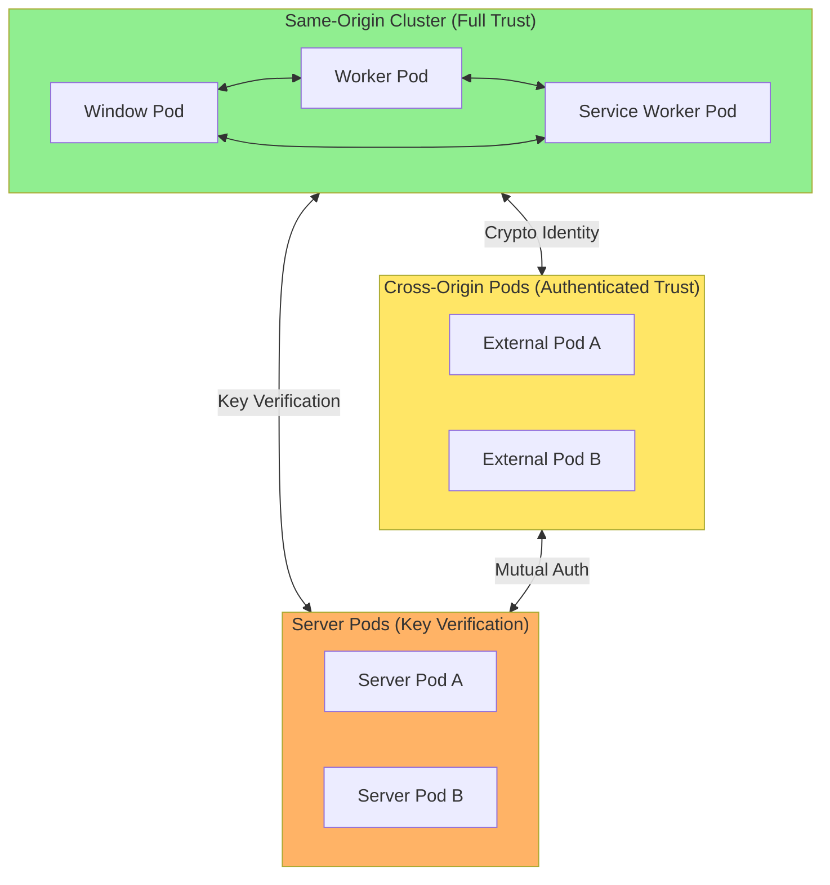
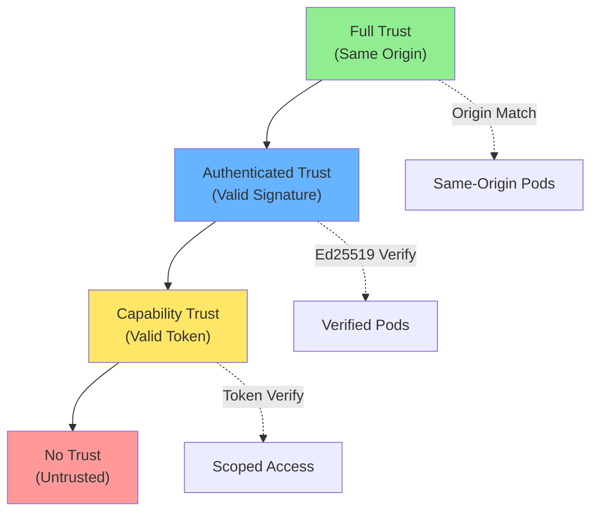
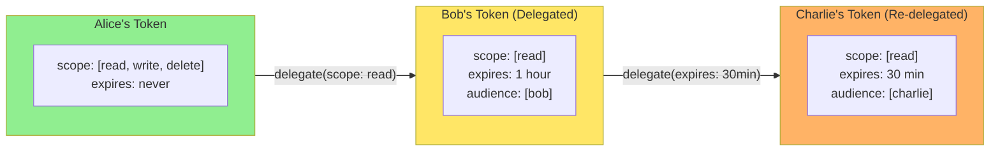

# Security Model

Threat model and security architecture for BrowserMesh.

**Related specs**: [identity-keys.md](../crypto/identity-keys.md) | [session-keys.md](../crypto/session-keys.md) | [webauthn-identity.md](../crypto/webauthn-identity.md) | [error-handling.md](error-handling.md)

## 1. Trust Model

### Trust Boundaries



### Trust Hierarchy



### Trust Levels

| Level | Description | Requirements |
|-------|-------------|--------------|
| **Full** | Same-origin pods | Origin match |
| **Authenticated** | Verified identity | Valid signature |
| **Capability** | Scoped access | Valid capability token |
| **None** | Untrusted | No verification |

## 2. Threat Model

### In Scope

| Threat | Mitigation |
|--------|------------|
| Impersonation | Ed25519 signatures on all messages |
| Replay attacks | Timestamps + monotonic nonces |
| Man-in-the-middle | Forward-secret session keys |
| Message tampering | Authenticated encryption (AES-GCM) |
| Unauthorized access | Capability-based delegation |
| Denial of service | Rate limiting, circuit breakers |
| Information disclosure | Encrypted payloads |

### Out of Scope

| Threat | Reason |
|--------|--------|
| Browser vulnerabilities | OS/browser responsibility |
| Malicious extensions | User responsibility |
| Physical access | Device security |
| DNS attacks | Network infrastructure |
| Timing attacks | Complex, diminishing returns |

## 3. Cryptographic Identity

### Identity Keys

Each pod has a persistent [Ed25519 identity](../crypto/identity-keys.md):

```typescript
// Pod identity: self-certifying
podId = base64url(SHA-256(publicKey))

// Properties:
// - 32-byte public key
// - No registry needed
// - Verifiable by anyone
// - Unforgeable
```

### Session Keys

Per-peer [X25519 ephemeral keys](../crypto/session-keys.md) provide forward secrecy:

```typescript
// Fresh key per session
// Session compromise doesn't affect other sessions
// Past messages remain secure if keys are rotated
```

## 4. Authentication

### Handshake Authentication

```typescript
// Both parties prove identity during handshake:

// 1. Include identity public key in HELLO
hello.publicKey = identityKey.publicKey;

// 2. Sign the handshake transcript
hello.signature = sign(identityKey.privateKey, handshakeHash);

// 3. Verify peer's signature
verify(peer.publicKey, handshakeHash, peer.signature);

// Result: Mutual authentication
```

### Message Authentication

```typescript
// Every message is signed:

message.sig = sign(identityKey, cbor.encode(message));

// Signature covers:
// - Message type
// - Source/destination
// - Timestamp
// - Payload

// Receiver verifies before processing
```

## 4.5 Non-Repudiation vs Session Authentication

BrowserMesh uses two distinct signing layers that serve different purposes. Implementations must choose the appropriate layer based on their needs.

### Decision Matrix

| Requirement | Signing Layer | Key Type | Use When |
|-------------|--------------|----------|----------|
| **Non-repudiation** | Identity signature (Ed25519) | Long-lived identity key | Audit trails, move provenance, signed commits |
| **Session authentication** | Session AEAD (AES-GCM) | Ephemeral session key | Ephemeral messages, real-time data, cursor positions |
| **Both** | Identity sig inside session envelope | Both | Signed game moves over encrypted channel |

### Identity Signing (Non-Repudiation)

Identity signatures prove *who* sent a message and cannot be denied later. Use identity signing when:
- Actions must be attributable to a specific pod for auditing (see [signed-audit-log.md](../extensions/signed-audit-log.md))
- Messages are stored and verified after the session ends
- Third parties must verify authenticity without session context

```typescript
// Non-repudiation: sign with identity key
const entry = { action: 'move', data: moveData, timestamp: Date.now() };
const signature = await identity.sign(cbor.encode(entry));
// This signature remains verifiable forever, by anyone with the public key
```

### Session Authentication

Session-level AES-GCM provides authentication (via the GCM tag) that proves the message came from the session peer. Use session authentication when:
- Messages are ephemeral (presence updates, cursor tracking, typing indicators)
- Only the two session peers need to verify authenticity
- Performance matters (AES-GCM is faster than Ed25519 signing)

```typescript
// Session authentication: encrypt with session key (includes GCM tag)
const encrypted = await session.encrypt(cbor.encode(presenceUpdate));
// Authentication is implicit — only the session peer can decrypt
```

### Dual Signing Pattern

When both non-repudiation and confidentiality are needed, sign with the identity key first, then encrypt with the session key:

```typescript
// 1. Sign for non-repudiation (identity layer)
const signed = { payload: moveData, signature: await identity.sign(cbor.encode(moveData)) };

// 2. Encrypt for confidentiality (session layer)
const encrypted = await session.encrypt(cbor.encode(signed));

// Receiver: decrypt, then verify identity signature
```

> **Anti-pattern**: Do not sign with Ed25519 over AES-GCM ciphertext. Sign the plaintext, then encrypt the signed payload. This ensures the signature remains verifiable if the plaintext is later extracted for auditing.

## 5. Confidentiality

### Encryption

All cross-origin communication is encrypted:

```typescript
// AES-GCM-256 with session keys
encrypted = AES-GCM.encrypt(
  key: sessionKey,
  nonce: incrementingNonce,
  plaintext: message,
  aad: messageHeader  // Authenticated but not encrypted
);
```

### What's Encrypted

| Data | Encrypted | Authenticated |
|------|-----------|---------------|
| Payload | ✅ | ✅ |
| Message type | ❌ | ✅ |
| Source/dest | ❌ | ✅ |
| Timestamp | ❌ | ✅ |
| Routing info | ❌ | ✅ |

## 6. Capability Delegation

### Capability Tokens

```typescript
interface CapabilityToken {
  // Who granted this capability
  grantedBy: Uint8Array;     // Public key of granter

  // What capability
  path: string;               // e.g., "cap/storage/read"
  scope: string[];            // Allowed operations

  // Constraints
  expires: number;            // Expiration timestamp
  maxUses?: number;           // Use limit
  audience?: Uint8Array[];    // Specific recipients

  // Derived key (optional)
  publicKey?: Uint8Array;     // Key for this capability

  // Proof
  signature: Uint8Array;      // Signed by granter
}
```

### Capability Verification

```typescript
async function verifyCapability(
  token: CapabilityToken,
  operation: string
): Promise<boolean> {
  // 1. Check expiration
  if (Date.now() > token.expires) {
    return false;
  }

  // 2. Check scope
  if (!token.scope.includes(operation)) {
    return false;
  }

  // 3. Verify signature
  const payload = cbor.encode({ ...token, signature: undefined });
  const granterKey = await importPublicKey(token.grantedBy);

  return verify(granterKey, payload, token.signature);
}
```

### Capability Attenuation

Capabilities can be delegated with reduced scope:



```typescript
// Alice has full storage access
const aliceToken = { scope: ['read', 'write', 'delete'] };

// Alice delegates read-only to Bob
const bobToken = await alice.delegate(aliceToken, {
  scope: ['read'],          // Reduced scope
  expires: Date.now() + 3600000,  // 1 hour
  audience: [bobPodId],     // Only Bob can use it
});

// Bob cannot escalate to write access
```

## 7. Attack Mitigations

### Replay Protection

```typescript
// 1. Timestamps in handshake
if (Math.abs(Date.now() - message.timestamp) > MAX_CLOCK_SKEW) {
  throw new Error('E202: Timestamp expired');
}

// 2. Monotonic nonces in session
if (receivedNonce <= lastReceivedNonce) {
  throw new Error('E402: Replay detected');
}
lastReceivedNonce = receivedNonce;

// 3. Request IDs for request/response
const pendingRequests = new Map<string, RequestContext>();
// Responses must match pending request
```

### DoS Protection

```typescript
// Rate limiting per peer
class RateLimiter {
  private tokens: number;
  private lastRefill: number;

  constructor(
    private maxTokens: number = 100,
    private refillRate: number = 10  // per second
  ) {
    this.tokens = maxTokens;
    this.lastRefill = Date.now();
  }

  tryAcquire(): boolean {
    this.refill();
    if (this.tokens <= 0) return false;
    this.tokens--;
    return true;
  }
}

// Circuit breaker for failing peers
const breaker = new CircuitBreaker({
  failureThreshold: 5,
  resetTimeout: 30000,
});
```

### Routing Attacks

```typescript
// TTL to prevent routing loops
if (message.ttl !== undefined && message.ttl <= 0) {
  throw new Error('E303: TTL exceeded');
}

// Via list to detect loops
if (message.via?.includes(myPodId)) {
  throw new Error('Routing loop detected');
}

// Signature verification at each hop
// Prevents route injection
```

## 8. Key Management

### Key Storage

```typescript
// Keys stored in IndexedDB, encrypted at rest
const keyStore = {
  // Root secret (32 bytes)
  rootSecret: Uint8Array,

  // Derived keys cached
  derivedKeys: Map<string, CryptoKey>,
};

// Storage encryption using browser-provided mechanism
// or password-derived key
```

### Key Rotation

```typescript
// Session keys: rotate periodically
const SESSION_KEY_LIFETIME = 24 * 60 * 60 * 1000;  // 24 hours

// Identity keys: long-lived, rotate on compromise
// Use HD derivation for sub-keys that can be rotated

// Rotation protocol:
// 1. Derive new key at incremented path
// 2. Announce new key to peers
// 3. Accept both old and new during transition
// 4. Drop old key after grace period
```

### Key Compromise Recovery

```typescript
// If root key compromised:
// 1. Generate new identity
// 2. Announce key change to known peers (signed by old key)
// 3. Re-establish trust relationships

// If session key compromised:
// 1. Immediately rotate
// 2. Re-handshake with affected peers
// 3. Past messages already encrypted are safe (forward secrecy)
```

## 9. Security Properties

| Property | How Achieved |
|----------|--------------|
| **Authentication** | Ed25519 signatures |
| **Confidentiality** | AES-GCM encryption |
| **Integrity** | AEAD + signatures |
| **Forward secrecy** | Ephemeral X25519 |
| **Non-repudiation** | Identity-signed messages (see §4.5) |
| **Replay resistance** | Timestamps + nonces |
| **Capability security** | Signed tokens |

## 10. Security Checklist

### Implementation

- [ ] All keys generated with `crypto.getRandomValues`
- [ ] Signatures verified before processing
- [ ] Nonces never reused
- [ ] Timestamps checked for freshness
- [ ] Capabilities verified on every use
- [ ] Rate limiting implemented
- [ ] Circuit breakers for peer failures

### Operations

- [ ] Keys stored securely (encrypted IndexedDB)
- [ ] Key rotation schedule defined
- [ ] Compromise recovery plan documented
- [ ] Audit logging enabled
- [ ] Monitoring for anomalies

### Testing

- [ ] Replay attacks blocked
- [ ] Tampered messages rejected
- [ ] Expired capabilities rejected
- [ ] Rate limits enforced
- [ ] Circuit breakers trip correctly

## 11. Security Recommendations

### Do

1. **Verify everything** — Never trust unverified data
2. **Fail secure** — Reject on any verification failure
3. **Minimize trust** — Use capability tokens over broad access
4. **Log security events** — For auditing and detection
5. **Rotate keys** — Especially session keys

### Don't

1. **Trust origin alone** — Use cryptographic identity
2. **Skip verification** — Even for "trusted" peers
3. **Store secrets in localStorage** — Use IndexedDB with encryption
4. **Log sensitive data** — No keys in logs
5. **Ignore rate limits** — DoS protection is essential
