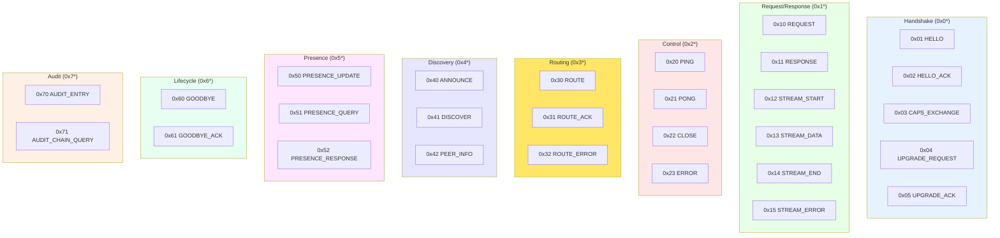

# Wire Format

Binary encoding specification for BrowserMesh messages.

**Related specs**: [identity-keys.md](../crypto/identity-keys.md) | [message-envelope.md](../networking/message-envelope.md) | [pod-types.md](pod-types.md)

## 1. Overview

BrowserMesh uses **CBOR** (Concise Binary Object Representation) for all wire-format encoding:
- Compact binary representation
- Self-describing
- Native JavaScript support (structuredClone compatible)
- Well-specified (RFC 8949)

## 2. Message Envelope

All messages share a common envelope:

```typescript
interface MessageEnvelope {
  // Header (required)
  v: 1;                    // Protocol version
  t: MessageType;          // Message type code
  id: Uint8Array;          // 16-byte message ID (UUID)
  ts: number;              // Timestamp (ms since epoch)

  // Routing (required)
  src: Uint8Array;         // 32-byte source pod ID
  dst: Uint8Array;         // 32-byte destination pod ID (or broadcast)

  // Optional routing
  via?: Uint8Array[];      // Intermediate hops
  ttl?: number;            // Time-to-live (hop count)

  // Payload
  p?: unknown;             // Message payload (CBOR-encodable)

  // Security (see identity-keys.md)
  sig?: Uint8Array;        // Ed25519 signature over header + payload
}
```

## 3. Message Types



```typescript
enum MessageType {
  // Handshake (0x0*)
  HELLO           = 0x01,
  HELLO_ACK       = 0x02,
  CAPS_EXCHANGE   = 0x03,
  UPGRADE_REQUEST = 0x04,
  UPGRADE_ACK     = 0x05,

  // Request/Response (0x1*)
  REQUEST         = 0x10,
  RESPONSE        = 0x11,
  STREAM_START    = 0x12,
  STREAM_DATA     = 0x13,
  STREAM_END      = 0x14,
  STREAM_ERROR    = 0x15,

  // Control (0x2*)
  PING            = 0x20,
  PONG            = 0x21,
  CLOSE           = 0x22,
  ERROR           = 0x23,

  // Routing (0x3*)
  ROUTE           = 0x30,
  ROUTE_ACK       = 0x31,
  ROUTE_ERROR     = 0x32,

  // Discovery (0x4*)
  ANNOUNCE        = 0x40,
  DISCOVER        = 0x41,
  PEER_INFO       = 0x42,

  // Presence (0x5*) — see presence-protocol.md
  PRESENCE_UPDATE   = 0x50,
  PRESENCE_QUERY    = 0x51,
  PRESENCE_RESPONSE = 0x52,

  // Lifecycle (0x6*) — see boot-sequence.md §16-17
  GOODBYE         = 0x60,
  GOODBYE_ACK     = 0x61,

  // Audit (0x7*) — see signed-audit-log.md
  AUDIT_ENTRY       = 0x70,
  AUDIT_CHAIN_QUERY = 0x71,
}
```

## 4. CBOR Encoding

### 4.1 Basic Encoding

```typescript
// Using @cbor-x/cbor or similar library
import { encode, decode } from 'cbor-x';

function encodeMessage(msg: MessageEnvelope): Uint8Array {
  return encode(msg);
}

function decodeMessage(data: Uint8Array): MessageEnvelope {
  return decode(data);
}
```

### 4.2 Field Ordering

For deterministic encoding (required for signatures):

```typescript
// Fields must be encoded in this order
const FIELD_ORDER = ['v', 't', 'id', 'ts', 'src', 'dst', 'via', 'ttl', 'p'];

function encodeDeterministic(msg: MessageEnvelope): Uint8Array {
  const ordered: Record<string, unknown> = {};
  for (const key of FIELD_ORDER) {
    if (key in msg && msg[key] !== undefined) {
      ordered[key] = msg[key];
    }
  }
  return encode(ordered, { canonical: true });
}
```

## 5. Message Definitions

### 5.1 HELLO

```typescript
interface HelloMessage extends MessageEnvelope {
  t: MessageType.HELLO;
  p: {
    kind: PodKind;
    pubKey: Uint8Array;      // 32-byte Ed25519 public key
    dhKey: Uint8Array;       // 32-byte X25519 public key
    caps: PodCapabilities;
  };
}

// Wire size: ~150-200 bytes
```

### 5.2 REQUEST

```typescript
interface RequestMessage extends MessageEnvelope {
  t: MessageType.REQUEST;
  p: {
    method: string;          // e.g., "compute/run", "storage/get"
    args?: unknown;          // Method arguments
    timeout?: number;        // Request timeout (ms)
  };
}
```

### 5.3 RESPONSE

```typescript
interface ResponseMessage extends MessageEnvelope {
  t: MessageType.RESPONSE;
  p: {
    reqId: Uint8Array;       // ID of request being responded to
    ok: boolean;
    result?: unknown;        // Success result
    error?: ErrorPayload;    // Error details
  };
}

interface ErrorPayload {
  code: string;
  message: string;
  details?: unknown;
}
```

### 5.4 STREAM_DATA

```typescript
interface StreamDataMessage extends MessageEnvelope {
  t: MessageType.STREAM_DATA;
  p: {
    streamId: Uint8Array;    // 16-byte stream ID
    seq: number;             // Sequence number
    data: Uint8Array;        // Chunk data
    final?: boolean;         // Last chunk flag
  };
}
```

### 5.5 PRESENCE_UPDATE

```typescript
interface PresenceUpdateMessage extends MessageEnvelope {
  t: MessageType.PRESENCE_UPDATE;
  p: {
    state: 'online' | 'typing' | 'idle' | 'away' | 'offline';
    metadata?: Record<string, unknown>;  // e.g., cursor position, activity
    ttl?: number;                        // Heartbeat interval hint (ms)
  };
}

// Wire size: ~120-160 bytes
```

### 5.6 GOODBYE / GOODBYE_ACK

```typescript
interface GoodbyeMessage extends MessageEnvelope {
  t: MessageType.GOODBYE;
  p: {
    reason: 'user' | 'navigation' | 'error' | 'idle';
    lastSequence?: number;   // Last message sequence for ordering
  };
}

interface GoodbyeAckMessage extends MessageEnvelope {
  t: MessageType.GOODBYE_ACK;
  p: {
    received: boolean;       // Confirms goodbye was processed
  };
}
```

### 5.7 AUDIT_ENTRY

```typescript
interface AuditEntryMessage extends MessageEnvelope {
  t: MessageType.AUDIT_ENTRY;
  p: {
    sequence: number;        // Monotonic sequence in the chain
    operation: string;       // What was done (scope-formatted)
    data?: unknown;          // Operation-specific payload
    previousHash: Uint8Array; // SHA-256 of previous entry (chain link)
    authorSignature: Uint8Array; // Ed25519 identity signature over entry
  };
}

// See extensions/signed-audit-log.md for full chain mechanics
```

## 6. Binary Layout

### 6.1 Message ID

```
┌────────────────────────────────────────────────────────┐
│                   Message ID (16 bytes)                │
├──────────────┬──────────────┬──────────────────────────┤
│ timestamp_hi │ timestamp_lo │       random             │
│   (4 bytes)  │   (4 bytes)  │      (8 bytes)           │
└──────────────┴──────────────┴──────────────────────────┘
```

```typescript
function generateMessageId(): Uint8Array {
  const id = new Uint8Array(16);
  const view = new DataView(id.buffer);

  // Timestamp (ms)
  const now = Date.now();
  view.setUint32(0, Math.floor(now / 0x100000000), false);
  view.setUint32(4, now >>> 0, false);

  // Random suffix
  crypto.getRandomValues(id.subarray(8));

  return id;
}
```

### 6.2 Pod ID

Pod IDs are 32-byte SHA-256 hashes of Ed25519 public keys (see [identity-keys.md](../crypto/identity-keys.md)):

```
┌────────────────────────────────────────────────────────┐
│                    Pod ID (32 bytes)                   │
│            SHA-256(Ed25519_public_key)                 │
└────────────────────────────────────────────────────────┘
```

### 6.3 Broadcast Destination

For broadcast messages, destination is all zeros:

```typescript
const BROADCAST_DST = new Uint8Array(32);  // All zeros
```

## 7. Framing

For stream-based transports (WebSocket, WebTransport), messages are length-prefixed:

```
┌─────────────┬────────────────────────────────────────┐
│ Length (4B) │           CBOR Message                 │
│  (big-end)  │                                        │
└─────────────┴────────────────────────────────────────┘
```

```typescript
function frame(message: Uint8Array): Uint8Array {
  const framed = new Uint8Array(4 + message.length);
  new DataView(framed.buffer).setUint32(0, message.length, false);
  framed.set(message, 4);
  return framed;
}

function unframe(data: Uint8Array): { message: Uint8Array; remaining: Uint8Array } {
  const length = new DataView(data.buffer, data.byteOffset).getUint32(0, false);
  return {
    message: data.subarray(4, 4 + length),
    remaining: data.subarray(4 + length),
  };
}
```

## 8. Signature

Messages are signed over the deterministic encoding excluding the signature field:

```typescript
async function signMessage(
  msg: Omit<MessageEnvelope, 'sig'>,
  privateKey: CryptoKey
): Promise<MessageEnvelope> {
  const payload = encodeDeterministic(msg);
  const sig = await crypto.subtle.sign('Ed25519', privateKey, payload);

  return {
    ...msg,
    sig: new Uint8Array(sig),
  };
}

async function verifyMessage(
  msg: MessageEnvelope,
  publicKey: CryptoKey
): Promise<boolean> {
  const { sig, ...rest } = msg;
  if (!sig) return false;

  const payload = encodeDeterministic(rest);
  return crypto.subtle.verify('Ed25519', publicKey, sig, payload);
}
```

## 9. Size Limits

| Limit | Value | Notes |
|-------|-------|-------|
| Max message size | 64 KB | Larger payloads use streaming |
| Max payload size | 63 KB | Envelope overhead ~1KB |
| Max stream chunk | 16 KB | For flow control |
| Max via hops | 8 | Prevent routing loops |

```typescript
const LIMITS = {
  MAX_MESSAGE_SIZE: 65536,      // 64 KB
  MAX_PAYLOAD_SIZE: 64512,      // 63 KB
  MAX_STREAM_CHUNK: 16384,      // 16 KB
  MAX_VIA_HOPS: 8,
};
```

## 10. Compression

Optional compression for large payloads using DEFLATE:

```typescript
interface CompressedPayload {
  _compressed: true;
  alg: 'deflate';
  size: number;           // Original size
  data: Uint8Array;       // Compressed data
}

async function compressPayload(data: Uint8Array): Promise<Uint8Array> {
  const stream = new CompressionStream('deflate');
  const writer = stream.writable.getWriter();
  writer.write(data);
  writer.close();

  const chunks: Uint8Array[] = [];
  const reader = stream.readable.getReader();

  while (true) {
    const { done, value } = await reader.read();
    if (done) break;
    chunks.push(value);
  }

  return concat(...chunks);
}
```

Compression is used when:
- Payload > 1 KB
- Estimated compression ratio > 20%

## 11. Extension Field Governance

Rules for extending the wire format without causing protocol entropy.

### 11.1 Rules

Every extension field added to a message envelope MUST satisfy all three rules:

**R1: Atomic values only.** Extension fields carry `int`, `string`, `bool`, or `bytes`. Nested maps and arrays are forbidden — they create implicit sub-protocols that cannot be validated without schema negotiation.

```typescript
// ✅ Good — atomic value
{ x_priority: 3 }

// ❌ Bad — nested map creates implicit sub-protocol
{ x_routing: { region: 'us-east', weight: 0.5, fallback: ['eu-west'] } }
```

**R2: State, not behavior.** Extension fields describe observable state. They MUST NOT encode actions, verbs, or control flow. Use request/response methods (via [message-envelope.md](../networking/message-envelope.md)) for behavior.

```typescript
// ✅ Good — describes state
{ x_compression: 'deflate' }

// ❌ Bad — encodes a verb/action
{ x_action: 'rebalance-shards' }
```

**R3: Core fields first.** Before proposing an extension field, check whether an existing core field or message type already serves the purpose. Duplication creates ambiguity about which field is authoritative.

### 11.2 Proposing New Message Types

To add a new message type:

1. **Claim a type code** from the unassigned range (see §11.3).
2. **Write a spec** defining the message structure, following the pattern in §5 (Message Definitions). Include TypeScript interface, CBOR encoding rules, and at least one example.
3. **Update [spec-index.md](../spec-index.md)** with the new spec's dependencies and reading order position.
4. **Register the type** in the `MessageType` enum in this spec.

New message types MUST NOT reuse or alias existing type codes. A type code, once assigned, is permanently bound to its message semantics even if the message is later deprecated.

### 11.3 Reserved Ranges

| Range | Purpose | Status |
|-------|---------|--------|
| `0x01`–`0x0F` | Core messages (HELLO, REQUEST, RESPONSE, etc.) | Assigned |
| `0x10`–`0x1F` | Stream control (STREAM_DATA, STREAM_END, etc.) | Assigned |
| `0x20`–`0x2F` | Coordination (PRESENCE_UPDATE, LEASE_REQUEST, etc.) | Assigned |
| `0x30`–`0x3F` | Audit and governance (AUDIT_ENTRY, etc.) | Assigned |
| `0x40`–`0xEF` | Unassigned — available for new message types | Open |
| `0xF0`–`0xFE` | Binary framing and transport control | Reserved |
| `0xFF` | Future expansion / version negotiation | Reserved |

Implementations MUST reject messages with type codes in the `0xF0`–`0xFF` range unless they explicitly support the corresponding transport extension.

### 11.4 Extension Field Naming

Extension fields in message payloads use the `x_` prefix convention:

```typescript
interface MessagePayload {
  // Core fields (no prefix)
  method: string;
  args: unknown;
  timeout?: number;

  // Extension fields (x_ prefix, always optional)
  x_priority?: number;        // 0-9, higher = more urgent
  x_trace_id?: string;        // Distributed tracing correlation
  x_compression?: string;     // Payload compression algorithm
}
```

**Rules for `x_` fields:**

- All `x_` fields are **optional**. A message is valid without them.
- Implementations **MUST ignore** unknown `x_` fields. Never reject a message because it contains an unrecognized `x_` field.
- Each `x_` field value MUST be ≤ 256 bytes when CBOR-encoded.
- Total size of all `x_` fields in a single message MUST NOT exceed 2048 bytes when CBOR-encoded.
- Field names use `snake_case` after the `x_` prefix (e.g., `x_trace_id`, not `x_traceId`).

```typescript
function validateExtensionFields(payload: Record<string, unknown>): void {
  let totalExtSize = 0;

  for (const [key, value] of Object.entries(payload)) {
    if (!key.startsWith('x_')) continue;

    const encoded = cborEncode(value);
    if (encoded.byteLength > 256) {
      throw new Error(`Extension field '${key}' exceeds 256-byte limit`);
    }
    totalExtSize += encoded.byteLength;
  }

  if (totalExtSize > 2048) {
    throw new Error(`Total extension fields exceed 2048-byte limit`);
  }
}
```

## 12. Example Messages

### HELLO

```
CBOR: a7                          // map(7)
  61 76                           // "v"
  01                              // 1
  61 74                           // "t"
  01                              // 0x01 (HELLO)
  62 69 64                        // "id"
  50 [16 bytes]                   // bytes(16)
  62 74 73                        // "ts"
  1b [8 bytes]                    // uint64
  63 73 72 63                     // "src"
  58 20 [32 bytes]                // bytes(32)
  63 64 73 74                     // "dst"
  58 20 [32 bytes]                // bytes(32)
  61 70                           // "p"
  a4                              // map(4)
    64 6b 69 6e 64                // "kind"
    66 77 69 6e 64 6f 77          // "window"
    66 70 75 62 4b 65 79          // "pubKey"
    58 20 [32 bytes]              // bytes(32)
    65 64 68 4b 65 79             // "dhKey"
    58 20 [32 bytes]              // bytes(32)
    64 63 61 70 73                // "caps"
    ...                           // capabilities object

Total: ~180-220 bytes
```

### REQUEST

```typescript
const request: RequestMessage = {
  v: 1,
  t: MessageType.REQUEST,
  id: generateMessageId(),
  ts: Date.now(),
  src: myPodId,
  dst: targetPodId,
  p: {
    method: 'compute/run',
    args: {
      code: wasmBytes,
      input: inputData,
    },
    timeout: 30000,
  },
};

// Encode and sign
const signed = await signMessage(request, privateKey);
const wire = encodeMessage(signed);
```

## 13. Implementation Notes

### Browser Compatibility

```typescript
// CBOR library recommendation
// Use cbor-x for best performance
import { encode, decode } from 'cbor-x';

// Alternative: cborg (lighter weight)
import { encode, decode } from 'cborg';
```

### Structured Clone

Messages can also be sent via postMessage without CBOR encoding, as the browser's structured clone algorithm handles the serialization:

```typescript
// For postMessage channels, send object directly
port.postMessage(message);

// For binary channels (WebSocket, WebRTC), use CBOR
socket.send(encodeMessage(message));
```
