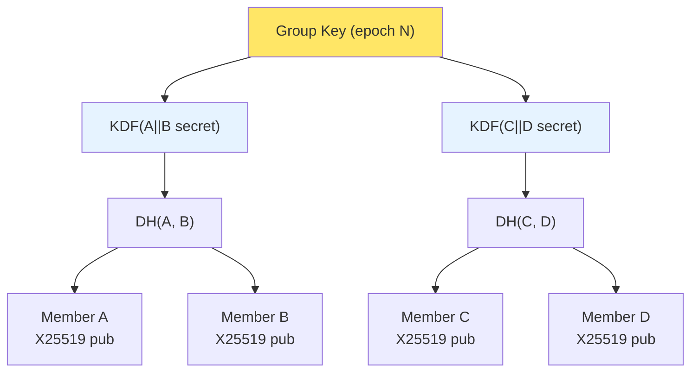
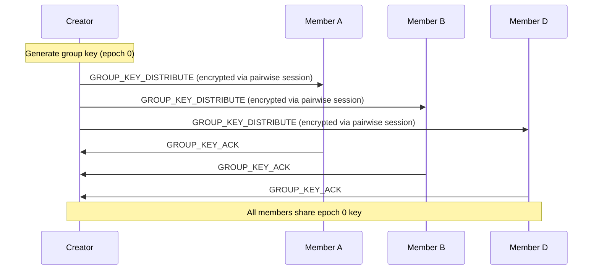

# Group Keys

Symmetric group encryption for multi-party BrowserMesh sessions.

**Related specs**: [session-keys.md](session-keys.md) | [identity-keys.md](identity-keys.md) | [wire-format.md](../core/wire-format.md) | [join-protocol.md](../coordination/join-protocol.md)

## 1. Overview

All encryption in BrowserMesh is pairwise (X25519 per session-pair). This spec adds symmetric group/room encryption for multi-party scenarios where every member encrypts with a single shared key, avoiding O(n^2) pairwise channels.

The group key layer:

- Derives a shared group key via a pairwise key tree
- Supports member add/remove with forward secrecy
- Uses epoch-based rotation to limit exposure
- Distributes keys over existing pairwise session channels

## 2. Key Tree Architecture



The group key is derived by combining pairwise DH secrets in a balanced binary tree. For N members, each member performs O(log N) DH operations to compute the root key.

For small groups (N <= 8, the common case in browser tabs), a simpler approach is used: the group creator generates a random 256-bit group key and distributes it to each member over their pairwise encrypted session channel.

## 3. GroupKeyManager Interface

```typescript
interface GroupKeyManager {
  /** Create a new group with this pod as creator */
  create(groupId: string): Promise<GroupState>;

  /** Add a member (requires existing pairwise session) */
  addMember(groupId: string, memberId: string, sessionKey: CryptoKey): Promise<void>;

  /** Remove a member (triggers epoch rotation) */
  removeMember(groupId: string, memberId: string): Promise<void>;

  /** Rotate the group key (new epoch) */
  rotate(groupId: string): Promise<void>;

  /** Encrypt with current group key */
  encrypt(groupId: string, plaintext: Uint8Array): Promise<GroupCiphertext>;

  /** Decrypt with group key (current or previous epoch for grace period) */
  decrypt(groupId: string, ciphertext: GroupCiphertext): Promise<Uint8Array>;

  /** Get current group state */
  getState(groupId: string): GroupState | undefined;
}

interface GroupState {
  groupId: string;
  epoch: number;
  members: Set<string>;          // Pod IDs
  currentKey: CryptoKey;         // AES-GCM-256
  previousKey?: CryptoKey;       // For grace period after rotation
  createdAt: number;
  rotatedAt: number;
}

interface GroupCiphertext {
  epoch: number;
  nonce: Uint8Array;             // 12 bytes
  ciphertext: Uint8Array;
  tag: Uint8Array;               // 16-byte AES-GCM tag
  senderId: Uint8Array;          // 32-byte pod ID of sender
}
```

## 4. Key Distribution Protocol

Group keys are distributed over existing pairwise session channels (see [session-keys.md](session-keys.md)). The group creator generates the key and sends it individually to each member.



## 5. Wire Format Messages

Group key messages use type codes 0x80-0x83, in the Group (0x8*) block.

```typescript
// Wire format additions to MessageType enum
enum GroupMessageType {
  GROUP_KEY_DISTRIBUTE = 0x80,
  GROUP_KEY_ACK        = 0x81,
  GROUP_KEY_ROTATE     = 0x82,
  GROUP_KEY_REQUEST    = 0x83,
}
```

### 5.1 GROUP_KEY_DISTRIBUTE (0x80)

```typescript
interface GroupKeyDistributeMessage extends MessageEnvelope {
  t: 0x80;
  p: {
    groupId: string;
    epoch: number;
    encryptedKey: Uint8Array;    // Group key encrypted with pairwise session key
    members: Uint8Array[];       // List of member pod IDs
    creatorId: Uint8Array;       // Pod ID of group creator
  };
}
```

### 5.2 GROUP_KEY_ACK (0x81)

```typescript
interface GroupKeyAckMessage extends MessageEnvelope {
  t: 0x81;
  p: {
    groupId: string;
    epoch: number;
    accepted: boolean;
  };
}
```

### 5.3 GROUP_KEY_ROTATE (0x82)

Sent when the group key rotates (member removal, periodic rotation, or explicit request).

```typescript
interface GroupKeyRotateMessage extends MessageEnvelope {
  t: 0x82;
  p: {
    groupId: string;
    epoch: number;               // New epoch number
    encryptedKey: Uint8Array;    // New key encrypted with pairwise session key
    reason: 'member_removed' | 'periodic' | 'explicit';
    removedMember?: Uint8Array;  // Pod ID if reason is member_removed
  };
}
```

### 5.4 GROUP_KEY_REQUEST (0x83)

Sent by a member who has missed a rotation and needs the current key.

```typescript
interface GroupKeyRequestMessage extends MessageEnvelope {
  t: 0x83;
  p: {
    groupId: string;
    lastKnownEpoch: number;
  };
}
```

## 6. Epoch-Based Forward Secrecy

Each key rotation advances the epoch counter. Forward secrecy guarantees:

| Property | Mechanism |
|----------|-----------|
| Post-compromise security | Key rotation after member removal generates fresh random key |
| Forward secrecy | Old epoch keys are deleted after grace period |
| Epoch synchronization | Ciphertext includes epoch number; receiver selects correct key |
| Grace period | Previous epoch key retained for 5 seconds after rotation |

### Rotation Triggers

| Trigger | Action |
|---------|--------|
| Member removed | Immediate rotation (excluded member never sees new key) |
| 1 hour elapsed | Periodic rotation for exposure limitation |
| Explicit request | Any member can request rotation via GROUP_KEY_REQUEST |
| Compromise suspected | Leader triggers immediate rotation |

```typescript
const GROUP_KEY_DEFAULTS = {
  rotationInterval: 3_600_000,   // 1 hour
  gracePeriod: 5_000,            // 5 seconds
  maxEpochSkip: 10,              // Max epochs a member can be behind
  maxGroupSize: 64,              // Max members per group
};
```

## 7. Member Add/Remove

### Adding a Member

1. Creator sends GROUP_KEY_DISTRIBUTE with current epoch key
2. New member sends GROUP_KEY_ACK
3. Creator broadcasts updated member list to all existing members

### Removing a Member

1. Creator generates new random group key (epoch N+1)
2. Creator sends GROUP_KEY_ROTATE to all remaining members
3. Removed member's pairwise session is closed
4. Previous epoch key is deleted after grace period

```typescript
async function removeMember(
  state: GroupState,
  memberId: string,
  sessionManager: SessionManager
): Promise<void> {
  // Remove from member set
  state.members.delete(memberId);

  // Generate new key (removed member never sees this)
  const newKey = await crypto.subtle.generateKey(
    { name: 'AES-GCM', length: 256 },
    true,
    ['encrypt', 'decrypt']
  );

  // Advance epoch
  state.previousKey = state.currentKey;
  state.currentKey = newKey;
  state.epoch++;
  state.rotatedAt = Date.now();

  // Distribute new key to remaining members
  const rawKey = await crypto.subtle.exportKey('raw', newKey);
  for (const member of state.members) {
    const session = sessionManager.getSession(member);
    if (session) {
      const encrypted = await session.encrypt(new Uint8Array(rawKey));
      // Send GROUP_KEY_ROTATE message
    }
  }

  // Clear previous key after grace period
  setTimeout(() => {
    state.previousKey = undefined;
  }, GROUP_KEY_DEFAULTS.gracePeriod);
}
```

## 8. Group Encryption

Group messages are encrypted with AES-GCM-256 using the current epoch key. The sender's pod ID is included in the associated data to prevent cross-member forgery.

```typescript
async function groupEncrypt(
  state: GroupState,
  plaintext: Uint8Array,
  senderId: Uint8Array
): Promise<GroupCiphertext> {
  const nonce = crypto.getRandomValues(new Uint8Array(12));

  const ciphertext = await crypto.subtle.encrypt(
    {
      name: 'AES-GCM',
      iv: nonce,
      additionalData: senderId,  // Bind to sender identity
    },
    state.currentKey,
    plaintext
  );

  const ct = new Uint8Array(ciphertext);
  return {
    epoch: state.epoch,
    nonce,
    ciphertext: ct.subarray(0, ct.length - 16),
    tag: ct.subarray(ct.length - 16),
    senderId,
  };
}
```

## 9. Relationship to Pairwise Sessions

Group keys complement — not replace — pairwise session keys:

| Aspect | Pairwise (session-keys.md) | Group (this spec) |
|--------|---------------------------|-------------------|
| Key agreement | X25519 DH | Random + distribute |
| Forward secrecy | Per-session ephemeral | Per-epoch rotation |
| Participants | 2 | 2-64 |
| Key distribution | Handshake | Over pairwise channels |
| Use case | Direct messaging, RPC | Broadcast, shared state |
| Authentication | Mutual (handshake) | Sender ID in AD |

Group key distribution always happens over authenticated pairwise channels, so group membership is transitively authenticated.
