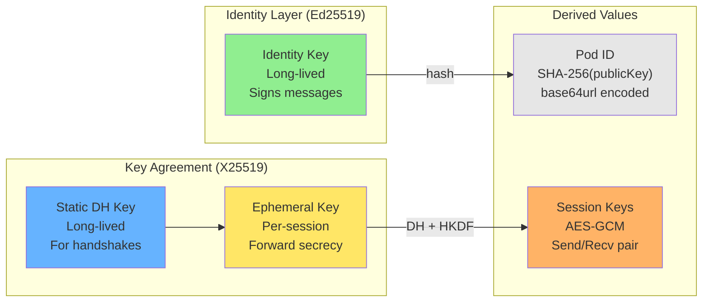
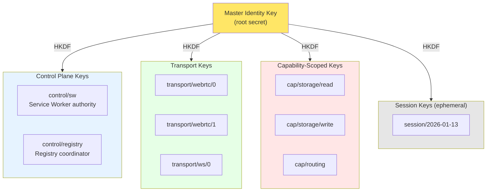

# Identity Keys

Cryptographic identity for BrowserMesh pods using Ed25519/X25519.

**Related specs**: [session-keys.md](session-keys.md) | [webauthn-identity.md](webauthn-identity.md) | [identity-persistence.md](identity-persistence.md) | [boot-sequence.md](../core/boot-sequence.md) | [security-model.md](../core/security-model.md)

## 1. Algorithm Selection

### Ed25519 for Signing

| Aspect | Value |
|--------|-------|
| Public key size | 32 bytes |
| Signature size | 64 bytes |
| Security level | ~128-bit |
| WebCrypto support | Full (as of 2025) |
| Performance | Excellent |

### X25519 for Key Agreement

| Aspect | Value |
|--------|-------|
| Public key size | 32 bytes |
| Shared secret | 32 bytes |
| Security level | ~128-bit |
| WebCrypto support | Full (as of 2025) |

**Note**: Ed25519/X25519 are now universally supported in browsers as of May 2025.

## 2. Key Types



```typescript
interface PodKeyMaterial {
  // Identity key (long-lived, Ed25519)
  identity: {
    publicKey: CryptoKey;
    privateKey: CryptoKey;
    raw: Uint8Array;           // 32 bytes
  };

  // Static DH key (for key agreement, X25519)
  staticDH: {
    publicKey: CryptoKey;
    privateKey: CryptoKey;
    raw: Uint8Array;           // 32 bytes
  };

  // Pod ID derived from identity public key
  podId: string;               // base64url(SHA-256(publicKey))
}
```

## 3. Key Generation

```typescript
class PodKeyGenerator {
  /**
   * Generate a new identity keypair (Ed25519)
   */
  static async generateIdentityKey(): Promise<CryptoKeyPair> {
    return crypto.subtle.generateKey(
      'Ed25519',
      true,  // extractable for export/backup
      ['sign', 'verify']
    );
  }

  /**
   * Generate a static DH keypair (X25519)
   */
  static async generateStaticDHKey(): Promise<CryptoKeyPair> {
    return crypto.subtle.generateKey(
      'X25519',
      true,
      ['deriveBits']
    );
  }

  /**
   * Generate an ephemeral DH keypair (per-session)
   */
  static async generateEphemeralKey(): Promise<CryptoKeyPair> {
    return crypto.subtle.generateKey(
      'X25519',
      false,  // non-extractable for forward secrecy
      ['deriveBits']
    );
  }

  /**
   * Derive Pod ID from identity public key
   */
  static async derivePodId(publicKey: CryptoKey): Promise<string> {
    const raw = await crypto.subtle.exportKey('raw', publicKey);
    const hash = await crypto.subtle.digest('SHA-256', raw);
    return base64urlEncode(new Uint8Array(hash));
  }
}
```

## 4. Key Export/Import

```typescript
class PodKeyStore {
  /**
   * Export public key to raw bytes (32 bytes for Ed25519/X25519)
   */
  static async exportPublicKey(key: CryptoKey): Promise<Uint8Array> {
    const raw = await crypto.subtle.exportKey('raw', key);
    return new Uint8Array(raw);
  }

  /**
   * Export keypair to JWK for storage
   */
  static async exportKeyPair(
    keyPair: CryptoKeyPair
  ): Promise<{ public: JsonWebKey; private: JsonWebKey }> {
    const [publicJwk, privateJwk] = await Promise.all([
      crypto.subtle.exportKey('jwk', keyPair.publicKey),
      crypto.subtle.exportKey('jwk', keyPair.privateKey),
    ]);
    return { public: publicJwk, private: privateJwk };
  }

  /**
   * Import Ed25519 public key from raw bytes
   */
  static async importEd25519PublicKey(raw: Uint8Array): Promise<CryptoKey> {
    return crypto.subtle.importKey(
      'raw',
      raw,
      'Ed25519',
      true,
      ['verify']
    );
  }

  /**
   * Import X25519 public key from raw bytes
   */
  static async importX25519PublicKey(raw: Uint8Array): Promise<CryptoKey> {
    return crypto.subtle.importKey(
      'raw',
      raw,
      'X25519',
      true,
      []
    );
  }

  /**
   * Import keypair from JWK (from storage)
   */
  static async importEd25519KeyPair(
    jwk: { public: JsonWebKey; private: JsonWebKey }
  ): Promise<CryptoKeyPair> {
    const [publicKey, privateKey] = await Promise.all([
      crypto.subtle.importKey('jwk', jwk.public, 'Ed25519', true, ['verify']),
      crypto.subtle.importKey('jwk', jwk.private, 'Ed25519', true, ['sign']),
    ]);
    return { publicKey, privateKey };
  }

  static async importX25519KeyPair(
    jwk: { public: JsonWebKey; private: JsonWebKey }
  ): Promise<CryptoKeyPair> {
    const [publicKey, privateKey] = await Promise.all([
      crypto.subtle.importKey('jwk', jwk.public, 'X25519', true, []),
      crypto.subtle.importKey('jwk', jwk.private, 'X25519', true, ['deriveBits']),
    ]);
    return { publicKey, privateKey };
  }
}
```

## 5. Signing and Verification

```typescript
class PodSigner {
  /**
   * Sign data with identity key
   */
  static async sign(
    privateKey: CryptoKey,
    data: Uint8Array
  ): Promise<Uint8Array> {
    const signature = await crypto.subtle.sign(
      'Ed25519',
      privateKey,
      data
    );
    return new Uint8Array(signature);
  }

  /**
   * Verify signature with public key
   */
  static async verify(
    publicKey: CryptoKey,
    data: Uint8Array,
    signature: Uint8Array
  ): Promise<boolean> {
    return crypto.subtle.verify(
      'Ed25519',
      publicKey,
      signature,
      data
    );
  }

  /**
   * Sign a message with context binding
   */
  static async signWithContext(
    privateKey: CryptoKey,
    message: Uint8Array,
    context: string
  ): Promise<Uint8Array> {
    const contextBytes = new TextEncoder().encode(context);
    const combined = concat(
      new Uint8Array([contextBytes.length]),
      contextBytes,
      message
    );
    return this.sign(privateKey, combined);
  }
}
```

## 6. HD Key Derivation

Hierarchical Deterministic key derivation using HKDF.

### 6.1 Key Hierarchy



### 6.2 Derivation Implementation

```typescript
interface DerivedKey {
  path: string;
  keyPair: CryptoKeyPair;
  publicKeyRaw: Uint8Array;
}

async function deriveKey(
  rootSecret: Uint8Array,
  path: string,
  keyType: 'Ed25519' | 'X25519' = 'Ed25519'
): Promise<DerivedKey> {
  const pathBytes = new TextEncoder().encode(path);

  // Derive seed via HKDF
  const hkdfKey = await crypto.subtle.importKey(
    'raw',
    rootSecret,
    'HKDF',
    false,
    ['deriveBits']
  );

  const seed = await crypto.subtle.deriveBits(
    {
      name: 'HKDF',
      hash: 'SHA-256',
      salt: new TextEncoder().encode('browsermesh-hd'),
      info: pathBytes,
    },
    hkdfKey,
    256
  );

  // Import seed as private key (PKCS#8 format required for Ed25519/X25519)
  // WebCrypto doesn't support raw import for Ed25519/X25519 private keys,
  // so we use the seed to generate a deterministic keypair via HKDF-based KDF
  const seedBytes = new Uint8Array(seed);

  // Generate keypair deterministically from seed
  // Note: This uses a helper that wraps the seed in proper key format
  const keyPair = await generateDeterministicKeyPair(seedBytes, keyType);

  // Export public key (WebCrypto returns 32 bytes for Ed25519/X25519 public keys)
  const publicKeyRaw = new Uint8Array(
    await crypto.subtle.exportKey('raw', keyPair.publicKey)
  );

  return {
    path,
    keyPair,
    publicKeyRaw,
  };
}

/**
 * Generate a deterministic keypair from a seed.
 * Uses the seed as entropy for key generation.
 */
async function generateDeterministicKeyPair(
  seed: Uint8Array,
  keyType: 'Ed25519' | 'X25519'
): Promise<CryptoKeyPair> {
  // For Ed25519/X25519, the seed IS the private key (32 bytes)
  // We need to import it in JWK format since raw private key import isn't supported

  // Convert seed to base64url for JWK 'd' parameter
  const d = base64urlEncode(seed);

  // For Ed25519, derive public key by importing as JWK
  // The 'x' (public key) will be computed by the implementation
  if (keyType === 'Ed25519') {
    // Import private key
    const privateKey = await crypto.subtle.importKey(
      'jwk',
      { kty: 'OKP', crv: 'Ed25519', d, x: '' }, // x will be ignored for private
      'Ed25519',
      true,
      ['sign']
    );

    // Export to get computed public key
    const privateJwk = await crypto.subtle.exportKey('jwk', privateKey);

    // Import public key
    const publicKey = await crypto.subtle.importKey(
      'jwk',
      { kty: 'OKP', crv: 'Ed25519', x: privateJwk.x },
      'Ed25519',
      true,
      ['verify']
    );

    return { publicKey, privateKey };
  } else {
    // X25519
    const privateKey = await crypto.subtle.importKey(
      'jwk',
      { kty: 'OKP', crv: 'X25519', d, x: '' },
      'X25519',
      true,
      ['deriveBits']
    );

    const privateJwk = await crypto.subtle.exportKey('jwk', privateKey);

    const publicKey = await crypto.subtle.importKey(
      'jwk',
      { kty: 'OKP', crv: 'X25519', x: privateJwk.x },
      'X25519',
      true,
      []
    );

    return { publicKey, privateKey };
  }
}
```

### 6.3 Standard Paths

| Path | Purpose |
|------|---------|
| `identity` | Root identity (do not derive) |
| `control/sw` | Service Worker authority key |
| `control/registry` | Registry coordination key |
| `transport/webrtc/{peer}` | Per-peer WebRTC keys |
| `transport/ws/{relay}` | WebSocket relay keys |
| `cap/storage/read` | Storage read capability |
| `cap/storage/write` | Storage write capability |
| `cap/compute` | Compute capability |
| `cap/routing` | Routing capability |
| `session/{date}` | Daily session keys |

## 7. PodIdentity Class

```typescript
class PodIdentity {
  readonly podId: string;
  private identityKeyPair: CryptoKeyPair;
  private staticDHKeyPair: CryptoKeyPair;
  private rootSecret: Uint8Array;
  private derivedKeys: Map<string, DerivedKey> = new Map();

  private constructor(
    podId: string,
    identityKeyPair: CryptoKeyPair,
    staticDHKeyPair: CryptoKeyPair,
    rootSecret: Uint8Array
  ) {
    this.podId = podId;
    this.identityKeyPair = identityKeyPair;
    this.staticDHKeyPair = staticDHKeyPair;
    this.rootSecret = rootSecret;
  }

  /**
   * Create new pod identity
   */
  static async create(): Promise<PodIdentity> {
    const rootSecret = crypto.getRandomValues(new Uint8Array(32));

    const [identityKeyPair, staticDHKeyPair] = await Promise.all([
      PodKeyGenerator.generateIdentityKey(),
      PodKeyGenerator.generateStaticDHKey(),
    ]);

    const podId = await PodKeyGenerator.derivePodId(identityKeyPair.publicKey);

    return new PodIdentity(podId, identityKeyPair, staticDHKeyPair, rootSecret);
  }

  /**
   * Restore pod identity from storage
   */
  static async restore(stored: StoredPodIdentity): Promise<PodIdentity> {
    const [identityKeyPair, staticDHKeyPair] = await Promise.all([
      PodKeyStore.importEd25519KeyPair(stored.identity),
      PodKeyStore.importX25519KeyPair(stored.staticDH),
    ]);

    const podId = await PodKeyGenerator.derivePodId(identityKeyPair.publicKey);

    return new PodIdentity(
      podId,
      identityKeyPair,
      staticDHKeyPair,
      base64urlDecode(stored.rootSecret)
    );
  }

  /**
   * Export for storage
   */
  async export(): Promise<StoredPodIdentity> {
    const [identity, staticDH] = await Promise.all([
      PodKeyStore.exportKeyPair(this.identityKeyPair),
      PodKeyStore.exportKeyPair(this.staticDHKeyPair),
    ]);

    return {
      identity,
      staticDH,
      rootSecret: base64urlEncode(this.rootSecret),
    };
  }

  /**
   * Get public identity key (32 bytes)
   */
  async getPublicKey(): Promise<Uint8Array> {
    return PodKeyStore.exportPublicKey(this.identityKeyPair.publicKey);
  }

  /**
   * Get static DH public key (32 bytes)
   */
  async getStaticDHPublicKey(): Promise<Uint8Array> {
    return PodKeyStore.exportPublicKey(this.staticDHKeyPair.publicKey);
  }

  /**
   * Sign data with identity key
   */
  async sign(data: Uint8Array): Promise<Uint8Array> {
    return PodSigner.sign(this.identityKeyPair.privateKey, data);
  }

  /**
   * Derive a key at the given path
   */
  async derive(path: string): Promise<DerivedKey> {
    if (this.derivedKeys.has(path)) {
      return this.derivedKeys.get(path)!;
    }

    const derived = await deriveKey(this.rootSecret, path);
    this.derivedKeys.set(path, derived);
    return derived;
  }

  /**
   * Derive capability key
   */
  async deriveCapability(capability: string, scope?: string): Promise<DerivedKey> {
    const path = scope ? `cap/${capability}/${scope}` : `cap/${capability}`;
    return this.derive(path);
  }

  /**
   * Derive transport key
   */
  async deriveTransport(
    transport: 'webrtc' | 'ws' | 'wt',
    peerId: string
  ): Promise<DerivedKey> {
    return this.derive(`transport/${transport}/${peerId}`);
  }

  /**
   * Lock identity with passphrase for secure storage
   * See identity-persistence.md for full implementation
   */
  async lock(passphrase: string): Promise<LockedPodIdentity> {
    const stored = await this.export();
    return lockIdentity(stored, passphrase);
  }

  /**
   * Restore a locked identity
   * See identity-persistence.md for full implementation
   */
  static async unlock(
    locked: LockedPodIdentity,
    passphrase: string
  ): Promise<PodIdentity> {
    const stored = await unlockIdentity(locked, passphrase);
    return PodIdentity.restore(stored);
  }
}

interface StoredPodIdentity {
  identity: { public: JsonWebKey; private: JsonWebKey };
  staticDH: { public: JsonWebKey; private: JsonWebKey };
  rootSecret: string;  // base64url encoded
}
```

## 8. Credentials API

The canonical API for identity management follows the Web Authentication API pattern (`navigator.credentials`). This provides familiar ergonomics for web developers and enables optional WebAuthn integration.

```typescript
/**
 * Pod credentials container (similar to navigator.credentials)
 * Accessed via pod.credentials
 *
 * This is the CANONICAL definition. See webauthn-identity.md for
 * WebAuthn-specific extensions.
 */
interface PodCredentialsContainer {
  /**
   * Create a new pod identity
   * Mirrors navigator.credentials.create()
   */
  create(options?: PodCredentialCreationOptions): Promise<PodCredential>;

  /**
   * Restore an existing pod identity
   * Mirrors navigator.credentials.get()
   */
  get(options?: PodCredentialRequestOptions): Promise<PodCredential | null>;

  /**
   * Delete a stored credential
   * Removes from local storage and optionally from WebAuthn
   */
  delete(options: PodCredentialDeletionOptions): Promise<boolean>;

  /**
   * Create a signed assertion for handshake
   * Used during peer-to-peer authentication
   */
  createHandshakeAssertion(options: PodHandshakeAssertionOptions): Promise<PodHandshakeAssertion>;

  /**
   * Check if WebAuthn-backed identity is available
   */
  isWebAuthnAvailable(): Promise<boolean>;

  /**
   * Check platform capabilities
   * Mirrors PublicKeyCredential.getClientCapabilities()
   */
  getClientCapabilities(): Promise<PodClientCapabilities>;
}

interface PodCredentialDeletionOptions {
  // Credential ID to delete
  id: string;

  // Also signal to WebAuthn (if credential was WebAuthn-backed)
  // Uses PublicKeyCredential.signalUnknownCredential()
  signalWebAuthn?: boolean;

  // RP ID for WebAuthn signaling
  rpId?: string;
}

interface PodCredentialCreationOptions {
  // Challenge for attestation binding (optional)
  challenge?: Uint8Array;

  // Enable WebAuthn hardware attestation (optional)
  // See webauthn-identity.md for full WebAuthnCreationOptions
  webauthn?: boolean | WebAuthnCreationOptions;
}

/**
 * WebAuthn creation options (subset - see webauthn-identity.md for full definition)
 */
interface WebAuthnCreationOptions {
  // Require WebAuthn (fail if unavailable)
  required?: boolean;

  // Relying party configuration
  rp?: { id: string; name: string };

  // User info for discoverable credentials
  user?: { id: Uint8Array; name: string; displayName: string };

  // Restore existing credential
  credentialId?: Uint8Array;

  // Use PRF for key encryption
  usePrf?: boolean;
}

interface PodCredentialRequestOptions {
  // Stored identity to restore
  stored?: StoredPodIdentity;

  // WebAuthn credential ID for hardware-backed restore
  credentialId?: Uint8Array;

  // RP ID for WebAuthn (defaults to location.hostname)
  rpId?: string;
}

interface PodCredential {
  // The pod identity
  identity: PodIdentity;

  // Credential identifier (for storage/lookup)
  id: string;

  // Whether hardware-attested via WebAuthn
  attested: boolean;

  // Raw WebAuthn credential ID (if WebAuthn-backed)
  rawId?: Uint8Array;

  // WebAuthn attestation data (if attested)
  attestation?: WebAuthnAttestation;
}

/**
 * WebAuthn attestation data attached to a PodCredential
 */
interface WebAuthnAttestation {
  authenticatorData: Uint8Array;
  clientDataJSON: Uint8Array;
  attestationObject: Uint8Array;
}

interface PodClientCapabilities {
  // Core crypto (always true in modern browsers as of 2025)
  ed25519: boolean;
  x25519: boolean;

  // WebAuthn support
  webauthn: boolean;
  platformAuthenticator: boolean;      // Touch ID, Windows Hello, etc.
  crossPlatformAuthenticator: boolean; // Security keys (USB, NFC, BLE)

  // WebAuthn extensions
  prf: boolean;                        // PRF extension for key derivation
  discoverableCredentials: boolean;    // Passkeys/resident keys
}
```

### Usage Examples

```typescript
// Create new identity (software keys)
const credential = await pod.credentials.create();
console.log(credential.identity.podId);

// Create with WebAuthn attestation (if available)
const attestedCredential = await pod.credentials.create({
  webauthn: true,
});
console.log(`Hardware-backed: ${attestedCredential.attested}`);

// Restore from storage
const stored = await loadFromIndexedDB();
const restored = await pod.credentials.get({ stored });

// Check capabilities
const caps = await pod.credentials.getClientCapabilities();
if (caps.platformAuthenticator) {
  // Offer Touch ID / Windows Hello option
}
```

### API Comparison

| Web Authentication API | BrowserMesh Credentials API |
|------------------------|----------------------------|
| `navigator.credentials.create()` | `pod.credentials.create()` |
| `navigator.credentials.get()` | `pod.credentials.get()` |
| `PublicKeyCredential.getClientCapabilities()` | `pod.credentials.getClientCapabilities()` |
| `PublicKeyCredentialCreationOptions` | `PodCredentialCreationOptions` |
| `PublicKeyCredential` | `PodCredential` |

### Handshake Integration

The credentials API integrates with the pod handshake protocol. When a peer sends a challenge, the pod creates a signed assertion.

**Note**: This is distinct from WebAuthn assertions (see webauthn-identity.md). Handshake assertions are for peer-to-peer authentication; WebAuthn assertions are for restoring hardware-backed credentials.

```typescript
/**
 * Options for creating a handshake assertion
 */
interface PodHandshakeAssertionOptions {
  // Challenge from peer
  challenge: Uint8Array;

  // Peer's public key (for mutual auth binding)
  peerPublicKey?: Uint8Array;

  // Capabilities to advertise
  capabilities: PodCapabilities;
}

/**
 * Signed assertion for peer-to-peer handshake
 * NOT to be confused with WebAuthn's AuthenticatorAssertionResponse
 */
interface PodHandshakeAssertion {
  // Pod identity info
  pod: {
    id: string;                      // Self-certifying pod ID
    publicKey: Uint8Array;           // Ed25519 public key
    capabilities: PodCapabilities;
  };

  // Assertion data
  assertion: {
    challenge: Uint8Array;           // Echoed challenge
    timestamp: number;
    signature: Uint8Array;           // Signs: challenge + timestamp + capabilities
  };

  // Hardware attestation proof (if WebAuthn-backed identity)
  attestationProof?: {
    credentialId: Uint8Array;
    authenticatorData: Uint8Array;
    clientDataHash: Uint8Array;
  };
}

// Usage in handshake
async function handlePeerChallenge(
  challenge: Uint8Array,
  peerPublicKey: Uint8Array
): Promise<PodHandshakeAssertion> {
  return pod.credentials.createHandshakeAssertion({
    challenge,
    peerPublicKey,
    capabilities: pod.capabilities,
  });
}

// Verification
async function verifyHandshakeAssertion(
  assertion: PodHandshakeAssertion
): Promise<{ valid: boolean; attested: boolean }> {
  // 1. Verify pod ID matches public key hash
  const expectedId = await hashPublicKey(assertion.pod.publicKey);
  if (assertion.pod.id !== expectedId) {
    return { valid: false, attested: false };
  }

  // 2. Verify signature over challenge + timestamp + capabilities
  const payload = cbor.encode({
    challenge: assertion.assertion.challenge,
    timestamp: assertion.assertion.timestamp,
    capabilities: assertion.pod.capabilities,
  });

  const publicKey = await importEd25519PublicKey(assertion.pod.publicKey);
  const signatureValid = await verify(publicKey, payload, assertion.assertion.signature);

  if (!signatureValid) {
    return { valid: false, attested: false };
  }

  // 3. If attestation proof present, verify it
  let attested = false;
  if (assertion.attestationProof) {
    attested = await verifyAttestationProof(
      assertion.attestationProof,
      assertion.pod.publicKey
    );
  }

  return { valid: true, attested };
}

// Verify WebAuthn attestation binds to this pod's public key
async function verifyAttestationProof(
  proof: PodHandshakeAssertion['attestationProof'],
  podPublicKey: Uint8Array
): Promise<boolean> {
  if (!proof) return false;

  // Parse authenticator data
  const authData = parseAuthenticatorData(proof.authenticatorData);

  // Verify user presence flag
  if (!(authData.flags & 0x01)) {
    return false;
  }

  // The clientDataHash should commit to the pod's public key
  // (established during WebAuthn credential creation)
  const expectedHash = await crypto.subtle.digest('SHA-256', podPublicKey);
  // Verification depends on how the credential was created
  // See webauthn-identity.md for full verification flow

  return true; // Simplified - full verification in webauthn-identity.md
}
```

This mirrors WebAuthn's assertion flow:
- **WebAuthn**: Server sends challenge → Authenticator signs → Server verifies
- **BrowserMesh**: Peer sends challenge → Pod signs → Peer verifies

## 9. Capability Delegation

```typescript
interface CapabilityToken {
  path: string;              // Derivation path
  publicKey: Uint8Array;     // Derived public key
  grantedBy: Uint8Array;     // Root public key (pod ID source)
  scope: string[];           // Allowed operations (see capability-scope-grammar.md)
  expires: number;           // Expiration timestamp
  signature: Uint8Array;     // Signed by root
}

// Scope strings must conform to the capability scope grammar.
// See capability-scope-grammar.md for the ABNF grammar, validation,
// and the standard scope catalog.
// Format: "namespace:action" (e.g., "storage:read", "canvas:write")

class CapabilityManager {
  constructor(private identity: PodIdentity) {}

  /**
   * Grant a capability token
   */
  async grant(
    path: string,
    scope: string[],
    ttl: number = 3600000  // 1 hour default
  ): Promise<CapabilityToken> {
    // Validate all scopes against grammar (see capability-scope-grammar.md)
    for (const s of scope) {
      const result = validateScope(s);
      if (!result.valid) {
        throw new Error(`Invalid scope in grant: ${result.error}`);
      }
    }

    const derived = await this.identity.derive(path);
    const rootPubKey = await this.identity.getPublicKey();

    const tokenData = cbor.encode({
      path,
      publicKey: derived.publicKeyRaw,
      grantedBy: rootPubKey,
      scope,
      expires: Date.now() + ttl,
    });

    const signature = await this.identity.sign(tokenData);

    return {
      path,
      publicKey: derived.publicKeyRaw,
      grantedBy: rootPubKey,
      scope,
      expires: Date.now() + ttl,
      signature,
    };
  }

  /**
   * Verify a capability token
   */
  static async verify(token: CapabilityToken): Promise<boolean> {
    // Check expiration
    if (Date.now() > token.expires) {
      return false;
    }

    // Reconstruct token data
    const tokenData = cbor.encode({
      path: token.path,
      publicKey: token.publicKey,
      grantedBy: token.grantedBy,
      scope: token.scope,
      expires: token.expires,
    });

    // Verify signature
    const rootPubKey = await PodKeyStore.importEd25519PublicKey(token.grantedBy);
    return PodSigner.verify(rootPubKey, tokenData, token.signature);
  }

  // === Revocation ===

  private revokedTokens: Set<string> = new Set();

  /**
   * Revoke a capability token
   * Adds token hash to revocation list
   */
  async revoke(token: CapabilityToken): Promise<void> {
    const tokenHash = await this.hashToken(token);
    this.revokedTokens.add(tokenHash);
  }

  /**
   * Revoke all tokens for a given path
   */
  async revokePath(path: string): Promise<void> {
    // Store path-based revocation
    this.revokedTokens.add(`path:${path}`);
  }

  /**
   * Check if a token has been revoked
   */
  async isRevoked(token: CapabilityToken): Promise<boolean> {
    const tokenHash = await this.hashToken(token);

    // Check direct revocation
    if (this.revokedTokens.has(tokenHash)) {
      return true;
    }

    // Check path-based revocation
    if (this.revokedTokens.has(`path:${token.path}`)) {
      return true;
    }

    return false;
  }

  /**
   * Verify token is valid and not revoked
   */
  async verifyWithRevocation(token: CapabilityToken): Promise<boolean> {
    // Check revocation first (fast path)
    if (await this.isRevoked(token)) {
      return false;
    }

    // Then verify signature and expiration
    return CapabilityManager.verify(token);
  }

  private async hashToken(token: CapabilityToken): Promise<string> {
    const data = cbor.encode({
      path: token.path,
      publicKey: token.publicKey,
      grantedBy: token.grantedBy,
      expires: token.expires,
    });
    const hash = await sha256(data);
    return base64urlEncode(hash);
  }

  /**
   * Export revocation list for persistence
   */
  exportRevocations(): string[] {
    return Array.from(this.revokedTokens);
  }

  /**
   * Import revocation list from storage
   */
  importRevocations(revocations: string[]): void {
    for (const r of revocations) {
      this.revokedTokens.add(r);
    }
  }

  /**
   * Clear expired entries from revocation list
   * Call periodically to prevent unbounded growth
   */
  pruneRevocations(): void {
    // Path-based revocations don't expire, only token-based ones
    // In practice, you'd track timestamps and prune old entries
  }
}
```

## 10. Message Size

| Component | Size |
|-----------|------|
| Public identity key | 32 bytes |
| Ephemeral X25519 key | 32 bytes |
| Signature | 64 bytes |
| Metadata + framing | ~50 bytes |
| **Typical HELLO** | **~180 bytes** |

This is smaller than P-256 (~300 bytes) due to Ed25519's compact key format.

## 11. Utility Functions

```typescript
function base64urlEncode(bytes: Uint8Array): string {
  const base64 = btoa(String.fromCharCode(...bytes));
  return base64
    .replace(/\+/g, '-')
    .replace(/\//g, '_')
    .replace(/=/g, '');
}

function base64urlDecode(str: string): Uint8Array {
  const base64 = str.replace(/-/g, '+').replace(/_/g, '/');
  const padded = base64 + '='.repeat((4 - base64.length % 4) % 4);
  const binary = atob(padded);
  return new Uint8Array([...binary].map(c => c.charCodeAt(0)));
}

function concat(...arrays: Uint8Array[]): Uint8Array {
  const total = arrays.reduce((sum, arr) => sum + arr.length, 0);
  const result = new Uint8Array(total);
  let offset = 0;
  for (const arr of arrays) {
    result.set(arr, offset);
    offset += arr.length;
  }
  return result;
}

/**
 * SHA-256 hash
 */
async function sha256(data: Uint8Array): Promise<Uint8Array> {
  const hash = await crypto.subtle.digest('SHA-256', data);
  return new Uint8Array(hash);
}

/**
 * Timing-safe comparison
 */
function timingSafeEqual(a: Uint8Array, b: Uint8Array): boolean {
  if (a.length !== b.length) return false;
  let result = 0;
  for (let i = 0; i < a.length; i++) {
    result |= a[i] ^ b[i];
  }
  return result === 0;
}
```

## 12. Credentials Container Factory

```typescript
/**
 * Create a PodCredentialsContainer instance
 * Used during boot to expose pod.credentials API
 */
function createCredentialsContainer(
  identity: PodIdentity,
  attestation?: WebAuthnAttestation
): PodCredentialsContainer {
  // Storage key prefix
  const STORAGE_PREFIX = 'pod:credential:';

  return {
    async create(options?: PodCredentialCreationOptions): Promise<PodCredential> {
      // If WebAuthn requested and available, delegate to WebAuthn flow
      if (options?.webauthn) {
        const webauthnAvailable = await this.isWebAuthnAvailable();
        if (webauthnAvailable) {
          // See webauthn-identity.md for createAttestedIdentity()
          return createAttestedIdentity(options.webauthn);
        }
        // Fall through to software keys if not required
        if (typeof options.webauthn === 'object' && options.webauthn.required) {
          throw new Error('WebAuthn required but not available');
        }
      }

      // Create software-backed identity
      const newIdentity = await PodIdentity.create();
      const credential: PodCredential = {
        id: newIdentity.podId,
        identity: newIdentity,
        attested: false,
      };

      // Store for later retrieval
      await this.store(credential);

      return credential;
    },

    async get(options?: PodCredentialRequestOptions): Promise<PodCredential | null> {
      // Restore from provided storage
      if (options?.stored) {
        const restoredIdentity = await PodIdentity.restore(options.stored);
        return {
          id: restoredIdentity.podId,
          identity: restoredIdentity,
          attested: false,
        };
      }

      // Restore via WebAuthn credential
      if (options?.credentialId) {
        // See webauthn-identity.md for restoreAttestedIdentity()
        return restoreAttestedIdentity(options);
      }

      // Try to load from IndexedDB
      return this.load();
    },

    async delete(options: PodCredentialDeletionOptions): Promise<boolean> {
      try {
        // Remove from local storage
        await this.removeFromStorage(options.id);

        // Signal to WebAuthn if requested
        if (options.signalWebAuthn && 'PublicKeyCredential' in window) {
          const pkc = window.PublicKeyCredential as any;
          if (typeof pkc.signalUnknownCredential === 'function') {
            await pkc.signalUnknownCredential({
              rpId: options.rpId ?? location.hostname,
              credentialId: base64urlDecode(options.id),
            });
          }
        }

        return true;
      } catch {
        return false;
      }
    },

    async createHandshakeAssertion(
      options: PodHandshakeAssertionOptions
    ): Promise<PodHandshakeAssertion> {
      const publicKey = await identity.getPublicKey();
      const timestamp = Date.now();

      // Sign challenge + timestamp + capabilities
      const payload = cbor.encode({
        challenge: options.challenge,
        timestamp,
        capabilities: options.capabilities,
      });

      const signature = await identity.sign(payload);

      const assertion: PodHandshakeAssertion = {
        pod: {
          id: identity.podId,
          publicKey,
          capabilities: options.capabilities,
        },
        assertion: {
          challenge: options.challenge,
          timestamp,
          signature,
        },
      };

      // Include attestation proof if available
      if (attestation) {
        assertion.attestationProof = {
          credentialId: attestation.credentialId!,
          authenticatorData: attestation.authenticatorData,
          clientDataHash: await sha256(attestation.clientDataJSON),
        };
      }

      return assertion;
    },

    async isWebAuthnAvailable(): Promise<boolean> {
      if (typeof PublicKeyCredential === 'undefined') {
        return false;
      }
      try {
        return await PublicKeyCredential.isUserVerifyingPlatformAuthenticatorAvailable();
      } catch {
        return false;
      }
    },

    async getClientCapabilities(): Promise<PodClientCapabilities> {
      const caps: PodClientCapabilities = {
        ed25519: true,  // Always true in modern browsers (2025+)
        x25519: true,
        webauthn: typeof PublicKeyCredential !== 'undefined',
        platformAuthenticator: false,
        crossPlatformAuthenticator: false,
        prf: false,
        discoverableCredentials: false,
      };

      if (caps.webauthn) {
        try {
          caps.platformAuthenticator =
            await PublicKeyCredential.isUserVerifyingPlatformAuthenticatorAvailable();

          // Check for cross-platform (security keys)
          // This is harder to detect; assume available if WebAuthn is
          caps.crossPlatformAuthenticator = true;

          // Check PRF extension support via getClientCapabilities if available
          const pkc = PublicKeyCredential as any;
          if (typeof pkc.getClientCapabilities === 'function') {
            const webauthnCaps = await pkc.getClientCapabilities();
            caps.prf = webauthnCaps.prf ?? false;
            caps.discoverableCredentials = webauthnCaps.residentKey ?? false;
          }
        } catch {
          // Leave defaults
        }
      }

      return caps;
    },

    // Internal helpers
    async store(credential: PodCredential): Promise<void> {
      const stored = await credential.identity.export();
      const key = STORAGE_PREFIX + credential.id;
      // Use IndexedDB in practice; localStorage shown for simplicity
      localStorage.setItem(key, JSON.stringify(stored));
    },

    async load(): Promise<PodCredential | null> {
      // Find any stored credential
      for (let i = 0; i < localStorage.length; i++) {
        const key = localStorage.key(i);
        if (key?.startsWith(STORAGE_PREFIX)) {
          const stored = JSON.parse(localStorage.getItem(key)!);
          const restoredIdentity = await PodIdentity.restore(stored);
          return {
            id: restoredIdentity.podId,
            identity: restoredIdentity,
            attested: false,
          };
        }
      }
      return null;
    },

    async removeFromStorage(id: string): Promise<void> {
      localStorage.removeItem(STORAGE_PREFIX + id);
    },
  } as PodCredentialsContainer & {
    store(credential: PodCredential): Promise<void>;
    load(): Promise<PodCredential | null>;
    removeFromStorage(id: string): Promise<void>;
  };
}
```

## 13. Security Properties

| Property | Achieved |
|----------|----------|
| Self-certifying identity | ✅ Pod ID = hash of public key |
| Forward secrecy | ✅ Ephemeral X25519 keys |
| Mutual authentication | ✅ Both parties sign |
| Replay resistance | ✅ Timestamps in handshake |
| Key isolation | ✅ HD derivation |
| Capability delegation | ✅ Signed tokens |
| Revocation | ✅ Policy-based |

## 14. Multiple Address Formats

Pod identities can be represented in multiple formats for different contexts. All formats derive from the same Ed25519 public key material.

### 14.1 Format Interface

```typescript
interface PodAddressFormats {
  /** Base64url encoding of SHA-256(publicKey) — canonical Pod ID */
  base64url: string;

  /** Lowercase hex encoding of SHA-256(publicKey) — debugging */
  hex: string;

  /** Base58Check encoding — human-readable display, QR codes */
  base58: string;

  /** IPv6 ULA address — network layer (see pod-addr.md) */
  ipv6: string;
}

/**
 * Derive all address formats from a public key
 */
async function deriveAddressFormats(publicKey: CryptoKey): Promise<PodAddressFormats> {
  const raw = await crypto.subtle.exportKey('raw', publicKey);
  const hash = new Uint8Array(await crypto.subtle.digest('SHA-256', raw));

  return {
    base64url: base64urlEncode(hash),
    hex: Array.from(hash).map(b => b.toString(16).padStart(2, '0')).join(''),
    base58: base58CheckEncode(hash),
    ipv6: formatAsIPv6(hash),
  };
}
```

### 14.2 Base58Check Encoding

Uses Bitcoin-style Base58Check for human-readable addresses:

```typescript
const BASE58_ALPHABET = '123456789ABCDEFGHJKLMNPQRSTUVWXYZabcdefghijkmnopqrstuvwxyz';

function base58CheckEncode(data: Uint8Array): string {
  // Add 4-byte checksum
  const checksum = sha256(sha256(data)).slice(0, 4);
  const payload = concat(data, checksum);

  // Convert to base58
  let num = BigInt('0x' + Array.from(payload).map(b => b.toString(16).padStart(2, '0')).join(''));
  let result = '';
  while (num > 0n) {
    const remainder = Number(num % 58n);
    num = num / 58n;
    result = BASE58_ALPHABET[remainder] + result;
  }

  // Preserve leading zeros
  for (const byte of payload) {
    if (byte !== 0) break;
    result = '1' + result;
  }

  return result;
}

function base58CheckDecode(str: string): Uint8Array {
  let num = 0n;
  for (const char of str) {
    const idx = BASE58_ALPHABET.indexOf(char);
    if (idx === -1) throw new Error('Invalid base58 character');
    num = num * 58n + BigInt(idx);
  }

  // Convert to bytes
  const hex = num.toString(16).padStart(72, '0'); // 36 bytes * 2
  const bytes = new Uint8Array(hex.match(/.{2}/g)!.map(h => parseInt(h, 16)));

  // Verify checksum
  const data = bytes.slice(0, -4);
  const checksum = bytes.slice(-4);
  const expectedChecksum = sha256(sha256(data)).slice(0, 4);
  if (!arraysEqual(checksum, expectedChecksum)) {
    throw new Error('Invalid checksum');
  }

  return data;
}
```

### 14.3 Format Comparison

| Format | Example (truncated) | Use Case | Size |
|--------|-------------------|----------|------|
| base64url | `dGhpcyBpcyBhIH...` | Canonical Pod ID, wire format | 43 chars |
| hex | `7468697320697320...` | Debugging, logs | 64 chars |
| Base58Check | `5HueCGU8rMjxEX...` | QR codes, display | ~45 chars |
| IPv6 | `fd4a:7b2c:9e1f:...` | Network addressing | 39 chars |

### 14.4 Conversion Functions

```typescript
/** Convert canonical base64url Pod ID to other formats */
function podIdToHex(podId: string): string {
  const bytes = base64urlDecode(podId);
  return Array.from(bytes).map(b => b.toString(16).padStart(2, '0')).join('');
}

function podIdToBase58(podId: string): string {
  return base58CheckEncode(base64urlDecode(podId));
}

function base58ToPodId(base58: string): string {
  return base64urlEncode(base58CheckDecode(base58));
}
```

> **Cross-reference**: See [pod-addr.md](../networking/pod-addr.md) for IPv6 address derivation and the PodAddr binary format. See [identity-persistence.md](identity-persistence.md) for identity storage.
