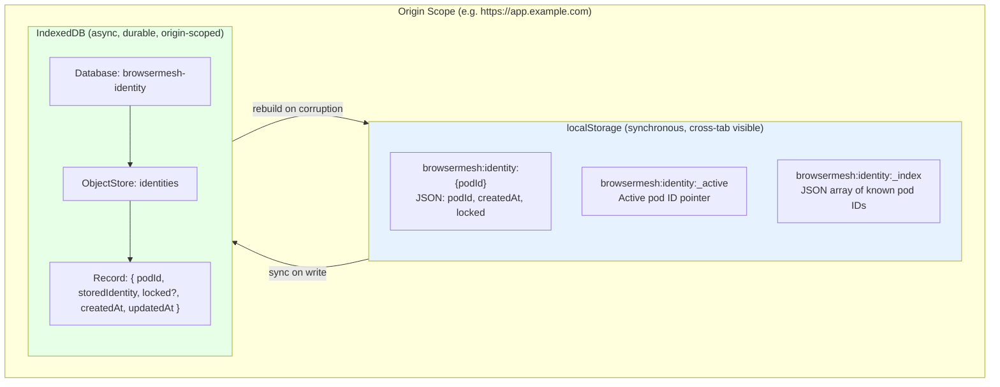
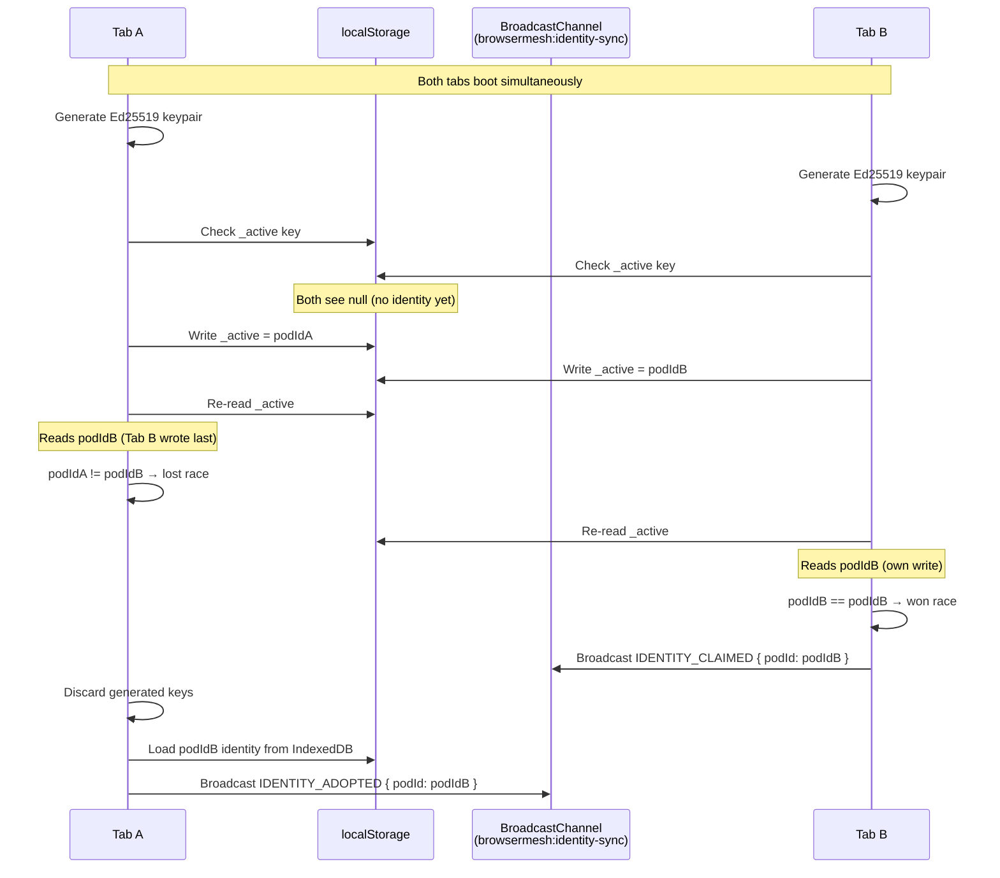
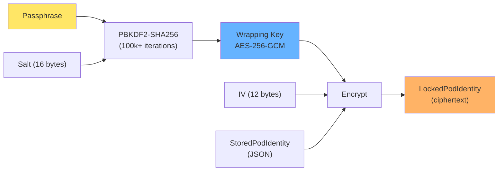
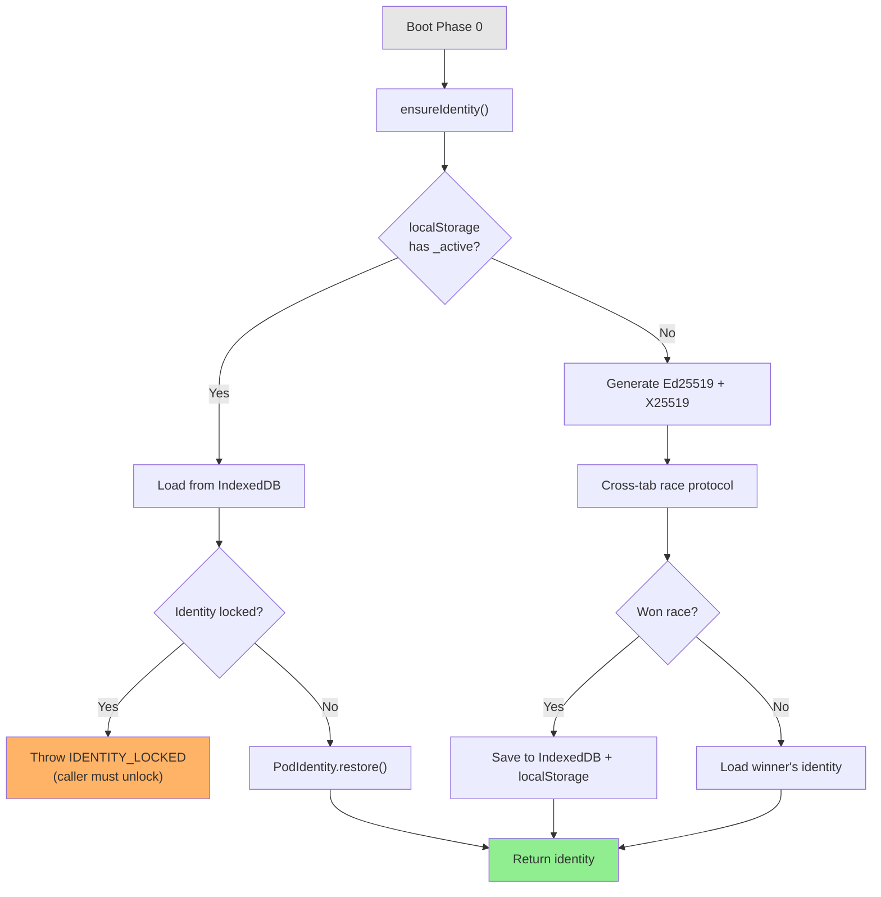

# Identity Persistence

Key-at-rest protection and cross-tab identity synchronization for BrowserMesh pods.

**Related specs**: [identity-keys.md](identity-keys.md) | [session-keys.md](session-keys.md) | [boot-sequence.md](../core/boot-sequence.md)

## 1. Overview

BrowserMesh pods require persistent identity across page reloads, tab closures, and browser restarts. This spec defines:

- A dual-layer storage model (localStorage + IndexedDB) for identity persistence
- Cross-tab synchronization to prevent identity collisions
- Passphrase-based key protection at rest using PBKDF2 + AES-GCM
- Origin-scoped isolation ensuring independent identity per origin
- An automatic identity manager that integrates with the boot sequence

## 2. Storage Architecture

Identity material is stored in two complementary layers. localStorage provides synchronous reads and cross-tab visibility via the `storage` event. IndexedDB provides durable, structured storage with origin scoping. Both layers are kept in sync; localStorage acts as a fast index, IndexedDB as the authoritative store.

### 2.1 Storage Hierarchy



### 2.2 Key Naming Convention

All localStorage keys follow the pattern:

```
browsermesh:identity:{podId}
```

Where `{podId}` is the base64url-encoded SHA-256 hash of the Ed25519 public key (see [identity-keys.md](identity-keys.md)).

Reserved keys:

| Key | Purpose |
|-----|---------|
| `browsermesh:identity:_active` | Pod ID of the currently active identity |
| `browsermesh:identity:_index` | JSON array of all stored pod IDs |
| `browsermesh:identity:{podId}` | Metadata for a specific identity |

## 3. StoredPodIdentity Format

The canonical serialization format for identity material at rest. This extends the `StoredPodIdentity` interface from [identity-keys.md](identity-keys.md).

```typescript
interface StoredPodIdentity {
  /** Ed25519 identity keypair in JWK format */
  identity: { public: JsonWebKey; private: JsonWebKey };

  /** X25519 static DH keypair in JWK format */
  staticDH: { public: JsonWebKey; private: JsonWebKey };

  /** Root secret for HD key derivation (base64url encoded) */
  rootSecret: string;
}

interface StoredIdentityMetadata {
  /** Self-certifying pod ID: base64url(SHA-256(publicKey)) */
  podId: string;

  /** Timestamp of identity creation */
  createdAt: number;

  /** Timestamp of last persistence write */
  updatedAt: number;

  /** Whether this identity is passphrase-locked */
  locked: boolean;

  /** Origin that created this identity */
  origin: string;
}
```

## 4. PodIdentityStore Interface

```typescript
interface PodIdentityStore {
  /**
   * Persist an identity to both storage layers.
   * Writes metadata to localStorage and full material to IndexedDB.
   */
  save(identity: StoredPodIdentity): Promise<void>;

  /**
   * Load an identity from storage.
   * If podId is omitted, loads the active identity.
   * Returns null if no identity is found.
   */
  load(podId?: string): Promise<StoredPodIdentity | null>;

  /**
   * Delete an identity from both storage layers.
   * Removes metadata from localStorage and record from IndexedDB.
   */
  delete(podId: string): Promise<void>;

  /**
   * List all stored pod IDs for this origin.
   * Reads from localStorage index for synchronous performance.
   */
  list(): string[];

  /**
   * Check if an identity exists (synchronous via localStorage).
   * If podId is omitted, checks for any active identity.
   */
  exists(podId?: string): boolean;
}
```

## 5. Cross-Tab Synchronization

When multiple tabs on the same origin boot simultaneously, a race condition can produce duplicate identities. The protocol below ensures exactly one identity wins per origin.

### 5.1 Race Condition Protocol



### 5.2 Synchronization Messages

```typescript
type IdentitySyncMessage =
  | {
      type: 'IDENTITY_CLAIMED';
      podId: string;
      timestamp: number;
    }
  | {
      type: 'IDENTITY_ADOPTED';
      podId: string;
      adoptedBy: string;  // Tab identifier (random per tab)
    }
  | {
      type: 'IDENTITY_DELETED';
      podId: string;
    }
  | {
      type: 'IDENTITY_LOCKED';
      podId: string;
    };

const SYNC_CHANNEL_NAME = 'browsermesh:identity-sync';
```

### 5.3 Cross-Tab Sync Implementation

```typescript
class IdentitySyncCoordinator {
  private channel: BroadcastChannel;
  private tabId: string;

  constructor(private store: PodIdentityStore) {
    this.tabId = crypto.randomUUID();
    this.channel = new BroadcastChannel(SYNC_CHANNEL_NAME);
    this.channel.onmessage = (e) => this.handleSyncMessage(e.data);
  }

  /**
   * Attempt to claim an identity as the active identity.
   * Returns true if this tab won the race, false if another tab
   * already claimed a different identity.
   */
  claimIdentity(podId: string): boolean {
    // Step 1: Check for existing active identity
    const active = localStorage.getItem('browsermesh:identity:_active');
    if (active && active !== podId) {
      // Another identity already active — adopt it instead
      return false;
    }

    // Step 2: Write our claim
    localStorage.setItem('browsermesh:identity:_active', podId);

    // Step 3: Re-read to detect concurrent writer
    const winner = localStorage.getItem('browsermesh:identity:_active');
    if (winner !== podId) {
      // Another tab wrote between our check and write
      return false;
    }

    // Step 4: Broadcast claim
    this.broadcast({ type: 'IDENTITY_CLAIMED', podId, timestamp: Date.now() });
    return true;
  }

  /**
   * Listen for storage events from other tabs
   */
  installStorageListener(onIdentityChange: (podId: string) => void): void {
    window.addEventListener('storage', (e) => {
      if (e.key === 'browsermesh:identity:_active' && e.newValue) {
        onIdentityChange(e.newValue);
      }
    });
  }

  private handleSyncMessage(msg: IdentitySyncMessage): void {
    switch (msg.type) {
      case 'IDENTITY_CLAIMED':
        // Another tab claimed an identity; update local state
        break;
      case 'IDENTITY_DELETED':
        // Another tab deleted an identity; remove from local cache
        break;
      case 'IDENTITY_LOCKED':
        // Another tab locked an identity; invalidate cached unlocked version
        break;
    }
  }

  private broadcast(msg: IdentitySyncMessage): void {
    this.channel.postMessage(msg);
  }

  close(): void {
    this.channel.close();
  }
}
```

## 6. Key Protection At Rest

Identities can be encrypted with a user-supplied passphrase before storage. This protects key material against physical device access or XSS data exfiltration.

### 6.1 LockedPodIdentity Interface

```typescript
interface LockedPodIdentity {
  /** Identifies this as a locked identity */
  version: 1;

  /** Self-certifying pod ID (public, not encrypted) */
  podId: string;

  /** Random salt for PBKDF2 derivation (16 bytes) */
  salt: Uint8Array;

  /** PBKDF2 iteration count (minimum 100000) */
  iterations: number;

  /** AES-GCM initialization vector (12 bytes) */
  iv: Uint8Array;

  /** AES-GCM encrypted StoredPodIdentity (ciphertext + 16-byte tag) */
  encryptedData: Uint8Array;
}
```

### 6.2 Lock/Unlock Functions

```typescript
const MIN_PBKDF2_ITERATIONS = 100_000;
const SALT_LENGTH = 16;
const IV_LENGTH = 12;

/**
 * Lock an identity with a passphrase.
 * Derives an AES-256-GCM wrapping key from the passphrase via PBKDF2-SHA256,
 * then encrypts the serialized StoredPodIdentity.
 */
async function lockIdentity(
  stored: StoredPodIdentity,
  passphrase: string
): Promise<LockedPodIdentity> {
  const salt = crypto.getRandomValues(new Uint8Array(SALT_LENGTH));
  const iv = crypto.getRandomValues(new Uint8Array(IV_LENGTH));
  const iterations = MIN_PBKDF2_ITERATIONS;

  // Derive wrapping key from passphrase
  const wrappingKey = await deriveWrappingKey(passphrase, salt, iterations);

  // Serialize identity to JSON bytes
  const plaintext = new TextEncoder().encode(JSON.stringify(stored));

  // Encrypt with AES-GCM
  const ciphertext = await crypto.subtle.encrypt(
    { name: 'AES-GCM', iv },
    wrappingKey,
    plaintext
  );

  // Derive podId from the identity public key for the metadata
  const publicKeyRaw = await crypto.subtle.exportKey(
    'raw',
    await crypto.subtle.importKey(
      'jwk',
      stored.identity.public,
      'Ed25519',
      true,
      ['verify']
    )
  );
  const podIdHash = await crypto.subtle.digest('SHA-256', publicKeyRaw);
  const podId = base64urlEncode(new Uint8Array(podIdHash));

  return {
    version: 1,
    podId,
    salt,
    iterations,
    iv,
    encryptedData: new Uint8Array(ciphertext),
  };
}

/**
 * Unlock a locked identity with a passphrase.
 * Derives the wrapping key and decrypts the StoredPodIdentity.
 * Throws if the passphrase is incorrect (AES-GCM tag verification fails).
 */
async function unlockIdentity(
  locked: LockedPodIdentity,
  passphrase: string
): Promise<StoredPodIdentity> {
  // Validate iteration count
  if (locked.iterations < MIN_PBKDF2_ITERATIONS) {
    throw new IdentityPersistenceError(
      'WEAK_PARAMETERS',
      `PBKDF2 iterations ${locked.iterations} below minimum ${MIN_PBKDF2_ITERATIONS}`
    );
  }

  // Derive wrapping key from passphrase
  const wrappingKey = await deriveWrappingKey(
    locked.passphrase ?? passphrase,
    locked.salt,
    locked.iterations
  );

  try {
    // Decrypt with AES-GCM
    const plaintext = await crypto.subtle.decrypt(
      { name: 'AES-GCM', iv: locked.iv },
      wrappingKey,
      locked.encryptedData
    );

    // Parse and return
    const json = new TextDecoder().decode(plaintext);
    return JSON.parse(json) as StoredPodIdentity;
  } catch {
    throw new IdentityPersistenceError(
      'UNLOCK_FAILED',
      'Decryption failed — incorrect passphrase or corrupted data'
    );
  }
}

/**
 * Derive an AES-256-GCM key from a passphrase using PBKDF2-SHA256.
 */
async function deriveWrappingKey(
  passphrase: string,
  salt: Uint8Array,
  iterations: number
): Promise<CryptoKey> {
  // Import passphrase as raw key material
  const baseKey = await crypto.subtle.importKey(
    'raw',
    new TextEncoder().encode(passphrase),
    'PBKDF2',
    false,
    ['deriveKey']
  );

  // Derive AES-GCM wrapping key
  return crypto.subtle.deriveKey(
    {
      name: 'PBKDF2',
      hash: 'SHA-256',
      salt,
      iterations,
    },
    baseKey,
    { name: 'AES-GCM', length: 256 },
    false,
    ['encrypt', 'decrypt']
  );
}
```

### 6.3 Key Derivation Diagram



## 7. Origin Scoping

Each origin receives independent identity storage. This prevents cross-origin identity leakage and ensures that `https://app-a.example.com` and `https://app-b.example.com` maintain separate pod identities.

### 7.1 Isolation Guarantees

| Property | Mechanism |
|----------|-----------|
| Storage isolation | localStorage and IndexedDB are origin-scoped by the browser |
| Key prefix | `browsermesh:identity:` is scoped to the calling origin automatically |
| No cross-origin reads | Browser same-origin policy prevents access |
| Subdomain isolation | `a.example.com` and `b.example.com` are separate origins |

### 7.2 Origin Hash for Key Prefixes

When identity records are exported (e.g., for backup or migration), the origin is included as a hash to prevent cross-origin replay.

```typescript
async function originScopedKey(podId: string): Promise<string> {
  const origin = location.origin;
  const originHash = base64urlEncode(
    new Uint8Array(
      await crypto.subtle.digest('SHA-256', new TextEncoder().encode(origin))
    )
  ).slice(0, 8);  // First 8 chars for brevity

  return `browsermesh:identity:${originHash}:${podId}`;
}
```

In practice, localStorage is already origin-scoped by the browser, so the origin hash prefix is only required for exported/backed-up records, not for in-browser storage keys.

## 8. AutoIdentityManager

The `AutoIdentityManager` integrates with the boot sequence ([boot-sequence.md](../core/boot-sequence.md), Phase 0) to provide create-or-restore semantics. On boot, it checks for an existing identity and restores it, or creates a new one and persists it.

### 8.1 Interface

```typescript
interface AutoIdentityManager {
  /**
   * Ensure this origin has an active pod identity.
   * - If an active identity exists, restore and return it
   * - If a locked identity exists, throw (caller must unlock)
   * - If no identity exists, create one, persist it, and return it
   * - Handles cross-tab races via IdentitySyncCoordinator
   */
  ensureIdentity(): Promise<PodIdentity>;

  /**
   * Unlock and activate a locked identity.
   * Replaces the current in-memory identity with the unlocked one.
   */
  unlockAndActivate(passphrase: string): Promise<PodIdentity>;

  /**
   * Lock the current active identity with a passphrase.
   * The identity remains active in memory but is stored encrypted.
   */
  lockActive(passphrase: string): Promise<void>;

  /**
   * Get the current active identity if loaded, without triggering
   * creation or restoration.
   */
  getActive(): PodIdentity | null;
}
```

### 8.2 Boot Integration



### 8.3 Implementation

```typescript
class DefaultAutoIdentityManager implements AutoIdentityManager {
  private active: PodIdentity | null = null;
  private store: PodIdentityStore;
  private sync: IdentitySyncCoordinator;

  constructor(store: PodIdentityStore) {
    this.store = store;
    this.sync = new IdentitySyncCoordinator(store);
  }

  async ensureIdentity(): Promise<PodIdentity> {
    // 1. Check for existing active identity
    if (this.store.exists()) {
      const stored = await this.store.load();
      if (!stored) {
        // localStorage says yes but IndexedDB says no — stale index
        return this.createAndPersist();
      }

      this.active = await PodIdentity.restore(stored);
      return this.active;
    }

    // 2. No existing identity — create one
    return this.createAndPersist();
  }

  private async createAndPersist(): Promise<PodIdentity> {
    // Generate new identity
    const identity = await PodIdentity.create();

    // Export for storage
    const stored = await identity.export();

    // Attempt to claim via cross-tab protocol
    const claimed = this.sync.claimIdentity(identity.podId);

    if (!claimed) {
      // Another tab beat us — load their identity
      const activeId = localStorage.getItem('browsermesh:identity:_active');
      if (activeId) {
        const winnerStored = await this.store.load(activeId);
        if (winnerStored) {
          this.active = await PodIdentity.restore(winnerStored);
          return this.active;
        }
      }
      // Fallback: use our generated identity anyway
    }

    // Persist our identity
    await this.store.save(stored);

    this.active = identity;
    return identity;
  }

  async unlockAndActivate(passphrase: string): Promise<PodIdentity> {
    const activeId = localStorage.getItem('browsermesh:identity:_active');
    if (!activeId) {
      throw new IdentityPersistenceError('NO_IDENTITY', 'No active identity to unlock');
    }

    // Load locked identity from IndexedDB
    const record = await this.loadLockedRecord(activeId);
    if (!record) {
      throw new IdentityPersistenceError('NOT_FOUND', `Identity ${activeId} not found`);
    }

    // Decrypt
    const stored = await unlockIdentity(record.locked, passphrase);

    // Restore and activate
    this.active = await PodIdentity.restore(stored);
    return this.active;
  }

  async lockActive(passphrase: string): Promise<void> {
    if (!this.active) {
      throw new IdentityPersistenceError('NO_IDENTITY', 'No active identity to lock');
    }

    const stored = await this.active.export();
    const locked = await lockIdentity(stored, passphrase);

    // Save locked version to IndexedDB
    await this.saveLockedRecord(this.active.podId, locked);

    // Update localStorage metadata
    const meta = localStorage.getItem(`browsermesh:identity:${this.active.podId}`);
    if (meta) {
      const parsed = JSON.parse(meta);
      parsed.locked = true;
      localStorage.setItem(
        `browsermesh:identity:${this.active.podId}`,
        JSON.stringify(parsed)
      );
    }

    // Notify other tabs
    this.sync.broadcast({
      type: 'IDENTITY_LOCKED',
      podId: this.active.podId,
    });
  }

  getActive(): PodIdentity | null {
    return this.active;
  }

  private async loadLockedRecord(
    podId: string
  ): Promise<{ locked: LockedPodIdentity } | null> {
    // Implementation reads from IndexedDB
    // See Section 9 for full IndexedDB implementation
    return null;
  }

  private async saveLockedRecord(
    podId: string,
    locked: LockedPodIdentity
  ): Promise<void> {
    // Implementation writes to IndexedDB
    // See Section 9 for full IndexedDB implementation
  }
}
```

## 9. PodIdentityStore Implementation

Full dual-persistence implementation using localStorage + IndexedDB.

```typescript
const DB_NAME = 'browsermesh-identity';
const DB_VERSION = 1;
const STORE_NAME = 'identities';
const LS_PREFIX = 'browsermesh:identity:';

class PodIdentityStoreImpl implements PodIdentityStore {
  private dbPromise: Promise<IDBDatabase>;

  constructor() {
    this.dbPromise = this.openDatabase();
  }

  // --- Public API ---

  async save(identity: StoredPodIdentity): Promise<void> {
    // Derive pod ID from public key
    const publicKey = await crypto.subtle.importKey(
      'jwk',
      identity.identity.public,
      'Ed25519',
      true,
      ['verify']
    );
    const raw = await crypto.subtle.exportKey('raw', publicKey);
    const hash = await crypto.subtle.digest('SHA-256', raw);
    const podId = base64urlEncode(new Uint8Array(hash));

    const now = Date.now();

    // Write to IndexedDB (authoritative store)
    const db = await this.dbPromise;
    await this.idbPut(db, {
      podId,
      storedIdentity: identity,
      locked: null,
      createdAt: now,
      updatedAt: now,
    });

    // Write metadata to localStorage (fast index)
    const meta: StoredIdentityMetadata = {
      podId,
      createdAt: now,
      updatedAt: now,
      locked: false,
      origin: location.origin,
    };
    localStorage.setItem(`${LS_PREFIX}${podId}`, JSON.stringify(meta));

    // Update index
    this.updateIndex(podId, 'add');

    // Set as active
    localStorage.setItem(`${LS_PREFIX}_active`, podId);
  }

  async load(podId?: string): Promise<StoredPodIdentity | null> {
    const targetId = podId ?? localStorage.getItem(`${LS_PREFIX}_active`);
    if (!targetId) return null;

    const db = await this.dbPromise;
    const record = await this.idbGet(db, targetId);
    return record?.storedIdentity ?? null;
  }

  async delete(podId: string): Promise<void> {
    // Remove from IndexedDB
    const db = await this.dbPromise;
    await this.idbDelete(db, podId);

    // Remove from localStorage
    localStorage.removeItem(`${LS_PREFIX}${podId}`);
    this.updateIndex(podId, 'remove');

    // Clear active pointer if this was the active identity
    const active = localStorage.getItem(`${LS_PREFIX}_active`);
    if (active === podId) {
      localStorage.removeItem(`${LS_PREFIX}_active`);
    }
  }

  list(): string[] {
    const indexJson = localStorage.getItem(`${LS_PREFIX}_index`);
    if (!indexJson) return [];
    try {
      return JSON.parse(indexJson);
    } catch {
      return [];
    }
  }

  exists(podId?: string): boolean {
    if (podId) {
      return localStorage.getItem(`${LS_PREFIX}${podId}`) !== null;
    }
    return localStorage.getItem(`${LS_PREFIX}_active`) !== null;
  }

  // --- IndexedDB helpers ---

  private openDatabase(): Promise<IDBDatabase> {
    return new Promise((resolve, reject) => {
      const request = indexedDB.open(DB_NAME, DB_VERSION);

      request.onupgradeneeded = () => {
        const db = request.result;
        if (!db.objectStoreNames.contains(STORE_NAME)) {
          const store = db.createObjectStore(STORE_NAME, { keyPath: 'podId' });
          store.createIndex('createdAt', 'createdAt', { unique: false });
        }
      };

      request.onsuccess = () => resolve(request.result);
      request.onerror = () => reject(request.error);
    });
  }

  private idbPut(db: IDBDatabase, record: IDBIdentityRecord): Promise<void> {
    return new Promise((resolve, reject) => {
      const tx = db.transaction(STORE_NAME, 'readwrite');
      tx.objectStore(STORE_NAME).put(record);
      tx.oncomplete = () => resolve();
      tx.onerror = () => reject(tx.error);
    });
  }

  private idbGet(db: IDBDatabase, podId: string): Promise<IDBIdentityRecord | null> {
    return new Promise((resolve, reject) => {
      const tx = db.transaction(STORE_NAME, 'readonly');
      const request = tx.objectStore(STORE_NAME).get(podId);
      request.onsuccess = () => resolve(request.result ?? null);
      request.onerror = () => reject(request.error);
    });
  }

  private idbDelete(db: IDBDatabase, podId: string): Promise<void> {
    return new Promise((resolve, reject) => {
      const tx = db.transaction(STORE_NAME, 'readwrite');
      tx.objectStore(STORE_NAME).delete(podId);
      tx.oncomplete = () => resolve();
      tx.onerror = () => reject(tx.error);
    });
  }

  // --- localStorage index helpers ---

  private updateIndex(podId: string, action: 'add' | 'remove'): void {
    const ids = this.list();
    if (action === 'add') {
      if (!ids.includes(podId)) {
        ids.push(podId);
      }
    } else {
      const idx = ids.indexOf(podId);
      if (idx !== -1) {
        ids.splice(idx, 1);
      }
    }
    localStorage.setItem(`${LS_PREFIX}_index`, JSON.stringify(ids));
  }
}

interface IDBIdentityRecord {
  podId: string;
  storedIdentity: StoredPodIdentity | null;
  locked: LockedPodIdentity | null;
  createdAt: number;
  updatedAt: number;
}
```

## 10. Error Handling

```typescript
class IdentityPersistenceError extends Error {
  constructor(
    readonly code: IdentityPersistenceErrorCode,
    message: string
  ) {
    super(message);
    this.name = 'IdentityPersistenceError';
  }
}

type IdentityPersistenceErrorCode =
  | 'STORAGE_UNAVAILABLE'    // localStorage or IndexedDB not available
  | 'STORAGE_FULL'           // Storage quota exceeded
  | 'IDENTITY_EXISTS'        // Attempted to create duplicate identity
  | 'NOT_FOUND'              // Identity not found in store
  | 'NO_IDENTITY'            // No active identity
  | 'UNLOCK_FAILED'          // Incorrect passphrase or corrupted data
  | 'WEAK_PARAMETERS'        // PBKDF2 iterations below minimum
  | 'IDENTITY_LOCKED'        // Identity is locked, must unlock first
  | 'INDEX_CORRUPTED'        // localStorage index does not match IndexedDB
  | 'MAX_IDENTITIES';        // Exceeded per-origin identity limit
```

## 11. Security Properties

| Property | Mechanism |
|----------|-----------|
| Key-at-rest protection | PBKDF2 + AES-GCM encryption with user passphrase |
| Brute-force resistance | Minimum 100k PBKDF2 iterations; 16-byte random salt |
| Cross-origin isolation | Browser same-origin policy; origin hash on export |
| Cross-tab consistency | localStorage `storage` event + BroadcastChannel sync |
| Forward secrecy on delete | Both localStorage and IndexedDB records removed |
| Integrity of locked data | AES-GCM authentication tag detects tampering |
| No plaintext key leakage | Private keys only in memory while unlocked |

## 12. Limits

| Parameter | Value | Rationale |
|-----------|-------|-----------|
| Max identities per origin | 16 | Prevent storage abuse |
| Max locked identity size | 2048 bytes | Bound ciphertext size |
| PBKDF2 min iterations | 100000 | OWASP recommendation for passphrase-based key derivation |
| localStorage key max length | 256 chars | Prevent oversized keys |
| IndexedDB record max size | 4096 bytes | Bound per-record storage |
| BroadcastChannel message max | 1024 bytes | Prevent oversized sync messages |
| Cross-tab race re-read delay | 0 ms (synchronous) | localStorage writes are atomic per spec |

## 13. Implementation Status

Mapping of spec sections to implementation in `web/clawser-mesh-identity.js`.

| Spec Section | Implementation Class | Notes |
|---|---|---|
| §2 Storage Architecture | `IndexedDBIdentityStorage` | IndexedDB-only (no dual localStorage layer); localStorage cross-tab index via `mesh_identity_index_{wsId}` |
| §2 Storage Architecture | `InMemoryIdentityStorage` | Test/fallback adapter; same interface |
| §4 PodIdentityStore | `IndexedDBIdentityStorage` | `open()`, `save()`, `load()`, `remove()`, `list()`, `clear()`, `close()` |
| §5 Cross-Tab Sync | `IdentitySyncCoordinator` | BroadcastChannel `mesh-identity-sync`; `acquireCreateLock()` with 100ms contention window |
| §6 Key Protection | `VaultIdentityStorage` | PBKDF2(310k, SHA-256) → AES-256-GCM; encrypts only `privateKeyJwk`; 16-byte salt, 12-byte IV |
| §8 AutoIdentityManager | `AutoIdentityManager` | `boot(workspaceId)`, `ensureIdentity()`, `switchIdentity()`, `getActive()`, `listIdentities()`, `toJSON()/fromJSON()` |
| — (new) | `IdentitySelector` | Per-peer/per-scope identity selection rules; `resolve(peerId, scope?)` with fallback to active |
| — (new) | `MeshIdentityManager.getIdentity()` | Returns full `PodIdentity` with key pair for a given pod ID |

### Deviations from Spec

1. **Single-layer storage**: Implementation uses IndexedDB only (not dual localStorage + IndexedDB). localStorage is used only for the cross-tab pod ID index, not for full identity metadata.
2. **PBKDF2 iterations**: Implementation uses 310,000 iterations (spec minimum: 100,000).
3. **Vault scope**: Only `privateKeyJwk` is encrypted; `publicKey`, `metadata`, and `__meta__` records pass through unencrypted.
4. **Race protocol**: Uses `acquireCreateLock()` with 100ms BroadcastChannel contention window instead of localStorage write-then-reread.

### Additional Components (not in spec)

| Component | File | Purpose |
|---|---|---|
| `SignedKeyLink` | `web/clawser-mesh-keyring.js` | Dual Ed25519 signatures (parent + child) over canonical `parent\|child\|relation\|timestamp` payload |
| `MeshKeyring.addVerifiedLink()` | `web/clawser-mesh-keyring.js` | Validates SignedKeyLink signatures before storing |
| `MeshKeyring.verifyCryptoChain()` | `web/clawser-mesh-keyring.js` | Walks chain, checks expiration + cryptographic signatures |
| `MeshWshBridge` | `web/clawser-mesh-wsh-bridge.js` | Bridges WshKeyStore (hex fingerprints) ↔ MeshIdentityManager (base64url pod IDs) |
| 8 Identity BrowserTools | `web/clawser-mesh-identity-tools.js` | Agent-facing tools: create, list, switch, export, import, delete, link, select_rule |
