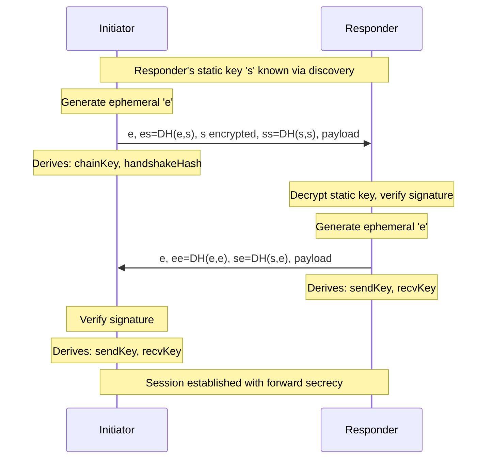
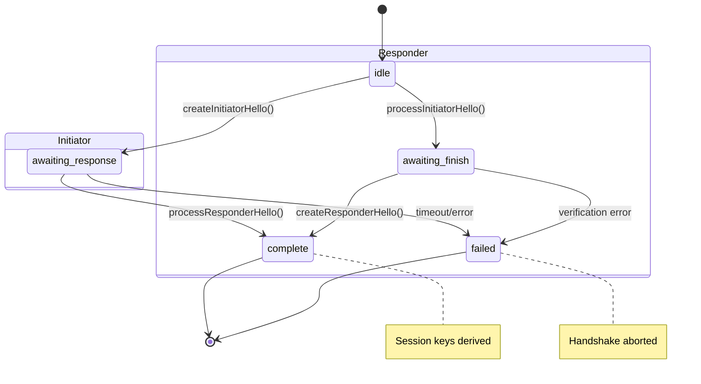
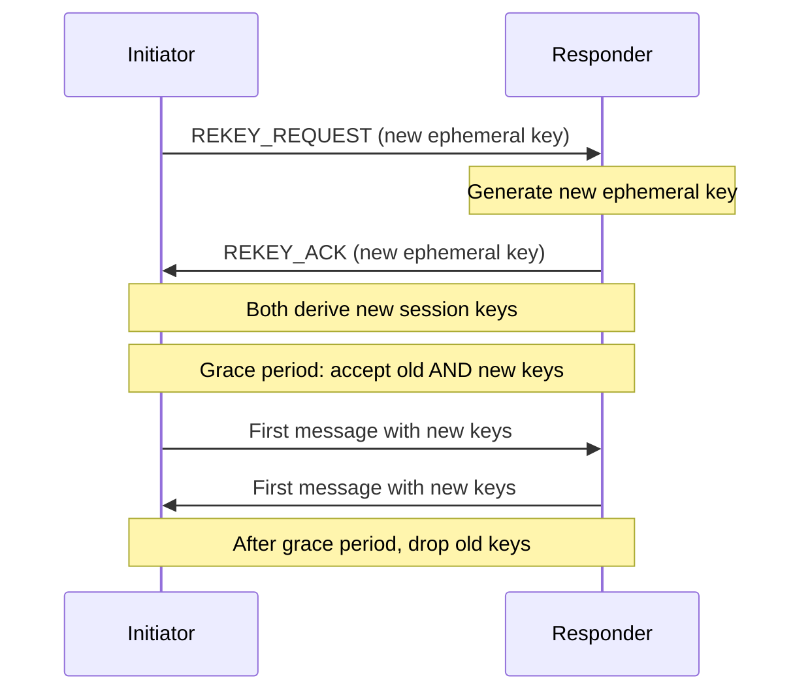

# Session Keys

Noise-inspired handshake and session key management for BrowserMesh.

**Related specs**: [identity-keys.md](identity-keys.md) | [webauthn-identity.md](webauthn-identity.md) | [channel-abstraction.md](../networking/channel-abstraction.md) | [link-negotiation.md](../networking/link-negotiation.md) | [security-model.md](../core/security-model.md)

## 1. Overview

The session layer establishes:
- Mutual authentication (both pods prove identity)
- Forward secrecy (ephemeral keys protect past sessions)
- Session key agreement (shared secret for encryption)

## 2. Noise Pattern: IK

BrowserMesh uses a pattern similar to Noise IK (Interactive, Known):
- Initiator knows responder's static public key (from discovery)
- Both parties have long-term identity keys
- Ephemeral keys provide forward secrecy



Translated:
1. Responder's static key `s` is known (via discovery)
2. Initiator sends: ephemeral `e`, DH(e,s), static `s`, DH(s,s)
3. Responder sends: ephemeral `e`, DH(e,e), DH(s,e)

## 3. Handshake State Machine



```typescript
type HandshakeState =
  | 'idle'
  | 'awaiting-response'
  | 'awaiting-finish'
  | 'complete'
  | 'failed';

interface HandshakeContext {
  state: HandshakeState;
  role: 'initiator' | 'responder';

  // Local keys (see identity-keys.md)
  localIdentity: CryptoKeyPair;      // Ed25519
  localStatic: CryptoKeyPair;        // X25519
  localEphemeral?: CryptoKeyPair;    // X25519 (per-session)

  // Remote keys (learned during handshake)
  remoteIdentity?: Uint8Array;
  remoteStatic?: Uint8Array;
  remoteEphemeral?: Uint8Array;

  // Derived state
  chainKey: Uint8Array;
  handshakeHash: Uint8Array;

  // Final session keys
  sendKey?: CryptoKey;
  recvKey?: CryptoKey;
}
```

## 4. Handshake Implementation

```typescript
class NoiseHandshake {
  private ctx: HandshakeContext;
  private nonce: number = 0;

  private initialized: Promise<void>;

  constructor(
    localIdentity: CryptoKeyPair,
    localStatic: CryptoKeyPair,
    remoteStatic?: Uint8Array  // Known for IK pattern
  ) {
    this.ctx = {
      state: 'idle',
      role: remoteStatic ? 'initiator' : 'responder',
      localIdentity,
      localStatic,
      remoteStatic,
      chainKey: new Uint8Array(32),
      handshakeHash: new Uint8Array(32),
    };

    this.initialized = this.initializeSymmetric('BrowserMesh_IK_25519_AESGCM_SHA256');
  }

  private async initializeSymmetric(protocolName: string): Promise<void> {
    const nameBytes = new TextEncoder().encode(protocolName);

    if (nameBytes.length <= 32) {
      this.ctx.handshakeHash = new Uint8Array(32);
      this.ctx.handshakeHash.set(nameBytes);
    } else {
      this.ctx.handshakeHash = await sha256(nameBytes);
    }

    this.ctx.chainKey = this.ctx.handshakeHash.slice();
  }

  /**
   * Wait for initialization to complete before handshake operations
   */
  async ready(): Promise<void> {
    await this.initialized;
  }

  private async mixHash(data: Uint8Array): Promise<void> {
    this.ctx.handshakeHash = await sha256(
      concat(this.ctx.handshakeHash, data)
    );
  }

  private async mixKey(ikm: Uint8Array): Promise<void> {
    const hkdfKey = await crypto.subtle.importKey(
      'raw',
      this.ctx.chainKey,
      'HKDF',
      false,
      ['deriveBits']
    );

    const output = await crypto.subtle.deriveBits(
      {
        name: 'HKDF',
        hash: 'SHA-256',
        salt: new Uint8Array(0),
        info: ikm,
      },
      hkdfKey,
      512
    );

    const bytes = new Uint8Array(output);
    this.ctx.chainKey = bytes.slice(0, 32);
    // bytes.slice(32, 64) is temp key for encryption
  }

  private async dh(
    localPrivate: CryptoKey,
    remotePublic: Uint8Array
  ): Promise<Uint8Array> {
    const remotePubKey = await crypto.subtle.importKey(
      'raw',
      remotePublic,
      'X25519',
      false,
      []
    );

    const shared = await crypto.subtle.deriveBits(
      { name: 'X25519', public: remotePubKey },
      localPrivate,
      256
    );

    return new Uint8Array(shared);
  }

  // === INITIATOR ===

  async createInitiatorHello(): Promise<Uint8Array> {
    this.assertState('idle');
    this.ctx.role = 'initiator';

    // Generate ephemeral key
    this.ctx.localEphemeral = await crypto.subtle.generateKey(
      'X25519',
      true,
      ['deriveBits']
    );

    const message: Uint8Array[] = [];

    // e: Send ephemeral public key
    const ephemeralPub = new Uint8Array(
      await crypto.subtle.exportKey('raw', this.ctx.localEphemeral.publicKey)
    );
    message.push(ephemeralPub);
    await this.mixHash(ephemeralPub);

    // es: DH(ephemeral, remote static)
    const es = await this.dh(
      this.ctx.localEphemeral.privateKey,
      this.ctx.remoteStatic!
    );
    await this.mixKey(es);

    // s: Send static public key (encrypted)
    const staticPub = new Uint8Array(
      await crypto.subtle.exportKey('raw', this.ctx.localStatic.publicKey)
    );
    const encryptedStatic = await this.encryptAndHash(staticPub);
    message.push(encryptedStatic);

    // ss: DH(static, remote static)
    const ss = await this.dh(
      this.ctx.localStatic.privateKey,
      this.ctx.remoteStatic!
    );
    await this.mixKey(ss);

    // Payload: identity proof
    const payload = await this.createPayload();
    const encryptedPayload = await this.encryptAndHash(payload);
    message.push(encryptedPayload);

    this.ctx.state = 'awaiting-response';
    return concat(...message);
  }

  async processResponderHello(message: Uint8Array): Promise<void> {
    this.assertState('awaiting-response');

    let offset = 0;

    // e: Read ephemeral public key
    this.ctx.remoteEphemeral = message.slice(offset, offset + 32);
    offset += 32;
    await this.mixHash(this.ctx.remoteEphemeral);

    // ee: DH(local ephemeral, remote ephemeral)
    const ee = await this.dh(
      this.ctx.localEphemeral!.privateKey,
      this.ctx.remoteEphemeral
    );
    await this.mixKey(ee);

    // se: DH(local static, remote ephemeral)
    const se = await this.dh(
      this.ctx.localStatic.privateKey,
      this.ctx.remoteEphemeral
    );
    await this.mixKey(se);

    // Decrypt payload
    const encryptedPayload = message.slice(offset);
    const payload = await this.decryptAndHash(encryptedPayload);
    await this.verifyPayload(payload);

    // Derive session keys
    await this.split();

    this.ctx.state = 'complete';
  }

  // === RESPONDER ===

  async processInitiatorHello(message: Uint8Array): Promise<void> {
    this.assertState('idle');
    this.ctx.role = 'responder';

    let offset = 0;

    // e: Read ephemeral public key
    this.ctx.remoteEphemeral = message.slice(offset, offset + 32);
    offset += 32;
    await this.mixHash(this.ctx.remoteEphemeral);

    // es: DH(local static, remote ephemeral)
    const es = await this.dh(
      this.ctx.localStatic.privateKey,
      this.ctx.remoteEphemeral
    );
    await this.mixKey(es);

    // s: Decrypt static public key
    const encryptedStatic = message.slice(offset, offset + 32 + 16);
    offset += 48;
    this.ctx.remoteStatic = await this.decryptAndHash(encryptedStatic);

    // ss: DH(local static, remote static)
    const ss = await this.dh(
      this.ctx.localStatic.privateKey,
      this.ctx.remoteStatic
    );
    await this.mixKey(ss);

    // Decrypt payload
    const encryptedPayload = message.slice(offset);
    const payload = await this.decryptAndHash(encryptedPayload);
    await this.verifyPayload(payload);

    this.ctx.state = 'awaiting-finish';
  }

  async createResponderHello(): Promise<Uint8Array> {
    this.assertState('awaiting-finish');

    // Generate ephemeral key
    this.ctx.localEphemeral = await crypto.subtle.generateKey(
      'X25519',
      true,
      ['deriveBits']
    );

    const message: Uint8Array[] = [];

    // e: Send ephemeral public key
    const ephemeralPub = new Uint8Array(
      await crypto.subtle.exportKey('raw', this.ctx.localEphemeral.publicKey)
    );
    message.push(ephemeralPub);
    await this.mixHash(ephemeralPub);

    // ee: DH(local ephemeral, remote ephemeral)
    const ee = await this.dh(
      this.ctx.localEphemeral.privateKey,
      this.ctx.remoteEphemeral!
    );
    await this.mixKey(ee);

    // se: DH(local ephemeral, remote static)
    const se = await this.dh(
      this.ctx.localEphemeral.privateKey,
      this.ctx.remoteStatic!
    );
    await this.mixKey(se);

    // Payload
    const payload = await this.createPayload();
    const encryptedPayload = await this.encryptAndHash(payload);
    message.push(encryptedPayload);

    // Derive session keys
    await this.split();

    this.ctx.state = 'complete';
    return concat(...message);
  }

  // === COMMON ===

  private async createPayload(): Promise<Uint8Array> {
    const identityPub = new Uint8Array(
      await crypto.subtle.exportKey('raw', this.ctx.localIdentity.publicKey)
    );

    const signature = await crypto.subtle.sign(
      'Ed25519',
      this.ctx.localIdentity.privateKey,
      this.ctx.handshakeHash
    );

    return cbor.encode({
      identity: identityPub,
      signature: new Uint8Array(signature),
      timestamp: Date.now(),
    });
  }

  private async verifyPayload(payload: Uint8Array): Promise<void> {
    const { identity, signature, timestamp } = cbor.decode(payload);

    this.ctx.remoteIdentity = identity;

    // Check timestamp (30 second window)
    if (Math.abs(Date.now() - timestamp) > 30000) {
      throw new HandshakeError('TIMESTAMP_EXPIRED', 'Handshake timestamp expired');
    }

    // Verify signature
    const pubKey = await crypto.subtle.importKey(
      'raw',
      identity,
      'Ed25519',
      false,
      ['verify']
    );

    const valid = await crypto.subtle.verify(
      'Ed25519',
      pubKey,
      signature,
      this.ctx.handshakeHash
    );

    if (!valid) {
      throw new HandshakeError('INVALID_SIGNATURE', 'Invalid handshake signature');
    }
  }

  private async encryptAndHash(plaintext: Uint8Array): Promise<Uint8Array> {
    const key = await this.getEncryptionKey();
    const nonce = this.deriveNonce();

    const ciphertext = await crypto.subtle.encrypt(
      { name: 'AES-GCM', iv: nonce, additionalData: this.ctx.handshakeHash },
      key,
      plaintext
    );

    const result = new Uint8Array(ciphertext);
    await this.mixHash(result);
    return result;
  }

  private async decryptAndHash(ciphertext: Uint8Array): Promise<Uint8Array> {
    const key = await this.getEncryptionKey();
    const nonce = this.deriveNonce();

    const plaintext = await crypto.subtle.decrypt(
      { name: 'AES-GCM', iv: nonce, additionalData: this.ctx.handshakeHash },
      key,
      ciphertext
    );

    await this.mixHash(ciphertext);
    return new Uint8Array(plaintext);
  }

  private async getEncryptionKey(): Promise<CryptoKey> {
    return crypto.subtle.importKey(
      'raw',
      this.ctx.chainKey,
      { name: 'AES-GCM', length: 256 },
      false,
      ['encrypt', 'decrypt']
    );
  }

  private deriveNonce(): Uint8Array {
    const nonce = new Uint8Array(12);
    new DataView(nonce.buffer).setBigUint64(4, BigInt(this.nonce++), false);
    return nonce;
  }

  private async split(): Promise<void> {
    const hkdfKey = await crypto.subtle.importKey(
      'raw',
      this.ctx.chainKey,
      'HKDF',
      false,
      ['deriveKey']
    );

    const [sendKey, recvKey] = await Promise.all([
      crypto.subtle.deriveKey(
        {
          name: 'HKDF',
          hash: 'SHA-256',
          salt: new Uint8Array(0),
          info: new TextEncoder().encode('session-send'),
        },
        hkdfKey,
        { name: 'AES-GCM', length: 256 },
        false,
        ['encrypt', 'decrypt']
      ),
      crypto.subtle.deriveKey(
        {
          name: 'HKDF',
          hash: 'SHA-256',
          salt: new Uint8Array(0),
          info: new TextEncoder().encode('session-recv'),
        },
        hkdfKey,
        { name: 'AES-GCM', length: 256 },
        false,
        ['encrypt', 'decrypt']
      ),
    ]);

    if (this.ctx.role === 'initiator') {
      this.ctx.sendKey = sendKey;
      this.ctx.recvKey = recvKey;
    } else {
      this.ctx.sendKey = recvKey;
      this.ctx.recvKey = sendKey;
    }
  }

  getSessionKeys(): { sendKey: CryptoKey; recvKey: CryptoKey } {
    this.assertState('complete');
    return { sendKey: this.ctx.sendKey!, recvKey: this.ctx.recvKey! };
  }

  getRemoteIdentity(): Uint8Array {
    this.assertState('complete');
    return this.ctx.remoteIdentity!;
  }

  getRemotePodId(): string {
    return base64urlEncode(sha256(this.ctx.remoteIdentity!));
  }

  private assertState(...expected: HandshakeState[]): void {
    if (!expected.includes(this.ctx.state)) {
      throw new HandshakeError(
        'INVALID_STATE',
        `Expected ${expected.join('|')}, got ${this.ctx.state}`
      );
    }
  }
}
```

## 5. Session Encryption

```typescript
class SessionCrypto {
  private sendKey: CryptoKey;
  private recvKey: CryptoKey;
  private sendNonce: bigint = 0n;
  private recvNonce: bigint = 0n;

  constructor(sendKey: CryptoKey, recvKey: CryptoKey) {
    this.sendKey = sendKey;
    this.recvKey = recvKey;
  }

  static fromHandshake(handshake: NoiseHandshake): SessionCrypto {
    const { sendKey, recvKey } = handshake.getSessionKeys();
    return new SessionCrypto(sendKey, recvKey);
  }

  async encrypt(
    plaintext: Uint8Array,
    associatedData?: Uint8Array
  ): Promise<Uint8Array> {
    const nonce = this.nextSendNonce();

    const ciphertext = await crypto.subtle.encrypt(
      {
        name: 'AES-GCM',
        iv: nonce,
        additionalData: associatedData,
      },
      this.sendKey,
      plaintext
    );

    // Prepend nonce to ciphertext
    return concat(nonce, new Uint8Array(ciphertext));
  }

  async decrypt(
    message: Uint8Array,
    associatedData?: Uint8Array
  ): Promise<Uint8Array> {
    const nonce = message.slice(0, 12);
    const ciphertext = message.slice(12);

    // Verify nonce is >= expected (replay protection)
    const receivedNonce = new DataView(nonce.buffer).getBigUint64(4, false);
    if (receivedNonce < this.recvNonce) {
      throw new SessionError('REPLAY_DETECTED', 'Nonce replay detected');
    }
    this.recvNonce = receivedNonce + 1n;

    const plaintext = await crypto.subtle.decrypt(
      {
        name: 'AES-GCM',
        iv: nonce,
        additionalData: associatedData,
      },
      this.recvKey,
      ciphertext
    );

    return new Uint8Array(plaintext);
  }

  private nextSendNonce(): Uint8Array {
    const nonce = new Uint8Array(12);
    new DataView(nonce.buffer).setBigUint64(4, this.sendNonce++, false);
    return nonce;
  }

  /**
   * Check if session should be re-keyed
   */
  shouldRekey(): boolean {
    // Re-key after 1M messages or if nonce is getting high
    return this.sendNonce > 1_000_000n || this.recvNonce > 1_000_000n;
  }

  /**
   * Close the session and zero out keys
   * Prevents further use of this session
   */
  close(): void {
    // Zero out the key references
    // Note: Can't zero CryptoKey internals, but we can prevent use
    this.sendKey = null as any;
    this.recvKey = null as any;
    this.sendNonce = -1n;  // Will cause errors if used
    this.recvNonce = -1n;
    this.closed = true;
  }

  private closed = false;

  /**
   * Check if session is still usable
   */
  isOpen(): boolean {
    return !this.closed && this.sendKey !== null;
  }
}
```

## 6. Usage Example

```typescript
// === INITIATOR ===

const initiator = new NoiseHandshake(
  myIdentityKeys,
  myStaticDHKeys,
  responderStaticPublicKey  // Known from discovery
);

// Create and send hello
const hello = await initiator.createInitiatorHello();
channel.send({ type: 'HANDSHAKE_HELLO', data: hello });

// Wait for response
const response = await channel.receive();
await initiator.processResponderHello(response.data);

// Create encrypted session
const session = SessionCrypto.fromHandshake(initiator);

// Send encrypted messages
const encrypted = await session.encrypt(
  cbor.encode({ type: 'REQUEST', id: 1, payload: data })
);
channel.send({ type: 'MESSAGE', data: encrypted });


// === RESPONDER ===

const responder = new NoiseHandshake(
  myIdentityKeys,
  myStaticDHKeys
  // No remote key yet - will learn from hello
);

// Process hello
const hello = await channel.receive();
await responder.processInitiatorHello(hello.data);

// Create and send response
const response = await responder.createResponderHello();
channel.send({ type: 'HANDSHAKE_RESPONSE', data: response });

// Create encrypted session
const session = SessionCrypto.fromHandshake(responder);

// Receive encrypted messages
const message = await channel.receive();
const decrypted = await session.decrypt(message.data);
const request = cbor.decode(decrypted);
```

## 7. Security Properties

| Property | How Achieved |
|----------|--------------|
| **Mutual authentication** | Both parties sign handshake hash |
| **Forward secrecy** | Ephemeral X25519 keys per session |
| **Replay resistance** | Timestamps + monotonic nonces |
| **Identity hiding** | Static keys encrypted in transit |
| **Channel binding** | Handshake hash includes all messages |
| **Key confirmation** | Encrypted payloads prove key derivation |

## 8. Error Handling

```typescript
class HandshakeError extends Error {
  constructor(
    readonly code: HandshakeErrorCode,
    message: string
  ) {
    super(message);
    this.name = 'HandshakeError';
  }
}

type HandshakeErrorCode =
  | 'INVALID_STATE'
  | 'TIMESTAMP_EXPIRED'
  | 'INVALID_SIGNATURE'
  | 'DECRYPTION_FAILED'
  | 'PROTOCOL_VIOLATION';

class SessionError extends Error {
  constructor(
    readonly code: SessionErrorCode,
    message: string
  ) {
    super(message);
    this.name = 'SessionError';
  }
}

type SessionErrorCode =
  | 'REPLAY_DETECTED'
  | 'DECRYPTION_FAILED'
  | 'SESSION_EXPIRED';
```

## 9. Key Rotation

Sessions should be rotated periodically:

```typescript
class SessionManager {
  private sessions: Map<string, SessionCrypto> = new Map();
  private sessionTimestamps: Map<string, number> = new Map();
  private channels: Map<string, PodChannel> = new Map();  // See channel-abstraction.md

  private static MAX_SESSION_AGE = 24 * 60 * 60 * 1000;  // 24 hours
  private static MAX_MESSAGES = 1_000_000;  // Re-key after 1M messages

  constructor(
    private identity: PodIdentity,
    private staticDH: CryptoKeyPair
  ) {}

  async getOrCreateSession(
    peerId: string,
    peerStaticKey: Uint8Array,
    channel: PodChannel           // See channel-abstraction.md for PodChannel interface
  ): Promise<SessionCrypto> {
    const existing = this.sessions.get(peerId);
    const timestamp = this.sessionTimestamps.get(peerId) ?? 0;

    // Check if rotation needed (age or message count)
    if (existing && existing.isOpen()) {
      const ageOk = Date.now() - timestamp < SessionManager.MAX_SESSION_AGE;
      const countOk = !existing.shouldRekey();

      if (ageOk && countOk) {
        return existing;
      }

      // Close old session before creating new
      existing.close();
    }

    // Store channel for handshake
    this.channels.set(peerId, channel);

    // Create new session via handshake
    const session = await this.performHandshake(peerStaticKey, channel);
    this.sessions.set(peerId, session);
    this.sessionTimestamps.set(peerId, Date.now());

    return session;
  }

  /**
   * Perform full Noise IK handshake with peer
   */
  private async performHandshake(
    peerStaticKey: Uint8Array,
    channel: PodChannel
  ): Promise<SessionCrypto> {
    const handshake = new NoiseHandshake(
      this.identity.identityKeyPair,
      this.staticDH,
      peerStaticKey
    );

    // Wait for async initialization
    await handshake.ready();

    // Create and send initiator hello
    const hello = await handshake.createInitiatorHello();

    // Send via channel and wait for response
    const response = await this.sendAndWait(channel, {
      type: 'HANDSHAKE_HELLO',
      data: hello,
    });

    // Process response
    await handshake.processResponderHello(response.data);

    // Create session from completed handshake
    return SessionCrypto.fromHandshake(handshake);
  }

  /**
   * Handle incoming handshake as responder
   */
  async handleIncomingHandshake(
    data: Uint8Array,
    channel: PodChannel
  ): Promise<SessionCrypto> {
    const handshake = new NoiseHandshake(
      this.identity.identityKeyPair,
      this.staticDH
      // No remote key - will learn from hello
    );

    await handshake.ready();

    // Process initiator hello
    await handshake.processInitiatorHello(data);

    // Create and send response
    const response = await handshake.createResponderHello();
    channel.send({ type: 'HANDSHAKE_RESPONSE', data: response });

    // Get peer ID and store session
    const peerId = handshake.getRemotePodId();
    const session = SessionCrypto.fromHandshake(handshake);

    this.sessions.set(peerId, session);
    this.sessionTimestamps.set(peerId, Date.now());

    return session;
  }

  private sendAndWait(
    channel: PodChannel,
    message: unknown
  ): Promise<{ type: string; data: Uint8Array }> {
    return new Promise((resolve, reject) => {
      const timeout = setTimeout(() => {
        reject(new HandshakeError('HANDSHAKE_TIMEOUT', 'Handshake response timeout'));
      }, 5000);

      channel.onmessage = (e) => {
        clearTimeout(timeout);
        resolve(e.data);
      };

      channel.send(message);
    });
  }

  /**
   * Close a specific session
   */
  closeSession(peerId: string): void {
    const session = this.sessions.get(peerId);
    if (session) {
      session.close();
      this.sessions.delete(peerId);
      this.sessionTimestamps.delete(peerId);
      this.channels.delete(peerId);
    }
  }

  /**
   * Close all sessions
   */
  closeAll(): void {
    for (const [peerId, session] of this.sessions) {
      session.close();
    }
    this.sessions.clear();
    this.sessionTimestamps.clear();
    this.channels.clear();
  }

  /**
   * Get session for peer if exists and valid
   */
  getSession(peerId: string): SessionCrypto | undefined {
    const session = this.sessions.get(peerId);
    if (session?.isOpen()) {
      return session;
    }
    return undefined;
  }
}
```

### 9.1 Coordinated Re-Key Protocol

When a session needs re-keying (age or message count threshold), the initiator triggers a coordinated re-key. Both peers must transition atomically to avoid message loss.



```typescript
interface RekeyRequest {
  type: 'REKEY_REQUEST';
  ephemeralKey: Uint8Array;   // New X25519 ephemeral public key
  timestamp: number;
  signature: Uint8Array;
}

interface RekeyAck {
  type: 'REKEY_ACK';
  ephemeralKey: Uint8Array;
  timestamp: number;
  signature: Uint8Array;
}

const REKEY_GRACE_PERIOD = 5000;  // 5 seconds to accept both old and new keys

async function initiateRekey(
  session: SessionCrypto,
  channel: PodChannel,
  identity: PodIdentity
): Promise<SessionCrypto> {
  // Generate new ephemeral key
  const newEphemeral = await crypto.subtle.generateKey('X25519', true, ['deriveBits']);
  const ephemeralPub = new Uint8Array(
    await crypto.subtle.exportKey('raw', newEphemeral.publicKey)
  );

  // Send rekey request
  channel.send({
    type: 'REKEY_REQUEST',
    ephemeralKey: ephemeralPub,
    timestamp: Date.now(),
    signature: await identity.sign(ephemeralPub),
  });

  // Wait for acknowledgment (with timeout)
  const ack = await waitForMessage(channel, 'REKEY_ACK', 5000);

  // Derive new session keys from new ephemeral exchange
  const newSession = await deriveNewSessionKeys(newEphemeral, ack.ephemeralKey);

  // Grace period: both old and new keys accepted
  setTimeout(() => {
    session.close();  // Drop old keys after grace period
  }, REKEY_GRACE_PERIOD);

  return newSession;
}
```

## 10. Utility Functions

```typescript
/**
 * SHA-256 hash
 */
async function sha256(data: Uint8Array): Promise<Uint8Array> {
  const hash = await crypto.subtle.digest('SHA-256', data);
  return new Uint8Array(hash);
}

/**
 * Concatenate byte arrays
 */
function concat(...arrays: Uint8Array[]): Uint8Array {
  const total = arrays.reduce((sum, arr) => sum + arr.length, 0);
  const result = new Uint8Array(total);
  let offset = 0;
  for (const arr of arrays) {
    result.set(arr, offset);
    offset += arr.length;
  }
  return result;
}

/**
 * Base64url encode
 */
function base64urlEncode(bytes: Uint8Array): string {
  const base64 = btoa(String.fromCharCode(...bytes));
  return base64
    .replace(/\+/g, '-')
    .replace(/\//g, '_')
    .replace(/=/g, '');
}
```
