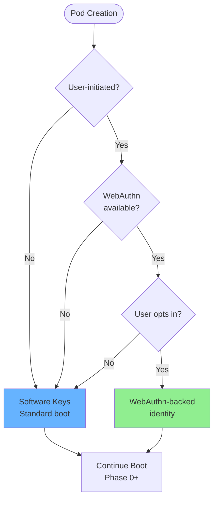
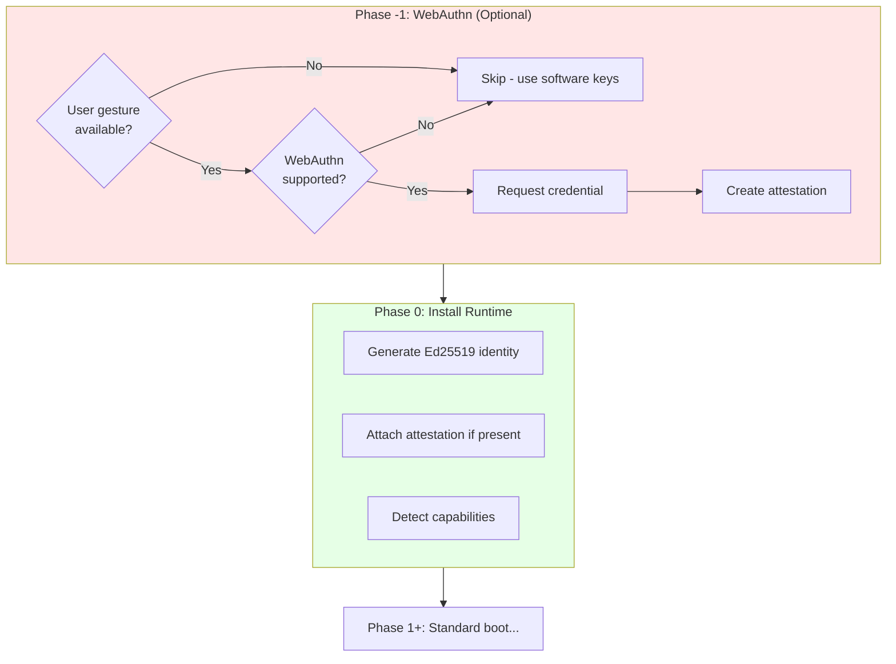

# WebAuthn Identity (Optional)

Optional hardware-backed identity for user-initiated pod creation using the Web Authentication API.

**Related specs**: [identity-keys.md](identity-keys.md) | [boot-sequence.md](../core/boot-sequence.md) | [session-keys.md](session-keys.md) | [security-model.md](../core/security-model.md)

> **Note**: This spec extends the base credentials API defined in [identity-keys.md](identity-keys.md).
> See that spec for `PodCredentialsContainer`, `PodCredential`, and `PodClientCapabilities` definitions.

## 1. Overview

WebAuthn integration provides optional hardware-backed security for "root" pod identities. This is useful when:

- A user explicitly creates a new pod (e.g., opening a new app)
- Hardware security (TPM, secure enclave, security key) is desired
- User presence verification is required before pod creation
- Attestation of pod origin is needed for audit/compliance

**This is entirely optional.** Pods spawned programmatically (workers, frames, child windows) continue using software-derived keys from their parent's identity.

## 2. When WebAuthn Applies



| Pod Type | WebAuthn Eligible | Reason |
|----------|-------------------|--------|
| WindowPod (user-opened) | ✅ Yes | User gesture available |
| WindowPod (spawned) | ❌ No | No user gesture |
| FramePod | ❌ No | Derives from parent |
| WorkerPod | ❌ No | No WebAuthn access |
| SharedWorkerPod | ❌ No | No WebAuthn access |
| ServiceWorkerPod | ❌ No | No WebAuthn access |

## 3. Identity Binding Modes

WebAuthn can integrate with pod identity in three ways:

### Mode A: Attestation Only (Recommended)

WebAuthn attests that a user authorized pod creation. The pod still generates its own Ed25519 identity, but includes a WebAuthn attestation proving user authorization.

```typescript
interface AttestedPodIdentity extends PodIdentity {
  attestation: {
    credentialId: Uint8Array;
    authenticatorData: Uint8Array;
    clientDataJSON: Uint8Array;
    signature: Uint8Array;        // Signs over pod's public key
    userHandle?: Uint8Array;      // Optional user identifier
  };
}
```

**Pros**: Maintains existing identity model, adds hardware attestation layer
**Cons**: Two key types to manage

### Mode B: Derived from WebAuthn

Pod identity is derived from the WebAuthn credential. The WebAuthn private key signs a challenge that includes the pod's derived public key.

```typescript
interface DerivedPodIdentity {
  // WebAuthn credential backs the root
  credentialId: Uint8Array;

  // Pod identity derived via HKDF from credential
  podId: string;
  publicKey: Uint8Array;

  // Proof of derivation (signed by WebAuthn credential)
  derivationProof: Uint8Array;
}
```

**Pros**: Single source of truth, hardware-backed root
**Cons**: WebAuthn credential required for all signing operations

### Mode C: Unlocking (Hybrid)

WebAuthn unlocks access to software keys stored encrypted. User verification required to access pod identity.

```typescript
interface UnlockedPodIdentity {
  // Encrypted root secret
  encryptedRootSecret: Uint8Array;

  // PRF output from WebAuthn unlocks the secret
  // See WebAuthn PRF extension
  unlockKey: CryptoKey;
}
```

**Pros**: Keys usable offline after unlock, hardware protection at rest
**Cons**: Requires PRF extension support

## 4. Boot Sequence Integration

WebAuthn integrates as an optional "Phase -1" before standard boot:



## 5. API Design

Following WebAuthn's `navigator.credentials` pattern. The base `PodCredentialsContainer` and `PodClientCapabilities` interfaces are defined in [identity-keys.md](identity-keys.md). This section describes WebAuthn-specific extensions.

### 5.1 Capability Detection

The `PodClientCapabilities` interface (defined in identity-keys.md) includes WebAuthn-specific fields:

```typescript
// From identity-keys.md - included here for reference
interface PodClientCapabilities {
  // Core crypto (always true in modern browsers as of 2025)
  ed25519: boolean;
  x25519: boolean;

  // WebAuthn support
  webauthn: boolean;
  platformAuthenticator: boolean;      // Touch ID, Windows Hello, etc.
  crossPlatformAuthenticator: boolean; // Security keys (USB, NFC, BLE)

  // WebAuthn extensions
  prf: boolean;                        // PRF extension for key derivation
  discoverableCredentials: boolean;    // Passkeys/resident keys
}

// Usage
const caps = await pod.credentials.getClientCapabilities();
if (caps.platformAuthenticator) {
  // Offer Touch ID / Windows Hello option
}

// Check WebAuthn availability directly
const webauthnAvailable = await pod.credentials.isWebAuthnAvailable();
```

### 5.2 Create Attested Identity

This section describes the full WebAuthn credential creation options. The base `PodCredentialCreationOptions` in identity-keys.md accepts a `webauthn` option that can be set to these detailed options.

```typescript
/**
 * Full WebAuthn credential creation options
 * This extends the base WebAuthnCreationOptions from identity-keys.md
 */
interface WebAuthnFullCreationOptions {
  // Challenge from application or self-generated
  challenge: Uint8Array;

  // Relying party info (typically the origin)
  rp: {
    id: string;          // e.g., "example.com"
    name: string;        // e.g., "My App"
  };

  // User info (optional, for discoverable credentials)
  user?: {
    id: Uint8Array;      // Unique user ID
    name: string;        // Username/email
    displayName: string; // Human-readable name
  };

  // Authenticator requirements
  authenticatorSelection?: {
    authenticatorAttachment?: 'platform' | 'cross-platform';
    residentKey?: 'required' | 'preferred' | 'discouraged';
    userVerification?: 'required' | 'preferred' | 'discouraged';
  };

  // Attestation preference
  attestation?: 'none' | 'indirect' | 'direct' | 'enterprise';

  // Extensions
  extensions?: {
    // PRF for key derivation
    prf?: { eval: { first: Uint8Array } };
  };
}

/**
 * Extended PodCredential with full WebAuthn attestation details
 * Extends the base PodCredential from identity-keys.md
 */
interface WebAuthnPodCredential extends PodCredential {
  // The pod identity (Ed25519) - uses 'identity' for consistency with base interface
  identity: PodIdentity;

  // Full attestation data (extends base WebAuthnAttestation)
  attestation: {
    authenticatorData: Uint8Array;
    clientDataJSON: Uint8Array;
    attestationObject: Uint8Array;
    // Note: The attestation signature is inside attestationObject,
    // not a separate field. Use parseAttestationObject() to extract.
  };

  // PRF output if requested (for key encryption)
  prfOutput?: Uint8Array;
}

// Create attested pod identity
async function createAttestedIdentity(
  options: WebAuthnFullCreationOptions
): Promise<WebAuthnPodCredential> {
  // 1. Generate pod identity first
  const podIdentity = await PodIdentity.create();
  const podPublicKey = await podIdentity.getPublicKey();

  // 2. Include pod public key in WebAuthn challenge
  // This binds the WebAuthn attestation to this specific pod identity
  const extendedChallenge = concat(
    options.challenge,
    podPublicKey
  );

  // 3. Create WebAuthn credential
  const credential = await navigator.credentials.create({
    publicKey: {
      challenge: extendedChallenge,
      rp: options.rp,
      user: options.user ?? {
        id: crypto.getRandomValues(new Uint8Array(16)),
        name: `pod-${podIdentity.podId.slice(0, 8)}`,
        displayName: 'BrowserMesh Pod',
      },
      pubKeyCredParams: [
        { type: 'public-key', alg: -8 },   // Ed25519 preferred
        { type: 'public-key', alg: -7 },   // ES256 fallback
      ],
      authenticatorSelection: options.authenticatorSelection ?? {
        userVerification: 'preferred',
      },
      attestation: options.attestation ?? 'none',
      extensions: options.extensions,
    },
  }) as PublicKeyCredential;

  const response = credential.response as AuthenticatorAttestationResponse;

  // 4. Build the credential object
  // Note: The signature is embedded in attestationObject, not extracted separately
  return {
    id: base64urlEncode(new Uint8Array(credential.rawId)),
    rawId: new Uint8Array(credential.rawId),
    identity: podIdentity,
    attested: true,
    attestation: {
      authenticatorData: new Uint8Array(response.getAuthenticatorData()),
      clientDataJSON: new Uint8Array(response.clientDataJSON),
      attestationObject: new Uint8Array(response.attestationObject),
    },
    prfOutput: credential.getClientExtensionResults().prf?.results?.first,
  };
}
```

### 5.3 Authenticate with Existing Credential

Use this to restore a pod identity using an existing WebAuthn credential (e.g., a passkey).

**Note**: This is different from `PodHandshakeAssertion` (see identity-keys.md) which is for peer-to-peer authentication. `WebAuthnRestoreResult` is specifically for WebAuthn credential assertion to restore a stored pod identity.

```typescript
/**
 * Options for restoring an attested identity via WebAuthn
 * Extends PodCredentialRequestOptions from identity-keys.md
 */
interface WebAuthnRestoreOptions {
  // Challenge for this authentication
  challenge: Uint8Array;

  // RP ID
  rpId: string;

  // Allowed credentials (empty for discoverable)
  allowCredentials?: {
    type: 'public-key';
    id: Uint8Array;
    transports?: ('usb' | 'nfc' | 'ble' | 'internal' | 'hybrid')[];
  }[];

  // User verification requirement
  userVerification?: 'required' | 'preferred' | 'discouraged';

  // Conditional mediation (passkey autofill)
  mediation?: 'conditional' | 'optional' | 'required' | 'silent';

  // Extensions
  extensions?: {
    prf?: { eval: { first: Uint8Array } };
  };
}

/**
 * Result of restoring a pod identity via WebAuthn assertion
 * NOT to be confused with PodHandshakeAssertion (peer-to-peer auth)
 */
interface WebAuthnRestoreResult {
  // Credential used
  credentialId: Uint8Array;

  // Restored pod identity (uses 'identity' for consistency)
  identity: PodIdentity;

  // WebAuthn assertion data
  webauthnAssertion: {
    authenticatorData: Uint8Array;
    clientDataJSON: Uint8Array;
    signature: Uint8Array;
    userHandle?: Uint8Array;
  };

  // PRF output if requested (for decrypting stored keys)
  prfOutput?: Uint8Array;
}

// Restore pod identity using WebAuthn
async function restoreAttestedIdentity(
  options: WebAuthnRestoreOptions,
  storedIdentity: StoredPodIdentity
): Promise<WebAuthnRestoreResult> {
  // 1. Get WebAuthn assertion
  const credential = await navigator.credentials.get({
    publicKey: {
      challenge: options.challenge,
      rpId: options.rpId,
      allowCredentials: options.allowCredentials,
      userVerification: options.userVerification ?? 'preferred',
      extensions: options.extensions,
    },
    mediation: options.mediation,
  }) as PublicKeyCredential;

  const response = credential.response as AuthenticatorAssertionResponse;

  // 2. Restore pod identity from storage
  const identity = await PodIdentity.restore(storedIdentity);

  // 3. If PRF available, use it to decrypt stored keys
  const prfOutput = credential.getClientExtensionResults().prf?.results?.first;

  return {
    credentialId: new Uint8Array(credential.rawId),
    identity,
    webauthnAssertion: {
      authenticatorData: new Uint8Array(response.authenticatorData),
      clientDataJSON: new Uint8Array(response.clientDataJSON),
      signature: new Uint8Array(response.signature),
      userHandle: response.userHandle
        ? new Uint8Array(response.userHandle)
        : undefined,
    },
    prfOutput,
  };
}
```

## 6. Storage Schema

```typescript
interface StoredAttestedIdentity extends StoredPodIdentity {
  // WebAuthn credential binding
  webauthn?: {
    credentialId: string;         // base64url
    rpId: string;
    userHandle?: string;          // base64url
    transports?: string[];
    createdAt: number;
    lastUsed: number;

    // If using PRF for encryption
    prfSalt?: string;             // base64url
  };

  // Attestation data (for verification)
  attestation?: {
    authenticatorData: string;    // base64url
    clientDataHash: string;       // SHA-256 of clientDataJSON
  };
}
```

## 7. Verification

### 7.1 Verifying Attested Identity

```typescript
async function verifyAttestedIdentity(
  credential: PodCredential,
  expectedChallenge: Uint8Array,
  expectedRpId: string
): Promise<boolean> {
  const { attestation, podIdentity } = credential;

  // 1. Parse authenticator data
  const authData = parseAuthenticatorData(attestation.authenticatorData);

  // 2. Verify RP ID hash
  const rpIdHash = await crypto.subtle.digest(
    'SHA-256',
    new TextEncoder().encode(expectedRpId)
  );
  if (!timingSafeEqual(authData.rpIdHash, new Uint8Array(rpIdHash))) {
    return false;
  }

  // 3. Verify user presence flag
  if (!(authData.flags & 0x01)) {
    return false;
  }

  // 4. Parse and verify clientDataJSON
  const clientData = JSON.parse(
    new TextDecoder().decode(attestation.clientDataJSON)
  );

  if (clientData.type !== 'webauthn.create') {
    return false;
  }

  // 5. Verify challenge includes pod public key
  const podPublicKey = await podIdentity.getPublicKey();
  const extendedChallenge = concat(expectedChallenge, podPublicKey);
  const expectedChallengeB64 = base64urlEncode(extendedChallenge);

  if (clientData.challenge !== expectedChallengeB64) {
    return false;
  }

  // 6. Verify origin
  if (!clientData.origin.endsWith(expectedRpId)) {
    return false;
  }

  return true;
}
```

### 7.2 Verifying Pod Messages from Attested Pods

Attested pods can include proof of their WebAuthn attestation in handshake messages. This uses `PodHandshakeAssertion` from identity-keys.md.

```typescript
/**
 * Extended PodHello with WebAuthn attestation proof
 * Uses the attestationProof field from PodHandshakeAssertion
 */
interface AttestedPodHello extends PodHello {
  // Standard fields from PodHello...

  // Additional attestation proof (from WebAuthn credential creation)
  attestationProof?: {
    credentialId: Uint8Array;
    authenticatorData: Uint8Array;
    clientDataHash: Uint8Array;  // SHA-256 of clientDataJSON
  };
}

/**
 * Verify a PodHello that may include attestation proof
 */
async function verifyAttestedHello(hello: AttestedPodHello): Promise<{
  valid: boolean;
  attested: boolean;
}> {
  // 1. Verify standard Ed25519 signature (from identity-keys.md)
  const basicValid = await verifyHello(hello);
  if (!basicValid) {
    return { valid: false, attested: false };
  }

  // 2. If attestation proof present, verify binding
  if (hello.attestationProof) {
    const attested = await verifyAttestationBinding(
      hello.attestationProof,
      hello.publicKey
    );
    return { valid: true, attested };
  }

  return { valid: true, attested: false };
}

/**
 * Verify that the attestation proof binds to the pod's public key
 */
async function verifyAttestationBinding(
  proof: AttestedPodHello['attestationProof'],
  podPublicKey: Uint8Array
): Promise<boolean> {
  if (!proof) return false;

  // 1. Parse authenticator data
  const authData = parseAuthenticatorData(proof.authenticatorData);

  // 2. Verify user presence flag (bit 0)
  if (!(authData.flags & 0x01)) {
    return false;
  }

  // 3. Verify the clientDataHash commits to the pod's public key
  // During credential creation, we extended the challenge with the pod's public key:
  //   extendedChallenge = concat(challenge, podPublicKey)
  // The clientDataJSON.challenge should be base64url(extendedChallenge)
  // And clientDataHash = SHA-256(clientDataJSON)
  //
  // We can't fully verify without the original challenge, but we can verify
  // the attestation is structurally valid and the pod claims it.

  // 4. For full verification, the verifier needs the original challenge
  // This is typically done at credential creation time and stored.
  // At hello verification time, we trust that the attestation was
  // properly created if the Ed25519 signature is valid.

  return true;
}

/**
 * Parse WebAuthn authenticator data
 */
function parseAuthenticatorData(data: Uint8Array): {
  rpIdHash: Uint8Array;
  flags: number;
  signCount: number;
  attestedCredentialData?: Uint8Array;
  extensions?: Uint8Array;
} {
  const rpIdHash = data.slice(0, 32);
  const flags = data[32];
  const signCount = new DataView(data.buffer, data.byteOffset + 33, 4).getUint32(0, false);

  let offset = 37;
  let attestedCredentialData: Uint8Array | undefined;
  let extensions: Uint8Array | undefined;

  // Check AT flag (bit 6) for attested credential data
  if (flags & 0x40) {
    // AAGUID (16) + credIdLen (2) + credId + credentialPublicKey
    const credIdLen = new DataView(data.buffer, data.byteOffset + offset + 16, 2).getUint16(0, false);
    // Would need CBOR parsing for full extraction
    attestedCredentialData = data.slice(offset);
  }

  // Check ED flag (bit 7) for extensions
  if (flags & 0x80) {
    extensions = data.slice(offset);
  }

  return { rpIdHash, flags, signCount, attestedCredentialData, extensions };
}
```

## 8. Integration with Boot Sequence

Modified `installPodRuntime` to support WebAuthn. The `PodBootOptions` interface is defined in boot-sequence.md; this section shows the WebAuthn-specific behavior.

```typescript
/**
 * WebAuthn-specific boot options
 * Full definition in boot-sequence.md, extends WebAuthnCreationOptions from identity-keys.md
 */
interface PodBootOptions {
  // Enable WebAuthn if available (default: false)
  webauthn?: boolean | WebAuthnCreationOptions;
}

async function installPodRuntime(
  global: typeof globalThis,
  options: PodBootOptions = {}
): Promise<PodRuntime> {
  // Check if already installed
  if (global[POD]) {
    return global[POD];
  }

  let identity: PodIdentity | undefined;
  let attestation: WebAuthnAttestation | undefined;

  // Phase -1: Optional WebAuthn
  if (options.webauthn) {
    const webauthnOpts = typeof options.webauthn === 'object'
      ? options.webauthn
      : {};

    const available = await pod.credentials.isWebAuthnAvailable();

    if (available) {
      try {
        if (webauthnOpts.credentialId) {
          // Restore existing attested identity
          const result = await restoreAttestedIdentity({
            challenge: crypto.getRandomValues(new Uint8Array(32)),
            rpId: webauthnOpts.rp?.id ?? location.hostname,
            allowCredentials: [{
              type: 'public-key',
              id: webauthnOpts.credentialId,
            }],
          }, await loadStoredIdentity());

          identity = result.identity;
          // Attestation already verified during creation; store proof for handshakes
        } else {
          // Create new attested identity
          const result = await createAttestedIdentity({
            challenge: crypto.getRandomValues(new Uint8Array(32)),
            rp: webauthnOpts.rp ?? {
              id: location.hostname,
              name: document.title || 'BrowserMesh Pod',
            },
            user: webauthnOpts.user,
          });

          identity = result.identity;
          attestation = result.attestation;
        }
      } catch (err) {
        if (webauthnOpts.required) {
          throw new BootError('WEBAUTHN_FAILED', (err as Error).message, -1);
        }
        // Fall through to software keys
        identity = undefined;
        attestation = undefined;
      }
    } else if (webauthnOpts.required) {
      throw new BootError('WEBAUTHN_UNAVAILABLE', 'WebAuthn required but not available', -1);
    }
  }

  // Phase 0: Generate identity (if not from WebAuthn)
  if (!identity) {
    identity = await PodIdentity.create();
  }

  // Continue standard boot...
  const info: PodInfo = {
    id: identity.podId,
    kind: detectPodKind(global),
    origin: location?.origin ?? 'opaque',
    createdAt: performance.timeOrigin,
    attested: !!attestation,  // True if WebAuthn attestation present
  };

  // Store attestation for use in handshakes
  const runtime: PodRuntime = {
    info,
    identity,
    attestation,  // Available for PodHandshakeAssertion
    // ...rest of runtime
  };

  global[POD] = runtime;
  return runtime;
}
```

## 9. Security Considerations

### 9.1 Threat Model

| Threat | Mitigation |
|--------|------------|
| Rogue pod claiming attestation | Verify attestation signature chain |
| Replay of attestation | Challenge includes fresh nonce |
| Credential theft | Hardware-bound, non-extractable |
| User tracking via credential | Unique credential per RP ID |

### 9.2 Privacy

- Credential IDs are unique per RP, preventing cross-site tracking
- User handles are optional and pod-controlled
- Attestation can be "none" to avoid hardware fingerprinting

### 9.3 Fallback Behavior

WebAuthn failure should never prevent pod operation:

```typescript
// Safe fallback pattern
async function createIdentity(preferWebAuthn: boolean): Promise<PodIdentity> {
  if (preferWebAuthn) {
    try {
      const result = await createAttestedIdentity({...});
      return result.podIdentity;
    } catch {
      console.warn('WebAuthn unavailable, using software keys');
    }
  }

  return PodIdentity.create();
}
```

## 10. Example Usage

### 10.1 Simple Opt-In

```typescript
// Boot with WebAuthn if available
const pod = await installPodRuntime(globalThis, {
  webauthn: true,
});

console.log(`Pod ${pod.info.id} ready`);
console.log(`Hardware-backed: ${pod.info.attested}`);
```

### 10.2 Passkey-Style Discovery

```typescript
// Allow user to select from existing passkeys
const pod = await installPodRuntime(globalThis, {
  webauthn: {
    rp: { id: 'myapp.com', name: 'My App' },
    // No credentialId = discoverable credential flow
  },
});
```

### 10.3 Required Hardware Security

```typescript
// Require hardware-backed identity (fail if unavailable)
try {
  const pod = await installPodRuntime(globalThis, {
    webauthn: {
      required: true,
      rp: { id: 'secure.example.com', name: 'Secure App' },
    },
  });
} catch (err) {
  if (err.code === 'WEBAUTHN_UNAVAILABLE') {
    showError('This app requires a security key or biometric authenticator');
  }
}
```

## 11. Future Extensions

### 11.1 Multi-Device Sync

Using passkey sync (platform-dependent):

```typescript
// Credential syncs via iCloud Keychain / Google Password Manager
const pod = await installPodRuntime(globalThis, {
  webauthn: {
    rp: { id: 'myapp.com', name: 'My App' },
    user: { id: userId, name: email, displayName: name },
    authenticatorSelection: {
      residentKey: 'required',  // Discoverable = syncable
    },
  },
});
```

### 11.2 PRF-Based Key Encryption

Using WebAuthn PRF extension to encrypt stored keys:

```typescript
// Derive encryption key from PRF
const prfSalt = crypto.getRandomValues(new Uint8Array(32));

const credential = await createAttestedIdentity({
  // ...
  extensions: {
    prf: { eval: { first: prfSalt } },
  },
});

// Use PRF output to encrypt root secret
const encryptionKey = await crypto.subtle.importKey(
  'raw',
  credential.prfOutput!,
  { name: 'AES-GCM' },
  false,
  ['encrypt', 'decrypt']
);

const encryptedRootSecret = await crypto.subtle.encrypt(
  { name: 'AES-GCM', iv: crypto.getRandomValues(new Uint8Array(12)) },
  encryptionKey,
  rootSecret
);
```

### 11.3 Credential Revocation Signals

Sync credential state across mesh:

```typescript
// Signal that credentials have been revoked
await PublicKeyCredential.signalAllAcceptedCredentials({
  rpId: 'myapp.com',
  userId: userId,
  allAcceptedCredentialIds: [activeCredentialId],
});
```
