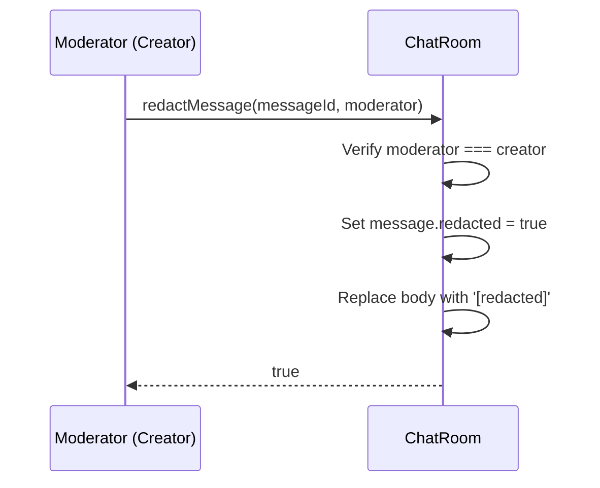
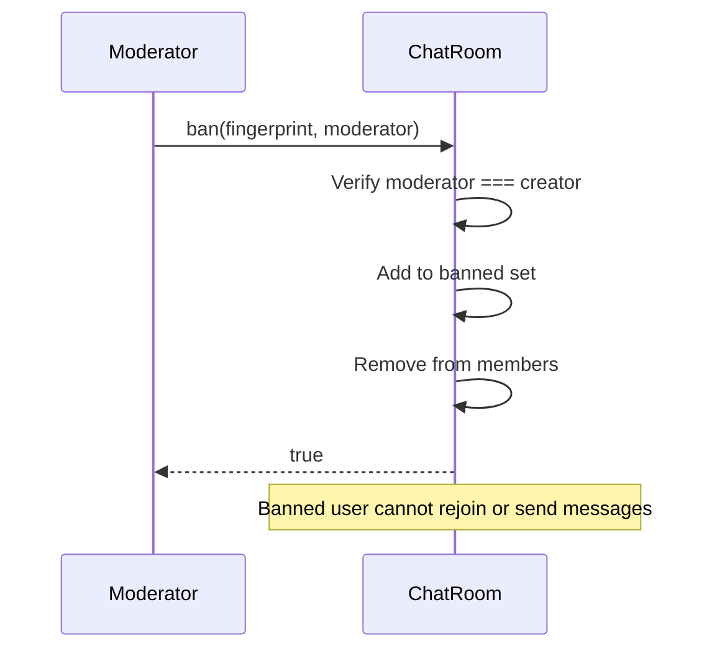

# Chat Protocol

CRDT-backed chat rooms with moderation for BrowserMesh.

**Related specs**: [wire-format.md](../core/wire-format.md) | [presence-protocol.md](../coordination/presence-protocol.md) | [remote-access.md](../coordination/remote-access.md) | [state-sync.md](../coordination/state-sync.md)

## 1. Overview

The chat protocol provides multi-room messaging with CRDT-backed membership tracking, presence, moderation, and message history. Each room is an independent unit with its own member set, message log, and moderation policy.

Wire types: `CHAT_JOIN` (0xB0), `CHAT_LEAVE` (0xB1), `CHAT_PRESENCE` (0xB2), `CHAT_MODERATE` (0xB3)

## 2. Room Model

```typescript
interface ChatRoom {
  id: string;
  name: string;
  creator: string;         // Fingerprint of room creator (moderator)
  maxMembers: number;      // Default: 256
  retentionMs: number | null;  // Message retention period

  // State
  members: Set<string>;    // ORSet-backed membership
  banned: Set<string>;     // Banned fingerprints
  messages: ChatMessage[];
  presence: Map<string, PresenceEntry>;
}

interface PresenceEntry {
  status: 'online' | 'typing' | 'idle' | 'offline';
  lastSeen: number;
}
```

## 3. Message Types

```typescript
type MessageType = 'text' | 'file' | 'reply' | 'reaction' | 'edit' | 'redaction' | 'system';

interface ChatMessage {
  id: string;              // Unique: `msg_<timestamp36>_<seq36>`
  roomId: string;
  sender: string;          // Fingerprint
  type: MessageType;
  body: string;            // Max 32KB
  parentId: string | null; // For replies/threads
  editOf: string | null;   // For edits
  timestamp: number;
  redacted: boolean;
}
```

### Message Type Semantics

| Type | Body Content | parentId | editOf |
|------|-------------|----------|--------|
| `text` | Plain text message | Optional thread parent | - |
| `file` | File reference (name, size, hash) | Optional thread parent | - |
| `reply` | Reply text | Required: message being replied to | - |
| `reaction` | Emoji or reaction code | Required: message being reacted to | - |
| `edit` | Replacement body text | - | Required: message being edited |
| `redaction` | Redaction reason | - | Required: message being redacted |
| `system` | System notification | - | - |

## 4. Wire Message Formats

### CHAT_JOIN (0xB0)

```typescript
interface ChatJoinMessage {
  type: 0xB0;
  from: string;
  payload: {
    roomId: string;
    fingerprint: string;
  };
}
```

### CHAT_LEAVE (0xB1)

```typescript
interface ChatLeaveMessage {
  type: 0xB1;
  from: string;
  payload: {
    roomId: string;
    fingerprint: string;
  };
}
```

### CHAT_PRESENCE (0xB2)

```typescript
interface ChatPresenceMessage {
  type: 0xB2;
  from: string;
  payload: {
    roomId: string;
    fingerprint: string;
    status: 'online' | 'typing' | 'idle' | 'offline';
  };
}
```

### CHAT_MODERATE (0xB3)

```typescript
interface ChatModerateMessage {
  type: 0xB3;
  from: string;
  payload: {
    roomId: string;
    action: 'ban' | 'unban' | 'redact';
    target: string;          // Fingerprint (ban/unban) or messageId (redact)
    moderator: string;       // Must be room creator
    reason?: string;
  };
}
```

## 5. CRDT Replication Strategy

### Membership (ORSet)

Room membership uses an Observed-Remove Set for conflict-free concurrent joins and leaves:

- `join(fingerprint)` → `orset.add(fingerprint, nodeId)` with unique tag
- `leave(fingerprint)` → `orset.remove(fingerprint)` tombstones all tags
- Concurrent join + leave → member is present (add wins)

### Presence (LWWMap)

Presence state uses a Last-Writer-Wins Map keyed by fingerprint:

- `setPresence(fp, status)` → `lwwmap.set(fp, status, timestamp, nodeId)`
- Concurrent updates resolved by highest timestamp (ties broken by nodeId)

### Message Log

Messages are append-only. Message ordering uses timestamps for display. For cross-peer sync:

1. Each peer maintains its local message log
2. On sync, merge by message ID (deduplicate)
3. Order by timestamp for display
4. Redactions propagate: if any replica has `redacted: true`, the message is redacted

## 6. Thread Model

Threads are implemented via `parentId` references:

- A top-level message has `parentId: null`
- A reply sets `parentId` to the root message's ID
- Nested replies can reference any message (flat or nested)
- Thread views are constructed by grouping messages by `parentId`

## 7. Moderation Flows

### Redaction



### Ban



### Unban

The room creator can unban a previously banned member, allowing them to rejoin.

## 8. Retention and Compaction

- `retentionMs`: If set, messages older than `now - retentionMs` may be pruned
- Compaction runs lazily (on message retrieval or explicit trigger)
- Redacted messages are kept as tombstones (body replaced, metadata preserved)
- System messages are exempt from retention limits

## 9. Constants

| Constant | Value | Description |
|----------|-------|-------------|
| `MAX_MESSAGE_SIZE` | 32,768 bytes | Maximum message body size |
| `MAX_ROOM_MEMBERS` | 256 | Maximum members per room |
| `MESSAGE_TYPES` | 7 entries | Valid message type strings |

## 10. Events

| Event | Trigger | Payload |
|-------|---------|---------|
| `onMessage` | Message added | `ChatMessage` |
| `onJoin` | Member joins | `fingerprint: string` |
| `onLeave` | Member leaves | `fingerprint: string` |
| `onPresence` | Presence update | `{ fingerprint, status }` |

## 11. Security Considerations

- **Message forgery**: Messages are attributed to sender fingerprints. Cross-pod messages should be verified against the sender's identity signature.
- **Ban evasion**: Bans are fingerprint-based. A banned user generating a new identity would bypass bans. Integration with the trust system (reputation scoring) mitigates this.
- **Moderator abuse**: Only the room creator has moderation powers. There is no delegation mechanism yet (future: moderator roles via ACL templates).
- **Message size**: Body size is capped at 32KB to prevent resource exhaustion. File sharing uses references rather than inline content.
- **Room capacity**: Maximum 256 members per room prevents unbounded growth. The limit is configurable per room.
