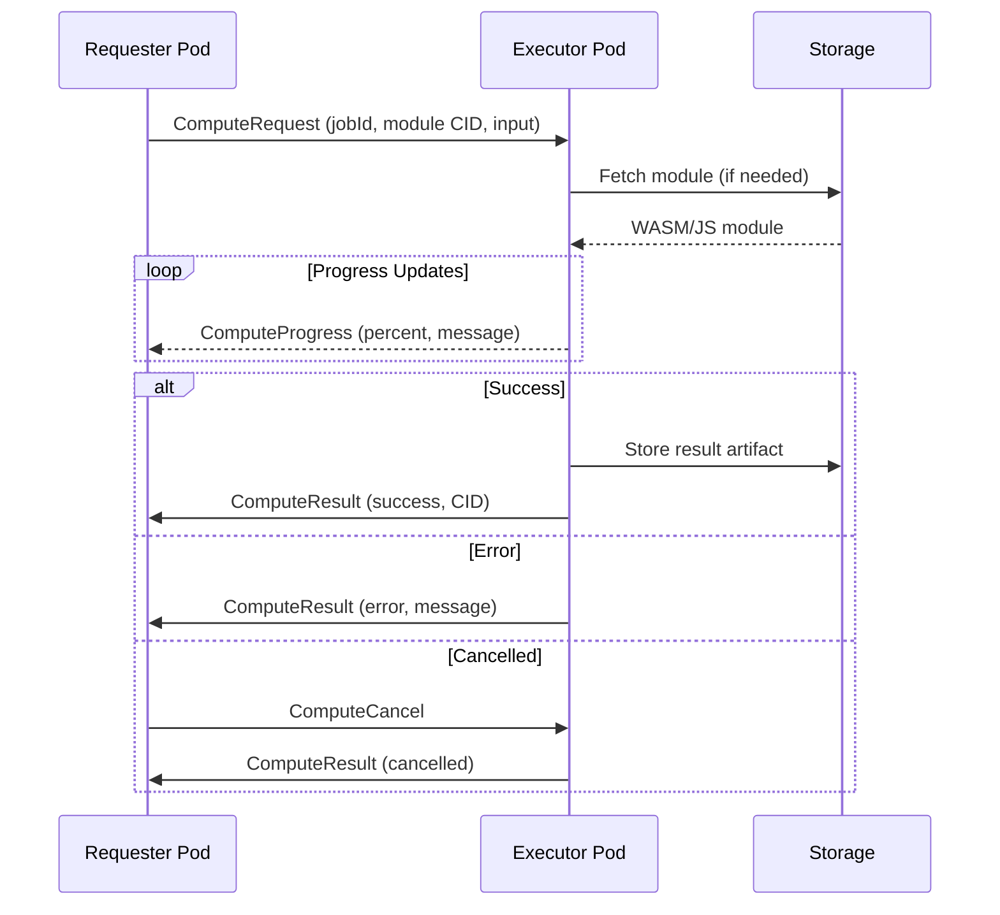
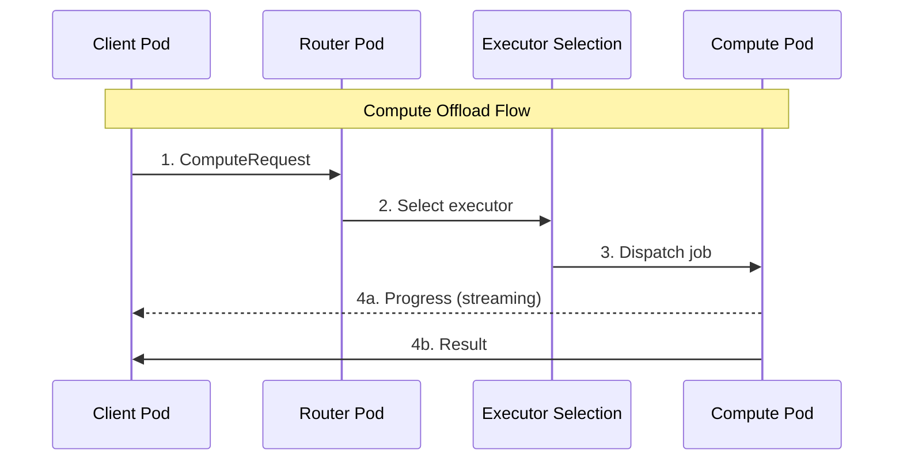

# Compute Offload Protocol

Distributed compute execution for BrowserMesh pods.

**Related specs**: [pod-types.md](../core/pod-types.md) | [storage-integration.md](storage-integration.md) | [message-envelope.md](../networking/message-envelope.md)

## 1. Overview

Compute offload enables:
- Moving CPU/memory intensive work between pods
- Capability-based executor selection
- Streaming results and progress
- Cancellation support
- Cross-environment execution (browser ↔ server)



## 2. What Compute Offload Means

In BrowserMesh, compute offload is:
- Move work away from initiating pod
- Choose better execution environment
- Preserve identity, security, streaming

**Closer to**: Remote workers, actor execution, serverless functions
**Not like**: HPC, GPU clusters, batch jobs

## 3. Compute Capability

Everything hinges on declaring compute as a **capability**, not a location:

```typescript
interface ComputeCapability {
  capability: 'compute/wasm' | 'compute/js' | 'compute/heavy';
  constraints: {
    cpu: 'high' | 'medium' | 'low';
    memory: string;          // e.g., "512mb"
    latency: 'realtime' | 'best-effort';
    environment: ('node' | 'browser' | 'worker')[];
    visibility: 'foreground' | 'background-ok';
    timeout: number;         // Max execution time
  };
}

// Example pod capability advertisement
const computePodCaps = {
  id: podId,
  capabilities: ['compute/wasm', 'compute/heavy'],
  constraints: {
    cpu: 'high',
    memory: '512mb',
    latency: 'best-effort',
    environment: ['node', 'browser'],
    visibility: 'background-ok',
  },
};
```

## 4. Request/Result Schema

### 4.1 ComputeRequest

```typescript
interface ComputeRequest {
  type: 'ComputeRequest';
  jobId: string;                     // Unique job identifier

  // Module specification
  module: {
    cid: string;                     // Content-addressed module (WASM/JS)
    entry: string;                   // Entry function name
    type: 'wasm' | 'js';
  };

  // Input data
  input: {
    [key: string]: any;              // Arbitrary input arguments
  } | {
    cid: string;                     // CID of input data
  };

  // Execution constraints
  constraints: {
    prefer: 'server' | 'browser' | 'any';
    timeoutMs: number;
    maxMemoryMb?: number;
    priority?: 'low' | 'normal' | 'high';
  };

  // Metadata
  requesterId: string;               // Pod ID of requester
  timestamp: number;
  signature?: Uint8Array;
}
```

### 4.2 ComputeResult

```typescript
interface ComputeResult {
  type: 'ComputeResult';
  jobId: string;

  status: 'success' | 'error' | 'cancelled' | 'timeout';

  // Result data
  result?: {
    value?: any;                     // Direct result value
    cid?: string;                    // CID of result artifact
  };

  // Error information
  error?: {
    code: string;
    message: string;
    stack?: string;
  };

  // Execution metrics
  metrics: {
    executorId: string;              // Pod that executed
    startTime: number;
    endTime: number;
    cpuTimeMs: number;
    memoryPeakMb: number;
  };

  signature?: Uint8Array;
}
```

### 4.3 Progress Updates

```typescript
interface ComputeProgress {
  type: 'ComputeProgress';
  jobId: string;
  percent?: number;                  // 0-100
  message?: string;
  data?: any;                        // Arbitrary progress data
  timestamp: number;
}
```

### 4.4 Cancellation

```typescript
interface ComputeCancel {
  type: 'ComputeCancel';
  jobId: string;
  reason?: string;
  timestamp: number;
}
```

## 5. Execution Flow



## 6. WASM Execution Sandbox

```typescript
class WasmExecutor {
  private moduleCache: Map<string, WebAssembly.Module> = new Map();

  /**
   * Execute a WASM compute job
   */
  async execute(request: ComputeRequest): Promise<ComputeResult> {
    const startTime = Date.now();
    const jobId = request.jobId;

    try {
      // 1. Fetch module
      const moduleBytes = await this.fetchModule(request.module.cid);

      // 2. Compile (or use cached)
      const module = await this.getOrCompile(request.module.cid, moduleBytes);

      // 3. Create instance with sandboxed imports
      const instance = await WebAssembly.instantiate(module, {
        env: this.createEnv(jobId),
        wasi_snapshot_preview1: this.createWasi(jobId),
      });

      // 4. Serialize input
      const inputBytes = this.serializeInput(request.input);

      // 5. Call entry function
      const entryFn = instance.exports[request.module.entry] as Function;
      const resultPtr = entryFn(inputBytes);

      // 6. Read result
      const resultBytes = this.readResult(instance, resultPtr);
      const result = this.deserializeResult(resultBytes);

      return {
        type: 'ComputeResult',
        jobId,
        status: 'success',
        result: { value: result },
        metrics: {
          executorId: this.podId,
          startTime,
          endTime: Date.now(),
          cpuTimeMs: Date.now() - startTime,
          memoryPeakMb: this.measureMemory(instance),
        },
      };
    } catch (error) {
      return {
        type: 'ComputeResult',
        jobId,
        status: 'error',
        error: {
          code: 'EXECUTION_FAILED',
          message: error.message,
          stack: error.stack,
        },
        metrics: {
          executorId: this.podId,
          startTime,
          endTime: Date.now(),
          cpuTimeMs: Date.now() - startTime,
          memoryPeakMb: 0,
        },
      };
    }
  }

  /**
   * Create sandboxed environment imports
   */
  private createEnv(jobId: string): WebAssembly.ModuleImports {
    return {
      // Memory management
      memory: new WebAssembly.Memory({ initial: 16, maximum: 256 }),

      // Logging (captured, not stdout)
      log: (ptr: number, len: number) => {
        const message = this.readString(ptr, len);
        this.emitProgress(jobId, { message });
      },

      // Progress reporting
      progress: (percent: number) => {
        this.emitProgress(jobId, { percent });
      },

      // Panic handler
      panic: (ptr: number, len: number) => {
        const message = this.readString(ptr, len);
        throw new Error(`WASM panic: ${message}`);
      },
    };
  }
}
```

## 7. JavaScript Executor

```typescript
class JsExecutor {
  /**
   * Execute JavaScript compute job in isolated context
   */
  async execute(request: ComputeRequest): Promise<ComputeResult> {
    const startTime = Date.now();

    // Create Worker for isolation
    const worker = new Worker(
      URL.createObjectURL(new Blob([`
        self.onmessage = async (e) => {
          const { module, input, entry } = e.data;

          try {
            // Dynamic import of module
            const mod = await import(module);
            const fn = mod[entry];

            if (typeof fn !== 'function') {
              throw new Error('Entry point is not a function');
            }

            const result = await fn(input);
            self.postMessage({ type: 'result', value: result });
          } catch (error) {
            self.postMessage({
              type: 'error',
              message: error.message,
              stack: error.stack,
            });
          }
        };
      `], { type: 'application/javascript' }))
    );

    return new Promise((resolve) => {
      // Set timeout
      const timeout = setTimeout(() => {
        worker.terminate();
        resolve({
          type: 'ComputeResult',
          jobId: request.jobId,
          status: 'timeout',
          metrics: this.buildMetrics(startTime),
        });
      }, request.constraints.timeoutMs);

      worker.onmessage = (e) => {
        clearTimeout(timeout);
        worker.terminate();

        if (e.data.type === 'result') {
          resolve({
            type: 'ComputeResult',
            jobId: request.jobId,
            status: 'success',
            result: { value: e.data.value },
            metrics: this.buildMetrics(startTime),
          });
        } else {
          resolve({
            type: 'ComputeResult',
            jobId: request.jobId,
            status: 'error',
            error: {
              code: 'EXECUTION_FAILED',
              message: e.data.message,
              stack: e.data.stack,
            },
            metrics: this.buildMetrics(startTime),
          });
        }
      };

      // Start execution
      worker.postMessage({
        module: `data:text/javascript,${encodeURIComponent(request.module.cid)}`,
        input: request.input,
        entry: request.module.entry,
      });
    });
  }
}
```

## 8. Router Heuristics

```typescript
interface ExecutorSelection {
  podId: string;
  score: number;
  reason: string;
}

class ComputeRouter {
  private executors: Map<string, ExecutorInfo> = new Map();

  /**
   * Select best executor for a compute request
   */
  selectExecutor(request: ComputeRequest): ExecutorSelection {
    const candidates: ExecutorSelection[] = [];

    for (const [podId, info] of this.executors) {
      const score = this.scoreExecutor(request, info);
      if (score > 0) {
        candidates.push({
          podId,
          score,
          reason: this.explainScore(request, info),
        });
      }
    }

    // Sort by score descending
    candidates.sort((a, b) => b.score - a.score);

    if (candidates.length === 0) {
      throw new Error('No suitable executor found');
    }

    return candidates[0];
  }

  /**
   * Score an executor for a request
   */
  private scoreExecutor(
    request: ComputeRequest,
    executor: ExecutorInfo
  ): number {
    let score = 100;

    // Preference matching
    if (request.constraints.prefer === 'server') {
      if (executor.environment === 'node') score += 50;
      else score -= 20;
    } else if (request.constraints.prefer === 'browser') {
      if (executor.environment === 'browser') score += 50;
      else score -= 20;
    }

    // Visibility consideration
    if (executor.visibility === 'hidden') {
      score += 30;  // Prefer background execution
    }

    // Load balancing
    score -= executor.currentLoad * 10;

    // Memory availability
    if (request.constraints.maxMemoryMb) {
      if (executor.availableMemoryMb < request.constraints.maxMemoryMb) {
        return 0;  // Disqualify
      }
      score += (executor.availableMemoryMb - request.constraints.maxMemoryMb) / 10;
    }

    // Data locality (prefer pods that already have input data)
    if (typeof request.input === 'object' && 'cid' in request.input) {
      if (executor.cachedCids.has(request.input.cid)) {
        score += 100;  // Big bonus for data locality
      }
    }

    // Latency preference
    if (request.constraints.latency === 'realtime') {
      score -= executor.avgLatencyMs / 10;
    }

    return score;
  }
}

interface ExecutorInfo {
  podId: string;
  environment: 'node' | 'browser' | 'worker';
  visibility: 'visible' | 'hidden';
  currentLoad: number;           // 0-1
  availableMemoryMb: number;
  avgLatencyMs: number;
  cachedCids: Set<string>;
  capabilities: string[];
}
```

## 9. Browser vs Server Compute

### Browser Pods Excel At

| Task | Why |
|------|-----|
| Image processing | Canvas/ImageData APIs |
| Compression | Low latency for UI |
| Parsing | DOM/JSON native |
| ML inference (small) | WebGL acceleration |
| Crypto operations | WebCrypto optimized |
| Data transforms | User data locality |

### Server Pods Excel At

| Task | Why |
|------|-----|
| Sustained CPU | No throttling |
| Large memory | No tab limits |
| File system access | Native I/O |
| Network fan-out | No CORS |
| Long-running jobs | No lifecycle issues |
| Heavy computation | Full resources |

## 10. Failure Handling

```typescript
enum FailureMode {
  TAB_CLOSED = 'TAB_CLOSED',
  POD_RESTART = 'POD_RESTART',
  NETWORK_DROP = 'NETWORK_DROP',
  MODULE_FETCH_FAIL = 'MODULE_FETCH_FAIL',
  TIMEOUT = 'TIMEOUT',
  OOM = 'OUT_OF_MEMORY',
}

class FailureHandler {
  /**
   * Handle compute job failure
   */
  async handleFailure(
    request: ComputeRequest,
    failure: FailureMode
  ): Promise<ComputeResult | 'retry'> {
    switch (failure) {
      case FailureMode.TAB_CLOSED:
      case FailureMode.NETWORK_DROP:
        // Retry on different executor
        return 'retry';

      case FailureMode.POD_RESTART:
        // Retry if idempotent
        if (this.isIdempotent(request)) {
          return 'retry';
        }
        return this.buildErrorResult(request, 'Executor restarted');

      case FailureMode.MODULE_FETCH_FAIL:
        // Try different gateway
        return 'retry';

      case FailureMode.TIMEOUT:
      case FailureMode.OOM:
        // Don't retry, return error
        return this.buildErrorResult(request, failure);
    }
  }

  private isIdempotent(request: ComputeRequest): boolean {
    // Check if operation is safe to retry
    return !request.module.entry.startsWith('mutate');
  }
}
```

## 11. MVP Demo

**Goal**: Offload a WASM image resize from browser tab to server pod, streaming progress back.

```typescript
// Browser pod (client)
async function resizeImage(imageData: Uint8Array): Promise<Uint8Array> {
  const request: ComputeRequest = {
    type: 'ComputeRequest',
    jobId: crypto.randomUUID(),
    module: {
      cid: 'bafybeigdyrzt...',  // image-resizer WASM
      entry: 'resize',
      type: 'wasm',
    },
    input: {
      imageCid: await storage.store(imageData),
      width: 256,
      height: 256,
    },
    constraints: {
      prefer: 'server',
      timeoutMs: 30000,
    },
    requesterId: localPodId,
    timestamp: Date.now(),
  };

  // Send and await result
  const result = await mesh.send(
    { capability: 'compute/wasm' },
    request,
    {
      onProgress: (progress) => {
        console.log(`Progress: ${progress.percent}%`);
        updateProgressBar(progress.percent);
      },
    }
  );

  if (result.status === 'success') {
    return await storage.fetch(result.result.cid);
  } else {
    throw new Error(result.error.message);
  }
}

// Server pod (executor)
computePod.on('ComputeRequest', async (request) => {
  // Execute with progress streaming
  const result = await wasmExecutor.execute(request);
  return result;
});
```

## 12. Future Extensions

| Extension | Description |
|-----------|-------------|
| Job queues | Priority queuing |
| Priority classes | Preemption support |
| Batch jobs | Multiple inputs, single module |
| Map/reduce | Fan-out + aggregation |
| Speculative execution | Race multiple executors |
| Cost accounting | Resource usage tracking |
| GPU server pods | WebGPU on server |

None required for v1.
