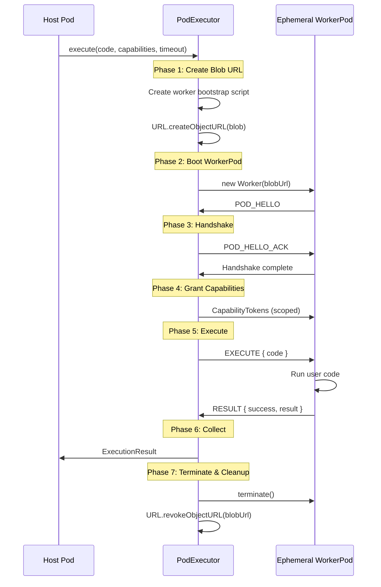

# Pod Executor

Spawn-execute-terminate lifecycle for ephemeral WorkerPods.

**Related specs**: [pod-types.md](../core/pod-types.md) | [boot-sequence.md](../core/boot-sequence.md) | [identity-keys.md](../crypto/identity-keys.md) | [capability-scope-grammar.md](../crypto/capability-scope-grammar.md) | [channel-abstraction.md](../networking/channel-abstraction.md)

## 1. Overview

The PodExecutor manages the full lifecycle of ephemeral WorkerPods: creating them from code, granting scoped capabilities, collecting results, and cleaning up resources. This pattern is used for sandboxed code execution, compute offload, and plugin systems.

## 2. PodExecutor Interface

```typescript
interface ExecutionResult {
  /** Whether execution completed successfully */
  success: boolean;

  /** Return value from the executed code */
  result?: unknown;

  /** Error if execution failed */
  error?: { code: string; message: string };

  /** Execution duration in milliseconds */
  duration: number;

  /** Pod ID of the worker that executed the code */
  executorPodId: string;
}

interface PodExecutor {
  /**
   * Execute code in an ephemeral WorkerPod.
   *
   * @param code - JavaScript source code to execute
   * @param capabilities - Scopes to grant (default-deny)
   * @param timeout - Maximum execution time in ms (default: 30000)
   * @returns Execution result
   */
  execute(
    code: string,
    capabilities?: string[],
    timeout?: number
  ): Promise<ExecutionResult>;

  /**
   * Execute a WASM module in an ephemeral WorkerPod.
   */
  executeWasm(
    wasmBytes: Uint8Array,
    entryPoint: string,
    args?: unknown[],
    capabilities?: string[],
    timeout?: number
  ): Promise<ExecutionResult>;

  /**
   * Terminate all running executions.
   */
  terminateAll(): void;
}
```

## 3. Execution Lifecycle



## 4. Implementation

```typescript
class WorkerPodExecutor implements PodExecutor {
  private activeWorkers: Map<string, { worker: Worker; timer: number }> = new Map();

  constructor(
    private identity: PodIdentity,
    private capManager: CapabilityManager
  ) {}

  async execute(
    code: string,
    capabilities: string[] = [],
    timeout: number = 30000
  ): Promise<ExecutionResult> {
    const executionId = crypto.randomUUID();
    const startTime = performance.now();

    // Phase 1: Create Blob URL with bootstrap wrapper
    const bootstrap = createBootstrapScript(code, executionId);
    const blob = new Blob([bootstrap], { type: 'application/javascript' });
    const blobUrl = URL.createObjectURL(blob);

    try {
      // Phase 2: Boot WorkerPod
      const worker = new Worker(blobUrl, { type: 'module' });
      const channel = wrapChannel(worker, executionId);

      // Set up timeout
      const timer = setTimeout(() => {
        this.terminateWorker(executionId);
      }, timeout);

      this.activeWorkers.set(executionId, { worker, timer });

      // Phase 3: Handshake
      const hello = await waitForMessage(channel, 'POD_HELLO', 5000);

      // Verify Pod ID derivation
      const expectedPodId = base64urlEncode(await sha256(hello.publicKey));
      if (hello.podId !== expectedPodId) {
        throw new Error('Worker Pod ID mismatch');
      }

      channel.send(await createAck(this.identity));

      // Phase 4: Grant capabilities (default-deny)
      const tokens = await this.grantCapabilities(executionId, capabilities);
      channel.send({ type: 'CAPABILITIES', tokens });

      // Phase 5: Execute — send the execute command
      channel.send({ type: 'EXECUTE', executionId });

      // Phase 6: Collect result
      const result = await waitForMessage(channel, 'RESULT', timeout);

      return {
        success: result.success,
        result: result.value,
        error: result.error,
        duration: performance.now() - startTime,
        executorPodId: hello.podId,
      };
    } catch (err) {
      return {
        success: false,
        error: { code: 'EXECUTION_FAILED', message: (err as Error).message },
        duration: performance.now() - startTime,
        executorPodId: executionId,
      };
    } finally {
      // Phase 7: Terminate and cleanup
      this.terminateWorker(executionId);
      URL.revokeObjectURL(blobUrl);
    }
  }

  async executeWasm(
    wasmBytes: Uint8Array,
    entryPoint: string,
    args: unknown[] = [],
    capabilities: string[] = [],
    timeout: number = 30000
  ): Promise<ExecutionResult> {
    // Wrap WASM execution in a JavaScript harness
    const code = `
      const wasmModule = await WebAssembly.compile(self.__wasmBytes);
      const instance = await WebAssembly.instantiate(wasmModule);
      return instance.exports['${entryPoint}'](${args.map(a => JSON.stringify(a)).join(', ')});
    `;
    return this.execute(code, capabilities, timeout);
  }

  private async grantCapabilities(
    executionId: string,
    scopes: string[]
  ): Promise<CapabilityToken[]> {
    return Promise.all(
      scopes.map(scope =>
        this.capManager.grant(
          `executor/${executionId}`,
          [scope],
          60000  // Short-lived: 1 minute
        )
      )
    );
  }

  private terminateWorker(executionId: string): void {
    const entry = this.activeWorkers.get(executionId);
    if (entry) {
      clearTimeout(entry.timer);
      entry.worker.terminate();
      this.activeWorkers.delete(executionId);
    }
  }

  terminateAll(): void {
    for (const [id] of this.activeWorkers) {
      this.terminateWorker(id);
    }
  }
}
```

## 5. Bootstrap Script

The bootstrap script wraps user code in a standard BrowserMesh pod boot sequence:

```typescript
function createBootstrapScript(userCode: string, executionId: string): string {
  return `
    // Auto-generated bootstrap for ephemeral WorkerPod
    const POD = Symbol.for('pod.runtime');

    // Phase 0: Generate identity
    const keyPair = await crypto.subtle.generateKey('Ed25519', true, ['sign', 'verify']);
    const pubKeyRaw = new Uint8Array(await crypto.subtle.exportKey('raw', keyPair.publicKey));
    const podIdBytes = new Uint8Array(await crypto.subtle.digest('SHA-256', pubKeyRaw));

    // Phase 1: Send POD_HELLO to parent
    self.postMessage({
      type: 'POD_HELLO',
      version: 1,
      podId: btoa(String.fromCharCode(...podIdBytes)).replace(/\\+/g,'-').replace(/\\//g,'_').replace(/=/g,''),
      kind: 'worker',
      publicKey: pubKeyRaw,
      timestamp: Date.now(),
    });

    // Wait for HELLO_ACK, capabilities, and execute command
    let capabilities = [];
    self.onmessage = async (e) => {
      if (e.data.type === 'POD_HELLO_ACK') {
        // Handshake complete
      } else if (e.data.type === 'CAPABILITIES') {
        capabilities = e.data.tokens;
      } else if (e.data.type === 'EXECUTE') {
        try {
          const fn = new Function('capabilities', 'return (async () => { ' + ${JSON.stringify(userCode)} + ' })()');
          const result = await fn(capabilities);
          self.postMessage({ type: 'RESULT', success: true, value: result });
        } catch (err) {
          self.postMessage({ type: 'RESULT', success: false, error: { code: 'USER_CODE_ERROR', message: err.message } });
        }
      }
    };
  `;
}
```

## 6. Default-Deny Capability Scoping

Ephemeral WorkerPods start with **no capabilities**. The host explicitly grants only what is needed:

```typescript
// Execute with only data:read access
const result = await executor.execute(userCode, ['data:read']);

// Execute with no capabilities (pure compute)
const result = await executor.execute(userCode, []);

// Execute with multiple scopes
const result = await executor.execute(userCode, ['data:read', 'canvas:write']);
```

Reserved scopes (`pod:*`, `mesh:*`, `cap:*`) are never granted to ephemeral workers. See [capability-scope-grammar.md](../crypto/capability-scope-grammar.md) §5.

## 7. Resource Cleanup Checklist

After every execution (success or failure), the executor must:

1. Clear the execution timeout timer
2. Terminate the Worker (`worker.terminate()`)
3. Revoke the Blob URL (`URL.revokeObjectURL()`)
4. Remove from active workers map
5. Revoke any granted capability tokens
6. Close any open PodChannels to the worker

## 8. Security Boundaries

| Boundary | Protection |
|----------|------------|
| Code execution | Runs in Worker sandbox (no DOM, no parent scope) |
| Capability access | Default-deny; only granted scopes are usable |
| Timeout | Enforced termination prevents infinite loops |
| Resource cleanup | Blob URL revoked, Worker terminated |
| Network access | Only if `fetch` or `webSocket` scopes granted |
| Storage access | Only if `storage:*` scopes granted |

## 9. Optional Executor Pool

For applications that frequently spawn workers, an executor pool avoids repeated boot overhead:

```typescript
interface ExecutorPool {
  /** Pre-warm N idle workers ready for execution */
  warmup(count: number): Promise<void>;

  /** Execute using a pooled worker (or create one if pool is empty) */
  execute(code: string, capabilities?: string[], timeout?: number): Promise<ExecutionResult>;

  /** Current pool size */
  readonly poolSize: number;

  /** Drain and terminate all pooled workers */
  drain(): void;
}
```

Pooled workers are pre-booted through Phase 3 (handshake complete) and wait idle. When `execute()` is called, the pool grants capabilities and sends the execute command without the boot delay.
