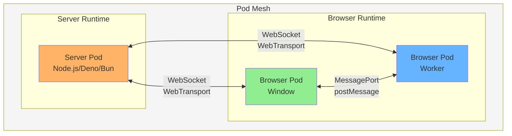

# Server Pod Runtime

Server-side pod implementation for BrowserMesh, enabling symmetric browser-server mesh topology.

**Related specs**: [pod-types.md](../core/pod-types.md) | [session-keys.md](../crypto/session-keys.md) | [message-envelope.md](../networking/message-envelope.md) | [http-interop.md](../networking/http-interop.md)

## 1. Overview

Server Pods enable:
- Symmetric mesh topology (browser ↔ server as peers)
- Uniform routing regardless of location
- Capability-based addressing
- Server-initiated workflows

## 2. Architecture



**Symmetric topology**: Server and browser pods are peers, not client-server.

## 3. Transport Comparison

### Browser Pod Transports
- postMessage
- MessagePort
- Service Worker routing
- WebRTC DataChannel
- WebSocket (client)
- WebTransport (client)

### Server Pod Transports
- WebSocket (server)
- WebTransport (server)
- HTTP/2 / HTTP/3
- Raw TCP / QUIC
- Process IPC

**Same model. Different adapters.**

## 4. Server Pod Implementation

```typescript
import { createServer } from 'http';
import { WebSocketServer } from 'ws';

interface ServerPodConfig {
  port: number;
  identity?: StoredPodIdentity;
  capabilities?: string[];
}

class ServerPod {
  private identity: PodIdentityHD;
  private peers: Map<string, PeerConnection> = new Map();
  private router: MeshRouter;
  private wss: WebSocketServer;

  private constructor(
    identity: PodIdentityHD,
    config: ServerPodConfig
  ) {
    this.identity = identity;
    this.router = new MeshRouter(identity.podId);
  }

  /**
   * Create and start a server pod
   */
  static async create(config: ServerPodConfig): Promise<ServerPod> {
    // Create or restore identity
    const identity = config.identity
      ? await PodIdentityHD.restore(config.identity.rootSecret)
      : await PodIdentityHD.create();

    const pod = new ServerPod(identity, config);
    await pod.start(config.port);

    return pod;
  }

  /**
   * Start WebSocket server
   */
  private async start(port: number): Promise<void> {
    const server = createServer();
    this.wss = new WebSocketServer({ server });

    this.wss.on('connection', (ws, req) => {
      this.handleConnection(ws, req);
    });

    return new Promise((resolve) => {
      server.listen(port, () => {
        console.log(`Server pod ${this.identity.podId} listening on ${port}`);
        resolve();
      });
    });
  }

  /**
   * Handle incoming WebSocket connection
   */
  private async handleConnection(ws: WebSocket, req: any): Promise<void> {
    // Create peer connection handler
    const peer = new PeerConnection(ws);

    // Perform handshake
    try {
      const remotePodId = await this.performHandshake(peer);
      this.peers.set(remotePodId, peer);

      // Register route
      this.router.addRoute(remotePodId, peer);

      peer.on('message', (data) => {
        this.handleMessage(remotePodId, data);
      });

      peer.on('close', () => {
        this.peers.delete(remotePodId);
        this.router.removeRoute(remotePodId);
      });
    } catch (err) {
      console.error('Handshake failed:', err);
      ws.close();
    }
  }

  /**
   * Perform cryptographic handshake
   */
  private async performHandshake(peer: PeerConnection): Promise<string> {
    const handshake = new NoiseHandshake(
      await this.identity.getRootKeyPair(),
      await this.identity.getStaticDHKeyPair()
    );

    // Wait for initiator hello
    const hello = await peer.receive();
    await handshake.processInitiatorHello(hello);

    // Send response
    const response = await handshake.createResponderHello();
    peer.send(response);

    // Get session keys
    const { sendKey, recvKey } = handshake.getSessionKeys();
    peer.setSessionKeys(sendKey, recvKey);

    return handshake.getRemoteIdentity();
  }

  /**
   * Handle incoming message
   */
  private async handleMessage(peerId: string, data: Uint8Array): Promise<void> {
    const message = MeshEnvelope.decode(data);

    if (message.type === 'REQUEST') {
      await this.handleRequest(peerId, message);
    } else if (message.type === 'RESPONSE') {
      this.tracker.handleResponse(message);
    }
  }

  /**
   * Handle incoming request
   */
  private async handleRequest(
    peerId: string,
    request: MeshRequest
  ): Promise<void> {
    // Check if request is for us
    if (this.isForUs(request.target)) {
      const result = await this.executeLocal(request);
      this.sendResponse(peerId, request.id, result);
    } else {
      // Route to another pod
      const response = await this.router.route(request);
      this.sendToPeer(peerId, response);
    }
  }

  /**
   * Send a request to another pod
   */
  async send(
    target: MeshRequest['target'],
    payload: MeshRequest['payload'],
    options?: RequestOptions
  ): Promise<any> {
    const { request, promise } = this.tracker.createRequest(
      target,
      payload,
      options
    );

    // Find route
    const route = this.router.findRoute(target);
    if (!route) {
      throw new Error(`No route to ${JSON.stringify(target)}`);
    }

    const encoded = MeshEnvelope.encode(request);
    route.peer.send(encoded);

    return promise;
  }
}
```

## 5. Capability Advertisement

```typescript
interface ServerPodCapabilities {
  id: string;
  kind: 'server';
  channels: {
    webSocket: { url: string };
    webTransport?: { url: string };
  };
  capabilities: string[];
  resources: {
    cpu: 'high' | 'medium' | 'low';
    memory: number;  // MB
    persistent: boolean;
  };
}

const serverCaps: ServerPodCapabilities = {
  id: pod.identity.podId,
  kind: 'server',
  channels: {
    webSocket: { url: 'wss://mesh.example.com/pod' },
    webTransport: { url: 'https://mesh.example.com/webtransport' },
  },
  capabilities: [
    'compute/wasm',
    'compute/heavy',
    'storage/write',
    'relay/public',
    'ingress/http',
  ],
  resources: {
    cpu: 'high',
    memory: 4096,
    persistent: true,
  },
};
```

## 6. Ingress Types

### 6.1 HTTP Ingress Pod

```typescript
class HttpIngressPod extends ServerPod {
  private httpServer: http.Server;

  async handleHttpRequest(
    req: http.IncomingMessage,
    res: http.ServerResponse
  ): Promise<void> {
    // Parse target from URL/headers
    const target = this.parseTarget(req);

    // Build mesh request
    const meshRequest: MeshRequest = {
      type: 'REQUEST',
      id: crypto.randomUUID(),
      from: this.identity.podId,
      target,
      payload: {
        op: 'http',
        args: {
          method: req.method,
          path: req.url,
          headers: req.headers,
          body: await this.readBody(req),
        },
      },
      timestamp: Date.now(),
    };

    // Route into mesh
    try {
      const result = await this.router.route(meshRequest);
      this.writeHttpResponse(res, result);
    } catch (err) {
      res.statusCode = 502;
      res.end('Bad Gateway');
    }
  }
}
```

### 6.2 WebSocket Ingress Pod

```typescript
class WebSocketIngressPod extends ServerPod {
  async handleWsConnection(ws: WebSocket): Promise<void> {
    // Authenticate connection
    const peerId = await this.authenticateClient(ws);

    // Bridge messages into mesh
    ws.on('message', async (data) => {
      const message = JSON.parse(data);
      const result = await this.send(message.target, message.payload);
      ws.send(JSON.stringify(result));
    });
  }
}
```

### 6.3 CLI Ingress Pod

```typescript
class CliIngressPod extends ServerPod {
  async handleCommand(args: string[]): Promise<any> {
    const [target, op, ...rest] = args;

    return this.send(
      { service: target },
      { op, args: this.parseArgs(rest) }
    );
  }
}
```

## 7. Server↔Browser Handshake

```typescript
// Browser initiates connection to server pod
class BrowserToServerConnector {
  async connect(serverUrl: string): Promise<PeerConnection> {
    // 1. Open WebSocket
    const ws = new WebSocket(serverUrl);
    await this.waitOpen(ws);

    // 2. Perform Noise handshake
    const handshake = new NoiseHandshake(
      this.identity.rootKeyPair,
      this.identity.staticDHKeyPair,
      serverPublicKey  // Known from discovery
    );

    // Send initiator hello
    const hello = await handshake.createInitiatorHello();
    ws.send(hello);

    // Receive response
    const response = await this.receive(ws);
    await handshake.processResponderHello(response);

    // Get session keys
    const { sendKey, recvKey } = handshake.getSessionKeys();

    return new PeerConnection(ws, sendKey, recvKey);
  }
}

// Server accepts connection from browser pod
class ServerFromBrowserConnector {
  async accept(ws: WebSocket): Promise<PeerConnection> {
    // 1. Perform Noise handshake (responder side)
    const handshake = new NoiseHandshake(
      this.identity.rootKeyPair,
      this.identity.staticDHKeyPair
    );

    // Receive initiator hello
    const hello = await this.receive(ws);
    await handshake.processInitiatorHello(hello);

    // Send response
    const response = await handshake.createResponderHello();
    ws.send(response);

    // Get session keys
    const { sendKey, recvKey } = handshake.getSessionKeys();

    return new PeerConnection(ws, sendKey, recvKey);
  }
}
```

## 8. Trust Model

With server pods, trust is:
- **Explicit**: Not implicit from connection direction
- **Cryptographic**: Based on identity keys
- **Capability-based**: Scoped permissions

```typescript
interface TrustPolicy {
  // Allow any peer with valid identity
  allowAnonymous: boolean;

  // Whitelist of trusted pod IDs
  trustedPods: Set<string>;

  // Required capabilities for connection
  requiredCapabilities: string[];

  // Max connections per identity
  maxConnectionsPerPod: number;
}

class TrustEnforcer {
  async validatePeer(
    peerId: string,
    capabilities: string[]
  ): Promise<boolean> {
    if (!this.policy.allowAnonymous) {
      if (!this.policy.trustedPods.has(peerId)) {
        return false;
      }
    }

    for (const required of this.policy.requiredCapabilities) {
      if (!capabilities.includes(required)) {
        return false;
      }
    }

    return true;
  }
}
```

## 9. Node.js Runtime

```typescript
// Minimal Node.js server pod
import { ServerPod } from '@browsermesh/server';

const pod = await ServerPod.create({
  port: 8080,
  capabilities: ['compute/wasm', 'storage/read'],
});

// Register handlers
pod.on('request', async (req) => {
  if (req.payload.op === 'echo') {
    return { echo: req.payload.args };
  }
  throw new Error(`Unknown op: ${req.payload.op}`);
});

// Send to browser pods
const result = await pod.send(
  { service: 'ui' },
  { op: 'notify', args: { message: 'Hello from server!' } }
);

console.log('Pod running:', pod.identity.podId);
```

## 10. WebTransport Support

```typescript
class WebTransportServerPod extends ServerPod {
  private wtServer: any;  // WebTransport server

  async startWebTransport(port: number): Promise<void> {
    // Note: Requires QUIC/HTTP3 support
    this.wtServer = new WebTransportServer({
      port,
      cert: await loadCert(),
      key: await loadKey(),
    });

    this.wtServer.on('session', async (session) => {
      // Bidirectional streams
      const stream = await session.createBidirectionalStream();

      // Handle like WebSocket
      this.handleConnection(stream, session);
    });
  }
}
```

## 11. Comparison to Traditional Architecture

| Aspect | Client-Server | Pod Mesh |
|--------|---------------|----------|
| Trust | Implicit (server trusted) | Explicit (capability-based) |
| Direction | Client → Server | Any ↔ Any |
| Identity | Session/cookies | Cryptographic |
| Routing | DNS/URLs | Pod IDs/Services |
| Authorization | ACLs | Capabilities |
| State | Centralized | Distributed |

## 12. Usage Patterns

### 12.1 Server as Compute Pool

```typescript
// Browser offloads heavy work to server
const result = await browserPod.send(
  { capability: 'compute/heavy' },
  { op: 'process', args: { data: largeDataset } }
);
```

### 12.2 Server as Relay

```typescript
// Browser pods communicate through server
await browserPod.send(
  { podId: otherBrowserPod, via: serverPodId },
  { op: 'message', args: { text: 'Hello!' } }
);
```

### 12.3 Server Initiates Workflow

```typescript
// Server pushes notification to browser
await serverPod.send(
  { service: 'notifications' },
  { op: 'show', args: { title: 'Update', body: 'New version available' } }
);
```

### 12.4 Hybrid Execution

```typescript
// Compute happens wherever makes sense
await pod.send(
  { capability: 'compute/wasm', constraints: { prefer: 'lowest-latency' } },
  { op: 'transform', args: data }
);
// Router decides: server, local browser, or another browser
```

## 13. Failure Modes and Operational Guidance

Nine stress-tested failure scenarios for server pod deployments. Each entry describes a symptom, root cause, and recommended mitigation.

### 13.1 Message Size Limits

**Symptom**: Large CBOR messages silently dropped or rejected with opaque errors.

**Cause**: The wire format enforces a 64KB CBOR message limit ([wire-format.md §9](../core/wire-format.md)), but HTTP intermediaries (nginx, API gateways) often impose their own body size limits (default 1MB for nginx, 10MB for many cloud gateways). Messages can pass CBOR validation but fail at the HTTP layer, or vice versa.

**Mitigation**:
- Validate message size against **both** the 64KB CBOR limit and the configured HTTP body limit before sending.
- Return `413 Payload Too Large` with a body indicating which limit was exceeded.
- For payloads approaching the limit, use the streaming protocol ([streaming-protocol.md](../networking/streaming-protocol.md)) instead.

```typescript
const CBOR_MAX_SIZE = 64 * 1024;
const HTTP_BODY_MAX = Number(process.env.HTTP_BODY_LIMIT) || 1024 * 1024;

function checkMessageSize(encoded: Uint8Array): void {
  if (encoded.byteLength > CBOR_MAX_SIZE) {
    throw new PayloadTooLargeError('CBOR limit exceeded', CBOR_MAX_SIZE);
  }
  if (encoded.byteLength > HTTP_BODY_MAX) {
    throw new PayloadTooLargeError('HTTP body limit exceeded', HTTP_BODY_MAX);
  }
}
```

### 13.2 Intermediary Interference

**Symptom**: WebSocket connections terminate unexpectedly, or custom headers disappear from responses.

**Cause**: HTTP intermediaries (CDNs, reverse proxies, WAFs) may:
- Strip WebSocket extension headers during upgrade
- Remove unknown `X-Mesh-*` headers
- Terminate idle WebSocket connections (default 60s on many proxies)
- Buffer streaming responses, breaking real-time delivery

**Mitigation**:
- Detect header stripping by echoing expected headers and checking round-trip survival.
- Configure WebSocket idle timeout to exceed mesh heartbeat interval (30s default).
- Include critical mesh identity in the CBOR payload as a fallback when headers are stripped.
- Use WebTransport where available to bypass HTTP/1.1 proxy limitations.

```typescript
const PROXY_IDLE_TIMEOUT_MS = 55_000; // Just under typical 60s proxy timeout
const HEARTBEAT_INTERVAL_MS = 25_000;

function configureKeepAlive(ws: WebSocket): NodeJS.Timer {
  return setInterval(() => {
    ws.ping(); // Prevents proxy idle disconnect
  }, HEARTBEAT_INTERVAL_MS);
}
```

### 13.3 Caching Surprises

**Symptom**: Stale mesh state served to clients. Coordination messages appear duplicated or delayed.

**Cause**: CDNs cache HTTP responses by default based on `Cache-Control` headers. If coordination messages pass through a caching layer (e.g., state reads via `/mesh/state/{key}`), clients may receive outdated values, breaking CAS assumptions.

**Mitigation**:
- Set `Cache-Control: no-store` on all coordination endpoints.
- Set `Cache-Control: public, max-age=5` on `/healthz` (short cache is acceptable for health checks).
- Use `Vary: X-Mesh-Pod-Id` to prevent cross-pod cache pollution.

```typescript
function setCacheHeaders(res: Response, endpoint: string): void {
  if (endpoint === '/healthz') {
    res.headers.set('Cache-Control', 'public, max-age=5');
  } else {
    res.headers.set('Cache-Control', 'no-store');
    res.headers.set('Vary', 'X-Mesh-Pod-Id');
  }
}
```

### 13.4 Transport Probe Failures

**Symptom**: Pod startup blocked for 10+ seconds. Falls back to WebSocket but slowly.

**Cause**: WebTransport requires HTTP/3 (QUIC), which is blocked by some corporate firewalls and older NATs. The transport probing sequence ([transport-probing.md](../networking/transport-probing.md)) may wait too long before falling back.

**Mitigation**:
- Set a 3-second timeout on WebTransport probes. If no response, immediately fall back to WebSocket.
- Cache probe results per-origin with a 5-minute TTL to avoid re-probing on reconnection.
- Log probe failures for operational visibility.

```typescript
const TRANSPORT_PROBE_TIMEOUT_MS = 3_000;

async function probeTransport(url: string): Promise<'webtransport' | 'websocket'> {
  try {
    const wt = new WebTransport(url);
    const ready = Promise.race([
      wt.ready,
      new Promise((_, reject) =>
        setTimeout(() => reject(new Error('probe timeout')), TRANSPORT_PROBE_TIMEOUT_MS)
      ),
    ]);
    await ready;
    return 'webtransport';
  } catch {
    return 'websocket'; // Immediate fallback
  }
}
```

### 13.5 Race Conditions in Lease Acquisition

**Symptom**: Two server pods both believe they hold the same slot lease. Duplicate work or split-brain behavior.

**Cause**: Concurrent lease requests arrive at the SharedWorker within the same event loop tick. The lease protocol ([slot-lease-protocol.md](../coordination/slot-lease-protocol.md)) uses CAS, but network latency between server pods and the SharedWorker can create a window for concurrent grants.

**Mitigation**:
- Use fencing tokens: each lease grant includes a monotonically increasing token. Operations performed under a lease MUST include the fencing token, and receivers MUST reject operations with stale tokens.
- Log lease acquisition with the fencing token for audit trail.

```typescript
interface FencedLease {
  slotId: string;
  holderId: Uint8Array;
  fencingToken: number;  // Monotonically increasing
  expiresAt: number;
}

function validateFencingToken(
  operation: { fencingToken: number },
  currentLease: FencedLease,
): boolean {
  return operation.fencingToken >= currentLease.fencingToken;
}
```

### 13.6 Clock Skew for Lease Expiration

**Symptom**: Leases expire early on some pods or persist past their intended lifetime on others.

**Cause**: Server pods may have clocks skewed by seconds or minutes. Absolute timestamps (`expiresAt = Date.now() + 30000`) cause different pods to disagree on whether a lease has expired.

**Mitigation**:
- Use **duration-based** lease expiration instead of absolute timestamps. The lease holder sends a heartbeat every `lease_duration / 3` interval. If two consecutive heartbeats are missed, the lease is considered expired.
- Never compare absolute timestamps across pods. Each pod tracks lease freshness relative to its own clock.

```typescript
const LEASE_DURATION_MS = 30_000;
const HEARTBEAT_INTERVAL_MS = LEASE_DURATION_MS / 3; // 10s
const MAX_MISSED_HEARTBEATS = 2;

function isLeaseExpired(lastHeartbeat: number): boolean {
  const elapsed = Date.now() - lastHeartbeat;
  return elapsed > HEARTBEAT_INTERVAL_MS * MAX_MISSED_HEARTBEATS;
}
```

### 13.7 Replay Attacks on Signed Messages

**Symptom**: A previously valid signed message is re-submitted, causing duplicate state changes.

**Cause**: Ed25519 signatures verify message integrity and authenticity but not freshness. An attacker (or malfunctioning intermediary) can capture a signed message and replay it.

**Mitigation**: Three-layer defense:
1. **Timestamp window** — Reject messages with `ts` older than 30 seconds.
2. **Nonce tracking** — Maintain a set of recently seen message IDs (the `id` field). Reject duplicates within the timestamp window.
3. **CAS sequence** — For state-modifying operations, require an ETag/version that advances on each write. Replayed writes fail because the CAS precondition no longer holds.

```typescript
class ReplayGuard {
  private seenIds = new Map<string, number>(); // id → timestamp
  private readonly windowMs = 30_000;

  isReplay(messageId: string, timestamp: number): boolean {
    // Reject old timestamps
    if (Date.now() - timestamp > this.windowMs) return true;

    // Reject duplicate message IDs
    if (this.seenIds.has(messageId)) return true;

    this.seenIds.set(messageId, timestamp);
    this.pruneExpired();
    return false;
  }

  private pruneExpired(): void {
    const cutoff = Date.now() - this.windowMs;
    for (const [id, ts] of this.seenIds) {
      if (ts < cutoff) this.seenIds.delete(id);
    }
  }
}
```

### 13.8 Error Payload Abuse

**Symptom**: Memory exhaustion or log storage explosion from oversized error details.

**Cause**: The `ErrorPayload.details` field in [error-handling.md](../core/error-handling.md) has no specified maximum size. A malicious or buggy peer can send error responses with multi-megabyte `details` strings, consuming memory and filling logs.

**Mitigation**:
- Cap `ErrorPayload.details` at 4KB. Truncate with a `[truncated]` suffix.
- Apply the cap at the deserialization boundary, before logging or storing.

```typescript
const MAX_ERROR_DETAILS_BYTES = 4096;

function sanitizeErrorPayload(payload: ErrorPayload): ErrorPayload {
  if (payload.details && typeof payload.details === 'string') {
    const encoded = new TextEncoder().encode(payload.details);
    if (encoded.byteLength > MAX_ERROR_DETAILS_BYTES) {
      payload.details = new TextDecoder().decode(
        encoded.slice(0, MAX_ERROR_DETAILS_BYTES - 11)
      ) + ' [truncated]';
    }
  }
  return payload;
}
```

### 13.9 HTTP/1.1 Fallback Quirks

**Symptom**: WebSocket upgrade fails. Long-polling fallback has unexpected latency spikes or connection resets.

**Cause**: When HTTP/2 and HTTP/3 are unavailable, the pod falls back to HTTP/1.1. This introduces:
- **Chunked transfer encoding** — Some proxies buffer all chunks before forwarding, negating streaming benefits.
- **Keep-alive timeouts** — HTTP/1.1 keep-alive defaults vary widely (5s to 120s). Connections may close between requests, adding reconnection latency.
- **Head-of-line blocking** — HTTP/1.1 pipelines stall on slow responses, delaying subsequent messages.

**Mitigation**:
- Set explicit `Keep-Alive: timeout=60` header on HTTP/1.1 responses.
- Detect chunked encoding buffering by measuring time-to-first-byte vs. total transfer time. If the ratio suggests full buffering, switch to discrete requests.
- Limit HTTP/1.1 connections to health checks and discovery (HTTP-Core conformance from [http-interop.md §8](../networking/http-interop.md)). State access and CAS operations SHOULD require HTTP/2+ or WebSocket.

```typescript
function setHttp11Headers(res: Response): void {
  res.headers.set('Connection', 'keep-alive');
  res.headers.set('Keep-Alive', 'timeout=60');
}
```
