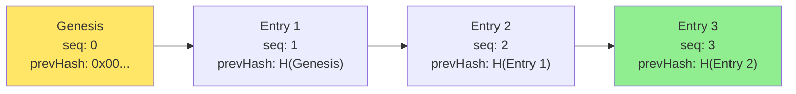

# Signed Audit Log

Tamper-evident hash-chained audit log for BrowserMesh operations.

**Related specs**: [identity-keys.md](../crypto/identity-keys.md) | [wire-format.md](../core/wire-format.md) | [security-model.md](../core/security-model.md) | [capability-scope-grammar.md](../crypto/capability-scope-grammar.md)

## 1. Overview

Applications that require provenance (game moves, collaborative edits, signed commits) need a tamper-evident log. This spec defines hash-chained audit entries signed with Ed25519 identity keys, enabling third-party verification and fork detection.

## 2. AuditEntry Structure

```typescript
interface AuditEntry {
  /** Monotonic sequence number within this chain */
  sequence: number;

  /** Pod ID of the author */
  authorPodId: string;

  /** Operation performed (scope-formatted, see capability-scope-grammar.md) */
  operation: string;

  /** Operation-specific payload */
  data?: unknown;

  /** SHA-256 of the previous entry (genesis entry uses all zeros) */
  previousHash: Uint8Array;

  /** Timestamp (ms since epoch) */
  timestamp: number;

  /** Ed25519 signature over all fields above */
  signature: Uint8Array;
}

/** Genesis (first) entry in a chain */
const GENESIS_HASH = new Uint8Array(32);  // All zeros
```

## 3. Hash Chain Mechanics

Each entry's hash is computed over its deterministic CBOR encoding (excluding the signature). The next entry links back via `previousHash`.



```typescript
/**
 * Compute the hash of an audit entry (for chain linking).
 * Hash covers all fields except signature.
 */
async function hashEntry(entry: AuditEntry): Promise<Uint8Array> {
  const payload = cbor.encode({
    sequence: entry.sequence,
    authorPodId: entry.authorPodId,
    operation: entry.operation,
    data: entry.data,
    previousHash: entry.previousHash,
    timestamp: entry.timestamp,
  });
  return new Uint8Array(await crypto.subtle.digest('SHA-256', payload));
}

/**
 * Create a new audit entry, linked to the previous entry.
 */
async function createEntry(
  identity: PodIdentity,
  operation: string,
  data: unknown,
  previousEntry: AuditEntry | null
): Promise<AuditEntry> {
  const previousHash = previousEntry
    ? await hashEntry(previousEntry)
    : GENESIS_HASH;

  const sequence = previousEntry ? previousEntry.sequence + 1 : 0;
  const timestamp = Date.now();

  const payload = cbor.encode({
    sequence,
    authorPodId: identity.podId,
    operation,
    data,
    previousHash,
    timestamp,
  });

  const signature = await identity.sign(payload);

  return {
    sequence,
    authorPodId: identity.podId,
    operation,
    data,
    previousHash,
    timestamp,
    signature,
  };
}
```

## 4. Chain Verification

```typescript
/**
 * Verify the integrity of an audit chain.
 * Checks hash links, sequence ordering, and signatures.
 *
 * @param chain - Ordered array of audit entries
 * @param publicKeys - Map of podId → Ed25519 public key
 * @returns Verification result
 */
async function verifyChain(
  chain: AuditEntry[],
  publicKeys: Map<string, CryptoKey>
): Promise<{ valid: boolean; error?: string; failedAt?: number }> {
  for (let i = 0; i < chain.length; i++) {
    const entry = chain[i];

    // Check sequence ordering
    if (entry.sequence !== i) {
      return { valid: false, error: `Sequence gap at index ${i}`, failedAt: i };
    }

    // Check hash link
    if (i === 0) {
      if (!timingSafeEqual(entry.previousHash, GENESIS_HASH)) {
        return { valid: false, error: 'Genesis entry has wrong previousHash', failedAt: 0 };
      }
    } else {
      const expectedHash = await hashEntry(chain[i - 1]);
      if (!timingSafeEqual(entry.previousHash, expectedHash)) {
        return { valid: false, error: `Hash chain broken at index ${i}`, failedAt: i };
      }
    }

    // Verify signature
    const publicKey = publicKeys.get(entry.authorPodId);
    if (!publicKey) {
      return { valid: false, error: `Unknown author: ${entry.authorPodId}`, failedAt: i };
    }

    const payload = cbor.encode({
      sequence: entry.sequence,
      authorPodId: entry.authorPodId,
      operation: entry.operation,
      data: entry.data,
      previousHash: entry.previousHash,
      timestamp: entry.timestamp,
    });

    const sigValid = await PodSigner.verify(publicKey, payload, entry.signature);
    if (!sigValid) {
      return { valid: false, error: `Invalid signature at index ${i}`, failedAt: i };
    }
  }

  return { valid: true };
}
```

## 5. Multi-Author Chains

When multiple pods contribute to the same chain, entries interleave authors. The chain remains linear — each entry points to exactly one predecessor regardless of author.

```
seq: 0  author: Alice   prevHash: 0x00...
seq: 1  author: Bob     prevHash: H(seq:0)
seq: 2  author: Alice   prevHash: H(seq:1)
seq: 3  author: Charlie prevHash: H(seq:2)
```

In multi-author scenarios, a **leader** (see [leader-election.md](../coordination/leader-election.md)) is responsible for assigning sequence numbers and broadcasting entries to maintain a single linear chain.

## 6. Fork Detection and Resolution

A fork occurs when two entries share the same `previousHash` (two competing successors to the same entry).

```typescript
interface ForkDetection {
  /** Detect forks in a set of entries */
  detectFork(entries: AuditEntry[]): Fork | null;
}

interface Fork {
  /** The common ancestor entry */
  ancestor: AuditEntry;
  /** Competing branches */
  branches: AuditEntry[][];
}

function detectFork(entries: AuditEntry[]): Fork | null {
  const hashToSuccessors = new Map<string, AuditEntry[]>();

  for (const entry of entries) {
    const key = base64urlEncode(entry.previousHash);
    const existing = hashToSuccessors.get(key) ?? [];
    existing.push(entry);
    hashToSuccessors.set(key, existing);
  }

  for (const [hash, successors] of hashToSuccessors) {
    if (successors.length > 1) {
      // Fork detected: multiple entries claim the same predecessor
      const ancestor = entries.find(e =>
        base64urlEncode(hashEntry(e)) === hash
      );
      return { ancestor: ancestor!, branches: [successors] };
    }
  }

  return null;
}
```

**Resolution strategy**: When a fork is detected, the leader resolves by choosing the branch with the earliest timestamp (or highest sequence) and rejecting the other. The rejected branch's entries are re-applied on top of the chosen branch.

## 7. Wire Format

Audit entries use the wire-format message types 0x70-0x71 (see [wire-format.md](../core/wire-format.md)):

| Type | Code | Purpose |
|------|------|---------|
| `AUDIT_ENTRY` | 0x70 | Broadcast a new audit entry to peers |
| `AUDIT_CHAIN_QUERY` | 0x71 | Request entries from a peer (range query) |

## 8. Dual Signature Pattern

When audit entries travel over encrypted sessions, they carry two layers of authentication (see [security-model.md](../core/security-model.md) §4.5):

1. **Identity signature** (in `AuditEntry.signature`) — permanent, for non-repudiation
2. **Session encryption** (AES-GCM) — ephemeral, for confidentiality

The identity signature is verified after decryption. It remains valid for third-party verification even after the session ends.

## 9. Export for Third-Party Verification

Chains can be exported as self-contained verification bundles:

```typescript
interface AuditBundle {
  /** The chain of entries */
  entries: AuditEntry[];

  /** Public keys of all authors (for offline verification) */
  authors: Map<string, Uint8Array>;  // podId → Ed25519 public key

  /** Chain metadata */
  metadata: {
    chainId: string;
    createdAt: number;
    exportedAt: number;
  };
}

async function exportBundle(
  entries: AuditEntry[],
  publicKeys: Map<string, Uint8Array>
): Promise<Uint8Array> {
  const bundle: AuditBundle = {
    entries,
    authors: publicKeys,
    metadata: {
      chainId: crypto.randomUUID(),
      createdAt: entries[0]?.timestamp ?? Date.now(),
      exportedAt: Date.now(),
    },
  };
  return cbor.encode(bundle);
}
```

## 10. Storage Options

| Storage | Suitable For | Notes |
|---------|-------------|-------|
| IndexedDB | Local audit trail | Persistent, queryable by sequence |
| SharedWorkerPod memory | Ephemeral session log | Lost on worker shutdown |
| Server pod | Long-term archive | Forward via WebSocket/WebTransport |
| IPFS/Storacha | Permanent record | See [storage-integration.md](storage-integration.md) |
