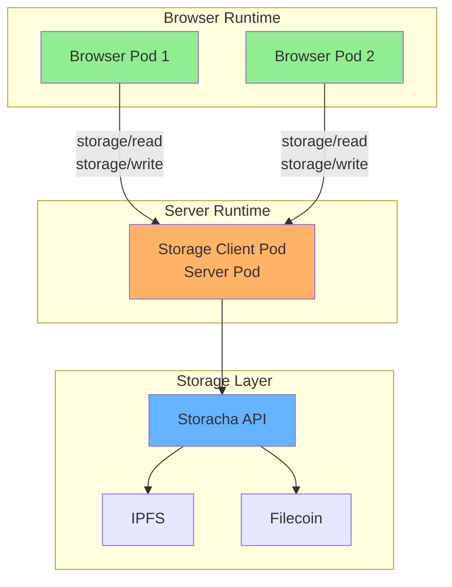

# Storage Integration

Integration with content-addressed storage systems (Storacha/IPFS) for BrowserMesh.

**Related specs**: [compute-offload.md](compute-offload.md) | [service-model.md](../coordination/service-model.md) | [security-model.md](../core/security-model.md)

## 1. Overview

Storage integration enables:
- Content-addressed artifacts (CIDs)
- Immutable blob storage
- Capability-delegated access
- Manifest-based versioning

## 2. Integration Architecture



**Key principle**: Browsers don't hold long-lived storage authority. Server pods handle persistence, retries, and policy enforcement.

## 3. What Storage Is Good For

### Ideal Use Cases

| Use Case | Description |
|----------|-------------|
| Model weights | ML model files |
| Prompt packs | LLM prompt templates |
| Tool bundles | WASM modules, JS bundles |
| Build artifacts | Compiled outputs |
| Logs | Append-only records |
| Snapshots | State backups |
| Large media | Images, video, audio |
| Pod images | Executable bundles |

### Not Suitable For

| Anti-pattern | Better Alternative |
|--------------|-------------------|
| Low-latency state | IndexedDB / OPFS |
| Coordination | Coordination pods |
| Leader election | Slot lease protocol |
| Mutable documents | CRDTs / OT |
| Counters | Distributed counters |

## 4. CID-Based Addressing

CIDs (Content Identifiers) are first-class addresses:

```typescript
interface ContentAddress {
  cid: string;                    // e.g., "bafybeigdyrzt..."
  via?: 'storacha' | 'ipfs' | 'gateway';
  verified?: boolean;
}

// Example message
const fetchRequest: MeshRequest = {
  type: 'REQUEST',
  id: crypto.randomUUID(),
  from: podId,
  target: { capability: 'storage/read' },
  payload: {
    op: 'fetchArtifact',
    args: {
      cid: 'bafybeigdyrzt...',
      via: 'storacha',
    },
  },
  timestamp: Date.now(),
};
```

## 5. Storage Pod API

```typescript
interface StoragePodCapabilities {
  id: string;
  kind: 'server';
  capabilities: [
    'storage/read',
    'storage/write',
    'storage/pin',
    'storage/list',
  ];
}

class StoragePod extends ServerPod {
  private storachaClient: StorachaClient;
  private cache: Map<string, Uint8Array> = new Map();

  /**
   * Fetch content by CID
   */
  async fetch(cid: string): Promise<Uint8Array> {
    // Check cache
    if (this.cache.has(cid)) {
      return this.cache.get(cid)!;
    }

    // Fetch from Storacha
    const content = await this.storachaClient.get(cid);

    // Verify hash
    const computedCid = await computeCID(content);
    if (computedCid !== cid) {
      throw new Error('CID mismatch');
    }

    // Cache
    this.cache.set(cid, content);
    return content;
  }

  /**
   * Store content and return CID
   */
  async store(content: Uint8Array): Promise<string> {
    // Compute CID locally
    const cid = await computeCID(content);

    // Upload to Storacha
    await this.storachaClient.put(content);

    return cid;
  }

  /**
   * Pin content for persistence
   */
  async pin(cid: string): Promise<void> {
    await this.storachaClient.pin(cid);
  }

  /**
   * List stored content
   */
  async list(prefix?: string): Promise<StorageEntry[]> {
    return this.storachaClient.list({ prefix });
  }
}

interface StorageEntry {
  cid: string;
  size: number;
  createdAt: number;
  pinned: boolean;
}
```

## 6. Delegation Model

Use HD-derived keys for storage access:

```typescript
// Root pod identity derives storage delegation key
const storageDelegationKey = await identity.derive('cap/storage/write');

// Server pod uses derived key to authenticate with Storacha
const delegation = await createDelegation({
  issuer: storageDelegationKey.keyPair,
  audience: storachaSpaceDID,
  capabilities: [
    { can: 'store/add', with: spaceId },
    { can: 'upload/add', with: spaceId },
  ],
  expiration: Date.now() + 3600000,  // 1 hour
});

// Browser pods receive CIDs, verify by hash, fetch via gateways
// Browser pods NEVER need Storacha API keys
```

## 7. Fetch Strategies

### 7.1 Gateway-Only (Simplest)

```typescript
class GatewayFetcher {
  private gatewayUrl = 'https://gateway.storacha.network/ipfs';

  async fetch(cid: string): Promise<Uint8Array> {
    const response = await fetch(`${this.gatewayUrl}/${cid}`);
    const content = new Uint8Array(await response.arrayBuffer());

    // Verify hash
    if (await computeCID(content) !== cid) {
      throw new Error('Content verification failed');
    }

    return content;
  }
}
```

### 7.2 Server Pod as IPFS Peer

```typescript
class IpfsPeerFetcher {
  private ipfsNode: any;  // Helia/js-ipfs

  async fetch(cid: string): Promise<Uint8Array> {
    const chunks: Uint8Array[] = [];
    for await (const chunk of this.ipfsNode.cat(cid)) {
      chunks.push(chunk);
    }
    return concat(...chunks);
  }

  async pin(cid: string): Promise<void> {
    await this.ipfsNode.pin.add(cid);
  }
}
```

### 7.3 Mesh-Routed Fetch

```typescript
class MeshFetcher {
  async fetch(cid: string): Promise<Uint8Array> {
    // Try local cache first
    const local = await localCache.get(cid);
    if (local) return local;

    // Ask mesh for content
    const result = await meshRouter.send(
      { capability: 'storage/read' },
      { op: 'fetch', args: { cid } }
    );

    return result.content;
  }
}
```

## 8. Manifest Layer

Manifests provide versioning and metadata above raw CIDs:

```typescript
interface ArtifactManifest {
  name: string;
  version: string;
  description?: string;

  // Primary artifact
  artifact: {
    cid: string;
    type: 'wasm' | 'js' | 'data' | 'image';
    size: number;
  };

  // Related resources
  schema?: string;        // CID of schema
  docs?: string;          // CID of documentation
  source?: string;        // CID of source code

  // Capabilities required to use this artifact
  capabilities: string[];

  // Cryptographic signature
  signature?: {
    signer: string;       // Pod ID of signer
    sig: Uint8Array;
  };
}

// Example manifest
const imageResizerManifest: ArtifactManifest = {
  name: 'image-resizer',
  version: '1.2.3',
  artifact: {
    cid: 'bafybeigdyrzt...',
    type: 'wasm',
    size: 245760,
  },
  schema: 'bafkreigh2akisc...',
  capabilities: ['compute/wasm', 'image/resize'],
};
```

## 9. Resolution Flow

```typescript
class ArtifactResolver {
  private manifestCache: Map<string, ArtifactManifest> = new Map();

  /**
   * Resolve artifact by name and version
   */
  async resolve(
    name: string,
    version?: string
  ): Promise<ArtifactManifest> {
    // Look up in registry
    const manifestCid = await this.registry.lookup(name, version);

    // Fetch manifest
    const manifestData = await this.storage.fetch(manifestCid);
    const manifest = cbor.decode(manifestData) as ArtifactManifest;

    // Verify signature if present
    if (manifest.signature) {
      await this.verifySignature(manifest);
    }

    return manifest;
  }

  /**
   * Fetch and verify artifact content
   */
  async fetchArtifact(manifest: ArtifactManifest): Promise<Uint8Array> {
    const content = await this.storage.fetch(manifest.artifact.cid);

    // Verify size
    if (content.length !== manifest.artifact.size) {
      throw new Error('Size mismatch');
    }

    return content;
  }
}
```

## 10. Storage Operations

### 10.1 Upload Flow

```typescript
async function uploadArtifact(
  storagePod: StoragePod,
  content: Uint8Array,
  metadata: Partial<ArtifactManifest>
): Promise<ArtifactManifest> {
  // 1. Store the content
  const contentCid = await storagePod.store(content);

  // 2. Create manifest
  const manifest: ArtifactManifest = {
    ...metadata,
    name: metadata.name!,
    version: metadata.version!,
    artifact: {
      cid: contentCid,
      type: metadata.artifact?.type ?? 'data',
      size: content.length,
    },
    capabilities: metadata.capabilities ?? [],
  };

  // 3. Sign manifest
  manifest.signature = await signManifest(manifest);

  // 4. Store manifest
  const manifestData = cbor.encode(manifest);
  const manifestCid = await storagePod.store(manifestData);

  // 5. Register in registry
  await registry.register(manifest.name, manifest.version, manifestCid);

  return manifest;
}
```

### 10.2 Garbage Collection

```typescript
class StorageGC {
  private pinned: Set<string> = new Set();

  /**
   * Mark CID as in use
   */
  pin(cid: string): void {
    this.pinned.add(cid);
  }

  /**
   * Unpin CID
   */
  unpin(cid: string): void {
    this.pinned.delete(cid);
  }

  /**
   * Clean up unpinned content
   */
  async gc(): Promise<number> {
    const all = await this.storage.list();
    let removed = 0;

    for (const entry of all) {
      if (!this.pinned.has(entry.cid)) {
        await this.storage.remove(entry.cid);
        removed++;
      }
    }

    return removed;
  }
}
```

## 11. Caching Strategy

```typescript
interface CacheConfig {
  maxSize: number;           // Max cache size in bytes
  maxAge: number;            // Max age in ms
  strategy: 'lru' | 'lfu';   // Eviction strategy
}

class ContentCache {
  private cache: Map<string, CacheEntry> = new Map();
  private currentSize = 0;

  async get(cid: string): Promise<Uint8Array | undefined> {
    const entry = this.cache.get(cid);
    if (!entry) return undefined;

    // Check expiry
    if (Date.now() - entry.cachedAt > this.config.maxAge) {
      this.cache.delete(cid);
      this.currentSize -= entry.content.length;
      return undefined;
    }

    entry.accessCount++;
    entry.lastAccess = Date.now();
    return entry.content;
  }

  async set(cid: string, content: Uint8Array): Promise<void> {
    // Evict if necessary
    while (this.currentSize + content.length > this.config.maxSize) {
      this.evict();
    }

    this.cache.set(cid, {
      content,
      cachedAt: Date.now(),
      lastAccess: Date.now(),
      accessCount: 1,
    });
    this.currentSize += content.length;
  }

  private evict(): void {
    if (this.config.strategy === 'lru') {
      this.evictLRU();
    } else {
      this.evictLFU();
    }
  }
}

interface CacheEntry {
  content: Uint8Array;
  cachedAt: number;
  lastAccess: number;
  accessCount: number;
}
```

## 12. Integration Example

```typescript
// Create storage pod
const storagePod = await StoragePod.create({
  port: 8081,
  storachaToken: process.env.STORACHA_TOKEN,
});

// Browser pod requests artifact
const manifest = await browserPod.send(
  { capability: 'storage/read' },
  { op: 'resolve', args: { name: 'image-resizer', version: '1.2.3' } }
);

// Fetch via gateway (browser can do this directly)
const content = await fetch(
  `https://gateway.storacha.network/ipfs/${manifest.artifact.cid}`
);

// Or fetch via mesh routing
const content = await browserPod.send(
  { capability: 'storage/read' },
  { op: 'fetch', args: { cid: manifest.artifact.cid } }
);

// Upload new artifact (via server pod)
const newManifest = await browserPod.send(
  { capability: 'storage/write' },
  {
    op: 'upload',
    args: {
      content: wasmModule,
      metadata: {
        name: 'my-processor',
        version: '0.1.0',
        capabilities: ['compute/wasm'],
      },
    },
  }
);
```
