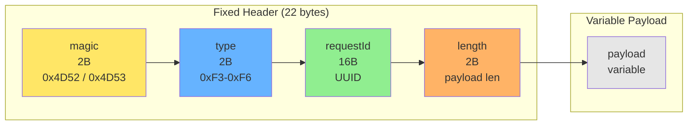
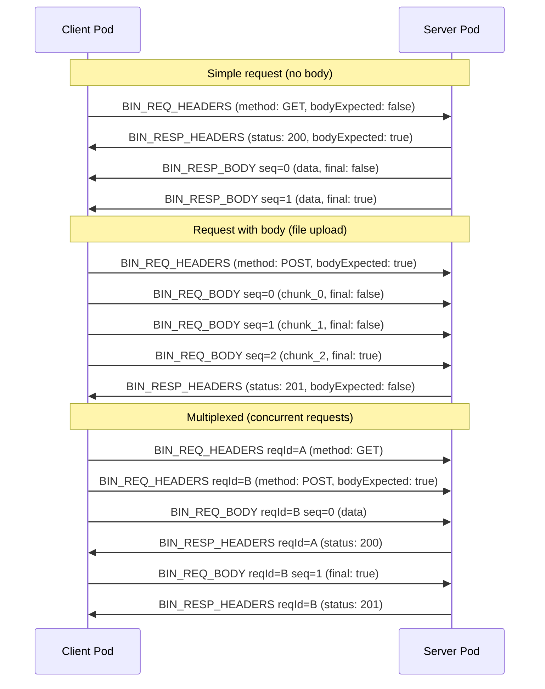

# Binary Request Protocol

Efficient HTTP-style request/response framing over non-HTTP channels.

**Related specs**: [message-envelope.md](message-envelope.md) | [streaming-protocol.md](streaming-protocol.md) | [wire-format.md](../core/wire-format.md)

## 1. Overview

The binary request protocol provides a lightweight alternative to the CBOR-encoded message envelope for streaming-heavy workloads such as file uploads, media transfer, and large binary payloads. It uses raw binary framing with 22-byte headers and built-in body streaming, avoiding the encoding overhead of CBOR for large transfers.

Key properties:

- **HTTP-style semantics** — method, path, headers, request/response correlation
- **Built-in body streaming** — chunked body transfer without requiring the separate streaming protocol
- **Low overhead** — 22-byte fixed header per packet vs. ~50-100 bytes for CBOR envelopes
- **Multiplexing** — multiple concurrent requests over a single channel via 16-byte request IDs
- **Typed metadata** — RFC 8941/9651 structured fields for extensible, type-safe headers

## 2. Wire Format Messages

```typescript
enum BinaryRequestType {
  BIN_REQ_HEADERS  = 0xF3,
  BIN_REQ_BODY     = 0xF4,
  BIN_RESP_HEADERS = 0xF5,
  BIN_RESP_BODY    = 0xF6,
}
```

These type codes occupy the `0xF*` range, which is reserved for binary framing extensions in the [wire-format.md](../core/wire-format.md) type code space.

## 3. Packet Format

All binary request packets share a common fixed header:



| Field | Size | Description |
|-------|------|-------------|
| magic | 2 bytes | `0x4D 0x52` ("MR") for request packets, `0x4D 0x53` ("MS") for response packets |
| type | 2 bytes | Packet type (0xF3-0xF6), big-endian |
| requestId | 16 bytes | Unique request identifier (UUID) |
| length | 2 bytes | Payload length in bytes, big-endian (max 65535) |
| payload | variable | Type-specific payload |

```typescript
function encodePacketHeader(
  magic: 'MR' | 'MS',
  type: BinaryRequestType,
  requestId: Uint8Array,
  payloadLength: number
): Uint8Array {
  const header = new Uint8Array(22);
  const view = new DataView(header.buffer);

  // Magic bytes
  header[0] = magic === 'MR' ? 0x4D : 0x4D;
  header[1] = magic === 'MR' ? 0x52 : 0x53;

  // Type
  view.setUint16(2, type, false);

  // Request ID
  header.set(requestId, 4);

  // Payload length
  view.setUint16(20, payloadLength, false);

  return header;
}

function decodePacketHeader(data: Uint8Array): {
  magic: 'MR' | 'MS';
  type: BinaryRequestType;
  requestId: Uint8Array;
  payloadLength: number;
} {
  const view = new DataView(data.buffer, data.byteOffset);

  const magicByte = data[1];
  const magic: 'MR' | 'MS' = magicByte === 0x52 ? 'MR' : 'MS';

  return {
    magic,
    type: view.getUint16(2, false) as BinaryRequestType,
    requestId: data.slice(4, 20),
    payloadLength: view.getUint16(20, false),
  };
}
```

## 4. Request Headers (0xF3)

The request headers packet initiates a new request. The payload is CBOR-encoded metadata.

```typescript
interface BinRequestHeaders {
  requestId: Uint8Array;    // 16 bytes
  method: string;           // HTTP-like method (GET, POST, PUT, DELETE, SUBSCRIBE)
  path: string;             // Resource path (e.g., "/storage/files/abc")
  headers: Map<string, string>;  // RFC 8941 structured fields
  bodyExpected: boolean;    // Whether body chunks follow
}
```

If `bodyExpected` is `false`, the request is complete after this single packet (similar to a GET request with no body).

## 5. Request Body (0xF4)

Body data is sent as one or more chunked body packets, each carrying up to 16 KB of data.

```typescript
interface BinRequestBody {
  requestId: Uint8Array;    // 16 bytes — correlates with headers
  sequence: number;         // Chunk sequence number (monotonic)
  data: Uint8Array;         // Max 16 KB per chunk
  final: boolean;           // Last body chunk
}
```

The `final` flag on the last body chunk signals the end of the request body. The receiver should not process the full request until `final: true` is received (or the request times out).

## 6. Response Headers (0xF5)

The response headers packet is structurally identical to request headers, sent in the opposite direction.

```typescript
interface BinResponseHeaders {
  requestId: Uint8Array;    // 16 bytes — matches original request
  status: number;           // HTTP-like status code (200, 404, 500, etc.)
  headers: Map<string, string>;  // RFC 8941 structured fields
  bodyExpected: boolean;    // Whether body chunks follow
}
```

## 7. Response Body (0xF6)

Response body chunks mirror the request body format.

```typescript
interface BinResponseBody {
  requestId: Uint8Array;    // 16 bytes
  sequence: number;         // Chunk sequence number
  data: Uint8Array;         // Max 16 KB per chunk
  final: boolean;           // Last body chunk
}
```

## 8. Request Flow



## 9. Fetch API Bridge

The binary request protocol can be bridged to the standard Fetch API, enabling pods to use familiar `Request`/`Response` objects for communication.

```typescript
/**
 * Send a Fetch-style Request over a PodChannel using binary framing.
 * Returns a standard Response object.
 */
async function meshFetch(
  request: Request,
  channel: PodChannel
): Promise<Response> {
  const requestId = crypto.getRandomValues(new Uint8Array(16));
  const hasBody = request.body !== null;

  // Send request headers
  const headerPacket = encodeBinRequestHeaders({
    requestId,
    method: request.method,
    path: new URL(request.url).pathname,
    headers: extractStructuredHeaders(request.headers),
    bodyExpected: hasBody,
  });
  channel.send(headerPacket);

  // Stream request body if present
  if (hasBody) {
    const reader = request.body!.getReader();
    let sequence = 0;

    while (true) {
      const { done, value } = await reader.read();
      if (done) break;

      // Fragment into 16 KB chunks
      for (let offset = 0; offset < value.length; offset += 16384) {
        const chunk = value.subarray(offset, Math.min(offset + 16384, value.length));
        const isLast = done && offset + 16384 >= value.length;
        channel.send(encodeBinRequestBody({
          requestId,
          sequence: sequence++,
          data: chunk,
          final: isLast,
        }));
      }
    }

    // Send final empty chunk if the last data chunk wasn't marked final
    channel.send(encodeBinRequestBody({
      requestId,
      sequence: sequence++,
      data: new Uint8Array(0),
      final: true,
    }));
  }

  // Wait for response headers
  const responseHeaders = await waitForResponseHeaders(channel, requestId);

  // Build Response with streaming body if present
  if (responseHeaders.bodyExpected) {
    const bodyStream = createResponseBodyStream(channel, requestId);
    return new Response(bodyStream, {
      status: responseHeaders.status,
      headers: Object.fromEntries(responseHeaders.headers),
    });
  }

  return new Response(null, {
    status: responseHeaders.status,
    headers: Object.fromEntries(responseHeaders.headers),
  });
}

/**
 * Register a handler that receives Fetch-style Requests and returns Responses.
 * Incoming binary request packets are assembled into Request objects.
 */
function meshFetchHandler(
  channel: PodChannel,
  handler: (request: Request) => Promise<Response>
): void {
  const pending = new Map<string, PendingBinRequest>();

  channel.onmessage = async (event) => {
    const header = decodePacketHeader(event.data as Uint8Array);
    const key = requestIdToKey(header.requestId);

    switch (header.type) {
      case BinaryRequestType.BIN_REQ_HEADERS: {
        const reqHeaders = decodeBinRequestHeaders(event.data as Uint8Array);
        const entry: PendingBinRequest = { headers: reqHeaders, bodyChunks: [] };
        pending.set(key, entry);

        if (!reqHeaders.bodyExpected) {
          pending.delete(key);
          const request = assembleRequest(reqHeaders, []);
          const response = await handler(request);
          await sendBinResponse(channel, header.requestId, response);
        }
        break;
      }

      case BinaryRequestType.BIN_REQ_BODY: {
        const body = decodeBinRequestBody(event.data as Uint8Array);
        const entry = pending.get(key);
        if (!entry) break;

        entry.bodyChunks.push(body.data);

        if (body.final) {
          pending.delete(key);
          const request = assembleRequest(entry.headers, entry.bodyChunks);
          const response = await handler(request);
          await sendBinResponse(channel, header.requestId, response);
        }
        break;
      }
    }
  };
}
```

## 10. RFC 8941/9651 Structured Fields

Request and response headers use [RFC 8941](https://www.rfc-editor.org/rfc/rfc8941) / [RFC 9651](https://www.rfc-editor.org/rfc/rfc9651) HTTP Structured Fields encoding for typed, extensible metadata.

```typescript
interface StructuredFieldValue {
  type: 'integer' | 'decimal' | 'string' | 'token' | 'binary' | 'boolean' | 'date' | 'display-string';
  value: number | string | Uint8Array | boolean | Date;
  parameters?: Map<string, StructuredFieldValue>;
}

function parseStructuredField(input: string): StructuredFieldValue {
  // Parse per RFC 8941 Section 4.2
  const trimmed = input.trim();

  // Integer: digits with optional leading minus
  if (/^-?\d{1,15}$/.test(trimmed)) {
    return { type: 'integer', value: parseInt(trimmed, 10) };
  }

  // Decimal: digits with decimal point
  if (/^-?\d{1,12}\.\d{1,3}$/.test(trimmed)) {
    return { type: 'decimal', value: parseFloat(trimmed) };
  }

  // Boolean: ?0 or ?1
  if (trimmed === '?0' || trimmed === '?1') {
    return { type: 'boolean', value: trimmed === '?1' };
  }

  // Binary: base64-encoded in colons
  if (/^:[A-Za-z0-9+/=]+:$/.test(trimmed)) {
    const b64 = trimmed.slice(1, -1);
    const bytes = Uint8Array.from(atob(b64), c => c.charCodeAt(0));
    return { type: 'binary', value: bytes };
  }

  // String: quoted
  if (trimmed.startsWith('"') && trimmed.endsWith('"')) {
    return { type: 'string', value: trimmed.slice(1, -1) };
  }

  // Token: unquoted alphanumeric
  return { type: 'token', value: trimmed };
}

function serializeStructuredField(value: StructuredFieldValue): string {
  switch (value.type) {
    case 'integer':
      return String(value.value);
    case 'decimal':
      return (value.value as number).toFixed(3);
    case 'boolean':
      return value.value ? '?1' : '?0';
    case 'binary': {
      const b64 = btoa(String.fromCharCode(...(value.value as Uint8Array)));
      return `:${b64}:`;
    }
    case 'string':
      return `"${value.value}"`;
    case 'token':
      return String(value.value);
    case 'date':
      return `@${Math.floor((value.value as Date).getTime() / 1000)}`;
    case 'display-string':
      return `%"${value.value}"`;
    default:
      throw new Error(`Unknown structured field type: ${value.type}`);
  }
}
```

## 11. Multiplexing

Multiple concurrent requests can be in flight over a single `PodChannel`. Each request is identified by its 16-byte `requestId`, and packets from different requests can be interleaved freely. The receiver demultiplexes by `requestId`.

```typescript
class BinaryRequestMultiplexer {
  private pending: Map<string, PendingBinRequest> = new Map();
  private maxConcurrent: number = 32;

  canAcceptRequest(): boolean {
    return this.pending.size < this.maxConcurrent;
  }

  trackRequest(requestId: Uint8Array): void {
    const key = requestIdToKey(requestId);
    if (this.pending.size >= this.maxConcurrent) {
      throw new Error('Too many concurrent binary requests');
    }
    this.pending.set(key, { headers: null!, bodyChunks: [] });
  }

  completeRequest(requestId: Uint8Array): void {
    this.pending.delete(requestIdToKey(requestId));
  }
}

function requestIdToKey(id: Uint8Array): string {
  return Array.from(id).map(b => b.toString(16).padStart(2, '0')).join('');
}
```

## 12. Comparison with CBOR Envelope

| Aspect | CBOR Envelope | Binary Request |
|--------|---------------|----------------|
| Encoding | CBOR (RFC 8949) | Raw binary + structured fields |
| Streaming | Separate streaming protocol (0x12-0x16) | Built-in body streaming (0xF3-0xF6) |
| Header overhead | ~50-100 bytes | ~22 bytes fixed header |
| Metadata format | CBOR maps | RFC 8941 structured fields |
| Request correlation | UUID string in envelope | 16-byte binary requestId |
| Best for | RPC calls, small payloads, general messaging | File transfer, streaming, large binary payloads |
| Multiplexing | Via streaming protocol | Built-in via requestId |
| Fetch API bridge | Manual assembly | Native Request/Response mapping |

Use the CBOR envelope (see [message-envelope.md](message-envelope.md)) for general-purpose RPC and small payloads. Use the binary request protocol for file transfers, streaming workloads, and any scenario where the overhead of CBOR encoding matters. Both can be used over the same channel — negotiate via the `Accept-Format` header.

## 13. Limits

| Resource | Limit | Notes |
|----------|-------|-------|
| Max packet payload | 65,535 bytes | 2-byte length field (big-endian) |
| Max body chunk data | 16 KB | Consistent with streaming protocol chunk size |
| Max concurrent requests | 32 | Per channel; configurable |
| Request ID size | 16 bytes | UUID, generated via `crypto.getRandomValues()` |
| Max header map entries | 64 | Per request/response |
| Max header value length | 1024 bytes | Per individual structured field value |
| Request timeout | 30 seconds | Default; configurable per request |
