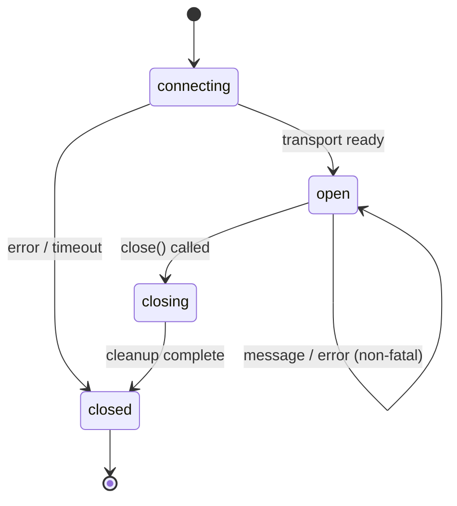

# Channel Abstraction

Unified interface for all communication channels between BrowserMesh pods.

**Related specs**: [pod-socket.md](pod-socket.md) | [link-negotiation.md](link-negotiation.md) | [transport-probing.md](transport-probing.md) | [session-keys.md](../crypto/session-keys.md) | [pod-types.md](../core/pod-types.md)

## 1. Overview

Pods communicate over many transport types (MessagePort, BroadcastChannel, Worker ports, postMessage, SharedWorker). The `PodChannel` interface provides a single abstraction that all transports implement, so session management, encryption, and higher-level protocols never depend on the underlying transport.

## 2. PodChannel Interface

```typescript
/**
 * Unified channel interface for pod-to-pod communication.
 * All transport adapters implement this interface.
 */
interface PodChannel {
  /** Unique channel identifier */
  readonly id: string;

  /** Underlying transport type */
  readonly type: PodChannelType;

  /** Current channel state */
  readonly state: PodChannelState;

  /** Send a message through the channel */
  send(data: unknown, transfer?: Transferable[]): void;

  /** Register a message handler */
  onmessage: ((event: PodChannelEvent) => void) | null;

  /** Register an error handler */
  onerror: ((error: PodChannelError) => void) | null;

  /** Register a close handler */
  onclose: (() => void) | null;

  /** Close the channel and release resources */
  close(): void;
}

type PodChannelType =
  | 'message-port'
  | 'worker'
  | 'broadcast-channel'
  | 'post-message'
  | 'shared-worker-port';

type PodChannelState =
  | 'connecting'
  | 'open'
  | 'closing'
  | 'closed';

interface PodChannelEvent {
  data: unknown;
  source?: PodChannel;
  origin?: string;
}

interface PodChannelError {
  code: string;
  message: string;
  fatal: boolean;
}
```

## 3. Channel Adapters

### 3.1 MessagePort Adapter

Wraps a `MessagePort` from `MessageChannel`, the preferred channel for established connections.

```typescript
class MessagePortChannel implements PodChannel {
  readonly type = 'message-port';
  readonly id: string;
  state: PodChannelState = 'open';
  onmessage: ((event: PodChannelEvent) => void) | null = null;
  onerror: ((error: PodChannelError) => void) | null = null;
  onclose: (() => void) | null = null;

  constructor(private port: MessagePort, id?: string) {
    this.id = id ?? crypto.randomUUID();
    this.port.onmessage = (e) => {
      this.onmessage?.({ data: e.data });
    };
    this.port.onmessageerror = () => {
      this.onerror?.({ code: 'DESERIALIZE', message: 'Message deserialization failed', fatal: false });
    };
    this.port.start();
  }

  send(data: unknown, transfer?: Transferable[]): void {
    this.port.postMessage(data, { transfer });
  }

  close(): void {
    this.state = 'closed';
    this.port.close();
    this.onclose?.();
  }
}
```

### 3.2 Worker Adapter

Wraps a `DedicatedWorkerGlobalScope` or `Worker` instance.

```typescript
class WorkerChannel implements PodChannel {
  readonly type = 'worker';
  readonly id: string;
  state: PodChannelState = 'open';
  onmessage: ((event: PodChannelEvent) => void) | null = null;
  onerror: ((error: PodChannelError) => void) | null = null;
  onclose: (() => void) | null = null;

  constructor(private target: Worker | DedicatedWorkerGlobalScope, id?: string) {
    this.id = id ?? crypto.randomUUID();
    this.target.onmessage = (e) => {
      this.onmessage?.({ data: e.data });
    };
    this.target.onerror = (e) => {
      this.onerror?.({ code: 'WORKER_ERROR', message: String(e), fatal: false });
    };
  }

  send(data: unknown, transfer?: Transferable[]): void {
    this.target.postMessage(data, { transfer });
  }

  close(): void {
    this.state = 'closed';
    if ('terminate' in this.target) {
      (this.target as Worker).terminate();
    }
    this.onclose?.();
  }
}
```

### 3.3 BroadcastChannel Adapter

Wraps a `BroadcastChannel` for same-origin multicast.

```typescript
class BroadcastChannelAdapter implements PodChannel {
  readonly type = 'broadcast-channel';
  readonly id: string;
  state: PodChannelState = 'open';
  onmessage: ((event: PodChannelEvent) => void) | null = null;
  onerror: ((error: PodChannelError) => void) | null = null;
  onclose: (() => void) | null = null;

  constructor(private bc: BroadcastChannel, id?: string) {
    this.id = id ?? bc.name;
    this.bc.onmessage = (e) => {
      this.onmessage?.({ data: e.data });
    };
    this.bc.onmessageerror = () => {
      this.onerror?.({ code: 'DESERIALIZE', message: 'Message deserialization failed', fatal: false });
    };
  }

  send(data: unknown): void {
    this.bc.postMessage(data);
  }

  close(): void {
    this.state = 'closed';
    this.bc.close();
    this.onclose?.();
  }
}
```

### 3.4 PostMessage Adapter

Wraps `window.postMessage` for cross-origin window-to-window or window-to-iframe communication.

```typescript
class PostMessageChannel implements PodChannel {
  readonly type = 'post-message';
  readonly id: string;
  state: PodChannelState = 'open';
  onmessage: ((event: PodChannelEvent) => void) | null = null;
  onerror: ((error: PodChannelError) => void) | null = null;
  onclose: (() => void) | null = null;
  private listener: ((e: MessageEvent) => void) | null = null;

  constructor(
    private target: Window,
    private targetOrigin: string,
    private sourceFilter?: string,  // Filter messages by source pod ID
    id?: string
  ) {
    this.id = id ?? crypto.randomUUID();
    this.listener = (e: MessageEvent) => {
      if (this.targetOrigin !== '*' && e.origin !== this.targetOrigin) return;
      if (this.sourceFilter && e.data?.podId !== this.sourceFilter) return;
      this.onmessage?.({ data: e.data, origin: e.origin });
    };
    self.addEventListener('message', this.listener);
  }

  send(data: unknown, transfer?: Transferable[]): void {
    this.target.postMessage(data, this.targetOrigin, transfer);
  }

  close(): void {
    this.state = 'closed';
    if (this.listener) {
      self.removeEventListener('message', this.listener);
      this.listener = null;
    }
    this.onclose?.();
  }
}
```

### 3.5 SharedWorkerPort Adapter

Wraps a `MessagePort` obtained from `SharedWorker.port`.

```typescript
class SharedWorkerPortChannel implements PodChannel {
  readonly type = 'shared-worker-port';
  readonly id: string;
  state: PodChannelState = 'open';
  onmessage: ((event: PodChannelEvent) => void) | null = null;
  onerror: ((error: PodChannelError) => void) | null = null;
  onclose: (() => void) | null = null;

  constructor(private port: MessagePort, id?: string) {
    this.id = id ?? crypto.randomUUID();
    this.port.onmessage = (e) => {
      this.onmessage?.({ data: e.data });
    };
    this.port.onmessageerror = () => {
      this.onerror?.({ code: 'DESERIALIZE', message: 'Message deserialization failed', fatal: false });
    };
    this.port.start();
  }

  send(data: unknown, transfer?: Transferable[]): void {
    this.port.postMessage(data, { transfer });
  }

  close(): void {
    this.state = 'closed';
    this.port.close();
    this.onclose?.();
  }
}
```

## 4. Auto-Detection

The `wrapChannel()` function auto-detects the raw transport type and returns the appropriate `PodChannel` adapter.

```typescript
function wrapChannel(raw: unknown, id?: string): PodChannel {
  // MessagePort (from MessageChannel or SharedWorker)
  if (raw instanceof MessagePort) {
    return new MessagePortChannel(raw, id);
  }

  // Worker (DedicatedWorker)
  if (typeof Worker !== 'undefined' && raw instanceof Worker) {
    return new WorkerChannel(raw, id);
  }

  // DedicatedWorkerGlobalScope (inside a worker)
  if (typeof DedicatedWorkerGlobalScope !== 'undefined' &&
      raw instanceof DedicatedWorkerGlobalScope) {
    return new WorkerChannel(raw, id);
  }

  // BroadcastChannel
  if (typeof BroadcastChannel !== 'undefined' && raw instanceof BroadcastChannel) {
    return new BroadcastChannelAdapter(raw, id);
  }

  // Window (postMessage target)
  if (typeof Window !== 'undefined' && raw instanceof Window) {
    return new PostMessageChannel(raw, '*', undefined, id);
  }

  throw new Error(`Cannot wrap unknown channel type: ${raw}`);
}
```

## 5. Channel Lifecycle



### Lifecycle Events

| Event | When | Handler |
|-------|------|---------|
| `open` | Channel ready for messages | Set by transport adapter |
| `message` | Data received | `onmessage` |
| `error` | Non-fatal error (deserialization, etc.) | `onerror` |
| `close` | Channel permanently closed | `onclose` |

### Cleanup Checklist

When closing a channel:
1. Set `state` to `'closing'`
2. Remove event listeners from underlying transport
3. Close or release the underlying transport
4. Set `state` to `'closed'`
5. Fire `onclose` handler

## 6. Transferable Support

Channels that support `Transferable` objects (MessagePort, Worker, postMessage) accept an optional `transfer` array in `send()`. This enables zero-copy transfer of `ArrayBuffer`, `MessagePort`, `OffscreenCanvas`, and other transferable objects.

```typescript
// Transfer a MessagePort through a PodChannel
const { port1, port2 } = new MessageChannel();
channel.send({ type: 'PORT_OFFER', port: port2 }, [port2]);

// Transfer an ArrayBuffer (zero-copy)
const buffer = new ArrayBuffer(1024);
channel.send({ type: 'DATA', buffer }, [buffer]);
```

BroadcastChannel does **not** support Transferable — the `transfer` parameter is ignored.

## 7. Relationship to PodSocket

`PodChannel` is the transport layer beneath [PodSocket](pod-socket.md). The relationship:

```
PodSocket (encrypted, multiplexed, request/response)
    └── SessionCrypto (encryption layer, see session-keys.md)
        └── PodChannel (raw transport, this spec)
            └── Native API (MessagePort, Worker, BroadcastChannel, etc.)
```

Link negotiation (see [link-negotiation.md](link-negotiation.md)) selects and establishes the underlying transport, then wraps it in a `PodChannel` before passing it to `SessionManager.getOrCreateSession()`.

## 8. SmartChannel (High-Level Selection)

While `wrapChannel()` wraps a single known transport, the [SmartChannel](transport-probing.md) factory provides **automatic transport selection**. SmartChannel probes peer capabilities, selects the best available transport, and falls back through alternatives on failure.

```typescript
// Low-level: wrap a known transport
const channel = wrapChannel(messagePort);

// High-level: auto-select best transport
const channel = await SmartChannel.connect(targetPodId, {
  preferredOrder: ['webrtc', 'websocket', 'message-port'],
  timeout: 5000,
});
```

See [transport-probing.md](transport-probing.md) for the probe protocol, scoring algorithm, and upgrade scheduling.

## 9. LocalChannel (Test Transport)

For unit and integration testing without real browser contexts, the [LocalChannel](../operations/test-transport.md) provides an in-memory `PodChannel` implementation with configurable fault injection.

```typescript
const [channelA, channelB] = createLocalChannelPair({
  latencyMs: 50,
  jitterMs: 10,
  dropRate: 0.01,
});

// channelA and channelB are connected PodChannel instances
channelA.send({ type: 'HELLO' });
// channelB.onmessage fires after ~50ms
```

See [test-transport.md](../operations/test-transport.md) for the full LocalChannel API and TestMesh helper.
