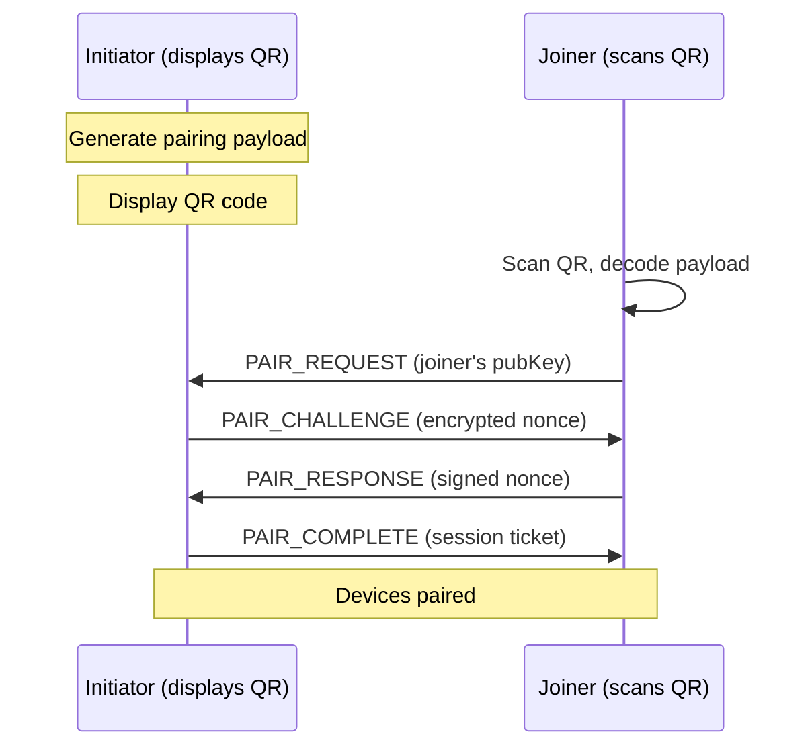
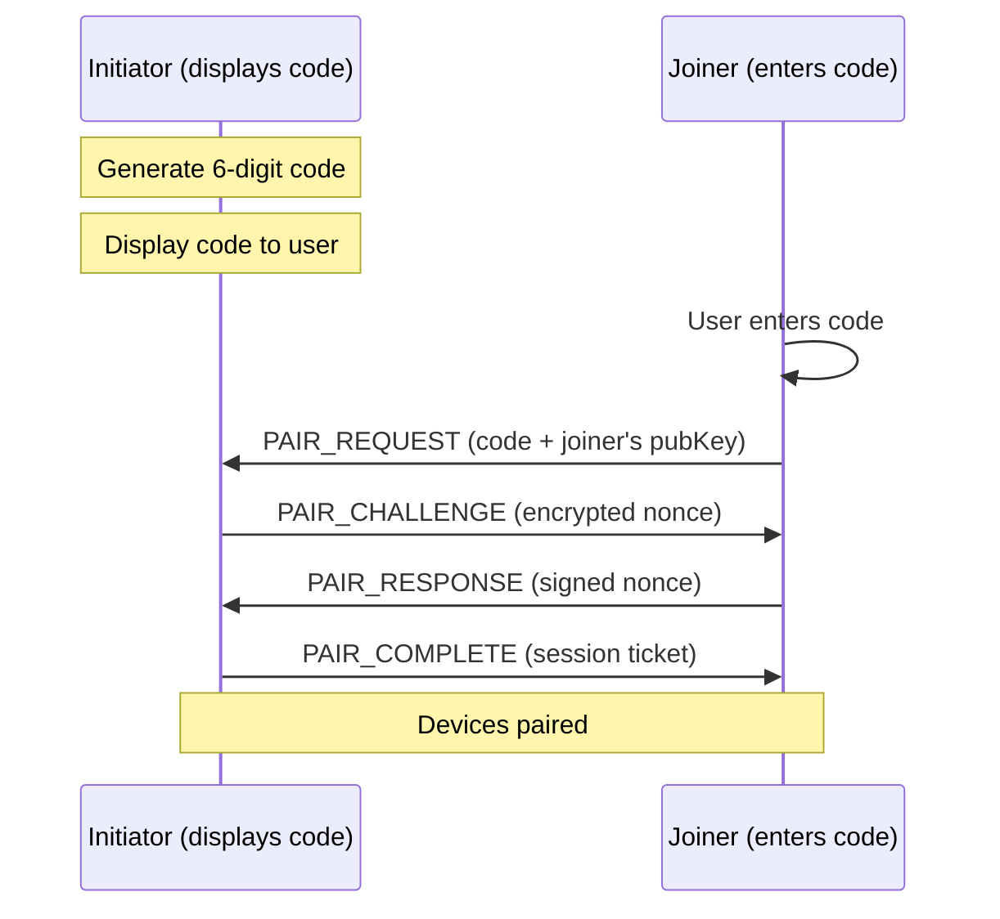

# Device Pairing

Cross-device pairing handshake for BrowserMesh pods.

**Related specs**: [identity-keys.md](../crypto/identity-keys.md) | [session-keys.md](../crypto/session-keys.md) | [boot-sequence.md](../core/boot-sequence.md) | [wire-format.md](../core/wire-format.md) | [webauthn-identity.md](../crypto/webauthn-identity.md)

## 1. Overview

[operations.md](../operations/operations.md) defines a QR code format `browsermesh://join?pod=...` for bootstrap, but no full pairing handshake. This spec defines:

- Two pairing methods: QR code and short numeric code
- Mutual authentication during pairing
- TOFU (Trust On First Use) with optional WebAuthn upgrade
- Paired device registry and revocation

## 2. Pairing Methods

### 2.1 QR Code Pairing

For devices with a camera, the initiator displays a QR code that the joiner scans.



### 2.2 Short Numeric Code Pairing

For devices without a camera (or when QR is impractical), a 6-digit code is displayed.



## 3. QR Payload Format

```typescript
interface QRPairingPayload {
  /** Protocol identifier */
  proto: 'browsermesh';

  /** Pairing version */
  v: 1;

  /** Initiator's Ed25519 public key (base64url) */
  pubKey: string;

  /** Initiator's X25519 ephemeral public key (base64url) */
  dhKey: string;

  /** Session scope / room identifier */
  scope: string;

  /** One-time pairing token (base64url, 16 bytes) */
  token: string;

  /** Expiry timestamp (ms since epoch) */
  exp: number;

  /** Relay hint (optional WebSocket URL for cross-network pairing) */
  relay?: string;
}
```

### URL Format

```
browsermesh://pair?pubKey={base64url}&dhKey={base64url}&scope={scope}&token={base64url}&exp={timestamp}
```

### QR Encoding

```typescript
function generatePairingQR(identity: PodIdentity): QRPairingPayload {
  const ephemeral = crypto.subtle.generateKey('X25519', true, ['deriveBits']);
  const token = crypto.getRandomValues(new Uint8Array(16));

  return {
    proto: 'browsermesh',
    v: 1,
    pubKey: base64urlEncode(identity.publicKey),
    dhKey: base64urlEncode(ephemeral.publicKey),
    scope: 'default',
    token: base64urlEncode(token),
    exp: Date.now() + 300_000,  // 5 minutes
  };
}
```

## 4. Short Code Generation

The 6-digit short code is derived from the initiator's public key and current time:

```typescript
function generateShortCode(publicKey: Uint8Array, timestamp: number): string {
  // Truncated HMAC of public key + time window
  const timeWindow = Math.floor(timestamp / 30_000);  // 30-second windows
  const input = concat(
    publicKey,
    new Uint8Array(new BigInt64Array([BigInt(timeWindow)]).buffer)
  );

  const hash = await crypto.subtle.digest('SHA-256', input);
  const view = new DataView(hash);

  // Extract 6 digits (similar to TOTP)
  const offset = view.getUint8(31) & 0x0f;
  const code = view.getUint32(offset, false) & 0x7fffffff;
  return String(code % 1_000_000).padStart(6, '0');
}
```

**Properties**:
- Changes every 30 seconds
- Not brute-forceable within the window (requires knowing the public key)
- User-friendly (6 digits, easy to type)

## 5. Wire Format Messages

Pairing messages use type codes 0xC0-0xC3 in the Pairing (0xC*) block.

```typescript
enum PairingMessageType {
  PAIR_REQUEST   = 0xC0,
  PAIR_CHALLENGE = 0xC1,
  PAIR_RESPONSE  = 0xC2,
  PAIR_COMPLETE  = 0xC3,
}
```

### 5.1 PAIR_REQUEST (0xC0)

```typescript
interface PairRequestMessage extends MessageEnvelope {
  t: 0xC0;
  p: {
    method: 'qr' | 'short-code';
    token?: Uint8Array;          // Pairing token from QR
    shortCode?: string;          // 6-digit code
    joinerPubKey: Uint8Array;    // Ed25519 public key
    joinerDhKey: Uint8Array;     // X25519 ephemeral key
  };
}
```

### 5.2 PAIR_CHALLENGE (0xC1)

```typescript
interface PairChallengeMessage extends MessageEnvelope {
  t: 0xC1;
  p: {
    nonce: Uint8Array;           // 32-byte random nonce
    encryptedNonce: Uint8Array;  // Nonce encrypted with DH shared secret
    initiatorPubKey: Uint8Array; // Initiator's Ed25519 public key
  };
}
```

### 5.3 PAIR_RESPONSE (0xC2)

```typescript
interface PairResponseMessage extends MessageEnvelope {
  t: 0xC2;
  p: {
    signedNonce: Uint8Array;     // Ed25519 signature over the nonce
    joinerPubKey: Uint8Array;    // Confirmed joiner identity
  };
}
```

### 5.4 PAIR_COMPLETE (0xC3)

```typescript
interface PairCompleteMessage extends MessageEnvelope {
  t: 0xC3;
  p: {
    success: boolean;
    sessionTicket?: Uint8Array;  // For future session resumption
    capabilities: string[];      // Granted capabilities
    deviceName?: string;         // Human-readable device name
  };
}
```

## 6. Mutual Authentication

Both devices prove their identity during pairing:

1. **Joiner proves identity**: Signs the initiator's nonce with their Ed25519 key
2. **Initiator proves identity**: Encrypts the nonce with the DH shared secret (only possible if they hold the private key corresponding to the QR public key)
3. **Binding**: The DH shared secret binds both ephemeral keys, preventing MITM

```typescript
async function verifyPairing(
  initiatorPubKey: Uint8Array,
  joinerPubKey: Uint8Array,
  nonce: Uint8Array,
  signedNonce: Uint8Array
): Promise<boolean> {
  const pubKey = await crypto.subtle.importKey(
    'raw', joinerPubKey, 'Ed25519', false, ['verify']
  );

  return crypto.subtle.verify('Ed25519', pubKey, signedNonce, nonce);
}
```

## 7. TOFU with WebAuthn Upgrade

Initial pairing uses Trust On First Use (TOFU). The first pairing establishes trust based on physical proximity (QR scan or code entry). After initial pairing, devices can upgrade trust using WebAuthn attestation (see [webauthn-identity.md](../crypto/webauthn-identity.md)):

```typescript
interface PairedDevice {
  podId: string;
  publicKey: Uint8Array;
  deviceName: string;
  pairedAt: number;
  lastSeen: number;
  trustLevel: 'tofu' | 'webauthn-attested';
  webauthnCredentialId?: Uint8Array;
}
```

### Trust Upgrade

```typescript
async function upgradeToWebAuthn(
  device: PairedDevice,
  credential: PublicKeyCredential
): Promise<void> {
  // Verify WebAuthn attestation
  // Link credential to device identity
  device.trustLevel = 'webauthn-attested';
  device.webauthnCredentialId = new Uint8Array(credential.rawId);
}
```

## 8. Paired Device Registry

```typescript
class DeviceRegistry {
  private devices: Map<string, PairedDevice> = new Map();

  /** Register a newly paired device */
  register(device: PairedDevice): void {
    this.devices.set(device.podId, device);
  }

  /** Check if a device is paired */
  isPaired(podId: string): boolean {
    return this.devices.has(podId);
  }

  /** Get all paired devices */
  list(): PairedDevice[] {
    return [...this.devices.values()];
  }

  /** Revoke a paired device */
  revoke(podId: string): void {
    this.devices.delete(podId);
    // Notify the revoked device
    // Close active sessions
  }

  /** Update last-seen timestamp */
  touch(podId: string): void {
    const device = this.devices.get(podId);
    if (device) device.lastSeen = Date.now();
  }
}
```

## 9. Revocation and Unpairing

Unpairing removes a device from the registry and terminates all sessions:

1. Remove device from local registry
2. Send PAIR_COMPLETE with `success: false` to the revoked device
3. Close all active sessions with the revoked device
4. Revoke any capabilities granted during pairing

## 10. Security Considerations

| Threat | Mitigation |
|--------|------------|
| QR code photo attack | 5-minute expiry on pairing tokens |
| Short code brute force | Rate limit: 3 attempts per 30-second window |
| MITM | DH shared secret + nonce challenge |
| Stolen session ticket | Tickets bound to device identity key |
| Replay | One-time tokens; nonce in challenge |

## 11. Limits

| Resource | Limit |
|----------|-------|
| QR token expiry | 5 minutes |
| Short code window | 30 seconds |
| Short code attempts | 3 per window |
| Max paired devices | 32 |
| Session ticket expiry | 24 hours |
