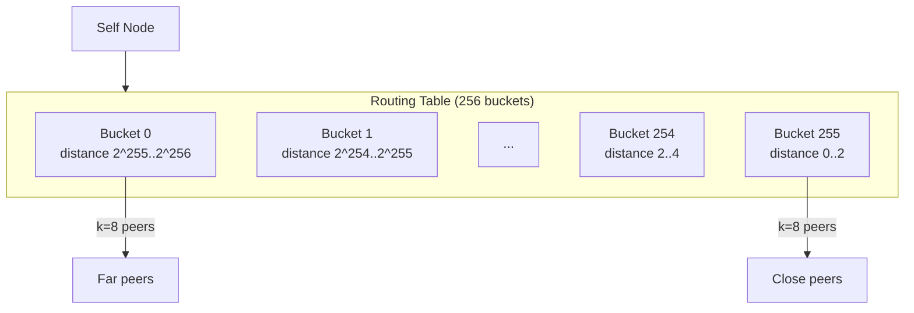

# DHT Routing

Kademlia-style distributed hash table for proximity-based peer discovery in larger meshes.

**Related specs**: [service-model.md](../coordination/service-model.md) | [wire-format.md](../core/wire-format.md) | [identity-keys.md](../crypto/identity-keys.md) | [transport-probing.md](transport-probing.md) | [peer-reputation.md](../coordination/peer-reputation.md)

## 1. Overview

[service-model.md](../coordination/service-model.md) uses name-based routing for service discovery. This works well for small meshes but doesn't scale: every peer must know about every service. This spec adds proximity-based peer discovery using a Kademlia DHT:

- XOR-distance metric on 256-bit Pod IDs
- k-bucket routing table partitioned by prefix length
- Iterative parallel lookups with alpha=3 concurrency
- IndexedDB persistence for peer cache across page reloads
- Integration with service-model for proximity-aware routing



## 2. Wire Format Messages

DHT messages use type codes 0x33-0x37 in the Routing block.

```typescript
enum DhtMessageType {
  DHT_FIND_NODE       = 0x33,
  DHT_FIND_NODE_REPLY = 0x34,
  DHT_STORE           = 0x35,
  DHT_RETRIEVE        = 0x36,
  DHT_RETRIEVE_REPLY  = 0x37,
}
```

### 2.1 DHT_FIND_NODE (0x33)

Request the k closest nodes to a target ID.

```typescript
interface DhtFindNodeMessage {
  t: 0x33;
  p: {
    targetId: string;   // Pod ID to find (or closest to)
    k: number;          // Number of results requested (default: 8)
  };
}
```

### 2.2 DHT_FIND_NODE_REPLY (0x34)

Response with closest known nodes.

```typescript
interface DhtFindNodeReplyMessage {
  t: 0x34;
  p: {
    nodes: DhtNode[];
    closest: string;    // Pod ID of the closest node in the response
  };
}
```

### 2.3 DHT_STORE (0x35)

Store a key-value pair in the DHT.

```typescript
interface DhtStoreMessage {
  t: 0x35;
  p: {
    key: string;         // SHA-256 key
    value: Uint8Array;   // Stored data
    ttl: number;         // Time-to-live in seconds
  };
}
```

### 2.4 DHT_RETRIEVE (0x36)

Retrieve a value by key.

```typescript
interface DhtRetrieveMessage {
  t: 0x36;
  p: {
    key: string;
  };
}
```

### 2.5 DHT_RETRIEVE_REPLY (0x37)

Response to a retrieve request.

```typescript
interface DhtRetrieveReplyMessage {
  t: 0x37;
  p: {
    key: string;
    value: Uint8Array | null;
    found: boolean;
  };
}
```

## 3. DhtNode

```typescript
interface DhtNode {
  /** Pod ID (256-bit, used as DHT address) */
  podId: string;

  /** Network address for direct communication */
  address: string;

  /** Ed25519 public key */
  publicKey: Uint8Array;

  /** Last time this node was seen alive */
  lastSeen: number;

  /** Round-trip time in ms (measured) */
  rtt: number;
}
```

## 4. XOR Distance

Pod IDs are 256-bit SHA-256 hashes. XOR distance measures proximity:

```typescript
function xorDistance(a: string, b: string): bigint {
  const aBuf = hexToBytes(a);
  const bBuf = hexToBytes(b);

  let result = 0n;
  for (let i = 0; i < 32; i++) {
    result = (result << 8n) | BigInt(aBuf[i] ^ bBuf[i]);
  }
  return result;
}

/** Count leading zero bits to determine bucket index */
function bucketIndex(a: string, b: string): number {
  const aBuf = hexToBytes(a);
  const bBuf = hexToBytes(b);

  for (let i = 0; i < 32; i++) {
    const xor = aBuf[i] ^ bBuf[i];
    if (xor !== 0) {
      return i * 8 + Math.clz32(xor) - 24; // Leading zeros in byte
    }
  }
  return 255; // Same ID
}
```

## 5. K-Bucket

Each bucket holds up to k nodes at a similar distance from the local node.

```typescript
class KBucket {
  private nodes: DhtNode[] = [];
  private readonly capacity: number;

  constructor(capacity: number = 8) {
    this.capacity = capacity;
  }

  /** Add or update a node in the bucket */
  update(node: DhtNode): boolean {
    const existingIdx = this.nodes.findIndex(n => n.podId === node.podId);

    if (existingIdx >= 0) {
      // Move to tail (most recently seen)
      this.nodes.splice(existingIdx, 1);
      this.nodes.push(node);
      return true;
    }

    if (this.nodes.length < this.capacity) {
      this.nodes.push(node);
      return true;
    }

    // Bucket full: ping head (least recently seen)
    // If head responds, discard new node; otherwise replace head
    return false;
  }

  /** Remove a node */
  remove(podId: string): boolean {
    const idx = this.nodes.findIndex(n => n.podId === podId);
    if (idx >= 0) {
      this.nodes.splice(idx, 1);
      return true;
    }
    return false;
  }

  /** Get all nodes sorted by distance to target */
  closestTo(targetId: string): DhtNode[] {
    return [...this.nodes].sort((a, b) => {
      const distA = xorDistance(a.podId, targetId);
      const distB = xorDistance(b.podId, targetId);
      return distA < distB ? -1 : distA > distB ? 1 : 0;
    });
  }

  /** Get the least recently seen node (head) */
  get head(): DhtNode | undefined {
    return this.nodes[0];
  }

  get size(): number {
    return this.nodes.length;
  }

  get isFull(): boolean {
    return this.nodes.length >= this.capacity;
  }

  getAll(): DhtNode[] {
    return [...this.nodes];
  }
}
```

## 6. Routing Table

```typescript
class DhtRoutingTable {
  private buckets: KBucket[];
  private readonly localId: string;
  private readonly k: number;

  constructor(localId: string, k: number = 8) {
    this.localId = localId;
    this.k = k;
    this.buckets = Array.from({ length: 256 }, () => new KBucket(k));
  }

  /** Add or update a node */
  update(node: DhtNode): boolean {
    if (node.podId === this.localId) return false;
    const idx = bucketIndex(this.localId, node.podId);
    return this.buckets[idx].update(node);
  }

  /** Remove a node */
  remove(podId: string): boolean {
    const idx = bucketIndex(this.localId, podId);
    return this.buckets[idx].remove(podId);
  }

  /** Find the k closest nodes to a target */
  closestNodes(targetId: string, count: number = this.k): DhtNode[] {
    const all: DhtNode[] = [];
    for (const bucket of this.buckets) {
      all.push(...bucket.getAll());
    }

    return all
      .sort((a, b) => {
        const distA = xorDistance(a.podId, targetId);
        const distB = xorDistance(b.podId, targetId);
        return distA < distB ? -1 : distA > distB ? 1 : 0;
      })
      .slice(0, count);
  }

  /** Total number of known nodes */
  get size(): number {
    return this.buckets.reduce((sum, b) => sum + b.size, 0);
  }
}
```

## 7. Iterative Lookup

Kademlia iterative lookup with alpha=3 parallel queries:

```typescript
class DhtLookup {
  private readonly alpha = 3;  // Parallel queries
  private readonly k = 8;     // Result size

  async findNode(
    targetId: string,
    routingTable: DhtRoutingTable,
    sendQuery: (node: DhtNode, targetId: string) => Promise<DhtNode[]>
  ): Promise<DhtNode[]> {
    // Start with k closest from local table
    const closest = new Map<string, DhtNode>();
    const queried = new Set<string>();

    for (const node of routingTable.closestNodes(targetId, this.k)) {
      closest.set(node.podId, node);
    }

    while (true) {
      // Pick alpha unqueried nodes closest to target
      const toQuery = [...closest.values()]
        .filter(n => !queried.has(n.podId))
        .sort((a, b) => {
          const distA = xorDistance(a.podId, targetId);
          const distB = xorDistance(b.podId, targetId);
          return distA < distB ? -1 : distA > distB ? 1 : 0;
        })
        .slice(0, this.alpha);

      if (toQuery.length === 0) break;

      // Query in parallel
      const results = await Promise.allSettled(
        toQuery.map(async (node) => {
          queried.add(node.podId);
          return sendQuery(node, targetId);
        })
      );

      // Merge results
      let improved = false;
      for (const result of results) {
        if (result.status === 'fulfilled') {
          for (const node of result.value) {
            if (!closest.has(node.podId)) {
              closest.set(node.podId, node);
              improved = true;
            }
          }
        }
      }

      if (!improved) break;
    }

    // Return k closest
    return [...closest.values()]
      .sort((a, b) => {
        const distA = xorDistance(a.podId, targetId);
        const distB = xorDistance(b.podId, targetId);
        return distA < distB ? -1 : distA > distB ? 1 : 0;
      })
      .slice(0, this.k);
  }
}
```

## 8. NodeStore

IndexedDB persistence for the peer cache:

```typescript
class NodeStore {
  private db: IDBDatabase;
  private readonly DB_NAME = 'browsermesh-dht';
  private readonly STORE_NAME = 'nodes';

  async open(): Promise<void> {
    this.db = await new Promise((resolve, reject) => {
      const request = indexedDB.open(this.DB_NAME, 1);
      request.onupgradeneeded = () => {
        const db = request.result;
        if (!db.objectStoreNames.contains(this.STORE_NAME)) {
          const store = db.createObjectStore(this.STORE_NAME, { keyPath: 'podId' });
          store.createIndex('lastSeen', 'lastSeen');
          store.createIndex('rtt', 'rtt');
        }
      };
      request.onsuccess = () => resolve(request.result);
      request.onerror = () => reject(request.error);
    });
  }

  /** Save a node */
  async save(node: DhtNode): Promise<void> {
    const tx = this.db.transaction(this.STORE_NAME, 'readwrite');
    await tx.objectStore(this.STORE_NAME).put(node);
  }

  /** Save multiple nodes */
  async saveBatch(nodes: DhtNode[]): Promise<void> {
    const tx = this.db.transaction(this.STORE_NAME, 'readwrite');
    const store = tx.objectStore(this.STORE_NAME);
    for (const node of nodes) {
      store.put(node);
    }
  }

  /** Load all nodes */
  async loadAll(): Promise<DhtNode[]> {
    const tx = this.db.transaction(this.STORE_NAME, 'readonly');
    return tx.objectStore(this.STORE_NAME).getAll();
  }

  /** Remove stale nodes older than maxAge (ms) */
  async prune(maxAge: number = 3_600_000): Promise<number> {
    const cutoff = Date.now() - maxAge;
    const tx = this.db.transaction(this.STORE_NAME, 'readwrite');
    const store = tx.objectStore(this.STORE_NAME);
    const index = store.index('lastSeen');
    const range = IDBKeyRange.upperBound(cutoff);

    let pruned = 0;
    const cursor = await index.openCursor(range);
    while (cursor) {
      await cursor.delete();
      pruned++;
      await cursor.continue();
    }
    return pruned;
  }
}
```

## 9. Refresh and Maintenance

### 9.1 Bucket Refresh

Buckets that haven't been accessed recently are refreshed by performing a lookup for a random ID in their range:

```typescript
class DhtMaintenance {
  private refreshInterval = 3_600_000; // 1 hour
  private refreshTimers: Map<number, number> = new Map();

  startRefresh(routingTable: DhtRoutingTable, lookup: DhtLookup): void {
    for (let i = 0; i < 256; i++) {
      const timer = setInterval(() => {
        const randomId = this.randomIdInBucket(i, routingTable.localId);
        lookup.findNode(randomId, routingTable, this.sendQuery);
      }, this.refreshInterval);
      this.refreshTimers.set(i, timer);
    }
  }

  /** Generate a random ID that would fall in the given bucket */
  private randomIdInBucket(bucketIdx: number, localId: string): string {
    const bytes = new Uint8Array(32);
    crypto.getRandomValues(bytes);

    // Set the leading bits to ensure XOR distance falls in bucket
    const localBytes = hexToBytes(localId);
    const bitPosition = bucketIdx;
    const byteIdx = Math.floor(bitPosition / 8);
    const bitIdx = 7 - (bitPosition % 8);

    // Copy local ID and flip the target bit
    for (let i = 0; i < byteIdx; i++) {
      bytes[i] = localBytes[i];
    }
    bytes[byteIdx] = localBytes[byteIdx] ^ (1 << bitIdx);

    return bytesToHex(bytes);
  }

  stopRefresh(): void {
    for (const timer of this.refreshTimers.values()) {
      clearInterval(timer);
    }
    this.refreshTimers.clear();
  }
}
```

### 9.2 Stale Node Eviction

When a bucket is full and a new node needs to be added, the least recently seen node is pinged. If it fails to respond, it is evicted:

```typescript
async function evictOrDiscard(
  bucket: KBucket,
  newNode: DhtNode,
  ping: (node: DhtNode) => Promise<boolean>
): Promise<boolean> {
  const head = bucket.head;
  if (!head) return false;

  const alive = await ping(head);
  if (!alive) {
    bucket.remove(head.podId);
    bucket.update(newNode);
    return true;
  }

  // Head still alive — move to tail, discard new node
  bucket.update(head);
  return false;
}
```

## 10. Integration with Service Model

DHT enables proximity-aware service routing. When resolving a service, the DHT can find the closest provider:

```typescript
async function resolveServiceProximity(
  serviceName: string,
  dht: DhtRoutingTable,
  lookup: DhtLookup
): Promise<DhtNode | null> {
  // Hash the service name to get a DHT key
  const serviceKey = await sha256(serviceName);

  // Find the closest nodes to the service key
  const closest = await lookup.findNode(serviceKey, dht, sendQuery);

  // Filter for nodes that actually provide the service
  const providers = closest.filter(
    node => node.capabilities?.includes(serviceName)
  );

  return providers[0] ?? null;
}
```

## 11. Limits

| Resource | Limit |
|----------|-------|
| k (bucket capacity) | 8 |
| alpha (parallel queries) | 3 |
| Max buckets | 256 |
| Lookup timeout | 10 seconds |
| Max stored values | 1000 |
| Value TTL max | 24 hours |
| Value max size | 16 KB |
| Bucket refresh interval | 3600 seconds |
| Stale node threshold | 1 hour |
| Max concurrent lookups | 8 |
| Node store max entries | 4096 |
