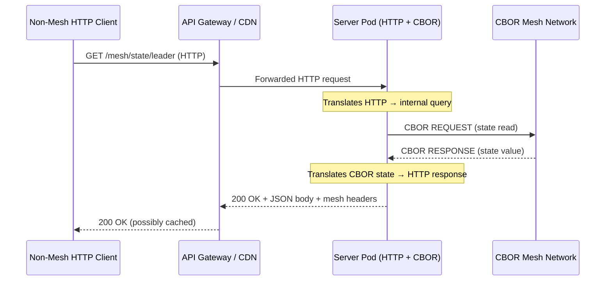
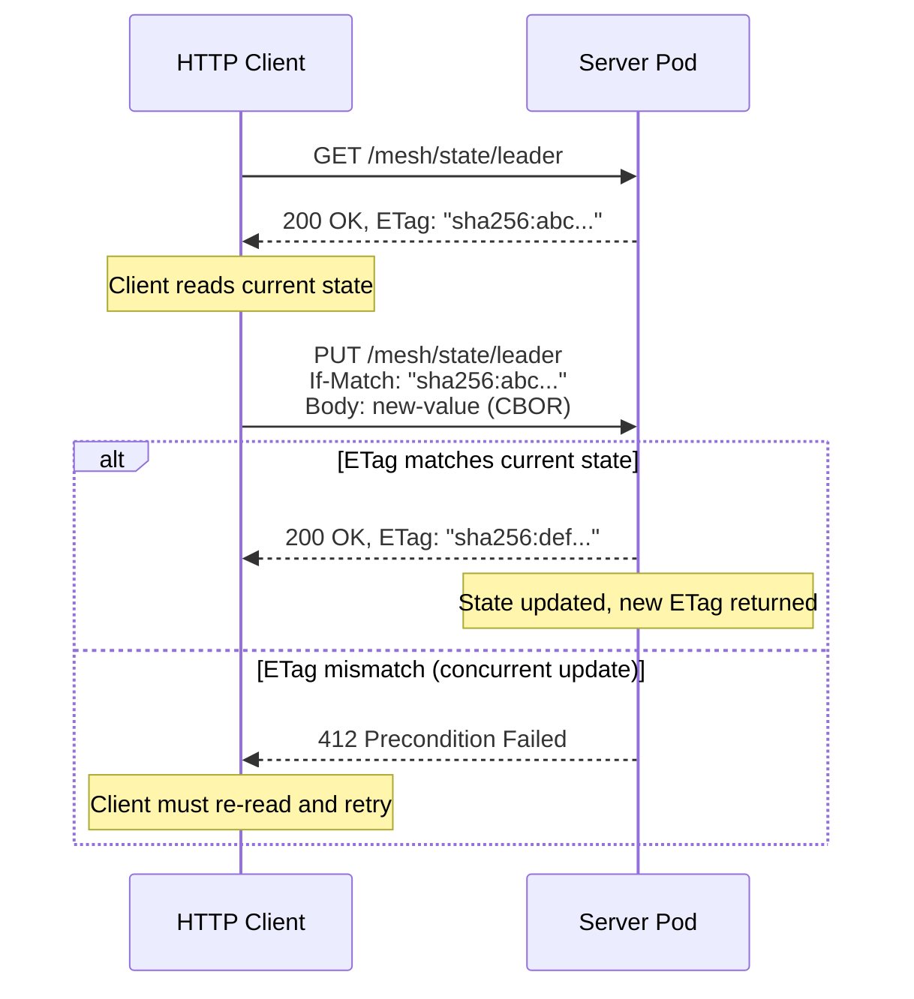

# HTTP Interop Mapping

How BrowserMesh state maps to HTTP when crossing HTTP infrastructure. This is a mapping layer, not a new protocol.

**Related specs**: [wire-format.md](../core/wire-format.md) | [binary-request-protocol.md](binary-request-protocol.md) | [server-pod.md](../extensions/server-pod.md) | [security-model.md](../core/security-model.md)

## 1. Overview

BrowserMesh uses CBOR over WebSocket/WebTransport/WebRTC for peer-to-peer communication. No HTTP translation is needed for mesh-internal traffic. This spec defines how mesh state maps to HTTP headers and endpoints **only** when mesh traffic must cross HTTP infrastructure.

Three scenarios require HTTP interop:

1. **Non-mesh HTTP clients** — REST clients, cURL, monitoring tools that need to query mesh state without speaking CBOR.
2. **CDN and API gateway traversal** — HTTP intermediaries (Cloudflare, nginx, Kubernetes ingress) that inspect headers for routing, caching, or health checks.
3. **Infrastructure health probes** — Kubernetes liveness/readiness probes, load balancer health checks, and uptime monitors that speak HTTP only.

This spec does **not** define a new wire protocol. All mesh-internal communication continues to use the CBOR wire format defined in [wire-format.md](../core/wire-format.md). The HTTP mapping is a convenience layer for interoperability at system boundaries.

## 2. When HTTP Interop Matters



The server pod acts as the translation boundary. Browser pods never need HTTP interop — they communicate directly via CBOR channels.

## 3. Standard Header Mappings

When a server pod responds to HTTP requests, it maps mesh concepts to standard HTTP headers where possible before resorting to custom headers.

| Mesh Concept | HTTP Header | Direction | Example |
|---|---|---|---|
| Protocol version | `X-Mesh-Version` | Response | `X-Mesh-Version: 1` |
| Pod capabilities | `Allow` | Response | `Allow: compute/wasm, storage/ipfs` |
| Capability discovery | `Link` | Response | `Link: </mesh/caps>; rel="describedby"` |
| State content type | `Content-Type` | Response | `Content-Type: application/cbor` |
| State ETag | `ETag` | Response | `ETag: "sha256:a1b2c3..."` |
| Conditional update | `If-Match` | Request | `If-Match: "sha256:a1b2c3..."` |
| Pod identity | `X-Mesh-Pod-Id` | Both | `X-Mesh-Pod-Id: base64url(podId)` |
| Message signature | `X-Mesh-Signature` | Both | `X-Mesh-Signature: base64url(sig)` |
| Timestamp | `X-Mesh-Timestamp` | Both | `X-Mesh-Timestamp: 1709312400000` |

**Principle**: Use standard HTTP headers (`Allow`, `Link`, `ETag`, `If-Match`, `Content-Type`) whenever the semantics align. Reserve `X-Mesh-*` headers for mesh-specific concepts that have no HTTP equivalent.

## 4. Mesh-Specific HTTP Headers

### 4.1 Header Governance

Custom mesh headers follow the same extension governance as CBOR extension fields (see [wire-format.md §11](../core/wire-format.md)):

1. **Atomic values only** — Each header carries a single value (string, number, or base64url-encoded bytes). No JSON objects in header values.
2. **Standard-first** — Before adding a custom header, verify that no standard HTTP header serves the same purpose.
3. **No verb tunneling** — Headers describe state, not actions. Never use headers like `X-Mesh-Action: rebalance`.
4. **Size limits** — Individual header value ≤ 256 bytes. Total custom mesh headers ≤ 2048 bytes.

### 4.2 Curated Header Set

| Header | Type | Description |
|---|---|---|
| `X-Mesh-Pod-Id` | `string` | Base64url-encoded 32-byte Ed25519 public key of the responding pod |
| `X-Mesh-Version` | `int` | Wire format protocol version (currently `1`) |
| `X-Mesh-Capabilities` | `string` | Comma-separated capability list (e.g., `compute/wasm,storage/ipfs`) |
| `X-Mesh-Signature` | `string` | Base64url-encoded Ed25519 signature over the response body |
| `X-Mesh-Timestamp` | `int` | Unix millisecond timestamp of response generation |

```typescript
interface MeshHttpHeaders {
  'X-Mesh-Pod-Id': string;          // base64url(podId)
  'X-Mesh-Version': string;         // "1"
  'X-Mesh-Capabilities'?: string;   // "compute/wasm,storage/ipfs"
  'X-Mesh-Signature'?: string;      // base64url(signature)
  'X-Mesh-Timestamp'?: string;      // "1709312400000"
}

function setMeshHeaders(res: Response, pod: ServerPod): void {
  res.headers.set('X-Mesh-Pod-Id', base64url(pod.publicKey));
  res.headers.set('X-Mesh-Version', String(PROTOCOL_VERSION));
  res.headers.set('X-Mesh-Timestamp', String(Date.now()));

  const caps = pod.capabilities.join(',');
  if (caps.length <= 256) {
    res.headers.set('X-Mesh-Capabilities', caps);
  }
}
```

### 4.3 Header Validation

```typescript
function validateMeshHeaders(headers: Headers): boolean {
  const podId = headers.get('X-Mesh-Pod-Id');
  if (podId && base64urlDecode(podId).byteLength !== 32) {
    return false; // Invalid pod ID length
  }

  const version = headers.get('X-Mesh-Version');
  if (version && !Number.isInteger(Number(version))) {
    return false; // Version must be integer
  }

  // Check total custom header size
  let totalSize = 0;
  for (const [key, value] of headers.entries()) {
    if (key.toLowerCase().startsWith('x-mesh-')) {
      totalSize += new TextEncoder().encode(value).byteLength;
    }
  }

  return totalSize <= 2048;
}
```

## 5. CAS-via-ETag Pattern

Mesh state can be updated atomically using HTTP conditional requests, mapping the mesh's compare-and-swap (CAS) semantics to standard HTTP `ETag`/`If-Match`.

### 5.1 ETag Generation

The ETag is the SHA-256 hash of the CBOR-encoded state value, prefixed with `sha256:`:

```typescript
async function stateETag(state: Uint8Array): Promise<string> {
  const hash = await crypto.subtle.digest('SHA-256', state);
  return `"sha256:${base64url(new Uint8Array(hash))}"`;
}
```

### 5.2 CAS Sequence



### 5.3 Implementation

```typescript
async function handleStateUpdate(
  req: Request,
  key: string,
  mesh: MeshState,
): Promise<Response> {
  const ifMatch = req.headers.get('If-Match');
  const currentState = await mesh.get(key);
  const currentETag = await stateETag(currentState);

  if (ifMatch && ifMatch !== currentETag) {
    return new Response(null, {
      status: 412,
      headers: { 'ETag': currentETag },
    });
  }

  const newValue = new Uint8Array(await req.arrayBuffer());
  const success = await mesh.compareAndSwap(key, currentState, newValue);

  if (!success) {
    // Concurrent modification between read and write
    const updatedETag = await stateETag(await mesh.get(key));
    return new Response(null, {
      status: 412,
      headers: { 'ETag': updatedETag },
    });
  }

  const newETag = await stateETag(newValue);
  return new Response(null, {
    status: 200,
    headers: { 'ETag': newETag },
  });
}
```

## 6. Standard Endpoints

Server pods exposing HTTP interop SHOULD implement these endpoints:

### 6.1 Health Check

```
GET /healthz

200 OK
Content-Type: application/json

{
  "status": "healthy",
  "pod_id": "base64url(podId)",
  "uptime_ms": 3600000,
  "mesh_peers": 5,
  "version": 1
}
```

Used by Kubernetes liveness probes, load balancers, and monitoring tools. Returns `200` when the pod is operational, `503` when degraded.

### 6.2 Mesh Discovery

```
HEAD /mesh

200 OK
X-Mesh-Pod-Id: base64url(podId)
X-Mesh-Version: 1
X-Mesh-Capabilities: compute/wasm,storage/ipfs
Allow: GET, HEAD, OPTIONS
```

Lightweight probe — no body. Useful for CDN health checks and service discovery. Returns all mesh headers.

```
OPTIONS /mesh

204 No Content
Allow: GET, HEAD, OPTIONS, PUT
X-Mesh-Version: 1
Access-Control-Allow-Origin: *
Access-Control-Allow-Headers: X-Mesh-Pod-Id, X-Mesh-Signature, X-Mesh-Timestamp, If-Match
```

CORS preflight support for browser-based HTTP clients querying the mesh.

### 6.3 State Access

```
GET /mesh/state/{key}

200 OK
Content-Type: application/cbor
ETag: "sha256:abc123..."
X-Mesh-Pod-Id: base64url(podId)
X-Mesh-Timestamp: 1709312400000

<CBOR-encoded value>
```

```
PUT /mesh/state/{key}
Content-Type: application/cbor
If-Match: "sha256:abc123..."

<CBOR-encoded new value>
```

Responses: `200` (success), `404` (key not found), `412` (ETag mismatch), `413` (value exceeds 64KB CBOR limit).

### 6.4 Endpoint Summary

| Method | Path | Purpose | Conformance |
|---|---|---|---|
| `GET` | `/healthz` | Liveness/readiness probe | HTTP-Core |
| `HEAD` | `/mesh` | Mesh discovery (headers only) | HTTP-Core |
| `OPTIONS` | `/mesh` | CORS preflight + capability discovery | HTTP-Core |
| `GET` | `/mesh/state/{key}` | Read mesh state | HTTP-Full |
| `PUT` | `/mesh/state/{key}` | CAS state update (requires `If-Match`) | HTTP-Full |

## 7. HTTP/3 Fast-Path Guidance

When server pods are reachable over HTTP/3 (QUIC), the HEADERS-only frame pattern provides low-latency probes without body overhead:

### 7.1 Strict Mode

In strict mode, server pods send mesh state exclusively via CBOR over WebTransport or WebSocket. HTTP/3 is used only for health checks and discovery (§6.1, §6.2). No state reads or CAS operations over HTTP.

```typescript
// Strict mode: HTTP/3 for probes only
const strictEndpoints = ['/healthz', '/mesh'];
```

### 7.2 Relaxed Mode

In relaxed mode, all §6 endpoints are available over HTTP/3. HEADERS-only frames are used for `HEAD /mesh` probes. State access uses standard HTTP/3 request/response with CBOR bodies.

```typescript
// Relaxed mode: full endpoint set over HTTP/3
const relaxedEndpoints = ['/healthz', '/mesh', '/mesh/state/*'];
```

**Recommendation**: Use strict mode in production. Relaxed mode is appropriate for development, debugging, and environments where all HTTP infrastructure is trusted.

## 8. Conformance Levels

### 8.1 HTTP-Core

Minimum conformance for HTTP interop. Required for any server pod exposed through HTTP infrastructure.

| Requirement | Description |
|---|---|
| `GET /healthz` | Health check endpoint returning pod status |
| `HEAD /mesh` | Discovery probe with mesh headers |
| `OPTIONS /mesh` | CORS preflight support |
| Mesh headers | `X-Mesh-Pod-Id` and `X-Mesh-Version` on all responses |
| Header validation | Validate incoming `X-Mesh-*` headers per §4.3 |

### 8.2 HTTP-Full

Extends HTTP-Core with state access and CAS operations.

| Requirement | Description |
|---|---|
| All HTTP-Core | Everything from §8.1 |
| `GET /mesh/state/{key}` | State read with ETag |
| `PUT /mesh/state/{key}` | CAS update with `If-Match` |
| ETag generation | SHA-256 of CBOR state per §5.1 |
| `412` responses | Correct conflict detection on CAS failure |
| `X-Mesh-Signature` | Ed25519 signature on state responses |
| `X-Mesh-Timestamp` | Millisecond timestamp on all responses |

```typescript
type ConformanceLevel = 'HTTP-Core' | 'HTTP-Full';

function checkConformance(pod: ServerPod): ConformanceLevel {
  const hasHealthz = pod.hasEndpoint('GET', '/healthz');
  const hasMeshHead = pod.hasEndpoint('HEAD', '/mesh');
  const hasMeshOptions = pod.hasEndpoint('OPTIONS', '/mesh');

  if (!hasHealthz || !hasMeshHead || !hasMeshOptions) {
    throw new Error('Pod does not meet HTTP-Core conformance');
  }

  const hasStateGet = pod.hasEndpoint('GET', '/mesh/state/*');
  const hasStatePut = pod.hasEndpoint('PUT', '/mesh/state/*');

  return (hasStateGet && hasStatePut) ? 'HTTP-Full' : 'HTTP-Core';
}
```

## 9. Security Considerations

### 9.1 Never Trust Headers Alone

HTTP headers can be stripped, modified, or forged by intermediaries. For any security-sensitive operation:

- **Verify signatures end-to-end.** `X-Mesh-Signature` provides integrity for the response body, but the header itself can be stripped. Clients MUST verify signatures against the pod's known public key, not trust the `X-Mesh-Pod-Id` header at face value.
- **Use CBOR-level authentication for writes.** CAS updates via `PUT` SHOULD include a signed CBOR envelope in the body. The `If-Match` ETag prevents stale writes, but the CBOR signature prevents unauthorized writes.
- **TLS is required.** All HTTP interop endpoints MUST be served over HTTPS. Mesh headers contain pod identity information that must not be exposed in cleartext.

### 9.2 Header Stripping by Intermediaries

Some CDNs and reverse proxies strip unknown headers. Server pods SHOULD:

1. Verify that `X-Mesh-Pod-Id` survives round-trips through their infrastructure.
2. Fall back to including pod identity in the response body if headers are stripped.
3. Log header stripping events for operational visibility.

```typescript
function detectHeaderStripping(
  sentHeaders: string[],
  receivedHeaders: Headers,
): string[] {
  return sentHeaders.filter(h => !receivedHeaders.has(h));
}
```

### 9.3 Replay Protection

HTTP responses with `X-Mesh-Timestamp` SHOULD be rejected if the timestamp is more than 30 seconds old (configurable). This limits the window for response replay attacks through caching proxies.

```typescript
const MAX_TIMESTAMP_SKEW_MS = 30_000;

function validateTimestamp(headers: Headers): boolean {
  const ts = Number(headers.get('X-Mesh-Timestamp'));
  if (!ts) return true; // Timestamp is optional
  return Math.abs(Date.now() - ts) < MAX_TIMESTAMP_SKEW_MS;
}
```

## 10. Implementation Notes

### 10.1 Fetch Bridge Integration

The [binary-request-protocol.md](binary-request-protocol.md) defines a Fetch-compatible bridge for translating between HTTP semantics and CBOR wire format. HTTP interop endpoints SHOULD use this bridge internally:

```typescript
import { FetchBridge } from './binary-request-protocol';

class HttpInteropHandler {
  private bridge: FetchBridge;

  constructor(pod: ServerPod) {
    this.bridge = new FetchBridge(pod);
  }

  async handleRequest(httpReq: Request): Promise<Response> {
    const url = new URL(httpReq.url);

    if (url.pathname === '/healthz') {
      return this.healthCheck();
    }

    if (url.pathname.startsWith('/mesh/state/')) {
      const key = url.pathname.slice('/mesh/state/'.length);
      return this.bridge.handleStateRequest(httpReq, key);
    }

    return new Response('Not Found', { status: 404 });
  }
}
```

### 10.2 Content Negotiation

Server pods SHOULD support content negotiation via the `Accept` header:

- `application/cbor` — Raw CBOR state (default, most efficient)
- `application/json` — JSON representation of state (for non-mesh clients)

```typescript
function negotiateContentType(req: Request): 'cbor' | 'json' {
  const accept = req.headers.get('Accept') || '';
  if (accept.includes('application/json') && !accept.includes('application/cbor')) {
    return 'json';
  }
  return 'cbor';
}
```

### 10.3 CBOR Size Limits

HTTP interop respects the same 64KB CBOR message limit defined in [wire-format.md §9](../core/wire-format.md). State values exceeding this limit MUST return `413 Payload Too Large`. HTTP intermediaries may impose their own body size limits — see [server-pod.md §13](../extensions/server-pod.md) for failure mode analysis.
